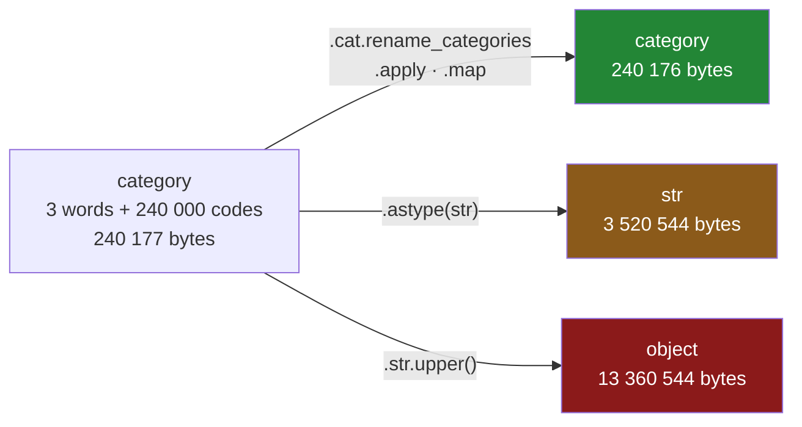

# 4.3 — The operation that gave back text

## One-line answer

An operation that reaches every **row** — `.str` anything, `.astype(str)`, string arithmetic —
throws the category list away and hands back a text column that is up to fifty-five times bigger,
while an operation that reaches the **category list** keeps the dtype; and nothing warns you which
kind you just called.

---

## The story

The flat wants the shopping list on the fridge door, and the handwriting on the fridge door has
always been in capitals. So somebody takes the file, runs the everything-in-capitals operation over
the shop-part column, and prints it.

It works. `DAIRY`, `BAKERY`, `DRY GOODS`. The paper goes on the fridge and everyone is happy.

A week later somebody notices that the same script, which used to run without anyone thinking about
it, has started making the laptop's fan spin. Nothing was added. No new rows, no new columns, no new
step. The only change was the capitals.

The column that used to hold three words and a quarter of a million tiny numbers now holds a quarter
of a million copies of the word `DRY GOODS` again — exactly the situation the flat spent the whole
day getting out of. One operation put it back, and the only visible evidence was that the letters
got bigger.

---

## The idea in plain language

A categorical column is two things: a **category list**, holding each distinct value once, and a
**codes array**, holding one small number per row saying which entry of the list that row means
([2.1](../02-the-category-dtype/2.1-two-arrays-instead-of-one.md)). Every saving comes from the fact
that the words live in the list and the rows only hold numbers.

So there are two places an operation can do its work, and which one it picks decides everything.

**Work on the list.** Uppercase three words, get three words back, keep the same codes. The column
stays categorical and stays small. The work is proportional to the number of *distinct values*.

**Work on the rows.** Expand every code into its word, apply the operation to all quarter of a
million of them, and hand back whatever comes out. The result is a text column, the codes are gone,
and the work is proportional to the number of *rows*.

Nothing in the method name tells you which you are getting. `.str.upper()` and
`.cat.rename_categories(str.upper)` produce identical values and differ in size by a factor of
fifty-five.

The rule that actually holds, and which the measurements below establish:

- **`.str` always works on the rows.** The `.str` accessor is the text accessor
  ([Day 33, 1.1](../../../day-33-text-and-time/parts/01-the-str-accessor/1.1-the-column-that-has-no-lower.md)),
  and to use it pandas must first turn the column back into text.
- **`.astype(str)` and any arithmetic on the result work on the rows**, by definition — you asked
  for text.
- **`.apply` and `.map` work on the list**, which is genuinely surprising, and there is a condition
  attached that the mechanism section makes explicit.
- **`.cat` anything works on the list.** That is what the accessor is for.

One term, because the output below shows it and it is easy to misread. `object` is the **old** dtype
pandas used for text before 3.0: one pointer per row plus a separate Python string object behind
each pointer
([Day 26, 2.1](../../../day-26-frames-and-copy-on-write/parts/02-the-str-dtype/2.1-text-used-to-be-object.md)).
It is not the same as `str`, and it is several times more expensive. A `.str` call on a categorical
column returns `object`, not `str`, which is why the worst number in this document is as bad as it
is.

---

## Why Setu needs it

- **[4.4](4.4-concat-and-the-dtype-that-went-back-to-text.md), next**, is the fourth way the dtype
  disappears, and it is the one you cannot fix by choosing a different method.
- **[7.1](../07-the-module/7.1-the-audit-module.md)**'s `categorise()` asserts the resulting dtype
  instead of trusting it, and this part is why that assertion exists rather than being pedantry.
- **[7.2](../07-the-module/7.2-the-test-that-can-go-red.md)** carries a memory-ratio assertion, and
  a pipeline stage that silently returns text is exactly the mutation it must catch.
- **Day 35** compares pandas with another dataframe library on memory layout. A benchmark whose
  pandas side accidentally decayed to `object` halfway through measures the accident.
- **Phase 8**'s feature engineering runs a chain of transforms over categorical columns. One
  `.str.strip()` in the middle of that chain turns a compact frame into an `object` frame for every
  stage that follows.

---

## The mechanism

Build the year file, convert `aisle`, and measure every operation against the untouched column.

```python
import numpy as np
import pandas as pd

ITEMS = ["milk", "bread", "eggs", "rice"]
AISLES = ["bakery", "dairy", "dry goods"]
SIZES = ["small", "medium", "large"]


def a_year(n: int = 240_000) -> pd.DataFrame:
    """A year of the flat's shopping: the same few words, over and over."""
    rng = np.random.default_rng(34)
    return pd.DataFrame(
        {
            "item": pd.Series(rng.choice(ITEMS, n), dtype="str"),
            "aisle": pd.Series(rng.choice(AISLES, n), dtype="str"),
            "size": pd.Series(rng.choice(SIZES, n), dtype="str"),
            "price": np.round(rng.uniform(0.40, 6.00, n), 2),
        }
    )


year = a_year()
year["aisle"] = year["aisle"].astype("category")
aisle = year["aisle"]
base = int(aisle.memory_usage(deep=True))


def report(label: str, out: pd.Series) -> None:
    used = int(out.memory_usage(deep=True))
    print(f"{label:24s} {str(out.dtype):9s} {used:9d}  x{used / base:6.2f}")


print(f"{'operation':24s} {'dtype':9s} {'bytes':>9s}  {'ratio':>7s}")
report("aisle (untouched)", aisle)
report(".str.upper()", aisle.str.upper())
report(".astype(str)", aisle.astype(str))
report(".astype(str) + '!'", aisle.astype(str) + "!")
report(".str.len()", aisle.str.len())
report(".apply(str.upper)", aisle.apply(str.upper))
report(".cat.rename_categories", aisle.cat.rename_categories(str.upper))
```

**Line by line:**

- `np.random.default_rng(34)` — the day number as the seed, inside a function with a fixed body so
  that the draws happen in the same order every time and the byte counts are comparable with
  [1.1](../01-the-repeated-word/1.1-the-same-short-word-over-and-over.md)'s
  ([Day 20, 4.2](../../../day-20-arrays-and-dtypes/parts/04-random/4.2-the-seed-is-part-of-the-result.md)).
- `base` is measured **once**, on the Series, and every later figure is divided by it. A ratio is
  what survives being run on a different machine; an absolute byte count is not.
- `memory_usage(deep=True)` on a Series includes its index, which is a `RangeIndex` costing 132
  bytes here ([1.2](../01-the-repeated-word/1.2-what-memory-usage-actually-counts.md)). It is the
  same 132 bytes in every row of the table, so it cancels out of the ratios.
- `report` takes the **result** of an operation, not a description of one, so there is no way for the
  table to disagree with what the code actually did.
- `str(out.dtype)` because a dtype object formats badly inside an f-string width specifier.
- `.astype(str) + "!"` is included to make the point that arithmetic on text is a second full-size
  column, not a free tweak to the first.

```text
operation                dtype         bytes    ratio
aisle (untouched)        category     240177  x  1.00
.str.upper()             object     13360544  x 55.63
.astype(str)             str         3520544  x 14.66
.astype(str) + '!'       str         3760544  x 15.66
.str.len()               int64       1920132  x  7.99
.apply(str.upper)        category     240176  x  1.00
.cat.rename_categories   category     240176  x  1.00
```

Read the second row twice. **`.str.upper()` cost fifty-five and a half times the memory of the
column it was called on**, and it did so by returning `object` — the pre-3.0 layout with a Python
string object per row — rather than `str`. Compare it with `.astype(str)` on the row below, which
produces the same words in the modern layout for a quarter of the bytes. Both are worse than the
categorical; one is very much worse than the other, and nothing in the call site says so.

`.str.len()` is the honest middle case. It returns `int64`, which is a correct and reasonable
result, and it still costs eight times the categorical column, because there are two hundred and
forty thousand answers and each is eight bytes. The lesson is not "never leave the categorical
dtype"; it is "know when you are leaving it".

### Why `.apply` came out at 1.00

That row of the table is the surprising one, and it is worth proving rather than asserting.

```python
calls = []


def spy(value):
    calls.append(value)
    return value.upper()


small = pd.Series(["dairy", "bakery", "dairy", "dry goods"], dtype="str").astype("category")
out = small.apply(spy)
print("rows in the column  :", len(small))
print("times spy was called:", len(calls), calls)
print("result dtype        :", out.dtype)
print("result values       :", out.tolist())
```

**Line by line:**

- `spy` records every value it is handed before doing the work. Counting calls is the only way to
  find out **what** `.apply` is iterating over, and no documentation sentence substitutes for it.
- `calls` is a plain list, appended to inside the function. It is a deliberate side effect, used
  here as an instrument and never in real code.
- `small` is the four-row envelope frame's aisle column, so the answer is small enough to read.
- Both the count **and** the dtype are printed. Either one alone leaves the conclusion ambiguous.

```text
rows in the column  : 4
times spy was called: 3 ['bakery', 'dairy', 'dry goods']
result dtype        : category
result values       : ['DAIRY', 'BAKERY', 'DAIRY', 'DRY GOODS']
```

**Three calls for four rows.** `.apply` on a categorical column runs the function once per
*category*, in category order, and then rebuilds the codes. That is why it is free at scale: on the
year file it calls your function three times, not two hundred and forty thousand times, which is the
exact opposite of `.apply`'s reputation on an ordinary column
([Day 29, 1.5](../../../day-29-iteration-and-order/parts/01-the-loop/1.5-apply-is-a-loop-wearing-a-hat.md)).

There are two catches, and both show up on four rows.

```python
print("apply(len)       :", small.apply(len).dtype, small.apply(len).tolist())
first = small.apply(lambda v: v[0])
print("apply(first char):", first.dtype, first.tolist())
```

**Line by line:**

- `apply(len)` returns a whole number per category. The values are numbers; the question is what
  dtype wraps them.
- `lambda v: v[0]` takes the first letter. `dairy` and `dry goods` both give `d`, so two categories
  **collapse into one** — that is the condition being tested.

```text
apply(len)       : category [5, 6, 5, 9]
apply(first char): str ['d', 'b', 'd', 'd']
```

The first catch: `apply(len)` gives you a **categorical column of integers**, not an `int64` column.
Every arithmetic operation downstream then behaves differently from the way you expect, and
`.sum()` on it is not the same code path as `.sum()` on an integer column. If you wanted a number,
say so: `small.cat.codes` for positions, or `small.astype(str).str.len()` when you actually want the
row-wise answer and are willing to pay for it.

The second catch: when the function maps two categories onto the same result, pandas cannot rebuild
a valid category list, so it falls back to text. **The dtype your code returns therefore depends on
the data**, not only on the code — a mapping that is one-to-one on today's three aisles and collapses
on tomorrow's four silently changes the output dtype of a function you did not edit.

### The pipeline, measured end to end

```python
frame = a_year()
frame["aisle"] = frame["aisle"].astype("category")
print("frame total, aisle categorical :", int(frame.memory_usage(deep=True).sum()))
frame["aisle"] = frame["aisle"].str.upper()
print("after .str.upper()             :", int(frame.memory_usage(deep=True).sum()))
frame["aisle"] = frame["aisle"].astype("category")
print("after re-asserting category    :", int(frame.memory_usage(deep=True).sum()))
```

**Line by line:**

- `memory_usage(deep=True).sum()` collapses the per-column Series into one number for the frame,
  index included. On a frame you almost always want the `.sum()`; forgetting it is
  [1.1](../01-the-repeated-word/1.1-the-same-short-word-over-and-over.md)'s trap.
- The three prints bracket one operation each, so the middle number is attributable to exactly one
  line of code.
- The last line re-runs `astype("category")` on text that is now uppercase, which is the "fix it
  afterwards" move most people reach for.

```text
frame total, aisle categorical : 8300008
after .str.upper()             : 21420375
after re-asserting category    : 8300008
```

The frame went from 8.3 MB to 21.4 MB and back, on one column, from one method call. Re-asserting
recovers every byte — which is the good news, and also the trap: **the fix works, so nobody
investigates.** A pipeline that converts, decays, and re-converts at every stage pays the peak twice
per stage, and the peak is what decides whether the job fits in memory.



---

## When it breaks

Two of the methods people reach for do not decay quietly — they stop:

```text
$ uv run python -c "
import pandas as pd
aisle = pd.Series(['dairy','bakery','dairy','dry goods'], dtype='str').astype('category')
aisle.replace('dairy', 'chilled')
"
```

```text
Traceback (most recent call last):
  File "<string>", line 4, in <module>
  File "...\pandas\core\generic.py", line 7838, in replace
    new_data = self._mgr.replace(
               ^^^^^^^^^^^^^^^^^^
  File "...\pandas\core\internals\blocks.py", line 711, in replace
    putmask_inplace(blk.values, mask, value)
  File "...\pandas\core\array_algos\putmask.py", line 57, in putmask_inplace
    values[mask] = value
    ~~~~~~^^^^^^
  File "...\pandas\core\arrays\_mixins.py", line 272, in __setitem__
    value = self._validate_setitem_value(value)
            ^^^^^^^^^^^^^^^^^^^^^^^^^^^^^^^^^^^
  File "...\pandas\core\arrays\categorical.py", line 1678, in _validate_scalar
    raise TypeError(
TypeError: Cannot setitem on a Categorical with a new category (chilled), set the categories first
```

**What it means.** `replace` writes new values into the existing array rather than rebuilding the
category list, so it hits the same wall as a `.loc` assignment
([4.1](4.1-the-value-that-is-not-a-category.md)). Note the asymmetry: replacing `dairy` with
`bakery` — a value already in the list — succeeds and stays categorical. The method works or raises
depending on the *value* you pass, which is a hard thing to test for. The right tool is
`.cat.rename_categories({"dairy": "chilled"})`, which edits the list and cannot raise this.

The second is the one that bites hardest, because filling blanks is a step almost every pipeline has:

```text
$ uv run python -c "
import pandas as pd
aisle = pd.Series(['dairy', None, 'bakery'], dtype='str').astype('category')
aisle.fillna('unknown')
"
```

```text
Traceback (most recent call last):
  File "<string>", line 4, in <module>
  File "...\pandas\core\generic.py", line 7074, in fillna
    new_data = self._mgr.fillna(value=value, limit=limit, inplace=inplace)
               ^^^^^^^^^^^^^^^^^^^^^^^^^^^^^^^^^^^^^^^^^^^^^^^^^^^^^^^^^^^
  File "...\pandas\core\internals\blocks.py", line 1911, in fillna
    new_values = self.values.fillna(value=value, limit=limit)
                 ^^^^^^^^^^^^^^^^^^^^^^^^^^^^^^^^^^^^^^^^^^^^
  File "...\pandas\core\arrays\_mixins.py", line 368, in fillna
    new_values[mask] = value
    ~~~~~~~~~~^^^^^^
  File "...\pandas\core\arrays\categorical.py", line 1678, in _validate_scalar
    raise TypeError(
TypeError: Cannot setitem on a Categorical with a new category (unknown), set the categories first
```

**What it means.** `fillna` is an assignment wearing a friendlier name, and `"unknown"` is not in
the list. `fillna` is a claim about what the blank meant
([Day 30, 5.1](../../../day-30-missing-data/parts/05-filling/5.1-fillna-is-a-claim.md)), and on a
categorical column the claim has to be declared before it can be made:
`.cat.add_categories(["unknown"]).fillna("unknown")`. Filling with a value that is already a category
— `fillna("dairy")` — works and stays categorical, so once again the behaviour depends on the
argument rather than on the method.

One near-miss worth naming, because it looks like this bug and is not. `aisle.sort_values()` reports
2 160 045 bytes, nine times the original, while still saying `category`. Nothing decayed: sorting
replaced the `RangeIndex` — 132 bytes, because a range is stored as three numbers — with an explicit
index of 240 000 eight-byte labels
([Day 29, 4.1](../../../day-29-iteration-and-order/parts/04-sorting/4.1-sort-values-the-order-you-asked-for.md)).
The values are still 240 045 bytes. **Check the dtype before you blame the dtype.**

---

## In production

**What a professional writes instead of the teaching version.** Not a comment saying "keep this
categorical". An assertion that fails the build when a stage loses the dtype:

```python
import pandas as pd


class AuditError(ValueError):
    """A frame failed a check the pipeline depends on."""


def assert_categorical(
    frame: pd.DataFrame, expected: dict[str, pd.CategoricalDtype]
) -> pd.DataFrame:
    """Raise unless every named column still carries exactly the dtype it was given."""
    wrong = {
        name: str(frame[name].dtype)
        for name, dtype in expected.items()
        if frame[name].dtype != dtype
    }
    if wrong:
        raise AuditError(f"dtype lost on: {wrong}")
    return frame
```

**Line by line:**

- `expected` maps column name to the exact `CategoricalDtype` object, not to the string
  `"category"`. `frame[name].dtype == "category"` is `True` for any categorical whatsoever, including
  one whose category list has been silently rebuilt from different data — a distinction
  [4.4](4.4-concat-and-the-dtype-that-went-back-to-text.md) turns into a whole part.
- The dictionary comprehension collects **every** wrong column before raising, so one run of the
  pipeline tells you about all four broken stages rather than the first.
- `str(frame[name].dtype)` in the message, so the exception says `'object'` and you know instantly
  that a `.str` call did it rather than a `concat`.
- It returns the frame, so it can sit inline in a chain — `assert_categorical(step(frame), EXPECTED)`
  — instead of being an easily-forgotten separate statement.

Run before and after a `.str.upper()`, it prints nothing and then:

```text
AuditError : dtype lost on: {'aisle': 'object'}
```

**What changes at scale.** The ratio is what scales, and it gets worse rather than better. The 55×
figure here comes from three short words; a column of longer values — a country name, a URL host, a
model identifier — has a higher character count per row, so the `object` result grows while the
categorical stays at one byte per row plus the list. Under concurrency it is worse again: the
decayed column is materialised in full **before** the old one is released, so peak memory during the
operation is the sum of both, and several workers doing this at once on the same machine is how a
job that "fits" starts being killed by the operating system.

**The failure that only shows with real data.** A cleaning step ended with `.str.strip()` on six
categorical columns, because trailing spaces had been a problem once. On the development sample —
ten thousand rows — the frame grew by a few megabytes and nobody looked. In production the same six
lines turned a 4 GB frame into something that did not fit, and the job died in a stage that had not
been touched in months. The give-away in the log was not memory at all: it was `dtype: object` in a
`df.info()` dump that had said `category` the week before.

**The review comment a senior engineer leaves.** *"`.str.upper()` on a categorical column returns
`object` and materialises every row — measure it, it is about fifty-five times the memory here.
Use `.cat.rename_categories(str.upper)`, which touches three values instead of a quarter of a
million. And put an `assert_categorical` at the end of this stage; there are four more `.str` calls
below and I do not want to find the next one from a memory graph."*

**The interview question.** *"You convert a column to `category` and the memory saving disappears
somewhere in your pipeline. How do you find where?"* The answer that shows experience is a
bisection, not a guess: print `df.dtypes` after each stage — or assert them — and find the first
stage where the column is no longer `category`. Then name the culprit by category: `.str` anything,
`.astype(str)`, string concatenation, `replace` with a new value, `fillna` with an undeclared value,
or a `concat`/`merge` against a frame with a different category list. The follow-up worth
volunteering is that the right place for the conversion is usually the **end** of the pipeline, or
re-asserted after every stage — converting once at read time and hoping is how you get a frame that
is categorical in the first stage and `object` in the last.

---

## Check yourself

```bash
uv run python -c "
import numpy as np
import pandas as pd
rng = np.random.default_rng(34)
n = 240_000
aisle = pd.Series(rng.choice(['bakery', 'dairy', 'dry goods'], n), dtype='str').astype('category')
base = aisle.memory_usage(deep=True)
for label, out in [
    ('untouched', aisle),
    ('.str.upper()', aisle.str.upper()),
    ('.cat.rename_categories', aisle.cat.rename_categories(str.upper)),
]:
    b = out.memory_usage(deep=True)
    print(f'{label:24s} {str(out.dtype):9s} {b:9d}  x{b / base:6.2f}')
"
```

Two of those three lines produce exactly the same values. Say which two, and say what the third
column of the printout costs you for choosing the wrong one.

**Answer out loud, without scrolling up:**

> `.apply(str.upper)` on a categorical column with 240 000 rows and three categories calls your
> function three times and returns a categorical. Say what has to be true of the function for that
> to happen, and say what dtype you get when it is not true.

---

**Next:** [4.4 — concat, merge, and the dtype that went back to text](4.4-concat-and-the-dtype-that-went-back-to-text.md).
