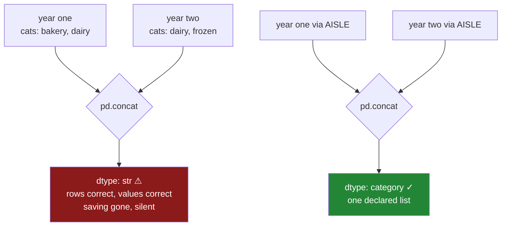

# 4.4 — `concat`, `merge`, and the dtype that went back to text

## One-line answer

Two categorical columns only stay categorical when they share the **same category list**; stack or
join two whose lists differ and pandas falls back to text — no error, correct values, right row count,
and every byte of the saving gone.

---

## The story

The flat has kept the file for two years now, one per year, and somebody wants both in one table so
the Christmas comparison is possible.

Both files were built the same way. Both were converted the same way — the aisle column to a category,
because that worked so well. Both are fifteen times smaller than they were.

They stack the two, which is one line, and it runs. Right number of rows: last year's plus this
year's. Every value is correct. Nothing is missing.

And the combined column is text again.

Not partly. Not for the new rows. The whole column, both years, back to strings, and the frame is
suddenly a great deal bigger than the two halves that went into it. Nothing warned. The only reason
anybody noticed is that the laptop got slow again, which is where the day started.

What happened is that the freezer opened in the second year. Last year's file has three aisles in it;
this year's has four. Two category columns whose lists disagree are two **different dtypes**, and when
pandas has to put them in one column it falls back to the one type that can hold both.

---

## The idea in plain language

A `category` dtype is not just "category". It is **category over this exact list of labels, in this
exact order, ordered or not**. Two columns are the same dtype only if all of that matches.

That is easy to say and easy to forget, because the dtype *prints* as `category` in every frame you
look at. Two columns that both say `category` can be entirely different types, and nothing on screen
distinguishes them.

So when pandas is asked to combine two columns, it checks. If the dtypes match exactly, the result is
categorical and cheap. If they do not, pandas needs a type that can hold every value from both sides,
and the only honest answer is text. It does not merge the two lists into a union — that would be a
guess about which order the union should be in, and for an ordered category it would silently invent a
ranking.

Falling back to text is the safe choice. It is also completely silent, and it undoes the work of
[2.2](../02-the-category-dtype/2.2-astype-category-and-the-saving-measured.md) in one line.

**Where this bites.** Anywhere two frames meet:

- `pd.concat` — the story. Stacking files, appending a day's rows to a history, combining a list of
  chunks read in a loop.
- `merge` on a categorical key — the join key comes back as text, and so does the memory.
- `groupby` across frames, `combine_first`, `update`, and anything that aligns two columns.

**The fix is a rule, and it is the same rule as [3.2](../03-order/3.2-categoricaldtype-the-order-written-down.md)'s.**
Declare the dtype once, as a constant, and convert **every** frame through that one object. Then the
lists cannot differ, because there is only one list. Inferring the categories from each file — which is
what `astype("category")` does — guarantees that any file with a different set of values produces a
different dtype.

There is a second-best fix worth knowing, for when you genuinely cannot declare the list in advance:
build the union yourself and convert both sides to it before combining. That is explicit, it is
checkable, and for an ordered category it forces you to decide where the new labels rank.

And there is a diagnostic worth having in your fingers, because "the dtype says category on both
sides" is not the check:

`left.dtype == right.dtype`

That compares the categories and the ordered flag together, and it is `False` in every case in this
document.

---

## Why Setu needs it

- **[4.3](4.3-the-operation-that-gave-back-text.md)** listed the operations that undo the conversion
  from *inside* one frame. This is the version that happens between two, and it is the one that
  survives every code review, because neither frame is wrong.
- **[3.2](../03-order/3.2-categoricaldtype-the-order-written-down.md)** and
  **[3.3](../03-order/3.3-comparing-and-sorting-an-ordered-category.md)** built the declared-constant
  habit. This part is the strongest argument for it.
- **[Day 32, 1.1](../../../day-32-joining-and-reshaping/parts/01-stacking/1.1-two-lists-one-under-the-other.md)**
  taught stacking, and **[Day 33, 4.4](../../../day-33-text-and-time/parts/04-the-dt-accessor/4.4-the-resolution-pandas-3-picks.md)**
  showed the identical shape for timestamps: two dtypes meeting in a `concat` and one of them winning.
  This is a pattern, not a quirk of categories.
- **[7.1](../07-the-module/7.1-the-audit-module.md)**'s `audit()` reports each column's dtype and
  category list, which is how a fallback becomes visible in the report rather than in a memory graph.
- **Day 35**'s gate requires a clean, typed dataset. A pipeline whose final `concat` silently detypes
  three columns fails that gate for a reason nobody can see by reading the code.
- **Phase 5**'s encoders are fitted on a category list. If training and prediction frames disagree,
  this same fallback turns a validated column into free text on the path that matters most.

---

## The mechanism

Two years of the flat's file, converted the same way.

```python
import pandas as pd

year_one = pd.Series(["dairy", "bakery", "dairy"], dtype="str").astype("category")
year_two = pd.Series(["dairy", "frozen"], dtype="str").astype("category")
print("year one categories:", list(year_one.cat.categories))
print("year two categories:", list(year_two.cat.categories))
print("both say           :", year_one.dtype, "/", year_two.dtype)
print("same dtype?        :", year_one.dtype == year_two.dtype)

stacked = pd.concat([year_one, year_two], ignore_index=True)
print("stacked dtype      :", stacked.dtype)
print("stacked values     :", stacked.tolist())
print("rows               :", len(stacked))
```

**Line by line:**

- Both columns are built the same way, from the same kind of data, with the same call. Nothing in the
  code distinguishes them, which is why this is not a mistake anybody spots in review.
- The freezer is the only difference: `year_two` has `frozen` and no `bakery`, so its inferred list is
  `['dairy', 'frozen']` where the first year's is `['bakery', 'dairy']`.
- `year_one.dtype` and `year_two.dtype` are **printed side by side** so it is clear that both say the
  same word, and then compared, so it is clear that the word is not the type.
- `ignore_index=True` renumbers the stacked result, which is the ordinary append from
  [Day 32, 1.1](../../../day-32-joining-and-reshaping/parts/01-stacking/1.1-two-lists-one-under-the-other.md).
- The row count is printed last because it is the check people run, and it is correct.

```text
year one categories: ['bakery', 'dairy']
year two categories: ['dairy', 'frozen']
both say           : category / category
same dtype?        : False
stacked dtype      : str
stacked values     : ['dairy', 'bakery', 'dairy', 'dairy', 'frozen']
rows               : 5
```

**Both dtypes print `category`, and they are not equal.** That line is the whole part: the printed
dtype is not enough information to know whether two columns can be combined.

The stacked result is `str`. Five rows, every value correct, no error, no warning — and the column is
text again.

Now the control, which is what makes it a diagnosis rather than a complaint:

```python
same_labels = pd.Series(["dairy", "bakery"], dtype="str").astype("category")
print("identical lists?   :", year_one.dtype == same_labels.dtype)
print("stacked dtype      :", pd.concat([year_one, same_labels], ignore_index=True).dtype)
```

**Line by line:**

- `same_labels` holds `['bakery', 'dairy']` — the identical inferred list to `year_one`, because it
  happens to contain the same two values.
- Nothing else has changed. Same call, same conversion, same `concat`.
- This is the block that proves the cause. If the fallback happened on every `concat` of categoricals,
  it would be a rule to learn; because it happens only when the lists differ, it is a bug you can
  prevent.

```text
identical lists?   : True
stacked dtype      : category
```

**Same lists, and the dtype survives.** So the fallback is not about `concat` — it is about agreement.

The same failure through a join:

```python
left = pd.DataFrame({"aisle": year_one, "n": [1, 2, 3]})
right = pd.DataFrame({"aisle": year_two, "x": [9, 8]})
merged = left.merge(right, on="aisle", how="left")
print("key dtype after merge:", merged["aisle"].dtype)
print(merged)
```

**Line by line:**

- The join key is the categorical column on both sides, which is the normal way to join on a label —
  and is usually *recommended*, because joining on codes is faster than joining on strings.
- `how="left"` keeps every left row, so the row count is unchanged and the usual post-join check
  passes ([Day 33, 2.4](../../../day-33-text-and-time/parts/02-cleaning-names/2.4-the-mismatch-that-costs-rows.md)).
- The dtype of the **key** is what to watch. The values are right; the type is not.

```text
key dtype after merge: str
   aisle  n    x
0  dairy  1  9.0
1 bakery  2  NaN
2  dairy  3  NaN
```

The join worked and the key is text. On three rows that costs nothing; on the flat's 240 000 it costs
the entire saving, and it happens on the operation people reach for *because* categories make joins
faster.

The fix, which is one shared dtype:

```python
from pandas.api.types import CategoricalDtype

AISLE = CategoricalDtype(["bakery", "dairy", "dry goods", "frozen"])
one = pd.Series(["dairy", "bakery", "dairy"], dtype="str").astype(AISLE)
two = pd.Series(["dairy", "frozen"], dtype="str").astype(AISLE)
print("same dtype?   :", one.dtype == two.dtype)
print("stacked dtype :", pd.concat([one, two], ignore_index=True).dtype)
print("categories    :", list(pd.concat([one, two], ignore_index=True).cat.categories))
```

**Line by line:**

- `AISLE` is declared **once**, holding every label the business has — including `frozen`, which no row
  of the first year uses. A label nobody uses costs one string and is the price of two frames agreeing
  ([4.2](4.2-the-category-that-nobody-used.md) is about spotting the ones that should not be there).
- Both frames convert through the **same object**, so their dtypes are equal by construction rather
  than by luck.
- The categories of the result are the declared four, not a union computed on the fly, so the list is
  the same in the combined frame as in each part — which matters for an ordered category, where a
  computed union would have to invent a ranking.

```text
same dtype?   : True
stacked dtype : category
categories    : ['bakery', 'dairy', 'dry goods', 'frozen']
```



---

## When it breaks

**The chunked read, which is how this reaches production:**

```text
$ uv run python -c "
import pandas as pd
chunks = [
    pd.DataFrame({'aisle': pd.Series(['dairy', 'bakery'], dtype='str').astype('category')}),
    pd.DataFrame({'aisle': pd.Series(['dairy', 'bakery'], dtype='str').astype('category')}),
    pd.DataFrame({'aisle': pd.Series(['dairy', 'frozen'], dtype='str').astype('category')}),
]
for i in (2, 3):
    out = pd.concat(chunks[:i], ignore_index=True)
    print(f'{i} chunks -> {out[\"aisle\"].dtype}')
"
2 chunks -> category
3 chunks -> str
```

**It worked until it did not, and nothing about the code changed.** Reading a large file in chunks and
converting each one is a standard memory-saving pattern. Every chunk that happens to contain the same
set of values agrees; the first chunk that contains a value the others did not detypes the whole
result.

So this bug is a function of **where the rows happen to fall relative to the chunk boundaries**. It can
appear when a file grows, when a chunk size changes, or when the data is simply sorted differently —
and it will pass every test run against a fixture small enough to be one chunk.

**The ordered categories that disagree about order:**

```text
$ uv run python -c "
import pandas as pd
from pandas.api.types import CategoricalDtype
a = pd.Series(['small', 'large'], dtype='str').astype(CategoricalDtype(['small', 'medium', 'large'], ordered=True))
b = pd.Series(['small', 'large'], dtype='str').astype(CategoricalDtype(['large', 'medium', 'small'], ordered=True))
print('same labels?', set(a.cat.categories) == set(b.cat.categories))
print('same dtype? ', a.dtype == b.dtype)
print('a: >= medium ->', (a >= 'medium').tolist(), '| max', a.max())
print('b: >= medium ->', (b >= 'medium').tolist(), '| max', b.max())
print('concat dtype:', pd.concat([a, b], ignore_index=True).dtype)
"
same labels? True
same dtype?  False
a: >= medium -> [False, True] | max large
b: >= medium -> [True, False] | max small
concat dtype: str
```

**The same three labels, the same two values, and two opposite universes.** Both dtypes are ordered,
both contain exactly `small`, `medium`, `large` — and one ranks large above small while the other does
the reverse.

Read the two filter lines. `>= "medium"` keeps the **second** row in `a` and the **first** in `b`.
Identical data, identical code, opposite rows, and `max` reports `large` in one and `small` in the
other. Nothing raises anywhere.

`set(categories) == set(categories)` is `True`, which is why a check written that way catches nothing —
it throws away the order, which is the thing that differs. Order is part of the type, and the `concat`
correctly refuses to pick a winner: merging these lists would mean choosing whose ranking is real.

**The union built by hand, and the trap in it:**

```text
$ uv run python -c "
import pandas as pd
from pandas.api.types import CategoricalDtype
a = pd.Series(['small', 'large'], dtype='str').astype(CategoricalDtype(['small', 'medium', 'large'], ordered=True))
b = pd.Series(['huge'], dtype='str').astype(CategoricalDtype(['huge'], ordered=True))
union = CategoricalDtype(sorted(set(a.cat.categories) | set(b.cat.categories)), ordered=True)
print('computed union:', list(union.categories))
combined = pd.concat([a.astype(union), b.astype(union)], ignore_index=True)
print('dtype :', combined.dtype)
print('is huge the biggest?', combined.max())
"
computed union: ['huge', 'large', 'medium', 'small']
dtype : category
is huge the biggest? small
```

**The dtype is preserved and the ranking is nonsense.** `sorted()` on a set of labels gives
alphabetical order, so the union declares `huge < large < medium < small` and the largest pack in the
file is reported as `small`.

This is the failure mode of the second-best fix. Computing a union keeps the dtype, which looks like
success, and for an **ordered** category it silently invents a ranking from the alphabet — the same
trap as [3.3](../03-order/3.3-comparing-and-sorting-an-ordered-category.md)'s `as_ordered()`. If you
must compute a union, do it for unordered categories only, and for ordered ones make a person say
where the new labels go.

---

## In production

**What a professional writes instead of the teaching version.** One declared dtype per column, applied
at every boundary, and an assertion where frames meet:

```python
import pandas as pd
from pandas.api.types import CategoricalDtype

SCHEMA: dict[str, CategoricalDtype] = {
    "aisle": CategoricalDtype(["bakery", "dairy", "dry goods", "frozen"]),
    "size": CategoricalDtype(["small", "medium", "large"], ordered=True),
}


def typed(frame: pd.DataFrame) -> pd.DataFrame:
    """Convert every declared column to its shared dtype, naming values outside the list."""
    out = frame.copy()
    for column, dtype in SCHEMA.items():
        if column not in frame.columns:
            continue
        unknown = sorted(set(frame[column].dropna().unique()) - set(dtype.categories))
        if unknown:
            raise ValueError(f"{column}: {unknown[:5]} not in {list(dtype.categories)}")
        out[column] = frame[column].astype(dtype)
    return out


def stack(frames: list[pd.DataFrame]) -> pd.DataFrame:
    """Concatenate frames that have been through `typed`, refusing a silent detype."""
    out = pd.concat(frames, ignore_index=True)
    for column, dtype in SCHEMA.items():
        if column in out.columns and out[column].dtype != dtype:
            raise TypeError(
                f"{column} fell back to {out[column].dtype}; frames were not typed alike"
            )
    return out
```

**Line by line:**

- `SCHEMA` is **one dictionary**, holding the label list for every categorical column in the system.
  That single object is what makes two frames combinable, and it is the difference between a dtype
  that is designed and one that is inherited from whichever rows a file happened to contain.
- `typed` raises on unknown labels rather than extending the list, so a genuinely new aisle is a
  deliberate edit to `SCHEMA` with a reviewer attached, and a typo is caught on the day it appears
  ([4.1](4.1-the-value-that-is-not-a-category.md)).
- Because both frames convert through the identical `CategoricalDtype` **object**, their dtypes are
  equal by construction. There is no union to compute and no order to invent.
- `stack` checks the dtype **after** the concat. That is the load-bearing line: the whole failure in
  this part is silent, so the only defence is an assertion that the type survived. Without it, `typed`
  can be correct everywhere and the pipeline still ends in text.
- The error says *"frames were not typed alike"* rather than naming the concat, because by the time
  this fires the concat is not the bug — one of the inputs skipped `typed`, and that is what somebody
  needs to go and find.
- `out[column].dtype != dtype` compares against the declared object, so it catches both the fallback
  to `str` **and** a frame that arrived as a differently-listed category.

**What degrades at scale.** The fallback costs exactly what the conversion saved, and it costs it at
the worst moment:

```text
240 000 rows, 3 aisles, per frame
  one frame as category                 240 178 bytes
  one frame as text                   3 600 132 bytes
  concat of 2 matching categories       480 300 bytes   dtype category
  concat of 2 differing categories    7 200 264 bytes   dtype str      -> 15x
peak memory during the concat
  both inputs plus the text output, at once
```

**Line by line:**

- The combined frame is **fifteen times** the size it should be, which is the full saving from
  [2.2](../02-the-category-dtype/2.2-astype-category-and-the-saving-measured.md) handed back.
- The line that matters operationally is the last one. During a `concat` that falls back, the two
  categorical inputs are still alive *and* the expanded text output is being built, so peak memory is
  the sum of all three. A job sized to hold two compressed frames comfortably will be killed while
  producing an uncompressed one.
- That is why this failure so often presents as an out-of-memory kill on the *combining* step rather
  than as a dtype complaint. The traceback points at `concat`, everyone concludes the data grew, and
  the chunk size gets reduced — which does not help, and sometimes makes the mismatch more likely by
  creating more chunk boundaries.

The organisational version is worse. In a pipeline of a dozen steps, only one needs to skip the shared
dtype for every downstream frame to be text. Because each step is individually correct and the values
are never wrong, this can persist for a year, and the symptom is a slow, expensive pipeline rather
than an incident anybody investigates.

**The failure that only appears with real data.** A team read a large daily export in chunks,
converting a `country` column to `category` in each chunk to keep memory down. For eleven months it
worked, because every chunk contained rows from most countries. Then the upstream system started
sorting its export by country, so each chunk contained a handful of countries and almost no two chunks
agreed. The final `concat` fell back to text, the job's memory tripled, and it began being killed. The
change that caused it was an `ORDER BY` in somebody else's query — no schema change, no volume change,
no code change on the failing side. The fix was a declared `CategoricalDtype` and the assertion in
`stack`, and the reason it took two weeks to find is that "we sorted the export" is not something
anybody mentions in a standup.

**The review comment a senior engineer leaves.** *"Each chunk gets `astype('category')`, so each chunk
infers its own category list from whatever countries it happens to contain. The `concat` at the end
will fall back to object as soon as two chunks disagree, silently, and we will find out from the
memory graph. Declare the dtype once in `SCHEMA` and convert through it, then assert the dtype after
the concat."*

**The interview question.** *"You concatenate two DataFrames with categorical columns and the result
is object. Why?"* Because the two columns had different category lists, and a `category` dtype
includes its labels and their order — so two columns that both print `category` can be different
dtypes, and pandas falls back to text rather than guessing at a union. Then the follow-up that
separates people who have debugged it: **how would you check, and how would you prevent it?** Check
with `left.dtype == right.dtype`, which compares labels and the ordered flag together — comparing
`set(categories)` misses a difference in order, and comparing `str(dtype)` misses everything. Prevent
it by declaring one `CategoricalDtype` constant and converting every frame through it, then asserting
the dtype after the concat, because the failure itself is completely silent.

---

## Check yourself

```bash
uv run python -c "
import pandas as pd
from pandas.api.types import CategoricalDtype
a = pd.Series(['dairy', 'bakery'], dtype='str').astype('category')
b = pd.Series(['dairy', 'frozen'], dtype='str').astype('category')
c = pd.Series(['dairy', 'bakery'], dtype='str').astype('category')
print('a cats:', list(a.cat.categories), '| b cats:', list(b.cat.categories))
print('a.dtype == b.dtype :', a.dtype == b.dtype)
print('a.dtype == c.dtype :', a.dtype == c.dtype)
print('concat a,b dtype   :', pd.concat([a, b], ignore_index=True).dtype)
print('concat a,c dtype   :', pd.concat([a, c], ignore_index=True).dtype)
AISLE = CategoricalDtype(['bakery', 'dairy', 'frozen'])
print('declared dtype     :', pd.concat([a.astype(AISLE), b.astype(AISLE)], ignore_index=True).dtype)
"
```

Run it. Two of these concats keep the dtype and one does not, from columns that all print `category` —
say what the difference is. Then say why comparing `set(a.cat.categories) == set(b.cat.categories)`
would not be a sufficient check.

**Answer out loud, without scrolling up:**

> Why does stacking two categorical columns sometimes give back text? Then say what makes two
> `category` dtypes equal, and the one line that guarantees two frames will combine cleanly.

---

**Next:** [5.1 — Eight numbers for a column](../05-describe/5.1-eight-numbers-for-a-column.md).
