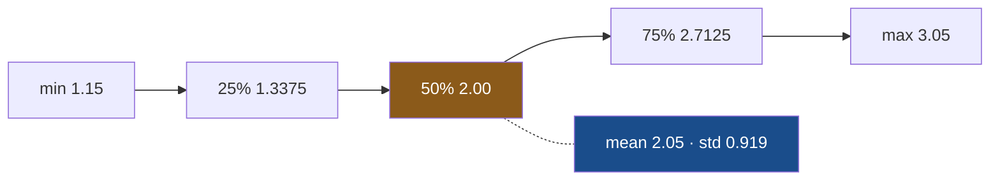

# 5.1 — Eight numbers for a column

## One-line answer

`describe()` hands back eight numbers for a column of numbers — how many values there are, the
average, how spread out they are, and the five values marking the smallest, the biggest and the three
points that cut the sorted list into quarters — and the eight together say something no one of them
says alone.

---

## The story

At the end of the year somebody in the flat adds up the shopping.

They come back with one sentence: **"we spend about two pounds an item."**

Somebody else asks the obvious question. Two pounds each, or two pounds on average? Those are
different sentences. If every single thing costs about two pounds, the shopping is dull and
predictable. If half of it is milk at a bit over a pound and half is rice at three pounds, the
average is still two pounds and nothing in the flat has ever cost two pounds.

So they go back to the list and read out five numbers instead of one. The cheapest thing. The dearest
thing. The one in the middle, when you line them up cheapest to dearest. And the two a quarter and
three quarters of the way along, because those tell you whether the middle is a middle or a cliff
edge.

With the average that is six. Add how many lines there actually were, and how far from the average a
typical line sits, and you have eight — and now "what does our shopping cost" has an answer somebody
can argue with. Nobody in that conversation used a word longer than "average", and pandas has one
method that does exactly it.

---

## The idea in plain language

`describe()` is a **summary**. A summary is a small set of numbers computed from a large set of
numbers, chosen so that you can say something about the large set without reading it.

For a column of numbers, pandas picks these eight. Each one gets a sentence, and none of the
sentences needs a background in statistics.

**`count`** — how many values are actually *there*. Not how many rows the table has: how many rows
have something in this column. A **blank**, in pandas, is a missing value: a cell where nobody wrote
anything down. It has its own marker, `NaN`, and it is neither zero nor an empty string
([Day 30, 1.2](../../../day-30-missing-data/parts/01-what-missing-means/1.2-nan-the-number-not-equal-to-itself.md));
you find one with `isna()`
([Day 30, 2.1](../../../day-30-missing-data/parts/02-finding-it/2.1-isna-and-notna.md)). Blanks do
not count, and the gap between rows and `count` is the whole of
[6.1](../06-the-quality-report/6.1-count-is-a-missing-value-report.md).

**`mean`** — the average. Add every value up, divide by how many there were. It is the number the
flatmate said out loud, and it is the number a single very large value can drag a long way.

**`std`** — short for *standard deviation*. One number saying **how far from the average a typical
value sits**. Small `std` means the values huddle around the average; large `std` means they are
scattered. It is in the same units as the column, so a `std` of 0.82 on a column of pounds means "a
typical line is about eighty pence away from the average line". Day 23 built it from nothing and
named the one argument that changes the answer
([Day 23, 2.3](../../../day-23-ufuncs-and-statistics/parts/02-statistics/2.3-std-var-and-ddof.md)).

**`min`** — the smallest value. **`max`** — the largest. Together they are the column's range, and
the cheapest way there is to notice a value that cannot possibly be real
([6.2](../06-the-quality-report/6.2-min-and-max-are-a-range-check.md)).

**`50%`** — the **median**. Line the values up in order and take the one in the middle; with an even
number of them, take the point halfway between the two middle ones. The median is the number that
does not move when one value goes mad, which is why it is printed next to the mean, which does.
**`25%`** and **`75%`** are the same idea a quarter and three quarters of the way along, and they are
called **quartiles** because they and the median cut the sorted values into four parts holding the
same number of values each. A **percentile** is the general version: the 90th percentile is the value
90% of the column sits below
([Day 23, 2.4](../../../day-23-ufuncs-and-statistics/parts/02-statistics/2.4-median-percentile-and-quantile.md)).

Three of the eight are computed from every value at once (`count`, `mean`, `std`) and five are
**positions in the sorted column** (`min`, `25%`, `50%`, `75%`, `max`). Hold on to that split: the
two halves fail differently, and the whole of section 6 lives in the gap between them.

---

## Why Setu needs it

- **[5.2](5.2-describe-on-text-and-what-changes.md), next**, is the same method on a column that is
  not numbers, where four completely different numbers come back.
  **[5.3](5.3-include-exclude-and-the-column-left-out.md)** is about which columns get a report at
  all — and the answer, by default, is fewer than you think.
- **Section 6** reads each of these eight as a *finding*:
  [6.1](../06-the-quality-report/6.1-count-is-a-missing-value-report.md) reads `count`,
  [6.2](../06-the-quality-report/6.2-min-and-max-are-a-range-check.md) reads `min` and `max`,
  [6.3](../06-the-quality-report/6.3-the-quartiles-and-the-tail.md) reads the quartiles against the
  mean, and [6.4](../06-the-quality-report/6.4-the-column-that-never-changes.md) reads a `std` of
  zero.
- **[7.1](../07-the-module/7.1-the-audit-module.md)** is the day's module, built out of `describe()`.
  Its `audit()` function is the named artifact the phase 4 gate closes on, so these eight numbers are
  the gate's raw material.
- **Day 39** is the distribution material proper: histograms, skew, and what a long tail looks like
  drawn. This part gives the numbers; that day gives the picture.
- **Every scaler you will ever fit** learns a `mean` and a `std`, then subtracts and divides by them.
  When Phase 8 reaches feature scaling, "the scaler learned a mean" means this mean — and the reason
  it must be fitted on the training rows only is the reason a median must be
  ([Day 30, 6.1](../../../day-30-missing-data/parts/06-the-leak/6.1-the-median-that-saw-the-test-set.md)).

---

## The mechanism

Start on the envelope, where you can check every number by counting on your fingers.

```python
import pandas as pd

shop = pd.DataFrame(
    {
        "item": pd.Series(["milk", "bread", "eggs", "rice"], dtype="str"),
        "aisle": pd.Series(["dairy", "bakery", "dairy", "dry goods"], dtype="str"),
        "size": pd.Series(["large", "small", "medium", "large"], dtype="str"),
        "price": [1.15, 1.40, 2.60, 3.05],
        "need": [2, 1, 1, 1],
    }
)
print(shop.describe())
```

**Line by line:**

- `dtype="str"` written out on the three text columns. pandas 3.0 infers `str` for text anyway, but
  stating it is the pin (Principle 4), and it matters here for a reason that lands in
  [5.3](5.3-include-exclude-and-the-column-left-out.md): the dtype decides whether a column appears
  in this report at all
  ([Day 26, 2.2](../../../day-26-frames-and-copy-on-write/parts/02-the-str-dtype/2.2-str-the-dtype-pandas-3-infers.md)).
- `price` and `need` get no `dtype=`, so they infer to `float64` and `int64`. Two numeric dtypes in
  one frame, on purpose: the report treats them the same and prints them differently
  ([Day 26, 1.4](../../../day-26-frames-and-copy-on-write/parts/01-the-two-objects/1.4-one-dtype-per-column.md)).
- `shop.describe()` takes no arguments. That is the version everybody types, and the version that
  quietly leaves three of these five columns out.

```text
          price  need
count  4.000000  4.00
mean   2.050000  1.25
std    0.919239  0.50
min    1.150000  1.00
25%    1.337500  1.00
50%    2.000000  1.00
75%    2.712500  1.25
max    3.050000  2.00
```

Two columns wide, eight rows tall. `item`, `aisle` and `size` are not there at all — hold that
thought; it is [5.3](5.3-include-exclude-and-the-column-left-out.md).

Check the eight against the four prices by hand: 1.15, 1.40, 2.60, 3.05. `count` is 4, and none is
blank. `mean` is 2.05, because `8.20 / 4` is `2.05`. `min` and `max` are the cheapest and dearest
straight off the list. `50%` is 2.00, because the two middle values sorted are 1.40 and 2.60 and
halfway between them is 2.00 — **note that 2.00 is not one of the prices**, which is normal for the
median of an even-length list.

That leaves `std`, `25%` and `75%`, the three nobody can do in their head. So do them in the open.

```python
import numpy as np
import pandas as pd

price = pd.Series([1.15, 1.40, 2.60, 3.05])
n = len(price)
mean = price.mean()
squared_gaps = ((price - mean) ** 2).sum()

print("sum of squares  :", squared_gaps)
print("divide by n-1   :", np.sqrt(squared_gaps / (n - 1)))
print("divide by n     :", np.sqrt(squared_gaps / n))
print("describe std    :", price.describe()["std"])
```

**Line by line:**

- `price - mean` subtracts one number from every value at once — a vectorised operation, no loop, one
  pass ([Day 29, 2.1](../../../day-29-iteration-and-order/parts/02-vectorised/2.1-one-operation-every-row.md)).
  Each result is the gap between one price and the average price.
- `** 2` squares every gap, which stops the gaps above the average cancelling the gaps below it, and
  is why the answer is in squared pounds until the square root puts it back into pounds. `.sum()`
  then adds the squared gaps into the one number everything else divides.
- `squared_gaps / (n - 1)` against `squared_gaps / n` — **the only difference between the two
  candidate answers is the divisor**, and there is no way to tell from a printed number which one you
  got. That is why this block exists. pandas calls the choice `ddof`, for *delta degrees of freedom*.
- `price.describe()["std"]` indexes the report by row label. For one column `describe()` returns a
  Series whose index is the eight names, so the report is data you can pick values out of, not a
  picture — the fact the *In production* section below is built on.

```text
sum of squares  : 2.535
divide by n-1   : 0.9192388155425119
divide by n     : 0.796084166404533
describe std    : 0.9192388155425119
```

**`describe()` divides by `n - 1`.** The 0.919239 in the report is `sqrt(2.535 / 3)`, not
`sqrt(2.535 / 4)`. On four rows that is a 15% difference between two numbers that both look
plausible, and neither the report nor the docstring shouts about it.

Why `n - 1`? Because the four prices are treated as a *sample* of the flat's shopping rather than the
whole of it, and the average you subtracted was itself computed from those same four numbers. That
double use makes the squared gaps come out slightly too small, and `n - 1` corrects for it. If the
four rows really were everything you cared about, `ddof=0` would be honest. `describe()` picks the
sample answer, always, without asking.

Now the five positions, which come out of the sorted values.

```python
import pandas as pd

price = pd.Series([1.15, 1.40, 2.60, 3.05])
lo, hi = 1.15, 1.40  # the first two values, sorted
print("0.25 x (4 - 1)  :", 0.25 * (len(price) - 1))
print("by hand         :", lo + 0.75 * (hi - lo))
print("pandas quantile :", price.quantile([0.25, 0.5, 0.75]).to_numpy())
```

**Line by line:**

- The values have to be **in order** for a percentile to mean anything; these four already are
  ([Day 29, 4.1](../../../day-29-iteration-and-order/parts/04-sorting/4.1-sort-values-the-order-you-asked-for.md)).
- `0.25 * (len(price) - 1)` is the position you want, counted from zero. With four values it is
  `0.75` — three quarters of the way from the first value to the second, not on either of them.
- `lo + 0.75 * (hi - lo)` walks that fraction from the lower value to the upper one. This is
  **linear interpolation**, pandas' default rule for a percentile that falls between two values.
- `price.quantile([...])` asks pandas the same three questions directly, so the last line is the
  check on the two above it.

```text
0.25 x (4 - 1)  : 0.75
by hand         : 1.3375
pandas quantile : [1.3375 2.     2.7125]
```

1.3375 and 2.7125 are the `25%` and `75%` from the report, to the digit. Neither of them is a price
the flat has ever paid; they are positions on a line drawn through the prices.



Four rows are a toy. Here is the year, built from the same four items with the same seed, so that
every part of this day is looking at the same file.

```python
import numpy as np
import pandas as pd

ITEMS = ["milk", "bread", "eggs", "rice"]
AISLES = ["bakery", "dairy", "dry goods"]
SIZES = ["small", "medium", "large"]
BASE = {"milk": 1.15, "bread": 1.40, "eggs": 2.60, "rice": 3.05}


def a_year(n: int = 240_000) -> pd.DataFrame:
    """A year of the flat's shopping, drawn with seed 34 in this column order."""
    rng = np.random.default_rng(34)
    item = rng.choice(ITEMS, n)
    base = np.array([BASE[x] for x in item])
    return pd.DataFrame(
        {
            "item": pd.Series(item, dtype="str"),
            "aisle": pd.Series(rng.choice(AISLES, n), dtype="str"),
            "size": pd.Series(rng.choice(SIZES, n), dtype="str"),
            "price": np.round(base + rng.normal(0.0, 0.20, n), 2),
            "need": rng.integers(1, 4, n),
        }
    )


year = a_year()
print("rows:", len(year))
print()
print(year.describe())
```

**Line by line:**

- `np.random.default_rng(34)` — a generator object seeded with the day number, not the old global
  `np.random` functions, so every number in this document is reproducible on your machine
  ([Day 20, 4.2](../../../day-20-arrays-and-dtypes/parts/04-random/4.2-the-seed-is-part-of-the-result.md)).
  **The draws happen in the order the columns are written**, so this is a function with a fixed body
  rather than five loose lines.
- `base = np.array([BASE[x] for x in item])` — each row's list price, before the shop moved it.
  Building the price out of the item is what gives the column a shape worth summarising; a column of
  uniform random numbers has nothing for `describe()` to find. `rng.normal(0.0, 0.20, n)` then adds a
  wobble around it, averaging zero, typically twenty pence either way.
- `np.round(..., 2)` because a price with fifteen decimal places is not a price
  ([Day 20, 2.3](../../../day-20-arrays-and-dtypes/parts/02-dtypes/2.3-floats-nan-and-precision.md)).
- `rng.integers(1, 4, n)` for `need` — whole numbers 1, 2 or 3. The upper bound is exclusive, which
  is the most common off-by-one in this call.

```text
rows: 240000

               price           need
count  240000.000000  240000.000000
mean        2.049136       2.002638
std         0.821176       0.817588
min         0.370000       1.000000
25%         1.270000       1.000000
50%         1.960000       2.000000
75%         2.820000       3.000000
max         3.880000       3.000000
```

Read it the way the flatmate should have. The average line is £2.05, and the quartiles say a quarter
of the shopping is under £1.27 and a quarter is over £2.82. "About two pounds an item" was true about
the average and false about the shopping: nothing clusters at £2.05, because the file is four items
at four different prices and the average lands in the gap between bread and eggs.

`need` shows the other shape — `min` 1, `max` 3, quartiles at 1, 2 and 3: three possible values,
printed as though the column were continuous. The numbers are right and the presentation misleads,
which is [6.4](../06-the-quality-report/6.4-the-column-that-never-changes.md)'s subject seen early.

---

## When it breaks

The first way is the one that costs a day of somebody's life: **the same column, two libraries, two
different standard deviations.**

```text
$ uv run python -c "
import numpy as np
import pandas as pd
price = pd.Series([1.15, 1.40, 2.60, 3.05])
print('pandas std        :', price.std())
print('numpy  std        :', np.std(price.to_numpy()))
print('difference        :', price.std() - np.std(price.to_numpy()))
print('numpy with ddof=1 :', np.std(price.to_numpy(), ddof=1))
"
```

```text
pandas std        : 0.9192388155425119
numpy  std        : 0.796084166404533
difference        : 0.12315464913797891
numpy with ddof=1 : 0.9192388155425119
```

**What it means.** Nothing raised, no warning. **pandas defaults to `ddof=1` and NumPy defaults to
`ddof=0`**, so identical numbers give two answers thirteen per cent apart. If one half of a pipeline
computes a threshold with NumPy and the other half checks it with pandas, the check passes or fails
for a reason that is in neither file. State `ddof=` on every call in code you keep, in both libraries
([Day 23, 2.3](../../../day-23-ufuncs-and-statistics/parts/02-statistics/2.3-std-var-and-ddof.md)).

The second way is `std` on a column with one value in it. `pd.Series([1.15]).describe()` prints
`count 1.00`, `mean 1.15` and `std NaN`, because with `ddof=1` the divisor is zero. The trap is
downstream: `value > mean + 2 * std` becomes `NaN`, every comparison against `NaN` is `False`
([Day 30, 1.2](../../../day-30-missing-data/parts/01-what-missing-means/1.2-nan-the-number-not-equal-to-itself.md)),
and a check meant to catch outliers catches nothing.

The third way is reading `count` as though it were the number of rows.

```text
$ uv run python -c "
import numpy as np
import pandas as pd
p = pd.Series([1.15, np.nan, 2.60, 3.05], name='price')
print(p.describe())
print('len   :', len(p))
print('count :', p.count())
"
```

```text
count    3.000000
mean     2.266667
std      0.992891
min      1.150000
25%      1.875000
50%      2.600000
75%      2.825000
max      3.050000
Name: price, dtype: float64
len   : 4
count : 3
```

**What it means.** `len` is 4 and `count` is 3. **Every other number in that report is computed over
three values, not four**, and nothing says so except the `count` row. A mean of 2.27, on a column
whose blank was really a free item, is not the average price of the shopping. `count` is the row you
read first, and [6.1](../06-the-quality-report/6.1-count-is-a-missing-value-report.md) turns that
habit into a check.

---

## In production

**What a professional writes instead of the teaching version.** Not `print(df.describe())`. The
report is a frame, and a frame can be stored, compared against last week's and asserted on. So this
function returns rows, carrying the two facts `describe()` will not put in the same table: how many
rows there were, and how many were blank.

```python
import pandas as pd


def spread(frame: pd.DataFrame, column: str) -> pd.DataFrame:
    """The eight numbers for one column, as a frame of findings rather than a printout."""
    values = frame[column]
    report = values.describe()
    return pd.DataFrame(
        {
            "column": column,
            "statistic": report.index,
            "value": report.to_numpy(),
            "rows": len(frame),
            "missing": int(len(frame) - values.count()),
        }
    )
```

**Line by line:**

- It takes the frame and a column name rather than a Series, because `len(frame)` is the row count
  and a Series handed in alone has already lost the frame it came from.
- `report.index` is the eight labels. Putting them in a *column* rather than leaving them as an index
  makes the result stackable: ten of these frames concatenate into one long report
  ([Day 32, 1.1](../../../day-32-joining-and-reshaping/parts/01-stacking/1.1-two-lists-one-under-the-other.md)).
- `report.to_numpy()` strips the index off the values so the two columns line up by position. Handing
  the Series in directly would align on its index instead and silently produce blanks
  ([Day 28, 4.2](../../../day-28-selection-and-alignment/parts/04-alignment/4.2-alignment-is-automatic.md)).
  `"column": column` is one string broadcast down every row, so a stacked report names its columns.
- `len(frame) - values.count()` is computed rather than assumed, because it is the number that tells
  you whether the other seven mean anything. `int(...)` around it, because a NumPy integer serialises
  badly into JSON and logs.

`spread(a_year(), "price")` returns eight rows a test can index into, each carrying `rows` of
`240000` and `missing` of `0` alongside its value.

**What degrades at scale.** `describe()` is not one pass over the column; it is several, and the five
positional numbers need the values in order. Measured on this machine, on one float column:

```text
n=   240000  describe    23.38 ms   no-percentiles    15.67 ms   mean only    0.898 ms
n=  2400000  describe   228.05 ms   no-percentiles   117.08 ms   mean only   14.592 ms
```

Ten times the rows, ten times the cost — it scales linearly, which is the good news. The bad news is
the constant: `describe()` costs about twenty-five times what `mean()` costs, and roughly half of
that is the three percentiles. On a frame with four hundred numeric columns, a `describe()` per daily
partition stops being free. The professional version either drops the percentiles it does not read
(`percentiles=[]`, which [5.3](5.3-include-exclude-and-the-column-left-out.md) covers) or computes
the summary once at the end of the load and stores it next to the data.

**The failure that only shows with real data.** `ddof` stops mattering as the column grows, which is
exactly why it bites. On the year's 240 000 prices the two answers are `0.8211755391918745` and
`0.821173828407719`, a difference of `1.7e-06`. A developer compares the pandas number against the
NumPy number on production-sized data, sees them agree to five decimal places, and ships it. Then
someone runs the same check per group, some groups have four rows, and the two paths disagree by
thirteen per cent on precisely the groups about to be flagged. **A difference that vanishes at scale
is not a difference that has gone away.**

**The review comment a senior engineer leaves.** *"You print `describe()` in the notebook and then
hard-code 2.05 as the threshold three cells down. Return the report from a function, assert on the
row you care about, and put the assertion in the test file — otherwise the day the input changes, the
notebook is still right and the threshold is silently wrong."*

**The interview question.** *"What does `describe()` give you, and which of those numbers would you
not trust?"* The answer that shows you have used it: `count` first, because every other number is
computed over `count` values and not over the rows; then `min` and `max`, because they are free and
catch impossible values; then the mean against the median, because the gap between them is the whole
story about the column's shape. The one to be careful with is `std`, because pandas divides by
`n - 1` and NumPy divides by `n`.

---

## Check yourself

```bash
uv run python -c "
import numpy as np
import pandas as pd
rng = np.random.default_rng(34)
tight = pd.Series(np.round(rng.normal(2.05, 0.05, 1000), 2))
wide = pd.Series(np.round(rng.normal(2.05, 1.20, 1000), 2))
for name, s in [('tight', tight), ('wide ', wide)]:
    r = s.describe()
    print(name, 'mean', round(r['mean'], 3), 'std', round(r['std'], 3), 'min', r['min'], 'max', r['max'])
"
```

Two columns with almost the same mean and completely different everything else. Say which of the
eight numbers you would put in a one-line summary of each, and why the mean alone would let somebody
call them the same column.

**Answer out loud, without scrolling up:**

> A column has 500 rows, a `count` of 500, a `mean` of 2.05, a `50%` of 1.96 and a `max` of 3.88. Say
> what `std` is dividing by, say why 1.96 rather than 2.05 is the number you would quote to somebody
> asking what a typical line costs, and say which single row of the report you would read first.

---

**Next:** [5.2 — describe on text, and what changes](5.2-describe-on-text-and-what-changes.md).
