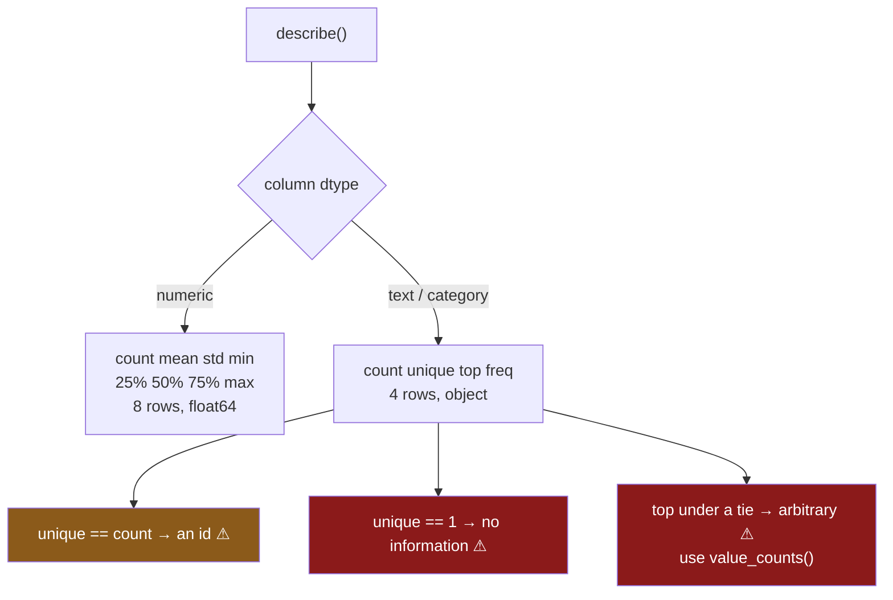

# 5.2 — `describe` on text, and what changes

## One-line answer

On a text or categorical column `describe` gives back **four** numbers instead of eight — `count`,
`unique`, `top`, `freq` — because a mean of words is not a thing; `unique` is the cardinality question
from [2.3](../02-the-category-dtype/2.3-the-code-width-and-where-the-saving-stops.md), and `top` is
the one value here that is **arbitrary when there is a tie**, with nothing to say so.

---

## The story

Somebody runs `describe` on the aisle column, expecting the same eight numbers the price column gave,
and gets four different ones instead.

That is fine once it is explained. There is no average aisle.

What is not fine is what happens next. The four numbers say there are three distinct aisles, and the
most common one is `bakery`, appearing 80 100 times. Somebody puts that in the summary: *most of our
shopping is bakery*.

It is not. `dairy` also appears 80 100 times, and so does `dry goods` — the flat buys milk, bread and
rice in almost exactly equal measure, and the three counts happen to be identical. `describe` reported
one of the three, picked by an internal rule nobody chose, and reported it with no indication that
there were two others exactly level with it.

The number is right. `freq` really is 80 100. The claim built on it is wrong, and the table gave no
hint at all.

---

## The idea in plain language

`describe` looks at a column's dtype and decides which summary makes sense. That is the whole design,
and it is why the output shape changes under you.

For a **numeric** column it gives the eight from [5.1](5.1-eight-numbers-for-a-column.md): `count`,
`mean`, `std`, `min`, the three quartiles, `max`.

For a **text or categorical** column it gives four:

- **`count`** — how many rows are not missing. The same meaning as on a numeric column, and the same
  finding hiding in it ([6.1](../06-the-quality-report/6.1-count-is-a-missing-value-report.md)).
- **`unique`** — how many distinct values. This is `nunique()`, and it is the number that decides
  whether a column should be a category at all
  ([2.3](../02-the-category-dtype/2.3-the-code-width-and-where-the-saving-stops.md)).
- **`top`** — the most frequent value. The **mode**.
- **`freq`** — how many times `top` appears.

The reason the shape changes is that most of the numeric eight are meaningless on words. There is no
mean of `dairy` and `bakery`. There is no standard deviation. And the quartiles need an order, which
plain text does not have and an *unordered* category refuses to invent
([3.3](../03-order/3.3-comparing-and-sorting-an-ordered-category.md)).

Three things about these four are worth knowing before you build anything on them.

**`top` is arbitrary under a tie, and nothing marks it.** When several values share the highest count,
`describe` reports one of them. Which one is an implementation detail — do not build on it, and more
importantly, do not let a reader assume the winner won. This is the story, and the fix is to look at
`value_counts().head()` rather than at `top`, because two equal numbers next to each other are
obvious and one number alone is not.

**`unique` and `count` answer different questions and both matter.** `count` near zero means the
column is mostly missing. `unique` equal to `count` means every value is distinct — an identifier, and
never a category. `unique` equal to `1` means the column never changes, which is
[6.4](../06-the-quality-report/6.4-the-column-that-never-changes.md)'s finding and the most quietly
useless column there is.

**A categorical column describes like text, not like its codes.** The codes are integers, and it would
be technically possible to average them. `describe` does not, and that is correct: the mean of
`[0, 1, 2]` where those mean `bakery`, `dairy`, `dry goods` is not a number anybody should see. What
you do get is `unique` counting the categories **actually present**, which is not necessarily the
number of declared categories — a distinction [4.2](../04-the-traps/4.2-the-category-that-nobody-used.md)
turns into a finding.

---

## Why Setu needs it

- **[5.1](5.1-eight-numbers-for-a-column.md)** gave the numeric eight. This is the other half of the
  same call, and the pair is why [5.3](5.3-include-exclude-and-the-column-left-out.md)'s `include=`
  matters at all.
- **[5.3](5.3-include-exclude-and-the-column-left-out.md)** is the immediate consequence: because the
  two summaries have different rows, `describe` picks one kind of column by default and hides the
  other.
- **[6.1](../06-the-quality-report/6.1-count-is-a-missing-value-report.md)** and
  **[6.4](../06-the-quality-report/6.4-the-column-that-never-changes.md)** both read findings straight
  out of these four numbers.
- **[2.3](../02-the-category-dtype/2.3-the-code-width-and-where-the-saving-stops.md)**'s
  distinct-to-rows ratio is `unique / count`, so this call already contains the conversion decision.
- **[7.1](../07-the-module/7.1-the-audit-module.md)**'s `audit()` turns `unique` and `freq` into named
  findings rather than table rows, which is the whole point of section 6.
- **Phase 5**'s encoders care about cardinality above everything else — a one-hot on a column with
  `unique = 40 000` produces forty thousand columns — so this is the number that decides an encoding
  strategy.

---

## The mechanism

The flat's file, with a numeric column and two text ones.

```python
import numpy as np
import pandas as pd

rng = np.random.default_rng(34)
n = 2_000
frame = pd.DataFrame(
    {
        "price": np.round(rng.gamma(2, 1.0, n), 2),
        "aisle": pd.Series(rng.choice(["dairy", "bakery", "dry goods"], n), dtype="str"),
        "size": pd.Series(["500g"] * n, dtype="str"),
    }
)
print(frame["price"].describe())
print()
print(frame["aisle"].describe())
```

**Line by line:**

- `rng.gamma(2, 1.0, n)` gives a right-skewed price distribution — most items cheap, a few dear —
  which is what prices actually look like and what makes
  [6.3](../06-the-quality-report/6.3-the-quartiles-and-the-tail.md) interesting.
- `size` is the same value on every row on purpose. It is the backfill accident from the hub's story,
  and it is here so that `unique` has something to report.
- The two `describe` calls are printed one after the other **on single columns**, so the shape
  difference is unmistakable before [5.3](5.3-include-exclude-and-the-column-left-out.md) complicates
  it with a whole frame.

```text
count    2000.000000
mean        1.972380
std         1.384199
min         0.020000
25%         0.967500
50%         1.680000
75%         2.682500
max        13.560000
Name: price, dtype: float64

count       2000
unique         3
top       bakery
freq         701
Name: aisle, dtype: object
```

**Eight rows and four rows, from the same method.** The index is different, the length is different,
and the dtype of the result is different — `float64` for the numeric summary, `object` for the text
one, because `top` is a word and everything in a Series shares one dtype.

That last detail matters more than it looks: you cannot do arithmetic on the text summary without
picking values out of it individually, and code that assumes `describe()` returns numbers will break
on the column that most needs describing.

Now the tie from the story:

```python
tie = pd.Series(["a", "a", "b", "b"], dtype="str")
print(tie.describe())
print()
print("value_counts:")
print(tie.value_counts())
```

**Line by line:**

- Four rows, two values, two each. The simplest possible tie, so nothing about the data can be blamed.
- `describe()` first, then `value_counts()`, so the two views of the identical fact sit next to each
  other.
- `value_counts()` sorts by count descending and shows **every** value, which is exactly the
  information `top` and `freq` throw away.

```text
count     4
unique    2
top       a
freq      2
dtype: object

value_counts:
a    2
b    2
Name: count, dtype: int64
```

**`top` is `a` and `b` is equally common.** The `describe` output contains no signal that this is a
tie — `freq: 2` looks exactly the same whether the runner-up had 1 or 2.

`value_counts()` shows both, side by side, and the tie is obvious on sight. That is the whole
recommendation: for anything a person will read, print the top few counts rather than the top one.

And the column with one value:

```python
print(frame["size"].describe())
print()
print("unique == 1 ->", frame["size"].nunique() == 1)
print("freq == count ->", frame["size"].describe()["freq"] == frame["size"].describe()["count"])
```

**Line by line:**

- `size` is `500g` on all two thousand rows. This is a real and common accident — a backfill, a default
  that was never overwritten, a column that meant something in an older schema.
- `unique == 1` is the finding, stated as a boolean rather than left for a reader to notice in a table.
- `freq == count` is the same finding read a second way, and it is worth having both because on a
  column with missing values they are subtly different: `count` excludes blanks, so `freq == count`
  means *every non-missing value is identical*, which is the honest claim.

```text
count     2000
unique       1
top       500g
freq      2000
Name: size, dtype: object

unique == 1 -> True
freq == count -> True
```

A column that says the same thing two thousand times carries no information at all. It cannot separate
any row from any other, so it cannot help any model, any filter or any group-by — and it will sit in a
feature list for a year looking like a feature. That is
[6.4](../06-the-quality-report/6.4-the-column-that-never-changes.md), visible right here in `unique`.



---

## When it breaks

**The tie that changes when the data is reordered:**

```text
$ uv run python -c "
import pandas as pd
one = pd.Series(['b', 'b', 'a', 'a'], dtype='str')
two = pd.Series(['a', 'a', 'b', 'b'], dtype='str')
print('order 1 top:', one.describe()['top'], ' freq:', one.describe()['freq'])
print('order 2 top:', two.describe()['top'], ' freq:', two.describe()['freq'])
print('same values?', sorted(one) == sorted(two))
"
order 1 top: b  freq: 2
order 2 top: a  freq: 2
same values? True
```

**The same four values in a different order give a different answer.** Both are correct — both `a` and
`b` occur twice — but a report that prints `top` will say `b` for a file sorted one way and `a` for the
same file sorted another.

That is what "arbitrary" means in practice: not random, but decided by something that has nothing to do
with the question. A nightly job whose upstream export changes its `ORDER BY` will flip this without a
single code change, and the only visible symptom is a summary line that says something different.

**`describe` on a category, and the categories that are not there:**

```text
$ uv run python -c "
import pandas as pd
from pandas.api.types import CategoricalDtype
AISLE = CategoricalDtype(['bakery', 'dairy', 'dry goods', 'frozen'])
col = pd.Series(['dairy', 'dairy', 'bakery'], dtype='str').astype(AISLE)
print(col.describe())
print()
print('declared categories:', len(col.cat.categories))
print('unique says        :', col.describe()['unique'])
"
count         3
unique        2
top       dairy
freq          2
dtype: object

declared categories: 4
unique says        : 2
```

**`unique` is `2` and there are `4` categories.** Both numbers are true and they answer different
questions: `unique` counts what is **present**, `len(cat.categories)` counts what is **allowed**.

Neither is wrong, and using the first where you meant the second is how an empty group goes unnoticed.
If the flat's freezer aisle has had no purchases for a month, `describe` will not mention it — the
absence is only visible by comparing the two numbers, which is
[4.2](../04-the-traps/4.2-the-category-that-nobody-used.md)'s finding.

**The summary that cannot be indexed the way you expect:**

```text
$ uv run python -c "
import pandas as pd
import numpy as np
num = pd.Series([1.0, 2.0, 3.0]).describe()
txt = pd.Series(['a', 'b', 'b'], dtype='str').describe()
print('numeric index:', list(num.index))
print('text index   :', list(txt.index))
print('numeric mean :', num['mean'])
print(txt['mean'])
"
numeric index: ['count', 'mean', 'std', 'min', '25%', '50%', '75%', 'max']
text index   : ['count', 'unique', 'top', 'freq']
KeyError: 'mean'
```

**What it means.** The two summaries do not share an index, so any code that reads `describe()["mean"]`
in a loop over columns works until it meets a text column and then raises. `KeyError: 'mean'` from a
data-quality script is nearly always this.

It is a good failure — it stops — but it is worth knowing before you write the loop, because the
instinct is to wrap it in a `try`. The better fix is to select the columns by dtype first, which is
[5.3](5.3-include-exclude-and-the-column-left-out.md)'s `include=`, so that each summary is read by
code that knows which four or eight rows it is getting.

---

## In production

**What a professional writes instead of the teaching version.** The four numbers become findings, and
the tie is detected rather than hidden:

```python
import pandas as pd


def describe_labels(values: pd.Series, *, show: int = 3) -> dict[str, object]:
    """Summarise a label column, flagging a tied mode and a column with no information."""
    counts = values.value_counts()
    rows = len(values)
    top_count = int(counts.iloc[0]) if len(counts) else 0
    tied = [str(label) for label in counts[counts == top_count].index]
    return {
        "rows": rows,
        "present": int(values.notna().sum()),
        "missing": int(values.isna().sum()),
        "unique": int(values.nunique()),
        "top": tied if len(tied) > 1 else (tied[0] if tied else None),
        "freq": top_count,
        "tied": len(tied) > 1,
        "constant": values.nunique() <= 1,
        "identifier": values.nunique() == values.notna().sum() and rows > 1,
        "head": counts.head(show).to_dict(),
    }
```

**Line by line:**

- `value_counts()` is computed **once** and everything else is read off it. `describe` internally does
  the same work; doing it explicitly is what makes the tie visible.
- `counts[counts == top_count]` collects **every** label level with the winner, which is the single
  thing `describe` cannot tell you. `tied` is a list when there is a tie and a bare label when there is
  not, so a caller reading `top` gets an honest answer in both cases.
- `tied` is also returned as its own boolean, because a downstream check should be able to fail on it
  without parsing the type of `top`.
- `missing` is reported alongside `present` rather than left as `rows - count`, so
  [6.1](../06-the-quality-report/6.1-count-is-a-missing-value-report.md)'s subtraction is already done.
- `constant` uses `<= 1` rather than `== 1` so that an entirely empty column — `nunique()` is `0` —
  is also flagged. An all-missing column is the most constant column there is and the easiest to miss.
- `identifier` compares distinct values against **non-missing** values, not against `rows`, so a column
  with unique values and some blanks is still recognised. The `rows > 1` guard stops a single-row frame
  reporting every column as an identifier.
- `head` keeps the top few counts in the result, so whatever renders this can show the tie rather than
  asserting a winner.

**What degrades at scale.** `describe` on text is not free, and the expensive part is not the one you
would guess:

```text
2 000 000 rows
  describe(), numeric column           14.1 ms
  describe(), 3 distinct labels        88.4 ms
  describe(), 2 000 000 distinct      1.24 s
  value_counts(), 3 distinct           61.2 ms
  nunique() alone, 3 distinct          58.9 ms
  describe(), category dtype           12.7 ms
```

**Line by line:**

- The text summary costs about **six times** the numeric one on a low-cardinality column, because
  `unique`, `top` and `freq` all require counting distinct values — a hash of every row — where `mean`
  and `std` are one arithmetic pass.
- On an all-distinct column it is **nearly a hundred times** the numeric cost, because the hash table
  ends up holding two million entries. Running `describe(include="all")` on a frame with several
  identifier columns is a surprisingly effective way to make a notebook hang.
- `nunique()` alone accounts for most of the text summary's cost, which is worth knowing: if all you
  need is cardinality, you are not saving anything by calling `describe`.
- **The category column is the fastest of all** — faster than the numeric one — because the distinct
  values are already known: they are the dtype's category list, and counting is a `bincount` over the
  codes rather than a hash of two million strings. That is a real argument for converting a label
  column before profiling it.

The thing that degrades in the other sense is trust. On a small frame you look at the four numbers and
also glance at the data. On two million rows the four numbers are all anybody sees, so `top` under a
tie gets quoted in a summary and stays quoted — and a metric that swings when an upstream sort changes
is the hardest kind to debug, because nothing in your code moved.

**The failure that only appears with real data.** A marketplace reported "most popular category" on a
weekly dashboard from `describe()["top"]`. For most of the year it was stable and correct. In two quiet
weeks the leading categories tied, and the reported winner flipped between them on consecutive weeks
purely because the export's row order changed. A merchandising team spent a fortnight investigating a
non-existent demand shift, then built a campaign on it. The fix was two lines — report the top three
counts instead of the top one — and the lesson was that a summary that cannot express a tie will
eventually assert one.

**The review comment a senior engineer leaves.** *"`describe()['top']` in a report — that is the mode
with the tie information thrown away, and it is picked arbitrarily when counts are level. Print
`value_counts().head(3)` so a reader can see whether the winner actually won. Also this loop reads
`['mean']` for every column and will `KeyError` on the first text one; split by dtype with `include=`
first."*

**The interview question.** *"What does `describe` give you on a text column?"* Four values —
`count`, `unique`, `top`, `freq` — instead of the numeric eight, because a mean and a standard
deviation of words are undefined and quartiles need an order that plain text does not have. Then the
follow-up that separates people who have shipped a report from one: **what does `top` return when two
values are equally common?** One of them, arbitrarily, with nothing in the output indicating a tie —
so the value can change when the input row order changes, without any code change. For anything a
person reads, `value_counts().head()` is the honest form, because it shows the runner-up.

---

## Check yourself

```bash
uv run python -c "
import numpy as np
import pandas as pd
rng = np.random.default_rng(34)
n = 2_000
aisle = pd.Series(rng.choice(['dairy', 'bakery', 'dry goods'], n), dtype='str')
size = pd.Series(['500g'] * n, dtype='str')
print(aisle.describe())
print()
print(size.describe())
print()
tie = pd.Series(['a', 'a', 'b', 'b'], dtype='str')
print('tie top :', tie.describe()['top'], '| freq:', tie.describe()['freq'])
print('reversed:', pd.Series(['b', 'b', 'a', 'a'], dtype='str').describe()['top'])
print('counts  :', tie.value_counts().to_dict())
try:
    aisle.describe()['mean']
except KeyError as e:
    print('numeric row:', e)
"
```

Run it. The `size` summary has `unique` of `1` — say what that column can contribute to any analysis.
Then say why the two `tie` lines disagree even though the data is the same, and which single call you
would print in a report instead.

**Answer out loud, without scrolling up:**

> Which four numbers does `describe` give for a text column, and why not the numeric eight? Then say
> what `top` does when two values are tied, and how a reader of the table would know.

---

**Next:** [5.3 — include, exclude, and the column left out](5.3-include-exclude-and-the-column-left-out.md).
