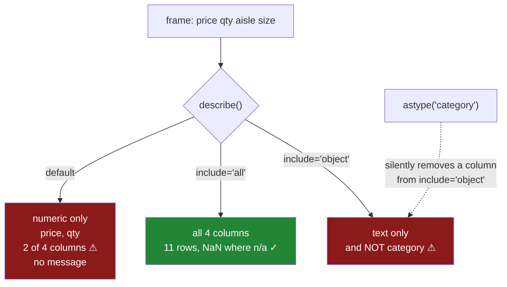

# 5.3 — `include`, `exclude`, and the column left out

## One-line answer

`describe()` on a whole frame quietly summarises **only the numeric columns**, so on a file with three
numbers and nine labels it reports on three and says nothing about the other nine — and the omission
is invisible, because the table it prints is complete and correct for the columns it chose.

---

## The story

The flat's file gets its summary printed, the way any new file does, and it looks fine. Price, quantity
and a couple of other numbers, eight rows each, everything plausible.

Somebody scrolls past it and gets on with the analysis.

Two weeks later the model is behaving oddly and somebody goes back to the raw file. The `size` column
has one value on every row — the backfill that went wrong in June — and it has been sitting in the
feature list ever since, contributing nothing. The `aisle` column has a fourth value nobody expected,
`Dairy` with a capital, four hundred rows of it, which is splitting the dairy group in two.

Both of those are exactly the kind of thing the summary is for. Both would have shown up instantly:
`unique: 1` on one column, `unique: 4` on the other.

Neither was in the table. The table had three columns in it and the file has twelve. Nothing said
*nine columns omitted*. The summary was not wrong — it was **partial**, and a partial answer printed
without qualification reads exactly like a complete one.

---

## The idea in plain language

The reason for the omission is in [5.2](5.2-describe-on-text-and-what-changes.md): a numeric column
describes in eight rows and a text column in four, and they are not the same four.

So when `describe` is handed a whole frame, it has to choose. It cannot put both summaries in one
table without leaving a lot of blanks. Its default choice is: **numeric columns only, if there are
any.** If there are none, it falls back to summarising the non-numeric ones, which is why the default
sometimes seems to do the right thing and cannot be relied on to.

Two arguments override that choice.

- **`include=`** — which dtypes to summarise. `"all"` for everything, `"number"`, `"object"`,
  `"category"`, `"datetime"`, or a list.
- **`exclude=`** — which to leave out. Useful when you want everything except one noisy kind.

`include="all"` is the one to reach for, and it does something worth understanding: it puts **all
twelve rows** in the index — the numeric eight and the text four — and fills the cells that do not
apply with `NaN`. A numeric column has no `top`, so that cell is blank; a text column has no `mean`,
so that cell is blank. The blanks are not missing data. They are *not applicable*, and reading them as
missing is the one confusion this form introduces.

The habit worth building is smaller than it sounds:

**Never call `describe()` on a frame without saying which columns you meant.** Either pass
`include="all"`, or select the columns by dtype first and describe each group. The bare call is fine in
a notebook where you can see the frame; it is not fine in anything that prints a summary somebody will
act on, because the thing it omits is exactly the thing nobody thought to check.

One more detail, because it changes what you get. **Category columns are not "object" and are not
"number".** A frame whose labels have been converted through section 2 will have them omitted by the
default *and* by `include="object"`. `include="all"` catches them; a hand-written list has to name
`"category"` explicitly. That is a real trap: converting a column to `category` to save memory can
silently remove it from a quality report written the week before.

---

## Why Setu needs it

- **[5.1](5.1-eight-numbers-for-a-column.md)** and **[5.2](5.2-describe-on-text-and-what-changes.md)**
  are the two summaries. This is the argument they were leading to: the two shapes are why one gets
  dropped.
- **[6.1](../06-the-quality-report/6.1-count-is-a-missing-value-report.md)** through
  **[6.4](../06-the-quality-report/6.4-the-column-that-never-changes.md)** read findings out of these
  numbers, and every one of them is worthless on a column that was never included.
- **[2.4](../02-the-category-dtype/2.4-a-category-is-not-a-text-column.md)** converted label columns to
  `category`. This is where that conversion silently changes what a report shows.
- **[7.1](../07-the-module/7.1-the-audit-module.md)**'s `audit()` iterates over **every** column by
  construction, which is the structural fix for this whole part — a report that cannot omit a column
  is better than a habit of remembering an argument.
- **Day 35**'s gate asks for a clean, typed dataset. A summary that silently skipped nine columns is
  how an unclean one passes.
- **Phase 5** onwards, every feature audit has this shape: the columns most likely to be broken are
  the labels, and the labels are the ones the default hides.

---

## The mechanism

A frame with two numeric columns and two label columns — the shape of every real file.

```python
import numpy as np
import pandas as pd

rng = np.random.default_rng(34)
n = 2_000
frame = pd.DataFrame(
    {
        "price": np.round(rng.gamma(2, 1.0, n), 2),
        "qty": rng.integers(1, 4, n),
        "aisle": pd.Series(rng.choice(["dairy", "bakery", "dry goods"], n), dtype="str"),
        "size": pd.Series(["500g"] * n, dtype="str"),
    }
)
frame.loc[rng.choice(n, 50, replace=False), "price"] = np.nan
print("columns in the frame:", list(frame.columns))
print()
print(frame.describe())
```

**Line by line:**

- Four columns: two numeric, two text. That two-to-two split is deliberately generous — a real file is
  more like three numeric and nine label columns, which makes the omission proportionally worse.
- `frame.loc[rng.choice(n, 50, replace=False), "price"] = np.nan` blanks fifty prices, so `count` has
  something to report ([6.1](../06-the-quality-report/6.1-count-is-a-missing-value-report.md)).
- `size` is constant on every row — the backfill from the story.
- The column list is printed **immediately above** the summary, because the entire point is the
  difference between those two lists and nothing in the output itself shows it.

```text
columns in the frame: ['price', 'qty', 'aisle', 'size']

             price          qty
count  1950.000000  2000.000000
mean      1.965549     1.999500
std       1.381999     0.806117
min       0.020000     1.000000
25%       0.960000     1.000000
50%       1.675000     2.000000
75%       2.660000     3.000000
max      13.560000     3.000000
```

**Four columns in, two columns out.** No message, no footnote, no count of what was skipped. The table
is perfectly correct about `price` and `qty` and completely silent about the existence of `aisle` and
`size`.

Look at it as a reader would: it is a well-formed summary table. There is nothing in it that prompts
the question *what else was there?*

Now the same call with the argument:

```python
print(frame.describe(include="all"))
```

**Line by line:**

- One argument. That is the whole fix at this level, and the reason this part exists is that the
  argument is not the default.
- `include="all"` is a special string, not a dtype name, so it does not need to be in a list.

```text
              price          qty  aisle  size
count   1950.000000  2000.000000   2000  2000
unique          NaN          NaN      3     1
top             NaN          NaN  dairy  500g
freq            NaN          NaN    701  2000
mean       1.965549     1.999500    NaN   NaN
std        1.381999     0.806117    NaN   NaN
min        0.020000     1.000000    NaN   NaN
25%        0.960000     1.000000    NaN   NaN
50%        1.675000     2.000000    NaN   NaN
75%        2.660000     3.000000    NaN   NaN
max       13.560000     3.000000    NaN   NaN
```

**Eleven rows now, and both findings are on screen.**

`size` has `unique: 1` — the constant column, visible at last. And `count` on `price` is `1950` against
`2000` everywhere else, which is the fifty missing prices.

The `NaN`s are the price of putting two summaries in one table, and they mean *not applicable* rather
than *missing*. `price` has no `top` because a most-common price is not a useful idea; `aisle` has no
`mean`. Nothing is absent from the data; the cell simply has no question to answer.

And the trap that follows from section 2:

```python
converted = frame.assign(aisle=frame["aisle"].astype("category"))
print("dtypes:", dict(converted.dtypes.astype(str)))
print()
print("include='object' columns   :", list(converted.describe(include="object").columns))
print("include='category' columns :", list(converted.describe(include="category").columns))
print("include='all' columns      :", list(converted.describe(include="all").columns))
```

**Line by line:**

- One column is converted to `category` — exactly what [2.2](../02-the-category-dtype/2.2-astype-category-and-the-saving-measured.md)
  recommends, for good reasons, and nothing else changes.
- The three `include=` forms are asked which **columns** they returned, rather than printing three full
  tables, because the question here is coverage rather than content.
- `include="object"` is what somebody writes when they mean "the text columns", and it is the line that
  silently loses coverage the day a column is converted.

```text
dtypes: {'price': 'float64', 'qty': 'int64', 'aisle': 'category', 'size': 'str'}

include='object' columns   : ['size']
include='category' columns : ['aisle']
include='all' columns      : ['price', 'qty', 'aisle', 'size']
```

**`include="object"` returned one column where it used to return two.** The memory optimisation from
section 2 removed `aisle` from a quality report, and nothing about the report changed. It still runs,
still prints a valid table, still says nothing about the column somebody just touched.

`include="all"` is immune, which is the argument for using it rather than a hand-written dtype list.



---

## When it breaks

**The frame with no numeric columns at all:**

```text
$ uv run python -c "
import pandas as pd
labels = pd.DataFrame({
    'aisle': pd.Series(['dairy', 'bakery'], dtype='str'),
    'size': pd.Series(['500g', '1kg'], dtype='str'),
})
print(labels.describe())
"
        aisle  size
count       2     2
unique      2     2
top     dairy  500g
freq        1     1
```

**The default did the right thing here, and that is the problem.** With no numeric columns to prefer,
`describe` falls back to the non-numeric ones and reports everything.

So the bare call behaves differently depending on what is in the frame. It works on an all-text file,
works on an all-numeric file, and silently drops half of a mixed one — which is the case you will
actually have. A default that is correct in the easy cases and wrong in the realistic one is worse than
a consistently awkward default, because it teaches you to trust it.

**The `include="object"` that pandas is about to stop honouring:**

```text
$ uv run python -W always -c "
import pandas as pd
frame = pd.DataFrame({'price': [1.0, 2.0], 'aisle': pd.Series(['dairy', 'bakery'], dtype='str')})
print('include=object:', list(frame.describe(include='object').columns))
print('include=str   :', list(frame.describe(include='str').columns))
"
Pandas4Warning: For backward compatibility, 'str' dtypes are included by select_dtypes when
'object' dtype is specified. This behavior is deprecated and will be removed in a future version.
Explicitly pass 'str' to `include` to select them, or to `exclude` to remove them and silence
this warning.
include=object: ['aisle']
include=str   : ['aisle']
```

**Both work today and only one of them will keep working.** In pandas 3 a text column's dtype is `str`,
not `object` ([Day 33, 1.3](../../../day-33-text-and-time/parts/01-the-str-accessor/1.3-the-dtype-under-the-text.md)),
and `include="object"` still picks it up **only as a backward-compatibility favour** that is already
deprecated.

So a quality report written as `describe(include="object")` is on a timer: when that compatibility is
removed, it will select zero text columns and report on nothing, silently — the same failure as the
default, arriving later, on an upgrade nobody connected to it. Pass `"str"`, or pass `"all"`.

Note also that neither `"object"` nor `"str"` catches a `category` column, so a hand-written list needs
all three to cover what `include="all"` covers by itself.

**The percentiles that quietly replace the defaults:**

```text
$ uv run python -c "
import pandas as pd
price = pd.Series([1.0, 2.0, 3.0, 4.0, 100.0])
print('default   :', list(price.describe().index))
print('with 99th :', list(price.describe(percentiles=[0.99]).index))
print('kept      :', list(price.describe(percentiles=[0.25, 0.5, 0.75, 0.99]).index))
"
default   : ['count', 'mean', 'std', 'min', '25%', '50%', '75%', 'max']
with 99th : ['count', 'mean', 'std', 'min', '99%', 'max']
kept      : ['count', 'mean', 'std', 'min', '25%', '50%', '75%', '99%', 'max']
```

**Asking for the 99th percentile removed the quartiles — and the median with them.** `percentiles=`
**replaces** the list rather than adding to it, so a reasonable-looking request for a tail number
silently deletes the three quartiles that
[6.3](../06-the-quality-report/6.3-the-quartiles-and-the-tail.md) reads to spot a skewed column.

The middle line is the trap in full: somebody adds a tail percentile to catch outliers and loses the
`50%` that would have told them the distribution was skewed in the first place. The third line is the
fix — list every percentile you want, including the ones that were there by default.

---

## In production

**What a professional writes instead of the teaching version.** A summary that cannot silently omit a
column, because it starts from the column list rather than from a dtype filter:

```python
import pandas as pd


def summarise(frame: pd.DataFrame) -> pd.DataFrame:
    """describe() for every column, with the omission made impossible rather than remembered."""
    described = frame.describe(include="all")
    missing = [c for c in frame.columns if c not in described.columns]
    if missing:
        raise ValueError(
            f"describe covered {len(described.columns)}/{len(frame.columns)}: {missing}"
        )
    extra = pd.DataFrame(
        {
            "dtype": frame.dtypes.astype(str),
            "missing": frame.isna().sum(),
            "distinct": frame.nunique(dropna=True),
        }
    ).T
    return pd.concat([described, extra])
```

**Line by line:**

- `include="all"` is passed, and then the result is **checked against the frame's own column list**.
  That is the load-bearing idea: rather than trusting the argument, the function asserts that every
  column was covered. A future dtype that `describe` does not handle becomes a loud failure instead of
  a silent omission.
- The error names the count *and* the missing columns, so the message is actionable without a
  reproduction.
- `missing` and `distinct` are added as extra rows because they are the two findings people actually
  read, and neither is directly in `describe`'s output — `count` is *non*-missing, and `unique` is
  absent for numeric columns entirely.
- `frame.nunique(dropna=True)` is computed for **every** column, numeric included, which is what makes
  [6.4](../06-the-quality-report/6.4-the-column-that-never-changes.md)'s constant-column check work on
  a numeric column too. `describe` alone would only reveal that through `std == 0`.
- `.T` transposes the extra frame so its rows line up with `describe`'s row-per-statistic layout before
  the `concat`.
- The whole thing returns a **table**, which is still the wrong final shape — a table cannot fail a
  test. [7.1](../07-the-module/7.1-the-audit-module.md) turns these numbers into findings, and that is
  the actual production form.

**What degrades at scale.** `include="all"` is not free, and the cost is in the columns the default was
skipping:

```text
2 000 000 rows, 4 columns
  describe()                 default, numeric only     28.7 ms
  describe(include='all')                             183.4 ms
  describe(include='all'), aisle as category           41.2 ms
20 columns, 15 of them labels
  describe()                                           31.1 ms
  describe(include='all')                             1.42 s
  describe(include='all'), labels as category         182.6 ms
```

**Line by line:**

- The full summary costs about **six times** the default here, because counting distinct values means
  hashing every string, where `mean` and `std` are one arithmetic pass
  ([5.2](5.2-describe-on-text-and-what-changes.md) measured the same gap on one column).
- On a realistic frame — twenty columns, most of them labels — the gap is a factor of **forty-five**,
  and 1.4 seconds is enough for people to stop running it, which is how the habit dies.
- **Converting the label columns to `category` first makes the full summary nearly eight times
  faster**, because the distinct values are already known from the dtype rather than discovered by
  hashing. That is a genuinely useful alignment: the memory optimisation from section 2 also makes the
  quality report cheap enough to run every time.
- So the order that works is: convert labels to `category`, then `describe(include="all")`. Doing it the
  other way round is what makes people conclude the full summary is too slow to bother with.

The failure that scales is not runtime, it is **coverage drift**. A frame gains columns over years —
somebody adds a flag, a source tag, a version string — and every one of them is a label, so every one
is invisible to the default summary. The proportion of the frame being profiled falls quietly from two
thirds to one fifth, and no single commit is responsible.

**The failure that only appears with real data.** A team's data-quality notebook ran `df.describe()` at
the top of every investigation and had done for three years. A schema change moved a numeric `status_code`
column to a string `status` label. Everything downstream handled it, and the column dropped out of the
summary — so when a bug two months later filled `status` with a single default value on forty per cent
of rows, the `unique: 1` that would have shown it was never printed. It was found by a customer. The
notebook was not wrong; it had been summarising a shrinking share of the table for three years and
nothing had ever said what share that was.

**The review comment a senior engineer leaves.** *"`df.describe()` in the report — that is numeric
columns only, so the nine label columns are not being profiled at all and nothing says so. Pass
`include='all'`, and assert the described column count matches the frame's. Also note `include='object'`
elsewhere in this file will stop seeing `aisle` now that we convert it to `category`."*

**The interview question.** *"What does `df.describe()` return on a mixed frame?"* Only the numeric
columns, silently — the text and categorical columns are omitted with no message, because their
summary has different rows and the two cannot share a table without blanks. Then the follow-up that
shows whether you have been caught: **when does the bare call include text columns?** When there are no
numeric columns at all, so the default behaves differently depending on the frame's contents and is
correct in exactly the cases where it does not matter. Pass `include="all"` — and remember that
`category` is neither `"number"` nor `"object"`, so converting a column for memory reasons can drop it
out of a report written against a hand-listed dtype filter.

---

## Check yourself

```bash
uv run python -c "
import numpy as np
import pandas as pd
rng = np.random.default_rng(34)
n = 2_000
frame = pd.DataFrame({
    'price': np.round(rng.gamma(2, 1.0, n), 2),
    'qty': rng.integers(1, 4, n),
    'aisle': pd.Series(rng.choice(['dairy', 'bakery', 'dry goods'], n), dtype='str'),
    'size': pd.Series(['500g'] * n, dtype='str'),
})
print('frame columns    :', list(frame.columns))
print('describe() covers:', list(frame.describe().columns))
print('include=all      :', list(frame.describe(include='all').columns))
conv = frame.assign(aisle=frame['aisle'].astype('category'))
print('include=object   :', list(conv.describe(include='object').columns))
print()
print(frame.describe(include='all').loc[['count', 'unique', 'top', 'freq']])
"
```

Run it. The first two lines list four columns and two — say which two are missing and which finding in
each one you have just failed to see. Then say why `include='object'` returns fewer columns after the
`category` conversion.

**Answer out loud, without scrolling up:**

> Which columns does a bare `describe()` summarise, and what does it print about the ones it skipped?
> Then say why `include="all"` fills half its table with `NaN`, and what those blanks mean.

---

**Next:** [6.1 — count is a missing-value report](../06-the-quality-report/6.1-count-is-a-missing-value-report.md).
