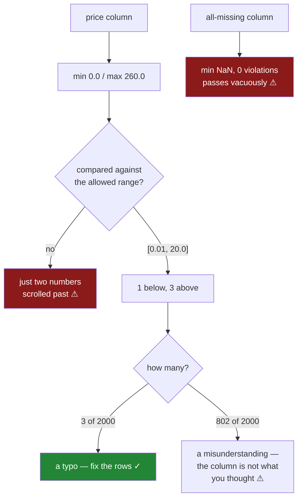

# 6.2 — `min` and `max` are a range check

## One-line answer

Two of the eight numbers say what the column's smallest and largest values are, and comparing them
against what the column is *allowed* to hold is the cheapest possible test for impossible data — a
negative quantity, a price in the wrong unit, a date before the business existed.

---

## The story

The flat's summary says the most expensive thing anybody bought all year cost two hundred and sixty.

Nobody has ever spent two hundred and sixty on a shop. The flat buys milk and bread. The dearest thing
in the file should be a bag of rice at about four.

They go and find the row. It is a bottle of milk, bought in April, and it says `260`. Somebody's phone
keyboard was on the numeric layout and they typed the price in pence — two pounds sixty became two
hundred and sixty — and nothing anywhere said that was odd, because a number is a number.

There are three more like it. Four rows out of two hundred and forty thousand.

Four rows is nothing. Four rows is also enough to move the average spend per shop by a noticeable
amount, and it is exactly enough to make "what is our most expensive item" and "what did we spend in
April" both wrong. And the whole thing was sitting on the `max` line of a table somebody printed in
February and scrolled past.

---

## The idea in plain language

`min` and `max` are the two easiest numbers in the summary to read and the two most often skipped,
because on their own they look like trivia. They become a **test** the moment you write down what the
column is allowed to contain.

That is the entire move: for each column, there is a range a value must be in for the row to make
sense. Not a statistical range — a *definitional* one.

- A quantity cannot be negative. You cannot buy minus one loaf.
- A price of a grocery item is between about `0.10` and `20`. Not because prices outside that are rare,
  but because they are not prices of groceries.
- A percentage is between `0` and `100`.
- An age is between `0` and about `120`.
- A date in this file is between the day the flat moved in and today. Not the year 1900, and not 2087.

None of those needs any statistics. They come from knowing what the column means, which is why nobody
but you can write them, and why they catch the errors that no amount of modelling will.

**Why this beats an outlier test.** A statistical outlier check asks *is this value unusual compared to
the others*. A range check asks *is this value possible at all*. They find different things:

- `260` in a column of grocery prices is both — unusual and impossible.
- `-1` in a quantity column is impossible and, if there are enough of them, **not** statistically
  unusual. An outlier test tuned to flag the top and bottom one per cent will happily accept a negative
  quantity if two per cent of rows have one.
- A price of `19.99` is possible and, in this file, unusual. A range check correctly ignores it; an
  outlier test flags it and wastes somebody's afternoon.

The range check is stricter about meaning and looser about frequency, which is the right way round for
data quality.

**Two failure shapes to know.** `min` and `max` report one value each, so:

*They find the worst case, not the count.* A `max` of `260` tells you at least one row is broken. It
says nothing about whether it is one row or forty thousand. Always follow a failed range check with a
count.

*They can be hidden by a missing value.* `min` and `max` skip blanks, so a column that is entirely
missing has a `min` of `NaN` and no range check fires at all. That is
[6.1](6.1-count-is-a-missing-value-report.md)'s finding, and it has to be checked first — a range check
on an empty column passes vacuously.

---

## Why Setu needs it

- **[6.1](6.1-count-is-a-missing-value-report.md)** read `count`. This reads the next two lines of the
  same table, and it depends on that one: a range check on a column of blanks proves nothing.
- **[6.3](6.3-the-quartiles-and-the-tail.md)** takes the `max` further — comparing it to the `75%`
  quartile says whether the extreme value is one row or a whole tail.
- **[6.4](6.4-the-column-that-never-changes.md)** is the degenerate case of this check: `min == max`
  means the range has collapsed to a point.
- **[7.1](../07-the-module/7.1-the-audit-module.md)**'s `audit()` takes a dictionary of expected ranges
  and returns a finding per violation, which is this part turned into code that can fail a test.
- **[Day 33, 4.2](../../../day-33-text-and-time/parts/04-the-dt-accessor/4.2-to-datetime-format-and-errors.md)**
  parsed dates. A date column's range check — nothing before the business started, nothing in the
  future — catches the day-first/month-first confusion that a parse cannot.
- **Phase 6** onwards, this is the first line of every monitoring system: a value outside its
  definitional range is an alert, and it is the one alert that never needs tuning.

---

## The mechanism

The flat's price column, with the four pence-typed rows in it.

```python
import numpy as np
import pandas as pd

rng = np.random.default_rng(34)
n = 2_000
price = pd.Series(np.round(rng.gamma(2, 1.0, n), 2), name="price")
price.iloc[:4] = [260.0, 255.0, 248.0, 0.0]
qty = pd.Series(rng.integers(-1, 4, n), name="qty")

print("price min :", price.min())
print("price max :", price.max())
print("qty   min :", qty.min())
print("qty   max :", qty.max())
```

**Line by line:**

- The gamma distribution gives realistic grocery prices — mostly under three, a few up to about eight.
- `price.iloc[:4]` overwrites four rows with the pence-typed values and one `0.0`, which is a second
  kind of impossible: a free item is not a purchase, it is a missing price somebody filled in with
  zero ([Day 30, 5.1](../../../day-30-missing-data/parts/05-filling/5.1-fillna-is-a-claim.md)).
- `rng.integers(-1, 4, n)` puts negative quantities in deliberately, and it puts in *many* of them —
  about two rows in five — which is what makes them invisible to an outlier test.
- The four numbers are printed bare, with no judgement attached, because the point is that they mean
  nothing until somebody says what the column is allowed to hold.

```text
price min : 0.0
price max : 260.0
qty   min : -1
qty   max : 3
```

Four numbers. Two of them are impossible and the output does not say so, because pandas has no idea
what a price is.

Now the same four numbers with the definition attached:

```python
LIMITS = {"price": (0.01, 20.0), "qty": (1, 99)}

for name, column in [("price", price), ("qty", qty)]:
    low, high = LIMITS[name]
    below = int((column < low).sum())
    above = int((column > high).sum())
    print(
        f"{name:<6} range [{column.min()}, {column.max()}]  allowed [{low}, {high}]"
        f"  -> {below} below, {above} above"
    )
```

**Line by line:**

- `LIMITS` is a dictionary written by a **person who knows the data**. There is no way to derive it, and
  that is the point: this is the one quality check that requires domain knowledge and nothing else.
- `0.01` rather than `0` as the price floor, because free groceries are not a thing and a zero price is
  a missing price wearing a number.
- `(column < low).sum()` counts the violations rather than just detecting one. That is the fix for
  `min` and `max` reporting only the worst case — you need to know whether this is a typo or a broken
  feed.
- Both ends are counted **separately**, because "prices too high" and "prices too low" usually have
  different causes and different fixes.
- The observed range and the allowed range are printed side by side, so the report reads as a comparison
  rather than as a fact.

```text
price  range [0.0, 260.0]  allowed [0.01, 20.0]  -> 1 below, 3 above
qty    range [-1, 3]  allowed [1, 99]  -> 802 below, 0 above
```

**Now the numbers accuse somebody.** Three prices above the ceiling and one below the floor — the
pence typos and the zero. And 802 negative quantities, which is just over forty per cent of the file.

Read those two lines together, because they are different kinds of problem and the counts are what
separate them:

- **3 rows** out of 2 000 is a data-entry mistake. Somebody fixes four rows, or the loader rejects them.
- **802 rows** out of 2 000 is not a mistake, it is a **misunderstanding**. Nobody typed 802 negative
  quantities. Either the column means something other than what you assumed — a stock adjustment, a
  return, a delta rather than a count — or the whole feed is wrong.

A `min` of `-1` alone cannot tell those apart. The count can, and it is the first question anybody
senior will ask.

And the check that passes when it should not:

```python
empty = pd.Series([np.nan] * 100, name="price")
low, high = LIMITS["price"]
print("min, max      :", empty.min(), empty.max())
print("below, above  :", int((empty < low).sum()), int((empty > high).sum()))
print("count         :", empty.count(), "of", len(empty))
```

**Line by line:**

- A column of nothing but blanks, which is a real thing that happens when a join fails or a source
  column is renamed upstream.
- `min` and `max` skip missing values, so with nothing left they return `NaN`.
- The comparison counts are the important line. `NaN < 0.01` is `False`, and so is `NaN > 20.0` — a
  comparison against a missing value is always `False`
  ([Day 30, 1.2](../../../day-30-missing-data/parts/01-what-missing-means/1.2-nan-the-number-not-equal-to-itself.md)).
  So **zero violations**, on a column with no data in it at all.

```text
min, max      : nan nan
below, above  : 0 0
count         : 0 of 100
```

**A perfect score on an empty column.** The range check passed because there was nothing to fail it,
which is why [6.1](6.1-count-is-a-missing-value-report.md)'s `count` has to be read first. A quality
report that checks ranges without checking presence will certify an empty table as clean.



---

## When it breaks

**The outlier test that accepted the impossible value:**

```text
$ uv run python -c "
import numpy as np
import pandas as pd
rng = np.random.default_rng(34)
qty = pd.Series(rng.integers(-1, 4, 2_000))
low, high = qty.quantile(0.01), qty.quantile(0.99)
print('1st and 99th percentile:', low, high)
print('flagged as outliers    :', int(((qty < low) | (qty > high)).sum()))
print('actually impossible    :', int((qty < 1).sum()))
"
1st and 99th percentile: -1.0 3.0
flagged as outliers    : 0
actually impossible    : 802
```

**Zero outliers, and nearly forty per cent of the column is impossible.** The negative quantities are so
common that they *are* the first percentile — the statistical test measures the data against itself, so
a systematic error becomes the norm and stops looking unusual.

This is the single strongest argument for range checks. An outlier test can only find values that
disagree with their neighbours. It is structurally incapable of finding an error that affects a large
share of rows, and those are the errors that matter most.

**The range check on the wrong dtype:**

```text
$ uv run python -c "
import pandas as pd
price = pd.Series(['2.60', '260', '1.15'], dtype='str')
print('min:', price.min(), ' max:', price.max())
print('above 20?', int((price > '20').sum()))
"
min: 1.15  max: 260
above 20? 1
```

**It ran, and it is comparing text.** `min` and `max` on a string column compare **alphabetically**, so
`1.15` is the minimum because `1` sorts before `2` — not because it is the smallest number. Here the
answers happen to look right, which is the danger.

Change one value and it falls apart: with `9.99` in the column, the `max` becomes `9.99`, because `9`
sorts after `2`. A range check on an unconverted numeric column can pass while missing every violation,
and nothing raises because comparing strings is a legitimate operation. Check the dtype before the
range.

**The bound that was itself wrong:**

```text
$ uv run python -c "
import numpy as np
import pandas as pd
rng = np.random.default_rng(34)
price = pd.Series(np.round(rng.gamma(2, 1.0, 2_000), 2))
for ceiling in (20.0, 10.0, 8.0, 5.0):
    print(f'ceiling {ceiling:>5}: {int((price > ceiling).sum()):>4} violations')
"
ceiling  20.0:    0 violations
ceiling  10.0:    1 violations
ceiling   8.0:    5 violations
ceiling   5.0:   74 violations
```

**Nothing is wrong with this data and the check can be made to fail at will.** Tighten the ceiling and
violations appear, all of them legitimate prices.

That is the real risk with range checks, and it is the opposite of the risk everyone expects: not that
they miss things, but that a bound set too tight produces a steady trickle of false alarms, somebody
widens it to stop the noise, and it ends up wider than the genuinely impossible values. A bound should
come from the **definition** — what the column can mean — not from what today's data happens to
contain, and it should be written down with a comment saying where it came from.

---

## In production

**What a professional writes instead of the teaching version.** The bounds live beside the schema, the
check reports counts and examples, and it refuses to certify a column it could not actually test:

```python
import pandas as pd

BOUNDS: dict[str, tuple[float, float]] = {
    "price": (0.01, 20.00),  # groceries; a value above this is pence typed as pounds
    "qty": (1, 99),  # a purchase; returns live in a separate column
}


def check_range(frame: pd.DataFrame, column: str) -> dict[str, object]:
    """Compare a column against its declared bounds, refusing to pass a column with no data."""
    low, high = BOUNDS[column]
    values = frame[column]
    if not pd.api.types.is_numeric_dtype(values):
        raise TypeError(
            f"{column!r} is {values.dtype}; a range check on text compares alphabetically"
        )
    present = int(values.notna().sum())
    if present == 0:
        return {
            "column": column,
            "checked": 0,
            "verdict": "NOT CHECKED: column is entirely missing",
        }
    below, above = values < low, values > high
    return {
        "column": column,
        "checked": present,
        "below": int(below.sum()),
        "above": int(above.sum()),
        "observed": (values.min(), values.max()),
        "allowed": (low, high),
        "examples": values[below | above].head(3).tolist(),
        "share": float((below | above).mean()),
    }
```

**Line by line:**

- `BOUNDS` carries a **comment per bound saying where the number came from**. That comment is what
  stops the next person widening it to silence an alert — `20.00` is not a guess about the data, it is
  a statement about groceries, and the comment says so.
- The dtype check raises rather than warns, because the alphabetical comparison in §*When it breaks*
  produces a plausible wrong answer, and a quality check that can be quietly wrong is worse than none.
- **`present == 0` returns "NOT CHECKED" rather than a pass.** That is the load-bearing line: a report
  with three states — pass, fail, could-not-check — is honest, and one with two states will certify an
  empty column as clean. This is [6.1](6.1-count-is-a-missing-value-report.md)'s finding enforced
  structurally rather than remembered.
- `below` and `above` are counted separately and kept as masks, so the examples can be drawn from both
  ends without recomputing.
- `share` is included alongside the counts because that is what distinguishes a typo from a
  misunderstanding — three rows is a fix, forty per cent is a conversation — and it is the number that
  stays meaningful as the table grows.
- `examples` gives three offending values, so the message says `[260.0, 255.0, 248.0]` and a person can
  see the pence pattern immediately rather than going to fetch the rows.

**What degrades at scale.** The check is close to free, which is the argument for running it on
everything:

```text
5 000 000 rows
  min() and max()                      4.2 ms
  (values < low).sum()                 5.1 ms
  both bounds plus examples           11.3 ms
  quantile(0.01) and quantile(0.99)  128.4 ms
  a full describe()                   71.6 ms
```

**Line by line:**

- The whole range check costs about **eleven milliseconds on five million rows**, because it is two
  comparisons and two sums over a contiguous array. There is no budget argument against checking every
  numeric column on every load.
- The percentile-based outlier test is **ten times dearer** and, as §*When it breaks* showed, weaker at
  the job. Sorting is required for a quantile; a comparison is not.
- `describe()` costs more than the range check it contains, so if a range check is all you want, do not
  ask for the other six numbers.

What degrades is the **bounds**, not the check. A range that was right when it was written drifts out
of date: prices inflate, a new product line is genuinely dearer, a currency changes. The failure mode
is a slow rise in false alarms, then somebody widening the bound to stop the noise, and the bound ends
up so wide it would not catch the original bug. The defence is to treat a bound change like a policy
change — a commit that says why, the same argument
[Day 33, 7.2](../../../day-33-text-and-time/parts/07-the-module/7.2-the-test-that-can-go-red.md) makes
for a threshold constant.

**The failure that only appears with real data.** A payments team validated amounts with an outlier
test — flag anything beyond three standard deviations — and it worked well for two years. Then an
upstream integration began sending one merchant's amounts in cents rather than the agreed unit, so
about eight per cent of transactions were a hundred times too large. Eight per cent was enough to move
the mean and inflate the standard deviation, so the three-sigma band widened to include them, and the
test flagged **fewer** rows than usual. The error made the detector less sensitive. It was found when
a monthly reconciliation was out by a large margin. A fixed bound of "no grocery transaction exceeds
X" would have fired on the first batch, because a definitional bound does not move when the data does.

**The review comment a senior engineer leaves.** *"This flags values outside the 1st and 99th
percentiles, which by construction is always about two per cent of rows whatever the data — it will
flag two per cent of a perfectly clean file and two per cent of a completely broken one. Add a
definitional bound for the columns where one exists, with a comment saying where the number came from.
And return 'not checked' when the column is all null; right now an empty column passes."*

**The interview question.** *"How would you find bad values in a numeric column?"* Start with `min` and
`max` against the range the column is *defined* to hold — a quantity cannot be negative, a grocery price
cannot be 260 — because that is one comparison and it catches the errors statistics cannot. Then the
follow-up that separates people who have run a data-quality system: **why not just use an outlier
test?** Because an outlier test measures the data against itself, so a systematic error affecting a
large share of rows becomes the norm and stops looking unusual — a column that is forty per cent
negative has negative values inside its first percentile. A definitional bound does not move when the
data moves, which is exactly the property you need. And always report the *count* alongside, because
three violations is a typo and eight hundred is a misunderstanding about what the column means.

---

## Check yourself

```bash
uv run python -c "
import numpy as np
import pandas as pd
rng = np.random.default_rng(34)
n = 2_000
price = pd.Series(np.round(rng.gamma(2, 1.0, n), 2))
price.iloc[:4] = [260.0, 255.0, 248.0, 0.0]
qty = pd.Series(rng.integers(-1, 4, n))
print('price  min/max:', price.min(), price.max(), '| above 20:', int((price > 20).sum()))
print('qty    min/max:', qty.min(), qty.max(), '| below 1 :', int((qty < 1).sum()))
lo, hi = qty.quantile(0.01), qty.quantile(0.99)
print('qty outlier test flags:', int(((qty < lo) | (qty > hi)).sum()))
empty = pd.Series([np.nan] * 100)
print('empty min/max :', empty.min(), empty.max(), '| above 20:', int((empty > 20).sum()))
"
```

Run it. The quantity column has 802 impossible values and the outlier test flags none — say why. Then
say what the last line proves about running a range check without checking `count` first, and which of
`price` and `qty` you would treat as a typo rather than a broken assumption.

**Answer out loud, without scrolling up:**

> What turns `min` and `max` from two facts into a test? Then say why a range check finds systematic
> errors that an outlier test cannot, and why a count has to be reported alongside.

---

**Next:** [6.3 — The quartiles, and the tail they hide](6.3-the-quartiles-and-the-tail.md).
