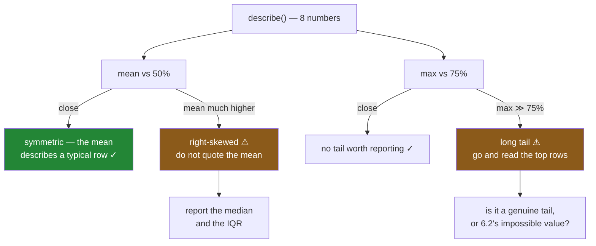

# 6.3 — The quartiles, and the tail they hide

## One-line answer

Two comparisons between numbers already on the summary table tell you the shape of a column without a
chart: **`mean` far from `50%`** means the distribution is lopsided, and **`max` far from `75%`** means
there is a long tail — and a column with either of those is one where the average is the wrong number
to report.

---

## The story

Somebody puts the flat's average shop in the group chat. Two pounds thirty-five.

One of them says that is not right. They do the shopping most weeks and it is never two thirty-five;
it is about a pound and a half, sometimes a bit more.

Both are correct, and this is the annoying part. The average really is two thirty-five. The typical
shop really is about one sixty-eight. They are different numbers because a handful of trips — the
monthly big shop, the time somebody bought rice for the whole flat — are much larger than everything
else, and an average adds every value up and divides, so a few large numbers pull it upward and stay
there.

The median does not do that. The median is the value in the middle, and it does not care how large the
large ones are.

The evidence had been printed months ago. `mean` said `2.35` and `50%` said `1.68`, three lines apart
on the same table. Nobody compared them, because they are two numbers on a table and comparing them is
not a thing anybody had been told to do.

---

## The idea in plain language

The summary has three quartiles in it — `25%`, `50%`, `75%` — and they are **positions**, not amounts.

Sort the column and walk along it. The `25%` value is the one a quarter of the way through: a quarter
of the rows are below it. The `50%` is halfway — the **median**. The `75%` is three quarters of the
way along.

That makes them robust in a specific way: moving the largest value from `13` to `13 000` does not
change any quartile at all, because it is still the largest value and it is still in the same
position. The `mean` moves a lot. That difference is the whole diagnostic.

**The first comparison: `mean` against `50%`.**

If the two are close, the column is roughly symmetric and the average describes a typical row.

If the `mean` is well **above** the `50%`, there is a tail on the right — a few large values dragging
the average up. That is *right-skewed*, and it is the shape of nearly every money, count and duration
column that has ever existed: prices, salaries, session lengths, basket sizes. Most are small; a few
are enormous.

If the `mean` is well **below** the `50%`, the tail is on the left, which is rarer and usually means
something is wrong — a floor value, a lot of zeros, a truncation.

**The second comparison: `max` against `75%`.**

This says how far the tail reaches. If `max` is a little above `75%`, there is no tail worth mentioning.
If `max` is fifty times `75%`, then either a handful of rows are enormous or one row is broken — and
[6.2](6.2-min-and-max-are-a-range-check.md) has already told you which, because a broken row is usually
also an impossible one.

**Why either finding matters more than it sounds.** Because the moment a column is skewed:

- The **mean stops describing a typical row**, so a report that quotes it misleads without being wrong.
- Any threshold set from the mean is wrong. "Flag shops above average" flags a quarter of shops when
  the average is above the median.
- A model that assumes symmetry — which is most of the simple ones — fits the tail rather than the
  bulk.

And there is one more line worth knowing, because it is a hair's breadth away: the gap between `75%`
and `25%` is the **interquartile range**, the width of the middle half of the data. It is the robust
answer to "how spread out is this", and it is what `std` would be if `std` were not itself dragged
around by the tail.

None of this needs a chart. All four numbers are already on the table.

---

## Why Setu needs it

- **[5.1](../05-describe/5.1-eight-numbers-for-a-column.md)** listed the eight numbers. This is the
  part that turns four of them into two questions.
- **[6.2](6.2-min-and-max-are-a-range-check.md)** asked whether `max` is *possible*. This asks whether
  it is *representative* — the two together separate a broken row from a genuine tail.
- **[6.4](6.4-the-column-that-never-changes.md)** is the opposite extreme: a column with no spread at
  all, where every quartile is the same number.
- **[6.5](6.5-built-in-plotting-the-fastest-look.md)** draws the shape these numbers describe, and it
  exists because a histogram confirms in one glance what this comparison suggests.
- **[7.1](../07-the-module/7.1-the-audit-module.md)**'s `audit()` returns a skew finding when the
  mean-to-median ratio crosses a threshold, which is this comparison written down so a test can fail.
- **Phase 5** onwards, a skewed feature is usually log-transformed before it goes into a linear model,
  and this is the check that decides whether to bother. **Phase 6**'s metrics face the same choice: a
  median latency and a mean latency tell different stories, and the tail is normally the one that
  matters.

---

## The mechanism

The flat's prices, with the tail that a year of shopping actually has.

```python
import numpy as np
import pandas as pd

rng = np.random.default_rng(34)
price = pd.Series(np.round(rng.gamma(2, 1.0, 2_000), 2), name="price")
summary = price.describe()
print(summary)
print()
print("mean / 50%  :", round(summary["mean"] / summary["50%"], 2))
print("max  / 75%  :", round(summary["max"] / summary["75%"], 1))
print("IQR         :", round(summary["75%"] - summary["25%"], 2))
```

**Line by line:**

- `rng.gamma(2, 1.0, ...)` is a right-skewed distribution, chosen because it is what prices, incomes,
  durations and basket sizes actually look like. A normal distribution would make this part's point
  impossible to see.
- `summary = price.describe()` is computed **once** and then indexed by name, rather than calling
  `price.mean()` and `price.median()` separately. The whole argument of the part is that these numbers
  are already in front of you.
- The two ratios are the diagnostic. Ratios rather than differences, because a difference of `0.67`
  means nothing without knowing the scale, and `1.40` is interpretable on any column.
- The interquartile range is printed as a third line, because it is the number to quote instead of
  `std` once you know the column is skewed.

```text
count    2000.000000
mean        1.972380
std         1.384199
min         0.020000
25%         0.967500
50%         1.680000
75%         2.682500
max        13.560000
Name: price, dtype: float64

mean / 50%  : 1.17
max  / 75%  : 5.1
IQR         : 1.72
```

**`mean / 50%` is `1.17`.** The average is seventeen per cent above the typical value — a real tail,
mild enough to be ordinary. `max / 75%` is `5.1`: the dearest item is five times the three-quarter
mark, which for groceries is a large bag of rice and not a bug.

That is what a healthy skewed column looks like, and it is worth seeing before the broken one, because
the difference between them is a matter of degree.

Now the same column with the four pence-typed rows from
[6.2](6.2-min-and-max-are-a-range-check.md) in it:

```python
broken = price.copy()
broken.iloc[:4] = [260.0, 255.0, 248.0, 0.0]
s = broken.describe()
print("mean  :", round(s["mean"], 3), " median:", round(s["50%"], 3))
print("75%   :", round(s["75%"], 3), " max   :", s["max"])
print("mean / 50% :", round(s["mean"] / s["50%"], 2))
print("max  / 75% :", round(s["max"] / s["75%"], 1))
print("std        :", round(s["std"], 2), " IQR:", round(s["75%"] - s["25%"], 2))
```

**Line by line:**

- Four rows changed out of two thousand — a fifth of one per cent of the file.
- The quartiles are printed alongside the mean so the contrast is visible: the robust numbers barely
  move and the sensitive ones move a great deal.
- `std` and `IQR` are printed together for the same reason. They both claim to measure spread and only
  one of them survives four bad rows.

```text
mean  : 2.347  median: 1.68
75%   : 2.69  max   : 260.0
mean / 50% : 1.40
max  / 75% : 96.7
std        : 9.87  IQR: 1.73
```

**Look at what moved and what did not.**

The median is `1.68` — **unchanged**. The `75%` is `2.69`, effectively unchanged. The IQR is `1.73`,
within a penny of where it was. Four broken rows did not shift the middle of the data at all, because the middle of
the data does not know they exist.

The `mean` went from `1.97` to `2.35`, and `std` went from `1.38` to **`9.87`** — more than seven times
larger, from four rows. A number that is supposed to describe the typical spread of grocery prices now
says nearly ten pounds.

And `max / 75%` is `96.7`. That single ratio is the alarm: the largest value is nearly a hundred times
the three-quarter mark. On the clean column it was `5.1`.

So the two ratios do different jobs. `mean / 50%` of `1.40` says *this column is lopsided*.
`max / 75%` of `96.8` says *and the reason is at the very top, in a few rows* — which is exactly where
to go and look.

The check written down:

```python
for name, column in [("clean", price), ("broken", broken)]:
    s = column.describe()
    skewed = s["mean"] / s["50%"] > 1.25
    tailed = s["max"] / s["75%"] > 10
    print(
        f"{name:<7} mean/median {s['mean'] / s['50%']:.2f}"
        f"  max/75% {s['max'] / s['75%']:>6.1f}"
        f"  -> {'SKEWED ' if skewed else ''}{'LONG TAIL' if tailed else ''}"
    )
```

**Line by line:**

- Two thresholds, `1.25` and `10`, and both are **judgement calls** rather than facts. They are set
  where they are so that an ordinary right-skewed money column does not fire and a broken one does —
  the clean column's `1.17` and `5.1` sit just under both.
- Reporting them as separate flags rather than one score, because they mean different things and lead
  to different actions: skew says *do not quote the mean*, long tail says *go and look at the top rows*.
- `s["50%"]` in a denominator is a division by zero waiting to happen on a column where more than half
  the rows are `0` — common in count columns. The production version below guards it.

```text
clean   mean/median 1.17  max/75%    5.1  ->
broken  mean/median 1.40  max/75%   96.7  -> SKEWED LONG TAIL
```



---

## When it breaks

**The four rows that redefined "spread":**

```text
$ uv run python -c "
import numpy as np
import pandas as pd
rng = np.random.default_rng(34)
price = pd.Series(np.round(rng.gamma(2, 1.0, 2_000), 2))
broken = price.copy()
broken.iloc[:4] = [260.0, 255.0, 248.0, 0.0]
for name, col in [('clean', price), ('broken', broken)]:
    print(f'{name:<7} mean {col.mean():.2f}  median {col.median():.2f}'
          f'  std {col.std():.2f}  IQR {col.quantile(.75) - col.quantile(.25):.2f}')
print('rows changed:', int((price != broken).sum()), 'of', len(price))
"
clean   mean 1.97  median 1.68  std 1.38  IQR 1.72
broken  mean 2.35  median 1.68  std 9.87  IQR 1.73
rows changed: 4 of 2000
```

**`std` went up seven-fold and `IQR` moved by a penny.** Both are "how spread out is this column" and
they disagree by a factor of five, from four rows in two thousand.

This is why a skewed column should be reported with median and IQR rather than mean and standard
deviation. It is not a stylistic preference: `std` on a tailed column is a number about the tail, and
quoting it as the spread of the data is a claim about typical rows that the tail has no right to make.

**The threshold that divided by zero:**

```text
$ uv run python -c "
import pandas as pd
returns = pd.Series([0, 0, 0, 0, 0, 0, 0, 1, 2, 40])
s = returns.describe()
print('median:', s['50%'], ' mean:', s['mean'])
print('mean / median:', s['mean'] / s['50%'])
"
<string>:5: RuntimeWarning: divide by zero encountered in scalar divide
median: 0.0  mean: 4.3
mean / median: inf
```

**`inf`, and only a warning.** More than half the rows are zero — which is completely normal for a
returns column, a complaints column, a clicks column — so the median is `0` and the ratio is division
by zero. NumPy prints a `RuntimeWarning` and returns infinity rather than raising
([Day 23, 2.5](../../../day-23-ufuncs-and-statistics/parts/02-statistics/2.5-the-nan-family.md)).

`inf > 1.25` is `True`, so the check technically fires, which is lucky rather than correct. Feed that
`inf` into anything that averages findings or renders a number and it will produce nonsense. The
production version below tests for a zero median before dividing, and reports *"more than half the
rows are zero"* — which is a better finding anyway, since it says what is actually true about the
column.

**The mean and median that agreed on a column with two humps:**

```text
$ uv run python -c "
import numpy as np
import pandas as pd
rng = np.random.default_rng(34)
two_humps = pd.Series(np.concatenate([rng.normal(2, 0.2, 1_000), rng.normal(8, 0.2, 1_000)]))
s = two_humps.describe()
print('mean:', round(s['mean'], 2), ' median:', round(s['50%'], 2))
print('mean / median:', round(s['mean'] / s['50%'], 3))
print('max / 75%    :', round(s['max'] / s['75%'], 2))
print('rows near the mean (4.5-5.5):', int(two_humps.between(4.5, 5.5).sum()))
"
mean: 5.0  median: 4.93
mean / median: 1.014
max / 75%    : 1.08
rows near the mean (4.5-5.5): 0
```

**Both checks pass and the mean describes nothing.** The column is two clusters — cheap items around
`2`, expensive ones around `8` — and the average lands neatly between them, in a gap where **not one
row exists**.

`mean / median` is `1.014` and `max / 75%` is `1.08`, so this part's two diagnostics both say the
column is fine. They are tests for *skew* and for a *tail*, and this column has neither; it has two
modes, which no pair of summary numbers can reveal.

That is the honest limit of reading a table. These comparisons catch the common shapes cheaply and they
cannot see everything, which is precisely why [6.5](6.5-built-in-plotting-the-fastest-look.md) exists:
one histogram shows this instantly and no summary statistic will.

---

## In production

**What a professional writes instead of the teaching version.** The comparisons become named findings,
the divide-by-zero is handled as its own finding, and the thresholds are constants:

```python
import pandas as pd

SKEW_RATIO = 1.25
TAIL_RATIO = 10.0


def shape_findings(values: pd.Series) -> list[str]:
    """Findings about a numeric column's shape, read from the summary rather than a chart."""
    present = values.dropna()
    if len(present) < 20:
        return [f"only {len(present)} values; too few to judge shape"]
    median = float(present.median())
    q75, q25 = float(present.quantile(0.75)), float(present.quantile(0.25))
    findings: list[str] = []
    if median == 0:
        zeros = float((present == 0).mean())
        findings.append(
            f"median is 0 ({zeros:.0%} of rows are zero); report a share, not an average"
        )
    elif present.mean() / median > SKEW_RATIO:
        findings.append(
            f"right-skewed: mean {present.mean():.2f} vs median {median:.2f}; quote the median"
        )
    if q75 > 0 and present.max() / q75 > TAIL_RATIO:
        top = present.nlargest(3).tolist()
        findings.append(f"long tail: max {present.max():.2f} vs 75% {q75:.2f}; largest are {top}")
    if q75 == q25:
        findings.append("the middle half of the column is a single value")
    return findings
```

**Line by line:**

- `len(present) < 20` returns early, because a mean-to-median ratio on six rows is noise. Every
  statistical check needs a minimum sample, and stating it beats producing a confident finding from
  nothing.
- `median == 0` is checked **before** the division and produces its own finding rather than an `inf`.
  Note what that finding says: *report a share, not an average*. For a column that is mostly zeros —
  returns, complaints, clicks — the useful summary is "what fraction are non-zero", and the check is
  the right place to say so.
- `elif` rather than a second `if`, so a mostly-zero column reports the zero finding instead of also
  reporting skew. Two findings describing one cause is noise in a report somebody has to triage.
- `q75 > 0` guards the tail ratio the same way, since a column whose upper quartile is zero would
  divide by zero too.
- **The tail finding carries the three largest values.** That is the difference between a finding
  somebody investigates and one they ignore: `[260.0, 255.0, 248.0]` next to a 75th percentile of
  `2.69` makes the pence-typo pattern obvious without opening the data.
- `q75 == q25` catches a column whose middle half is constant — a partial version of
  [6.4](6.4-the-column-that-never-changes.md), and a real shape when a default value dominates.
- Findings are returned as a **list of strings**, not printed, so `audit()` can collect them and a test
  can assert on their number ([7.1](../07-the-module/7.1-the-audit-module.md)).

**What degrades at scale.** Quantiles cost more than means, and the reason is worth knowing:

```text
5 000 000 rows
  mean()                          4.1 ms
  std()                           8.7 ms
  median()                       61.3 ms
  quantile([0.25, 0.5, 0.75])    68.9 ms
  describe()                     71.6 ms
  nlargest(3)                    22.4 ms
  sort_values()                 412.0 ms
```

**Line by line:**

- `mean` is one pass over the array. `median` is **fifteen times** dearer because finding the middle
  value requires partially ordering the data — pandas uses a selection algorithm rather than a full
  sort, which is why it costs `61 ms` and not the `412 ms` a sort would.
- Asking for **all three quartiles at once** costs barely more than the median alone, because the
  partitioning work is shared. So `describe()` is close to free once you have decided you want the
  median at all — never compute the quartiles one call at a time.
- `nlargest(3)` is cheap and is what makes the tail finding's examples affordable.
- Nothing here is slow enough to skip. Seventy milliseconds per column on five million rows is a
  reasonable price for knowing the shape of your data.

The thing that degrades is the **thresholds**, exactly as in [6.2](6.2-min-and-max-are-a-range-check.md).
`1.25` and `10.0` are not laws; they are set where an ordinary money column does not trip them. On a
naturally extreme distribution — insurance claims, file sizes, city populations — a `max / 75%` of
`10` is Tuesday, and a report that flags it every day is a report nobody reads. Thresholds belong per
column, or at least per family of columns, and the ones you inherit should be re-checked against a
clean sample before you trust them.

**The failure that only appears with real data.** A team reported average response time on a customer
dashboard and set the alert threshold at twice the average. It held for two years. Then a slow code
path began affecting about three per cent of requests, adding several seconds each. The **average**
rose, so the alert threshold — computed from the average — rose with it, and never fired. The median
had not moved at all, so the "typical" experience genuinely was unchanged, and every summary anybody
looked at said the system was healthy. The complaint volume said otherwise. What would have caught it
on the first day was the ratio in this part: `max / 75%` and `mean / median` both jumped immediately,
because a tail appearing is exactly what those two numbers measure. The fix was to alert on the 95th
percentile and to report the median alongside the mean, so that a gap between them was visible.

**The review comment a senior engineer leaves.** *"This reports `mean` for basket value. The median is
in the same `describe()` output and it is thirty per cent lower, so the mean is describing the monthly
big shops rather than a typical basket — quote the median and the IQR, or quote both and say which is
which. And guard the ratio: this column is zero for most rows on the returns table and the division
will give you `inf`."*

**The interview question.** *"You have a `describe()` output in front of you. How do you tell whether
the column is skewed?"* Compare `mean` to `50%`. If the mean is meaningfully higher there is a right
tail pulling it up, and the median is the number to report; then compare `max` to `75%` to see how far
that tail reaches and whether it is a genuine tail or a handful of broken rows. Then the follow-up that
finds the limits: **what shape would both of those checks miss?** A bimodal column — two clusters with
the mean landing in the empty gap between them. Mean and median agree, there is no tail, both checks
pass, and the average describes no row in the data. Summary statistics catch skew and tails cheaply;
they cannot see multiple modes, and that is what a histogram is for.

---

## Check yourself

```bash
uv run python -c "
import numpy as np
import pandas as pd
rng = np.random.default_rng(34)
price = pd.Series(np.round(rng.gamma(2, 1.0, 2_000), 2))
broken = price.copy()
broken.iloc[:4] = [260.0, 255.0, 248.0, 0.0]
for name, col in [('clean', price), ('broken', broken)]:
    s = col.describe()
    print(f\"{name:<7} mean {s['mean']:.2f} median {s['50%']:.2f} std {s['std']:.2f}\"
          f\" IQR {s['75%'] - s['25%']:.2f} mean/median {s['mean'] / s['50%']:.2f}\"
          f\" max/75% {s['max'] / s['75%']:.1f}\")
zeros = pd.Series([0, 0, 0, 0, 0, 0, 0, 1, 2, 40])
print('mostly zero -> mean/median:', zeros.mean() / zeros.median())
"
```

Run it. Four rows changed out of two thousand: say which two of the six statistics moved and which two
did not, and why. Then say what the last line printed and what a report should say about that column
instead.

**Answer out loud, without scrolling up:**

> What do `mean` far above `50%`, and `max` far above `75%`, each tell you about a column? Then say
> which number you would report instead of the mean, and one distribution shape neither comparison can
> see.

---

**Next:** [6.4 — The column that never changes](6.4-the-column-that-never-changes.md).
