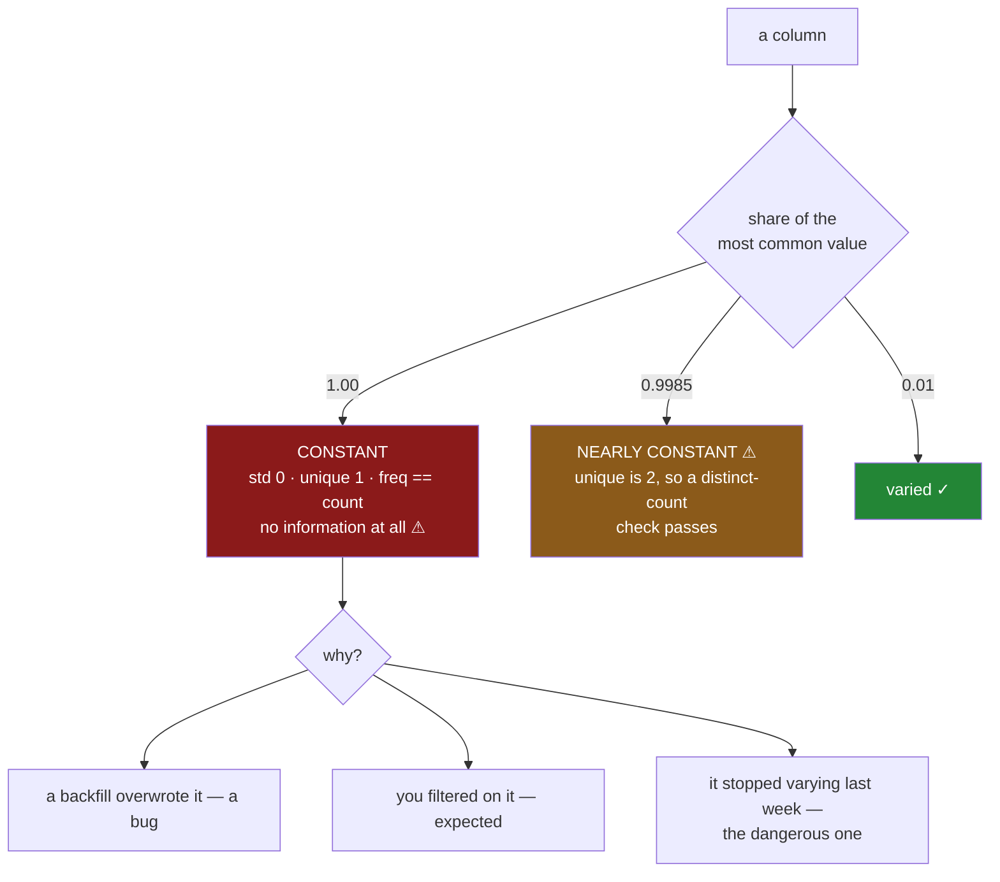

# 6.4 — The column that never changes

## One-line answer

A column holding the same value on every row carries **no information at all** — it cannot separate any
row from any other — and the summary says so plainly in one number: `std` is `0` for a numeric column
and `unique` is `1` for a label column, which are the two easiest findings on the table to read and
the two most likely to be skipped.

---

## The story

The flat's file has a `size` column. Every item has a pack size — 500g, 1kg, a two-litre bottle — and
it is genuinely useful, because the same milk in two sizes is two different purchases.

In June somebody ran a backfill to tidy up some missing sizes. It went wrong in a small, quiet way: the
default it filled with was applied to every row rather than to the blank ones, and the column has said
`500g` on every line since.

Nobody noticed. `500g` is a perfectly plausible size for most of what the flat buys. Nothing raised,
nothing looked odd in a printout of ten rows, and the column still has the right name and the right
dtype.

Six months later somebody builds a model to predict the weekly spend, and `size` is in the feature
list, because of course it is — it was useful. It sits there through training, through evaluation and
into the report, contributing precisely nothing, because a column that says the same thing about every
row cannot help distinguish any row from any other.

It looked like a feature. It was a constant with a column heading.

---

## The idea in plain language

Information is difference. A column is useful exactly to the extent that its values vary between rows,
because every question anybody asks of data — group these, compare those, predict this — is answered by
values differing.

So a column with one distinct value is the degenerate case: **maximum possible uselessness, wearing a
name that sounds meaningful.**

The summary reports it directly, and which line depends on the dtype:

- **Numeric**: `std` is `0`. Also `min == max`, and all three quartiles equal the mean.
- **Text or category**: `unique` is `1`. Also `freq == count`.

Both are single numbers, plainly visible, and both are routinely scrolled past — which is the whole
reason this is a part rather than a footnote.

**Four ways a column becomes constant**, and they need different responses:

*A backfill or default that overwrote everything.* The story. A bug, and the fix is upstream.

*A filter applied earlier.* If you selected `aisle == "dairy"` and then profile the result, `aisle` is
constant **and that is correct**. The finding is real but expected, and a report that cannot tell the
difference will cry wolf on every filtered frame.

*A column that was always constant.* A `currency` column in a business that trades in one currency, a
`source` tag, a schema version. Harmless, genuinely uninformative, and worth dropping from a feature
list but not worth an alert.

*A column that became constant.* The most dangerous. It varied for two years and stopped last Tuesday
because an upstream field was renamed and now arrives as a default. This is the one worth alerting on,
and it is invisible to a check that only looks at today's data — you need to compare against what the
column used to look like.

**And the near-miss, which is worse.** A column that is 99.9% one value is not caught by `unique == 1`,
and is very nearly as useless. `unique` is `2`, `std` is a tiny positive number, and every check passes.
For a model this is effectively a constant; for a group-by it produces one enormous group and one with
four rows in it. The measure that catches both is the **share of the most common value** —
`freq / count` — and it is a better check than the distinct count precisely because it is continuous.

---

## Why Setu needs it

- **[5.2](../05-describe/5.2-describe-on-text-and-what-changes.md)** introduced `unique` and `freq`.
  This is what to do with them, and `freq / count` is the pairing that part set up.
- **[6.3](6.3-the-quartiles-and-the-tail.md)** read spread as a *shape*. This is spread collapsed to
  nothing, and it shares the machinery: `q75 == q25` is a partial version of the same finding.
- **[5.3](../05-describe/5.3-include-exclude-and-the-column-left-out.md)** is why the story happened —
  `size` is a text column, so a bare `describe()` never showed its `unique` of `1` at all.
- **[7.1](../07-the-module/7.1-the-audit-module.md)**'s `audit()` returns a constant-column finding for
  every column regardless of dtype, which is the structural fix.
- **Day 35**'s gate asks for a clean, typed dataset, and a constant column is one of the cheapest
  things to catch before it gets there.
- **Phase 5**'s feature selection removes zero-variance features as its first step — some libraries do
  it silently, which is worse, because you never learn that a column you believed in was empty. Doing
  it yourself here means finding out.

---

## The mechanism

Four columns: one constant number, one constant label, one nearly-constant, and one normal.

```python
import numpy as np
import pandas as pd

rng = np.random.default_rng(34)
n = 2_000
frame = pd.DataFrame(
    {
        "price": np.round(rng.gamma(2, 1.0, n), 2),
        "version": np.ones(n),
        "size": pd.Series(["500g"] * n, dtype="str"),
        "channel": pd.Series(["app"] * (n - 3) + ["web"] * 3, dtype="str"),
    }
)
for column in frame.columns:
    values = frame[column]
    print(f"{column:<8} dtype {str(values.dtype):<8} distinct {values.nunique():>4}", end="")
    if pd.api.types.is_numeric_dtype(values):
        print(f"  std {values.std():.4f}  min==max {values.min() == values.max()}")
    else:
        counts = values.value_counts()
        print(f"  top share {counts.iloc[0] / values.count():.4f}")
```

**Line by line:**

- `version` is a numeric constant — a schema version stamped on every row, which is a real and common
  column.
- `size` is the story's text constant.
- `channel` is the near-miss: `app` on 1 997 rows and `web` on 3. Two distinct values, so it passes
  every `unique == 1` check, and it is useless for anything except finding those three rows.
- The loop branches on dtype because **the finding has two different names** depending on the column's
  type, which is the practical annoyance this part is about.
- `counts.iloc[0] / values.count()` is the share of the most common value, divided by the **non-missing**
  count rather than by the row count — otherwise a mostly-blank column reports a low share and looks
  varied.

```text
price    dtype float64  distinct  502  std 1.3842  min==max False
version  dtype float64  distinct    1  std 0.0000  min==max True
size     dtype str      distinct    1  top share 1.0000
channel  dtype str      distinct    2  top share 0.9985
```

**`std 0.0000` and `min==max True`.** That is the numeric finding, and it is unambiguous: a standard
deviation of exactly zero means every value equals the mean, which means every value is the same.

**`distinct 1` and `top share 1.0000`.** That is the text finding, saying the same thing about `size`.

And then `channel`: `distinct 2`, which passes a distinct-count check, and `top share 0.9985`, which
does not pass anything sensible. Three rows in two thousand carry the only variation in the column.
For a model that is a constant; for a group-by it is one group of 1 997 and one of 3.

The single measure that catches all three:

```python
for column in frame.columns:
    values = frame[column].dropna()
    share = values.value_counts(normalize=True).iloc[0] if len(values) else 1.0
    verdict = "CONSTANT" if share == 1.0 else ("NEARLY CONSTANT" if share > 0.99 else "")
    print(f"{column:<8} top value share {share:.4f}  {verdict}")
```

**Line by line:**

- `value_counts(normalize=True)` returns **proportions** rather than counts, so the first entry is
  already the share and no division is needed.
- One measure, applied to every column, **whatever its dtype**. That is the real advantage over reading
  `std` for numbers and `unique` for text: one number, one threshold, one line in a report.
- `.dropna()` first, so the share describes the values that are present. A column that is 99% missing
  and varied in the remaining 1% is a different finding
  ([6.1](6.1-count-is-a-missing-value-report.md)'s) and should not be reported as constant.
- The `0.99` threshold is a judgement call, set where a genuinely varied column will not trip it.
- `if len(values) else 1.0` treats an empty column as maximally constant, which is defensible — it
  certainly carries no information — though [6.1](6.1-count-is-a-missing-value-report.md)'s finding is
  the more useful one to report for that case.

```text
price    top value share 0.0080  
version  top value share 1.0000  CONSTANT
size     top value share 1.0000  CONSTANT
channel  top value share 0.9985  NEARLY CONSTANT
```

Four columns, one number each, and the two problems the dtype-specific checks would have needed three
different lines to find.



---

## When it breaks

**`std` on a single row, and on an empty column:**

```text
$ uv run python -c "
import numpy as np
import pandas as pd
print('100 identical :', pd.Series([5.0] * 100).std())
print('one row       :', pd.Series([5.0]).std())
print('all missing   :', pd.Series([np.nan, np.nan]).std(), ' count:', pd.Series([np.nan, np.nan]).count())
print('is 0 == nan?  :', pd.Series([5.0]).std() == 0)
"
100 identical : 0.0
one row       : nan
all missing   : nan  count: 0
is 0 == nan?  : False
```

**A constant column gives `0` and a one-row column gives `NaN`.** The reason is `std`'s divisor: it
divides by `n - 1` rather than `n` ([5.1](../05-describe/5.1-eight-numbers-for-a-column.md)), so with
one row it divides zero by zero.

That matters because a check written as `if values.std() == 0` returns `False` for `NaN` — comparisons
against `NaN` are always false
([Day 30, 1.2](../../../day-30-missing-data/parts/01-what-missing-means/1.2-nan-the-number-not-equal-to-itself.md)).
So the single-row and all-missing cases both slip through a zero-variance check, silently, and both
are columns with no information in them. The share-of-most-common measure has no such hole.

**The filtered frame that reported four constants:**

```text
$ uv run python -c "
import numpy as np
import pandas as pd
rng = np.random.default_rng(34)
n = 2_000
frame = pd.DataFrame({
    'aisle': pd.Series(rng.choice(['dairy', 'bakery', 'dry goods'], n), dtype='str'),
    'price': np.round(rng.gamma(2, 1.0, n), 2),
})
dairy = frame[frame['aisle'] == 'dairy']
print('rows          :', len(dairy))
print('aisle distinct:', dairy['aisle'].nunique())
print('would flag    :', dairy['aisle'].nunique() == 1)
"
rows          : 663
aisle distinct: 1
would flag    : True
```

**The finding is correct and the alert is wrong.** `aisle` really is constant in this frame, because
somebody filtered on it two lines earlier. Flagging it is technically right and operationally useless.

This is the reason a constant-column check belongs at the **boundary** — where data is read, before any
filtering — rather than wherever somebody happens to call `audit()`. A check that fires on every
filtered frame gets muted, and a muted check protects nothing. If you must run it on a derived frame,
pass the columns that were filtered on so they can be excluded by name.

**The column that stopped varying, which today's data cannot reveal:**

```text
$ uv run python -c "
import pandas as pd
history = pd.Series(['app'] * 500 + ['web'] * 400 + ['phone'] * 100, dtype='str')
today = pd.Series(['app'] * 1_000, dtype='str')
print('history distinct:', history.nunique(), ' top share:', round(history.value_counts(normalize=True).iloc[0], 3))
print('today   distinct:', today.nunique(), ' top share:', round(today.value_counts(normalize=True).iloc[0], 3))
print('today alone looks like:', 'a constant column')
print('compared to history   :', 'two values disappeared')
"
history distinct: 3  top share: 0.5
today   distinct: 1  top share: 1.0
today alone looks like: a constant column
compared to history   : two values disappeared
```

**A check on today's file cannot tell "always constant" from "became constant".** Both look identical:
one distinct value, share `1.0`.

The difference is the whole severity of the finding. A `currency` column that has always said `GBP` is
a shrug; a `channel` column that said three things last week and one thing today means an upstream
field is broken and two thirds of the traffic is being mislabelled. Distinguishing them requires
remembering what the column used to look like — which is why mature pipelines store the previous run's
profile and compare, rather than only checking the current one.

---

## In production

**What a professional writes instead of the teaching version.** One measure for every dtype, an
exclusion list for columns that are constant on purpose, and a severity that depends on why:

```python
import pandas as pd

NEARLY = 0.99
EXPECTED_CONSTANT = frozenset({"currency", "schema_version"})


def constant_findings(
    frame: pd.DataFrame, *, filtered_on: frozenset[str] = frozenset()
) -> list[str]:
    """Columns carrying no usable information, skipping the ones that are constant by design."""
    findings: list[str] = []
    for column in frame.columns:
        if column in EXPECTED_CONSTANT or column in filtered_on:
            continue
        values = frame[column].dropna()
        if values.empty:
            continue
        share = float(values.value_counts(normalize=True).iloc[0])
        if share == 1.0:
            findings.append(f"{column}: one value ({values.iloc[0]!r}) on all {len(values)} rows")
        elif share > NEARLY:
            top = values.value_counts().index[0]
            findings.append(
                f"{column}: {share:.2%} is {top!r}; only {len(values) - int(share * len(values))} rows differ"
            )
    return findings
```

**Line by line:**

- One measure — the share of the most common value — applied regardless of dtype, so there is no
  branch on `std` for numbers and `unique` for text, and no chance of a dtype falling between the two.
- `EXPECTED_CONSTANT` is a **named constant listing columns that are constant on purpose**. Without it
  this check reports the same two harmless columns every single run, and a report with permanent noise
  in it stops being read. Note it is a list of *exceptions with a reason*, not a threshold to loosen.
- `filtered_on` is passed **by the caller**, because only the caller knows what it filtered. That is
  the fix for the false alarm in §*When it breaks*, and making it a parameter rather than guessing is
  the honest design.
- `values.empty: continue` skips all-missing columns, leaving them to
  [6.1](6.1-count-is-a-missing-value-report.md) rather than reporting the same column twice under two
  names. One cause, one finding.
- The constant finding includes **the value itself** — `'500g'` — which is what makes it immediately
  diagnosable: a person reading `size: one value ('500g') on all 240000 rows` knows instantly whether
  that is the backfill default.
- The nearly-constant finding reports **how many rows differ** rather than only the share, because
  "only 3 rows differ" tells you whether this is a dying column or a rare-but-real category.
- Findings are strings in a list, so `audit()` can count them and a test can assert the count
  ([7.1](../07-the-module/7.1-the-audit-module.md)).

**What degrades at scale.** The check is cheap, and cheaper still on the dtype section 2 recommended:

```text
2 000 000 rows
  std()                             8.7 ms
  nunique()                        58.9 ms
  value_counts(normalize=True)     61.2 ms
  the same on a category column     9.4 ms
  min() == max()                    4.4 ms
20 columns, mixed
  full constant check              1.21 s
  after converting labels          0.19 s
```

**Line by line:**

- `std` and `min == max` are one pass each and are very cheap, but they only work on numeric columns,
  which is exactly where this finding matters least — a constant *label* column is the common case.
- `value_counts` costs about seven times `std`, because it hashes every value. That is the price of a
  measure that works on any dtype, and at sixty milliseconds per column it is worth paying.
- **On a `category` column it is six times faster than on text**, because the distinct values are
  already known from the dtype and counting is a `bincount` over the codes
  ([5.2](../05-describe/5.2-describe-on-text-and-what-changes.md) measured the same effect for
  `describe`). Converting labels first turns a 1.2-second audit into a 0.2-second one.
- So the recommended order is again: convert labels to `category`, then profile. The memory
  optimisation and the quality report help each other.

The thing that degrades is **relevance**. On a twenty-column frame you read every finding. On a
five-hundred-column feature store, a constant-column report is dozens of lines long, most of them
expected, and it gets skimmed. That is what `EXPECTED_CONSTANT` is for, and why the genuinely useful
version compares against the previous run — *these three columns became constant since yesterday* is a
short, actionable list, where *these forty columns are constant* is wallpaper.

**The failure that only appears with real data.** A fraud team had a model with eighty features. One of
them, a device-type flag, stopped being populated after a mobile SDK upgrade and arrived as the same
default on every row. The model retrained weekly, and the retrained model was fine — the feature simply
contributed nothing, and eighty features minus one useful one is still a working model, so no metric
moved enough to alarm anybody. It was found eleven months later during an unrelated audit. The cost was
not the accuracy; it was that a genuinely predictive signal had been switched off for a year and nobody
knew, because a feature that becomes constant fails **silently and gracefully**. A zero-variance check
at the feature-store boundary, comparing against the previous week's profile, would have caught it on
the first run.

**The review comment a senior engineer leaves.** *"`size` has one distinct value across the whole
table — check whether that backfill in June overwrote it, because this is in the feature list and it is
contributing nothing. Also add the check on the raw frame at read time rather than here: this runs
after the dairy filter, so it will report `aisle` as constant every time and we will start ignoring
it."*

**The interview question.** *"What does a standard deviation of zero tell you about a column?"* That
every value is identical, so the column carries no information — it cannot distinguish any row from any
other, and it is useless as a feature, a group key or a filter. Then the follow-up that separates
people who have run this in production: **how would you catch the same problem on a text column, and
what would you miss?** `std` does not exist for text, so it is `unique == 1` or `freq == count`; and
what both miss is the near-constant column — 99.9% one value, `unique` of 2 — which passes every
distinct-count check and is just as useless. The measure that catches both is the share of the most
common value, which works on any dtype and is continuous rather than a cliff. And the finding worth
alerting on is not "this column is constant" but "this column *became* constant", which needs
yesterday's profile to detect.

---

## Check yourself

```bash
uv run python -c "
import numpy as np
import pandas as pd
rng = np.random.default_rng(34)
n = 2_000
frame = pd.DataFrame({
    'price': np.round(rng.gamma(2, 1.0, n), 2),
    'version': np.ones(n),
    'size': pd.Series(['500g'] * n, dtype='str'),
    'channel': pd.Series(['app'] * (n - 3) + ['web'] * 3, dtype='str'),
})
for c in frame.columns:
    v = frame[c].dropna()
    share = v.value_counts(normalize=True).iloc[0]
    print(f'{c:<8} distinct {v.nunique():>4}  top share {share:.4f}')
print()
print('std of a constant :', pd.Series([5.0] * 100).std())
print('std of one row    :', pd.Series([5.0]).std())
print('one row == 0 ?    :', pd.Series([5.0]).std() == 0)
"
```

Run it. Two columns have a top share of `1.0000` and one has `0.9985` — say which check would miss the
third and why it is nearly as useless as the other two. Then say why the last line is `False` and what
that means for a check written as `std() == 0`.

**Answer out loud, without scrolling up:**

> Which single number in `describe` tells you a numeric column never changes, and which one tells you
> the same about a text column? Then say what a column with one distinct value can contribute to a
> model, and why "became constant" is a more serious finding than "is constant".

---

**Next:** [6.5 — Built-in plotting, the fastest look](6.5-built-in-plotting-the-fastest-look.md).
