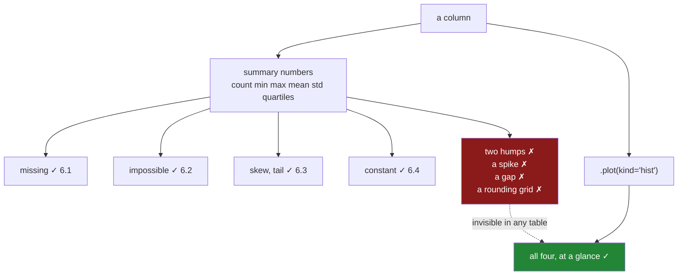

# 6.5 — Built-in plotting, the fastest look

## One-line answer

`Series.plot()` draws a chart in one call, and it earns its place today for exactly one job — seeing
the shape of a column that the summary numbers could not describe, such as the two-humped column from
[6.3](6.3-the-quartiles-and-the-tail.md) — not for making a chart anybody else will read, which is
Days 36 to 41.

---

## The story

The price column has been through every check in this section. `count` is complete. The range is
plausible. The mean and the median agree. The standard deviation is a sensible number.

By every measure on the summary table, the column is fine.

Somebody draws it anyway — one line, because it is one line — and the picture is two hills with a
valley between them. There are cheap items around one pound and expensive items around eight, and
almost nothing in the middle. The average, five pounds, sits precisely in the empty gap where no item
has ever been priced.

The number was never wrong. `5.00` really is the average. It simply does not describe anything that
exists, and no comparison between summary statistics could have said so, because the column is not
skewed and has no tail — it has two centres, and a table with one row per statistic has nowhere to put
that fact.

---

## The idea in plain language

Every check in section 6 reads **numbers about a column**. This one looks at the column.

That is a genuine difference in kind, and it matters because summary statistics are a lossy summary by
construction: eight numbers cannot describe two thousand. Most of the time the loss is harmless, and
[6.2](6.2-min-and-max-are-a-range-check.md) through [6.4](6.4-the-column-that-never-changes.md) catch
the common failures cheaply. But some shapes leave no trace in the numbers at all:

- **Two or more humps.** The story. Mean and median agree, no skew, no tail, and the average describes
  nothing.
- **A spike at one value.** Forty per cent of rows are exactly `0`, or exactly `99`, because that is
  what a default or a truncation looks like. The quartiles absorb it without comment.
- **A gap.** No values at all between two points, which usually means two sources have been stacked and
  one of them is on a different scale.
- **A grid.** Every value is a multiple of `0.05`, or of `100` — rounding somewhere upstream that
  nobody mentioned.

`.plot()` shows all four instantly. That is what it is for today.

**What the call is.** `Series.plot()` and `DataFrame.plot()` are pandas' own thin wrapper over
matplotlib. `kind=` chooses the chart, and the three worth knowing now are:

- `kind="hist"` — a **histogram**: chop the range into bins and count how many values land in each.
  This is the one for the shapes above, and it is the only one this part really needs.
- `kind="bar"` on a `value_counts()` — a bar per label, which is the categorical equivalent.
- `kind="box"` — draws the quartiles from [6.3](6.3-the-quartiles-and-the-tail.md) as a picture. Useful,
  and note it shows exactly the same information as `describe`, so it *also* cannot see two humps.

**And the boundary, which is why this part is short.** Days 36 to 41 are the real treatment of
plotting: figures and axes, labels, the choice of chart, saving for print. Today's chart has an
audience of one — you — and it exists to be looked at once and thrown away. So:

- **No labels, no title, no styling.** If you are tidying up a chart from `.plot()`, you have left the
  job this part is for.
- **Do not ship it.** A chart with a default title and an unlabelled axis is not a chart somebody else
  can read ([Day 37, 1.1](../../../day-37-labels-and-chart-choice/parts/01-labels/1.1-the-chart-that-never-said-what-the-numbers-were.md)).
- **It is a check, and a check should have a written outcome.** After looking, say what you saw — in a
  comment, in the audit's findings, somewhere a person will read. A chart you looked at and did not
  record is a check you did not run.

One practical note that catches everybody once: in a **script** rather than a notebook, nothing appears
unless you save the figure or call `show()`, and on a machine with no display you must select a
non-interactive backend first. That is `matplotlib.use("Agg")`, and it is
[Day 36, 5.1](../../../day-36-figure-and-axes/parts/05-getting-it-out/5.1-backends-and-the-script-with-no-window.md)'s
subject.

---

## Why Setu needs it

- **[6.3](6.3-the-quartiles-and-the-tail.md)** ended by naming a shape its two comparisons could not
  see. This part is the answer to that, and the reason it comes immediately after.
- **[6.4](6.4-the-column-that-never-changes.md)**'s near-constant column is instantly obvious as a
  single bar, where in the numbers it is one ratio somebody has to compare against a threshold.
- **[7.1](../07-the-module/7.1-the-audit-module.md)**'s `audit()` returns findings rather than pictures,
  and this part is what a person does when a finding needs interpreting — the chart is the follow-up to
  the report, not part of it.
- **Days 36 to 41** are the real plotting module: figure and axes, labels, chart choice, seaborn. This
  is a deliberately small preview so that today's checks can be finished properly.
- **Phase 5** onwards, looking at a feature's distribution before modelling is standard practice, and
  the reason is exactly the story: a bimodal or spiky feature needs different handling and no summary
  statistic will tell you it is one.

---

## The mechanism

The column that passes every numeric check.

```python
import matplotlib

matplotlib.use("Agg")

import matplotlib.pyplot as plt
import numpy as np
import pandas as pd

rng = np.random.default_rng(34)
two_humps = pd.Series(
    np.concatenate([rng.normal(2, 0.2, 1_000), rng.normal(8, 0.2, 1_000)]), name="price"
)
s = two_humps.describe()
print("mean         :", round(s["mean"], 2))
print("median       :", round(s["50%"], 2))
print("mean / median:", round(s["mean"] / s["50%"], 3))
print("max / 75%    :", round(s["max"] / s["75%"], 2))
print("rows between 4.5 and 5.5:", int(two_humps.between(4.5, 5.5).sum()))
```

**Line by line:**

- `matplotlib.use("Agg")` comes **before** `import matplotlib.pyplot`, and that order is not optional —
  the backend is chosen when `pyplot` is first imported, so setting it afterwards does nothing. `Agg`
  draws to a file rather than to a window, which is what a script needs.
- Two normal distributions concatenated: a thousand cheap items and a thousand dear ones. This is not
  contrived — it is what any table holding two product lines, two regions or two customer tiers looks
  like.
- The summary checks from [6.3](6.3-the-quartiles-and-the-tail.md) are run **first**, so that the chart
  has something to disprove.
- `between(4.5, 5.5)` counts rows near the mean, which is the question the numbers cannot answer and
  the chart makes obvious.

```text
mean         : 5.0
median       : 4.93
mean / median: 1.014
max / 75%    : 1.08
rows between 4.5 and 5.5: 0
```

**Every check passes and no row is anywhere near the average.** `mean / median` of `1.014` says
symmetric. `max / 75%` of `1.08` says no tail. And **zero rows** lie within half a pound of the mean.

Now the one line:

```python
ax = two_humps.plot(kind="hist", bins=40)
print("returned:", type(ax).__name__)
plt.savefig("two_humps.png")
plt.close()
```

**Line by line:**

- `kind="hist"` chops the range into bins and counts. `bins=40` is worth passing: the default of `10`
  is coarse enough to merge the two humps into one lumpy block, which would hide the very thing you are
  looking for. When hunting for shape, use more bins than feels necessary and reduce.
- `.plot()` returns an **`Axes`** — matplotlib's object for one set of drawn data with its scales. That
  is [Day 36, 1.1](../../../day-36-figure-and-axes/parts/01-the-two-objects/1.1-the-paper-and-the-frame.md)'s
  subject; today it only matters because it tells you the drawing is a real matplotlib object rather
  than a picture, so anything from Days 36 to 41 applies to it.
- `plt.savefig(...)` writes the file. Under `Agg` nothing is displayed, so without this the chart exists
  only in memory and the script ends having drawn nothing.
- `plt.close()` releases the figure. Skipping it in a loop over columns leaks memory and eventually
  triggers a warning about too many open figures
  ([Day 36, 5.4](../../../day-36-figure-and-axes/parts/05-getting-it-out/5.4-the-figures-you-never-closed.md)).

```text
returned: Axes
```

Open the file and the answer is immediate: two clear peaks, one at about `2` and one at about `8`, and
an empty valley between them where the average sits. No statistic in the summary said that, and no
statistic could have.

The categorical equivalent, which needs a different call:

```python
aisle = pd.Series(rng.choice(["dairy", "bakery", "dry goods"], 2_000), dtype="str")
counts = aisle.value_counts()
print(counts)
ax = counts.plot(kind="bar")
plt.savefig("aisle.png")
plt.close()
```

**Line by line:**

- `value_counts()` **first**, then plot. A histogram bins numbers, and there is nothing to bin in a
  column of words — the next block shows what happens if you try.
- `kind="bar"` draws one bar per label, and because `value_counts()` sorts by frequency the bars come
  out ordered largest first, which is usually what you want for a quick look. For an *ordered* category
  you would want the declared order instead, which means `.sort_index()` first
  ([3.3](../03-order/3.3-comparing-and-sorting-an-ordered-category.md)).
- Printing `counts` alongside is not redundant. For three labels the numbers are the better answer, and
  the chart only starts earning its place at twenty or thirty.

```text
bakery       697
dairy        653
dry goods    650
Name: count, dtype: int64
```

Three near-equal bars. Nothing to find, which is itself the result — and it is the case where the
printed numbers were quicker to read than the picture.



---

## When it breaks

**The histogram of words:**

```text
$ uv run python -c "
import matplotlib
matplotlib.use('Agg')
import pandas as pd
aisle = pd.Series(['dairy', 'bakery', 'dry goods'], dtype='str')
aisle.plot(kind='hist')
"
TypeError: no numeric data to plot
```

**What it means.** A histogram divides a numeric range into bins, and words have no range to divide.
The message is short and accurate, and the fix is the block above — `value_counts()` turns labels into
numbers, and *those* can be plotted as bars.

This is worth meeting because the instinct on a new frame is `frame.plot(kind="hist")` for everything
at once, and it will raise the moment one column is text — or, worse, silently plot only the numeric
columns and leave you believing you have seen the whole frame, which is
[5.3](../05-describe/5.3-include-exclude-and-the-column-left-out.md)'s omission in a new costume.

**The bin count that hid the finding:**

```text
$ uv run python -c "
import matplotlib
matplotlib.use('Agg')
import numpy as np
import pandas as pd
rng = np.random.default_rng(34)
two_humps = pd.Series(np.concatenate([rng.normal(2, 0.2, 1_000), rng.normal(8, 0.2, 1_000)]))
for bins in (2, 5, 10, 40):
    counts, edges = np.histogram(two_humps, bins=bins)
    print(f'bins={bins:>3}: {counts.tolist()}')
"
bins=  2: [1000, 1000]
bins=  5: [1000, 0, 0, 0, 1000]
bins= 10: [504, 496, 0, 0, 0, 0, 0, 0, 231, 769]
bins= 40: [6, 36, 134, 328, 332, 139, 23, 2, 0, 0, 0, 0, 0, 0, 0, 0, 0, 0, 0, 0, 0, 0, 0, 0, 0, 0, 0, 0, 0, 0, 0, 0, 0, 4, 43, 184, 335, 316, 97, 21]
```

**With two bins the column looks perfectly uniform.** Two equal bars, nothing to see, and a chart that
would have been reported as "no issues".

At five bins the gap appears. At forty, both humps have shape. The finding is a function of the bin
count, and the default is `10` — enough here, and not always. That is the honest weakness of a
histogram: it is a summary too, with a parameter, and a badly chosen parameter hides things exactly the
way a summary statistic does.

When you are looking for a shape rather than presenting one, try more than one bin count. Cheap
insurance.

**The figures nobody closed:**

```text
$ uv run python -c "
import matplotlib
matplotlib.use('Agg')
import matplotlib.pyplot as plt
import pandas as pd
import numpy as np
rng = np.random.default_rng(34)
frame = pd.DataFrame({f'c{i}': rng.normal(0, 1, 100) for i in range(25)})
for column in frame.columns:
    frame[column].plot(kind='hist')
print('open figures:', len(plt.get_fignums()))
" 2>&1 | tail -3
open figures: 1
```

**One figure, twenty-five histograms drawn on top of each other.** This is the opposite trap from the
one people expect: without an explicit new figure, `.plot()` keeps drawing onto the **current** axes,
so a loop over columns produces one unreadable chart with everything piled up rather than
twenty-five separate ones.

The fix is a fresh figure per column, or `frame.hist()`, which lays out a grid of small charts — one
per numeric column — and is the fastest whole-frame look there is. Either way, `plt.close()` after
each, because the version of this that *does* create figures will hold all of them in memory
([Day 36, 5.4](../../../day-36-figure-and-axes/parts/05-getting-it-out/5.4-the-figures-you-never-closed.md)).

---

## In production

**What a professional writes instead of the teaching version.** A profiling helper that saves one chart
per numeric column and, crucially, **writes down what it found** rather than leaving it on screen:

```python
import matplotlib

matplotlib.use("Agg")

import matplotlib.pyplot as plt
import numpy as np
import pandas as pd
from pathlib import Path


def profile_shapes(frame: pd.DataFrame, out: Path, *, bins: int = 40) -> list[str]:
    """Save a histogram per numeric column and return findings the numbers alone would miss."""
    out.mkdir(parents=True, exist_ok=True)
    findings: list[str] = []
    for column in frame.select_dtypes("number").columns:
        values = frame[column].dropna()
        if len(values) < 50:
            continue
        counts, edges = np.histogram(values, bins=bins)
        occupied = counts > 0
        gaps = int((~occupied[occupied.argmax() : len(occupied) - occupied[::-1].argmax()]).sum())
        if gaps > bins // 10:
            findings.append(
                f"{column}: {gaps}/{bins} empty bins inside the range; possibly bimodal"
            )
        top_bin = counts.max() / counts.sum()
        if top_bin > 0.5:
            findings.append(
                f"{column}: {top_bin:.0%} of rows in one bin near {edges[counts.argmax()]:.3g}"
            )
        figure, ax = plt.subplots()
        ax.hist(values, bins=bins)
        ax.set_title(f"{column} (n={len(values)})")
        figure.savefig(out / f"{column}.png", dpi=100)
        plt.close(figure)
    return findings
```

**Line by line:**

- `matplotlib.use("Agg")` before the `pyplot` import, at module level, because a profiling job runs on
  a machine with no display and the alternative is a crash or a hang.
- `select_dtypes("number")` picks the columns a histogram can accept, so the `TypeError` from
  §*When it breaks* cannot happen — the type check replaces the exception.
- `len(values) < 50: continue` skips columns too small for a shape to mean anything, the same minimum
  [6.3](6.3-the-quartiles-and-the-tail.md) used.
- **`np.histogram` is computed separately from the drawing**, and this is the key idea: the *finding*
  comes from the counts, not from a person looking at the picture. That turns "I looked and it seemed
  bimodal" into a string a test can assert on.
- The gap count deliberately trims leading and trailing empty bins before counting, so a column that
  simply does not reach the edges of its range is not reported as having gaps. Only empty bins
  **between** occupied ones suggest two clusters.
- `top_bin > 0.5` catches the spike case — half the rows at one value, which is a default or a
  truncation, and which the quartiles absorb without comment.
- `plt.subplots()` creates an explicit figure and axes rather than drawing onto whatever is current,
  which is the fix for the twenty-five-charts-in-one problem, and `plt.close(figure)` closes that
  specific one.
- The title carries the row count, because a shape drawn from 60 rows and one drawn from 6 million look
  identical and mean very different things.
- It returns **findings**, and saves charts as a side effect. A function that only saved charts would
  be a function whose output nobody reads.

**What degrades at scale.** Drawing is far more expensive than summarising, and the gap is the reason
this is a follow-up rather than a routine step:

```text
2 000 000 rows, one column
  describe()                        71.6 ms
  np.histogram(bins=40)             38.2 ms
  .plot(kind='hist', bins=40)      412.0 ms
  savefig(dpi=100)                 186.0 ms
20 numeric columns
  describe() on the frame            1.1 s
  a histogram saved per column      12.4 s
```

**Line by line:**

- **Counting is cheap; drawing is not.** `np.histogram` costs about half a `describe`, so the *finding*
  in the function above is nearly free. It is the rendering and file-writing that cost, and they are
  five to ten times the analysis.
- On twenty columns the difference is one second against twelve. That is fine as an occasional
  profiling job and not fine inside a per-batch pipeline, which is why `audit()` returns numbers and
  this returns pictures.
- `dpi=100` matters: at `dpi=300` the same save is roughly nine times slower and produces files nobody
  needs for a check they will look at once
  ([Day 36, 5.2](../../../day-36-figure-and-axes/parts/05-getting-it-out/5.2-savefig-dpi-and-bbox-inches.md)).

The thing that genuinely does not scale is **looking**. Twenty charts get looked at. Five hundred do
not, and a folder of five hundred images is indistinguishable from no check at all. That is why the
function computes findings from the histogram counts: the charts are for the handful of columns a
finding points at, and the findings are what scales.

**The failure that only appears with real data.** A team profiled a pricing feature with `describe()`
every week and it was stable for a year — same mean, same median, same quartiles, within a per cent.
Then a second market was added to the same table. The combined column now had two clusters, at very
different price levels, and the summary statistics barely moved because the new rows were symmetric
about a point that happened to be near the old mean. A model trained on it treated the average as
meaningful and priced both markets badly. One histogram at any point in that year would have shown two
humps immediately. The lesson is not that summaries are useless; it is that they answer *is this column
what it was*, and a chart answers *what is this column*, and the two questions come apart exactly when
a data source changes.

**The review comment a senior engineer leaves.** *"You are shipping the output of `df.plot()` in the
weekly report — that has no axis labels and no units, so nobody outside this team can read it. For a
report, build it properly with labels; for your own check, fine, but then write down what you saw,
because a chart nobody recorded is not evidence. And put `matplotlib.use('Agg')` before the pyplot
import or this will hang on the scheduler."*

**The interview question.** *"You have run `describe()` on a column and everything looks reasonable. Is
the column fine?"* Not necessarily — summary statistics cannot see the shape. A bimodal column has a
mean equal to its median, no skew and no tail, and the average can sit in a gap where no row exists;
a spike at a default value hides inside the quartiles; a rounding grid is invisible entirely. A
histogram shows all of those in one call. Then the follow-up that finds out whether you have relied on
one: **what can a histogram hide?** The bin count — with too few bins two clear humps merge into one
uniform-looking block, and the default is often too coarse. So try more than one bin count when you are
hunting for shape, and compute the finding from the bin counts rather than trusting a glance, because a
glance cannot be tested.

---

## Check yourself

```bash
uv run python -c "
import matplotlib
matplotlib.use('Agg')
import numpy as np
import pandas as pd
rng = np.random.default_rng(34)
two_humps = pd.Series(np.concatenate([rng.normal(2, 0.2, 1_000), rng.normal(8, 0.2, 1_000)]))
s = two_humps.describe()
print('mean/median:', round(s['mean'] / s['50%'], 3), ' max/75%:', round(s['max'] / s['75%'], 2))
print('rows near the mean:', int(two_humps.between(4.5, 5.5).sum()))
for bins in (2, 5, 40):
    counts, _ = np.histogram(two_humps, bins=bins)
    print(f'bins={bins:>3}: {counts.tolist()[:8]}')
try:
    pd.Series(['dairy', 'bakery'], dtype='str').plot(kind='hist')
except TypeError as e:
    print('text histogram:', e)
"
```

Run it. Every summary check says the column is healthy and no row lies near its mean — say what shape
the bin counts reveal. Then say why `bins=2` would have reported nothing, and what that implies about
trusting a single chart.

**Answer out loud, without scrolling up:**

> Name a distribution shape that `describe()` cannot reveal and a histogram can. Then say why today's
> chart should not be given a title and shipped, and what has to happen after you look at it.

---

**Next:** [7.1 — `src/setu/audit.py`](../07-the-module/7.1-the-audit-module.md).
