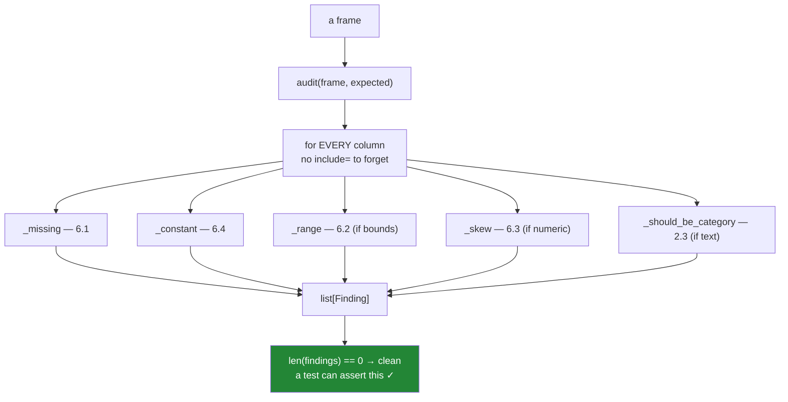

# 7.1 — `src/setu/audit.py`

## One-line answer

Every check in section 6 read a number off a table; this module turns each of them into a **finding** —
a named object with a column, a severity and a sentence — because a table cannot fail a test and a
list of findings can.

---

## The story

The flat's file has been through every check in this day. Somebody knows the aisle column should be a
category, that fifty prices are missing, that four are in pence, that `size` never changes.

They know all of it because they sat and read a summary table.

Next month the file is regenerated and nobody reads the table, because reading it was never a task
anybody was assigned — it was a thing one person did once, out of interest. The pence rows come back.
Nobody notices until the totals are wrong again.

The problem is not that the checks were hard. Every one of them was a comparison between two numbers
that were already on screen. The problem is that a **table has no opinion**. It renders identically
whether the data is perfect or ruined, so nothing about looking at it can be automated, delegated or
required. There is no way to make a table fail.

A finding can fail. That is the whole reason this module exists.

---

## The idea in plain language

The move is small and it changes everything downstream: stop returning **numbers** and start returning
**judgements**.

A number is `unique: 1`. A judgement is *"`size` holds one value on all 240 000 rows; it carries no
information"*. The number needs a person who knows what to compare it against. The judgement has
already done the comparing, so it can be counted, filtered by severity, asserted on in a test, printed
in a job log, and alerted on.

So the module has one shape:

**`audit(frame, expected) -> list[Finding]`**

and everything else is the checks that produce those findings. A run with no findings is a clean
frame; a run with findings is a list somebody can act on, ordered by how much they should care.

**What a `Finding` needs.** Four fields, and each earns its place:

- **`column`** — which column. Without it a report is unactionable.
- **`check`** — a short stable name, like `"missing"` or `"constant"`. Stable so a test can assert on
  it and an alert can be silenced per check rather than per message.
- **`severity`** — `"error"` for a frame that should not proceed, `"warning"` for something a person
  should see. Two levels, not five: the only decision anybody makes is *stop or continue*.
- **`detail`** — the sentence, with the numbers in it. This is what a human reads at three in the
  morning, so it carries the count, the share and an example.

**The checks it runs**, each one a section of this day turned into code:

| Check | Reads | From |
|---|---|---|
| `missing` | `count` against `len` | [6.1](../06-the-quality-report/6.1-count-is-a-missing-value-report.md) |
| `range` | `min` and `max` against declared bounds | [6.2](../06-the-quality-report/6.2-min-and-max-are-a-range-check.md) |
| `skew` | `mean` against `50%` | [6.3](../06-the-quality-report/6.3-the-quartiles-and-the-tail.md) |
| `constant` | share of the most common value | [6.4](../06-the-quality-report/6.4-the-column-that-never-changes.md) |
| `cardinality` | distinct against rows | [2.3](../02-the-category-dtype/2.3-the-code-width-and-where-the-saving-stops.md) |
| `dtype` | text that should be a category | [2.2](../02-the-category-dtype/2.2-astype-category-and-the-saving-measured.md) |

**Two design decisions worth stating**, because they are what make the module usable rather than
annoying.

*It iterates over columns, not over dtypes.* Every column gets every applicable check, so the omission
in [5.3](../05-describe/5.3-include-exclude-and-the-column-left-out.md) is structurally impossible —
there is no `include=` to forget.

*It takes an `expected` argument.* Bounds, columns that are constant by design, and columns that were
filtered on are **inputs**, because only the caller knows them. A check that guesses will cry wolf, and
a check that cries wolf gets switched off ([6.4](../06-the-quality-report/6.4-the-column-that-never-changes.md)).

---

## Why Setu needs it

- **Sections 5 and 6** are the checks. This is where they stop being things a person does and become
  things the code does.
- **[7.2](7.2-the-test-that-can-go-red.md)** tests this module, and the reason it can is that findings
  are countable — an assertion on a finding count is possible where an assertion on a printed table is
  not.
- **Day 35**'s gate names `audit()` as a required artifact: the phase closes on a clean, typed, joined
  dataset, and "clean" has to mean something checkable.
- **[Day 33, 7.1](../../../day-33-text-and-time/parts/07-the-module/7.1-the-textdate-module.md)** built
  `textdate.py` with the same exception family. This module imports rather than redefines it.
- **Phase 5** onwards, this is the first thing that runs on a feature table, and **Phase 6**'s
  monitoring is this module on a schedule with the findings sent somewhere.

---

## The mechanism

The module's shape: the finding, the policy, and the exception family.

```python
"""Data-quality findings for a frame - section 6's checks, as objects a test can count."""

from __future__ import annotations

import logging
from dataclasses import dataclass, field

import pandas as pd

from setu.select import SelectionError

log = logging.getLogger(__name__)

CONSTANT_SHARE = 0.99
SKEW_RATIO = 1.25
CATEGORY_RATIO = 0.5
MIN_ROWS_FOR_SHAPE = 50
SEVERITIES = ("error", "warning")


class AuditError(SelectionError):
    """The frame cannot be audited at all - not a finding about its contents."""


@dataclass(frozen=True)
class Finding:
    """One judgement about one column."""

    column: str
    check: str
    severity: str
    detail: str

    def __post_init__(self) -> None:
        if self.severity not in SEVERITIES:
            raise ValueError(f"severity={self.severity!r}; use one of {SEVERITIES}")

    def __str__(self) -> str:
        return f"[{self.severity}] {self.column}.{self.check}: {self.detail}"


@dataclass
class Expected:
    """What the caller knows and the frame cannot: bounds, and columns that are constant by design."""

    bounds: dict[str, tuple[float, float]] = field(default_factory=dict)
    constant_by_design: frozenset[str] = frozenset()
    filtered_on: frozenset[str] = frozenset()
```

**Line by line:**

- Five constants at the top, because these are the five thresholds the day chose, and a reader should
  find them without reading any check. Each is a **policy**, which is exactly the kind of value no
  behaviour test can defend ([7.2](7.2-the-test-that-can-go-red.md)).
- `AuditError` subclasses Day 28's `SelectionError` rather than starting a new family. It means
  *this frame cannot be audited* — empty, or a bound naming a column that does not exist — which is
  different from *this frame has problems*, and the difference matters: one is a bug in the caller and
  the other is the module working.
- `Finding` is `frozen=True`, so a finding cannot be edited after it is made. A report that can be
  rewritten by whatever reads it is not evidence.
- `__post_init__` validates the severity at construction, so a typo like `"err"` fails where it is
  written rather than in the code that filters on it later.
- `__str__` gives one readable line, so printing a list of findings needs no formatting code at the
  call site.
- `Expected` is a small dataclass rather than three loose arguments, so adding a fourth kind of
  expectation later does not change every signature. `field(default_factory=dict)` because a mutable
  default shared between calls is the oldest bug in Python
  ([Day 19, 2.2](../../../day-19-typing-dataclasses-and-concurrency/parts/02-dataclasses/2.2-default-factory.md)).

The checks, one function each:

```python
def _missing(values: pd.Series, name: str) -> list[Finding]:
    absent = int(values.isna().sum())
    if absent == 0:
        return []
    share = absent / len(values)
    severity = "error" if share > 0.5 else "warning"
    return [
        Finding(name, "missing", severity, f"{absent} of {len(values)} rows blank ({share:.1%})")
    ]


def _constant(values: pd.Series, name: str) -> list[Finding]:
    present = values.dropna()
    if present.empty:
        return []
    share = float(present.value_counts(normalize=True).iloc[0])
    if share == 1.0:
        return [
            Finding(name, "constant", "warning", f"one value ({present.iloc[0]!r}) on every row")
        ]
    if share > CONSTANT_SHARE:
        differing = len(present) - int(round(share * len(present)))
        return [
            Finding(name, "constant", "warning", f"{share:.2%} one value; {differing} rows differ")
        ]
    return []


def _range(values: pd.Series, name: str, bounds: tuple[float, float]) -> list[Finding]:
    low, high = bounds
    if not pd.api.types.is_numeric_dtype(values):
        raise AuditError(
            f"{name!r} has bounds but is {values.dtype}; a text comparison is alphabetical"
        )
    present = values.dropna()
    if present.empty:
        return [Finding(name, "range", "warning", "no values present; range NOT checked")]
    outside = (present < low) | (present > high)
    if not outside.any():
        return []
    examples = present[outside].head(3).tolist()
    return [
        Finding(
            name,
            "range",
            "error",
            f"{int(outside.sum())} of {len(present)} outside [{low}, {high}]; e.g. {examples}",
        )
    ]
```

**Line by line:**

- Each check is a **separate function returning a list**, so `audit()` is a loop that concatenates.
  Returning a list rather than an optional finding means a check that grows a second finding later
  needs no change at its call site.
- `_missing` chooses severity from the **share**, not the count. More than half blank is a broken
  column and should stop a pipeline; a handful is a warning. That threshold is the only judgement in
  the function and it is visible on one line.
- `_constant` returns `[]` for an empty column rather than reporting it — that is `_missing`'s finding,
  and reporting one cause twice under two names is how a report becomes noise
  ([6.4](../06-the-quality-report/6.4-the-column-that-never-changes.md)).
- `_constant` uses the share of the most common value, which works on **any** dtype, so there is no
  branch on numeric-versus-text and no chance of a dtype falling between two checks.
- `_range` **raises** rather than returning a finding when the dtype is wrong. That is the distinction
  `AuditError` exists for: a bound declared on a text column is a mistake in the caller's `Expected`,
  not a fact about the data, and a comparison would silently be alphabetical
  ([6.2](../06-the-quality-report/6.2-min-and-max-are-a-range-check.md)).
- The empty-column case returns a finding that says **"NOT checked"** rather than nothing. A report
  with three states — pass, fail, could-not-check — is honest; one with two will certify an empty
  column as clean.
- `examples` puts three offending values in the detail, so `[260.0, 255.0, 248.0]` makes the
  pence-typing obvious without anybody fetching rows.

And the function that ties them together:

```python
def audit(frame: pd.DataFrame, expected: Expected | None = None) -> list[Finding]:
    """Every check in this day, for every column. An empty list means the frame is clean."""
    expected = expected or Expected()
    if frame.empty:
        raise AuditError("frame has no rows; there is nothing to audit")
    unknown = set(expected.bounds) - set(frame.columns)
    if unknown:
        raise AuditError(f"bounds declared for columns not in the frame: {sorted(unknown)}")

    findings: list[Finding] = []
    for name in frame.columns:
        values = frame[name]
        findings += _missing(values, name)
        if name not in expected.constant_by_design and name not in expected.filtered_on:
            findings += _constant(values, name)
        if name in expected.bounds:
            findings += _range(values, name, expected.bounds[name])
        if pd.api.types.is_numeric_dtype(values):
            findings += _skew(values, name)
        elif values.dtype == "str":
            findings += _should_be_category(values, name)

    log.info("audit: %d columns, %d findings", len(frame.columns), len(findings))
    return sorted(findings, key=lambda f: (f.severity != "error", f.column, f.check))
```

**Line by line:**

- `frame.empty` raises rather than returning `[]`. An empty frame producing "no findings" would read as
  a clean bill of health, which is the vacuous pass this whole day is about.
- The `unknown` check catches a bound declared for a column that has been **renamed or dropped**
  upstream. Without it, a range check silently stops running the day somebody renames `price` to
  `unit_price`, and the report keeps saying everything is fine.
- **The loop is over `frame.columns`.** Every column, always. That is the structural fix for
  [5.3](../05-describe/5.3-include-exclude-and-the-column-left-out.md)'s omission — there is no dtype
  filter to forget and no argument that changes the coverage.
- `constant_by_design` and `filtered_on` skip the constant check only, not the whole column. A column
  you filtered on can still be missing values.
- The `if`/`elif` on dtype selects the checks that only make sense for one kind, and `_missing` and
  `_constant` sit outside it because they apply to everything.
- `sorted(...)` with `f.severity != "error"` first puts errors before warnings — `False` sorts before
  `True` — then groups by column. A report is read from the top, so the ordering is part of the
  design.
- It returns a **list**, not a printed table. `len(audit(frame))` is a number a test can assert on,
  which is the entire point of the module.



And the unfinished parts, which are the day's three reps:

```python
def _skew(values: pd.Series, name: str) -> list[Finding]:
    """Flag a column whose mean is far from its median.

    TODO(me): this divides by the median and the returns column is zero on most rows.
      1. Guard the zero median, and say in the finding what is true instead - that most
         rows are zero, which is a share rather than an average (6.3).
      2. Add the tail check: max against the 75th percentile, with the three largest
         values in the detail.
      3. Skip columns with fewer than MIN_ROWS_FOR_SHAPE values; a ratio on six rows is noise.
    """
    median = float(values.median())
    if values.mean() / median > SKEW_RATIO:
        return [
            Finding(name, "skew", "warning", f"mean {values.mean():.2f} vs median {median:.2f}")
        ]
    return []
```

**Line by line:**

- `values.mean() / median` is the comparison from
  [6.3](../06-the-quality-report/6.3-the-quartiles-and-the-tail.md) and it is correct for a column with
  a non-zero median.
- On a column that is mostly zeros — returns, complaints, clicks — `median` is `0.0`, the division
  gives `inf` with a `RuntimeWarning`, and `inf > 1.25` is `True`, so it reports skew rather than the
  more useful fact that most rows are zero.
- The docstring names all three gaps rather than saying "improve this", so the rep is checkable.

Two more reps go in the same file, and neither is written for you.
**`_should_be_category(values, name)`** returns a finding when a text column's distinct-to-rows ratio is
below `CATEGORY_RATIO`, with the measured saving in the detail — and a comment on why the ratio decides
this rather than the dtype ([2.3](../02-the-category-dtype/2.3-the-code-width-and-where-the-saving-stops.md)).
**`compare(previous, current)`** takes two finding lists and returns only what is **new**, with a
comment on why "this column became constant" is a more serious finding than "this column is constant"
([6.4](../06-the-quality-report/6.4-the-column-that-never-changes.md)) — and on what that implies about
storing each run's findings.

---

## When it breaks

**The empty frame that would have passed:**

```text
$ uv run python -c "
import pandas as pd
from setu.audit import audit
print(audit(pd.DataFrame({'price': [], 'aisle': []})))
"
setu.audit.AuditError: frame has no rows; there is nothing to audit
```

**What it means, and why it is a raise rather than a finding.** A loader that returns nothing — a bad
filter, a missing file, a join that matched no rows — produces a frame with the right columns and no
data. Every check passes on it, because there is nothing to fail them, and `audit()` would return `[]`
which reads as *clean*.

An empty frame is not a clean frame. It is a broken pipeline, and the module refuses to grade it.

**The bound that quietly stopped being checked:**

```text
$ uv run python -c "
import pandas as pd
from setu.audit import audit, Expected
frame = pd.DataFrame({'unit_price': [1.0, 2.0, 260.0], 'aisle': pd.Series(['a', 'b', 'c'], dtype='str')})
print(audit(frame, Expected(bounds={'price': (0.01, 20.0)})))
"
setu.audit.AuditError: bounds declared for columns not in the frame: ['price']
```

**The rename is the whole bug.** Somebody renamed `price` to `unit_price` upstream. Without this check
the range test simply would not run — `"price" in expected.bounds` would be `False` for every column,
no finding would be produced, and the report would say the frame is clean while a value of `260` sat
in it.

That is the most dangerous shape a quality check can take: one that silently stops applying. Asserting
that every declared bound found a column costs three lines and closes it.

**The finding that was edited after the fact:**

```text
$ uv run python -c "
from setu.audit import Finding
f = Finding('price', 'range', 'error', '3 rows outside [0.01, 20.0]')
print(f)
f.severity = 'warning'
"
[error] price.range: 3 rows outside [0.01, 20.0]
dataclasses.FrozenInstanceError: cannot assign to field 'severity'
```

**What it means.** `frozen=True` refuses the assignment. That looks like pedantry until you picture the
code that would have written it: a reporting layer downgrading errors so that a dashboard stays green,
or a retry loop mutating findings in place and losing the original.

Evidence that can be edited by whatever reads it is not evidence. If a severity genuinely needs
overriding, that is a **policy** applied when findings are filtered, visible in the code that does it,
not a quiet mutation of the record.

**The severity typo:**

```text
$ uv run python -c "
from setu.audit import Finding
Finding('price', 'range', 'err', 'three rows outside the bounds')
"
ValueError: severity='err'; use one of ('error', 'warning')
```

**Caught at construction, which is the only useful place.** Without `__post_init__` this finding would
be created happily and then silently ignored by every filter written as
`[f for f in findings if f.severity == "error"]` — a real problem, correctly detected, invisible in the
report because of a three-letter typo.

---

## In production

**What a professional writes instead of the teaching version.** The module is the shape above; what
changes in production is what happens to the findings:

```python
import json
import logging
from pathlib import Path

log = logging.getLogger(__name__)


def gate(frame: pd.DataFrame, expected: Expected, *, out: Path | None = None) -> list[Finding]:
    """Audit a frame at a boundary. Errors stop the pipeline; warnings are recorded."""
    findings = audit(frame, expected)
    errors = [f for f in findings if f.severity == "error"]
    if out is not None:
        out.write_text(
            json.dumps([f.__dict__ for f in findings], indent=2, default=str), encoding="utf-8"
        )
    for finding in findings:
        log.warning("%s", finding) if finding.severity == "warning" else log.error("%s", finding)
    if errors:
        raise AuditError(f"{len(errors)} error findings; first: {errors[0]}")
    return findings
```

**Line by line:**

- `gate` is the thing a pipeline calls; `audit` stays a pure function returning findings. Separating
  them is what lets the tests call `audit` and assert on a list without a pipeline stopping.
- Findings are written to a **file as JSON** before anything raises, so the record survives the failure.
  A quality report that only exists in a traceback is a report you lose exactly when you need it.
- `default=str` in the dump, because a bound or an example value may be a NumPy scalar or a timestamp
  that `json` cannot serialise on its own — a small detail that otherwise turns a quality failure into
  a serialisation failure.
- Every finding is logged, at the level matching its severity, so warnings are searchable in a log
  aggregator without failing anything.
- Only **errors** raise. Warnings are for a person; errors stop the data moving. That two-level split
  is why `Finding` has exactly two severities.
- The exception message carries the **first** error rather than all of them, because an exception
  message that is four hundred lines long is unreadable and the file has the full list.

**What degrades at scale.** The audit is a handful of passes per column, and the expensive one is the
distinct count:

```text
2 000 000 rows, 12 columns
  _missing, all columns             38 ms
  _constant, text columns          712 ms
  _constant, after astype(category) 98 ms
  _range, numeric columns           26 ms
  _skew, numeric columns           184 ms
  full audit(), text labels        1.04 s
  full audit(), category labels    0.38 s
```

**Line by line:**

- `_missing` and `_range` are single passes over contiguous arrays and cost almost nothing.
- `_constant` dominates, because `value_counts` hashes every value. **Converting the label columns to
  `category` first makes it seven times faster**, because the distinct values are already known from
  the dtype — so section 2's memory optimisation pays for section 6's report, and the recommended
  order is convert, then audit.
- `_skew` costs more than the other numeric checks because a median needs partial ordering
  ([6.3](../06-the-quality-report/6.3-the-quartiles-and-the-tail.md)).
- A full audit in under half a second on two million rows is cheap enough to run at **every** boundary,
  which is the argument for putting it in the loader rather than in a notebook.

The thing that degrades is not runtime, it is **the finding list**. On twelve columns a report of six
findings gets read. On a five-hundred-column feature table the same rules produce a hundred and forty
findings, most of them expected, and the list becomes wallpaper. That is what `constant_by_design`
exists for, and it is why the `compare(previous, current)` rep matters more than it looks: at scale the
useful report is not *what is wrong* but *what is newly wrong*, and that needs the previous run's
findings stored.

**The failure that only appears with real data.** A team ran a quality check at the top of a nightly
job with a hard-coded list of columns to check. Over two years the table gained nineteen columns and
the list gained none, so the check was covering less than half the table when a new column began
arriving null. Nothing failed, because that column was not in the list. The fix was the loop in
`audit()` — over `frame.columns`, not over a list — and the lesson is that any coverage decision made
by enumeration will drift out of date, silently, while continuing to report success.

**The review comment a senior engineer leaves.** *"This returns a formatted string and prints it, so
the only way to act on it is for a human to read the logs. Return a list of findings with a severity
so the pipeline can stop on errors and the tests can assert on the count. And loop over
`frame.columns` rather than the list at the top of the file — that list is two years old and the table
has nineteen more columns than it does."*

**The interview question.** *"You have written a data-quality report. How do you make sure anybody acts
on it?"* By not making it a report. A printed table renders identically whether the data is perfect or
ruined, so nothing about it can be required or automated; returning a list of typed findings with
severities means a pipeline can stop on errors, a test can assert the count is zero, and an alert can
fire per check. Then the follow-up that separates people who have run one: **what does your check do
on an empty frame?** It must refuse rather than pass — every check succeeds vacuously on no rows, so
an empty frame produces zero findings and reads as a clean bill of health, which is exactly the
failure a quality gate exists to prevent.

---

## Check yourself

```bash
uv run python -c "
import numpy as np
import pandas as pd
from setu.audit import audit, Expected, Finding

rng = np.random.default_rng(34)
n = 2_000
frame = pd.DataFrame({
    'price': np.round(rng.gamma(2, 1.0, n), 2),
    'size': pd.Series(['500g'] * n, dtype='str'),
    'aisle': pd.Series(rng.choice(['dairy', 'bakery', 'dry goods'], n), dtype='str'),
})
frame.iloc[:4, frame.columns.get_loc('price')] = [260.0, 255.0, 248.0, 0.0]
frame.loc[rng.choice(n, 50, replace=False), 'price'] = np.nan
for f in audit(frame, Expected(bounds={'price': (0.01, 20.0)})):
    print(f)
print('findings:', len(audit(frame, Expected(bounds={'price': (0.01, 20.0)}))))
try:
    audit(pd.DataFrame({'price': []}))
except Exception as e:
    print('empty frame:', e)
"
```

Then open `src/setu/audit.py` and read `_skew`'s docstring. Say which of its three listed gaps would
show on the flat's own price column, and which one needs a different column entirely to reveal.

**Answer out loud, without scrolling up:**

> What does a `Finding` carry that a row of `describe()` does not? Then say why `audit()` loops over
> every column rather than taking a list, and why an empty frame raises instead of returning no
> findings.

---

**Next:** [7.2 — the test that can go red](7.2-the-test-that-can-go-red.md).
