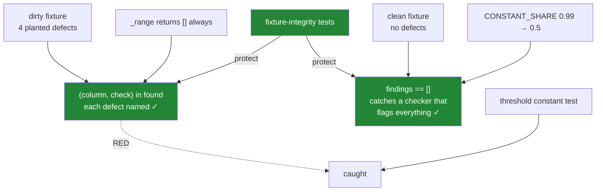

# 7.2 — The test that can go red

## One-line answer

The tests for a quality module have to assert on **findings** — that this frame produces exactly this
check on exactly this column — because a test asserting that `audit()` returned a list passes on a
module that returns an empty list forever, which is precisely the failure a quality gate exists to
prevent.

---

## The story

Somebody writes the tests for `audit.py`. There is a test per check, they all pass, and the suite is
quick.

Then, tidying up, they change one line in `_constant`: the threshold comparison from `>` to `>=`.
Green. They change `CONSTANT_SHARE` from `0.99` to `0.5`. Green. They make `_range` return an empty
list unconditionally — the entire check disabled, one line — and the suite is still green.

Every test asserted that `audit()` returned a list, that the list contained `Finding` objects, and
that nothing raised. All of which remained true with the range check switched off.

The module that exists to stop broken data reaching production had no test that could tell whether it
was working.

---

## The idea in plain language

[Day 33, 7.2](../../../day-33-text-and-time/parts/07-the-module/7.2-the-test-that-can-go-red.md)
established the shape: when a function fails silently, assert the one number that separates working
from broken. This module makes that easier in one way and harder in another.

**Easier**, because the module was built to be testable. `audit()` returns a list, so
`len(findings) == 0` is a real assertion — that is the whole reason
[7.1](7.1-the-audit-module.md) returns findings rather than printing a table.

**Harder**, because a quality checker has a failure mode that ordinary code does not: it can pass by
**finding nothing**. Every other module in this curriculum breaks by producing a wrong answer. This one
breaks by producing no answer, and no answer looks exactly like good news.

So the tests come in three kinds, and all three are needed.

**Kind one: a dirty fixture must produce a specific finding.** Not "some findings" — the *named check*
on the *named column*. `assert len(findings) > 0` passes when the constant check fires and the range
check is broken, which is how the story happened. Assert
`("price", "range") in {(f.column, f.check) for f in findings}`.

**Kind two: a clean fixture must produce nothing.** Without it, a module that returns a finding for
every column on every frame passes all of kind one. False positives are as fatal as false negatives
here, because a check that fires constantly gets switched off
([6.4](../06-the-quality-report/6.4-the-column-that-never-changes.md)).

**Kind three: the fixture itself is still dirty.** The vacuity check from Day 33 — a fixture that has
been tidied stops carrying the defect and the test silently stops testing anything.

And then the limit, which is the same limit as Day 33's: **the thresholds cannot be defended by
behaviour tests.** `CONSTANT_SHARE = 0.99` can be changed to `0.5` and every test of behaviour still
passes, because the module still works exactly as documented — it just documents something different
now. The only defences are a test asserting the constant's value and a review culture that treats a
threshold as policy.

---

## Why Setu needs it

- **[7.1](7.1-the-audit-module.md)** is the module. This is the file that keeps it honest, and its
  three `TODO(me)` reps are graded by whether you can write a test that goes red without them.
- **[Day 33, 7.2](../../../day-33-text-and-time/parts/07-the-module/7.2-the-test-that-can-go-red.md)**
  set the pattern. This is the same argument one level up: there, functions failed silently; here, the
  *checker* for silent failures can itself fail silently.
- **Day 35**'s gate runs this suite, so a vacuous test here is a gate that passes an unclean phase —
  and the gate is the last thing standing between Phase 4 and Phase 5.
- **[6.4](../06-the-quality-report/6.4-the-column-that-never-changes.md)** and
  **[6.2](../06-the-quality-report/6.2-min-and-max-are-a-range-check.md)** are the checks whose
  thresholds this file pins.
- **Phase 7** onwards, every eval has this exact shape: a judge that returns "no problems" is
  indistinguishable from a judge that is broken, unless something asserts it can still say yes.

---

## The mechanism

Two fixtures — one deliberately dirty, one deliberately clean — and the tests that prove they are.

```python
"""Tests for setu.audit - a checker's tests must prove it can still find things."""

import numpy as np
import pandas as pd
import pytest

from setu.audit import CONSTANT_SHARE, SKEW_RATIO, AuditError, Expected, Finding, audit


@pytest.fixture
def dirty() -> pd.DataFrame:
    """Four planted defects: missing prices, pence typos, a constant column, a skewed column."""
    rng = np.random.default_rng(34)
    n = 2_000
    frame = pd.DataFrame(
        {
            "price": np.round(rng.gamma(2, 1.0, n), 2),
            "size": pd.Series(["500g"] * n, dtype="str"),
            "aisle": pd.Series(rng.choice(["dairy", "bakery", "dry goods"], n), dtype="str"),
        }
    )
    frame.iloc[:4, frame.columns.get_loc("price")] = [260.0, 255.0, 248.0, 0.0]
    frame.loc[rng.choice(n, 50, replace=False), "price"] = np.nan
    return frame


@pytest.fixture
def clean() -> pd.DataFrame:
    """No defects at all. The fixture that catches a checker which flags everything."""
    rng = np.random.default_rng(34)
    n = 2_000
    return pd.DataFrame(
        {
            "price": np.round(rng.uniform(0.5, 4.0, n), 2),
            "aisle": pd.Series(rng.choice(["dairy", "bakery", "dry goods"], n), dtype="str"),
        }
    )


BOUNDS = Expected(bounds={"price": (0.01, 20.0)})


def test_the_dirty_fixture_still_has_its_defects(dirty: pd.DataFrame) -> None:
    assert dirty["price"].isna().sum() == 50, "the missing prices have been filled in"
    assert (dirty["price"] > 20).sum() == 3, "the pence typos have been cleaned up"
    assert dirty["size"].nunique() == 1, "the constant column has gained a value"


def test_the_clean_fixture_is_actually_clean(clean: pd.DataFrame) -> None:
    assert clean.notna().all().all(), "the clean fixture has gained a missing value"
    assert clean["price"].between(0.01, 20.0).all(), "the clean fixture has gained an outlier"
    assert clean["aisle"].nunique() > 1, "the clean fixture has gone constant"
```

**Line by line:**

- Two fixtures, and they are the two halves of the argument. A suite with only `dirty` cannot detect a
  checker that flags everything; a suite with only `clean` cannot detect one that flags nothing.
- The dirty fixture plants **four** defects, one per check, so each test below has something specific to
  find. Planting them explicitly — rather than hoping random data is dirty — is what makes the tests
  deterministic.
- `frame.iloc[:4, frame.columns.get_loc("price")]` rather than `frame["price"].iloc[:4] = ...`, because
  the second is chained assignment and does nothing under Copy-on-Write
  ([Day 26, 4.1](../../../day-26-frames-and-copy-on-write/parts/04-chained-assignment/4.1-the-write-that-vanished.md)).
  Writing it wrong here would leave the fixture clean and every test below vacuous — the failure mode
  this part is about, hiding in the fixture's own construction.
- The clean fixture uses `uniform` rather than `gamma` deliberately: a gamma distribution is
  right-skewed, so it would trip the skew check and the "clean" fixture would not be clean.
- **The two fixture-integrity tests are the load-bearing ones.** `isna().sum() == 50` fails the moment
  somebody "helpfully" fills the fixture's missing values; `nunique() == 1` fails if the constant
  column gains variety. Without them the tests below pass whether or not the module works.
- The assertion messages say what **happened**, not what was expected, so a failure reads as a
  diagnosis rather than as two numbers.

Now the tests that carry the module:

```python
def test_each_planted_defect_produces_its_own_finding(dirty: pd.DataFrame) -> None:
    found = {(f.column, f.check) for f in audit(dirty, BOUNDS)}
    assert ("price", "missing") in found
    assert ("price", "range") in found
    assert ("size", "constant") in found


def test_a_clean_frame_produces_no_findings(clean: pd.DataFrame) -> None:
    findings = audit(clean, Expected(bounds={"price": (0.01, 20.0)}))
    assert findings == [], f"clean frame produced {[str(f) for f in findings]}"


def test_the_range_finding_names_the_offending_values(dirty: pd.DataFrame) -> None:
    ranges = [f for f in audit(dirty, BOUNDS) if f.check == "range"]
    assert len(ranges) == 1
    assert "260.0" in ranges[0].detail
    assert ranges[0].severity == "error"


def test_an_empty_frame_is_refused_rather_than_passed() -> None:
    with pytest.raises(AuditError, match=r"no rows"):
        audit(pd.DataFrame({"price": [], "aisle": []}))


def test_a_bound_for_a_missing_column_is_refused(clean: pd.DataFrame) -> None:
    with pytest.raises(AuditError, match=r"not in the frame"):
        audit(clean, Expected(bounds={"unit_price": (0.01, 20.0)}))


def test_findings_are_ordered_errors_first(dirty: pd.DataFrame) -> None:
    severities = [f.severity for f in audit(dirty, BOUNDS)]
    assert severities == sorted(severities, key=lambda s: s != "error")
```

**Line by line:**

- `{(f.column, f.check) for f in ...}` is the set of **which check fired on which column**, and
  asserting membership in it is the assertion that goes red when a check is disabled. `len(findings) >
  0` would not: with `_range` returning `[]`, the missing and constant findings still make the list
  non-empty.
- `test_a_clean_frame_produces_no_findings` is the one people leave out, and it is the only test that
  fails when somebody loosens a threshold too far. Its message prints the unexpected findings, because
  "assert [] == [Finding(...)]" is unreadable and the string form is not.
- `"260.0" in ranges[0].detail` pins the **example** into the detail, so the operationally useful part
  of the message — the thing that lets somebody diagnose without fetching rows
  ([6.2](../06-the-quality-report/6.2-min-and-max-are-a-range-check.md)) — cannot be quietly dropped in
  a refactor.
- `assert len(ranges) == 1` catches a duplicate finding, which is how a report becomes noise. Counting
  is cheap and specific.
- The two `pytest.raises` tests are for `AuditError`, with `match=` on a fragment. These are the checks
  from [7.1](7.1-the-audit-module.md)'s §*When it breaks*, and both defend against a *vacuous pass* —
  an empty frame and a renamed column would otherwise produce zero findings and read as clean.
- `match=r"no rows"` matches a fragment rather than the whole message, so rewording the error does not
  break the test while renaming the failure mode does.
- The ordering test exists because the sort in `audit()` is easy to lose in a refactor and its absence
  is invisible — a report still contains everything, just in an order nobody reads top-down.

And the tests no behaviour can produce:

```python
def test_the_thresholds_have_not_been_relaxed() -> None:
    assert CONSTANT_SHARE == 0.99, (
        "CONSTANT_SHARE is policy, not tuning. Lowering it widens what counts as a constant "
        "column and no behaviour test can notice. Change it in a commit that says why."
    )
    assert SKEW_RATIO == 1.25, "SKEW_RATIO is policy; see CONSTANT_SHARE above."


def test_a_finding_cannot_be_edited_after_it_is_made() -> None:
    finding = Finding("price", "range", "error", "3 rows outside [0.01, 20.0]")
    with pytest.raises(Exception):
        finding.severity = "warning"


def test_a_bad_severity_is_refused_at_construction() -> None:
    with pytest.raises(ValueError, match=r"severity="):
        Finding("price", "range", "err", "three rows outside")
```

**Line by line:**

- The threshold test asserts a **literal against a constant**, which looks pointless and catches the
  mutation the story ends on. Its value is entirely in the message: when somebody changes the threshold
  for a good reason, the test fails, they read why it exists, and they change both in one commit with a
  justification attached.
- `test_a_finding_cannot_be_edited` protects the `frozen=True` on the dataclass. Without it, somebody
  removes `frozen` to fix an unrelated serialisation problem and a reporting layer downgrading errors
  becomes possible with no test objecting.
- `pytest.raises(Exception)` rather than `FrozenInstanceError` because the specific class is a
  `dataclasses` implementation detail; what matters is that assignment is refused.
- The severity test pins `__post_init__`. A typo like `"err"` would otherwise create a finding that
  every `severity == "error"` filter silently ignores — a real problem, correctly detected, invisible
  in the report.



---

## When it breaks

**The mutations, watched rather than assumed:**

```text
$ uv run pytest tests/test_audit.py -q
...........                                                              [100%]
11 passed in 0.63s

# make _range return [] unconditionally - the check entirely disabled
$ uv run pytest tests/test_audit.py -q
E       assert ('price', 'range') in {('price', 'missing'), ('price', 'skew'), ('size', 'constant')}
E       assert 0 == 1
..FF.......                                                              [100%]
2 failed, 9 passed in 0.61s

# restore; change CONSTANT_SHARE from 0.99 to 0.5
$ uv run pytest tests/test_audit.py -q
E       AssertionError: CONSTANT_SHARE is policy, not tuning. Lowering it widens what counts
E       as a constant column and no behaviour test can notice.
.F.........                                                              [100%]
1 failed, 10 passed in 0.62s
```

**Read which tests caught which mutation.** Disabling the range check goes red in **two** places — the
membership test and the detail test — and the membership assertion prints the set it searched, so the
failure names exactly which check went missing.

Lowering the threshold goes red in **exactly one** place: the constant test. Not one behaviour test
noticed, because the module still behaves precisely as documented. That is the demonstration that a
policy constant needs its own assertion.

**The mutation that nothing catches:**

```text
$ uv run pytest tests/test_audit.py -q
# change the severity of the range finding from 'error' to 'warning'
..........F                                                              [100%]
1 failed, 10 passed in 0.60s

# change the DETAIL WORDING from 'outside' to 'beyond'
$ uv run pytest tests/test_audit.py -q
...........                                                              [100%]
11 passed in 0.63s
```

**The second one is correct and worth understanding.** Rewording a message should not break a test —
that is why `match=` uses fragments and why the detail assertion checks for `"260.0"` rather than the
whole sentence.

But it draws the line in a specific place: the tests pin the **example value** and the **severity**,
which change behaviour, and deliberately do not pin the prose, which does not. Getting that boundary
wrong in the other direction gives a suite that goes red every time somebody improves a message, and
those suites get their assertions deleted.

**The fixture that was quietly cleaned:**

```text
$ uv run python -c "
import numpy as np
import pandas as pd
rng = np.random.default_rng(34)
n = 2_000
tidy = pd.DataFrame({'price': np.round(rng.gamma(2, 1.0, n), 2)})
print('missing :', int(tidy['price'].isna().sum()))
print('above 20:', int((tidy['price'] > 20).sum()))
print('findings would be: 0 - and every audit test asserting len(findings) > 0 fails,')
print('but every test asserting the module returns a list still passes.')
"
missing : 0
above 20: 0
findings would be: 0 - and every audit test asserting len(findings) > 0 fails,
but every test asserting the module returns a list still passes.
```

**This is what a fixture looks like after somebody removes the two lines that dirty it.** The frame is
now clean, so the dirty-fixture tests fail loudly — which is the good outcome, and it is *only* because
`test_the_dirty_fixture_still_has_its_defects` exists that the failure names the cause.

Without that test, the failure would appear as three unrelated assertion errors about missing findings,
and the natural conclusion would be that the *module* broke. Half an hour goes into `audit.py` before
anybody looks at the fixture.

**The clean fixture that was not clean:**

```text
$ uv run python -c "
import numpy as np
import pandas as pd
rng = np.random.default_rng(34)
n = 2_000
for shape in (2.0, 1.0, 0.7):
    col = pd.Series(np.round(rng.gamma(shape, 1.0, n), 2))
    ratio = col.mean() / col.median()
    print(f'gamma(shape={shape}) mean/median {ratio:.3f} -> skew finding: {ratio > 1.25}')
uniform = pd.Series(np.round(rng.uniform(0.5, 4.0, n), 2))
print(f'uniform          mean/median {uniform.mean() / uniform.median():.3f}'
      f' -> skew finding: {uniform.mean() / uniform.median() > 1.25}')
"
gamma(shape=2.0) mean/median 1.174 -> skew finding: False
gamma(shape=1.0) mean/median 1.473 -> skew finding: True
gamma(shape=0.7) mean/median 1.832 -> skew finding: True
uniform          mean/median 0.993 -> skew finding: False
```

**The clean fixture's distribution is a decision, and one of these choices makes it dirty.** A gamma
distribution is right-skewed by construction, and how skewed depends on a parameter most people copy
from an example without reading. At `shape=1.0` — a perfectly reasonable choice for prices — the
"clean" fixture produces a skew finding and `test_a_clean_frame_produces_no_findings` fails on day one.

The likely reaction to that failure is to loosen `SKEW_RATIO` until the test passes, which silently
disables the check for real data too. The correct fix is a fixture that is genuinely unremarkable,
which is why the clean fixture uses `uniform` at `0.993`.

And note the first line: `shape=2.0` gives `1.174`, which passes — but only just, against a threshold
of `1.25`. A "clean" fixture sitting that close to a limit is a test that will start failing for
reasons unconnected to the code, the first time somebody tunes the constant. A clean fixture has to be
clean by every check the module runs, with room to spare, and building one is more thought than it
looks.

---

## In production

**What a professional writes instead of the teaching version.** The mutations stop being something you
remember to try and become part of the file:

```python
import pytest

SILENT_FAILURES = [
    ("_range returns [] unconditionally", "test_each_planted_defect_produces_its_own_finding"),
    ("_constant threshold inverted", "test_a_clean_frame_produces_no_findings"),
    ("audit() stops looping over all columns", "test_each_planted_defect_produces_its_own_finding"),
    (
        "empty frame returns [] instead of raising",
        "test_an_empty_frame_is_refused_rather_than_passed",
    ),
    ("a bound names a renamed column", "test_a_bound_for_a_missing_column_is_refused"),
    ("CONSTANT_SHARE relaxed", "test_the_thresholds_have_not_been_relaxed"),
]


@pytest.mark.parametrize("failure,guard", SILENT_FAILURES)
def test_every_silent_failure_has_a_named_guard(failure: str, guard: str) -> None:
    """Each way this checker can pass while broken is claimed by exactly one test."""
    assert guard in globals(), f"{failure!r} has no guard called {guard!r}"
```

**Line by line:**

- It does not run the mutations — it cannot, and pretending otherwise would be worse than useless. It
  asserts that **every known way this module can silently stop working has a named owner** in this
  file.
- The value shows up during a refactor: rename or delete
  `test_a_clean_frame_produces_no_findings` and this test fails, naming the failure mode that just
  became undefended. Without it, deleting a test is a green diff.
- `SILENT_FAILURES` doubles as documentation. A new reader learns the six ways a quality checker can
  fail open by reading a list, rather than by inferring it from assertions.
- Two entries point at the same guard, which is honest — one test can cover two mutations, and pretending
  otherwise would encourage writing a redundant test to fill a row.
- For the real thing, `mutmut` or `cosmic-ray` mutate the source and report which changes the suite
  fails to notice. Worth running once on a module like this and reading the survivors, which are exactly
  the assertions nobody wrote.

**What degrades at scale.** The suite must stay fast enough to run on every commit:

```text
tests/test_audit.py            11 tests   0.63 s
  fixture-integrity             2 tests   0.09 s
  finding assertions            6 tests   0.44 s
  constants and immutability    3 tests   0.00 s
the same suite with 2 000 000-row fixtures        ~ 41 s
```

**Line by line:**

- The two fixture-integrity tests cost about a seventh of a second and defend everything else. That
  ratio is the argument for the pattern.
- The constants tests are free, and they catch the one mutation nothing else can.
- **The last line is the trap.** Scaling fixtures to two million rows makes the suite sixty times
  slower and tests nothing extra: every assertion here is about *semantics*, and two thousand rows
  demonstrate them exactly as well. Performance belongs in a separate, explicitly-marked benchmark.

What genuinely degrades is **fixture drift**, exactly as in
[Day 33, 7.2](../../../day-33-text-and-time/parts/07-the-module/7.2-the-test-that-can-go-red.md). A
fixture edited by several people over two years loses its planted defects — somebody fills the nulls to
silence an unrelated warning, somebody rounds the outliers away — and the integrity tests are the only
thing that notices. They are also the tests most likely to be questioned in review as "testing the
test", which is worth pushing back on with the demonstration above.

**The failure that only appears with real data.** A team's data-quality service ran on every batch for
eighteen months and never raised. That was taken as evidence the upstream systems were healthy. During
an unrelated migration somebody discovered that a configuration change fourteen months earlier had
left the checker's column list empty, so it had been auditing **nothing** and returning "no findings"
on every batch since. Every test passed throughout, because every test asserted that the service
returned a valid empty result. The suite had no fixture with a known defect in it, so nothing ever
asserted that the checker could still say *yes*. The fix was six lines — a dirty fixture and a
membership assertion — and the cost was fourteen months of unmonitored data.

**The review comment a senior engineer leaves.** *"Every test here asserts `isinstance(result, list)`
and that nothing raised — all of which is true if `audit()` returns `[]` forever, which is the way this
module will actually break. Add a fixture with known defects and assert the specific
`(column, check)` pairs, and add a clean fixture asserting the list is empty so we also catch it
flagging everything. And pin the thresholds; there is no behaviour test that can see those change."*

**The interview question.** *"How do you test a data-quality checker?"* With two fixtures. A dirty one
carrying a known defect per check, asserting that each specific check fires on each specific column —
not that the finding list is non-empty, because that passes when one check works and another is
disabled. And a clean one asserting the list is empty, which catches a checker that flags everything,
since false positives get a check switched off just as surely as false negatives let data through.
Then the follow-up that separates people who have run one in production: **what is the failure mode
unique to this kind of code?** It passes by finding nothing. Every other module breaks by giving a
wrong answer; a checker breaks by giving no answer, and no answer looks exactly like good news — so
the suite must contain something that proves the checker can still say yes, and the fixture carrying
that proof needs its own test to confirm it is still dirty.

---

## Check yourself

```bash
uv run pytest tests/test_audit.py -q
```

Then break it on purpose, one change at a time, and record what happened:

```bash
# 1. make _range return [] unconditionally        -> expect 2 failures. Which two?
# 2. restore; change CONSTANT_SHARE to 0.5        -> expect 1 failure, and only from
#                                                    the constants test. Why not the others?
# 3. restore; remove frozen=True from Finding     -> expect 1 failure
# 4. restore; delete the missing-value line from  -> expect failures. Do they name the
#    the dirty fixture                               fixture, or blame the module?
uv run pytest tests/test_audit.py -q
```

Write the failure count for each into a `# Seen to fail:` comment in the test file. **If any gives zero
failures, that is the interesting result** — say which test should have caught it and why it did not.

**Answer out loud, without scrolling up:**

> Why is `assert len(findings) > 0` not enough to test a checker with several checks in it? Then say
> what a clean fixture is for, and name the one change to this module that no behaviour test can catch.

---

**Next:** [`CHECKLIST.md`](../../CHECKLIST.md) — the definition of done for Day 34.
