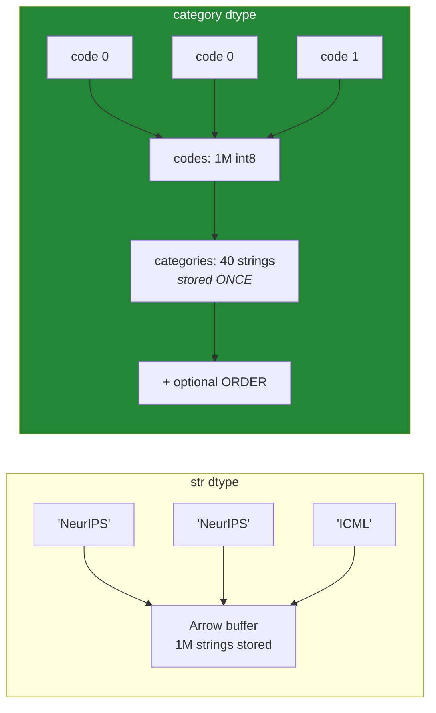

# Day 34 — Categorical dtype, and `describe()` as a data-quality report

**Phase 4 · Module 4** · IDs: **PD-13** (categorical data), **PD-14** (descriptive statistics and built-in plotting)

> **Yesterday:** the `.str` and `.dt` accessors, and the causal rolling window.
> **Today:** the dtype that turns 8 GB into 300 MB and encodes order into your data — and the habit
> of reading `describe()` as a **data-quality audit** rather than a formality.
> **Tomorrow:** where pandas stops. Phase 4 closes with ADR-002.

```bash
./m start 34 && ./m scaffold 34
```

**Time:** 110 minutes. **Request budget:** 0 model calls.

---

## §1 The story

Two ideas, and they meet in the middle.

**Categoricals.** A column of one million venue names holding only forty distinct values stores those
forty strings once, plus a million small integer codes pointing at them. Arrow-backed strings already
help (Day 26); categoricals go further, and they add something strings cannot express: **order**.

`"low" < "medium" < "high"` is nonsense to a string column (it sorts alphabetically: high, low,
medium) and obvious to an ordered categorical. That matters on Day 88's wine-quality case study,
where the target is ordinal, and on Day 81 where the encoding you choose depends on whether the
categories have an order.



**`describe()` as an audit.** Most people run it, glance at the mean, and move on. Read properly, it
is a defect report:

| What you see | What it means |
|---|---|
| `count` below the row count | missing values, and how many |
| `min` of `-1` on an age | a sentinel value nobody documented |
| `max` far from the 75th percentile | outliers, or a unit mix-up |
| `std` of `0` | a constant column — carries no information |
| `unique` equal to `count` | an identifier, not a feature |
| `freq` near `count` | a near-constant column |
| mean far from the median | skew (Day 61) |

Today you build `quality_report(frame)` — the function that reads all of that automatically and
returns a structured verdict. **Day 84's `audit(df)` extends it**, and Day 90's EDA report cites it.
The point is to stop discovering data problems in Phase 12 when a model behaves oddly, and start
discovering them on the read.

---

## §2 Setup — run this

```bash
mkdir -p days/day-34/lab
touch days/day-34/lab/categories.py
```

`src/setu/frames.py` and `tests/test_frames.py` grow today. No new packages.

---

## §3 PD-13 — the categorical dtype

`days/day-34/lab/categories.py`:

```python
"""PD-13 / PD-14: categoricals, and reading describe() as a defect report."""

from __future__ import annotations

import numpy as np
import pandas as pd


def memory_saving() -> None:
    rng = np.random.default_rng(0)
    venues = pd.Series(rng.choice(["NeurIPS", "ICML", "ACL", "NAACL"], size=1_000_000))

    as_str = venues.astype("str")
    as_cat = venues.astype("category")

    str_mb = as_str.memory_usage(deep=True) / 1024**2
    cat_mb = as_cat.memory_usage(deep=True) / 1024**2
    print(f"\nstr      : {str_mb:8.2f} MiB")
    print(f"category : {cat_mb:8.2f} MiB   ~{str_mb / cat_mb:.0f}x smaller")
    print(f"{as_cat.cat.categories.tolist()=}")
    print(f"{as_cat.cat.codes.dtype=}   <- int8: four categories fit in one byte")


def the_break_even() -> None:
    rng = np.random.default_rng(1)
    n = 200_000
    for distinct in (4, 1_000, 50_000, n):
        values = pd.Series(rng.integers(0, distinct, size=n).astype(str))
        s = values.astype("str").memory_usage(deep=True)
        c = values.astype("category").memory_usage(deep=True)
        verdict = "category wins" if c < s else "str wins"
        print(f"  {distinct:>7,} distinct of {n:,}: {s / c:5.2f}x  {verdict}")
    print("\n  Rule of thumb: category pays when distinct values are under ~50% of rows.")
    print("  A near-unique column as a category is LARGER, because you store both.")


def ordered_categories() -> None:
    plain = pd.Series(["high", "low", "medium", "low"], dtype="str")
    print(f"\n{plain.sort_values().tolist()=}   <- alphabetical. Wrong.")

    quality = pd.CategoricalDtype(["low", "medium", "high"], ordered=True)
    ordered = pd.Series(["high", "low", "medium", "low"], dtype=quality)
    print(f"{ordered.sort_values().tolist()=}   <- the order you declared")
    print(f"{(ordered > 'low').tolist()=}   <- comparison works")
    print(f"{ordered.min()=} {ordered.max()=}")

    unordered = pd.Series(["a", "b"], dtype="category")
    try:
        unordered > "a"
    except TypeError as exc:
        print(f"\n  unordered comparison: {exc}")
    print("  ^ ordered=True is opt-in. pandas refuses to invent an order.")


def the_unused_category_trap() -> None:
    dtype = pd.CategoricalDtype(["low", "medium", "high"], ordered=True)
    frame = pd.DataFrame({"q": pd.Series(["low", "high", "low"], dtype=dtype), "n": [1, 2, 3]})

    print(f"\n{frame.groupby('q', observed=False)['n'].sum().to_dict()=}")
    print("  ^ observed=False keeps 'medium' with a sum of 0 - the category EXISTS")
    print(f"{frame.groupby('q', observed=True)['n'].sum().to_dict()=}")
    print("  ^ observed=True drops it")
    print("\n  pandas 3.0 defaults observed=True. State it explicitly either way:")
    print("  a report of venues should show a zero row; a feature matrix should not.")


def adding_and_removing() -> None:
    s = pd.Series(["a", "b"], dtype="category")
    print(f"\n{s.cat.categories.tolist()=}")

    s2 = s.cat.add_categories(["c"])
    print(f"{s2.cat.categories.tolist()=}")

    frame = pd.DataFrame({"x": s})
    frame.loc[0, "x"] = "zzz"
    print(f"{frame['x'].tolist()=}   <- an UNKNOWN category becomes NaN, silently")
    print("  ^ the biggest categorical trap. Add the category first, or use str.")


def the_train_test_trap() -> None:
    train = pd.Series(["a", "b", "a"], dtype="category")
    test = pd.Series(["a", "c"], dtype="category")

    print(f"\n{train.cat.categories.tolist()=}")
    print(f"{test.cat.categories.tolist()=}   <- DIFFERENT categories, different codes!")
    print(f"{train.cat.codes.tolist()=} {test.cat.codes.tolist()=}")
    print("  'a' is code 0 in train and code 0 in test HERE, but that is luck.")

    shared = pd.CategoricalDtype(["a", "b", "c"])
    print(f"\n{train.astype(shared).cat.codes.tolist()=}")
    print(f"{test.astype(shared).cat.codes.tolist()=}   <- one dtype, consistent codes")
    print("\n  Rule: the category set is FIT ON TRAIN and applied to test (Principle 8).")
    print("  Day 81's encoder does this properly; today you see why it must.")
```

**Line by line:**

- `as_cat.cat.codes.dtype` is `int8` — four categories need one byte per row. With more than 127
  categories pandas moves to `int16`, and so on. The `.cat` accessor is the third one, after `.str`
  and `.dt`.
- `the_break_even` — **run it and read the four rows.** Categoricals pay when distinct values are a
  small fraction of rows. A near-unique column stored as a category is **larger** than a plain string
  column, because you store the codes *and* every distinct value. "Always use categories for text" is
  wrong advice.
- `pd.CategoricalDtype([...], ordered=True)` — the order is the list order, not alphabetical. Once
  declared, `sort_values`, `min`, `max` and comparison operators all work correctly.
- Unordered categoricals **refuse** comparison with a `TypeError`. pandas will not invent an order,
  which is right: `"NeurIPS" > "ICML"` has no meaning.
- `observed=False` versus `observed=True` in `groupby` — whether categories with no rows appear in the
  output. **pandas 3.0 defaults to `True`.** Both are correct in different contexts, which is why you
  state it: a coverage report wants the zero row, a feature matrix does not. Never rely on the default.
- `frame.loc[0, "x"] = "zzz"` — assigning a value that is **not** in the categories produces `NaN`,
  silently. This is the single biggest categorical trap: you set a value, no error appears, and the
  cell is now missing. `cat.add_categories` first, or leave the column as `str`.
- `the_train_test_trap` — **two independently-created categoricals have independent code mappings.**
  If you fit a model on train codes and predict on test codes, category `"a"` may be `0` in one and
  `2` in the other, and your model is reading a different feature. The fix is one shared
  `CategoricalDtype` derived from **train only**. This is Principle 8 in a place people do not expect
  it, and Day 81's encoder exists to handle it properly.

---

## §4 PD-14 — reading `describe()` as an audit

Add to the same file:

```python
def messy() -> pd.DataFrame:
    rng = np.random.default_rng(2)
    n = 500
    return pd.DataFrame(
        {
            "paper_id": [f"p{i:04d}" for i in range(n)],
            "citations": np.concatenate([rng.integers(0, 200, n - 3), [999_999, 999_999, 999_999]]),
            "age_days": np.where(rng.random(n) < 0.05, -1, rng.integers(1, 3000, n)),
            "score": np.where(rng.random(n) < 0.12, np.nan, rng.normal(0.7, 0.1, n)),
            "constant": np.full(n, 3.0),
            "venue": rng.choice(["NeurIPS", "ICML", "ACL"], size=n, p=[0.94, 0.03, 0.03]),
        }
    )


def describe_numeric() -> None:
    frame = messy()
    print(f"\n{frame.describe().round(2).to_string()}")
    print("\n  Read it as a defect report:")
    print("   - score  count < 500        -> missing values")
    print("   - age_days min = -1         -> an undocumented sentinel")
    print("   - citations max >> 75%      -> outliers or a unit mix-up")
    print("   - constant std = 0          -> no information; drop it")


def describe_non_numeric() -> None:
    frame = messy()
    print(f"\n{frame.describe(include=['object', 'str']).to_string()}")
    print("\n   - paper_id unique == count -> an identifier, not a feature")
    print("   - venue    freq near count  -> near-constant; 94% one value")
    print(f"\n{frame.describe(include='all').shape=}   <- include='all' mixes both")


def what_describe_misses() -> None:
    frame = messy()
    print("\n  describe() does NOT tell you:")
    print(f"   - duplicate rows: {frame.duplicated().sum()}")
    print(f"   - duplicate ids:  {frame['paper_id'].duplicated().sum()}")
    print(f"   - dtypes:         {frame.dtypes.value_counts().to_dict()}")
    print(f"   - memory:         {frame.memory_usage(deep=True).sum() / 1024:.1f} KiB")
    print(f"   - skew:           {frame['citations'].skew():.2f}   (Day 61)")
    print("  ^ quality_report() in §5 collects all of it in one call.")


def built_in_plotting() -> None:
    frame = messy()
    print("\n  frame['citations'].plot.hist(bins=30)   -> distribution and outliers")
    print("  frame['score'].plot.box()               -> quartiles and whiskers")
    print("  frame['venue'].value_counts().plot.bar() -> class balance")
    print("\n  These are Matplotlib underneath (Phase 5) and exist for a fast look")
    print("  while exploring. Anything that goes in a REPORT gets built properly on Day 37.")


if __name__ == "__main__":
    memory_saving()
    the_break_even()
    ordered_categories()
    the_unused_category_trap()
    adding_and_removing()
    the_train_test_trap()
    describe_numeric()
    describe_non_numeric()
    what_describe_misses()
    built_in_plotting()
```

**Line by line:**

- `messy()` builds a frame with **five planted defects**: missing values, a `-1` sentinel, extreme
  outliers, a constant column, and a near-constant categorical. Read the `describe()` output and find
  all five before reading the printed hints.
- `describe()` on numeric columns gives count, mean, std, min, the quartiles, and max. **`count` is
  the number of non-missing values**, so comparing it to `len(frame)` is your missing-value check.
- `describe(include=['object', 'str'])` gives `count`, `unique`, `top`, `freq` — an entirely different
  set. **`unique == count` means an identifier**, which should never be a model feature. `freq` close
  to `count` means near-constant, which carries almost no information.
- `frame.duplicated().sum()` — duplicate rows are invisible to `describe()` and are one of the most
  common ways a train/test split leaks (the same row in both halves). Day 79 covers it; counting it
  starts here.
- `.skew()` — mean far from median is skew, and Day 61 covers what to do about it. Collect the number
  now.
- `plot.hist` / `plot.box` / `plot.bar` — pandas' built-in plotting is Matplotlib with a shortcut. It
  is for **looking**, not for reporting. Phase 5 builds report-quality charts properly.

---

## §5 Build brief

Extend `src/setu/frames.py`:

```python
def to_categorical(
    frame: pd.DataFrame,
    columns: list[str],
    *,
    categories: dict[str, list[str]] | None = None,
    ordered: bool = False,
) -> pd.DataFrame:
    """TODO(me): convert columns to category dtype, returning a NEW frame.

    - `categories` fixes the category set per column (this is the TRAIN-fit set)
    - when `categories` is given, a value not in the list must raise DataError,
      naming the column and up to 3 offending values - it must NOT become NaN
    - raise DataError if a column is missing, or if converting would INCREASE memory
      (near-unique columns: report the ratio in the message)
    """
    raise NotImplementedError


def category_spec(frame: pd.DataFrame, columns: list[str]) -> dict[str, list[str]]:
    """TODO(me): extract the category set from THIS frame, for reuse on another.

    Fit on train, apply to test. Sorted for determinism. JSON-serialisable.
    """
    raise NotImplementedError


def quality_report(frame: pd.DataFrame, *, id_threshold: float = 0.95) -> dict:
    """TODO(me): the defect report described in §1. Return a JSON-serialisable dict:

    {
      "n_rows", "n_columns", "memory_mib", "duplicate_rows",
      "columns": {name: {
          "dtype", "n_missing", "pct_missing", "n_unique",
          "is_constant", "is_identifier",   # n_unique/n_rows > id_threshold
          "top", "top_freq_pct",            # non-numeric
          "min", "max", "mean", "median", "std", "skew",  # numeric only, else None
          "negative_count",                 # numeric only: sentinel hunting
      }},
      "warnings": [ ... human-readable strings ... ],
    }

    - reuse setu.stats.summary for the numeric part; do NOT reimplement it
    - `warnings` must fire for: any constant column, any identifier column,
      any column over 50% missing, any numeric column with negatives where the
      name suggests a count/age/duration, and any duplicate rows
    - must not mutate the frame (ADR-001)
    """
    raise NotImplementedError


def assert_quality(frame: pd.DataFrame, *, max_missing: float = 0.5, allow_duplicates: bool = False):
    """TODO(me): raise DataError if quality_report finds a blocking problem.

    Blocking = duplicate rows (unless allowed), or any column above max_missing.
    The message lists EVERY blocking problem, not the first.
    This is the gate Day 227's ingestion pipeline calls before writing anything.
    """
    raise NotImplementedError
```

- `to_categorical` **raising** on an unknown value rather than producing `NaN` is the day's design
  decision: it converts the silent trap from §3 into a loud one.
- The memory check is the `the_break_even` lesson made mechanical — the function refuses to make your
  frame bigger.
- `quality_report` reusing `setu.stats.summary` (Day 25) rather than reimplementing is the layering
  discipline from Day 17 paying off.

---

## §6 The eval that must be able to fail

Add to `tests/test_frames.py`:

```python
def test_to_categorical_converts_and_saves_memory():
    frame = pd.DataFrame({"v": ["a", "b", "a"] * 1000})
    out = to_categorical(frame, ["v"])
    assert str(out["v"].dtype) == "category"
    assert out.memory_usage(deep=True).sum() < frame.memory_usage(deep=True).sum()


def test_to_categorical_does_not_mutate():
    frame = pd.DataFrame({"v": ["a", "b"] * 100})
    before = frame.copy()
    to_categorical(frame, ["v"])
    pd.testing.assert_frame_equal(frame, before)


def test_to_categorical_refuses_a_near_unique_column():
    frame = pd.DataFrame({"id": [f"p{i}" for i in range(5000)]})
    with pytest.raises(DataError) as info:
        to_categorical(frame, ["id"])
    assert "id" in str(info.value)


def test_unknown_category_raises_instead_of_becoming_nan():
    frame = pd.DataFrame({"v": ["a", "b", "zzz"] * 50})
    with pytest.raises(DataError) as info:
        to_categorical(frame, ["v"], categories={"v": ["a", "b"]})
    assert "zzz" in str(info.value), "the offending value was not named"


def test_train_spec_applied_to_test_gives_the_same_codes():
    train = pd.DataFrame({"v": ["a", "b", "a"] * 100})
    test = pd.DataFrame({"v": ["b", "a"] * 100})
    spec = category_spec(train, ["v"])
    tr = to_categorical(train, ["v"], categories=spec)
    te = to_categorical(test, ["v"], categories=spec)
    assert list(tr["v"].cat.categories) == list(te["v"].cat.categories)
    assert tr["v"].cat.codes.iloc[0] == te["v"].cat.codes.iloc[1], "codes disagree across frames"


def test_ordered_categorical_sorts_by_declared_order():
    frame = pd.DataFrame({"q": ["high", "low", "medium"] * 50})
    out = to_categorical(frame, ["q"], categories={"q": ["low", "medium", "high"]}, ordered=True)
    assert out["q"].sort_values().iloc[0] == "low"
    assert (out["q"] > "low").sum() == 100


def test_category_spec_is_deterministic_and_serialisable():
    import json

    frame = pd.DataFrame({"v": ["b", "a", "b"] * 10})
    spec = category_spec(frame, ["v"])
    assert spec == category_spec(frame, ["v"])
    json.dumps(spec)


def test_quality_report_finds_missing_values():
    frame = pd.DataFrame({"x": [1.0, np.nan, 3.0, np.nan]})
    report = quality_report(frame)
    assert report["columns"]["x"]["n_missing"] == 2
    assert report["columns"]["x"]["pct_missing"] == pytest.approx(50.0)


def test_quality_report_flags_a_constant_column():
    report = quality_report(pd.DataFrame({"c": [3.0] * 100, "x": range(100)}))
    assert report["columns"]["c"]["is_constant"] is True
    assert any("c" in w for w in report["warnings"])


def test_quality_report_flags_an_identifier():
    report = quality_report(pd.DataFrame({"pid": [f"p{i}" for i in range(200)]}))
    assert report["columns"]["pid"]["is_identifier"] is True


def test_quality_report_counts_duplicate_rows():
    frame = pd.DataFrame({"a": [1, 1, 2], "b": ["x", "x", "y"]})
    assert quality_report(frame)["duplicate_rows"] == 1


def test_quality_report_finds_negative_sentinels():
    frame = pd.DataFrame({"age_days": [10, 20, -1, -1]})
    report = quality_report(frame)
    assert report["columns"]["age_days"]["negative_count"] == 2
    assert any("age_days" in w for w in report["warnings"])


def test_quality_report_is_json_serialisable():
    import json

    frame = pd.DataFrame({"a": [1.0, np.nan], "b": ["x", "y"]})
    json.dumps(quality_report(frame))


def test_quality_report_does_not_mutate():
    frame = pd.DataFrame({"a": [1.0, np.nan], "b": ["x", "y"]})
    before = frame.copy()
    quality_report(frame)
    pd.testing.assert_frame_equal(frame, before)


def test_quality_report_uses_the_shared_summary(monkeypatch):
    """Numeric statistics must come from setu.stats, not a reimplementation."""
    from setu import stats

    calls = []
    original = stats.summary
    monkeypatch.setattr(stats, "summary", lambda v: calls.append(1) or original(v))
    quality_report(pd.DataFrame({"a": [1.0, 2.0, 3.0]}))
    assert calls, "quality_report reimplemented the numeric summary"


def test_assert_quality_lists_every_problem():
    frame = pd.DataFrame({"a": [1, 1, np.nan], "b": [np.nan, np.nan, np.nan]})
    frame = pd.concat([frame, frame.iloc[[0]]], ignore_index=True)
    with pytest.raises(DataError) as info:
        assert_quality(frame)
    message = str(info.value)
    assert "b" in message and "duplicate" in message.lower()


def test_assert_quality_passes_a_clean_frame():
    assert_quality(pd.DataFrame({"a": [1, 2, 3], "b": ["x", "y", "z"]}))
```

**Line by line:**

- `test_unknown_category_raises_instead_of_becoming_nan` — **the day's real assessment.** A plain
  `astype(CategoricalDtype([...]))` silently converts `"zzz"` to `NaN` and passes every other test
  here. Raising, and naming the value, is the whole point of wrapping it.
- `test_train_spec_applied_to_test_gives_the_same_codes` — asserts the codes **agree across two
  frames**. Two independent `astype("category")` calls produce two independent mappings; a model
  trained on one and scored on the other is reading a different feature.
- `test_to_categorical_refuses_a_near_unique_column` — the break-even rule as a guard rail. A
  "convert all text columns to category" helper that makes the frame larger is worse than useless.
- `test_quality_report_uses_the_shared_summary` — monkeypatches `stats.summary` with a counting
  wrapper and asserts it was called. **This is an architecture test**, same family as Day 13's
  `load_many` check and Day 17's layering test: it asserts the code was *reused*, not merely that the
  numbers are right.
- `test_quality_report_finds_negative_sentinels` — a `-1` in a column named `age_days` is almost
  always a sentinel, not a value. Catching it here rather than on Day 96 when a model behaves oddly is
  the entire argument for the function.
- `test_assert_quality_lists_every_problem` — two blocking problems, both named in one message.
  Consistent with Day 19's Pydantic and Day 27's `check_schema`.

```bash
uv run python -m pytest tests/test_frames.py -v
```

---

## §7 Request budget

| Resource | Spent today |
|---|---|
| LLM calls | **0** |

---

## §8 Traps

- **"Always use category for text."** Near-unique columns get *larger*. Check the break-even.
- **Assigning a value outside the categories.** Becomes `NaN`, silently. Add the category first.
- **Independent categoricals on train and test.** Different code mappings. Fit the set on train.
- **Relying on the `observed=` default in `groupby`.** State it; the two answers differ.
- **Expecting unordered categories to compare.** They raise. `ordered=True` is opt-in.
- **Sorting a string column of `low`/`medium`/`high`.** Alphabetical, therefore wrong.
- **Reading only the mean from `describe()`.** The `count`, `min`, `std` and `freq` rows carry the defects.
- **Missing duplicate rows.** `describe()` cannot see them; they leak across a split.
- **Treating an identifier as a feature.** `unique == count` is the tell.
- **Shipping a chart from `.plot.hist()`.** Fine for looking, not for a report (Phase 5).

---

## §9 Verify before you code

Written **2026-08-21**:

- <https://pandas.pydata.org/docs/user_guide/categorical.html> — `CategoricalDtype`, `.cat`, and the
  unknown-value behaviour.
- <https://pandas.pydata.org/docs/reference/api/pandas.DataFrame.groupby.html> — confirm the current
  `observed` default in your pinned pandas.
- <https://pandas.pydata.org/docs/reference/api/pandas.DataFrame.describe.html> — the `include`/`exclude`
  arguments.
- <https://pandas.pydata.org/docs/reference/api/pandas.DataFrame.memory_usage.html> — why `deep=True`
  matters for text columns.

---

## §10 Say it in an interview

> "Categoricals are a memory win and an ordering feature, but the two traps are worth naming. Assigning
> a value that isn't in the category set produces NaN silently — so my converter raises and names the
> offending value instead. And two frames converted independently get independent code mappings, which
> means a model trained on one and scored on the other is literally reading a different feature; the
> category set is fit on train and applied to test, like any other transformer. On the audit side, I
> read `describe` as a defect report — count below the row count is missingness, a `min` of minus one
> is an undocumented sentinel, `unique` equal to `count` is an identifier masquerading as a feature —
> and I wrapped all of that in a `quality_report` that the ingestion pipeline calls as a gate before
> anything gets written."

---

## §11 Done when

Tick [`CHECKLIST.md`](CHECKLIST.md), then `./m check && ./m done 34`.
