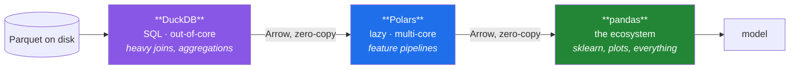

# Day 35 — Where pandas stops: Polars and DuckDB

**Phase 4 gate** · ID: **PD-15** · Artifact: **ADR-002**

> **Yesterday:** categoricals and the quality report.
> **Today:** the honest comparison. Two tools that do what pandas does, faster, with different
> trade-offs — measured on **your** machine, written up as a decision you could defend. **Phase 4
> closes.**
> **Tomorrow:** Phase 5, Matplotlib.

```bash
./m start 35 && ./m scaffold 35
```

**Time:** 2 hours (gate day). **Request budget:** 0 model calls.

---

## §1 The story

Ten days of pandas, and you have a real skill. Today is about knowing its edges — because "which tool"
is an interview question you will be asked, and the answer "pandas, because that's what I know" is
the wrong one whichever tool you name.

Three tools, three genuinely different bets:

| | **pandas 3.0** | **Polars** | **DuckDB** |
|---|---|---|---|
| The bet | one in-memory table, imperative | a **lazy query plan**, multi-threaded | **SQL** over files, out-of-core |
| Evaluation | eager: every line runs now | lazy: optimised, then run once | lazy: a full query planner |
| Parallelism | mostly single-core | all cores by default | all cores by default |
| Bigger than RAM | ✗ | partial (streaming) | ✓ |
| API | the one everyone knows | expressions, no index | SQL you already need for Phase 6 |
| Ecosystem | scikit-learn, plots, everything | growing, converts cheaply | reads pandas/Parquet directly |

The thing that makes this comparison *cheap* is pandas 3.0's Arrow-backed strings (Day 26). All three
speak Arrow, so moving data between them is often **zero-copy**. This is not "pick one and commit" —
it is "use each where it wins, at almost no conversion cost".



**Your job today is not to agree with that diagram.** It is to benchmark all three on your own machine
and write ADR-002 saying what *Setu* will use and why — with numbers. A decision record without
numbers is an opinion with a template around it (Day 25 said the same thing; it is still true).

One warning, because it is the honest half of the argument: **most datasets are small.** If your data
fits comfortably in RAM and your pipeline runs in four seconds, a rewrite to save three of them is
waste. The threshold at which the switch pays is itself a finding, and ADR-002 should state it.

---

## §2 Setup — run this

```bash
uv add "polars==1.43.2" "duckdb==1.5.5"
mkdir -p days/day-35/lab
touch days/day-35/lab/benchmark.py
touch docs/adr/ADR-002-dataframe-engine.md
```

Pin whatever **your** Day-1 verify run reported; log any drift (Principle 4).

---

## §3 PD-15 — the benchmark

`days/day-35/lab/benchmark.py`:

```python
"""PD-15: pandas vs Polars vs DuckDB, measured on THIS machine."""

from __future__ import annotations

import time
from pathlib import Path

import duckdb
import numpy as np
import pandas as pd
import polars as pl

ROWS = 5_000_000


def build_fixture(path: Path) -> Path:
    """A wide-ish table with a text key, a category, a date and two numerics."""
    if path.exists():
        return path
    rng = np.random.default_rng(0)
    frame = pd.DataFrame(
        {
            "paper_id": [f"p{i:08d}" for i in range(ROWS)],
            "venue": rng.choice(["NeurIPS", "ICML", "ACL", "NAACL", "EMNLP"], size=ROWS),
            "published": pd.to_datetime("2015-01-01") + pd.to_timedelta(
                rng.integers(0, 3650, ROWS), unit="D"
            ),
            "citations": rng.integers(0, 5000, ROWS),
            "score": rng.normal(0.7, 0.15, ROWS),
        }
    )
    path.parent.mkdir(parents=True, exist_ok=True)
    frame.to_parquet(path, index=False)
    print(f"  fixture: {path.stat().st_size / 1024**2:.0f} MiB, {ROWS:,} rows")
    return path


def timed(label: str, fn) -> tuple[str, float, object]:
    start = time.perf_counter()
    result = fn()
    elapsed = time.perf_counter() - start
    print(f"  {label:<32} {elapsed:7.3f}s")
    return label, elapsed, result


def bench_read(path: Path) -> None:
    print("\n-- read the whole file --")
    timed("pandas read_parquet", lambda: pd.read_parquet(path))
    timed("polars read_parquet", lambda: pl.read_parquet(path))
    timed("duckdb read_parquet", lambda: duckdb.sql(f"SELECT * FROM '{path}'").arrow())

    print("\n-- read TWO columns only --")
    timed("pandas columns=", lambda: pd.read_parquet(path, columns=["venue", "citations"]))
    timed("polars scan + select", lambda: pl.scan_parquet(path).select("venue", "citations").collect())
    timed("duckdb SELECT two", lambda: duckdb.sql(f"SELECT venue, citations FROM '{path}'").arrow())
    print("  ^ column pruning: all three skip the other columns ON DISK")


def bench_groupby(path: Path) -> None:
    print("\n-- filter, group, aggregate, sort --")
    frame = pd.read_parquet(path)

    def with_pandas():
        hot = frame[frame["citations"] > 100]
        out = hot.groupby("venue", observed=True).agg(
            n=("paper_id", "size"), mean_score=("score", "mean"), total=("citations", "sum")
        )
        return out.sort_values("total", ascending=False)

    def with_polars():
        return (
            pl.scan_parquet(path)
            .filter(pl.col("citations") > 100)
            .group_by("venue")
            .agg(
                pl.len().alias("n"),
                pl.col("score").mean().alias("mean_score"),
                pl.col("citations").sum().alias("total"),
            )
            .sort("total", descending=True)
            .collect()
        )

    def with_duckdb():
        return duckdb.sql(
            f"""
            SELECT venue, count(*) AS n, avg(score) AS mean_score, sum(citations) AS total
            FROM '{path}' WHERE citations > 100
            GROUP BY venue ORDER BY total DESC
            """
        ).df()

    _, t_pd, r_pd = timed("pandas", with_pandas)
    _, t_pl, r_pl = timed("polars (lazy)", with_polars)
    _, t_db, r_db = timed("duckdb", with_duckdb)

    print(f"\n  polars is {t_pd / t_pl:.1f}x pandas; duckdb is {t_pd / t_db:.1f}x pandas")
    assert len(r_pd) == len(r_pl) == len(r_db), "the three engines disagree on the ROW COUNT"
    print("  and all three returned the same number of groups.")


def bench_string_work(path: Path) -> None:
    print("\n-- string filter + extract --")
    frame = pd.read_parquet(path, columns=["paper_id", "venue"])

    timed(
        "pandas .str",
        lambda: frame[frame["venue"].str.startswith("N", na=False)]["paper_id"].str[1:5],
    )
    timed(
        "polars .str",
        lambda: pl.scan_parquet(path)
        .filter(pl.col("venue").str.starts_with("N"))
        .select(pl.col("paper_id").str.slice(1, 4))
        .collect(),
    )
    print("  ^ pandas 3.0's Arrow strings narrowed this gap a lot vs 2.x")


def laziness_is_the_trick(path: Path) -> None:
    plan = (
        pl.scan_parquet(path)
        .filter(pl.col("citations") > 4000)
        .select("venue", "score")
        .group_by("venue")
        .agg(pl.col("score").mean())
    )
    print("\n-- the optimised plan Polars will actually run --")
    print(plan.explain())
    print("\n  Note the projection and predicate PUSHED DOWN into the scan:")
    print("  it never reads paper_id, and it filters while reading.")
    print("  That is why lazy beats eager - not raw speed, but work avoided.")


def zero_copy_interop(path: Path) -> None:
    frame = pd.read_parquet(path, columns=["venue", "citations"]).head(1000)

    to_polars = pl.from_pandas(frame)
    back = to_polars.to_pandas()
    print(f"\n{type(to_polars).__name__=} -> {type(back).__name__=}")

    result = duckdb.sql("SELECT venue, sum(citations) AS t FROM frame GROUP BY venue").df()
    print(f"{result.shape=}   <- DuckDB queried the pandas frame BY NAME, no export step")
    print("  All three speak Arrow. Moving between them is cheap and often zero-copy.")


def out_of_core(path: Path) -> None:
    print("\n-- bigger than RAM --")
    out = duckdb.sql(
        f"SELECT venue, count(*) AS n FROM '{path}' GROUP BY venue ORDER BY n DESC"
    ).df()
    print(f"  duckdb aggregated {ROWS:,} rows without loading them: {out.shape=}")
    print("  pandas would need the whole frame resident. This is the real dividing line.")


if __name__ == "__main__":
    fixture = build_fixture(Path("data/processed/bench.parquet"))
    bench_read(fixture)
    bench_groupby(fixture)
    bench_string_work(fixture)
    laziness_is_the_trick(fixture)
    zero_copy_interop(fixture)
    out_of_core(fixture)
```

**Line by line:**

- `build_fixture` — five million rows written once to Parquet. It is cached (`if path.exists()`), and
  it lives in gitignored `data/processed/` because it is generated, not sourced (Day 0's rule).
- `pl.read_parquet` versus `pl.scan_parquet` — **eager versus lazy.** `read` loads now; `scan` returns
  a `LazyFrame` that has done nothing until `.collect()`. Everything interesting about Polars is in
  that difference.
- `duckdb.sql(f"SELECT * FROM '{path}'")` — DuckDB queries a Parquet file **by path**, with no import
  step. `.arrow()` returns an Arrow table; `.df()` returns a pandas DataFrame.
- `columns=` / `.select(...)` / `SELECT venue, citations` — all three prune columns **on disk**.
  Parquet is columnar, so the other three columns are never read. This is the Day 27 argument,
  measured.
- `observed=True` in the pandas `groupby` — stated explicitly, per Day 34.
- The `assert` comparing row counts — **the three engines must agree.** A benchmark where the
  implementations compute different things measures nothing. This assertion is what makes the numbers
  admissible in ADR-002.
- `plan.explain()` — **print this and read it.** You will see the projection (`select`) and the
  predicate (`filter`) pushed down into the scan node. Polars is not simply faster at the same work;
  it *does less work*, because it saw the whole query before starting. That is the argument for
  laziness in one output.
- `duckdb.sql("... FROM frame ...")` — DuckDB finds the local Python variable `frame` **by name** and
  queries it directly. No export, no conversion. This is the interop story that makes "use each where
  it wins" practical rather than theoretical.
- `out_of_core` — the real dividing line. pandas needs the frame resident; DuckDB streams. When your
  file exceeds RAM, this stops being a performance question and becomes a possible/impossible one.

**Record every number.** ADR-002 needs them.

---

## §4 The artifact — ADR-002

`docs/adr/ADR-002-dataframe-engine.md`. Second of thirteen (Principle 10).

Required content:

- **Context.** Setu's actual workloads: Day 227's ingestion (hundreds of thousands of documents),
  Phase 10's feature pipelines, Phase 12's model inputs, Day 234's API. State the realistic data
  sizes, not hypothetical ones.
- **Options.** pandas only · Polars only · DuckDB only · a **mixed** stack with Arrow at the seams.
- **Evidence.** Your measured table from §3 — read, column-pruned read, groupby, string work — with
  the machine and the row count stated. Plus the `explain()` output showing predicate pushdown.
- **Decision.** One sentence.
- **Consequences.** What you give up. Being honest here is the hard part: a mixed stack means two
  APIs in the codebase, two sets of docs to check on Friday, and a conversion boundary where bugs
  live.
- **The threshold.** *At what size does the switch pay?* Give a number from your benchmark, e.g.
  *"below ~2 M rows pandas is within a second of Polars and the extra API is not worth it."*
- **What would change our minds.** Specific and falsifiable.
- **Cold read.** Tomorrow, reviewer hat on, sign it.

> **A defensible answer for this plan** — which you should test against your own numbers rather than
> accept — is: **pandas stays the default** because Phases 5–17 are built on it and it owns the
> ecosystem; **DuckDB** is used where the work is a join or an aggregation over files (Day 227's
> ingestion, Phase 6's SQL practice); **Polars** is used where a feature pipeline is measurably slow.
> If your benchmark disagrees, follow your benchmark and say so — that is what the ADR is for.

---

## §5 Build brief — no new module today

Phase 4's code is done: `src/setu/frames.py` has grown across ten days and is complete. **Today's
deliverable is the ADR and the phase-gate verification.** Two small additions only:

```python
# in src/setu/frames.py

def engine_note() -> str:
    """TODO(me): one-line reminder of ADR-002's decision, for import into notebooks.

    Return the decision sentence from your ADR. This exists so future-you can call
    setu.frames.engine_note() and remember the rule without re-reading the document.
    """
    raise NotImplementedError


def to_arrow(frame: pd.DataFrame):
    """TODO(me): hand a pandas frame to another engine without a copy where possible.

    - return a pyarrow.Table
    - raise DataError if any column is `object` dtype (that CANNOT be zero-copy, and
      after Day 26 there should be no object columns in this project anyway)
    """
    raise NotImplementedError
```

`to_arrow` refusing `object` columns is the Day 26 rule enforced at the boundary: if a column slipped
back to `object`, the conversion is not free and you want to know.

---

## §6 The eval that must be able to fail

Add to `tests/test_frames.py`:

```python
def test_engine_note_is_a_real_sentence():
    note = engine_note()
    assert isinstance(note, str) and len(note.split()) >= 6
    assert "ADR-002" in note or "adr-002" in note.lower()


def test_to_arrow_round_trips():
    import pyarrow as pa

    frame = pd.DataFrame({"a": [1, 2], "b": pd.Series(["x", "y"], dtype="str")})
    table = to_arrow(frame)
    assert isinstance(table, pa.Table)
    pd.testing.assert_frame_equal(table.to_pandas(), frame, check_dtype=False)


def test_to_arrow_refuses_object_columns():
    frame = pd.DataFrame({"a": pd.Series(["x", "y"], dtype="object")})
    with pytest.raises(DataError) as info:
        to_arrow(frame)
    assert "a" in str(info.value)


def test_adr_002_exists_and_has_numbers():
    """A decision record without evidence is an opinion."""
    import re
    from pathlib import Path

    path = Path("docs/adr/ADR-002-dataframe-engine.md")
    assert path.exists(), "ADR-002 was not written"
    text = path.read_text(encoding="utf-8")
    for heading in ("Context", "Decision", "Consequences"):
        assert heading in text, f"ADR-002 is missing its {heading} section"
    numbers = re.findall(r"\d+\.\d+\s*s|\d+(?:,\d{3})+\s*rows|\d+\.\d+x", text)
    assert len(numbers) >= 3, "ADR-002 cites no measured numbers - that is an opinion"
    assert "change our minds" in text.lower(), "no falsification condition stated"


def test_all_three_engines_are_pinned():
    import tomllib
    from pathlib import Path

    deps = tomllib.loads(Path("pyproject.toml").read_text(encoding="utf-8"))
    listed = " ".join(deps["project"]["dependencies"])
    for package in ("pandas", "polars", "duckdb"):
        assert f"{package}==" in listed, f"{package} is not exact-pinned"


def test_phase_4_frames_module_is_complete():
    """Every function Phase 4 promised exists and is callable."""
    from setu import frames

    expected = [
        "text_columns", "set_where", "normalise_text_columns",   # Day 26
        "read_table", "write_table", "check_schema",             # Day 27
        "select", "align_frames",                                # Day 28
        "rank_column", "add_derived",                            # Day 29
        "missingness_report", "add_missing_indicators",          # Day 30
        "group_summary", "top_n_per_group",                      # Day 31
        "safe_merge", "to_long", "to_wide",                      # Day 32
        "extract_pattern", "parse_dates_strictly", "causal_rolling",  # Day 33
        "to_categorical", "quality_report", "assert_quality",    # Day 34
        "engine_note", "to_arrow",                               # Day 35
    ]
    missing = [name for name in expected if not hasattr(frames, name)]
    assert not missing, f"Phase 4 is incomplete: {missing}"
```

**Line by line:**

- `test_adr_002_exists_and_has_numbers` — **the gate test.** It reads the document, requires the three
  core headings, requires at least three things that look like measurements (`1.23s`, `5,000,000
  rows`, `3.4x`), and requires a falsification condition. It cannot check that the reasoning is
  *good* — but it can refuse an ADR with no evidence in it, which is the failure mode that actually
  happens.
- `test_phase_4_frames_module_is_complete` — the phase checklist as a test. Twenty-five functions
  across ten days; the failure message names exactly what is missing. This is what a gate is.
- `test_to_arrow_refuses_object_columns` — the Day 26 rule enforced at the engine boundary.
- `check_dtype=False` in the round-trip — Arrow and pandas can disagree on nullable-integer spellings
  after a round trip; the values are what matter here.

```bash
uv run python -m pytest tests/test_frames.py -v
uv run python -m pytest -q
```

---

## §7 Request budget

| Resource | Spent today |
|---|---|
| LLM calls | **0** |
| Disk | ~200 MiB fixture in gitignored `data/processed/` |

---

## §8 Traps

- **Benchmarking implementations that compute different things.** Assert the results agree first.
- **Benchmarking once.** Run each three times; report the median. A cold cache lies.
- **Including fixture generation in the timing.** Build it once, outside the measurement.
- **Comparing eager Polars to lazy Polars.** `scan_parquet` and `read_parquet` are different bets.
- **Concluding "Polars is 8× faster" from one groupby.** Say which operation, at what size.
- **Rewriting a four-second pipeline to save three seconds.** State the threshold; respect it.
- **Forgetting Polars has no index.** A `set_index`-heavy pandas workflow does not port line for line.
- **Assuming Arrow interop is always zero-copy.** `object` columns never are. That is why `to_arrow` refuses them.
- **Adding a third engine without an ADR.** Two APIs is a decision; three by accident is a mess.
- **Writing the ADR from this lesson's suggested answer.** Use your numbers, or it is not yours.

---

## §9 Verify before you code

Written **2026-08-21**. All three move quickly:

- <https://docs.pola.rs/user-guide/lazy/optimizations/> — what the optimiser actually does.
- <https://docs.pola.rs/user-guide/migration/pandas/> — the pandas→Polars mental-model differences.
- <https://duckdb.org/docs/guides/python/import_pandas> — querying pandas objects by name.
- <https://duckdb.org/docs/data/parquet/overview> — pushdown and out-of-core behaviour.
- <https://pandas.pydata.org/docs/whatsnew/> — the Friday freshness check (Principle 13).

---

## §10 Say it in an interview

> "pandas is the default because it owns the ecosystem — scikit-learn, plotting, everything downstream
> takes a DataFrame. But I benchmarked it against Polars and DuckDB on five million rows and wrote the
> result up as a decision record rather than a preference. The interesting finding isn't the speed
> ratio, it's *why*: Polars' `explain` shows the projection and predicate pushed down into the scan,
> so it isn't doing the same work faster, it's doing less work — and DuckDB will aggregate a file
> larger than RAM, which turns a performance question into a possible-or-not one. Since pandas 3.0 all
> three are Arrow-backed, so moving between them is cheap. The part of the ADR I'd point at is the
> threshold: below a couple of million rows the difference doesn't justify a second API in the
> codebase, and saying that explicitly is what stops the decision becoming fashion."

---

## §11 Done when — **Phase 4 gate**

Tick [`CHECKLIST.md`](CHECKLIST.md), then:

```bash
./m check
./m done 35
./m status
```

**Gate criteria:** ADR-002 written with **your** measured numbers and cold-read · all three engines
exact-pinned · `test_phase_4_frames_module_is_complete` green · a clean, typed, joined dataset
produced through `read_table` → `safe_merge` → `assert_quality` → `write_table` · **no chained
assignment anywhere in `src/`** (Day 26's guard still green after ten days of edits).

Tomorrow: Phase 5, and the charts that make Day 90's report worth reading.
