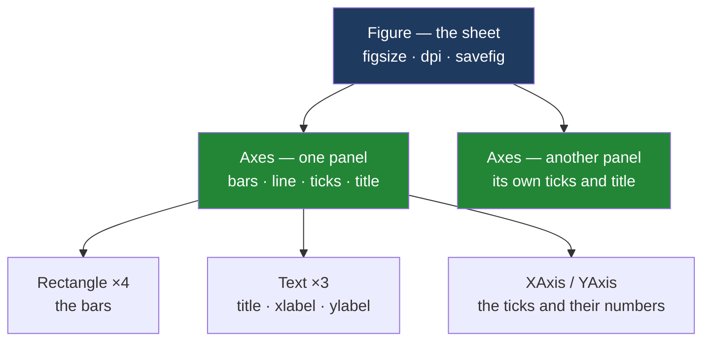

# 1.1 — The paper and the frame drawn on it

## One-line answer

A **figure** is the whole sheet the picture is printed on, and an **axes** is one framed panel drawn
somewhere on that sheet — two different objects, and almost everything you will ever want to change
belongs to the second one.

---

## The story

Four people share a flat and they have been keeping the shopping receipts for a month. Somebody
finally types the numbers up. Four aisles, four weeks:

```text
aisle        week 1   week 2   week 3   week 4    total
dairy          4.60     5.75     4.60     6.90    21.85
bakery         2.80     1.40     2.80     2.80     9.80
produce        6.30     7.10     5.40     8.20    27.00
household      3.50     0.00     9.20     1.10    13.80
every week    17.20    14.25    22.00    19.00    72.45
```

Twenty numbers. Somebody says: *put that on the fridge so we can all see it.*

So they get out a sheet of paper. Then they draw a box on the sheet, and inside the box they draw
four bars — one for each aisle, tallest for produce. Then they draw a second box underneath, and
inside that one they draw a line going up and down for the four weekly totals.

At the end there is one sheet of paper on the fridge, with two boxes drawn on it, and something drawn
inside each box.

Now notice what happened when the pen was actually moving. Nobody labelled *the sheet of paper*. The
words "pounds spent" went next to a box. The tick marks went along the edge of a box. The little
heading "what each aisle cost" went above a box. The sheet did exactly two jobs: it decided how big
the picture was, and it held the boxes.

That is the whole idea, and everything else today is the details.

---

## The idea in plain language

Matplotlib is a library for drawing charts in Python. It gives you two objects that match the two
things in the story exactly.

The **figure** is the sheet of paper. It is the whole output — the thing that becomes one PNG file,
or one image in a report. It has a size, it has a background colour, and it holds panels. It has no
tick marks, no x axis and no bars, because a sheet of paper does not have those. Panels do.

The **axes** is one framed panel drawn on that sheet. The word is unfortunate and
[1.2](1.2-axes-is-not-axis.md) is about nothing but that; for now read "an axes" as "one chart
region". An axes is where the drawing happens. It owns the bars, the lines, the tick marks, the
numbers along the edges, the little heading at the top, and the box that frames all of it.

A figure can hold one axes, four axes or none at all. An axes always belongs to exactly one figure.

The reason this matters on the very first page is that beginners are usually taught a third thing
instead — a set of functions like `plt.plot`, `plt.title`, `plt.xlabel` that never mention either
object. Those functions still work, they are what most tutorials use, and they are the reason
charts stop being predictable the moment a program draws more than one of them. Matplotlib's own
documentation names the two ways of working: an **explicit "Axes" interface** that "uses methods on
a Figure or Axes object", and an **implicit "pyplot" interface** that "keeps track of the last Figure
and Axes created, and adds Artists to the object it thinks the user wants"
(*Matplotlib Application Interfaces (APIs)*, matplotlib 3.11.1,
<https://matplotlib.org/stable/users/explain/figure/api_interfaces.html>).

"The object it thinks the user wants" is a fair warning, and
[section 2](../02-the-state-machine/2.1-the-figure-you-never-named.md) is four documents on what
happens when it thinks wrong. This day teaches the explicit one, which is why the plan's named
example for `VIZ-01` is a rule rather than a technique: **never `plt.plot` again — always
`fig, ax = plt.subplots()`.**

One more term, because it appears in the quotation above. An **artist** is matplotlib's word for
anything that can be drawn: a bar, a line, a piece of text, a tick mark. Artists live on an axes,
axes live on a figure. [1.3](1.3-everything-is-an-artist.md) is that idea in full.

---

## Why Setu needs it

- **[1.2](1.2-axes-is-not-axis.md)** untangles the word "axes", which you cannot do until you know
  there is an object with that name.
- **[3.1](../03-the-object-api/3.1-fig-ax-subplots.md)** is the one line that produces both objects
  at once, and it reads as nonsense until you know it is handing back two different things.
- **[4.1](../04-many-axes/4.1-a-grid-of-axes.md)** puts four panels on one sheet, which is the same
  sentence as "one figure holding four axes".
- **[5.2](../05-getting-it-out/5.2-savefig-dpi-and-bbox-inches.md)** saves a file, and the method for
  that belongs to the figure, not to the axes — a distinction that is arbitrary until you know which
  one is the paper.
- **Day 41** closes this phase with an eight-chart figure pack. That is literally one figure and
  eight axes, so the gate is stated in the vocabulary of this part.
- **Day 37** onwards adds labels, scales, colour and seaborn, and every one of those days is
  configuring an *axes*.

---

## The mechanism

Start with the sheet and nothing on it.

```python
import matplotlib

matplotlib.use("Agg")
import matplotlib.pyplot as plt

fig = plt.figure(figsize=(6, 4))
print("a bare figure holds:", fig.axes)
print("its size in inches :", fig.get_size_inches())
ax = fig.add_subplot()
print("after add_subplot  :", fig.axes)
```

**Line by line:**

- `import matplotlib` first, on its own, because the next line has to run **before** the drawing
  module is imported. `matplotlib` is the package; `matplotlib.pyplot` is one module inside it.
- `matplotlib.use("Agg")` picks the **backend** — the piece of code that turns a figure into actual
  pixels. `"Agg"` is the one that writes image files and never opens a window, which is what a script
  wants. Every snippet in this day starts with these two lines, and
  [5.1](../05-getting-it-out/5.1-backends-and-the-script-with-no-window.md) explains what goes wrong
  without them. If you leave it out today, nothing breaks — it only decides whether a window tries to
  appear.
- `import matplotlib.pyplot as plt` — `plt` is the near-universal short name for this module. It is
  imported after `use` because the backend is chosen when pyplot loads.
- `plt.figure(figsize=(6, 4))` makes **one figure and nothing else**. `figsize` is in **inches**,
  width first — not pixels. Six inches by four is matplotlib's rough default shape.
- `fig.axes` is the list of panels on the sheet. It is a **list**, which is the first hint that a
  figure holds many.
- `fig.get_size_inches()` reads the size back, so you can see that `figsize` was stored rather than
  used and forgotten.
- `fig.add_subplot()` draws one panel on the sheet and hands it back. `plt.subplots()` in
  [3.1](../03-the-object-api/3.1-fig-ax-subplots.md) does the figure and this in a single line, which
  is why you will almost never write `add_subplot` yourself — but it is worth seeing the two steps
  separately once, because that is what `subplots` is doing.

```text
a bare figure holds: []
its size in inches : [6. 4.]
after add_subplot  : [<Axes: >]
```

**An empty list, then a list of one.** The figure existed perfectly happily with no panel on it,
which is exactly what a blank sheet of paper is.

Now draw the flat's aisle totals inside that panel, and ask both objects what they know.

```python
AISLES = ["dairy", "bakery", "produce", "household"]
SPEND = [21.85, 9.80, 27.00, 13.80]

ax.bar(AISLES, SPEND)
ax.set_title("What each aisle cost")
ax.set_ylabel("pounds spent")

print("ax.figure is fig :", ax.figure is fig)
print("the panel's title:", repr(ax.get_title()))
print("the sheet's title:", hasattr(fig, "get_title"))
```

**Line by line:**

- `AISLES` and `SPEND` are the four aisle names and the four four-week totals from the story, in the
  same order. They stay in that order for the rest of the day.
- `ax.bar(...)` is a method **on the axes**, not on the figure and not on `plt`. That is the whole
  point of the part: the drawing verbs belong to the panel.
- `ax.set_title` puts the little heading above **this panel**. On a sheet with four panels there
  would be four of these, which is why it cannot belong to the figure.
- `ax.set_ylabel` writes down the left-hand edge of **this panel**.
- `ax.figure is fig` asks whether the panel knows which sheet it is on. `is` compares identity, not
  equality — the same object, not a copy of it.
- `hasattr(fig, "get_title")` asks whether the *figure* has a title. It does not, and the printed
  `False` is the cleanest available proof that these are genuinely different kinds of object. (A
  figure can carry a `suptitle` across the top of all its panels, which is a different thing and
  belongs to [4.4](../04-many-axes/4.4-constrained-layout.md).)

```text
ax.figure is fig : True
the panel's title: 'What each aisle cost'
the sheet's title: False
```

The shape of it:



**Read it top to bottom and it is the story.** The sheet holds the panels; the panels hold the
drawings. Nothing points sideways, and nothing points back up except the `ax.figure` shortcut you
just printed.

---

## When it breaks

**Asking the sheet to do the panel's job:**

```text
$ uv run python -c "
import matplotlib
matplotlib.use('Agg')
import matplotlib.pyplot as plt
fig = plt.figure()
fig.bar(['dairy', 'bakery'], [21.85, 9.80])
"
Traceback (most recent call last):
  File "<string>", line 6, in <module>
AttributeError: 'Figure' object has no attribute 'bar'
```

**What it means.** `bar` is a drawing verb, so it lives on the panel. A figure has no idea what a bar
is. The smallest fix is to get an axes first — `ax = fig.add_subplot()`, or the one-liner in
[3.1](../03-the-object-api/3.1-fig-ax-subplots.md) — and call `ax.bar(...)`.

**The mirror image, asking the panel to save the file:**

```text
$ uv run python -c "
import matplotlib
matplotlib.use('Agg')
import matplotlib.pyplot as plt
fig = plt.figure()
ax = fig.add_subplot()
ax.savefig('shopping.png')
"
Traceback (most recent call last):
  File "<string>", line 7, in <module>
AttributeError: 'Axes' object has no attribute 'savefig'
```

**What it means.** Saving writes the *whole picture*, so it is the sheet's job. There is no sensible
answer to "save one panel to a file" — the panel does not know how big the paper is or what else is
on it. The fix is `ax.figure.savefig(...)` or, better, keep the `fig` name you were given and call
`fig.savefig(...)`. [5.2](../05-getting-it-out/5.2-savefig-dpi-and-bbox-inches.md) is that method in
full.

**The one that does not raise.** `plt.title("What each aisle cost")` works, prints nothing, and puts
the title somewhere. Which panel it lands on is a question this part cannot answer, because `plt`
functions do not take a panel. That silence is the subject of
[2.1](../02-the-state-machine/2.1-the-figure-you-never-named.md), and it is worth noticing now that
the two `AttributeError`s above are the **friendly** failures. The dangerous one says nothing at all.

---

## In production

**What a professional writes instead of the teaching version.** Nobody calls `plt.figure()` and
`fig.add_subplot()` as two statements. They write one line —
`fig, ax = plt.subplots(figsize=(6, 4), layout="constrained")` — and then never touch `plt` again
in that function. The two-step version above exists to show that there really are two objects; the
one-line version in [3.1](../03-the-object-api/3.1-fig-ax-subplots.md) is the one that ships.

The habit that follows from it: **a function that draws takes an `ax` and returns it**, and only
makes a figure when it was not given one
([3.5](../03-the-object-api/3.5-the-ax-parameter.md)). Once every drawing function in a codebase has
that shape, any chart can be dropped into any panel of any sheet without being rewritten. That is the
single most valuable habit on this day, and it is only expressible because the two objects are
separate.

**What degrades at scale.** A figure is not free. Each one carries a renderer, a canvas and every
artist on it, and a report generator that builds a few hundred of them will hold all of that in
memory at once unless each is closed —
[5.4](../05-getting-it-out/5.4-the-figures-you-never-closed.md) measures it at 6 MB against 57 MB for
two hundred figures. The panels are cheap; the sheets are not. That asymmetry is invisible until you
know which object is which.

**The failure that only appears with real data.** A weekly report drew each region's chart with
`plt.plot` inside a loop, then called `plt.savefig` once per region. It was correct for one region
and quietly wrong for twelve: every chart after the first was drawn on top of the previous one,
because there was never a new sheet. It shipped for months, because the *first* region in the
alphabet always looked right and nobody scrolled. The whole class of bug disappears the moment the
figure is a name in your program instead of an assumption inside the library.

**The review comment a senior engineer leaves.** *"This module mixes `plt.something` and
`ax.something`. Pick the explicit one: get `fig, ax` at the top, use `ax` methods for everything
drawn, and `fig` methods for the size and the save. As written I cannot tell which figure line 40
lands on without running it."*

**The interview question.** *"What is the difference between a figure and an axes in matplotlib?"*
The figure is the whole canvas — its size in inches, its resolution, and the file it saves to. An
axes is one plotting region on that canvas, and it owns the data, the ticks, the limits, the labels
and the title. A figure holds a list of axes; an axes belongs to exactly one figure. The follow-up
that actually separates people is *"so why does `plt.title` work?"* — because the `pyplot` module
keeps a hidden pointer to a current figure and a current axes and forwards the call to whichever they
happen to be, which is fine in a notebook cell and unpredictable in a program that draws twice.

---

## Check yourself

```bash
uv run --with 'matplotlib==3.11.1' python -c "
import matplotlib
matplotlib.use('Agg')
import matplotlib.pyplot as plt
fig = plt.figure(figsize=(6, 4))
print('panels on a new sheet :', fig.axes)
ax = fig.add_subplot()
ax.bar(['dairy', 'bakery', 'produce', 'household'], [21.85, 9.80, 27.00, 13.80])
ax.set_title('What each aisle cost')
print('panels now            :', len(fig.axes))
print('the panel knows fig   :', ax.figure is fig)
print('figure has a title?   :', hasattr(fig, 'get_title'))
print('axes has savefig?     :', hasattr(ax, 'savefig'))
"
```

Five lines of output. Two of them are `False`, and those two are the ones that carry the lesson — say
what each of them is denying.

**Answer out loud, without scrolling up:**

> Which object owns the bars, and which object owns the file that gets written? Then name one thing a
> figure has that an axes could not sensibly have, and one thing an axes has that a figure could not
> sensibly have.

---

**Next:** [1.2 — Axes, axis, and the word everybody trips on](1.2-axes-is-not-axis.md).
