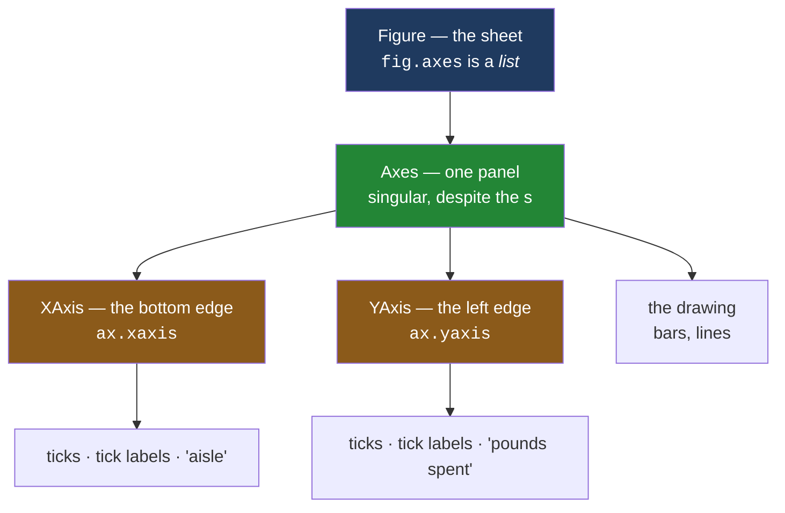

# 1.2 — Axes, axis, and the word everybody trips on

## One-line answer

In matplotlib **an axes is one whole chart panel** and it is singular despite the `s`, while **an
axis is one edge of that panel** — so a single axes owns two axis objects, and the two words are not
plural and singular forms of the same thing.

---

## The story

The flat's shopping numbers are going on the fridge. One person draws the box for the bar chart and
starts calling it "the chart". The other person, reading a tutorial out loud, keeps saying "the
axes".

"Which axes? There's only one chart."

"That *is* the axes."

"Then what are these?" — pointing at the bottom edge, where the aisle names go, and the left edge,
where the pounds go.

"Those are the axes too."

Both people are correct, and the conversation goes nowhere for about ten minutes. Then somebody
writes `ax.set_xaxis("aisle")`, gets an error, changes it to `ax.set_axis("aisle")`, gets a different
error, and gives up for the evening.

This is not a story about being slow. It is the single most common stumble in matplotlib, it happens
to experienced programmers, and it happens because the library reused an English plural as the name
of a singular thing.

---

## The idea in plain language

Here is the untangling, and it is worth reading twice.

**An axes** — spelled with an `s`, pronounced like the plural of "axis" — is **one chart panel**. The
whole framed region: the drawing area, its border, its tick marks, its numbers, its labels and its
title. It is what [1.1](1.1-the-paper-and-the-frame.md) called the box drawn on the sheet. Despite
the `s`, it is one thing. You say "an axes", "this axes", "the axes has a title".

**An axis** — no `s` — is **one edge** of that panel. The bottom edge, which carries the aisle names,
is the x axis. The left edge, which carries the pounds, is the y axis. An axis owns the tick marks
along it, the numbers printed by those tick marks, the label written alongside them, and the scale
that maps a data value to a position.

So the counting goes: one figure holds several axes; **one axes holds exactly two axis objects** (or
three, in a three-dimensional plot). "Axes" is not the plural of "axis" here, even though in ordinary
English it is. That is the whole difficulty, and there is nothing clever hiding behind it.

Why did it end up like this? Because the panel is the region *bounded by its axes* — the thing you
get when you draw an x axis and a y axis and look at the space between them. The name is a
description of how the region is defined, and it stuck. Matplotlib's own documentation has taken to
writing "Axes (or Subplots)" in headings for exactly this reason
(*Introduction to Axes (or Subplots)*, matplotlib 3.11.1,
<https://matplotlib.org/stable/users/explain/axes/axes_intro.html>). If it helps, read every "axes"
in this curriculum as "subplot" and the confusion mostly evaporates.

Three practical consequences, which are the reason this is a part and not a footnote:

**The variable is called `ax`.** Every matplotlib example on earth names one panel `ax` and a
collection of them `axs`. That is a convention, not a rule, but it is universal enough that breaking
it will confuse a reviewer. `axs` — no `e` — is the usual spelling for the collection, precisely
because `axes` would be ambiguous.

**`fig.axes` really is a plural.** A figure's `.axes` attribute is a list of panels, so there the `s`
means what English means. The same five letters are a singular object in one place and a plural list
in another.

**`ax.axis` is a method, not an edge.** Confusingly, `ax.axis(...)` is a function you call to set
limits or turn the frame off, while `ax.xaxis` and `ax.yaxis` are the actual edge objects. So `axis`
appears as a method name *and* as half of two attribute names, meaning different things.

---

## Why Setu needs it

- **[1.3](1.3-everything-is-an-artist.md)** lists what an axes contains, and two of the items in that
  list are the axis objects. The list is unreadable if the words are still tangled.
- **[3.3](../03-the-object-api/3.3-the-setter-names.md)** is about setter names, and half of the
  confusion there — `set_xlabel` but `set_title` — is downstream of this one: the x label belongs to
  an *axis*, the title belongs to the *axes*.
- **[4.3](../04-many-axes/4.3-shared-axes.md)** shares an axis between panels. That sentence has to
  parse before the mechanism can.
- **Day 37** is labels, ticks and scales — every one of which is a property of an axis, configured
  through its axes.
- **Day 41**'s eight-chart pack is eight axes on one figure, and its greyscale check is read panel by
  panel.

---

## The mechanism

Ask one panel what it is made of.

```python
import matplotlib

matplotlib.use("Agg")
import matplotlib.pyplot as plt

fig, ax = plt.subplots()
print("type(ax)       :", type(ax).__name__)
print("type(ax.xaxis) :", type(ax.xaxis).__name__)
print("type(ax.yaxis) :", type(ax.yaxis).__name__)
print("fig.axes       :", type(fig.axes).__name__, "of", [type(a).__name__ for a in fig.axes])
print("ax.axis is callable:", callable(ax.axis))
```

**Line by line:**

- `fig, ax = plt.subplots()` makes a sheet with one panel on it and hands back both.
  [3.1](../03-the-object-api/3.1-fig-ax-subplots.md) takes this line apart; here it is just the
  shortest way to get an axes to interrogate.
- `type(ax).__name__` prints the class name rather than the full `<class '...'>` repr, so the three
  lines line up and the difference is visible at a glance.
- `ax.xaxis` and `ax.yaxis` are **attributes**, not methods — no brackets. They are the two edges,
  and they are separate objects with their own classes.
- `fig.axes` is asked for its own type as well as its contents, because that is the place where the
  `s` genuinely means "more than one".
- `callable(ax.axis)` asks whether `ax.axis` is something you can call. It is, and that is the third
  meaning of these letters in five lines.

```text
type(ax)       : Axes
type(ax.xaxis) : XAxis
type(ax.yaxis) : YAxis
fig.axes       : list of ['Axes']
ax.axis is callable: True
```

**Four names in one output: `Axes`, `XAxis`, `YAxis`, and a `list` called `axes`.** Nothing is
plural except the list.

Now the practical half: which object does a label actually belong to?

```python
fig, ax = plt.subplots()
print("the x edge's label, empty  :", repr(ax.xaxis.get_label().get_text()))
ax.set_xlabel("aisle")
print("after ax.set_xlabel('aisle'):", repr(ax.xaxis.get_label().get_text()))
print("so set_xlabel wrote onto    :", type(ax.xaxis).__name__)
```

**Line by line:**

- `ax.xaxis.get_label()` reaches through the panel, into its bottom edge, and asks that edge for the
  text sitting beside it. The empty string is the honest starting state: an unlabelled chart.
- `ax.set_xlabel("aisle")` is called on the **axes**, not on the axis — this is the convenience the
  library gives you, and it is why beginners never notice the axis objects exist.
- Printing the edge's label again shows where the text actually landed. `set_xlabel` is a method on
  the panel that writes onto the edge.
- The last line names the object that ended up holding the text. **The method you call and the object
  that stores the result are not the same object**, and that is the sentence to remember.

```text
the x edge's label, empty  : ''
after ax.set_xlabel('aisle'): 'aisle'
so set_xlabel wrote onto    : XAxis
```

The containment, drawn:



**Count the boxes.** One blue, one green, two orange. That is the ratio the words hide: many axes per
figure, exactly two axis objects per axes.

---

## When it breaks

**The guess that reads perfectly and does not exist:**

```text
$ uv run python -c "
import matplotlib
matplotlib.use('Agg')
import matplotlib.pyplot as plt
fig, ax = plt.subplots()
ax.set_xaxis('aisle')
"
Traceback (most recent call last):
  File "<string>", line 6, in <module>
AttributeError: 'Axes' object has no attribute 'set_xaxis'. Did you mean: 'get_xaxis'?
```

**What it means.** There is no setter for a whole axis, because you never replace an edge — you
configure it. What you wanted was `ax.set_xlabel("aisle")`. Python's suggestion (`get_xaxis`) is
unhelpful here and worth noticing: **the "did you mean" hint matches on spelling, not on intent**, so
it will happily point you further away from the answer.

**The one that runs and is not what you meant:**

```text
$ uv run python -c "
import matplotlib
matplotlib.use('Agg')
import matplotlib.pyplot as plt
fig, ax = plt.subplots()
ax.bar(['dairy', 'bakery'], [21.85, 9.80])
ax.axis('off')
print('drew two bars, then called ax.axis(\"off\")')
print('frame visible?', ax.get_frame_on())
print('x tick labels :', [t.get_text() for t in ax.get_xticklabels()])
"
drew two bars, then called ax.axis("off")
frame visible? True
x tick labels : ['dairy', 'bakery']
```

**What it means.** `ax.axis("off")` is the method spelling, and it hides the frame and both edges when
the figure is drawn — but the objects are all still there, so `get_frame_on()` still says `True` and
the tick labels still report their text. Somebody who typed `ax.axis` expecting *the x axis object*
has instead silently switched the whole panel's decorations off, and the only way they find out is by
looking at the saved image. **A method and an attribute with nearly the same name, one of which
changes the drawing and one of which is the drawing** — this is the pair to slow down for.

**The mistake in the other direction:**

```text
$ uv run python -c "
import matplotlib
matplotlib.use('Agg')
import matplotlib.pyplot as plt
fig, axs = plt.subplots()
for ax in axs:
    ax.set_title('one panel')
"
Traceback (most recent call last):
  File "<string>", line 6, in <module>
TypeError: 'Axes' object is not iterable
```

**What it means.** The `s` in the variable name `axs` was a guess that there would be several, but
`plt.subplots()` with no arguments returns exactly one panel and one panel is not a list.
[4.1](../04-many-axes/4.1-a-grid-of-axes.md) is the part where asking for a grid changes what comes
back. The naming convention — `ax` for one, `axs` for many — exists precisely so that this mistake is
visible in the source rather than only at run time.

---

## In production

**What a professional writes instead of the teaching version.** They never write `ax.xaxis` at all for
ordinary work. The panel's convenience methods cover everything a normal chart needs —
`ax.set_xlabel`, `ax.set_xticks`, `ax.set_xlim`, `ax.tick_params(axis="x", ...)` — and reaching into
`ax.xaxis` is a signal that something unusual is happening: a custom locator, a custom formatter, a
date scale. A reviewer reads `ax.xaxis.set_major_formatter(...)` as "pay attention here", and that
signal is worth preserving by not using the attribute casually.

**What degrades at scale.** Type annotations. In a codebase with a hundred plotting functions, the
signature is `def spend_by_aisle(spend: Mapping[str, float], ax: Axes | None = None) -> Axes:`, and
the import that makes it work is `from matplotlib.axes import Axes` — singular module path,
plural-looking class name. Getting that import wrong is the most common reason a plotting module
fails its type check, and the fix is knowing that `Axes` is the class of **one** panel
([Day 19, 1.2](../../../day-19-typing-dataclasses-and-concurrency/parts/01-type-hints/1.2-the-vocabulary.md)
introduced this vocabulary).

**The failure that only appears with real data.** A dashboard laid out twelve panels and turned off
the decorations on the eleven it did not want cluttered, using `ax.axis("off")` in a loop. When a
thirteenth series arrived, the loop bound ran one panel too far and switched the frame off on the one
chart people actually read. Nothing raised. The chart still had its bars, so it looked *designed*
rather than broken, and it took a week for somebody to notice the y axis had gone. A method whose
argument is the string `"off"` gives you no protection at all.

**The review comment a senior engineer leaves.** *"`axs` here is a single `Axes`, not a collection —
rename it `ax`. And `ax.axis('off')` on line 22 turns off both edges and the frame; if you only meant
to hide the x tick labels, that is `ax.tick_params(labelbottom=False)`, which says so."*

**The interview question.** *"What is the difference between `Axes` and `Axis` in matplotlib?"* An
`Axes` is one plotting region — one subplot — and it owns the data, the title and the frame. An
`Axis` is one edge of that region: the ticks, their labels, the scale and the axis label. One `Axes`
contains exactly two `Axis` objects in a two-dimensional plot. The give-away that somebody has
actually used the library is that they mention the naming pain unprompted, and that they know
`fig.axes` is a list of `Axes` while `ax.xaxis` is a single `Axis` — the same letters meaning
different things two lines apart.

---

## Check yourself

```bash
uv run --with 'matplotlib==3.11.1' python -c "
import matplotlib
matplotlib.use('Agg')
import matplotlib.pyplot as plt
fig, axs = plt.subplots(1, 2)
print('how many panels        :', len(fig.axes))
print('what axs is            :', type(axs).__name__)
print('one panel is           :', type(axs[0]).__name__)
print('its edges              :', type(axs[0].xaxis).__name__, type(axs[0].yaxis).__name__)
print('edges on the whole fig :', sum(len([a.xaxis, a.yaxis]) for a in fig.axes))
"
```

Five numbers and names. Say which of the printed words is a plural in the English sense and which is
a plural only in spelling.

**Answer out loud, without scrolling up:**

> How many axes does one figure have? How many axis objects does one axes have? Then say what
> `ax.set_xlabel("aisle")` actually writes onto, and why the method is not called `set_xaxis_label`.

---

**Next:** [1.3 — Everything you can see is an artist](1.3-everything-is-an-artist.md).
