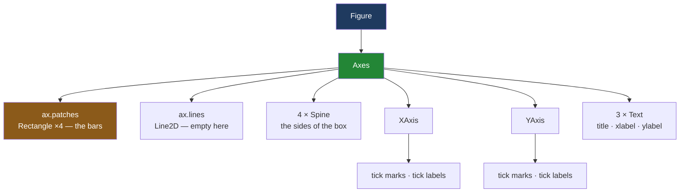

# 1.3 — Everything you can see is an artist

## One-line answer

Every mark on a matplotlib chart — each bar, each line, each word, each tick — is a **separate object
held in a list on the axes**, which is why you can change one of them after it was drawn, and why a
chart can be tested without ever looking at the picture.

---

## The story

The bar chart of the flat's spending is on the fridge, drawn in pen. Produce came to twenty-seven
pounds and has the tallest bar; bakery came to nine pounds eighty and has the shortest.

Then somebody points out that the household bar is wrong: the nine pounds twenty in week three was a
new mop, which is not really shopping. The correct household total is four pounds sixty.

On paper this is a disaster. The bar is ink. To fix one bar you redraw the whole sheet.

Now imagine the same chart made out of magnets on the fridge door instead. Four bar magnets, four
name labels, a strip of numbers up the left edge, a title along the top. To fix household you take
that one magnet off and put a shorter one back. Everything else stays exactly where it was, because
everything else is a separate piece.

Matplotlib is the magnets, not the ink. That is not a metaphor for how it feels; it is literally how
it is built. Until the moment the picture is written to a file, a chart is a pile of individual
objects sitting in lists, and you can pick any one of them up.

---

## The idea in plain language

An **artist** is matplotlib's name for anything that can be drawn. Every single visible thing is one.

That includes the obvious ones. A bar is an artist — specifically a `Rectangle`. A plotted line is an
artist, a `Line2D`. A piece of text is an artist, a `Text`, and the title, the x label and the y label
are three separate `Text` objects.

It also includes the things you would never think to name. The four sides of the box around the panel
are artists called **spines** — one each for left, right, top and bottom. The panel's own background
is an artist, a `Rectangle` covering the whole drawing area. The two edges from
[1.2](1.2-axes-is-not-axis.md), `XAxis` and `YAxis`, are artists too, and each of them holds more
artists for its tick marks and their numbers.

The axes keeps these in lists you can read:

- `ax.patches` — filled shapes, which is where bars live.
- `ax.lines` — plotted lines.
- `ax.texts` — free-standing text you added yourself.
- `ax.collections` — bulk shapes, which is where a scatter plot's points live.
- `ax.containers` — the bookkeeping object `ax.bar` hands back, holding its rectangles as a group.
- `ax.get_children()` — everything at once, spines and axis objects included.

Two consequences follow, and they are the reason this part exists.

**You can change a chart after drawing it.** Calling `ax.bar(...)` does not paint pixels. It creates
four `Rectangle` objects, puts them in `ax.patches`, and returns. Nothing is rendered until the figure
is saved or shown. So a function can draw the bars and a *later* function can reach into `ax.patches`
and recolour one of them — which is exactly how a "highlight the aisle we overspent on" feature gets
written.

**You can test a chart without looking at it.** If the bars are objects with a `get_height()` method,
a test can assert on the heights. It never has to compare images, which is slow, fragile and
maddening when a font renders one pixel differently on another machine.
[6.2](../06-the-module/6.2-testing-a-chart-without-looking.md) is that idea turned into a test file,
and it is the payoff of this whole section.

One term borrowed from [1.1](1.1-the-paper-and-the-frame.md): **rendering** is the step that turns
these objects into actual pixels or actual PDF drawing commands. It happens once, at the end, in the
backend ([5.1](../05-getting-it-out/5.1-backends-and-the-script-with-no-window.md)). Everything before
that is bookkeeping.

---

## Why Setu needs it

- **[3.2](../03-the-object-api/3.2-drawing-on-an-axes.md)** draws the bars and the line, and what
  those calls *return* only makes sense once you know they are creating objects rather than painting.
- **[4.2](../04-many-axes/4.2-the-axes-you-forgot-to-use.md)** finds an empty panel by asking whether
  its artist lists are empty. That check is written directly out of this part.
- **[6.2](../06-the-module/6.2-testing-a-chart-without-looking.md)** asserts on bar heights, line data
  and tick label text. Without artists there is no way to test a chart at all except by eye.
- **Day 40** is colour and accessibility, and the greyscale check is applied artist by artist — you
  cannot recolour what you cannot address.
- **Day 41**'s gate asks for eight charts that stay legible in greyscale, which means a check that
  reads each artist's colour rather than a human squinting at a printout.

---

## The mechanism

Draw the flat's four aisles and then ask the panel what is on it.

```python
import matplotlib

matplotlib.use("Agg")
import matplotlib.pyplot as plt

AISLES = ["dairy", "bakery", "produce", "household"]
SPEND = [21.85, 9.80, 27.00, 13.80]

fig, ax = plt.subplots()
ax.bar(AISLES, SPEND)
ax.set(title="What each aisle cost", xlabel="aisle", ylabel="pounds spent")

for child in ax.get_children():
    print("   ", type(child).__name__)
```

**Line by line:**

- `AISLES` and `SPEND` are the same four names and four totals the day has been using since
  [1.1](1.1-the-paper-and-the-frame.md).
- `ax.bar(AISLES, SPEND)` creates four rectangles. It does not draw them on a screen; there is no
  screen. It builds objects.
- `ax.set(...)` sets three pieces of text in one call. [3.4](../03-the-object-api/3.4-ax-set-the-one-call-form.md)
  is that method in full; here it is a compact way to create three `Text` artists.
- `ax.get_children()` returns **every artist the panel owns**, in no particularly meaningful order.
  Printing just the class names keeps the output readable — the full reprs would be a wall.

```text
    Rectangle
    Rectangle
    Rectangle
    Rectangle
    Spine
    Spine
    Spine
    Spine
    XAxis
    YAxis
    Text
    Text
    Text
    Rectangle
```

**Fourteen objects for a chart with four bars.** Count them off: four `Rectangle`s are the bars; four
`Spine`s are the sides of the box; `XAxis` and `YAxis` are the two edges from
[1.2](1.2-axes-is-not-axis.md); three `Text`s are the title, the x label and the y label; and the last
`Rectangle` is the panel's own background. Nothing in that list is a picture. Every item is a Python
object with methods.

Now pick one up and read it.

```python
fig, ax = plt.subplots()
bars = ax.bar(AISLES, SPEND)

print("ax.bar returned  :", type(bars).__name__)
print("how many bars    :", len(bars))
print("their heights    :", [bar.get_height() for bar in bars])
print("in ax.patches    :", len(ax.patches))
print("in ax.lines      :", len(ax.lines))
print("household's bar  :", bars[3].get_height(), "at x =", round(bars[3].get_x(), 2))
```

**Line by line:**

- `bars = ax.bar(...)` keeps what the call handed back. Most tutorials throw this away, which is why
  most people never learn that the bars are reachable.
- `type(bars).__name__` — it is a `BarContainer`, not a plain list. A container groups the rectangles
  that belong to one `bar` call, so a chart with two sets of bars keeps them apart.
- `len(bars)` works because a container behaves like a sequence. Four names in, four rectangles out.
- `bar.get_height()` reads the number the bar was drawn from. **This is the assertion
  [6.2](../06-the-module/6.2-testing-a-chart-without-looking.md) is built on**: the picture can be
  wrong in a hundred ways, but if the heights are the data, the bars are the data.
- `ax.patches` is the panel's list of filled shapes, and it holds the same four rectangles the
  container does. The container is a convenience view, not a second copy.
- `ax.lines` is empty because a bar chart has no lines. Asking a panel for the wrong kind of artist
  gives an empty list rather than an error, and that is a trap worth knowing —
  see *When it breaks* below.
- `bars[3]` is household, the fourth name in `AISLES`. `get_x()` is its left edge in data
  coordinates, which for a categorical bar chart means "which slot it sits in".

```text
ax.bar returned  : BarContainer
how many bars    : 4
their heights    : [np.float64(21.85), np.float64(9.8), np.float64(27.0), np.float64(13.8)]
in ax.patches    : 4
in ax.lines      : 0
household's bar  : 13.8 at x = 2.6
```

**Those four heights are `SPEND`.** The chart is not a picture of the data; at this point it *is* the
data, arranged into objects. They come back as `np.float64` rather than plain `float` because
matplotlib stores them in NumPy arrays
([Day 20, 1.2](../../../day-20-arrays-and-dtypes/parts/01-the-block/1.2-shape-dtype-and-the-rest.md)),
and an `np.float64` compares equal to the `float` it came from — which is why a test can assert
`heights == SPEND` without converting anything.

And the fix from the story — change one bar without redrawing anything:

```python
household = bars[3]
print("before:", household.get_height())
household.set_height(4.60)
print("after :", household.get_height())
print("dairy is untouched:", bars[0].get_height())
```

**Line by line:**

- `bars[3]` is the magnet you are taking off the fridge. It is a live object, not a record of what was
  drawn.
- `set_height(4.60)` changes it. Every artist property has a `get_`/`set_` pair, which is a rule
  matplotlib keeps almost everywhere and which [3.3](../03-the-object-api/3.3-the-setter-names.md)
  leans on.
- Reading `bars[0]` afterwards proves the other three did not move. **This is the difference between
  magnets and ink**, and it is the reason the object interface is worth learning.

```text
before: 13.8
after : 4.6
dairy is untouched: 21.85
```

Where each artist sits:



**Only the orange box holds your data.** Everything else in that diagram is furniture matplotlib
built for you, and every piece of it is addressable.

---

## When it breaks

**Asking for the wrong kind of artist, and getting silence:**

```text
$ uv run python -c "
import matplotlib
matplotlib.use('Agg')
import matplotlib.pyplot as plt
fig, ax = plt.subplots()
ax.bar(['dairy', 'bakery', 'produce', 'household'], [21.85, 9.80, 27.00, 13.80])
print('lines on this chart:', len(ax.lines))
print('first line         :', ax.lines[0])
"
lines on this chart: 0
Traceback (most recent call last):
  File "<string>", line 8, in <module>
IndexError: list index out of range
```

**What it means.** `ax.lines` on a bar chart is an empty list, not an error. The first print says `0`
and moves on; only indexing into it fails. **A test that asserts `len(ax.lines) == 1` on a chart that
was accidentally drawn with `ax.bar` gets a clean, informative failure. A test that does
`ax.lines[0].get_ydata()` gets an `IndexError` with no hint about why.** Assert the count before you
index into the list — that single habit is what makes chart tests readable when they break.

**The container that is not the list you thought:**

```text
$ uv run python -c "
import matplotlib
matplotlib.use('Agg')
import matplotlib.pyplot as plt
fig, ax = plt.subplots()
ax.bar(['dairy', 'bakery'], [21.85, 9.80])
ax.bar(['produce', 'household'], [27.00, 13.80])
print('containers:', len(ax.containers))
print('patches   :', len(ax.patches))
print('first container holds:', len(ax.containers[0]))
"
containers: 2
patches   : 4
first container holds: 2
```

**What it means.** Two `bar` calls make **two containers and four patches**. A test written as
`len(ax.containers[0]) == 4` passes on a chart drawn in one call and fails on the identical-looking
chart drawn in two — and a test written as `len(ax.patches) == 4` passes on both. Neither is wrong;
they answer different questions. **Decide which question your test is asking before you pick the
list**, because the two only agree by accident.

**The artist that is not where you looked:**

```text
$ uv run python -c "
import matplotlib
matplotlib.use('Agg')
import matplotlib.pyplot as plt
fig, ax = plt.subplots()
ax.set_title('What each aisle cost')
print('ax.texts       :', len(ax.texts))
print('ax.get_title() :', repr(ax.get_title()))
"
ax.texts       : 0
ax.get_title() : 'What each aisle cost'
```

**What it means.** `ax.texts` holds text **you** added with `ax.text(...)` or `ax.annotate(...)`. The
title, the x label and the y label are not in it — they are separate named attributes, because
matplotlib treats them as furniture rather than as content. So a test that counts `ax.texts` to check
a chart is labelled will report zero on a fully labelled chart. Use `ax.get_title()`,
`ax.get_xlabel()` and `ax.get_ylabel()` for those, which is what
[6.2](../06-the-module/6.2-testing-a-chart-without-looking.md) does.

---

## In production

**What a professional writes instead of the teaching version.** They keep the return value. Every
drawing call hands something back — `ax.bar` a `BarContainer`, `ax.plot` a list of `Line2D`,
`ax.scatter` a `PathCollection` — and holding onto it is how the next step addresses what was just
drawn. The idiom for a single line is the one-element unpack:

```python
(line,) = ax.plot([1, 2, 3, 4], [17.20, 14.25, 22.00, 19.00])
line.set_linewidth(2.5)
```

**Line by line:**

- `ax.plot` returns a **list**, even for one line, because a single call can draw several. The
  trailing comma in `(line,)` unpacks that one-element list and, crucially, **raises if there is more
  than one** — so the assumption is checked rather than assumed.
- `line.set_linewidth(2.5)` then works on the object. Writing `ax.plot(..., linewidth=2.5)` would have
  been equivalent here; the point is that after the fact is also available, which is what lets a
  styling layer sit downstream of a drawing layer.

**What degrades at scale.** Every artist is a Python object, and a scatter plot of a million points
drawn as a million artists would be unusable. This is why `ax.scatter` returns a single
`PathCollection` rather than a million patches: a **collection** is one artist that draws many shapes,
with the positions held in an array. The rule of thumb is that anything ending in `Collection` is the
bulk version of something, and reaching for it is what keeps a chart with a lot of data drawable.
Matplotlib's own guidance on this is *Optimizing Artists for performance*, matplotlib 3.11.1,
<https://matplotlib.org/stable/users/explain/artists/performance.html>.

**The failure that only appears with real data.** A reporting tool highlighted the worst-performing
bar by doing `ax.patches[-1].set_color("red")` — the last patch. It worked for a year. Then somebody
added a shaded background band to the same panel, which is also a patch, and the highlight silently
moved onto the band. Every chart still rendered, no test failed, and the "worst" bar stopped being
marked. **Positional access into an artist list is a bug waiting for a second feature.** The fix is to
keep the container the drawing call returned and index into that.

**The review comment a senior engineer leaves.** *"`ax.patches[2]` — this breaks the moment anything
else adds a patch to this axes. Keep the `BarContainer` that `ax.bar` returns and index that, or
better, look the bar up by its label. And assert the length before you index, so the failure says
'expected 4 bars, found 5' instead of `IndexError`."*

**The interview question.** *"How would you test a matplotlib chart?"* Not by comparing images —
fonts and anti-aliasing differ between machines, so pixel comparison is flaky and the failure message
tells you nothing. Instead assert on the artists: how many bars are on the axes, what their heights
are, what the tick labels say, what the title is, where the y limit starts. Those are all readable
from the objects because a chart is a tree of objects until it is rendered. The follow-up is usually
*"when would you compare images anyway?"* — for a rendering regression in a library that draws the
marks itself, where the pixels are the product, and then you use a tolerance-based comparison and pin
the font.

---

## Check yourself

```bash
uv run --with 'matplotlib==3.11.1' python -c "
import matplotlib
matplotlib.use('Agg')
import matplotlib.pyplot as plt
fig, ax = plt.subplots()
bars = ax.bar(['dairy', 'bakery', 'produce', 'household'], [21.85, 9.80, 27.00, 13.80])
(line,) = ax.plot([0, 1, 2, 3], [17.20, 14.25, 22.00, 19.00])
ax.set_title('What each aisle cost')
print('children  :', len(ax.get_children()))
print('patches   :', len(ax.patches))
print('lines     :', len(ax.lines))
print('texts     :', len(ax.texts))
print('title     :', repr(ax.get_title()))
print('heights   :', [b.get_height() for b in bars])
print('line ydata:', list(line.get_ydata()))
"
```

Seven lines. One of them prints `0` even though there is obviously text on the chart — say which, and
say where that text actually lives.

**Answer out loud, without scrolling up:**

> What does `ax.bar(...)` actually create, and when do those things become pixels? Then name two
> assertions you could write about this chart that never open the image file.

---

**Next:** [2.1 — `plt.plot` and the figure you never named](../02-the-state-machine/2.1-the-figure-you-never-named.md).
