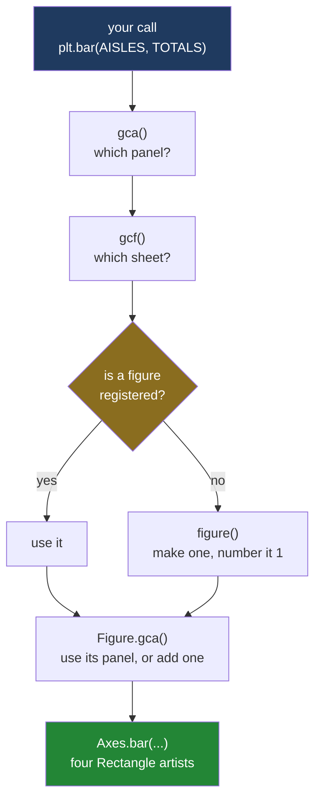

# 2.1 — The figure you never named

## One-line answer

`plt.bar(...)` does not mention a figure or a panel, but it makes both of them anyway, stores them in
a variable that lives inside the `matplotlib.pyplot` module, and every later `plt.` call in your
program is sent to whatever that variable is pointing at.

---

## The story

The flat's first sheet went up on the fridge weeks ago: the four aisles, the four bars, produce
tallest. Everybody has walked past it a hundred times.

Then somebody types up a new month of receipts and prints a second sheet. They do not take the first
one down — there is a magnet in the way and it is not worth the trouble — so the new sheet goes up
next to it, and then, because the door is narrow, half on top of it.

That evening a third person is standing at the fridge with a marker pen, and somebody calls from the
next room: *"Write 'pounds spent' up the side of the sheet, would you."*

There is no bad faith anywhere in that sentence. It is a perfectly normal thing to say. But there are
two sheets on the door now, and the person with the pen has to pick one. They pick the one their hand
is already resting on, write the words, and go back to what they were doing.

Nobody notices for a week. Then somebody points at the old sheet and asks why the numbers up the side
have no units, and the person with the pen says, honestly, "I labelled it."

They did. They labelled *a* sheet. The instruction never said which one, so the pen went where the
hand happened to be. That is the entire subject of this section, and the rest of it is just the same
sentence written in Python.

---

## The idea in plain language

Everything in [section 1](../01-the-two-objects/1.1-the-paper-and-the-frame.md) was about two
objects: a **figure**, which is the whole sheet, and an **axes**, which is one framed panel drawn on
that sheet. Every drawing verb — `bar`, `plot`, `scatter` — is a method on the panel, because the
panel is where marks go.

So how does `plt.bar(AISLES, TOTALS)` work? It names no panel. It names no sheet. It is not a method
on anything you created.

The answer is that `matplotlib.pyplot` keeps two extra pieces of information for you, quietly, and
uses them to fill in the blank:

- the **current figure** — the sheet that `plt.` functions will draw on, and
- the **current axes** — the panel on that sheet that `plt.` functions will draw *in*.

When you call `plt.bar(...)`, pyplot looks up the current axes and calls `bar` on it. If there is no
current axes, it makes one. If there is no current figure to put that axes on, it makes one of those
too. Then it draws, and returns exactly what the panel's own `bar` method would have returned. You
end up holding the bars but not the panel and not the sheet.

Two words for the shape of this. A **wrapper** is a function whose whole job is to work out some
arguments and then call a different function. A **state machine**, in the loose sense the matplotlib
community uses it, is an interface where the effect of a call depends not only on its arguments but
on something the library is remembering from earlier calls. `plt.bar` is a wrapper around
`Axes.bar`, and the thing it remembers is which axes to use. Matplotlib's own documentation calls
this the implicit "pyplot" interface, one that "keeps track of the last Figure and Axes created, and
adds Artists to the object it thinks the user wants"
(*Matplotlib Application Interfaces (APIs)*, matplotlib 3.11.1,
<https://matplotlib.org/stable/users/explain/figure/api_interfaces.html>).

Where does that memory physically live? In the `matplotlib.pyplot` module itself. A module in Python
is a file that has already run, and it runs **once** per program — Day 17's
[1.3](../../../day-17-modules-and-packages/parts/01-the-module/1.3-sys-modules.md) is that idea in
full. Every file in your program that writes `import matplotlib.pyplot as plt` gets the same module
object, so they all share the same current figure. There is one of these per process, and it belongs
to nobody.

None of this is hidden maliciously. It is a convenience, and in a single notebook cell where you draw
one chart and look at it, it is a very good convenience. It stops being one the moment a second sheet
goes on the fridge.

---

## Why Setu needs it

- **[2.2](2.2-gca-and-the-axes-you-did-not-choose.md)** names the four functions that read and move
  that pointer — `plt.gcf`, `plt.gca`, `plt.figure` and `plt.sca` — and shows a title landing on the
  wrong figure. You cannot follow it until you accept that a pointer exists at all.
- **[2.3](2.3-where-plt-plot-stops-working.md)** is four real programs that break because of it: a
  pair of functions, a loop, a test suite and a re-run notebook cell.
- **[3.1](../03-the-object-api/3.1-fig-ax-subplots.md)** is the one line that ends the problem, by
  handing you both objects as named variables.
- **[5.4](../05-getting-it-out/5.4-the-figures-you-never-closed.md)** measures what unnamed figures
  cost in memory. A figure you never named is a figure you never closed, because there was nothing to
  pass to `plt.close`.
- **Day 37** teaches labels and tick formatting, and most of the examples you will find on the
  internet for those are written in `plt.` style. You will be translating them all month, and the
  translation is mechanical only once you know what `plt.` is standing in for
  ([Day 37, 1.1](../../../day-37-labels-and-chart-choice/parts/01-labels/1.1-the-chart-that-never-said-what-the-numbers-were.md)).
- **Day 41**'s gate is one figure holding eight panels. Eight panels means eight chances for a `plt.`
  call to land on panel seven when you meant panel three.

---

## The mechanism

Start with an empty Python process and count the figures before and after a single drawing call.

```python
import matplotlib

matplotlib.use("Agg")
import matplotlib.pyplot as plt

AISLES = ["dairy", "bakery", "produce", "household"]
TOTALS = [21.85, 9.80, 27.00, 13.80]

print("figures open before:", plt.get_fignums())
bars = plt.bar(AISLES, TOTALS)
print("figures open after :", plt.get_fignums())
print("what bar returned  :", type(bars).__name__)

fig = plt.gcf()
print("type(plt.gcf())    :", type(fig).__name__)
print("its number         :", fig.number)
print("panels on it       :", fig.axes)
print("gca is that panel  :", plt.gca() is fig.axes[0])
```

**Line by line:**

- `import matplotlib` on its own line, before pyplot, because the next statement has to run before
  the drawing module loads. Every snippet in this day opens this way and
  [5.1](../05-getting-it-out/5.1-backends-and-the-script-with-no-window.md) explains why in full.
- `matplotlib.use("Agg")` picks the **backend** — the code that turns a figure into pixels. `"Agg"`
  writes image files and never tries to open a window, which is what a script wants.
- `AISLES` and `TOTALS` are the flat's four aisle names and their four-week totals, in the order they
  were typed up. They stay in that order for the whole day.
- `plt.get_fignums()` is the list of figure numbers pyplot currently knows about. Printing it
  **before** anything is drawn is the point of the line: it establishes that the process starts with
  nothing.
- `plt.bar(AISLES, TOTALS)` is the call under examination. It names no figure and no axes.
- `type(bars).__name__` asks what came back. `BarContainer` is the same object `ax.bar` returns
  ([1.3](../01-the-two-objects/1.3-everything-is-an-artist.md)), which is the first clue that
  `plt.bar` is not doing anything clever — it is forwarding.
- `plt.gcf()` is **get current figure**. It is how you recover the sheet you never asked for.
- `fig.number` exists only on figures that pyplot is tracking. A figure built any other way has no
  such attribute, which is worth remembering when you meet it in
  [2.2](2.2-gca-and-the-axes-you-did-not-choose.md).
- `fig.axes` is the figure's list of panels, so printing it says whether a panel was invented as well
  as a sheet.
- `plt.gca()` is **get current axes**. Comparing it with `fig.axes[0]` using `is` — identity, not
  equality — asks whether the "current panel" really is the panel that appeared on the new sheet.

```text
figures open before: []
figures open after : [1]
what bar returned  : BarContainer
type(plt.gcf())    : Figure
its number         : 1
panels on it       : [<Axes: >]
gca is that panel  : True
```

**Read the first two lines together.** The list went from empty to `[1]`. One call to `plt.bar`
created a figure, numbered it `1`, added a panel to it, made that panel current, and drew four bars
in it. You asked for one of those five things.

Now stop guessing and read the source. `plt.bar` is a normal Python function in an installed package,
so you can print it.

```python
import inspect

import matplotlib

matplotlib.use("Agg")
import matplotlib.pyplot as plt

print(inspect.getsource(plt.gca))
print(inspect.getsource(plt.gcf))
```

**Line by line:**

- `inspect` is a standard-library module for asking Python about its own objects. `getsource` returns
  the text of a function as it was written in the file it came from.
- `plt.gca` is printed first because it is the shorter of the two and it is the one `plt.bar` calls.
- `plt.gcf` is printed second because `gca` calls it, so reading them in this order is reading the
  chain in the direction it actually runs.
- Nothing is drawn in this snippet at all. It is the only block in this part that produces no figure,
  which is itself useful: `getsource` reads text, it does not run the function.

```text
@_copy_docstring_and_deprecators(Figure.gca)
def gca() -> Axes:
    return gcf().gca()

def gcf() -> Figure:
    """
    Get the current figure.

    If there is currently no figure on the pyplot figure stack, a new one is
    created using `~.pyplot.figure()`.  (To test whether there is currently a
    figure on the pyplot figure stack, check whether `~.pyplot.get_fignums()`
    is empty.)
    """
    manager = _pylab_helpers.Gcf.get_active()
    if manager is not None:
        return manager.canvas.figure
    else:
        return figure()
```

**That is the whole trick, and there is nothing else behind it.** `gca()` is one line: get the
current figure, and ask *it* for its current axes. `gcf()` is four lines: ask a registry for the
active entry; if there is one, hand back its figure; if there is not, make a figure. The `else`
branch is the sentence "a figure appears out of nowhere", written in Python.

The same reading works one level up. `plt.bar` itself is this:

```python
import inspect

import matplotlib

matplotlib.use("Agg")
import matplotlib.pyplot as plt

source = inspect.getsource(plt.bar)
print(source[source.index("    return") :])
```

**Line by line:**

- `source` holds the full text of `plt.bar`, which is mostly a long type-annotated signature.
- `source.index("    return")` finds where the signature stops and the body starts. Slicing from
  there prints only the body, because the body is the part that carries the lesson and the signature
  is thirty lines of parameter types.
- Printing a slice rather than the whole thing is a deliberate choice, not a trim: the argument list
  of `plt.bar` is copied from `Axes.bar` and tells you nothing about the state machine.

```text
    return gca().bar(
        x,
        height,
        width=width,
        bottom=bottom,
        align=align,
        **({"data": data} if data is not None else {}),
        **kwargs,
    )
```

**`return gca().bar(...)`.** Every `plt.` drawing function in matplotlib is one of these. There is no
second implementation of bar charts hiding in pyplot. There is `Axes.bar`, and there is a wrapper
that guesses which axes you meant.

Drawn as a chain, with the guess in the middle:



**The only diamond in that diagram is the problem.** Every other box does exactly one thing every
time. The diamond's answer depends on what your program did earlier, possibly in a different
function, possibly in a different file.

Finally: the sheet you never named is still an object, and you can still take hold of it.

```python
import matplotlib

matplotlib.use("Agg")
import matplotlib.pyplot as plt

AISLES = ["dairy", "bakery", "produce", "household"]
TOTALS = [21.85, 9.80, 27.00, 13.80]

plt.bar(AISLES, TOTALS)
fig = plt.gcf()
ax = plt.gca()

ax.set_title("What each aisle cost")
print("figure now named   :", fig.number)
print("panel now named    :", ax.get_title())
print("bars on the panel  :", len(ax.patches))
print("still one figure   :", plt.get_fignums())
```

**Line by line:**

- `plt.bar(...)` runs first, so the figure and the axes exist before anything asks for them.
- `fig = plt.gcf()` and `ax = plt.gca()` are the rescue. From this line on you have names, and names
  are what make a program predictable.
- `ax.set_title(...)` is deliberately written as an **axes method**, not as `plt.title`. Once you
  hold `ax`, there is no reason to keep going through the wrapper — and the call now says out loud
  which panel it means.
- `len(ax.patches)` counts the `Rectangle` artists on the panel
  ([1.3](../01-the-two-objects/1.3-everything-is-an-artist.md)), confirming that the bars really did
  land here and not on some other panel.
- `plt.get_fignums()` at the end proves that `gcf` and `gca` **fetched** rather than created. The
  list is still one figure long.

```text
figure now named   : 1
panel now named    : What each aisle cost
bars on the panel  : 4
still one figure   : [1]
```

This is the escape hatch you use when you inherit somebody else's `plt.` code: two lines at the top
of the function to convert an implicit figure into a named one, and then never call `plt.` again.
[3.1](../03-the-object-api/3.1-fig-ax-subplots.md) is the version where you never needed the hatch,
because the names arrived with the objects.

---

## When it breaks

**The friendly failure — a `plt.` name that does not exist:**

```text
$ uv run python -c "
import matplotlib
matplotlib.use('Agg')
import matplotlib.pyplot as plt
plt.bar(['dairy','bakery'],[21.85,9.80])
plt.set_title('What each aisle cost')
"
Traceback (most recent call last):
  File "<string>", line 6, in <module>
AttributeError: module 'matplotlib.pyplot' has no attribute 'set_title'. Did you mean: 'suptitle'?
```

**What it means.** The panel's method is `set_title`, but the pyplot wrapper for it is called
`title`. The two sets of names are not the same set of names, because pyplot's were chosen years
before and by hand. So `ax.set_title` and `plt.title` do the same job under different spellings, and
`plt.set_title` is nothing at all. Python's suggestion — `suptitle` — is a guess based on how the
letters look, and following it would put a heading across the top of the whole sheet instead of over
the panel. The smallest fix is `plt.title(...)`; the fix that stops the whole family of mistakes is
to hold an `ax` and use the real method name.

**The dangerous failure — no error at all:**

```text
$ uv run python -c "
import matplotlib
matplotlib.use('Agg')
import matplotlib.pyplot as plt
import os
plt.savefig('nothing.png')
print('figures open:', plt.get_fignums())
print('panels      :', plt.gcf().axes)
print('bytes       :', os.path.getsize('nothing.png'))
"
figures open: [1]
panels      : []
bytes       : 2398
```

**What it means.** `plt.savefig` calls `gcf()` like everything else. There was no figure, so the
`else` branch you read above made one — blank, no panels — and saved it. The exit code is zero. The
file is a real, valid PNG of 2398 bytes. Nothing anywhere in that program is in a position to notice
that the chart is missing, because from pyplot's point of view nothing went wrong: it was asked to
save the current figure, and it did.

This is the shape of every `plt.` bug. The `AttributeError` above is the kind you fix before dinner.
The blank PNG is the kind that sits in a report for a month.

---

## In production

**What a professional writes instead of the teaching version.** Not `plt.bar`. The first line of a
drawing function is `fig, ax = plt.subplots()`, and after that the function only touches `ax` and
`fig` ([3.1](../03-the-object-api/3.1-fig-ax-subplots.md)). The `plt.gcf()` / `plt.gca()` rescue in
the last snippet above is a migration tool, used once per inherited file and then deleted. If you see
it in new code, somebody has learned half the lesson.

**What degrades at scale.** Nothing about the state machine gets slower with more data — the cost is
per call, and it is a dictionary lookup. What degrades is *certainty*. In a fifty-line script with
one chart, "the current figure" is obvious by inspection. In a package where three modules import
pyplot, a plotting helper is called from two places, and a library you depend on also draws
something, "the current figure" is a fact about the whole process that no single file can tell you.
The cost is not milliseconds; it is that you can no longer answer a question about your own program
by reading it.

**The failure that only appears with real data.** The blank 2398-byte PNG is not a hypothetical. It
is what a report writes when the branch that was supposed to draw the chart did not run — an empty
group, a filter that matched nothing, a region with no receipts that month. With `plt.savefig` there
is no figure to be missing, so a fresh empty one is created and written, and the dashboard shows a
clean white rectangle where the chart should be. Every downstream check passes: the file exists, it
is a valid PNG, it is not zero bytes. The same program written with a named `fig` fails loudly at the
`savefig` line with a `NameError`, on the first run, in development.

**The review comment a senior engineer leaves.** *"Line 30 calls `plt.ylabel` and line 55 calls
`plt.savefig`, and between them there is a call into `report.charts`. I cannot tell from reading this
file which figure line 55 writes, and neither can you. Take the figure as a local variable at the top
and use its methods."*

**The interview question.** *"What does `plt.plot` do if you have not created a figure?"* It creates
one. `plt.plot` is a wrapper that calls `gca()`, `gca()` calls `gcf()`, and `gcf()` returns the
active figure from pyplot's registry or builds a new one when the registry is empty. So the first
drawing call in a process silently produces a figure, an axes and the marks, and hands back only the
marks. The follow-up that separates people is *"and why is that a problem?"* — because the figure is
now reachable only through a module-level pointer that any other code in the same process can move,
which makes correctness depend on execution order rather than on the text of the function.

---

## Check yourself

```bash
uv run --with 'matplotlib==3.11.1' python -c "
import matplotlib
matplotlib.use('Agg')
import matplotlib.pyplot as plt
print('open at start :', plt.get_fignums())
plt.bar(['dairy', 'bakery', 'produce', 'household'], [21.85, 9.80, 27.00, 13.80])
print('open after bar:', plt.get_fignums())
print('current figure:', plt.gcf().number)
print('panels on it  :', len(plt.gcf().axes))
print('bars on panel :', len(plt.gca().patches))
print('open at end   :', plt.get_fignums())
"
```

Six lines. The first and the last are the ones to compare: say exactly which call changed the list,
and how many objects that one call brought into existence.

**Answer out loud, without scrolling up:**

> Where does `plt.bar` get the panel it draws on, and what happens when there is no panel to get?
> Then name the two lines you would add to the top of a `plt.`-style function to give both hidden
> objects a name.

---

**Next:** [2.2 — gca, and the axes you did not choose](2.2-gca-and-the-axes-you-did-not-choose.md).
