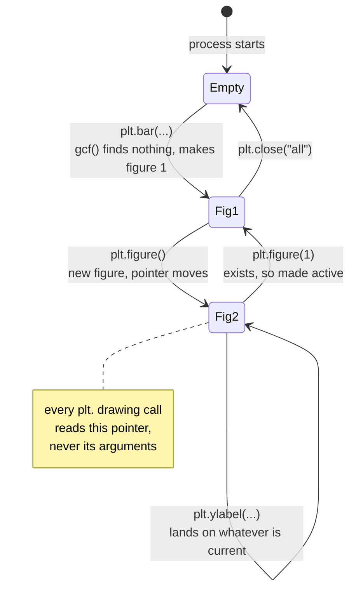

# 2.2 — gca, and the axes you did not choose

## One-line answer

`plt.gcf()` and `plt.gca()` hand you the current figure and the current panel, `plt.figure(n)` and
`plt.sca(ax)` move which ones those are, and because "current" is one entry in one dictionary inside
one module, the panel you get is whichever was made last — not the one you were thinking about.

---

## The story

The flat now has two sheets on the fridge door and has learned, the hard way, that "the sheet" is not
a useful phrase. So somebody writes a word at the top of each one in marker pen: **aisles** on the
old sheet, **weeks** on the new one.

The new rule is announced over dinner and it is a good rule. Before you write anything, you say out
loud which sheet you are writing on. *"Aisles. Pounds spent, up the left-hand side."* Then you write.

It works, mostly. It fails in one specific way, and everyone in the flat has now done it at least
once. You say "aisles", you turn to the fridge, somebody asks you a question, you answer it, and then
you write — on whichever sheet you were already touching. The saying-out-loud and the writing are two
separate acts, and anything can happen between them.

There is a second, quieter failure. When the weeks sheet was printed it came out on two halves of one
page: the bar chart at the top, the line at the bottom, on one sheet. Now "weeks" is not enough
information either. You have named the sheet and you still have not named the half.

Both of those failures are in the library, exactly as described, and both of them have names.

---

## The idea in plain language

[2.1](2.1-the-figure-you-never-named.md) established that `matplotlib.pyplot` remembers a **current
figure** — the sheet that `plt.` calls draw on — and a **current axes** — the panel on that sheet
they draw in. This part is about the four functions that read and move those two pieces of
information, and about where they are actually stored.

**The two readers:**

- `plt.gcf()` — *get current figure*. Returns the figure. If there is none, it makes one.
- `plt.gca()` — *get current axes*. Returns the panel. If the current figure has no panel, it adds
  one.

**The two movers:**

- `plt.figure(num)` — makes a figure current. Matplotlib's own description of the `num` parameter is
  precise about the two cases: "If a figure with that identifier already exists, this figure is made
  active and returned… If there is no figure with the identifier or *num* is not given, a new figure
  is created, made active and returned." So `plt.figure(1)` goes back to figure 1, and
  `plt.figure(7)` — when there is no figure 7 — invents one.
- `plt.sca(ax)` — *set current axes*. Its whole body is two statements: make that panel's figure
  current, then make that panel current within it.

**And two ways to look at what is open:** `plt.get_fignums()` lists the numbers, and
`plt.get_figlabels()` lists the names, if you gave any.

Now the part that changes how you feel about all of it. The "current figure" is not a special
language feature and it is not per-function. It is an ordinary module-level variable, of the kind
Day 10's [2.3](../../../day-10-functions/parts/02-scope/2.3-global-and-nonlocal.md) argued you rarely
want. Concretely it is a dictionary held on a class called `Gcf` in the private module
`matplotlib._pylab_helpers`, mapping figure numbers to the objects that manage them. The leading
underscore in `_pylab_helpers` is Python's convention for "this is not part of the public interface" —
you look at it once, to understand the machine, and then you never import it in real code.

A module is a file that has already run, and it runs once per process
([Day 17, 1.3](../../../day-17-modules-and-packages/parts/01-the-module/1.3-sys-modules.md)). So
there is exactly one of these dictionaries in your program, no matter how many files import pyplot,
and it is shared by your code, your helper modules, any library you installed that also draws, and
every cell of a notebook. This is the same shape of problem as NumPy's global random state, which is
why Day 20's [4.1](../../../day-20-arrays-and-dtypes/parts/04-random/4.1-default-rng-the-generator.md)
told you to carry a generator object instead of calling `np.random.seed`. Same disease, same cure:
hold the object, do not consult a global.

---

## Why Setu needs it

- **[2.3](2.3-where-plt-plot-stops-working.md)** is four programs that break on exactly the gap
  described in the story — the distance between saying which sheet and writing on it. It reads as
  four unrelated bugs until you know they are one.
- **[3.1](../03-the-object-api/3.1-fig-ax-subplots.md)** replaces all four functions with one
  assignment, and the reason it is an improvement is only visible after you have seen what it
  replaces.
- **[4.1](../04-many-axes/4.1-a-grid-of-axes.md)** puts four panels on one sheet. The second failure
  in the story — naming the sheet and still not the half — is the everyday state of a grid, and it is
  why `plt.title` is unusable there.
- **[5.4](../05-getting-it-out/5.4-the-figures-you-never-closed.md)** is about `plt.close`, which
  removes an entry from the same dictionary you are about to print. It is the other half of this
  page.
- **[6.2](../06-the-module/6.2-testing-a-chart-without-looking.md)** writes a pytest fixture whose
  entire job is emptying this dictionary between tests.
- **Day 38** brings seaborn, whose functions take an `ax=` argument and fall back to `plt.gca()` when
  you do not pass one ([Day 38,
  1.2](../../../day-38-seaborn/parts/01-the-tidy-input/1.2-the-chart-you-did-not-ask-for.md)). Every
  library that draws has this fallback, so this page is about all of them, not only matplotlib.

---

## The mechanism

The story's first failure, in eight lines.

```python
import matplotlib

matplotlib.use("Agg")
import matplotlib.pyplot as plt

AISLES = ["dairy", "bakery", "produce", "household"]
TOTALS = [21.85, 9.80, 27.00, 13.80]
WEEKS = [1, 2, 3, 4]
WEEKLY = [17.20, 14.25, 22.00, 19.00]

plt.bar(AISLES, TOTALS)
aisle_fig = plt.gcf()

plt.figure()
plt.plot(WEEKS, WEEKLY, marker="o")
week_fig = plt.gcf()

plt.ylabel("pounds spent")

print("figures open        :", plt.get_fignums())
print("current figure      :", plt.gcf().number)
print("aisle figure y label:", repr(aisle_fig.axes[0].get_ylabel()))
print("week  figure y label:", repr(week_fig.axes[0].get_ylabel()))
```

**Line by line:**

- `plt.bar(AISLES, TOTALS)` makes figure 1 and draws the four aisle bars on it, exactly as
  [2.1](2.1-the-figure-you-never-named.md) showed.
- `aisle_fig = plt.gcf()` grabs a name for that sheet. Without this line the rest of the snippet
  could not even ask the question.
- `plt.figure()` with no argument makes a **new** figure and makes it current. This is the moment the
  pointer moves, and it is one word long.
- `plt.plot(WEEKS, WEEKLY, marker="o")` draws the weekly totals on the new sheet. `marker="o"` puts a
  dot at each of the four weeks so that four data points are visibly four data points rather than
  three line segments.
- `plt.ylabel("pounds spent")` is the line under test. Read it as a human: it is obviously about
  pounds per aisle, and it was obviously written by somebody thinking about the bar chart.
- `plt.get_fignums()` proves both sheets are still open — nothing was closed or replaced.
- `plt.gcf().number` says which one is current at the moment the label was written.
- The last two lines ask each figure's first panel for its y label. `repr` is used rather than plain
  printing so that an empty string shows up as `''` instead of as a blank line you might miss.

```text
figures open        : [1, 2]
current figure      : 2
aisle figure y label: ''
week  figure y label: 'pounds spent'
```

**The label went on the weekly chart.** No error, no warning, no clue. The only reason you know is
that this snippet went out of its way to keep both figures named and print both answers, which no
real program does.

Now the repair, and the two functions that perform it.

```python
import matplotlib

matplotlib.use("Agg")
import matplotlib.pyplot as plt
from matplotlib._pylab_helpers import Gcf

AISLES = ["dairy", "bakery", "produce", "household"]
TOTALS = [21.85, 9.80, 27.00, 13.80]
WEEKS = [1, 2, 3, 4]
WEEKLY = [17.20, 14.25, 22.00, 19.00]

print("registry at import :", list(Gcf.figs))
plt.bar(AISLES, TOTALS)
print("after the first bar:", list(Gcf.figs))
plt.figure()
plt.plot(WEEKS, WEEKLY, marker="o")
print("after the second   :", list(Gcf.figs))
print("Gcf.figs is a      :", type(Gcf.figs).__name__)
print("active entry       :", Gcf.get_active().num)

plt.figure(1)
print("after plt.figure(1):", Gcf.get_active().num)
plt.ylabel("pounds spent")
print("aisle y label now  :", repr(plt.figure(1).axes[0].get_ylabel()))
print("figures open       :", plt.get_fignums())
```

**Line by line:**

- `from matplotlib._pylab_helpers import Gcf` reaches into the private module named above. This is
  the one snippet in the day that does that, and it is here for the same reason a mechanic takes a
  panel off: to show that there is no magic behind it. **Do not write this line in code you keep.**
- `list(Gcf.figs)` prints the dictionary's keys, which are the figure numbers. Printing it before
  anything is drawn shows the registry starting empty.
- The `print` after `plt.bar` shows the key `1` appearing. Nothing in your program put it there.
- `plt.figure()` then `plt.plot(...)` adds the key `2` in the same way.
- `type(Gcf.figs).__name__` names the container. It is an `OrderedDict` — an ordinary dictionary
  subclass that remembers insertion order — not a hidden C structure. The state machine is a dict.
- `Gcf.get_active().num` is the number of the entry `gcf()` will hand out. This is the pointer itself,
  read directly, and it is the same value `plt.gcf().number` reports.
- `plt.figure(1)` is the mover. Because a figure with that number already exists it is made active
  rather than created, which is the first half of the `num` rule quoted above.
- `plt.ylabel("pounds spent")` now lands where it was meant to, and the next line proves it by asking
  figure 1's panel.
- The final `plt.get_fignums()` confirms nothing was created by the repair. Two figures went in, two
  came out.

```text
registry at import : []
after the first bar: [1]
after the second   : [1, 2]
Gcf.figs is a      : OrderedDict
active entry       : 2
after plt.figure(1): 1
aisle y label now  : 'pounds spent'
figures open       : [1, 2]
```

Now the second failure from the story: naming the sheet is not enough when the sheet has two halves.

```python
import matplotlib

matplotlib.use("Agg")
import matplotlib.pyplot as plt

AISLES = ["dairy", "bakery", "produce", "household"]
TOTALS = [21.85, 9.80, 27.00, 13.80]
WEEKS = [1, 2, 3, 4]
WEEKLY = [17.20, 14.25, 22.00, 19.00]

fig, (ax_top, ax_bottom) = plt.subplots(2)
ax_top.bar(AISLES, TOTALS)
ax_bottom.plot(WEEKS, WEEKLY, marker="o")

print("panels on the sheet:", len(fig.axes))
print("gca is the top     :", plt.gca() is ax_top)
print("gca is the bottom  :", plt.gca() is ax_bottom)

plt.title("What each aisle cost")
print("top panel title    :", repr(ax_top.get_title()))
print("bottom panel title :", repr(ax_bottom.get_title()))

plt.sca(ax_top)
plt.title("What each aisle cost")
print("top panel title    :", repr(ax_top.get_title()))
```

**Line by line:**

- `plt.subplots(2)` makes one figure with two panels stacked vertically, and returns the figure and
  the panels together. [4.1](../04-many-axes/4.1-a-grid-of-axes.md) is that call in full; here it is
  only a convenient way to get a sheet with two halves.
- `fig, (ax_top, ax_bottom) = ...` unpacks the pair, then unpacks the array of panels into two names.
  The parentheses are the tuple-unpacking form; without them Python would try to bind three names to
  a two-item result.
- `ax_top.bar(...)` and `ax_bottom.plot(...)` draw on named panels — the object style, used here so
  that the `plt.` call later has something unambiguous to be compared against.
- `plt.gca() is ax_top` and `plt.gca() is ax_bottom` ask which panel pyplot considers current. Only
  one of them can be `True`, and which one it is, is the whole question.
- `plt.title("What each aisle cost")` is the mistake, written in the most natural way possible. The
  aisle bars are on the top panel, and the sentence is about the aisle bars.
- Printing both titles with `repr` shows where it landed and what stayed empty.
- `plt.sca(ax_top)` is the fix: *set current axes*. It moves the pointer to a panel you name, so the
  next `plt.` call is no longer a guess.
- The repeated `plt.title(...)` after it is the same call as before, and its result is now different.
  That is what "the effect depends on remembered state" means, shown twice in one snippet.

```text
panels on the sheet: 2
gca is the top     : False
gca is the bottom  : True
top panel title    : ''
bottom panel title : 'What each aisle cost'
top panel title    : 'What each aisle cost'
```

**The current panel is the one created most recently, which on a stacked pair is the bottom one.**
Nothing about that is wrong, and nothing about it is guessable from reading the `plt.title` line. On
Day 41's eight-panel pack, the current panel is the eighth.

The pointer and the registry, drawn as the state machine they are:



**The arrows nobody writes are the dangerous ones.** `plt.figure()` moves the pointer as a side
effect of making a sheet, and a function you called two levels down can move it without your file
mentioning figures at all.

If you are stuck with pyplot style — an inherited script, an example you are adapting — the one habit
that helps is to give figures names instead of numbers.

```python
import matplotlib

matplotlib.use("Agg")
import matplotlib.pyplot as plt

AISLES = ["dairy", "bakery", "produce", "household"]
TOTALS = [21.85, 9.80, 27.00, 13.80]
WEEKS = [1, 2, 3, 4]
WEEKLY = [17.20, 14.25, 22.00, 19.00]

plt.figure("aisles")
plt.bar(AISLES, TOTALS)
plt.figure("weeks")
plt.plot(WEEKS, WEEKLY, marker="o")

print("figure labels    :", plt.get_figlabels())
print("figure numbers   :", plt.get_fignums())
print("current label    :", plt.gcf().get_label())

plt.figure("aisles")
plt.ylabel("pounds spent")
print("current label    :", plt.gcf().get_label())
print("aisles y label   :", repr(plt.figure("aisles").axes[0].get_ylabel()))
print("weeks  y label   :", repr(plt.figure("weeks").axes[0].get_ylabel()))
```

**Line by line:**

- `plt.figure("aisles")` passes a **string** as the identifier. The `num` rule quoted earlier covers
  this case too: a string sets the figure's label, and asking for the same string again returns the
  same figure rather than making another.
- `plt.figure("weeks")` opens the second sheet under its own name. Compare this with `plt.figure()`
  in the first snippet: same function, but now the sheet has a handle a human can remember.
- `plt.get_figlabels()` lists those handles, and `plt.get_fignums()` shows the numbers still exist
  underneath. Names do not replace numbers; they sit alongside them.
- `plt.gcf().get_label()` reads the current sheet's name, which is a far more useful thing to print in
  a log than `2`.
- `plt.figure("aisles")` before `plt.ylabel` is the same repair as `plt.figure(1)`, written so that
  the reader of the code can see it is correct without counting backwards through the file.
- The last two lines re-select each figure inside the `print` in order to read it. That is legal and
  it works, and it should also make you uneasy — **reading a value moves the pointer**, so the order
  of your `print` statements now affects your program.

```text
figure labels    : ['aisles', 'weeks']
figure numbers   : [1, 2]
current label    : weeks
current label    : aisles
aisles y label   : 'pounds spent'
weeks  y label   : ''
```

Names are a real improvement over numbers, and they are still not a fix. The last bullet above is
why: with pyplot, every inspection is also a mutation.

---

## When it breaks

**`gca` is a getter, and it will not take instructions:**

```text
$ uv run python -c "
import matplotlib
matplotlib.use('Agg')
import matplotlib.pyplot as plt
ax = plt.gca(projection='polar')
"
Traceback (most recent call last):
  File "<string>", line 5, in <module>
TypeError: gca() got an unexpected keyword argument 'projection'
```

**What it means.** In matplotlib 3.11.1, `plt.gca()` takes no arguments at all — its body is
`return gcf().gca()`, which you read in [2.1](2.1-the-figure-you-never-named.md). It fetches; it
cannot configure. A great deal of older example code on the internet passes keyword arguments here
and will raise this exact `TypeError` when you paste it. The fix is to create the axes with the
options you want instead of asking for one and hoping —
`fig, ax = plt.subplots(subplot_kw={"projection": "polar"})` — which is
[3.1](../03-the-object-api/3.1-fig-ax-subplots.md) again, arriving early because the state machine
has no way to express the request.

**The silent one — a closed figure that came back:**

```text
$ uv run python -c "
import matplotlib
matplotlib.use('Agg')
import matplotlib.pyplot as plt
fig, ax = plt.subplots()
print('open before close:', plt.get_fignums())
plt.close(fig)
print('open after close :', plt.get_fignums())
plt.sca(ax)
print('open after sca   :', plt.get_fignums())
print('gcf is fig       :', plt.gcf() is fig)
"
open before close: [1]
open after close : []
open after sca   : [1]
gcf is fig       : True
```

**What it means.** `plt.close(fig)` removes the entry from the registry, and `plt.sca(ax)` puts it
straight back — because `sca` makes the panel's figure current, and making a figure current means
registering it. So "closed" is not a property of the figure. It is a statement about whether pyplot
is currently holding a reference to it, and any later call that touches the object can undo it. If
you are closing figures in a loop to control memory
([5.4](../05-getting-it-out/5.4-the-figures-you-never-closed.md)) and something afterwards calls
`plt.sca` on an axes you kept, the figure count goes back up and the loop's whole purpose quietly
fails.

---

## In production

**What a professional writes instead of the teaching version.** None of these four functions appear
in code that ships. `plt.gcf()` and `plt.gca()` appear in a debugger, in a notebook, and in the first
two lines of a rescue when you are converting somebody else's script
([2.1](2.1-the-figure-you-never-named.md)). `plt.figure(n)` and `plt.sca(ax)` are replaced entirely
by having the object: if you can call `plt.sca(ax)` then you already have `ax`, so use it.
`plt.get_fignums()` is the exception and survives into real code — in tests and in long-running jobs,
as a leak check, because a number that only goes up is a bug you can assert on.

**What degrades under concurrency.** There is one registry per process, and it is shared by
everything in that process:

```text
$ uv run python -c "
import matplotlib
matplotlib.use('Agg')
import matplotlib.pyplot as plt
import matplotlib.pyplot as also_plt
from matplotlib._pylab_helpers import Gcf
import matplotlib._pylab_helpers as helpers
print('same module object:', plt is also_plt)
print('one registry dict :', Gcf.figs is helpers.Gcf.figs)
print('registry contents :', list(Gcf.figs))
"
same module object: True
one registry dict : True
registry contents : []
```

Two imports, one module object, one dictionary. Now put two threads in that process, each rendering a
customer's report with `plt.` calls. Both threads read and move the same pointer, and the interleaving
is decided by the scheduler, so thread A's bars can land on thread B's figure. The failure is not a
crash and not a corrupted file — it is a correct-looking chart with somebody else's data on it. The
object style is not merely tidier here; it is the difference between state that is shared by default
and state that is local to a call.

**The failure that only appears with real data.** A monthly report drew one chart per aisle and
labelled each with `plt.ylabel`. It was written and tested with one aisle, where the current figure is
always the only figure. In production there were four, and the loop drew all four before any labelling
happened, so all four labels landed on the last figure — one chart with four identical labels stacked
on top of each other and three with none. Nobody spotted it, because the reviewed chart was the one at
the bottom of the loop and it looked perfect. This is the same bug as the first snippet on this page,
scaled by a `for` statement, and [2.3](2.3-where-plt-plot-stops-working.md) reproduces it.

**The review comment a senior engineer leaves.** *"`plt.sca(self.axes[i])` on line 88 tells me you
already have the axes object. Pass it to the drawing helper and delete both the `sca` and the seven
`plt.` calls under it. Right now this function's correctness depends on nothing else in the process
touching pyplot between line 88 and line 96, and there is no way to make that a test."*

**The interview question.** *"What is `plt.gca()`, and when have you had to use it?"* It returns the
current axes from pyplot's global figure registry, creating a figure and an axes if none exists. The
honest answer to the second half is: adapting example code, and inside a library's `ax=None`
fallback — which is [3.5](../03-the-object-api/3.5-the-ax-parameter.md)'s subject, where `gca()` is
the documented default for a function that was not given a panel. The follow-up is usually *"what
goes wrong with it?"* — the current axes is process-wide, so any code in the same process can move it
between two of your statements, which makes chart correctness depend on execution order instead of on
arguments.

---

## Check yourself

```bash
uv run --with 'matplotlib==3.11.1' python -c "
import matplotlib
matplotlib.use('Agg')
import matplotlib.pyplot as plt
fig, (top, bottom) = plt.subplots(2)
top.bar(['dairy', 'bakery', 'produce', 'household'], [21.85, 9.80, 27.00, 13.80])
bottom.plot([1, 2, 3, 4], [17.20, 14.25, 22.00, 19.00], marker='o')
plt.title('What each aisle cost')
print('top    :', repr(top.get_title()))
print('bottom :', repr(bottom.get_title()))
plt.sca(top)
plt.title('What each aisle cost')
print('top    :', repr(top.get_title()))
print('open   :', plt.get_fignums())
"
```

Four lines of output, and one of them is the same call producing a different result. Say which two
lines prove that, and what changed in between.

**Answer out loud, without scrolling up:**

> Where is the "current figure" actually stored, and how many of them exist in one Python process?
> Then say why `plt.sca(ax)` is a sign that the surrounding code should not need `plt` at all.

---

**Next:** [2.3 — Where plt.plot stops working](2.3-where-plt-plot-stops-working.md).
