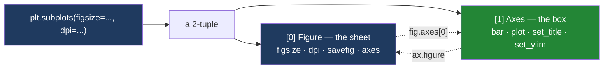

# 3.1 — `fig, ax = plt.subplots()`

## One-line answer

`plt.subplots()` makes the sheet and rules one box on it in a single call, and hands both back as a
pair — the sheet first, the box second — so that from the next line onwards you have a name for each
of them and never have to guess which one a command will land on.

---

## The story

The flat's shopping chart is going on the fridge. The drawer has a pad of plain paper in it and a
ruler beside the pad.

Drawing the chart is always the same two movements. Take one sheet off the pad. Rule a box on the
sheet. Nobody in that flat has ever taken a sheet off the pad and *not* ruled a box on it, because a
sheet with nothing on it is not a chart, it is a sheet.

So the flatmate who does this most has started keeping a small stack of sheets with the box already
ruled. When somebody wants to draw something, that flatmate pulls one off the stack and hands it
over, saying the same sentence every time: **"here's the sheet, and here's the box on it."** One
movement. Two things named, in that order.

Now watch what happens when somebody writes the two words down in the wrong order. A flatmate is
told *sheet, then box*, but jots it on their hand as *box, then sheet*. Later they want to pin the
whole thing up, so they reach for what they have labelled "the sheet" — and it is the box. They try
to pin up a box. There is no box to pin; the box is a rectangle of pen on paper.

Nothing about the sheet or the box changed. Only the two labels swapped, and every instruction after
that goes to the wrong thing. That is the entire risk of this part, and it is worth knowing before
you type the line, because when it happens the computer often will not complain.

---

## The idea in plain language

[1.1](../01-the-two-objects/1.1-the-paper-and-the-frame.md) named the two objects. A **figure** is
the whole sheet: it has a size, and it is the thing that becomes one image file. An **axes** is one
framed panel drawn on that sheet: it owns the bars, the line, the ticks, the labels and the little
heading. Almost everything you will want to change belongs to the axes.

Making them separately takes two statements — `plt.figure()` for the sheet, then `fig.add_subplot()`
for the panel. Because you virtually always want both, matplotlib gives you one function that does
both: **`plt.subplots()`**.

It hands back **two objects at once**. Python's way of returning more than one thing is a **tuple** —
a fixed-length record of values, written with commas, introduced on
[Day 8, 1.3](../../../day-08-containers/parts/01-sequences/1.3-a-tuple-is-a-record.md). Writing
`fig, ax = plt.subplots()` on the left of the `=` is **unpacking**: Python takes the two items out of
the tuple and binds the first to `fig` and the second to `ax`
([Day 8, 1.4](../../../day-08-containers/parts/01-sequences/1.4-unpacking-and-star-rest.md)). The
order is fixed and it is **figure first, axes second**. Nothing checks that your two names mean what
you think they mean; the tuple has no idea what you called them.

Two keyword arguments are worth knowing on the first day, because both are decisions you make once
and then stop thinking about.

**`figsize=`** is the size of the sheet **in inches**, width first, height second. Not pixels. A
sheet is a physical object in matplotlib's model, and its size is stated the way you would state the
size of a piece of paper.

**`dpi=`** is **dots per inch** — how many pixels one inch of that sheet turns into when it is
finally rendered. A sheet six inches wide at one hundred dots per inch is six hundred pixels wide.
`figsize` and `dpi` multiply together to give the image you get; neither one on its own tells you how
big the picture will be.

There is one honest thing to say about `plt.subplots` before you use it. It is a `plt` function, and
`plt` is the module with the hidden "current figure" that
[section 2](../02-the-state-machine/2.1-the-figure-you-never-named.md) is about. `plt.subplots` does
still register the figure it makes with that hidden bookkeeping, and it does still make that figure
the current one. The difference — the whole difference — is that it **also hands the figure to you**.
Once you have your own name for it, you never have to ask the module which figure it thinks you meant.

---

## Why Setu needs it

- **[3.2](3.2-drawing-on-an-axes.md)** draws bars and lines by calling methods on the `ax` this line
  produced. Every drawing verb for the rest of the day starts with `ax.`.
- **[3.5](3.5-the-ax-parameter.md)** turns this line into a contract: a drawing function makes its
  own `fig, ax` only when it was not handed an axes. That is impossible to express until the two
  objects have separate names.
- **[4.1](../04-many-axes/4.1-a-grid-of-axes.md)** passes `2, 2` to this same function and gets an
  **array** of axes back instead of one. The shape of the second returned item is the whole of that
  part, and it starts here.
- **[5.2](../05-getting-it-out/5.2-savefig-dpi-and-bbox-inches.md)** saves the file, using `fig` and
  the `dpi` chosen here.
- **[6.1](../06-the-module/6.1-the-figures-module.md)** pins `FIGSIZE` and `DPI` as module constants,
  because Principle 4 says you never accept a framework default you did not choose.
- **Day 41** closes the phase with an eight-chart figure pack — one figure, eight axes, and one
  `plt.subplots` call that produces all nine objects.

---

## The mechanism

Start by looking at what the function actually returns, before unpacking it.

```python
import matplotlib

matplotlib.use("Agg")
import matplotlib.pyplot as plt

pair = plt.subplots()
print("what subplots returns:", type(pair).__name__)
print("how many things      :", len(pair))
print("the first is         :", type(pair[0]))
print("the second is        :", type(pair[1]))
```

**Line by line:**

- `import matplotlib` on its own, then `matplotlib.use("Agg")`, then `import matplotlib.pyplot as
  plt`. The middle line picks the **backend**, the piece of code that turns a figure into pixels;
  `"Agg"` writes image files and never tries to open a window, which is what a script wants. It has
  to run before `pyplot` is imported, and
  [5.1](../05-getting-it-out/5.1-backends-and-the-script-with-no-window.md) is that rule in full.
- `pair = plt.subplots()` deliberately does **not** unpack. Assigning the whole return value to one
  name is the way to find out what shape it is, rather than trusting a tutorial.
- `type(pair).__name__` prints the class name without the module path, which keeps the line readable.
- `len(pair)` works because a tuple has a length. Two items.
- `pair[0]` and `pair[1]` are the two items in order. Printing the full `type(...)` here, rather than
  just the name, shows which module each class comes from — worth seeing once.

```text
what subplots returns: tuple
how many things      : 2
the first is         : <class 'matplotlib.figure.Figure'>
the second is        : <class 'matplotlib.axes._axes.Axes'>
```

**A two-item tuple, figure then axes.** `fig, ax = plt.subplots()` is not special syntax. It is
ordinary tuple unpacking of exactly that.

Now the line as it is actually written, with both keyword arguments spelled out.

```python
fig, ax = plt.subplots(figsize=(6, 4), dpi=100)

print("type(fig) :", type(fig))
print("type(ax)  :", type(ax))
print("fig.axes  :", fig.axes)
print("ax in it  :", fig.axes[0] is ax)
print("size in   :", fig.get_size_inches())
print("dpi       :", fig.get_dpi())
print("pixels    :", fig.get_size_inches() * fig.get_dpi())
```

**Line by line:**

- `fig, ax = plt.subplots(...)` unpacks the pair into two names. `fig` is the sheet, `ax` is the box.
  These two names are a near-universal convention, and following it means anybody reading your code
  knows which is which without checking.
- `figsize=(6, 4)` is a tuple of two numbers, **inches**, width then height. Six by four is close to
  matplotlib's own default of 6.4 by 4.8, so this is a small, deliberate change rather than a
  dramatic one — the point is that it is now *yours* rather than the library's.
- `dpi=100` fixes the resolution. Matplotlib's default is also 100, so again nothing visibly changes;
  writing it down is what stops a future version of the library from changing it under you.
- `fig.axes` is the figure's list of panels. It has exactly one item, because `plt.subplots()` with no
  grid arguments rules exactly one box.
- `fig.axes[0] is ax` asks whether the panel in that list is the same object you were handed. `is`
  compares identity, not equality — the same object, not a copy
  ([Day 4, 3.2](../../../day-04-objects/parts/03-identity-trap/3.2-is-versus-equals.md)).
- `fig.get_size_inches()` reads the size back as a NumPy array of two numbers.
- `fig.get_dpi()` reads the resolution back.
- Multiplying the two gives the pixel size the image will have. It is a NumPy array times a plain
  number, which multiplies element by element
  ([Day 20, 1.2](../../../day-20-arrays-and-dtypes/parts/01-the-block/1.2-shape-dtype-and-the-rest.md)).

```text
type(fig) : <class 'matplotlib.figure.Figure'>
type(ax)  : <class 'matplotlib.axes._axes.Axes'>
fig.axes  : [<Axes: >]
ax in it  : True
size in   : [6. 4.]
dpi       : 100
pixels    : [600. 400.]
```

**Six inches at one hundred dots per inch is six hundred pixels.** That multiplication is the only
arithmetic you need to remember about figure size, and it is why `figsize` is not a pixel count.

Here is what the defaults are, if you write none of that:

```python
print("default figsize    :", plt.subplots()[0].get_size_inches())
print("default dpi        :", plt.subplots()[0].get_dpi())
print("rcParam figsize    :", matplotlib.rcParams["figure.figsize"])
print("rcParam dpi        :", matplotlib.rcParams["figure.dpi"])
print("rcParam savefig dpi:", matplotlib.rcParams["savefig.dpi"])
```

**Line by line:**

- `plt.subplots()[0]` makes a figure and takes only the first item of the pair. Fine for a one-off
  question; never write it in real code, because it throws away the axes you just paid for.
- `matplotlib.rcParams` is matplotlib's settings dictionary — the **run-time configuration**. Every
  default the library uses is a key in it, which means every default is inspectable rather than
  folklore.
- `"savefig.dpi"` is a separate setting from `"figure.dpi"`, and its value is the string `"figure"`,
  meaning "whatever the figure's own dpi is". Knowing that saves a confusing afternoon in
  [5.2](../05-getting-it-out/5.2-savefig-dpi-and-bbox-inches.md).

```text
default figsize    : [6.4 4.8]
default dpi        : 100.0
rcParam figsize    : [6.4, 4.8]
rcParam dpi        : 100.0
rcParam savefig dpi: figure
```

**The default sheet is 6.4 by 4.8 inches at 100 dots per inch — 640 by 480 pixels.** That is a
decision somebody made, not a law, and Principle 4 says a project states its own.

### What `plt.subplots()` does that the two-step version does not

The two statements it replaces are honest enough for one panel:

```python
fig = plt.figure(figsize=(6, 4))
ax = fig.add_subplot()
```

**Line by line:**

- `plt.figure(figsize=(6, 4))` makes the sheet and nothing else. `fig.axes` is `[]` at this point.
- `fig.add_subplot()` rules one box on it and returns the box. With no arguments it means "one row,
  one column, the first cell".

The difference shows the moment you want more than one panel. `plt.subplots` takes `nrows` and
`ncols` and returns the panels already arranged in a NumPy array of that shape, whereas the two-step
version makes you build the container yourself:

```python
import numpy as np

fig = plt.figure(figsize=(6, 4))
axs = np.empty((2, 2), dtype=object)
for r in range(2):
    for c in range(2):
        axs[r, c] = fig.add_subplot(2, 2, r * 2 + c + 1)
print("hand-built grid shape:", axs.shape)

fig2, axs2 = plt.subplots(2, 2, figsize=(6, 4))
print("plt.subplots shape   :", axs2.shape, type(axs2).__name__)
```

**Line by line:**

- `np.empty((2, 2), dtype=object)` makes a two-by-two array whose cells hold arbitrary Python
  objects. It is the container `plt.subplots` would have built for you.
- `fig.add_subplot(2, 2, n)` takes three numbers: rows, columns, and **which cell**, counted from 1,
  left to right and then top to bottom. The `r * 2 + c + 1` is that counting done by hand, and
  getting it wrong is a bug you cannot see until you look at the picture.
- `plt.subplots(2, 2, figsize=(6, 4))` replaces all six of those lines, and the array it returns has
  the shape you asked for so that `axs[0, 1]` means "top row, right-hand panel".
- `axs2.shape` is the pair of numbers describing the grid
  ([Day 20, 1.2](../../../day-20-arrays-and-dtypes/parts/01-the-block/1.2-shape-dtype-and-the-rest.md)).
  [4.1](../04-many-axes/4.1-a-grid-of-axes.md) is entirely about that shape and the one case where it
  surprises everybody.

```text
hand-built grid shape: (2, 2)
plt.subplots shape   : (2, 2) ndarray
```

Beyond the grid, `plt.subplots` also carries `sharex`, `sharey`
([4.3](../04-many-axes/4.3-shared-axes.md)), `squeeze` ([4.1](../04-many-axes/4.1-a-grid-of-axes.md)),
`width_ratios`, `height_ratios`, and passes anything else straight through to the figure — which is
how `figsize`, `dpi` and `layout="constrained"` reach it. None of those exist on `add_subplot`,
because none of them are decisions about a single panel.



**The two dotted arrows are the only way back.** Given either object you can reach the other, which
is why losing one of the two names is annoying rather than fatal — and why swapping them is fatal
rather than annoying.

---

## When it breaks

**The swap, which says nothing at all:**

```text
$ uv run python -c "
import matplotlib
matplotlib.use('Agg')
import matplotlib.pyplot as plt
ax, fig = plt.subplots()
fig.bar(['dairy', 'bakery'], [21.85, 9.80])
print('no error. what is fig? ', type(fig).__name__)
print('what is ax?           ', type(ax).__name__)
print('ax.savefig exists?    ', hasattr(ax, 'savefig'))
"
no error. what is fig?  Axes
what is ax?             Figure
ax.savefig exists?      True
```

**What it means.** Unpacking in the wrong order is not an error, because the tuple does not know what
your names mean. `fig.bar(...)` then works perfectly — `fig` is genuinely an `Axes`. The program runs
green all the way to the end, and every later line that says `fig` is talking about a panel and every
line that says `ax` is talking about a sheet. `hasattr(ax, 'savefig')` printing `True` is the proof:
the name `ax` currently owns the save method, which no real axes ever does. This is the story's
flatmate trying to pin up a box. **The order is figure first. There is no check.**

**Forgetting to unpack at all:**

```text
$ uv run python -c "
import matplotlib
matplotlib.use('Agg')
import matplotlib.pyplot as plt
fig = plt.subplots()
fig.savefig('x.png')
"
Traceback (most recent call last):
  File "<string>", line 6, in <module>
AttributeError: 'tuple' object has no attribute 'savefig'
```

**What it means.** `fig` is the whole pair, not the first half of it. This one is friendly: the word
`tuple` in the message tells you exactly what happened. The fix is the comma —
`fig, ax = plt.subplots()`.

**Asking for a grid and then treating it as one panel:**

```text
$ uv run python -c "
import matplotlib
matplotlib.use('Agg')
import matplotlib.pyplot as plt
fig, ax = plt.subplots(2)
ax.bar(['dairy', 'bakery'], [21.85, 9.80])
"
Traceback (most recent call last):
  File "<string>", line 6, in <module>
AttributeError: 'numpy.ndarray' object has no attribute 'bar'. Did you mean: 'var'?
```

**What it means.** The first positional argument to `plt.subplots` is `nrows`, so `plt.subplots(2)`
asks for two stacked panels and the second returned item is an **array** of two axes, not one axes.
Python's "Did you mean: 'var'?" is a red herring — `var` is NumPy's variance method and has nothing
to do with bars. The word to read in that message is `ndarray`. The fix is `axs` rather than `ax` as
the name, and then `axs[0].bar(...)`;
[4.1](../04-many-axes/4.1-a-grid-of-axes.md) is that whole subject.

**`figsize` given in pixels:**

```text
$ uv run python -c "
import matplotlib
matplotlib.use('Agg')
import matplotlib.pyplot as plt
fig, ax = plt.subplots(figsize=(800, 600))
ax.bar(['dairy'], [21.85])
fig.savefig('big.png')
"
Traceback (most recent call last):
  File "<string>", line 7, in <module>
  File ".../matplotlib/figure.py", line 3515, in savefig
    self.canvas.print_figure(fname, **kwargs)
  ...
  File ".../matplotlib/backends/backend_agg.py", line 71, in __init__
    self._renderer = _RendererAgg(int(width), int(height), dpi)
MemoryError: bad allocation
```

**What it means.** An eight-hundred-inch sheet at one hundred dots per inch is eighty thousand by
sixty thousand pixels — four thousand eight hundred million pixels, about 19 GB at four bytes each.
Matplotlib accepts the size without complaint, because a large sheet is a legitimate request; the
failure comes later, when the backend tries to allocate the pixels. `MemoryError: bad allocation`
carries no hint that `figsize` was the cause, which is why "inches, not pixels" is worth learning on
the first day rather than the first outage. The fix is `figsize=(8, 6)` with `dpi=100`.

**A misspelled keyword, which does not reach `subplots` at all:**

```text
$ uv run python -c "
import matplotlib
matplotlib.use('Agg')
import matplotlib.pyplot as plt
fig, ax = plt.subplots(facecolour='white')
"
  File ".../matplotlib/artist.py", line 1271, in _update_props
    raise AttributeError(
AttributeError: Figure.set() got an unexpected keyword argument 'facecolour'
```

**What it means.** Anything `plt.subplots` does not recognise is forwarded to the figure, so the
complaint comes from `Figure.set()` rather than from `subplots`. Read the message as "the figure did
not know this word". The spelling matplotlib uses is `facecolor`, without the `u`, everywhere —
a small, permanent annoyance for anyone who writes British English.
[3.4](3.4-ax-set-the-one-call-form.md) meets the same error from the other direction.

---

## In production

**What a professional writes instead of the teaching version.** One line, with the size, the
resolution and the layout engine all stated:

```python
fig, ax = plt.subplots(figsize=(6, 4), dpi=100, layout="constrained")
```

**Line by line:**

- `figsize` and `dpi` are written down rather than inherited, so that a matplotlib upgrade cannot
  silently change the shape of every chart in the project (Principle 4). In real code these two are
  module constants — `FIGSIZE` and `DPI` in
  [6.1](../06-the-module/6.1-the-figures-module.md) — so that changing them changes every chart at
  once.
- `layout="constrained"` turns on the layout engine that measures the labels and moves the panel so
  they fit. Without it, a long y label is simply cut off at the edge of the sheet.
  [4.4](../04-many-axes/4.4-constrained-layout.md) measures the difference in pixels.

**What degrades at scale.** Every call to `plt.subplots` registers the figure with `pyplot`'s hidden
list of open figures, and that list holds a strong reference — the figure cannot be cleaned up while
it is in there, no matter how many of your own names for it have gone out of scope. A loop that
builds a few hundred charts therefore keeps every one of them in memory unless each is closed.
[5.4](../05-getting-it-out/5.4-the-figures-you-never-closed.md) measures it and shows the warning
matplotlib eventually emits. The line to remember is that `plt.subplots` is not a pure constructor;
it has a side effect on module state, and that side effect is what you have to clean up.

**The failure that only appears with real data.** A dashboard generator asked for `plt.subplots()`
with no arguments and rendered fine on the developer's machine for a year. Then somebody added a
category whose name was long, the x tick labels grew, and at 6.4 by 4.8 inches they overlapped into
an unreadable smear — but only for the three regions whose category names were long. Nothing raised.
The chart was wrong for a fifth of the customers and correct for the rest, which is the hardest kind
of bug to be told about, because the person who sees it assumes it is their screen. Stating `figsize`
does not fix long labels on its own; it makes the size a decision somebody can point at, and
`layout="constrained"` then has room to work with.

**The review comment a senior engineer leaves.** *"`plt.subplots()` with no arguments — please pass
`figsize` and `dpi` explicitly, or better, take them from the module constants. Right now the size of
every chart in this repository is whatever the installed matplotlib feels like, and we pin everything
else."*

**The interview question.** *"What does `plt.subplots()` return, and why is it written as two names?"*
It returns a two-item tuple: a `Figure` and, for the default one-by-one grid, a single `Axes`. It is
unpacked into two names because they are two different objects with two different jobs — the figure
owns the size, the resolution and the file it saves to; the axes owns the data, the ticks and the
labels. The follow-up that separates people is *"what changes if you pass `2, 2`?"* — the second item
becomes a NumPy array of shape `(2, 2)` rather than a single axes, so `ax.bar(...)` starts failing
with `'numpy.ndarray' object has no attribute 'bar'`, and any code that indexes it has to know the
grid shape. The good answer mentions `squeeze=False` as the way to make the shape predictable
regardless of the grid.

---

## Check yourself

```bash
uv run --with 'matplotlib==3.11.1' python -c "
import matplotlib
matplotlib.use('Agg')
import matplotlib.pyplot as plt
pair = plt.subplots(figsize=(6, 4), dpi=100)
print('returned      :', type(pair).__name__, 'of', len(pair))
fig, ax = pair
print('fig is        :', type(fig).__name__)
print('ax is         :', type(ax).__name__)
print('panels on fig :', len(fig.axes))
print('ax is that one:', fig.axes[0] is ax)
print('inches        :', fig.get_size_inches())
print('pixels        :', fig.get_size_inches() * fig.get_dpi())
print('ax has savefig:', hasattr(ax, 'savefig'))
print('fig has bar   :', hasattr(fig, 'bar'))
"
```

Nine lines. The last two both print `False`, and together they are the reason the order of the two
names is not a matter of taste — say what each one is denying.

**Answer out loud, without scrolling up:**

> `plt.subplots()` returns one thing. What is that one thing, and what are the two items inside it,
> in order? Then: if you write `figsize=(600, 400)` expecting a 600 by 400 image, what have you
> actually asked for, and how many pixels is it?

---

**Next:** [3.2 — Drawing on an axes](3.2-drawing-on-an-axes.md).
