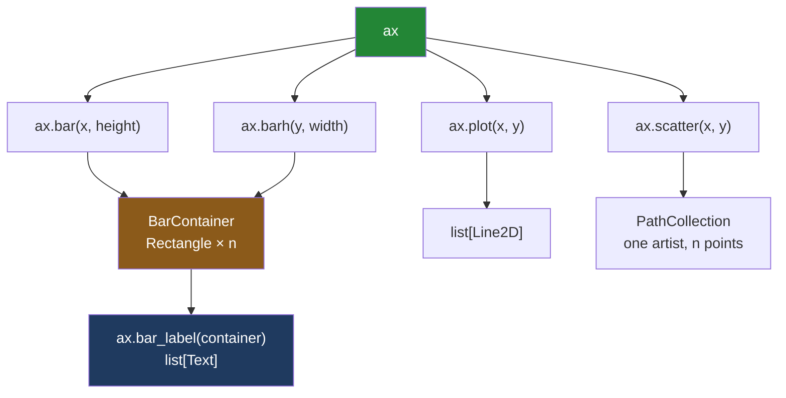

# 3.2 — Drawing on an axes

## One-line answer

Every drawing verb is a method on the axes — `ax.bar`, `ax.plot`, `ax.scatter`, `ax.barh` — and each
of them **hands back the objects it just made**, which is the only handle you will ever get on them
and the reason a chart can be changed, labelled and tested after it is drawn.

---

## The story

The sheet is on the table with one box ruled on it. Now somebody has to actually draw.

There are four aisles and four totals, so the obvious drawing is four bars of different heights:
dairy at 21.85, bakery at 9.80, produce tallest at 27.00, household at 13.80. Somebody draws them.

Then there are the four weekly totals — 17.20, 14.25, 22.00, 19.00 — and those are not four separate
things, they are one thing changing across four weeks. Nobody draws four bars for that. They draw a
line with a dot at each week, because that is what "changing over time" looks like on paper.

The chart goes on the fridge. Within a day somebody is standing in front of it with a mug in their
hand, squinting at the household bar, and asks the question that every chart on every fridge
eventually gets: **"what is that number?"**

The bar is a bit taller than half the produce bar. Nobody can read a number off a rectangle. So
somebody takes the pen and writes `13.80` in small letters just above the top of that bar, and above
the other three too, and the question stops being asked.

That is the whole part. Four ways of making a mark, and the small act of writing the number next to
the mark so that a person standing at the fridge does not have to guess.

---

## The idea in plain language

An **axes** is one framed panel ([1.1](../01-the-two-objects/1.1-the-paper-and-the-frame.md)), and
the ways of making a mark inside it are methods on that object. You have `ax` from
[3.1](3.1-fig-ax-subplots.md); everything below is `ax.` followed by a verb.

Four verbs cover most of what a report needs.

**`ax.bar(x, height)`** draws upright bars. Use it when the x values are **categories** — separate
named things with no order that means anything. The four aisles are categories; dairy is not "less
than" produce, it is just a different aisle.

**`ax.barh(y, width)`** draws the same bars lying on their side. It is the right choice when the
category names are long, because a horizontal bar gives each name a whole line of its own instead of
squeezing them all along the bottom edge.

**`ax.plot(x, y)`** draws a line joining the points in the order given. The joining line is a claim:
it says the thing between two points is meaningful. That claim is true for weeks 1, 2, 3, 4 and false
for dairy, bakery, produce, household, which is why you never join categories with a line.

**`ax.scatter(x, y)`** draws a mark at each point and joins nothing. Use it when each point is its
own observation and the order between them means nothing.

Then there is the fridge question. **`ax.bar_label(container)`** writes each bar's value as text just
outside the end of that bar. It takes the object `ax.bar` returned, because it needs to know where
each bar is and how tall it is.

That brings up the thing this part is really about. Each of these calls **returns something**, and
that something is the set of drawn objects. [1.3](../01-the-two-objects/1.3-everything-is-an-artist.md)
introduced the word: an **artist** is matplotlib's name for anything drawable, and a chart is a pile
of artists sitting in lists until the moment it is rendered. What comes back differs by verb, and the
differences are not arbitrary:

- `ax.bar` returns a **`BarContainer`** — a group holding one `Rectangle` per bar, so that two
  separate `bar` calls on one panel stay distinguishable.
- `ax.plot` returns a **list of `Line2D`**, one per line. It is a list even for a single line,
  because one call can draw several.
- `ax.scatter` returns a single **`PathCollection`**. A collection is one artist that draws many
  shapes, with the positions kept in an array — which is what keeps a scatter of a million points
  drawable at all.
- `ax.barh` returns a **`BarContainer`** as well, holding rectangles laid out the other way round.

Most tutorials throw all of that away by writing `ax.bar(...)` as a bare statement. Keeping it is the
difference between a chart you drew and a chart you can still work on.

---

## Why Setu needs it

- **[3.3](3.3-the-setter-names.md)** labels the panel these marks sit in, and it is only worth
  labelling once there is something to label.
- **[4.3](../04-many-axes/4.3-shared-axes.md)** puts one aisle on each of four panels and shows that
  the unshared version makes household look like produce. That comparison is about bar heights, drawn
  here.
- **[6.1](../06-the-module/6.1-the-figures-module.md)** wraps exactly two of these calls —
  `spend_by_aisle` around `ax.bar`, `weekly_total` around `ax.plot` — as the day's module.
- **[6.2](../06-the-module/6.2-testing-a-chart-without-looking.md)** asserts
  `[b.get_height() for b in ax.containers[0]] == TOTALS`. That test is only possible because `ax.bar`
  returns objects with a `get_height` method.
- **Day 37** is chart choice: which of these four verbs is honest for which data, and the bar chart
  whose axis did not start at zero.
- **Day 41**'s eight-chart pack must stay legible in greyscale, which is easier when a value is
  written next to its bar rather than inferred from its length.

---

## The mechanism

First, what each verb hands back.

```python
import matplotlib

matplotlib.use("Agg")
import matplotlib.pyplot as plt

AISLES = ["dairy", "bakery", "produce", "household"]
TOTALS = [21.85, 9.80, 27.00, 13.80]
WEEKS = [1, 2, 3, 4]
WEEKLY = [17.20, 14.25, 22.00, 19.00]

fig, ax = plt.subplots()
bars = ax.bar(AISLES, TOTALS)
print("ax.bar     ->", type(bars).__name__, "of", len(bars), type(bars[0]).__name__)

fig, ax = plt.subplots()
lines = ax.plot(WEEKS, WEEKLY)
print("ax.plot    ->", type(lines).__name__, "of", len(lines), type(lines[0]).__name__)

fig, ax = plt.subplots()
points = ax.scatter(WEEKS, WEEKLY)
print("ax.scatter ->", type(points).__name__)

fig, ax = plt.subplots()
hbars = ax.barh(AISLES, TOTALS)
print("ax.barh    ->", type(hbars).__name__, "of", len(hbars), type(hbars[0]).__name__)
```

**Line by line:**

- The four constants are the flat's numbers, in the order they have been in since
  [1.1](../01-the-two-objects/1.1-the-paper-and-the-frame.md). `TOTALS` is what each aisle cost across
  the whole month; `WEEKLY` is what the flat spent in each of the four weeks.
- A fresh `fig, ax = plt.subplots()` before each verb, so that each panel holds exactly one kind of
  mark and the counts below are unambiguous.
- `bars = ax.bar(AISLES, TOTALS)` — the first argument is where each bar goes, the second is how tall
  it is. Passing strings as the first argument makes the x axis **categorical**: matplotlib places
  the four names at 0, 1, 2, 3 and writes the names underneath.
- `type(bars).__name__` prints the class name without the module path.
- `len(bars)` works because a `BarContainer` behaves like a sequence, and `bars[0]` is the first
  rectangle in it.
- `lines = ax.plot(WEEKS, WEEKLY)` — x first, y second, and both must be the same length. The result
  is a plain Python list, which is why `type(lines).__name__` prints `list` rather than a matplotlib
  class.
- `points = ax.scatter(WEEKS, WEEKLY)` returns one object, not a sequence, so there is nothing to
  take a length of.
- `hbars = ax.barh(AISLES, TOTALS)` — for the horizontal version the first argument is the **y**
  position of each bar and the second is its **width**.

```text
ax.bar     -> BarContainer of 4 Rectangle
ax.plot    -> list of 1 Line2D
ax.scatter -> PathCollection
ax.barh    -> BarContainer of 4 Rectangle
```

**Three different shapes of return value for four verbs.** That is not tidiness for its own sake:
bars come in groups, lines come in lists because one call can draw many, and a scatter is
deliberately one object so that a large number of points does not become a large number of Python
objects.

Now read the marks back, which is the point of keeping them.

```python
fig, ax = plt.subplots()
points = ax.scatter(WEEKS, WEEKLY)
print("scatter offsets  :", points.get_offsets().tolist())
print("in ax.collections:", len(ax.collections))
print("in ax.patches    :", len(ax.patches))

fig, ax = plt.subplots()
(line,) = ax.plot(WEEKS, WEEKLY, marker="o")
print("line xdata:", list(line.get_xdata()))
print("line ydata:", list(line.get_ydata()))
print("marker    :", line.get_marker())
```

**Line by line:**

- `points.get_offsets()` returns the point positions as a NumPy array of `(x, y)` pairs.
  `.tolist()` turns it into ordinary Python lists so the printed line is readable.
- `ax.collections` is the panel's list of bulk artists, and the scatter is the single item in it.
- `ax.patches` is empty, because a scatter draws no filled shapes of the kind a bar chart makes. A
  panel's artist lists are per-kind, and asking for the wrong kind returns an empty list rather than
  an error — a trap [1.3](../01-the-two-objects/1.3-everything-is-an-artist.md) covers.
- `(line,) = ax.plot(...)` is the one-element unpack. The trailing comma inside the parentheses
  unpacks a one-item list, and it **raises if the list has any other length**, so the assumption
  "this call drew exactly one line" is checked rather than hoped for
  ([Day 8, 1.4](../../../day-08-containers/parts/01-sequences/1.4-unpacking-and-star-rest.md)).
- `marker="o"` puts a round dot at each data point as well as drawing the joining line. Without it
  the reader cannot tell where the measurements were and where the line is just interpolating.
- `get_xdata()`, `get_ydata()` and `get_marker()` read back what the line was built from. Every one
  of these has a matching `set_`, which is [3.3](3.3-the-setter-names.md).

```text
scatter offsets  : [[1.0, 17.2], [2.0, 14.25], [3.0, 22.0], [4.0, 19.0]]
in ax.collections: 1
in ax.patches    : 0
line xdata: [np.int64(1), np.int64(2), np.int64(3), np.int64(4)]
line ydata: [np.float64(17.2), np.float64(14.25), np.float64(22.0), np.float64(19.0)]
marker    : o
```

**The chart still contains the data.** `WEEKLY` went in and `line.get_ydata()` gives it back. The
values come out as `np.float64` rather than plain `float` because matplotlib stores them in NumPy
arrays ([Day 20, 1.2](../../../day-20-arrays-and-dtypes/parts/01-the-block/1.2-shape-dtype-and-the-rest.md)),
and an `np.float64` compares equal to the `float` it came from, so a test can assert on them
directly.

### The fridge question: writing the number on the bar

```python
fig, ax = plt.subplots()
bars = ax.bar(AISLES, TOTALS)
labels = ax.bar_label(bars, fmt="%.2f", padding=3)

print("bar_label returned:", type(labels).__name__, "of", len(labels))
print("the texts         :", [t.get_text() for t in labels])
print("ax.texts now      :", len(ax.texts))
```

**Line by line:**

- `ax.bar_label(bars, ...)` takes the **container**, not the axes and not the data. It needs each
  rectangle's position and height to know where to write, and the container is what holds them. This
  is the first payoff for having kept the return value of `ax.bar`.
- `fmt="%.2f"` formats each number to two decimal places. Without it, `9.8` is written as `9.8` while
  the others show two digits, and a column of prices with ragged decimals looks like a mistake.
- `padding=3` lifts each label three **points** above the top of its bar. A point is a typographic
  unit, one seventy-second of an inch, so the gap stays the same physical size whatever the figure's
  `dpi` is.
- `ax.bar_label` returns a **list of `Text` artists**, one per bar. Keeping it lets a later step
  restyle them.
- `ax.texts` counts free-standing text on the panel. It was `0` before this call and is `4` after,
  which confirms these labels are ordinary text artists and not part of the bars.

```text
bar_label returned: list of 4
the texts         : ['21.85', '9.80', '27.00', '13.80']
ax.texts now      : 4
```

**Those four strings are the answer to "what is that number?"** They are also the cheapest
accessibility improvement available on any bar chart: a reader who cannot judge lengths well, or who
is looking at a greyscale printout, can still read the values.

### Keeping the return value earns its keep once

```python
fig, ax = plt.subplots()
bars = ax.bar(AISLES, TOTALS)

worst = max(range(len(TOTALS)), key=lambda i: TOTALS[i])
print("worst aisle      :", AISLES[worst])
print("colour before    :", bars[worst].get_facecolor())
bars[worst].set_facecolor("#8b5a1a")
print("colour after     :", bars[worst].get_facecolor())
print("dairy untouched  :", bars[0].get_facecolor())
```

**Line by line:**

- `max(range(len(TOTALS)), key=lambda i: TOTALS[i])` finds the **index** of the largest total rather
  than the value, because the index is what selects the matching bar. `key=` takes a function that
  says what to compare by
  ([Day 8, 1.5](../../../day-08-containers/parts/01-sequences/1.5-sort-sorted-and-key.md)).
- `bars[worst]` indexes the container, not `ax.patches`. Indexing the container asks "the third bar
  of *this* bar call", which stays correct when something else later adds a shape to the panel.
- `get_facecolor()` returns the colour as four numbers — red, green, blue and alpha, each from 0 to
  1. Alpha is opacity; 1.0 is fully solid.
- `set_facecolor("#8b5a1a")` takes a hex colour string. The `get_`/`set_` pairing is the convention
  [3.3](3.3-the-setter-names.md) is built on.
- Reading `bars[0]` afterwards shows the other three bars are unchanged.

```text
worst aisle      : produce
colour before    : (0.12156862745098039, 0.4666666666666667, 0.7058823529411765, 1.0)
colour after     : (0.5450980392156862, 0.35294117647058826, 0.10196078431372549, 1.0)
dairy untouched  : (0.12156862745098039, 0.4666666666666667, 0.7058823529411765, 1.0)
```



**Everything hangs off `ax`, and `bar_label` hangs off what `bar` gave back.** That last arrow is the
reason the return value matters: one function in the picture cannot be reached without it.

---

## When it breaks

**Bars and heights of different lengths:**

```text
$ uv run python -c "
import matplotlib
matplotlib.use('Agg')
import matplotlib.pyplot as plt
fig, ax = plt.subplots()
ax.bar(['dairy', 'bakery', 'produce', 'household'], [21.85, 9.80, 27.00])
"
  File ".../matplotlib/axes/_axes.py", line 2540, in bar
    raise ValueError(error_message) from e
ValueError: shape mismatch: objects cannot be broadcast to a single shape.  Mismatch is between 'x' with shape (4,) and 'height' with shape (3,).
```

**What it means.** Four names, three numbers. The message names both arguments and both shapes, which
is unusually helpful, and it is the error you get when a list of labels and a list of values have
drifted apart — typically because one of them was filtered and the other was not. The fix is upstream
of the chart: build the labels and the values from the same rows in the same pass.

**The same mistake on `plot`, with a different message:**

```text
$ uv run python -c "
import matplotlib
matplotlib.use('Agg')
import matplotlib.pyplot as plt
fig, ax = plt.subplots()
ax.plot([1, 2, 3, 4], [17.20, 14.25, 22.00])
"
  File ".../matplotlib/axes/_base.py", line 509, in _plot_args
    raise ValueError(f"x and y must have same first dimension, but "
ValueError: x and y must have same first dimension, but have shapes (4,) and (3,)
```

**What it means.** Same bug, different wording, because `bar` and `plot` validate in different
places. "First dimension" is NumPy's phrase for the length along the first axis
([Day 20, 1.2](../../../day-20-arrays-and-dtypes/parts/01-the-block/1.2-shape-dtype-and-the-rest.md)).
Worth knowing both strings, because grepping for one will not find the other.

**Labelling bars that were never drawn:**

```text
$ uv run python -c "
import matplotlib
matplotlib.use('Agg')
import matplotlib.pyplot as plt
fig, ax = plt.subplots()
ax.plot([1, 2, 3, 4], [17.20, 14.25, 22.00, 19.00])
ax.bar_label(ax.containers[0])
"
Traceback (most recent call last):
  File "<string>", line 7, in <module>
IndexError: list index out of range
```

**What it means.** `ax.plot` makes no container, so `ax.containers` is empty and `[0]` fails with a
message that says nothing about bars. This is what happens when a drawing function is changed from
`bar` to `plot` and the labelling line below it is not. The fix is to stop reaching into
`ax.containers` at all: keep what `ax.bar` returned and pass that, and the mistake becomes a
`NameError` at the point where the bars were supposed to be created.

**Strings on a line chart, which is the quiet one:**

```text
$ uv run python -c "
import matplotlib
matplotlib.use('Agg')
import matplotlib.pyplot as plt
fig, ax = plt.subplots()
ax.plot(['1', '2', '3', '4'], [17.20, 14.25, 22.00, 19.00])
print('xlim:', ax.get_xlim())
ax.plot(['10', '20'], [1.0, 2.0])
print('xlim after:', ax.get_xlim())
print('xticklabels:', [t.get_text() for t in ax.get_xticklabels()])
"
xlim: (np.float64(-0.15000000000000002), np.float64(3.15))
xlim after: (np.float64(-0.25), np.float64(5.25))
xticklabels: ['1', '2', '3', '4', '10', '20']
```

**What it means.** No error at all. Because the x values are strings, matplotlib treats the axis as
**categorical**: `'1'` through `'4'` become slots 0 to 3, and the second call adds `'10'` and `'20'`
as two brand new categories at slots 4 and 5 — so `'10'` is drawn immediately to the right of `'4'`
rather than far away where the number ten belongs. Week numbers read from a CSV arrive as strings
([Day 27](../../../day-27-reading-and-writing/parts/01-the-csv/1.1-a-csv-has-no-types-in-it.md) is where
that happens), so this is not a contrived mistake; it is the default outcome of plotting a column
nobody converted. The chart looks plausible and the spacing is a lie. The fix is to convert to
numbers before plotting, and the check is `ax.get_xlim()` — a categorical axis always starts near
`-0.15` and ends near `n - 1 + 0.15`.

---

## In production

**What a professional writes instead of the teaching version.** They keep the return value, always,
even when nothing needs it yet:

```python
fig, ax = plt.subplots(figsize=(6, 4), layout="constrained")
bars = ax.bar(AISLES, TOTALS, color="#4c72b0")
ax.bar_label(bars, fmt="%.2f", padding=3)
ax.set_ylim(0, max(TOTALS) * 1.15)
```

**Line by line:**

- `bars = ...` costs one word and is the difference between a chart you can extend and one you have
  to redraw.
- `color="#4c72b0"` states the colour rather than accepting the cycle's first entry, so that two
  charts built by two different functions do not come out in two different blues. Day 40 makes this a
  palette rather than a literal.
- `ax.bar_label(bars, ...)` goes in by default on any bar chart a person will read rather than scan.
- `ax.set_ylim(0, max(TOTALS) * 1.15)` does two jobs. Starting at zero is a correctness rule for bar
  charts — a bar's length is only meaningful from zero, which is Day 37's "the bar that lied". The
  fifteen per cent headroom is what stops `bar_label` writing the tallest bar's number off the top of
  the panel, since the labels are placed after the limits were computed and do not push them out.

**What degrades at scale.** `ax.plot` and `ax.bar` create one Python artist per line and per bar, and
a chart with tens of thousands of bars becomes tens of thousands of objects to build, lay out and
render. `ax.scatter` is the pattern to copy: it returns a single `PathCollection` holding the
positions in an array, so a hundred thousand points cost one artist. When a bar chart genuinely needs
that many categories, the honest answer is that a bar chart is the wrong chart — but where bulk marks
are needed, reach for the `Collection` version rather than looping.

**The failure that only appears with real data.** A monthly report called `ax.bar_label` on every
chart. It was fine for a year, and then one month a category came in with a value of zero. The label
`0.00` was written at the top of a bar of height zero — that is, sitting on the axis line, overlapping
the tick label underneath it, and the chart looked like it had a rendering fault. Nobody had written
a test for the zero case because nobody had imagined it. The general shape of this bug: **labelling
functions assume the mark has a size**, and real data eventually contains a mark with no size. In the
flat's own numbers, household spent 0.00 in week two, so a per-week bar chart of household hits it
immediately.

**The review comment a senior engineer leaves.** *"`ax.bar(...)` as a bare statement, then
`ax.containers[0]` three lines down to label it. Keep the return value — `bars = ax.bar(...)` — and
pass `bars`. Right now if anyone adds a second `bar` call above this one, the labels move to the wrong
series and nothing fails."*

**The interview question.** *"When would you use `plot` and when `scatter`?"* `plot` joins the points
in the order given, and that joining line is an assertion that the space between two points is
continuous and meaningful — time, distance, a dose. `scatter` joins nothing and is right when each
point is an independent observation. The follow-up that finds out whether you have used them is
*"what do they return, and why is it different?"* — `plot` returns a list of `Line2D` because one
call can draw several lines; `scatter` returns a single `PathCollection` because drawing a million
separate artists would not be viable, so the positions live in an array inside one artist. The
strongest answer adds that this is also why you cannot restyle one scatter point the way you can
restyle one bar.

---

## Check yourself

```bash
uv run --with 'matplotlib==3.11.1' python -c "
import matplotlib
matplotlib.use('Agg')
import matplotlib.pyplot as plt
AISLES = ['dairy', 'bakery', 'produce', 'household']
TOTALS = [21.85, 9.80, 27.00, 13.80]
fig, ax = plt.subplots()
bars = ax.bar(AISLES, TOTALS)
labels = ax.bar_label(bars, fmt='%.2f', padding=3)
print('bar returned      :', type(bars).__name__, 'of', len(bars))
print('bar_label returned:', type(labels).__name__, 'of', len(labels))
print('heights           :', [b.get_height() for b in bars])
print('label texts       :', [t.get_text() for t in labels])
print('ax.patches        :', len(ax.patches))
print('ax.texts          :', len(ax.texts))
print('ax.lines          :', len(ax.lines))
"
```

Seven lines. Two of the counts are `4` for completely different reasons, and one is `0` — say which
list each `4` is, and what the `0` is telling you about the verb you used.

**Answer out loud, without scrolling up:**

> Why does `ax.bar_label` take the thing `ax.bar` returned, rather than taking the axes? Then: you
> have a chart of four aisles and a chart of four weeks. Which one gets `plot` and which gets `bar`,
> and what claim does the wrong choice make about the data?

---

**Next:** [3.3 — The setter names, and how to find one](3.3-the-setter-names.md).
