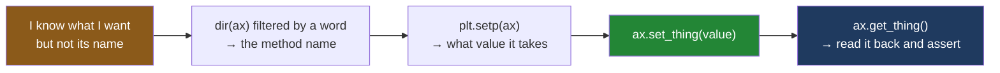

# 3.3 — The setter names, and how to find one

## One-line answer

Almost every changeable thing on an axes has a matching pair of methods — `get_thing()` to read it
and `set_thing(value)` to change it — so you never have to remember a name, you list them with
`dir(ax)` and pick the one that says what you want.

---

## The story

The chart is on the fridge and it works. Four bars, a line underneath, the numbers written on.

Then a sticky note appears next to it, in someone else's handwriting:

> *can you put POUNDS down the left side, and can it start from zero? the bakery bar looks like
> nothing*

Two requests. Both perfectly clear. Neither one is hard to picture: write a word sideways along the
left edge, and make the bottom of the scale be zero.

And you sit down in front of the keyboard and realise you have no idea what either of those things is
called. Not "how do I do it" — you know exactly what you want to happen. You do not know the *word*.

This is the ordinary situation with any large library, and it is the situation most people handle
badly. The bad handling is to open a search engine, land on an answer written for a version that no
longer exists, paste it, and never find out whether there was a better one. The good handling takes
one line and no network: **ask the object what it can do.** The axes in front of you knows its own
list of changeable things, and printing that list is faster than searching for it.

---

## The idea in plain language

Matplotlib follows a naming convention almost everywhere, and once you can see the convention you
stop needing to memorise names.

For each property of an artist there is a **getter** and a **setter**. A getter is a method whose name
starts with `get_` and which returns the current value and changes nothing. A setter is a method whose
name starts with `set_`, takes the new value, and changes the object. The rest of the name after the
underscore is the property.

So `ax.get_title()` reads the panel's heading and `ax.set_title("...")` writes it. `ax.get_ylabel()`
and `ax.set_ylabel(...)`. `ax.get_ylim()` and `ax.set_ylim(...)`. The pattern holds for artists too:
[1.3](../01-the-two-objects/1.3-everything-is-an-artist.md) changed one bar with
`bar.set_height(4.60)` after reading it with `bar.get_height()`.

The five you will use on almost every chart:

- **`ax.set_title(text)`** — the heading above the panel.
- **`ax.set_xlabel(text)`** — the words under the bottom edge, saying what the horizontal position
  means.
- **`ax.set_ylabel(text)`** — the words down the left edge, saying what the height means. This is the
  sticky note's first request.
- **`ax.set_ylim(bottom, top)`** — the range of values the vertical edge covers. `ax.set_ylim(0, 30)`
  is the sticky note's second request.
- **`ax.set_xticks(positions)`** — which positions along the bottom edge get a tick mark and a number.

Two words in that list need defining. An **axis** — singular, and not the same as an axes — is one
edge of the panel with its scale on it; `XAxis` is the bottom edge, `YAxis` the left, and
[1.2](../01-the-two-objects/1.2-axes-is-not-axis.md) is entirely about that unfortunate pair of words.
A **tick** is one mark along an axis, together with the number or word printed beside it.

Now the part that matters more than the five names. **You can list them.** `dir(obj)` is a built-in
Python function that returns the names of everything reachable on an object — its methods and its
attributes ([Day 4, 1.1](../../../day-04-objects/parts/01-objects/1.1-identity-type-value.md)). Filter
that list to the names beginning with `set_` and you have matplotlib's entire vocabulary for changing
a panel, produced by the version you actually have installed rather than by a web page.

There is a second way to ask, which prints values rather than names: `ax.properties()` returns a
dictionary of every property with its current value, and `plt.setp(ax)` prints a human-readable list
of what each one accepts. Use `dir` when you are hunting for a name, and `properties()` when you want
to know what a chart currently looks like.

---

## Why Setu needs it

- **[3.4](3.4-ax-set-the-one-call-form.md)** is `ax.set(title=..., xlabel=...)`, and every keyword it
  accepts is exactly one of the `set_` names with the prefix stripped off. That is not a coincidence,
  and the next part proves it by counting both.
- **[4.3](../04-many-axes/4.3-shared-axes.md)** compares four panels' `get_ylim()` values to show that
  an unshared y axis makes a small aisle look like a large one. That comparison is a getter used as
  evidence.
- **[6.2](../06-the-module/6.2-testing-a-chart-without-looking.md)** tests a chart entirely through
  getters: `ax.get_title()`, `ax.get_xlabel()`, `ax.get_ylabel()`, `ax.get_ylim()`. Every assertion in
  that file is one half of a pair introduced here.
- **Day 37** is labels and chart choice, and its central rule — a bar chart's y axis starts at zero —
  is enforced with `ax.set_ylim(0, ...)` and checked with `ax.get_ylim()`.
- **Day 40** recolours artists for greyscale legibility, reading each one's colour with a getter
  before deciding what to set.

---

## The mechanism

Start by asking the panel what it can change.

```python
import matplotlib

matplotlib.use("Agg")
import matplotlib.pyplot as plt

fig, ax = plt.subplots()

setters = [n for n in dir(ax) if n.startswith("set_")]
getters = [n for n in dir(ax) if n.startswith("get_")]
print("set_ methods on an Axes:", len(setters))
print("get_ methods on an Axes:", len(getters))

paired = [n for n in setters if "get_" + n[4:] in getters]
print("setters with a matching getter:", len(paired))
print(
    "setters with no getter        :", sorted(n for n in setters if "get_" + n[4:] not in getters)
)
```

**Line by line:**

- `dir(ax)` returns a sorted list of every name reachable on the object, as strings. It includes
  methods, attributes and the dunder names Python adds
  ([Day 15](../../../day-15-constructors-and-dunders/parts/01-three-kinds-of-method/1.1-the-method-that-gets-the-class.md) is
  where those were introduced), which is why filtering is the whole point.
- `n.startswith("set_")` keeps only the setters. This is a list comprehension
  ([Day 9, 1.2](../../../day-09-comprehensions/parts/01-list-comprehensions/1.2-the-filter-clause.md)),
  and it is the shortest useful thing you can do with `dir`.
- `n[4:]` slices off the first four characters — `set_` — leaving the bare property name
  ([Day 8, 1.2](../../../day-08-containers/parts/01-sequences/1.2-slicing-and-the-copy-you-missed.md)).
- `"get_" + n[4:] in getters` rebuilds the getter's name and checks whether it exists. Doing this
  rather than trusting the convention is what turns "matplotlib is consistent" from a belief into a
  measurement.
- `sorted(...)` on a generator expression gives the odd ones out in alphabetical order, which is short
  enough to print in full.

```text
set_ methods on an Axes: 58
get_ methods on an Axes: 85
setters with a matching getter: 55
setters with no getter        : ['set_axis_off', 'set_axis_on', 'set_prop_cycle']
```

**Fifty-five of the fifty-eight setters have a getter.** The three that do not are honest exceptions:
`set_axis_off` and `set_axis_on` are commands rather than values — there is no "axis-off-ness" to
read back — and `set_prop_cycle` sets the cycle of colours matplotlib walks through, which it keeps
privately. The convention is real, and now you know its exact size rather than its reputation.

Note the asymmetry in the other direction: eighty-five getters against fifty-eight setters. There are
things you can ask a panel that you cannot tell it, such as `get_children()` from
[1.3](../01-the-two-objects/1.3-everything-is-an-artist.md). Reading is always cheaper than writing.

Now use the list to answer the sticky note. Filter it by the word you actually know.

```python
print("the ones with 'label' in them:", sorted(n for n in setters if "label" in n))
print("the ones with 'tick' in them :", sorted(n for n in setters if "tick" in n))
```

**Line by line:**

- `"label" in n` is a substring test on each name. You do not know that the method is called
  `set_ylabel`, but you do know the English word "label", and that is enough.
- The same trick with `"tick"` finds the tick vocabulary, which is the family most people cannot
  remember because there are four closely related names.
- `sorted` puts them in a readable order. `dir` is already sorted, so this is belt and braces for the
  generator expression.

```text
the ones with 'label' in them: ['set_label', 'set_xlabel', 'set_xticklabels', 'set_ylabel', 'set_yticklabels']
the ones with 'tick' in them : ['set_xticklabels', 'set_xticks', 'set_yticklabels', 'set_yticks']
```

**`set_ylabel` was in the first list, three words after you typed `label`.** That took no search
engine, no scrolling and no version guessing, and the answer is guaranteed to be right for the
matplotlib you have installed.

The tick family is worth reading carefully, because the two halves are different things.
`set_xticks` decides **where** the marks go, in data coordinates. `set_xticklabels` decides **what is
written** at those marks. Setting the second without the first is how ticks get mislabelled, and
[3.4](3.4-ax-set-the-one-call-form.md) reproduces exactly that.

Now the pairs in use, with a read before and after each write.

```python
fig, ax = plt.subplots()
ax.bar(["dairy", "bakery", "produce", "household"], [21.85, 9.80, 27.00, 13.80])

print("title before :", repr(ax.get_title()))
ax.set_title("What each aisle cost")
print("title after  :", repr(ax.get_title()))

print("ylabel before:", repr(ax.get_ylabel()))
ax.set_ylabel("pounds spent")
print("ylabel after :", repr(ax.get_ylabel()))

print("ylim auto    :", ax.get_ylim())
ax.set_ylim(0, 30)
print("ylim set     :", ax.get_ylim())

print("xticks auto  :", list(ax.get_xticks()))
ax.set_xticks([0, 2])
print("xticks set   :", list(ax.get_xticks()))
print("labels now   :", [t.get_text() for t in ax.get_xticklabels()])
```

**Line by line:**

- `repr(...)` around the text getters prints the quotes, so an empty string shows as `''` rather than
  as a blank space you cannot see. Use `repr` whenever a value might be empty or contain spaces.
- `ax.get_title()` before anything is set returns `''`, not `None`. Matplotlib's text properties
  default to the empty string, which matters for a test: `assert ax.get_title()` is a truthiness check
  that catches an unlabelled chart
  ([Day 5, 2.2](../../../day-05-operators-and-conditionals/parts/02-conditionals/2.2-truthiness.md)).
- `ax.get_ylim()` before you set anything returns the range matplotlib chose by looking at the data.
  It is `(0.0, 28.35)` here — five per cent above the tallest bar, and zero at the bottom because a
  bar chart's bars start there.
- `ax.set_ylim(0, 30)` takes two positional numbers. It also accepts a single tuple, and it accepts
  `bottom=` and `top=` on their own, which is how you pin one end and leave the other automatic.
- `ax.get_xticks()` returns the tick positions in **data coordinates**. For a categorical bar chart
  those are `0, 1, 2, 3` — the slots the four names were placed in.
- `ax.set_xticks([0, 2])` keeps only two of them. Look at what happens to the labels underneath.
- `ax.get_xticklabels()` returns `Text` artists, not strings, so `.get_text()` on each one is needed
  to read the words. That is a getter on a getter, and it catches people out.

```text
title before : ''
title after  : 'What each aisle cost'
ylabel before: ''
ylabel after : 'pounds spent'
ylim auto    : (np.float64(0.0), np.float64(28.35))
ylim set     : (np.float64(0.0), np.float64(30.0))
xticks auto  : [0, 1, 2, 3]
xticks set   : [np.int64(0), np.int64(2)]
labels now   : ['dairy', 'produce']
```

**The labels followed the ticks.** Dropping two tick positions dropped two names, and the two bars for
bakery and household are still drawn — they simply have nothing written under them. That is a real
way to produce a misleading chart with no error and no warning, and it is why `set_xticks` is worth
understanding rather than copying.

### The other two ways to ask

```python
fig, ax = plt.subplots()
ax.bar(["dairy", "bakery", "produce", "household"], [21.85, 9.80, 27.00, 13.80])
ax.set_title("What each aisle cost")

props = ax.properties()
print("properties reported:", len(props))
for key in ["title", "xlabel", "ylabel", "ylim", "xscale", "facecolor"]:
    print(" ", key, "=", repr(props[key]))
```

**Line by line:**

- `ax.properties()` calls every getter on the object and collects the results into one dictionary,
  keyed by the bare property name. It is the read-everything companion to
  [3.4](3.4-ax-set-the-one-call-form.md)'s write-everything `ax.set`.
- `len(props)` is the number of readable properties. It is larger than the number of setters, for the
  reason above.
- Printing a handful of chosen keys rather than the whole dictionary keeps the output usable; the full
  dump includes the entire artist tree and is unreadable.
- `xscale` is `'linear'` unless you changed it, and `facecolor` comes back as red, green, blue and
  alpha from 0 to 1 — a white background is `(1.0, 1.0, 1.0, 1.0)`.

```text
properties reported: 79
  title = 'What each aisle cost'
  xlabel = ''
  ylabel = ''
  ylim = (np.float64(0.0), np.float64(28.35))
  xscale = 'linear'
  facecolor = (1.0, 1.0, 1.0, 1.0)
```

There is one more, and it answers a different question — not "what is set" but "what may I set, and
what does it want":

```python
import contextlib
import io

buf = io.StringIO()
with contextlib.redirect_stdout(buf):
    plt.setp(ax)
lines = buf.getvalue().splitlines()
print("lines printed:", len(lines))
for line in lines:
    if "label" in line or "title" in line:
        print(line)
```

**Line by line:**

- `plt.setp(ax)` with no other arguments **prints** a list of settable properties and the kind of
  value each one takes. It prints rather than returns, which is why the next few lines exist.
- `io.StringIO()` is an in-memory text file, and `contextlib.redirect_stdout` sends anything printed
  inside the `with` block into it instead of to the terminal
  ([Day 16, 4.1](../../../day-16-files-and-context-managers/parts/04-context-managers/4.1-with-the-block-that-cleans-up.md)
  is what a `with` block guarantees).
- `buf.getvalue().splitlines()` turns the captured text into a list of lines so it can be filtered the
  same way the `dir` output was.
- Filtering for `label` or `title` narrows fifty-five lines to the six that answer the sticky note.

```text
lines printed: 55
  label: object
  title: str
  xlabel: str
  xticklabels: unknown
  ylabel: str
  yticklabels: unknown
```

**`title: str` tells you the type it wants.** That is more than `dir` gave you, and it is why `setp`
is the second thing to try when a name alone is not enough.



**The loop closes on the getter.** Every setter you use is a thing a test can check, which is the
whole basis of [6.2](../06-the-module/6.2-testing-a-chart-without-looking.md).

---

## When it breaks

**A setter that does not exist, with Python's suggestion:**

```text
$ uv run python -c "
import matplotlib
matplotlib.use('Agg')
import matplotlib.pyplot as plt
fig, ax = plt.subplots()
ax.set_xlabels('aisle')
"
Traceback (most recent call last):
  File "<string>", line 6, in <module>
AttributeError: 'Axes' object has no attribute 'set_xlabels'. Did you mean: 'set_xlabel'?
```

**What it means.** There is one x label, so the method is singular. The `Did you mean:` clause is
Python's own suggestion, added to `AttributeError` in Python 3.10; it appears when the misspelling is
close enough to a real name that the interpreter can find one candidate. It is useful
and it is not a promise — the next example shows it going quiet.

**A setter you invented, where the suggestion cannot help:**

```text
$ uv run python -c "
import matplotlib
matplotlib.use('Agg')
import matplotlib.pyplot as plt
fig, ax = plt.subplots()
ax.set_ylim_bottom(0)
"
Traceback (most recent call last):
  File "<string>", line 6, in <module>
AttributeError: 'Axes' object has no attribute 'set_ylim_bottom'
```

**What it means.** No suggestion this time, because `set_ylim_bottom` is not close enough to anything
real. The name you wanted is `set_ylim` with a keyword: `ax.set_ylim(bottom=0)`. This is the exact
moment to run the `dir` filter — `[n for n in dir(ax) if "lim" in n]` answers it without leaving the
terminal. **When Python cannot guess, list.**

**A getter that gives you objects when you expected strings:**

```text
$ uv run python -c "
import matplotlib
matplotlib.use('Agg')
import matplotlib.pyplot as plt
fig, ax = plt.subplots()
ax.bar(['dairy', 'bakery', 'produce', 'household'], [21.85, 9.80, 27.00, 13.80])
print('labels:', ax.get_xticklabels())
print('joined:', ', '.join(ax.get_xticklabels()))
"
Traceback (most recent call last):
  File "<string>", line 8, in <module>
TypeError: sequence item 0: expected str instance, Text found
labels: [Text(0, 0, 'dairy'), Text(1, 0, 'bakery'), Text(2, 0, 'produce'), Text(3, 0, 'household')]
```

**What it means.** `get_xticklabels()` returns `Text` **artists**, one per tick, each carrying its
position as well as its words. The successful print shows them — it appears after the traceback here
only because the traceback goes to the error stream and the print to the output stream, and the two
are flushed at different moments. The `TypeError` from `join` says it plainly: `expected str instance, Text found`. The fix is `.get_text()` on each —
`[t.get_text() for t in ax.get_xticklabels()]`. The general rule: a getter whose name ends in
`labels` gives you artists, while one ending in `label` gives you a string. That inconsistency is real
and worth remembering, because a test that compares tick labels to a list of strings will fail
confusingly without it.

---

## In production

**What a professional writes instead of the teaching version.** They do not use these five setters as
five separate lines when they are all plain values — [3.4](3.4-ax-set-the-one-call-form.md) collapses
those into one call. The individual setters stay for the ones that need extra arguments:

```python
ax.set_xticks(range(len(AISLES)), AISLES, rotation=45, ha="right")
ax.set_ylabel("pounds spent", labelpad=10)
```

**Line by line:**

- `ax.set_xticks(positions, labels, ...)` takes the labels as a **second positional argument**, which
  sets both halves at once and therefore cannot produce the mislabelled-ticks warning that setting
  them separately can.
- `rotation=45` turns each tick label, which is how long category names are made to fit along a bottom
  edge. `ha="right"` is horizontal alignment; without it a rotated label is centred on its tick and
  drifts sideways from the bar it belongs to.
- `labelpad=10` pushes the y label ten points further from the axis. Extra keyword arguments like this
  are exactly what the one-call form in the next part cannot express.

**What degrades at scale.** `dir(ax)` and `ax.properties()` are for a human at a terminal, not for a
program. `properties()` calls **every** getter, and some of those compute layout — on a figure with
many panels, calling it inside a loop turns a fast script into a slow one for no benefit. In code you
name the property you want. In the terminal you list.

**The failure that only appears with real data.** A team's chart helper set tick labels with
`ax.set_xticklabels(names)` and never touched `set_xticks`. It was correct for months, because their
category count happened to match the tick positions matplotlib chose automatically. Then a month
arrived with a different number of categories, matplotlib chose a different set of automatic ticks,
and the names were placed against the wrong positions — bakery's total was labelled `produce`. The
chart was readable, plausible, and wrong, and the only signal was a `UserWarning` in a log nobody
read. **Setting labels without setting positions is the single most common way to publish a false
chart.**

**The review comment a senior engineer leaves.** *"`ax.set_xticklabels(names)` on its own — please pass
the positions too, `ax.set_xticks(range(len(names)), names)`. As written, matplotlib picks the tick
locations and we assume they line up with our list. That assumption has already broken once."*

**The interview question.** *"You need to change something on a matplotlib chart and you do not know
the method name. What do you do?"* The answer that shows you have used it is `dir`: list the object's
`set_` methods, filter them by a word you do know, and read the name off. The follow-up is usually
*"and how do you check it worked?"* — call the matching `get_`, because almost every setter has one,
and that pair is what lets a chart be tested without rendering it. A strong answer mentions that a
handful of setters have no getter, and says why: they are commands, not properties.

---

## Check yourself

```bash
uv run --with 'matplotlib==3.11.1' python -c "
import matplotlib
matplotlib.use('Agg')
import matplotlib.pyplot as plt
fig, ax = plt.subplots()
setters = [n for n in dir(ax) if n.startswith('set_')]
print('setters       :', len(setters))
print('with lim      :', [n for n in setters if 'lim' in n])
print('with scale    :', [n for n in setters if 'scale' in n])
print('with label    :', [n for n in setters if 'label' in n])
ax.bar(['dairy', 'bakery', 'produce', 'household'], [21.85, 9.80, 27.00, 13.80])
ax.set_ylabel('pounds spent')
ax.set_ylim(0, 30)
print('ylabel reads  :', repr(ax.get_ylabel()))
print('ylim reads    :', ax.get_ylim())
print('ticklabels are:', type(ax.get_xticklabels()[0]).__name__)
"
```

Seven lines. The last one names a class, not a string — say why, and say what one extra call you need
to compare those tick labels against `['dairy', 'bakery', 'produce', 'household']`.

**Answer out loud, without scrolling up:**

> You want the bottom of the vertical scale to be zero and you cannot remember the method. Write the
> one line that finds it, without opening a browser. Then: what is the difference between
> `set_xticks` and `set_xticklabels`, and what goes wrong if you use only the second one?

---

**Next:** [3.4 — `ax.set` — the one-call form](3.4-ax-set-the-one-call-form.md).
