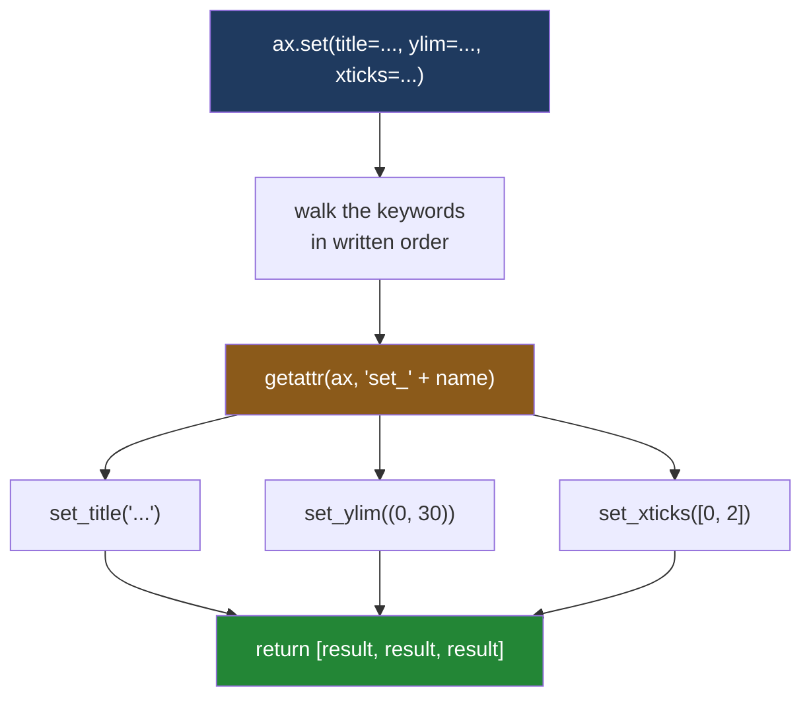

# 3.4 — `ax.set` — the one-call form

## One-line answer

`ax.set(title=..., xlabel=..., ylabel=...)` calls one setter per keyword you give it, in the order
you wrote them, so four lines of plain labelling become one — and it can do nothing that needs a
second argument.

---

## The story

The sticky note on the fridge has grown. There are four requests on it now, in three different
handwritings:

> *POUNDS down the left side · start it at zero · say what the bottom row is · and can the aisle
> names go sideways, they're squashed*

You are standing at the counter with the sheet in front of you and the pen in your hand. The first
three are the same kind of job: somebody has told you a word and where to put it. Write "pounds
spent" down the left, make the bottom of the scale zero, write "aisle" underneath. Three things, and
for each one there is nothing to decide beyond the value itself. You do all three without putting the
pen down.

The fourth is a different kind of job. "Sideways" is not a value you write; it is a *way* of writing
the values. You have to know which names, at what angle, and lined up against what. That one is not
"put this word here" — it is a small instruction with parts.

So the trip to the fridge splits in two. Three quick changes together, and one that needs its own
sentence. That split is exactly the shape of this part, and it is the reason the one-call form is a
convenience rather than a replacement.

---

## The idea in plain language

[3.3](3.3-the-setter-names.md) established the convention: for each property there is `get_thing()`
to read it and `set_thing(value)` to change it. A labelled chart therefore takes several lines that
all look the same:

```
ax.set_title("What each aisle cost")
ax.set_xlabel("aisle")
ax.set_ylabel("pounds spent")
ax.set_ylim(0, 30)
```

Four lines, four repetitions of `ax.set_`. Matplotlib offers one call that does all of them:
**`ax.set(**kwargs)`**. Each keyword name is a `set_` method name with the `set_` stripped off, and
each value is what that method would have been given. `ax.set(title="...")` means exactly
`ax.set_title("...")`.

This is not a special feature of `Axes`. `set` is defined on the **artist** — matplotlib's base class
for anything drawable ([1.3](../01-the-two-objects/1.3-everything-is-an-artist.md)) — so a figure has
one, a line has one and a single bar has one. `line.set(linewidth=2.5, color="#8b5a1a")` is the same
idea on a different object.

Two things about it are worth knowing before you rely on it, and both come from how it is
implemented rather than from what it is for.

**It applies the keywords in the order you wrote them.** Python keeps keyword arguments in the order
they appear ([Day 8, 2.3](../../../day-08-containers/parts/02-sets-and-dicts/2.3-a-dict-is-ordered-now.md)
is where dictionaries becoming ordered was covered), and `set` walks them in that order. For
independent properties that does not matter. For two properties where one depends on the other — tick
positions and tick labels — it decides whether the result is right.

**It can only pass one value per property.** Every keyword becomes a single positional argument to the
matching setter. That covers `title`, `xlabel`, `ylabel`, `ylim` and most of what you write, and it
rules out anything where the setter takes a second argument or a keyword of its own. The sticky note's
fourth request — rotate the names — is exactly that case.

The word for what these calls take is a **keyword argument**: a name, an equals sign and a value,
introduced on
[Day 10, 1.2](../../../day-10-functions/parts/01-the-signature/1.2-positional-and-keyword.md). `set`
collects all of them into a dictionary, which is the `**kwargs` form from
[Day 10, 1.4](../../../day-10-functions/parts/01-the-signature/1.4-args-and-kwargs.md).

---

## Why Setu needs it

- **[3.5](3.5-the-ax-parameter.md)** writes drawing functions whose bodies are two or three lines
  long. `ax.set(...)` is what keeps them that short without dropping any labelling.
- **[4.1](../04-many-axes/4.1-a-grid-of-axes.md)** loops over a grid of panels and labels each one.
  One `ax.set(...)` per panel inside the loop reads as one statement; four setters per panel reads as
  a wall.
- **[6.1](../06-the-module/6.1-the-figures-module.md)** uses it in `spend_by_aisle` and
  `weekly_total`, so the module's two drawing functions are short enough to review at a glance.
- **[6.2](../06-the-module/6.2-testing-a-chart-without-looking.md)** asserts that the title, x label
  and y label are all non-empty. Those three assertions correspond one-to-one to three keywords of a
  single `set` call, which makes a failing test easy to trace back to a missing keyword.
- **Day 37** makes labelling a rule rather than a nicety, and the shortest correct way to obey a
  labelling rule is the form that puts every label in one place.

---

## The mechanism

The whole idea in one call, printing what it hands back.

```python
import matplotlib

matplotlib.use("Agg")
import matplotlib.pyplot as plt

AISLES = ["dairy", "bakery", "produce", "household"]
TOTALS = [21.85, 9.80, 27.00, 13.80]

fig, ax = plt.subplots()
ax.bar(AISLES, TOTALS)
returned = ax.set(title="What each aisle cost", xlabel="aisle", ylabel="pounds spent", ylim=(0, 30))

print("ax.set returned:", returned)
print("title  :", repr(ax.get_title()))
print("xlabel :", repr(ax.get_xlabel()))
print("ylabel :", repr(ax.get_ylabel()))
print("ylim   :", ax.get_ylim())
```

**Line by line:**

- `ax.set(...)` takes four keyword arguments and performs four setter calls: `set_title`,
  `set_xlabel`, `set_ylabel`, `set_ylim`, in that order.
- `ylim=(0, 30)` passes a **tuple** as the single value, because `set_ylim` accepts one tuple as
  readily as it accepts two numbers. This is how a two-number property fits into a one-value keyword.
- `returned = ...` keeps the return value, which almost nobody does. It is a **list of whatever each
  setter returned**, in the order the keywords were written — and that list is the clearest available
  evidence of the ordering rule below.
- The four getters read the values back, confirming that `set` did the same thing the four separate
  calls would have done.

```text
ax.set returned: [Text(0.5, 1.0, 'What each aisle cost'), Text(0.5, 0, 'aisle'), Text(0, 0.5, 'pounds spent'), (0.0, 30.0)]
title  : 'What each aisle cost'
xlabel : 'aisle'
ylabel : 'pounds spent'
ylim   : (np.float64(0.0), np.float64(30.0))
```

**Read the returned list against the keywords.** Title, xlabel, ylabel, ylim — same order, four items
for four keywords. Three `Text` artists came back from the three text setters, and a plain tuple came
back from `set_ylim`. Nothing has been reordered or batched.

### Where the keyword names come from

The keywords are not a curated list somebody wrote. They are the setters, mechanically.

```python
fig, ax = plt.subplots()

setter_names = sorted(n[4:] for n in dir(ax) if n.startswith("set_"))
print("set_ names, prefix removed:", len(setter_names))

import inspect

documented = [p for p in inspect.signature(type(ax).set).parameters if p != "self"]
print("keywords in ax.set's signature:", len(documented))
print("accepted but undocumented     :", sorted(set(setter_names) - set(documented)))
```

**Line by line:**

- `n[4:]` strips `set_` from each name, leaving the keyword `set` would accept for it.
- `inspect.signature(type(ax).set)` reads the **declared** signature of the method. Matplotlib
  generates that signature and its docstring automatically when the module loads, which is why the
  method has fifty-odd named keyword parameters rather than a bare `**kwargs`.
- `type(ax).set` rather than `ax.set` asks the class for the function, which keeps `self` visible in
  the parameter list — hence dropping it explicitly on the next expression.
- The set difference shows which property names the implementation will accept even though the
  generated signature does not list them.

```text
set_ names, prefix removed: 58
keywords in ax.set's signature: 53
accepted but undocumented     : ['axis_off', 'axis_on', 'fc', 'figure', 'navigate_mode']
```

**Fifty-eight setters, fifty-three documented keywords.** The gap is real and it is worth
understanding rather than memorising: `set` looks up `set_` plus your keyword at the moment it runs,
so anything with a matching method is accepted whether or not the generated signature mentions it.
`fc` is the short alias for `facecolor` and works:

```python
fig, ax = plt.subplots()
print("fc accepted :", ax.set(fc="0.95"))
print("facecolor   :", ax.get_facecolor())
```

**Line by line:**

- `fc="0.95"` uses matplotlib's two-letter alias for `facecolor`. Aliases are normalised before the
  lookup, so `fc` reaches `set_facecolor`.
- `"0.95"` is a **greyscale string**: a number between `"0"` and `"1"` given as text means that shade
  of grey, so `"0.95"` is a very light grey. It is the shortest way to write a neutral background.
- The return is `[None]` because `set_facecolor` returns nothing — another reminder that the returned
  list mirrors the setters exactly, including the boring ones.

```text
fc accepted : [None]
facecolor   : (0.95, 0.95, 0.95, 1.0)
```

### The ordering rule, made visible

Tick positions and tick labels are the one pair of properties where order decides correctness.
`set_xticks` fixes where the marks are; `set_xticklabels` writes words at whatever marks currently
exist ([3.3](3.3-the-setter-names.md)).

```python
fig, ax = plt.subplots()
ax.bar(AISLES, TOTALS)
ax.set(xticks=[0, 2], xticklabels=["dairy", "produce"])
print("ticks first  ->", [t.get_text() for t in ax.get_xticklabels()])
```

**Line by line:**

- `xticks=[0, 2]` runs first because it is written first. It fixes the panel to exactly two tick
  positions.
- `xticklabels=[...]` then runs against a panel that already has two fixed ticks, so the two words
  land on the two marks and matplotlib has nothing to complain about.
- Reading back through `get_text()` is needed because `get_xticklabels()` returns `Text` artists
  rather than strings.

```text
ticks first  -> ['dairy', 'produce']
```

Write the same two keywords the other way round and the result is still `['dairy', 'produce']` — but
matplotlib says something on the way past, and *When it breaks* below shows what. The right form for
this pair does not use `set` at all; it is the two-argument setter, which does both halves in one
step:

```python
fig, ax = plt.subplots()
ax.bar(AISLES, TOTALS)
ax.set_xticks([0, 2], ["dairy", "produce"])
print("two-argument setter ->", [t.get_text() for t in ax.get_xticklabels()])
```

**Line by line:**

- `ax.set_xticks(positions, labels)` takes the labels as a second positional argument. Positions and
  words arrive together, so there is no intermediate state in which labels have been set against ticks
  that are about to change.
- This is the shape `ax.set` cannot express, because a keyword carries one value.

```text
two-argument setter -> ['dairy', 'produce']
```



**One value goes into each box.** There is no route in that diagram for a second argument, which is
the whole limitation stated as a picture.

---

## When it breaks

**A misspelled keyword:**

```text
$ uv run python -c "
import matplotlib
matplotlib.use('Agg')
import matplotlib.pyplot as plt
fig, ax = plt.subplots()
ax.set(titel='What each aisle cost')
"
  File ".../matplotlib/artist.py", line 1271, in _update_props
    raise AttributeError(
AttributeError: Axes.set() got an unexpected keyword argument 'titel'
```

**What it means.** `set` looked for a method called `set_titel`, did not find one, and said so. Note
what is missing compared with [3.3](3.3-the-setter-names.md)'s misspelling: there is **no
`Did you mean:` suggestion**, because the failure is a deliberate `AttributeError` raised by
matplotlib rather than Python's own attribute lookup failing. Losing that hint is a genuine cost of
the one-call form, and it is the reason a typo in a `set` call takes longer to spot than the same typo
in `ax.set_titel(...)`.

**A keyword that is a real matplotlib word but not a property of this object:**

```text
$ uv run python -c "
import matplotlib
matplotlib.use('Agg')
import matplotlib.pyplot as plt
fig, ax = plt.subplots()
ax.set(title='What each aisle cost', rotation=45)
"
  File ".../matplotlib/artist.py", line 1271, in _update_props
    raise AttributeError(
AttributeError: Axes.set() got an unexpected keyword argument 'rotation'
```

**What it means.** `rotation` is a perfectly good matplotlib keyword — for a `Text` artist. An axes
has no `set_rotation`, because rotating a whole panel is not a thing you do. This is the sticky note's
fourth request meeting the wall: rotating the tick labels is a property of the labels, and the way in
is `ax.set_xticks(positions, labels, rotation=45, ha="right")`, or reaching the label artists directly
with `ax.tick_params(axis="x", labelrotation=45)`. Also worth noticing: `title` **was** applied before
the error was raised, because `set` walks the keywords one at a time and raises on the one that fails.
A failed `set` call leaves the panel half-changed.

**A setter that takes no value at all:**

```text
$ uv run python -c "
import matplotlib
matplotlib.use('Agg')
import matplotlib.pyplot as plt
fig, ax = plt.subplots()
ax.bar(['dairy', 'bakery'], [21.85, 9.80])
ax.set(axis_off=True)
"
  File ".../matplotlib/artist.py", line 1274, in _update_props
    ret.append(func(v))
               ^^^^^^^
TypeError: _AxesBase.set_axis_off() takes 1 positional argument but 2 were given
```

**What it means.** `set_axis_off()` is a command, not a property — it takes nothing but `self`
([3.3](3.3-the-setter-names.md) found it among the three setters with no getter). `set` passed it
`True` as a positional argument and Python refused. The error is a `TypeError` rather than an
`AttributeError`, because the name was found and the call failed. The fix is to call it directly:
`ax.set_axis_off()`. [4.2](../04-many-axes/4.2-the-axes-you-forgot-to-use.md) uses that method to hide
an unused panel.

**The ordering warning, which is normally invisible:**

```text
$ uv run python -W error::UserWarning -c "
import matplotlib
matplotlib.use('Agg')
import matplotlib.pyplot as plt
fig, ax = plt.subplots()
ax.bar(['dairy', 'bakery', 'produce', 'household'], [21.85, 9.80, 27.00, 13.80])
ax.set(xticklabels=['dairy', 'produce'], xticks=[0, 2])
"
  File ".../matplotlib/axis.py", line 2269, in set_ticklabels
    _api.warn_external(
UserWarning: set_ticklabels() should only be used with a fixed number of ticks, i.e. after set_ticks() or using a FixedLocator. Otherwise, ticks may be mislabeled.
```

**What it means.** Written in this order, `xticklabels` runs against a panel whose tick positions are
still chosen automatically, so matplotlib warns that the words may end up next to the wrong marks.
`-W error::UserWarning` turns warnings into exceptions, which is the only reason there is a traceback
here — without it the same run prints the warning once and carries on, and in a pipeline that message
goes into a log nobody reads. Swap the two keywords and the warning disappears, which means **the
correctness of this call depends on the order two keyword arguments were typed in**. That is a fragile
thing to rely on. Use `ax.set_xticks(positions, labels)` for this pair and keep `ax.set` for
independent properties.

---

## In production

**What a professional writes instead of the teaching version.** One `set` for everything that is a
plain value, and separate calls for anything that is not:

```python
ax.bar(AISLES, TOTALS)
ax.set(
    title="What each aisle cost",
    xlabel="aisle",
    ylabel="pounds spent",
    ylim=(0, max(TOTALS) * 1.15),
)
ax.set_xticks(range(len(AISLES)), AISLES, rotation=45, ha="right")
```

**Line by line:**

- The `set` call is written across several lines with a trailing comma after the last keyword, which
  is how `ruff format` lays out a multi-line call and which makes adding a fifth keyword a one-line
  diff.
- `ylim=(0, max(TOTALS) * 1.15)` starts the scale at zero — the bar chart correctness rule Day 37
  turns into a test — and leaves headroom so that value labels are not written off the top edge.
- `ax.set_xticks(...)` stays outside the `set` call because it needs two positional arguments and two
  keywords of its own. Keeping it separate also means the ordering hazard above can never arise.

**What degrades at scale.** `ax.set` costs a dictionary and an attribute lookup per keyword, which is
nothing next to drawing. What does not scale is the *diagnosis*: in a module with twenty drawing
functions, a mistyped keyword inside a `set` call gives you `Axes.set() got an unexpected keyword
argument 'ylabl'` with no suggestion and no line of your own code named at the top of the traceback,
whereas `ax.set_ylabl(...)` gives you a `Did you mean:` hint pointing straight at the right name. The
practical answer is not to avoid `set`; it is to have a test that asserts the labels are non-empty, so
the typo is caught by a red test rather than by reading a traceback.

**The failure that only appears with real data.** A charting helper labelled every panel with a single
`ax.set(xticklabels=names, xticks=positions)` — in that order, because the author wrote the labels
first while thinking about them. It worked, because setting the labels against automatic ticks happened
to place them correctly for the category counts that occurred in testing. The `UserWarning` was emitted
on every single call and had been in the logs for a year. Then a month arrived with a category count
that made matplotlib choose different automatic ticks, and the labels were placed against the wrong
positions on three panels of an eight-panel pack. The chart was published. **Nothing raised, and the
warning that predicted it exactly had been printing all along.**

**The review comment a senior engineer leaves.** *"`ax.set(xticklabels=..., xticks=...)` — these two
are order-dependent and you have them the wrong way round; we have the `UserWarning` in the logs to
prove it. Please use `ax.set_xticks(positions, labels)`, and move the rest of the labelling into a
single `ax.set(...)` above it."*

**The interview question.** *"What is `ax.set` and when would you not use it?"* It is the artist's
generic property setter: each keyword names a `set_` method with the prefix removed, and it calls them
in the order the keywords appear. Use it for plain values — title, axis labels, limits, scales —
because it turns four near-identical lines into one. Do not use it when the setter needs more than one
value, such as tick positions with their labels, or a rotation, or anything with keyword arguments of
its own; and be aware that a typo in a `set` keyword produces an `AttributeError` without Python's
`Did you mean:` hint. The follow-up that separates people is *"does the order of the keywords matter?"*
— yes, and the tick pair is the case where it decides whether the chart is correct.

---

## Check yourself

```bash
uv run --with 'matplotlib==3.11.1' python -c "
import matplotlib
matplotlib.use('Agg')
import matplotlib.pyplot as plt
AISLES = ['dairy', 'bakery', 'produce', 'household']
TOTALS = [21.85, 9.80, 27.00, 13.80]
fig, ax = plt.subplots()
ax.bar(AISLES, TOTALS)
out = ax.set(title='What each aisle cost', xlabel='aisle', ylabel='pounds spent', ylim=(0, 30))
print('returned    :', len(out), 'results for 4 keywords')
print('title       :', repr(ax.get_title()))
print('ylim        :', ax.get_ylim())
setters = [n[4:] for n in dir(ax) if n.startswith('set_')]
print('possible kws:', len(setters))
print('is ylabel one? ', 'ylabel' in setters)
print('is rotation one?', 'rotation' in setters)
"
```

Six lines. The last one prints `False`, and it is the reason one of the four requests on the sticky
note could not go in the `set` call — say which request, and write the line that does it instead.

**Answer out loud, without scrolling up:**

> Where do `ax.set`'s keyword names come from, and how would you find out whether a particular one is
> allowed without running it? Then: name the one pair of properties where the order you write the
> keywords in changes whether the chart is correct.

---

**Next:** [3.5 — The `ax` parameter — the signature every plotting function has](3.5-the-ax-parameter.md).
