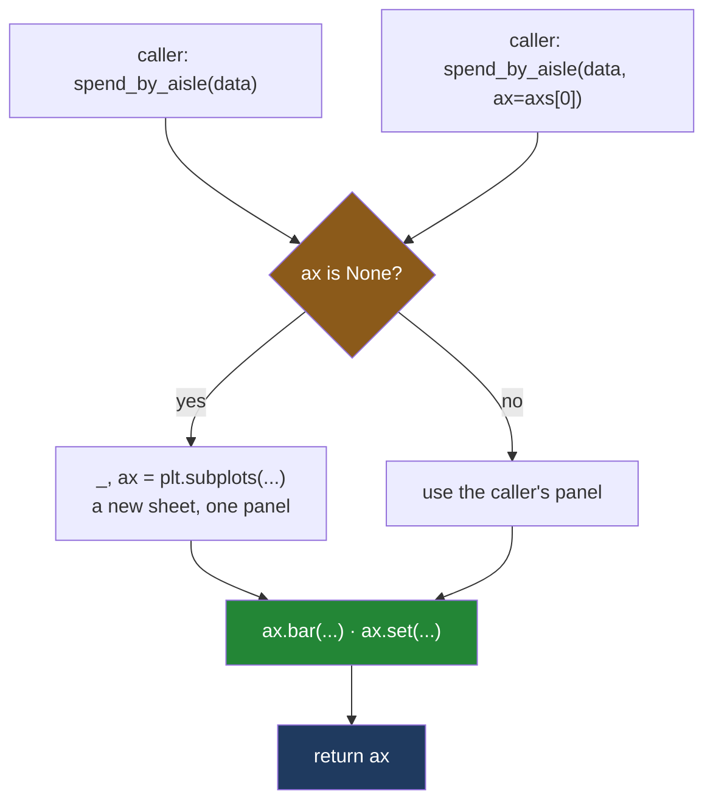

# 3.5 — The `ax` parameter — the signature every plotting function has

## One-line answer

Every function you write that draws takes `ax=None`, makes its own figure **only** when it was given
no panel, and **returns the axes** — which is the one habit that lets any chart be dropped into any
panel of any sheet without being rewritten.

---

## The story

The aisle chart is on the fridge, on its own sheet. The weekly chart is on a second sheet, next to
it. Two sheets, two magnets, and they keep getting knocked out of line.

Somebody says the obvious thing: *put them both on one sheet, side by side.*

Now look at the instructions the flat has written down for drawing the aisle chart. They are pinned
inside the cupboard door and they start like this:

> 1. Take a sheet off the pad.
> 2. Rule a box on it.
> 3. Draw a bar for each aisle.
> 4. Write the numbers on.

Step one is the problem. Those instructions **always begin by fetching a new sheet**, so there is no
way to follow them onto a sheet that already exists. To get both charts on one piece of paper,
somebody has to write out a third set of instructions that does the drawing but not the fetching —
and now there are two versions of "draw the aisle chart" in the cupboard, and one of them will get
updated and the other will not.

There is a small change that fixes it permanently. Rewrite step one:

> 1. **If somebody handed you a box, use that one.** Otherwise take a sheet and rule a box.

Now the same instructions work on their own and inside somebody else's sheet, and there is only one
copy of them. That is the whole part.

---

## The idea in plain language

A drawing function has a choice to make about where its marks go, and there are only two honest
answers: on a panel the caller supplies, or on one it makes for itself. A function that can only do
the second cannot be reused; a function that can only do the first is annoying to call on its own.

The standard shape — matplotlib's own convention, and seaborn's, and pandas' — is a parameter called
`ax` that **defaults to nothing**:

```
def spend_by_aisle(aisles, totals, ax=None) -> Axes
```

Inside, the first statement checks whether it was given one, and creates a figure and an axes only if
it was not. Then it draws, and then it **returns the axes** so that the caller can carry on working
on it.

Three details make this work, and each one is a decision rather than a formality.

**The default is `None`, not an axes.** A default value in Python is worked out **once, when the
`def` line runs**, not each time the function is called
([Day 10, 1.3](../../../day-10-functions/parts/01-the-signature/1.3-defaults-and-when-they-run.md)).
Writing `ax=plt.subplots()[1]` therefore makes exactly one axes for the whole life of the program and
every call draws on that same panel. `None` is the standard placeholder for "no value supplied", and
the check for it is `if ax is None:` — `is`, comparing identity, never `==`
([Day 4, 3.2](../../../day-04-objects/parts/03-identity-trap/3.2-is-versus-equals.md)).

**The type is written down.** `ax: Axes | None = None` says the parameter is either an `Axes` or
nothing. The `X | None` spelling is the modern one and it is the subject of
[Day 19, 1.3](../../../day-19-typing-dataclasses-and-concurrency/parts/01-type-hints/1.3-optional-and-the-none-you-forgot.md);
the vocabulary of type hints generally is
[Day 19, 1.2](../../../day-19-typing-dataclasses-and-concurrency/parts/01-type-hints/1.2-the-vocabulary.md).
A hint is a note, not a rule — nothing enforces it at run time — but a type checker reads it, and so
does the next person
([Day 19, 1.4](../../../day-19-typing-dataclasses-and-concurrency/parts/01-type-hints/1.4-the-type-checker.md)).

**It returns the axes, not the figure.** This is the part people get wrong, and it is not a matter of
taste. If the function returns the figure, then a caller who passed in one panel of a four-panel grid
gets the whole grid back, which tells them nothing they did not already know and gives them no handle
on the panel they care about. Returning the axes means the caller can immediately do
`ax.set_ylim(0, 30)` or read `ax.get_title()`, and the figure is always one attribute away as
`ax.figure`. **The narrower object is the more useful return value.**

---

## Why Setu needs it

- **[4.1](../04-many-axes/4.1-a-grid-of-axes.md)** builds a grid of panels. Every function in this
  section becomes callable into one cell of that grid because of this signature, and would not be
  otherwise.
- **[4.3](../04-many-axes/4.3-shared-axes.md)** draws one aisle per panel across four panels — four
  calls into four axes, from one function.
- **[6.1](../06-the-module/6.1-the-figures-module.md)** writes `spend_by_aisle(spend, ax=None) -> Axes`
  and `weekly_total(weeks, totals, ax=None) -> Axes` into `src/setu/figures.py` as the day's module,
  and leaves `quick_look` deliberately broken so you can see what this contract prevents.
- **[6.2](../06-the-module/6.2-testing-a-chart-without-looking.md)** tests those functions by passing
  an axes in and asserting on the axes that comes back. A function that returns a figure is
  substantially harder to test, because the test has to go looking for the panel.
- **Day 41**'s gate is an eight-chart pack. Eight charts on one figure means eight functions called
  with `ax=`, and the gate is only reachable if every chart-drawing function in the project has this
  shape.

---

## The mechanism

The signature and the body, in full.

```python
import matplotlib

matplotlib.use("Agg")
import matplotlib.pyplot as plt
from matplotlib.axes import Axes

AISLES = ["dairy", "bakery", "produce", "household"]
TOTALS = [21.85, 9.80, 27.00, 13.80]
WEEKS = [1, 2, 3, 4]
WEEKLY = [17.20, 14.25, 22.00, 19.00]


def spend_by_aisle(aisles: list[str], totals: list[float], ax: Axes | None = None) -> Axes:
    """Draw one bar per aisle. Draws into `ax` if given, otherwise makes its own figure."""
    if ax is None:
        _, ax = plt.subplots(figsize=(6, 4), layout="constrained")
    ax.bar(aisles, totals)
    ax.set(title="What each aisle cost", xlabel="aisle", ylabel="pounds spent")
    return ax


def weekly_total(weeks: list[int], totals: list[float], ax: Axes | None = None) -> Axes:
    """Draw the flat's spend across the weeks. Same contract as `spend_by_aisle`."""
    if ax is None:
        _, ax = plt.subplots(figsize=(6, 4), layout="constrained")
    ax.plot(weeks, totals, marker="o")
    ax.set(title="What the flat spent each week", xlabel="week", ylabel="pounds spent")
    return ax
```

**Line by line:**

- `from matplotlib.axes import Axes` imports the class purely so it can be named in the hint. It is
  the public location for it; `type(ax)` reports the private `matplotlib.axes._axes.Axes`, and
  importing from the private module is how a project breaks on a minor upgrade.
- `aisles: list[str]` and `totals: list[float]` say what the data arguments are. Writing the hints on
  every parameter, not just on `ax`, is what makes the signature the contract
  ([Day 10, 1.6](../../../day-10-functions/parts/01-the-signature/1.6-the-signature-is-the-contract.md)).
- `ax: Axes | None = None` is the whole idea in eight characters of default. The hint says both things
  the caller needs: an axes is accepted, and omitting it is allowed.
- `-> Axes` promises an axes comes back. Not `Axes | None` — the function always returns one, whether
  it was given one or made one, and a return type with a `None` in it would force every caller to
  check.
- The docstring states the guarantee in one sentence. "Draws into `ax` if given, otherwise makes its
  own figure" is the sentence a reviewer looks for, because it is the only part of the contract a type
  hint cannot express.
- `if ax is None:` uses `is` because `None` is a singleton and identity is the correct test. `if not
  ax:` would be wrong for a subtler reason as well as a stylistic one: truthiness on an arbitrary
  object is not something you want to depend on
  ([Day 5, 2.2](../../../day-05-operators-and-conditionals/parts/02-conditionals/2.2-truthiness.md)).
- `_, ax = plt.subplots(...)` unpacks the pair from [3.1](3.1-fig-ax-subplots.md) and throws the
  figure away into `_`, the conventional name for a value you are deliberately not using. The figure
  is not lost — it is reachable as `ax.figure` — and not naming it keeps the function honest about the
  fact that it works on panels.
- `layout="constrained"` is set here rather than left to the caller, because the caller who passes an
  `ax` has already made that choice on their own figure and this branch only runs when nobody did.
- `ax.set(...)` labels the panel in one call ([3.4](3.4-ax-set-the-one-call-form.md)).
- `return ax` is the line that makes the function composable. Without it the caller of the
  no-argument form has no way to reach what was just drawn.

Now the two call sites, which is the whole point.

```python
ax1 = spend_by_aisle(AISLES, TOTALS)
print("standalone : figure has", len(ax1.figure.axes), "panel(s)")
print("             title      ", repr(ax1.get_title()))

fig, axs = plt.subplots(1, 2, figsize=(10, 4), layout="constrained")
spend_by_aisle(AISLES, TOTALS, ax=axs[0])
weekly_total(WEEKS, WEEKLY, ax=axs[1])
print("into a grid: figure has", len(fig.axes), "panel(s)")
print("             titles     ", [a.get_title() for a in fig.axes])
print("             same object", spend_by_aisle(AISLES, TOTALS, ax=axs[0]) is axs[0])
```

**Line by line:**

- `spend_by_aisle(AISLES, TOTALS)` with no `ax` takes the make-your-own branch. The returned axes is
  the only handle on the result, which is why the return statement matters.
- `ax1.figure` walks from the panel back to the sheet, and `len(...axes)` counts the panels on it —
  one, because the function made a one-panel figure.
- `plt.subplots(1, 2, ...)` makes a sheet with two panels side by side. The second returned item is an
  **array** of axes, and `axs[0]` and `axs[1]` are the left and right panels;
  [4.1](../04-many-axes/4.1-a-grid-of-axes.md) is that array in full.
- `ax=axs[0]` passes a panel in **by keyword**. Writing `ax=` rather than relying on position makes
  the call readable and survives someone adding a parameter to the function later.
- The two functions are called on two different panels of the same figure. Neither one knows the other
  exists, and neither one has been changed from the version that works standalone.
- The last line calls `spend_by_aisle` a third time on the panel it already drew on and checks the
  return value **is** the object that went in — proof that the function hands back the caller's own
  panel rather than a copy.

```text
standalone : figure has 1 panel(s)
             title       'What each aisle cost'
into a grid: figure has 2 panel(s)
             titles      ['What each aisle cost', 'What the flat spent each week']
             same object True
```

**Two sheets became one sheet, and no drawing code changed.** That is the return on eight characters
of default value.



**Both callers reach the same drawing code.** The only branch in the picture is about where the panel
came from, and it is three lines long.

---

## When it breaks

**The default that is evaluated once:**

```text
$ uv run python -c "
import matplotlib
matplotlib.use('Agg')
import matplotlib.pyplot as plt

AISLES = ['dairy', 'bakery', 'produce', 'household']
TOTALS = [21.85, 9.80, 27.00, 13.80]

def spend_by_aisle(aisles, totals, ax=plt.subplots()[1]):
    ax.bar(aisles, totals)
    return ax

first = spend_by_aisle(AISLES, TOTALS)
second = spend_by_aisle(AISLES, TOTALS)
third = spend_by_aisle(AISLES, TOTALS)
print('three calls, three panels?', first is not second)
print('bars on the first  panel :', len(first.patches))
print('bars on the second panel :', len(second.patches))
print('open figures             :', len(plt.get_fignums()))
"
three calls, three panels? False
bars on the first  panel : 12
bars on the second panel : 12
open figures             : 1
```

**What it means.** No error, and a completely wrong chart. `plt.subplots()` in the default ran **once**,
when the `def` statement executed, so all three calls share one panel and the twelve bars are three
sets of four stacked on top of each other. `first is not second` printing `False` says it plainly:
there was only ever one axes. This is the mutable-default-argument trap from
[Day 4, 3.1](../../../day-04-objects/parts/03-identity-trap/3.1-the-mutable-default-argument.md)
wearing a matplotlib costume, and it is why the default must be `None` and the figure must be created
inside the body.

**A figure passed where a panel was expected:**

```text
$ uv run python -c "
import matplotlib
matplotlib.use('Agg')
import matplotlib.pyplot as plt

def spend_by_aisle(aisles, totals, ax=None):
    if ax is None:
        _, ax = plt.subplots()
    ax.bar(aisles, totals)
    return ax

fig, axs = plt.subplots(1, 2)
spend_by_aisle(['dairy', 'bakery'], [21.85, 9.80], ax=fig)
"
Traceback (most recent call last):
  File "<string>", line 13, in <module>
  File "<string>", line 9, in spend_by_aisle
AttributeError: 'Figure' object has no attribute 'bar'
```

**What it means.** The caller passed the sheet instead of a panel. The traceback has two frames of
your own code in it, and the useful one is the second: the failure is at `ax.bar`, inside the
function, not at the call site. Nothing checked the argument on the way in, because a type hint is a
note and not a rule. The fix is `ax=axs[0]`.

**The whole array passed instead of one panel:**

```text
$ uv run python -c "
import matplotlib
matplotlib.use('Agg')
import matplotlib.pyplot as plt

def spend_by_aisle(aisles, totals, ax=None):
    if ax is None:
        _, ax = plt.subplots()
    ax.bar(aisles, totals)
    return ax

fig, axs = plt.subplots(1, 2)
spend_by_aisle(['dairy', 'bakery'], [21.85, 9.80], ax=axs)
"
Traceback (most recent call last):
  File "<string>", line 13, in <module>
  File "<string>", line 9, in spend_by_aisle
AttributeError: 'numpy.ndarray' object has no attribute 'bar'. Did you mean: 'var'?
```

**What it means.** `axs` is the array of two panels, not one of them. This is the single most common
mistake at a call site, because `axs` and `ax` differ by one letter and both read as "the axes". The
`Did you mean: 'var'?` is Python guessing from NumPy's methods and is no help at all; the word to read
is `ndarray`. Keep the plural name for the array and the singular for one panel, and the mistake
becomes visible in the source rather than in the traceback.

**The function that returns a figure:**

```text
$ uv run python -c "
import matplotlib
matplotlib.use('Agg')
import matplotlib.pyplot as plt

def spend_by_aisle(aisles, totals, ax=None):
    if ax is None:
        fig, ax = plt.subplots()
    ax.bar(aisles, totals)
    return ax.figure

fig, axs = plt.subplots(1, 2)
out = spend_by_aisle(['dairy', 'bakery'], [21.85, 9.80], ax=axs[0])
out.set_ylabel('pounds spent')
"
Traceback (most recent call last):
  File "<string>", line 14, in <module>
AttributeError: 'Figure' object has no attribute 'set_ylabel'. Did you mean: 'set_label'?
```

**What it means.** The caller passed one panel, got the whole two-panel figure back, and then tried to
label it. `Figure` has no `set_ylabel`, because labelling an edge is a panel's job
([1.1](../01-the-two-objects/1.1-the-paper-and-the-frame.md)). Worse than the error is what it hides:
the returned figure gives the caller no way to say *which* panel was drawn on, so even a caller who
knows to write `out.axes[0]` is guessing at an index. **Return the narrower object.** The suggestion
`set_label` is a real method and completely unrelated — it sets the string used in a legend — so
following it would have produced a chart with no y label and no error at all.

---

## In production

**What a professional writes instead of the teaching version.** The signature above, with two
additions — keyword-only arguments and an explicit `**kwargs` pass-through:

```python
def spend_by_aisle(
    aisles: list[str],
    totals: list[float],
    *,
    ax: Axes | None = None,
    **bar_kwargs: object,
) -> Axes:
    """Draw one bar per aisle. Returns the axes drawn on; never closes or saves."""
    if ax is None:
        _, ax = plt.subplots(figsize=FIGSIZE, dpi=DPI, layout="constrained")
    ax.bar(aisles, totals, **bar_kwargs)
    ax.set(title="What each aisle cost", xlabel="aisle", ylabel="pounds spent")
    ax.set_ylim(0, max(totals) * 1.15)
    return ax
```

**Line by line:**

- The bare `*` makes everything after it **keyword-only**, so `ax` can never be passed by position
  ([Day 10, 1.5](../../../day-10-functions/parts/01-the-signature/1.5-keyword-only-and-positional-only.md)).
  That matters because `ax` is the parameter most likely to acquire neighbours later, and a
  positional call site would silently bind the wrong one.
- `**bar_kwargs` collects styling — colour, width, alpha — and forwards it to `ax.bar` untouched
  ([Day 10, 1.4](../../../day-10-functions/parts/01-the-signature/1.4-args-and-kwargs.md)). Without
  it, every new styling need becomes a new parameter and the signature grows without limit.
- `FIGSIZE` and `DPI` are module constants rather than literals, so the project's figure size is one
  decision in one place ([6.1](../06-the-module/6.1-the-figures-module.md), Principle 4).
- `ax.set_ylim(0, max(totals) * 1.15)` pins the bar chart's baseline at zero, which is a correctness
  rule rather than a style choice, and leaves headroom for value labels.
- The docstring's second clause — **"never closes or saves"** — is the other half of the contract. A
  drawing function that saves a file cannot be composed into a grid, and one that closes the figure
  destroys its own caller's work. Saving belongs to a separate function
  ([5.2](../05-getting-it-out/5.2-savefig-dpi-and-bbox-inches.md)) and closing to the code that owns
  the figure ([5.4](../05-getting-it-out/5.4-the-figures-you-never-closed.md)).

This is not a local convention. It is the signature matplotlib's own documentation recommends for
reusable plotting functions in *Matplotlib Application Interfaces (APIs)*, matplotlib 3.11.1,
<https://matplotlib.org/stable/users/explain/figure/api_interfaces.html>, and it is the reason
seaborn's and pandas' plotting calls all accept `ax=`. A function with this shape drops into any of
them.

**What degrades at scale.** The failure mode is not speed, it is figure leakage. Every call that takes
the `ax is None` branch creates a figure that `pyplot` holds in its open-figures list, and a report
generator that calls twenty such functions in a loop over fifty regions has created a thousand figures
that nothing will free. The contract that prevents it is exactly the one above: the drawing function
never closes, so the **caller** owns the figure and closes it, and a caller that always supplies an
`ax` creates nothing at all. [5.4](../05-getting-it-out/5.4-the-figures-you-never-closed.md) measures
the growth and shows the warning matplotlib eventually emits.

**The failure that only appears with real data.** A team's chart helpers all took `ax=None` and all
returned the axes, except one that had been written first and returned the figure. For a year that did
not matter, because it was only ever called standalone. Then it was added to a six-panel dashboard,
the caller wrote `ax = helper(data, ax=axs[2])` out of habit, and `ax` was silently a `Figure`. The
next line, `ax.set_title(...)`, does exist on a figure — as `Figure.set_title` it does not, but the
caller had written `set_label`, which does — so nothing raised and the panel simply had no title. It
shipped. **The dangerous inconsistency is not the one that raises; it is the one where the wrong object
happens to have a method with the right-looking name.** One shape for every drawing function is what
removes the whole class.

**The review comment a senior engineer leaves.** *"This returns `fig`. Please return the axes instead —
callers that pass `ax=` need a handle on the panel they gave you, and `ax.figure` is right there if
anyone wants the figure. While you are in here, make `ax` keyword-only and add a line to the docstring
saying the function never saves or closes."*

**The interview question.** *"How do you write a reusable plotting function?"* Take an `ax` parameter
that defaults to `None`, create a figure and axes only when it is `None`, draw with methods on that
axes, and return the axes. The default must be `None` rather than a real axes because Python evaluates
defaults once at definition, so a real axes would be shared by every call. Return the axes rather than
the figure because the caller who supplied a panel needs a handle on that panel, and the figure is one
attribute away. The follow-up that finds out whether you have actually used it is *"who closes the
figure?"* — the drawing function never does, because it may not own it; the code that created the
figure closes it, usually in a `try/finally` or a context manager, and a function that saves or closes
inside itself cannot be composed into a multi-panel figure.

---

## Check yourself

```bash
uv run --with 'matplotlib==3.11.1' python -c "
import matplotlib
matplotlib.use('Agg')
import matplotlib.pyplot as plt
from matplotlib.axes import Axes

def spend_by_aisle(aisles, totals, ax=None):
    if ax is None:
        _, ax = plt.subplots(figsize=(6, 4), layout='constrained')
    ax.bar(aisles, totals)
    ax.set(title='What each aisle cost', xlabel='aisle', ylabel='pounds spent')
    return ax

A = ['dairy', 'bakery', 'produce', 'household']
T = [21.85, 9.80, 27.00, 13.80]
solo = spend_by_aisle(A, T)
print('standalone returns :', type(solo).__name__)
print('its figure has     :', len(solo.figure.axes), 'panel(s)')
fig, axs = plt.subplots(1, 2, figsize=(10, 4), layout='constrained')
back = spend_by_aisle(A, T, ax=axs[0])
print('given a panel      :', type(back).__name__)
print('same object back   :', back is axs[0])
print('grid figure has    :', len(fig.axes), 'panel(s)')
print('right panel empty  :', len(axs[1].patches) == 0)
"
```

Six lines. One of them prints `True` for a reason that is the whole contract — say which, and say
what would break if that line printed `False` instead.

**Answer out loud, without scrolling up:**

> Why is the default `None` rather than a freshly made axes? Then: your function was given
> `ax=axs[0]` out of a two-by-two grid. Name two things it must not do to that figure, and say who is
> responsible for each of them instead.

---

**Next:** [4.1 — A grid of axes](../04-many-axes/4.1-a-grid-of-axes.md).
