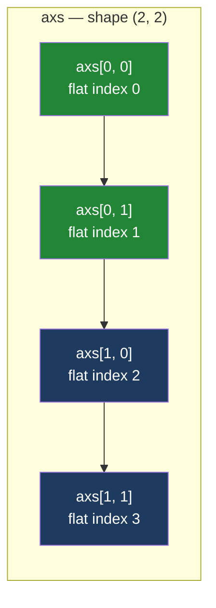

# 4.1 — A grid of axes

## One-line answer

`plt.subplots(2, 2)` hands back one figure and a **NumPy array** of four axes, and the *shape* of
that array — which is not always the shape you asked for — decides how every later line has to index
it.

---

## The story

Back to the sheet of paper on the fridge. Last time there were two boxes on it, one under the other,
drawn freehand as they were needed.

This time somebody wants all four aisles side by side, so they do the sensible thing before drawing
anything: they take a ruler, fold the sheet in half one way and in half the other way, and rule four
boxes — two along the top, two along the bottom. Now the boxes exist before there is anything in
them, and each one has an address. "Top row, left box" is dairy. "Bottom row, right box" is
household.

Then a week later somebody rules a *different* sheet, this time into a single row of three boxes,
because there were only three things to show. And here is the thing that actually happens in a shared
flat, every time. Nobody says "row one, box three" any more. They say "the third box". The row
stopped being worth mentioning the moment there was only one of them.

That is a completely reasonable thing for a person to do, and it is exactly what matplotlib does
too — and it is why a piece of code that worked on the four-box sheet falls over on the three-box
sheet.

---

## The idea in plain language

A **grid** here means panels laid out in rows and columns on one sheet. In the vocabulary of
[1.1](../01-the-two-objects/1.1-the-paper-and-the-frame.md), it is one **figure** — the sheet — that
holds several **axes** — the framed panels drawn on it.

`plt.subplots()` with no arguments makes one figure and one axes, which is what
[3.1](../03-the-object-api/3.1-fig-ax-subplots.md) taught. Give it two numbers and it makes a grid
instead: `plt.subplots(2, 2)` is two rows and two columns, in that order. Rows first, columns second.
That order is worth saying out loud once, because it is the reverse of how people describe a screen
("1920 by 1080" is width first) and it is the same order NumPy uses for a table.

The second thing it hands back is not a list. It is a **NumPy array** — the fixed-size block of
values you met on [Day 20, 1.1](../../../day-20-arrays-and-dtypes/parts/01-the-block/1.1-a-list-of-boxes.md) —
whose elements happen to be axes objects rather than numbers. That matters for one reason: an array
has a **shape**, which is the tuple of how many elements it has along each direction
([Day 20, 1.2](../../../day-20-arrays-and-dtypes/parts/01-the-block/1.2-shape-dtype-and-the-rest.md)).
The shape of the array you get back is what you index against, and it is the whole subject of this
part.

Because it is an array, you address a panel with the comma that a plain Python list cannot do:
`axs[0, 1]` is row 0, column 1 — top row, second panel
([Day 21, 1.2](../../../day-21-indexing-and-views/parts/01-one-element/1.2-the-comma-a-list-cannot-do.md)).
Counting starts at zero, so `axs[1, 1]` is the bottom-right panel of a two-by-two grid, not a
fifth one.

And now the trap. When you ask for a single row — `plt.subplots(1, 3)` — matplotlib drops the
row from the shape, exactly as the flatmate dropped it from the sentence. You get an array of shape
`(3,)`, so `axs[2]` is the third panel and `axs[0, 2]` is an error. When you ask for a single panel,
`plt.subplots(1, 1)`, it drops *both*, and you do not get an array at all — you get one bare axes.
That collapsing is called **squeezing**, and matplotlib does it by default because it is convenient
in a notebook and awful in a function. The switch that turns it off is `squeeze=False`, and it is the
single most useful keyword on this page.

---

## Why Setu needs it

- **[4.2](4.2-the-axes-you-forgot-to-use.md)** is about the panel in the grid that nothing was drawn
  on, which only exists because a grid has a fixed number of cells decided up front.
- **[4.3](4.3-shared-axes.md)** puts the flat's four aisles on four panels and shows that the four
  panels lie to you unless they are told to share a scale. You cannot reach that argument without a
  grid to put them in.
- **[4.4](4.4-constrained-layout.md)** is about the labels of one panel landing on top of another
  panel, which is a problem a single-panel figure does not have.
- **[6.1](../06-the-module/6.1-the-figures-module.md)** writes `new_figure(rows, cols)` for
  `src/setu/figures.py`, and it passes `squeeze=False` every single time so that the caller's
  indexing never depends on how many rows were asked for. This part is why that line is there.
- **Day 41** closes Phase 5 with an eight-chart figure pack. Eight charts is one figure and a grid of
  eight axes, so the phase gate is literally an exercise in this part.

---

## The mechanism

Start with the four-box sheet and ask the array what it is.

```python
import matplotlib

matplotlib.use("Agg")
import matplotlib.pyplot as plt

AISLES = ["dairy", "bakery", "produce", "household"]
TOTALS = [21.85, 9.80, 27.00, 13.80]

fig, axs = plt.subplots(2, 2, figsize=(8, 6))
print("type(fig) :", type(fig))
print("type(axs) :", type(axs))
print("axs.shape :", axs.shape)
print("axs.dtype :", axs.dtype)
print("axs.size  :", axs.size)
print("fig.axes  :", len(fig.axes))
print("same obj  :", axs[0, 0] is fig.axes[0])
```

**Line by line:**

- `matplotlib.use("Agg")` before `import matplotlib.pyplot` picks the **backend**, the piece of code
  that turns a figure into pixels. `"Agg"` writes image files and never opens a window.
  [5.1](../05-getting-it-out/5.1-backends-and-the-script-with-no-window.md) is that choice in full;
  every snippet in this day opens with these two lines.
- `plt.subplots(2, 2, ...)` — **rows first, columns second**. Two rows, two columns, four panels.
  Both numbers are positional here, which is how nearly all real code writes it; `nrows=2, ncols=2`
  is the same call spelled out.
- `figsize=(8, 6)` is the size of the **sheet**, in inches, width first. It is not per panel — four
  panels on an eight-by-six sheet are each roughly four by three. Grids need bigger sheets than
  single charts, and forgetting that is the commonest reason a four-panel figure looks cramped.
- `type(axs)` is printed rather than assumed, because "it returns a list of axes" is the sentence
  almost everybody says and it is wrong. It is a NumPy array.
- `axs.dtype` is the kind of thing stored in each slot. For a numeric array this would be something
  like `float64`; here it is `object`, meaning "arbitrary Python objects, held by reference". That is
  why an array of axes is possible at all.
- `axs.size` is the total number of elements — four — regardless of how they are arranged.
- `fig.axes` is the figure's own list of its panels, which existed before this part and is a plain
  list. There are now two ways to reach the same four objects.
- `axs[0, 0] is fig.axes[0]` uses `is`, which compares identity rather than equality. `True` proves
  the array holds the *same* objects the figure holds, not copies of them.

```text
type(fig) : <class 'matplotlib.figure.Figure'>
type(axs) : <class 'numpy.ndarray'>
axs.shape : (2, 2)
axs.dtype : object
axs.size  : 4
fig.axes  : 4
same obj  : True
```

Now the shapes, which is the part that bites. Ask for five different grids and print what comes back.

```python
for rows, cols in [(2, 2), (1, 3), (3, 1), (1, 1), (2, 3)]:
    fig, axs = plt.subplots(rows, cols)
    print(
        f"subplots({rows}, {cols}) -> {type(axs).__name__:8s} shape={getattr(axs, 'shape', None)}"
    )
    plt.close(fig)
```

**Line by line:**

- The loop asks for the five grid shapes a person actually writes: a square, one row, one column, one
  panel, and a rectangle.
- `type(axs).__name__` prints just the class name — `ndarray` or `Axes` — because the full
  `<class '...'>` form is too wide to compare five of at a glance.
- `getattr(axs, "shape", None)` asks for the shape **without assuming there is one**. A bare
  `axs.shape` would crash on the `(1, 1)` row, and crashing is exactly the thing this loop is trying
  to show you calmly.
- `plt.close(fig)` releases each figure as soon as it has been measured. Twenty open figures earn a
  warning from matplotlib and every open figure holds memory —
  [5.4](../05-getting-it-out/5.4-the-figures-you-never-closed.md) measures both. A loop that makes
  figures is the exact shape of code that leaks them.

```text
subplots(2, 2) -> ndarray  shape=(2, 2)
subplots(1, 3) -> ndarray  shape=(3,)
subplots(3, 1) -> ndarray  shape=(3,)
subplots(1, 1) -> Axes     shape=None
subplots(2, 3) -> ndarray  shape=(2, 3)
```

**Read the middle three rows slowly.** One row of three and one column of three both come back as
shape `(3,)` — the same shape, from two visually opposite layouts. And `subplots(1, 1)` is not an
array at all. Three different return types from one function, decided by the arguments.

Here is the switch that removes all of it.

```python
for rows, cols in [(2, 2), (1, 3), (3, 1), (1, 1)]:
    fig, axs = plt.subplots(rows, cols, squeeze=False)
    print(f"subplots({rows}, {cols}, squeeze=False) -> {type(axs).__name__:8s} shape={axs.shape}")
    plt.close(fig)
```

**Line by line:**

- `squeeze=False` tells matplotlib not to drop any length-one direction from the array. The result is
  **always** two-dimensional, so `axs[row, col]` is always the right way to index it.
- `axs.shape` can now be printed directly, with no `getattr` guard, because there is no case left
  where the array is not an array. That simplification in the printing code is the same
  simplification you get in real code.

```text
subplots(2, 2, squeeze=False) -> ndarray  shape=(2, 2)
subplots(1, 3, squeeze=False) -> ndarray  shape=(1, 3)
subplots(3, 1, squeeze=False) -> ndarray  shape=(3, 1)
subplots(1, 1, squeeze=False) -> ndarray  shape=(1, 1)
```

One row is `(1, 3)`. One column is `(3, 1)`. One panel is `(1, 1)`. The layout is now readable from
the shape, which it was not before.

The other way to reach every panel is to stop caring about the grid entirely.

```python
fig, axs = plt.subplots(2, 2, figsize=(8, 6))
print("type(axs.flat):", type(axs.flat))
print("count via flat:", len([ax for ax in axs.flat]))
print("ravel shape   :", axs.ravel().shape)
for ax in axs.flat:
    ax.bar(AISLES, TOTALS)
plt.close(fig)
```

**Line by line:**

- `axs.flat` is a **flat iterator**: it walks every element of the array in order and hands them out
  one at a time, ignoring the rows and columns. It is not a copy and not a list; the printed type is
  `numpy.flatiter`.
- The order it walks in is **row-major** — the whole of row 0 left to right, then the whole of row 1.
  That is the same order NumPy reads any array in, and it is the same order a person reads a page in.
- `axs.ravel()` is the related move that produces a one-dimensional *array* instead of an iterator,
  which you want when you need to slice or index the result.
  [Day 22, 2.4](../../../day-22-broadcasting-and-shape/parts/02-reshape/2.4-ravel-and-flatten.md)
  is `ravel` against `flatten` in full, including which one copies.
- `for ax in axs.flat:` is the loop you write when every panel gets the same treatment — a label, a
  grid line, a font size — and the grid arrangement is irrelevant to that job.
- Note what `axs.flat` does **not** solve: it fails on the `(1, 1)` case for the same reason `axs[0]`
  does, because a bare `Axes` has no `.flat`. `squeeze=False` fixes that; `.flat` alone does not.

```text
type(axs.flat): <class 'numpy.flatiter'>
count via flat: 4
ravel shape   : (4,)
```

The two addressing schemes, side by side:



**The arrows are the flat order.** Along the top row first, then down and along the bottom row. Use
`axs[row, col]` when the position means something — "the totals go top-left" — and `axs.flat` when it
does not.

---

## When it breaks

**A function written for a square grid, called with one row:**

```text
$ uv run python -c "
import matplotlib
matplotlib.use('Agg')
import matplotlib.pyplot as plt
fig, axs = plt.subplots(1, 3)
axs[0, 0].bar(['dairy'], [21.85])
"
Traceback (most recent call last):
  File "<string>", line 6, in <module>
IndexError: too many indices for array: array is 1-dimensional, but 2 were indexed
```

**What it means.** The message is precise and it is telling the truth: the array really is
one-dimensional, because the single row was squeezed away. It is NumPy's error, not matplotlib's, so
it never mentions axes or figures — which is why it reads as a surprise. The smallest fix is
`axs[0]`. The fix that stops it coming back is `plt.subplots(1, 3, squeeze=False)` and leaving
`axs[0, 0]` exactly as written.

**The same function, called with one panel:**

```text
$ uv run python -c "
import matplotlib
matplotlib.use('Agg')
import matplotlib.pyplot as plt
fig, axs = plt.subplots(1, 1)
axs[0].bar(['dairy'], [21.85])
"
Traceback (most recent call last):
  File "<string>", line 6, in <module>
TypeError: 'Axes' object is not subscriptable
```

**What it means.** "Not subscriptable" means the object does not support the square brackets. This is
no longer an array with the wrong number of directions — it is not an array at all, so there is
nothing to index. Notice the error *class* changed too, from `IndexError` to `TypeError`. Code that
catches one will not catch the other, which is one more reason not to be in this situation.

**And the loop that assumed an array:**

```text
$ uv run python -c "
import matplotlib
matplotlib.use('Agg')
import matplotlib.pyplot as plt
fig, axs = plt.subplots(1, 1)
for ax in axs.flat:
    ax.set_title('x')
"
Traceback (most recent call last):
  File "<string>", line 6, in <module>
AttributeError: 'Axes' object has no attribute 'flat'
```

**What it means.** Three different exception types from one mistake, depending on how you happened to
write the line. All three disappear under `squeeze=False`, and none of them can be fixed by being
careful, because the caller chooses the grid and the function does not know what it will get.

---

## In production

**What a professional writes instead of the teaching version.** Two habits, and neither is optional
in shared code.

The first is that any function which builds a grid passes `squeeze=False`, so its return value has
one shape rule for every input.

```python
def new_figure(rows: int = 1, cols: int = 1, **kwargs):
    """A figure and a 2-D array of axes, whatever the grid."""
    return plt.subplots(rows, cols, squeeze=False, layout="constrained", **kwargs)


fig, axs = new_figure()
axs[0, 0].bar(AISLES, TOTALS)
plt.close(fig)
```

**Line by line:**

- `rows: int = 1, cols: int = 1` gives the common single-panel case a spelling that costs nothing,
  while keeping the grid available. The `int` annotations are type hints, which are notes for a
  reader and a checker rather than rules the interpreter enforces
  ([Day 19, 1.1](../../../day-19-typing-dataclasses-and-concurrency/parts/01-type-hints/1.1-a-hint-is-a-note.md)).
- `squeeze=False` is hard-coded, not exposed as a parameter. A caller who could turn it off would
  reintroduce exactly the three exceptions above, so this is a **policy**, not an option.
- `layout="constrained"` is the day's other default, and [4.4](4.4-constrained-layout.md) measures
  why. Putting it here means no caller has to remember it.
- `**kwargs` forwards `figsize`, `sharey` and anything else straight through, so the wrapper adds
  policy without removing reach.
- `axs[0, 0]` on a one-panel figure looks slightly odd the first time and never has to change again.
  That is the trade: one ugly index in the simple case, no crash in the general case.

This is the function [6.1](../06-the-module/6.1-the-figures-module.md) writes into
`src/setu/figures.py`, and the reason it is written there once rather than in every notebook.

The second habit is the one from [3.5](../03-the-object-api/3.5-the-ax-parameter.md): a drawing
function takes `ax` and returns it. Once every chart function has that shape, a grid is just a loop
that hands out panels, and nothing about the chart code knows or cares that it is in a grid.

**What degrades at scale.** Not speed, and this is worth knowing so you do not optimise the wrong
thing. Building one four-by-five grid of twenty bar charts and building twenty separate one-panel
figures, five times each and measured on this machine, came out at 0.4092 seconds and 0.484 seconds
per round — close enough that the grid is not a performance decision. What does degrade is
**readability at fixed size**: twenty panels on a sheet that is still eight inches by six gives each
panel under two inches, and tick labels do not shrink to match. The rule that follows is that
`figsize` grows with the grid, roughly a constant per panel, or the figure becomes unreadable while
every number in it stays correct.

**The failure that only appears with real data.** A reporting script drew one panel per region with
`plt.subplots(1, len(regions))`. It was written and tested with three regions. The month a customer
had exactly one region, the array collapsed to a bare `Axes`, `axs[0]` raised `TypeError`, and the
nightly report failed — for the smallest customer, in production, on a code path nobody had run. The
number of panels is **data**, and data reaches one eventually. `squeeze=False` is the one-line
defence, and a test that calls the function with `rows=1, cols=1` is how you find out you forgot it.

**The review comment a senior engineer leaves.** *"`plt.subplots(1, n)` where `n` comes from the
data — pass `squeeze=False` and index `axs[0, i]`. Otherwise this function has three different return
shapes and the caller has to know which one it got. Also please size the figure from the grid rather
than hard-coding `figsize=(8, 6)`; at `n=6` these panels are under an inch and a half wide."*

**The interview question.** *"What does `plt.subplots` return, and what is the catch?"* It returns a
tuple of the figure and the axes, and for a grid the second element is a NumPy object array of axes
rather than a list. The catch is `squeeze`: by default any length-one direction is dropped, so
`(1, 3)` becomes shape `(3,)` and `(1, 1)` becomes a bare `Axes` — three possible return shapes from
one function. The follow-up that separates people is *"so how do you write a function that takes a
grid size from the caller?"* — `squeeze=False`, always index with two subscripts, and iterate with
`axs.flat` when the arrangement does not matter.

---

## Check yourself

```bash
uv run --with 'matplotlib==3.11.1' python -c "
import matplotlib
matplotlib.use('Agg')
import matplotlib.pyplot as plt
for r, c in [(2, 2), (1, 3), (3, 1), (1, 1)]:
    fig, axs = plt.subplots(r, c)
    plain = getattr(axs, 'shape', 'not an array')
    fig2, axs2 = plt.subplots(r, c, squeeze=False)
    print(f'{r}x{c}: default -> {str(plain):14s} squeeze=False -> {axs2.shape}')
    plt.close(fig); plt.close(fig2)
"
```

Four lines. Three of them have a default shape that does not match the grid you asked for — find
those three and say, for each one, what happened to the missing number.

**Answer out loud, without scrolling up:**

> A colleague's function does `fig, axs = plt.subplots(1, n)` and then `axs[0, i]`. It raises for
> every `n`, but not always the same way: name the exception you get at `n = 1`, the different
> exception you get at `n = 3`, and the one keyword that makes the line correct for both.

---

**Next:** [4.2 — The axes you forgot to use](4.2-the-axes-you-forgot-to-use.md).
