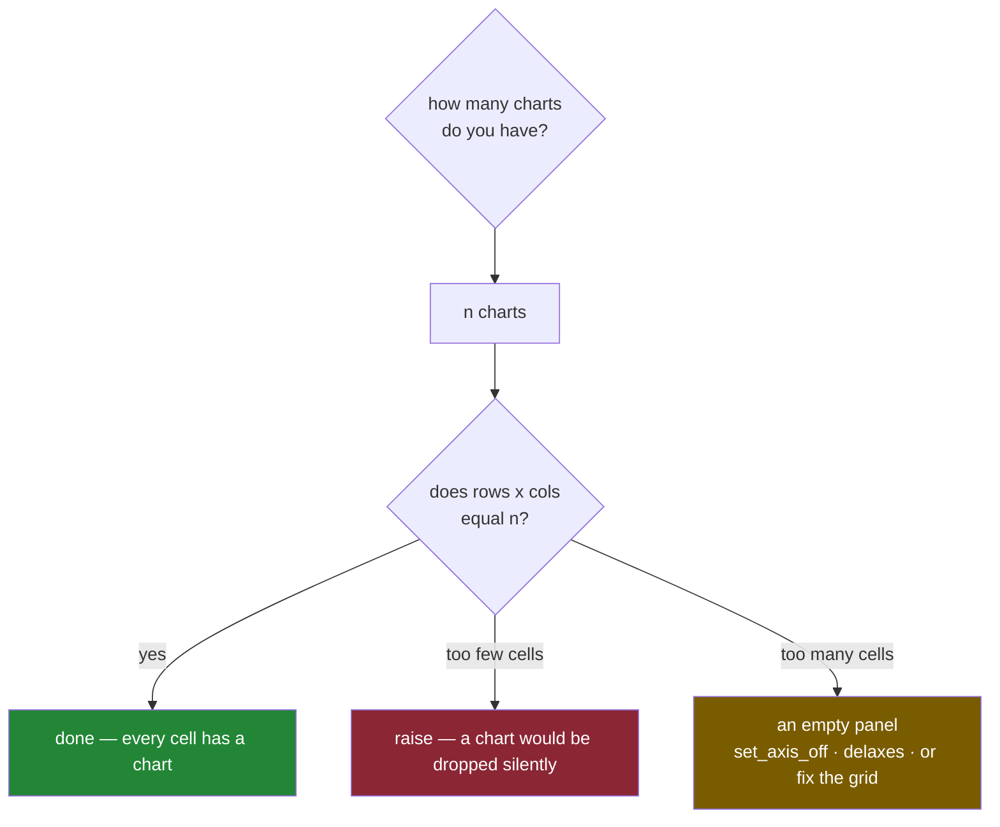

# 4.2 — The axes you forgot to use

## One-line answer

A panel you never drew on is not blank paper — it is a fully built, fully drawn empty chart with a
frame, ticks and a 0-to-1 scale, and the only real fix is to stop asking for a grid that is bigger
than the number of charts you have.

---

## The story

Somebody rules the fridge sheet into four boxes, because four is the number you get when you fold a
sheet twice and it is what everybody does without thinking.

Then they draw what the flat actually wanted to see. Box one: a bar for each aisle. Box two: the line
of weekly totals. Box three: the aisles again, lying on their side, because somebody said the names
were easier to read that way.

And then they stop, because that was all three of the things anybody had asked for.

The fourth box is still there. It has a ruled border, because it was ruled at the same time as the
others. Somebody walking past the fridge stops, looks at the empty box in the bottom-right corner,
and asks the question that empty boxes always get asked: *what was supposed to go there?* Nobody
knows. Nothing was supposed to go there. The sheet was folded twice out of habit, and habit made one
box too many.

---

## The idea in plain language

A grid has a fixed number of cells, chosen when you call `plt.subplots(rows, cols)`
([4.1](4.1-a-grid-of-axes.md)). Every one of those cells becomes a real **axes** — a framed panel on
the sheet, in the vocabulary of
[1.1](../01-the-two-objects/1.1-the-paper-and-the-frame.md) — at the moment the call returns, before
any of your drawing code runs.

That means an unused panel is not an absence. It is a fully constructed object that already owns a
frame, two axis lines with tick marks, a place for a title and a default scale. It draws all of that,
because drawing is what an axes does, and it has no way of knowing that you meant to leave it alone.
Everything visible in matplotlib is an **artist** — anything that can be drawn, from a bar to a tick
mark ([1.3](../01-the-two-objects/1.3-everything-is-an-artist.md)) — and an empty panel arrives with
ten of them already attached.

What it draws in that empty panel is worse than nothing, because it looks deliberate. With no data,
an axes falls back to its default limits of 0 to 1 on both directions, so the reader sees a neat
little box labelled 0.0, 0.2, 0.4, 0.6, 0.8, 1.0 in both directions. That is a chart of nothing,
drawn to look exactly like a chart of something.

There are three things you can do about it, and only one of them is a fix.

You can **hide the panel's furniture** with `ax.set_axis_off()`, which stops the frame and the ticks
being drawn but leaves the object on the figure. You can **remove the panel from the figure**
with `fig.delaxes(ax)`, which takes it out of the figure's list so nothing about it is drawn at all —
but leaves the hole where it was, because the other three panels keep the positions the grid gave
them. Or you can **ask for the right grid**, which is the fix, because the shape of the grid is a
decision about what the reader sees and not a default to be corrected afterwards.

---

## Why Setu needs it

- **[4.3](4.3-shared-axes.md)** puts the flat's four aisles on four panels — four charts, four cells,
  no leftover. It is the case where the grid was chosen from the data, and it reads differently from
  this one on purpose.
- **[4.4](4.4-constrained-layout.md)** measures how a layout engine sizes panels. An axes you
  removed is still a hole the engine leaves alone, which is the fact that makes `delaxes` a poor
  substitute for the right grid.
- **[6.1](../06-the-module/6.1-the-figures-module.md)** leaves you a `TODO(me)` for `panel_pack`,
  which must **refuse** a grid too small for the charts it was given. That refusal is the mirror of
  this part: too few cells is an error, too many is a silent embarrassment, and neither should be
  decided by accident.
- **Day 41** is an eight-chart figure pack. Eight charts fits a two-by-four or a four-by-two exactly;
  a three-by-three would leave one of these empty boxes on the phase gate itself.

---

## The mechanism

Three charts, four cells. Draw it and then interrogate every panel.

```python
import matplotlib

matplotlib.use("Agg")
import matplotlib.pyplot as plt

AISLES = ["dairy", "bakery", "produce", "household"]
TOTALS = [21.85, 9.80, 27.00, 13.80]
WEEKS = [1, 2, 3, 4]
WEEKLY = [17.20, 14.25, 22.00, 19.00]

fig, axs = plt.subplots(2, 2, figsize=(8, 6), layout="constrained")
axs[0, 0].bar(AISLES, TOTALS)
axs[0, 0].set_title("what each aisle cost")
axs[0, 1].plot(WEEKS, WEEKLY, marker="o")
axs[0, 1].set_title("what each week cost")
axs[1, 0].barh(AISLES, TOTALS)
axs[1, 0].set_title("the same, lying down")

print("children per panel:", [len(a.get_children()) for a in axs.flat])
print("empty panel xlim  :", axs[1, 1].get_xlim())
print("empty panel ylim  :", axs[1, 1].get_ylim())
print("empty bars, lines :", len(axs[1, 1].containers), len(axs[1, 1].lines))
```

**Line by line:**

- `plt.subplots(2, 2, ...)` creates **four** axes objects immediately. The next six lines touch three
  of them. Nothing anywhere tells matplotlib that the fourth was a mistake.
- `layout="constrained"` is the layout engine that sizes the panels so their labels do not collide;
  [4.4](4.4-constrained-layout.md) measures what it is doing. It is here so the printed output is
  about empty panels and not about overlapping text.
- `axs[0, 0]`, `axs[0, 1]`, `axs[1, 0]` are row-then-column addresses into the array from
  [4.1](4.1-a-grid-of-axes.md). Top-left, top-right, bottom-left. The one never named is `axs[1, 1]`.
- `marker="o"` puts a dot at each of the four weekly totals. A line with only four points reads as a
  trend that was measured continuously unless the actual measurements are marked.
- `ax.get_children()` returns every artist attached to that panel. Counting them is the cheapest way
  to ask "is there anything in this box", and the answer is going to be surprising.
- `axs[1, 1].get_xlim()` and `.get_ylim()` read back the panel's scale — the lowest and highest value
  its edges stand for. An empty panel still has one.
- `ax.containers` is the list of bar groups on a panel and `ax.lines` is the list of line artists.
  Both being zero is the honest statement that no data was drawn.

```text
children per panel: [14, 11, 14, 10]
empty panel xlim  : (np.float64(0.0), np.float64(1.0))
empty panel ylim  : (np.float64(0.0), np.float64(1.0))
empty bars, lines : 0 0
```

**Ten.** The empty panel has ten artists on it. That is the number worth staring at, because "empty"
turns out to mean "carrying ten drawable objects and a 0-to-1 scale on both directions". Here is what
those ten are, and where the other panels' extra artists come from.

```python
from collections import Counter

print("empty  :", Counter(type(c).__name__ for c in axs[1, 1].get_children()))
print("bars   :", Counter(type(c).__name__ for c in axs[0, 0].get_children()))
print("line   :", Counter(type(c).__name__ for c in axs[0, 1].get_children()))
```

**Line by line:**

- `Counter` from the standard library tallies how many of each thing there are. Counting the
  **class names** rather than the objects turns fourteen unreadable `repr`s into one readable line.
- `type(c).__name__` is the class name of each artist, which is the level of detail that answers
  "what is actually in this box".
- Comparing the empty panel against the two drawn ones is the point: the difference between the
  counts is exactly the data, and everything the counts have in common is furniture.

```text
empty  : Counter({'Spine': 4, 'Text': 3, 'XAxis': 1, 'YAxis': 1, 'Rectangle': 1})
bars   : Counter({'Rectangle': 5, 'Spine': 4, 'Text': 3, 'XAxis': 1, 'YAxis': 1})
line   : Counter({'Spine': 4, 'Text': 3, 'Line2D': 1, 'XAxis': 1, 'YAxis': 1, 'Rectangle': 1})
```

The ten in the empty panel are four **spines** (the four edges of the box), three **text** artists
(the title slot and the two axis label slots, empty but present), the **XAxis** and **YAxis** objects
that own the tick marks, and one **Rectangle**, which is the panel's background patch. The bar panel
has fourteen because four of its five rectangles are the bars; the line panel has eleven because its
one extra artist is a `Line2D`. Nothing in the empty panel is a mistake — it is a complete chart with
no data in it.

Saved to a file, the bottom-right corner is a clean empty box with `0.0` through `1.0` marked along
both edges, sitting next to three real charts, looking for all the world like a fourth chart whose
data failed to load.

Now the two repairs, weakest first.

```python
axs[1, 1].set_axis_off()
print("children after off:", [len(a.get_children()) for a in axs.flat])
print("axis drawn?       :", axs[1, 1].axison)
print("still in fig.axes :", len(fig.axes))

fig.delaxes(axs[1, 1])
print("fig.axes now      :", len(fig.axes))
print("axs still holds it:", axs.shape, type(axs[1, 1]).__name__)
```

**Line by line:**

- `ax.set_axis_off()` turns off the drawing of the frame and both axis objects. It is cosmetic, and
  the printed child count proves it: the artists are all still attached, they are simply not
  rendered.
- `ax.axison` is the flag that call flipped. Reading it back is how you check the state rather than
  trusting that the call did something.
- `len(fig.axes)` is unchanged at four, because `set_axis_off` never told the figure anything. The
  panel is invisible and still owns its cell of the grid.
- `fig.delaxes(ax)` removes the axes from the figure's own list. This is the stronger move: the
  figure now has three panels and will render three.
- `axs[1, 1]` **still returns the axes object** after `delaxes`, because `axs` is a NumPy array that
  was filled in when `subplots` returned and has no idea the figure changed. That mismatch between
  the array and the figure is the trap in the next section.

```text
children after off: [14, 11, 14, 10]
axis drawn?       : False
still in fig.axes : 4
fig.axes now      : 3
axs still holds it: (2, 2) Axes
```

And the fix that is actually a fix — count the charts, then choose the grid.

```python
fig2, axs2 = plt.subplots(1, 3, figsize=(9, 3), layout="constrained")
axs2[0].bar(AISLES, TOTALS)
axs2[1].plot(WEEKS, WEEKLY, marker="o")
axs2[2].barh(AISLES, TOTALS)
print("children per panel:", [len(a.get_children()) for a in axs2.flat])
plt.close("all")
```

**Line by line:**

- `plt.subplots(1, 3, ...)` asks for exactly three cells, because there are exactly three charts.
  There is no leftover to hide, remove or explain.
- `figsize=(9, 3)` is three inches of width per panel, which keeps each panel roughly the shape it
  had in the two-by-two version. The sheet is sized from the grid, not left at a default.
- `axs2[0]`, `axs2[1]`, `axs2[2]` are single subscripts, because a one-row grid squeezes to shape
  `(3,)` ([4.1](4.1-a-grid-of-axes.md)). This is precisely the inconsistency `squeeze=False` removes,
  and it is why the module in [6.1](../06-the-module/6.1-the-figures-module.md) always passes it.
- `plt.close("all")` releases every open figure. Both of the figures on this page are still open
  otherwise, and [5.4](../05-getting-it-out/5.4-the-figures-you-never-closed.md) shows what that
  costs when the count grows.

```text
children per panel: [14, 11, 14]
```

Three panels, three counts, no ten.



**The two wrong branches are not symmetrical.** Too few cells must raise, because the alternative is
a chart that quietly never appears. Too many cells only embarrasses you.

---

## When it breaks

**Removing the same panel twice:**

```text
$ uv run python -c "
import matplotlib
matplotlib.use('Agg')
import matplotlib.pyplot as plt
fig, axs = plt.subplots(2, 2)
fig.delaxes(axs[1, 1])
fig.delaxes(axs[1, 1])
"
Traceback (most recent call last):
  File "<string>", line 7, in <module>
  File ".venv\Lib\site-packages\matplotlib\figure.py", line 934, in delaxes
    self._remove_axes(ax, owners=[self._axstack, self._localaxes])
  File ".venv\Lib\site-packages\matplotlib\figure.py", line 949, in _remove_axes
    owner.remove(ax)
  File ".venv\Lib\site-packages\matplotlib\figure.py", line 89, in remove
    self._axes.pop(a)
KeyError: <Axes: >
```

(The three library frames are printed with their full path to the project's virtual environment; only
the part after `.venv` is shown here, because that part is the same on every machine.)

**What it means.** `KeyError` is the error a dictionary raises when the key is not there, and the
last frame shows exactly that: the figure keeps its panels in a mapping and the second `delaxes` went
looking for one that had already been taken out. The repeated `repr` — `<Axes: >`, with nothing after
the colon — is matplotlib telling you the panel has no title, which is not much help in a traceback.
This happens in real code when a cleanup loop runs over `axs.flat` twice, or when a cell in a
notebook is re-run. The fix is to decide the grid up front rather than to prune it afterwards.

**And the failure that raises nothing at all:**

```text
$ uv run python -c "
import matplotlib
matplotlib.use('Agg')
import matplotlib.pyplot as plt
fig, axs = plt.subplots(2, 2)
fig.delaxes(axs[1, 1])
axs[1, 1].bar(['dairy', 'bakery'], [21.85, 9.80])
axs[1, 1].set_title('this will not appear')
print('no error raised')
print('fig.axes           :', len(fig.axes))
print('title on the object:', repr(axs[1, 1].get_title()))
print('bars on the object :', len(axs[1, 1].containers[0]))
"
no error raised
fig.axes           : 3
title on the object: 'this will not appear'
bars on the object : 2
```

**What it means.** The panel object is alive. It accepted the bars, it accepted the title, and it
will report both back to you honestly for as long as you keep asking. It is simply not on the figure
any more, so none of it is rendered and the saved file has three panels. This is the dangerous half
of `delaxes`: `axs` and `fig.axes` have disagreed since the removal, and only one of them is what
gets drawn. A test that asserts on the axes object passes; the picture is wrong. That is exactly the
class of bug [6.2](../06-the-module/6.2-testing-a-chart-without-looking.md) is written to catch, by
asserting `len(fig.axes)` rather than trusting the array you were handed.

---

## In production

**What a professional writes instead of the teaching version.** They never hard-code the grid. The
number of charts is data, so the grid is computed from it, and the sheet is sized from the grid:

```python
import math


def grid_for(count: int, cols: int = 2):
    """A figure whose grid fits exactly `count` charts, and the axes in drawing order."""
    if count < 1:
        raise ValueError(f"cannot build a figure for {count} charts")
    rows = math.ceil(count / cols)
    fig, axs = plt.subplots(
        rows,
        cols,
        figsize=(4.0 * cols, 3.0 * rows),
        squeeze=False,
        layout="constrained",
    )
    panels = list(axs.flat)
    for spare in panels[count:]:
        spare.set_axis_off()
    return fig, panels[:count]


fig, panels = grid_for(3)
print("cells:", len(fig.axes), "panels handed back:", len(panels))
plt.close(fig)
```

**Line by line:**

- `count < 1` raises immediately. A figure with zero panels is almost always an empty result set that
  should have been reported, not drawn, and finding that out at the call site is cheaper than finding
  it in the saved PNG.
- `math.ceil(count / cols)` is the integer division that rounds **up**. Seven charts in two columns
  needs four rows, and `7 // 2` would give three and silently lose the last chart — the "too few
  cells" branch of the diagram, which is the one that must never happen quietly.
- `figsize=(4.0 * cols, 3.0 * rows)` grows the sheet with the grid, four inches wide and three inches
  tall per panel. A fixed `figsize` is the reason large grids look cramped.
- `squeeze=False` guarantees `axs` is two-dimensional whatever `rows` and `cols` came out as
  ([4.1](4.1-a-grid-of-axes.md)), which is what makes the next line safe.
- `list(axs.flat)` flattens the grid into drawing order — left to right, then down — so the caller
  never has to think in rows and columns.
- `panels[count:]` is every cell past the last chart. `set_axis_off()` on each of them is the
  cosmetic repair, used here deliberately: the cell keeps its space so the remaining panels stay the
  size their neighbours are, and nothing is drawn in it.
- Returning `panels[:count]` rather than the whole array is the important part. **The caller cannot
  accidentally draw into a spare cell, because it was never handed one.** Making the wrong thing
  unreachable beats documenting that it is wrong.

Note what this function does *not* do: it does not call `delaxes`. Removing a panel leaves a ragged
hole that the layout engine treats as occupied space, so the neighbours do not expand to fill it. If
the spare cell must genuinely vanish, the honest answer is a different grid or a `GridSpec` where the
last chart spans two columns, not a deleted axes.

**What degrades with real data.** Dashboards are built from a list that changes. A panel per region,
a panel per model, a panel per warehouse — and the day the list has seven entries instead of eight,
a hard-coded two-by-four grid grows an empty box in the corner of a report that goes to people
outside the team. Nobody reads it as "we had seven this month". They read it as "a chart is broken",
and you get the email. The grid must be a function of `len(things)` or it will eventually be wrong.

**The review comment a senior engineer leaves.** *"`plt.subplots(2, 2)` with three `ax` calls under
it — the fourth panel renders as an empty 0-to-1 box. Either compute the grid from the number of
charts or turn the spare off explicitly, and say in the code which one you meant. Please do not use
`delaxes` here; it leaves the hole and the neighbours will not resize."*

**The interview question.** *"You have five charts and you put them on a three-by-two grid. What does
the reader see in the sixth cell?"* A complete empty axes: frame, tick marks and a default 0-to-1
scale on both directions, which looks like a chart that failed rather than a cell that was never
used. The follow-ups are the ones that matter: `set_axis_off` hides it but keeps the space,
`delaxes` removes it but leaves the gap and desynchronises the axes array you were handed, and the
real answer is to derive the grid from the number of charts and to raise when there are more charts
than cells.

---

## Check yourself

```bash
uv run --with 'matplotlib==3.11.1' python -c "
import matplotlib
matplotlib.use('Agg')
import matplotlib.pyplot as plt
fig, axs = plt.subplots(2, 2, layout='constrained')
axs[0, 0].bar(['dairy', 'bakery', 'produce', 'household'], [21.85, 9.80, 27.00, 13.80])
axs[0, 1].plot([1, 2, 3, 4], [17.20, 14.25, 22.00, 19.00], marker='o')
axs[1, 0].barh(['dairy', 'bakery', 'produce', 'household'], [21.85, 9.80, 27.00, 13.80])
print('artists per panel:', [len(a.get_children()) for a in axs.flat])
print('empty panel scale:', axs[1, 1].get_xlim(), axs[1, 1].get_ylim())
axs[1, 1].set_axis_off()
print('after set_axis_off:', [len(a.get_children()) for a in axs.flat])
print('drawn?           :', axs[1, 1].axison)
plt.close(fig)
"
```

The artist counts do not change when you turn the axis off. Say why that is the correct behaviour
rather than a bug.

**Answer out loud, without scrolling up:**

> You have three charts and a two-by-two grid. Name the three things you can do about the fourth
> cell, say which one leaves the figure and the axes array disagreeing with each other, and say which
> one you would defend in a review.

---

**Next:** [4.3 — Shared axes, and the comparison that becomes possible](4.3-shared-axes.md).
