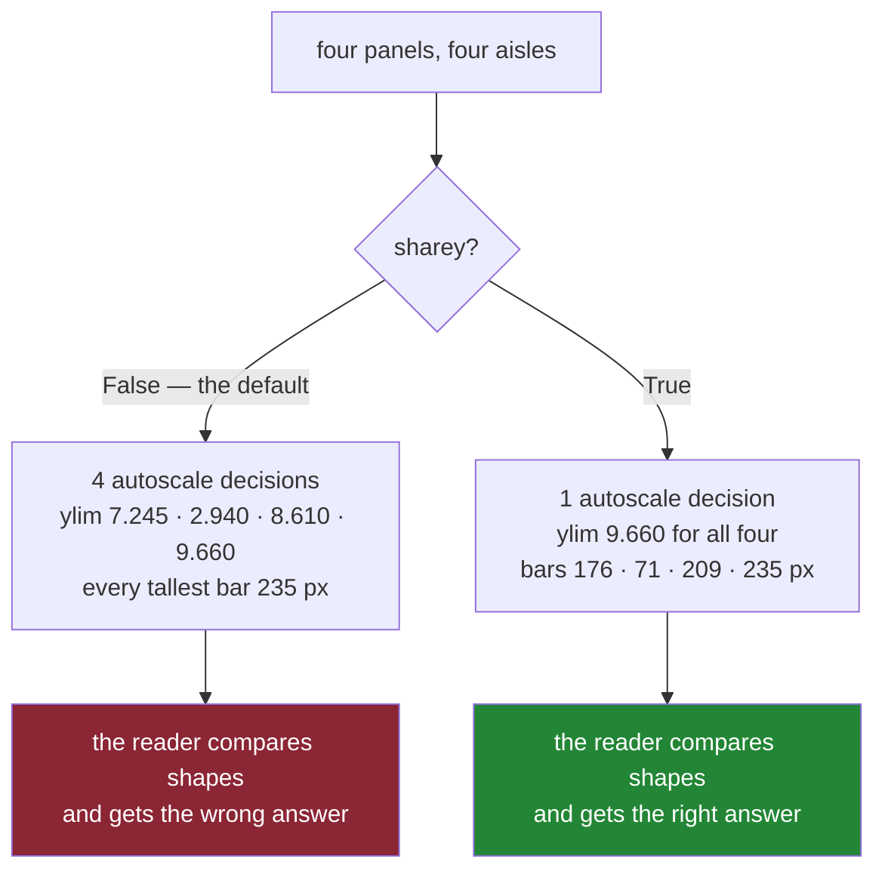

# 4.3 — Shared axes, and the comparison that becomes possible

## One-line answer

`sharey=True` forces every panel in the grid onto one scale, and on a sheet of side-by-side panels
that is not a tidying-up option — it is the difference between a picture that answers "which aisle
cost the most" and a picture that answers it wrongly.

---

## The story

The flat decides the single fridge sheet is not enough. They want one panel per aisle, so you can see
how each one moved week by week: dairy, bakery, produce, household, four little charts in a row.

Somebody draws them. Four boxes, and inside each box four bars, one per week. And because each box is
the same size and each set of bars is drawn to fill its box nicely, every one of the four little
charts ends up with a tall bar reaching almost to the top of its box.

Then somebody stands in front of the fridge and reads it the way people read pictures — by looking at
the shapes.

Bakery's tallest bar is the same height as produce's tallest bar. Bakery's bars are all nearly the
same height as each other, and so are produce's. So bakery and produce look like the same story.

They are not remotely the same story. Bakery's biggest week was two pounds eighty. Produce's biggest
week was eight pounds twenty — three times as much. The bars are the same height because each box was
drawn to fit its own numbers, and the little numbers up the left-hand edge of each box, which would
have said so, are different in every box and nobody read them.

Nobody made a mistake. Everybody drew each box correctly, and the sheet as a whole still lies.

---

## The idea in plain language

Every axes has **limits** — the lowest and highest value its bottom and top edges stand for. If you
do not set them, matplotlib picks them for you from the data in that panel, with a little padding, so
that whatever you drew fills the space nicely. That behaviour is called **autoscaling**, and on a
single chart it is exactly right.

On a grid it is a trap, because autoscaling happens **per panel**. Four panels, four independent
decisions, four different scales — and the reader, who is comparing the pictures rather than reading
the numbers, has no way to know. A bar drawn to the top of a panel whose top means 2.94 looks
identical to a bar drawn to the top of a panel whose top means 9.66.

**Sharing** is matplotlib's answer. `plt.subplots(1, 4, sharey=True)` links the vertical scales of
all four panels into one group. Autoscaling still happens, but it now runs once for the group and
uses the widest range any member needs, so every panel gets the same limits. From then on the panels
are genuinely comparable: the same height means the same number, everywhere on the sheet.

`sharex=True` does the same for the horizontal scale. Both accept `"row"` and `"col"` as well as
`True`, which link only within a row or only within a column.

Sharing does one extra thing that you will notice immediately and should expect: it **hides the
repeated tick labels**. If all four panels have the same numbers up the side, printing them four
times is noise, so matplotlib prints them once, on the leftmost panel. With `sharex=True` the numbers
along the bottom are printed only on the bottom row. That is not cosmetic tidying happening by
coincidence — it is matplotlib telling you the scales are the same, in the picture itself.

One consequence follows from "linked", and it surprises people: because the panels share one scale,
setting the limits on any one of them sets them on all of them. There is one scale object, not four
that are kept in step.

The word "axes" here still means one framed panel, and the word "axis" means the horizontal or
vertical line with the ticks on it. If those two are still blurred, [1.2](../01-the-two-objects/1.2-axes-is-not-axis.md)
is the part that untangles them, and this page needs the distinction: `sharey` shares an **axis**
between **axes**.

---

## Why Setu needs it

- **[4.4](4.4-constrained-layout.md)** is the layout engine that decides how much room the labels
  need. Sharing removes three quarters of the tick labels on a four-panel row, which changes that
  calculation, and the two settings are almost always written on the same line.
- **[6.1](../06-the-module/6.1-the-figures-module.md)** builds `new_figure(rows, cols, **kwargs)`,
  and `sharey=True` is one of the keyword arguments that has to reach `plt.subplots` untouched. This
  part is why that pass-through exists.
- **[6.2](../06-the-module/6.2-testing-a-chart-without-looking.md)** asserts `ax.get_ylim()[0] == 0`
  on a bar chart, because a bar chart whose baseline is not zero misstates the ratios between its
  bars. The assertion in this part is the neighbouring one: on a grid of comparable panels, every
  `get_ylim()` must be equal.
- **Day 37** takes this further into "the bar that lied" — the family of chart choices that are
  wrong rather than ugly. Unshared small multiples is the first member of that family you meet.
- **Day 41**, the phase gate, is eight charts that must be legible in greyscale and safe for
  colour-blind readers. A pack of panels on eight different invisible scales fails that gate for a
  reason no colour choice can repair.

---

## The mechanism

The flat's month, broken out per aisle. Four panels, drawn twice — once with the panels independent,
once with them sharing — and then measured rather than looked at.

```python
import matplotlib

matplotlib.use("Agg")
import matplotlib.pyplot as plt

WEEKS = [1, 2, 3, 4]
BY_AISLE = {
    "dairy": [4.60, 5.75, 4.60, 6.90],
    "bakery": [2.80, 1.40, 2.80, 2.80],
    "produce": [6.30, 7.10, 5.40, 8.20],
    "household": [3.50, 0.00, 9.20, 1.10],
}


def draw(share):
    fig, axs = plt.subplots(
        1,
        4,
        figsize=(10, 3),
        layout="constrained",
        sharey=share,
        sharex=share,
    )
    for ax, (aisle, spend) in zip(axs.flat, BY_AISLE.items(), strict=True):
        ax.bar(WEEKS, spend)
        ax.set_title(aisle)
    fig.canvas.draw()
    return fig, axs
```

**Line by line:**

- `BY_AISLE` is the same twenty numbers from the story, split by aisle instead of summed. Dairy's four
  weeks add to 21.85, bakery's to 9.80, produce's to 27.00 and household's to 13.80 — the totals
  charted on the earlier pages of this day.
- `def draw(share)` takes the sharing setting as a parameter so the two versions differ in **exactly
  one value** and nothing else. Comparing two hand-written blocks would leave you wondering which
  difference caused what.
- `sharey=share, sharex=share` — `share` is `False` or `True`. `False` is the default and is written
  out here so the two calls are visibly the same call.
- `zip(axs.flat, BY_AISLE.items(), strict=True)` walks the panels and the aisles together. `strict=True`
  makes `zip` raise if the two run out at different points, which is how you find out that the grid
  and the data disagree instead of silently drawing three of four aisles.
- `ax.bar(WEEKS, spend)` puts week numbers along the bottom and pounds up the side, on this panel
  only.
- `fig.canvas.draw()` forces the figure to be rendered now. Nothing on the following pages has a
  **position in pixels** until it has been drawn once — layout and autoscaling are lazy — so without
  this line every measurement below would be of a provisional layout rather than the real one.
- Returning both `fig` and `axs` keeps the caller able to measure the panels and to close the figure.

Now run it both ways and read the numbers off the panels.

```python
for share in (False, True):
    fig, axs = draw(share)
    print(f"sharey={share}")
    for ax, aisle in zip(axs.flat, BY_AISLE, strict=True):
        low, high = ax.get_ylim()
        tallest = max(bar.get_window_extent().height for bar in ax.containers[0])
        print(f"  {aisle:10s} ylim=({low:.3f}, {high:.3f})  tallest bar = {tallest:.1f} px")
    print("  y numbers printed:", [len(a.get_yticklabels()) for a in axs.flat])
    plt.close(fig)
```

**Line by line:**

- `ax.get_ylim()` returns the pair of numbers the panel's bottom and top edges stand for. This is the
  scale, read back rather than assumed.
- `ax.containers[0]` is the group of bars that `ax.bar` created — the container of rectangles. There
  is one group per `bar` call, so index zero is the only one here.
- `bar.get_window_extent()` gives an artist's bounding box **in pixels on the rendered figure**. This
  is the measurement that matters, because pixels are what the reader's eye actually compares.
- `.height` on that box is how tall the bar is on the page, in pixels. Taking the `max` gives the
  tallest bar in the panel, which is the one the reader anchors on.
- `f"{low:.3f}"` formats to three decimal places so the four scales line up in the output and can be
  compared by eye.
- `len(a.get_yticklabels())` counts the tick labels matplotlib decided to put up the side of each
  panel. It is the cheapest evidence for the "repeated labels are hidden" claim.
- `plt.close(fig)` after each version, because this loop builds figures and a loop that builds
  figures leaks them otherwise
  ([5.4](../05-getting-it-out/5.4-the-figures-you-never-closed.md)).

```text
sharey=False
  dairy      ylim=(0.000, 7.245)  tallest bar = 235.0 px
  bakery     ylim=(0.000, 2.940)  tallest bar = 235.0 px
  produce    ylim=(0.000, 8.610)  tallest bar = 235.0 px
  household  ylim=(0.000, 9.660)  tallest bar = 235.0 px
  y numbers printed: [9, 7, 6, 6]
sharey=True
  dairy      ylim=(0.000, 9.660)  tallest bar = 176.2 px
  bakery     ylim=(0.000, 9.660)  tallest bar = 71.5 px
  produce    ylim=(0.000, 9.660)  tallest bar = 209.4 px
  household  ylim=(0.000, 9.660)  tallest bar = 235.0 px
  y numbers printed: [6, 0, 0, 0]
```

**Look at the unshared column of pixel heights.** Every one is 235.0. Bakery's best week — two pounds
eighty — is drawn exactly as tall as household's nine pounds twenty. That is not a rounding
coincidence or a rendering artefact; it is what "each panel scales itself to its own data" means, and
it is why the sheet on the fridge lied. The four `ylim` values are the mechanism, right there:
2.940 at the top of one box, 9.660 at the top of another.

**Now the shared column.** One `ylim` for everybody, 0 to 9.660, and four honest heights: 176.2,
71.5, 209.4, 235.0. Bakery is now visibly a third of household, because it is. That single keyword
changed the answer the picture gives.

The tick label counts tell the second half of the story. Unshared, all four panels print their own
numbers — nine, seven, six and six of them, all different scales, all sitting next to each other.
Shared, only the leftmost panel prints numbers; the other three print none, because repeating an
identical scale three times is noise.

The same thing happens along the bottom when you share the horizontal scale on a grid with rows:

```python
fig, axs = plt.subplots(2, 2, figsize=(7, 5), layout="constrained", sharex=True)
for ax, (aisle, spend) in zip(axs.flat, BY_AISLE.items(), strict=True):
    ax.bar(WEEKS, spend)
    ax.set_title(aisle)
fig.canvas.draw()
print("x numbers drawn:", [sum(t.get_visible() for t in a.get_xticklabels()) for a in axs.flat])
plt.close(fig)
```

**Line by line:**

- `plt.subplots(2, 2, ..., sharex=True)` links the horizontal scale of all four panels. On a
  two-by-two grid the interesting consequence is about rows, not columns.
- `t.get_visible()` returns `True` or `False` for each tick label. Summing booleans counts the
  visible ones, because `True` is one and `False` is zero.
- The result reads in flat order — top-left, top-right, bottom-left, bottom-right
  ([4.1](4.1-a-grid-of-axes.md)) — so it says which **row** kept its numbers.

```text
x numbers drawn: [0, 0, 6, 6]
```

The top row's week numbers are gone and the bottom row's are kept, which is the correct choice: on a
shared scale, the numbers belong once, at the outside edge of the grid.

The last thing to know is what "linked" costs you.

```python
fig, axs = draw(True)
axs[0].set_ylim(0, 20)
print("after axs[0].set_ylim(0, 20):", [tuple(a.get_ylim()) for a in axs.flat])
print("panels in the group        :", len(axs[0].get_shared_y_axes().get_siblings(axs[0])))
plt.close(fig)
```

**Line by line:**

- `axs[0].set_ylim(0, 20)` sets the vertical limits on the **first** panel only. That is what the line
  says and it is not what happens.
- `[tuple(a.get_ylim()) for a in axs.flat]` reads the limits back off all four. `tuple(...)` is only
  to make the printed line short enough to read.
- `get_shared_y_axes()` returns the group object, and `.get_siblings(ax)` lists every panel in that
  group including the one you asked about. Four means all four panels are one scale, which is the
  direct explanation of the line above it.

```text
after axs[0].set_ylim(0, 20): [(np.float64(0.0), np.float64(20.0)), (np.float64(0.0), np.float64(20.0)), (np.float64(0.0), np.float64(20.0)), (np.float64(0.0), np.float64(20.0))]
panels in the group        : 4
```

One call, four panels changed. That is not a bug, it is the definition of sharing — but it means
"just fix the scale on that one panel" is a request the grid cannot satisfy.



---

## When it breaks

**Sharing something that is already shared:**

```text
$ uv run python -c "
import matplotlib
matplotlib.use('Agg')
import matplotlib.pyplot as plt
fig, axs = plt.subplots(1, 3)
axs[1].sharey(axs[0])
print('first share ok')
axs[1].sharey(axs[2])
"
first share ok
Traceback (most recent call last):
  File "<string>", line 8, in <module>
  File ".venv\Lib\site-packages\matplotlib\axes\_base.py", line 1332, in sharey
    raise ValueError("y-axis is already shared")
ValueError: y-axis is already shared
```

**What it means.** `ax.sharey(other)` is the after-the-fact way to link two panels that were not
created linked, and a panel can only join one group. The second call tries to put `axs[1]` into a
second group and matplotlib refuses rather than silently picking one. The fix is almost always to
stop patching panels together afterwards and to pass `sharey=True` to `plt.subplots` instead, which
builds the whole group in one go and cannot get into this state.

**Misremembering the keyword's vocabulary:**

```text
$ uv run python -c "
import matplotlib
matplotlib.use('Agg')
import matplotlib.pyplot as plt
fig, axs = plt.subplots(2, 2, sharey='column')
"
Traceback (most recent call last):
  File "<string>", line 5, in <module>
  ...
  File ".venv\Lib\site-packages\matplotlib\_api\__init__.py", line 227, in check_in_list
    raise ValueError(list_suggestion_error_msg(key, val, values))
ValueError: 'column' is not a valid value for sharey. Supported values are 'all', 'row', 'col', 'none', False, True
```

**What it means.** This is one of the good errors: it names the parameter, quotes what you passed and
lists every value that would have worked. The accepted word is `"col"`, not `"column"`. `"row"` links
the panels across each row, `"col"` links them down each column, `"all"` is the same as `True` and
`"none"` is the same as `False`. Worth reading the list rather than guessing, because `sharey="row"`
on a grid of unrelated rows is a genuinely useful setting and `sharey="column"` is a crash.

**And the failure with no error at all.** The default. `plt.subplots(1, 4)` with no `sharey` raises
nothing, warns about nothing, and produces the four-panel sheet from the story with four different
invisible scales. Every measurement in this part exists because that failure is silent, and the only
way to catch it is to assert on `get_ylim()` — which is what
[6.2](../06-the-module/6.2-testing-a-chart-without-looking.md) does.

---

## In production

**What a professional writes instead of the teaching version.** The rule is short and it is about
meaning, not tidiness: **panels that show the same quantity share a scale; panels that show different
quantities must not.**

Four aisles measured in pounds is the same quantity four times, so `sharey=True` is required. A grid
whose first panel is pounds and whose second is a count of items is two different quantities, and
forcing them onto one scale would be nonsense — there, the honest move is a visible label on each
panel saying what its units are.

```python
def small_multiples(by_group, cols=2, ylabel="pounds spent"):
    """One panel per group, all on one shared scale, because they are one quantity."""
    rows = -(-len(by_group) // cols)
    fig, axs = plt.subplots(
        rows,
        cols,
        figsize=(4.0 * cols, 3.0 * rows),
        squeeze=False,
        sharey=True,
        sharex=True,
        layout="constrained",
    )
    panels = list(axs.flat)
    for ax, (name, values) in zip(panels, by_group.items(), strict=False):
        ax.bar(WEEKS, values)
        ax.set_title(name)
    for spare in panels[len(by_group) :]:
        spare.set_axis_off()
    axs[0, 0].set_ylim(bottom=0)
    fig.supylabel(ylabel)
    return fig, axs


fig, axs = small_multiples(BY_AISLE)
print("every panel's ylim:", {round(a.get_ylim()[1], 3) for a in axs.flat})
plt.close(fig)
```

**Line by line:**

- `-(-len(by_group) // cols)` is integer division rounding up, written without importing `math`. Four
  groups in two columns is two rows; five would be three. The grid comes from the data, which is
  [4.2](4.2-the-axes-you-forgot-to-use.md)'s rule.
- `squeeze=False` keeps `axs` two-dimensional whatever the grid works out to, so `axs[0, 0]` below is
  always valid ([4.1](4.1-a-grid-of-axes.md)).
- `sharey=True, sharex=True` are hard-coded, not parameters. This function's name is a promise that
  the panels are comparable, and a caller who could switch that off could break the promise.
- `strict=False` here, deliberately, because the panel list is longer than the data when the grid has
  spare cells. The two loops together are what makes that safe: the second one turns every unused
  panel off.
- `axs[0, 0].set_ylim(bottom=0)` pins the baseline at zero **after** the bars are drawn, so the
  autoscaled top is kept and only the bottom is fixed. Because the panels share a scale, setting it
  on one sets it on all four — the behaviour measured above, used on purpose. A bar chart that does
  not start at zero misstates every ratio in it, and
  [6.2](../06-the-module/6.2-testing-a-chart-without-looking.md) asserts exactly this.
- `fig.supylabel(ylabel)` writes one label down the side of the **whole figure** rather than one per
  panel. It is the figure-level counterpart of `ax.set_ylabel`, and it is the right call precisely
  because the scale is now shared: one scale deserves one label.
- The printed `set` of rounded upper limits collapses four values into however many distinct ones
  there are. A set of size one is the assertion "these panels are comparable", written as evidence.

```text
every panel's ylim: {np.float64(9.66)}
```

One value for four panels. That is the whole promise of the function, printed.

**What degrades with real data.** One outlier. Sharing means the group's scale is the widest member's
scale, so a single freak value — the month somebody bought a vacuum cleaner and household hit ninety
pounds — flattens all the other panels into a row of stubs. That is not a reason to unshare; the
picture would then be lying instead of cramped. It is a reason to reach for a log scale, to clip and
annotate the outlier, or to say in words that one panel is off the scale. Day 37 is where those
choices get made properly; the thing to carry from here is that **unsharing to make a chart look
better is choosing a wrong picture over an inconvenient one.**

**The failure that only appears at scale.** With a grid built from data, the number of panels grows,
and each new panel joins the shared group. Twenty regions sharing one vertical scale is correct and
also unreadable, because the tallest region sets the scale for all twenty. The professional answer is
to sort the panels by size and to break the grid into pages of comparable groups, not to give twenty
panels twenty scales. The comparison is the whole reason the panels are next to each other.

**The review comment a senior engineer leaves.** *"These four panels are all pounds per week and none
of them shares a y axis, so bakery and produce read as the same size. Add `sharey=True`, pin
`set_ylim(bottom=0)`, and use `fig.supylabel` instead of four identical `set_ylabel` calls. This is a
correctness fix, not a style one — I read this chart wrong before I read the numbers."*

**The interview question.** *"When would you set `sharey=True`, and when would that be wrong?"* Set it
whenever the panels show the same quantity and the reader is meant to compare them, which is what
small multiples are for — otherwise each panel autoscales to its own data and equal bar heights mean
different values. It is wrong when the panels show different quantities or different units, where one
scale is meaningless. The follow-up that separates people is *"what does sharing change apart from
the limits?"* — it hides the repeated tick labels on the inner panels, it makes `set_ylim` on any one
panel apply to the whole group, and it makes the group's scale hostage to its largest member.

---

## Check yourself

```bash
uv run --with 'matplotlib==3.11.1' python -c "
import matplotlib
matplotlib.use('Agg')
import matplotlib.pyplot as plt
BY_AISLE = {'dairy': [4.60, 5.75, 4.60, 6.90], 'bakery': [2.80, 1.40, 2.80, 2.80],
            'produce': [6.30, 7.10, 5.40, 8.20], 'household': [3.50, 0.00, 9.20, 1.10]}
for share in (False, True):
    fig, axs = plt.subplots(1, 4, figsize=(10, 3), layout='constrained', sharey=share)
    for ax, (aisle, spend) in zip(axs.flat, BY_AISLE.items(), strict=True):
        ax.bar([1, 2, 3, 4], spend)
    fig.canvas.draw()
    tops = [round(a.get_ylim()[1], 3) for a in axs.flat]
    px = [round(max(b.get_window_extent().height for b in a.containers[0]), 1) for a in axs.flat]
    print(f'sharey={share!s:5s} tops={tops}  tallest bars in px={px}')
    plt.close(fig)
"
```

Two lines out. In one of them the four pixel heights are identical while the four data values are
not — name the aisle that is most misrepresented by that line, and by roughly what factor.

**Answer out loud, without scrolling up:**

> Why is `sharey=True` a correctness setting rather than a cosmetic one? Then name the one thing
> sharing takes away from you, and the situation in which sharing would itself be the wrong choice.

---

**Next:** [4.4 — Constrained layout, and the label that overlapped](4.4-constrained-layout.md).
