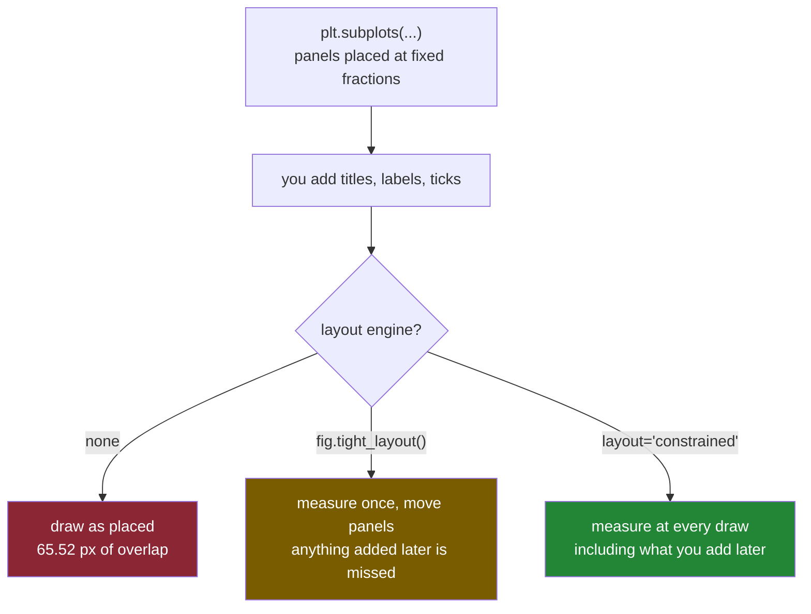

# 4.4 — Constrained layout, and the label that overlapped

## One-line answer

By default matplotlib puts the panels at fixed fractions of the sheet and only afterwards writes the
words, so on a grid the words land on each other — and `layout="constrained"` is the setting that
measures the words first and gives the panels whatever room is left over.

---

## The story

The fridge sheet again, now with four boxes ruled on it, two rows of two.

Somebody rules the boxes first, because that is the only sensible order: you cannot decide where to
put a box after you have already written inside it. Four equal boxes, evenly spaced, a finger's width
between them.

Then they fill them in. Each box gets a heading written above it — *what each aisle cost* — and the
aisle names written under the bottom edge, tilted, because "household" is too long to fit straight.
And down the left of each box, sideways, *pounds spent in the month*.

Look at the sheet now. The tilted aisle names under the top-left box run down past the box's bottom
edge and straight into the heading of the box below it. The heading of the bottom-left box has aisle
names written through it. The sideways label down the left of the right-hand column is sitting on top
of the right-hand edge of the left-hand column's numbers.

Nobody wrote anything in the wrong place. The finger's width between the boxes was decided before
anybody knew how long the words would be, and words turned out to need more than a finger.

---

## The idea in plain language

Matplotlib does exactly what the person with the ruler did, in exactly that order.

When you call `plt.subplots`, the panels are placed at **fixed fractions of the sheet**, taken from
settings that have nothing to do with your data or your labels. The left edge of the grid sits at
0.125 of the way across the sheet and the right edge at 0.9, whatever you are about to write there.
Only afterwards do the titles, the axis labels and the tick numbers get drawn — into whatever space
happens to be there, and over the top of anything already in it.

On a single panel this is almost always fine, because the default margins are generous enough for one
title and two labels. On a grid it fails, because a grid has interior edges: the bottom of the top
row is a finger's width from the top of the bottom row, and that gap has to hold the top row's tick
numbers **and** the bottom row's title.

A **layout engine** is code that runs at drawing time, measures how much room the text actually
needs, and then moves the panels. Matplotlib ships two.

**`fig.tight_layout()`** is the older one. You call it, it measures, it repositions the panels once,
and it is finished. Anything you add to the figure afterwards is not accounted for, because the
measurement has already happened.

**`layout="constrained"`** is the newer one. You pass it when you build the figure and it re-runs
every time the figure is drawn, so it sees everything on the figure, including whatever you added
after the panels. In matplotlib 3.11.1 the choice is spelled out in the library's own docstring for
`Figure.set_layout_engine`: `'constrained'` uses `ConstrainedLayoutEngine`, `'tight'` uses
`TightLayoutEngine`, and `'none'` removes the layout engine.

Neither is on by default. The two settings that would switch them on globally,
`figure.autolayout` and `figure.constrained_layout.use`, are both `False` out of the box, which is
why every figure you make starts life with the overlapping version.

Both engines share one hard limit that decides how you use them: **they never make the sheet bigger.
They only make the panels smaller.** Room for a longer label comes out of the chart, every time.

---

## Why Setu needs it

- **[5.2](../05-getting-it-out/5.2-savefig-dpi-and-bbox-inches.md)** is `savefig` with
  `bbox_inches="tight"`, which is a *different* mechanism that people confuse with this one. That one
  crops the saved file down to what was drawn; this one moves the panels inside a sheet of fixed
  size. Knowing which is which is the difference between a report whose pages are all the same size
  and one whose pages are not.
- **[6.1](../06-the-module/6.1-the-figures-module.md)** hard-codes `layout="constrained"` inside
  `new_figure`, so that no chart in `src/setu/figures.py` can be built without it. This part is the
  argument for that line.
- **Day 37** adds longer labels, rotated tick text and legends, all of which need more room than the
  default margins give. Every one of those additions is a new chance for this failure.
- **Day 41**, the phase gate, is an eight-panel figure pack that has to be legible in greyscale. A
  pack with the third row's titles written through the second row's tick numbers fails on legibility
  before anybody looks at the colours.

---

## The mechanism

Build the same crowded two-by-two grid three ways — no engine, `tight_layout`, and constrained — and
then measure the sheet instead of squinting at it.

```python
import matplotlib

matplotlib.use("Agg")
import matplotlib.pyplot as plt

AISLES = ["dairy", "bakery", "produce", "household"]
TOTALS = [21.85, 9.80, 27.00, 13.80]


def build(layout):
    fig, axs = plt.subplots(2, 2, figsize=(6, 4), layout=layout)
    for ax in axs.flat:
        ax.bar(AISLES, TOTALS)
        ax.set_title("what each aisle cost")
        ax.set_ylabel("pounds spent in the month")
        ax.set_xlabel("aisle")
        ax.tick_params(axis="x", labelrotation=45)
    return fig, axs
```

**Line by line:**

- `figsize=(6, 4)` is a deliberately ordinary sheet — six inches by four, matplotlib's default shape.
  At the default resolution of 100 dots per inch that is 600 pixels across, which is the number every
  measurement below is relative to.
- `layout=layout` is the parameter under test. `None` means no engine, `"constrained"` means the
  newer one. The `tight_layout` version is built with `None` and then repositioned by a separate
  call, because that is how it is actually used.
- Four panels each get a title, a y label, an x label and rotated tick text. That is not an unfair
  amount of text; it is what a real chart carries once it is labelled properly
  ([3.3](../03-the-object-api/3.3-the-setter-names.md) is where those setters came from).
- `ax.tick_params(axis="x", labelrotation=45)` tilts the aisle names, exactly as the person with the
  pen did, because "household" does not fit straight under a three-inch panel. Tilted text is taller
  than straight text, which is what turns a tight gap into an overlap.

Now measure two things on each version: where the y label ends up, and whether the top row's tick
text runs into the bottom row's title.

```python
for name, layout in [("none", None), ("tight", None), ("constrained", "constrained")]:
    fig, axs = build(layout)
    if name == "tight":
        fig.tight_layout()
    fig.canvas.draw()
    box = axs[0, 0].yaxis.label.get_window_extent()
    top_ticks = min(t.get_window_extent().y0 for t in axs[0, 0].get_xticklabels())
    bottom_title = axs[1, 0].title.get_window_extent().y1
    print(f"{name:12s} ylabel x0={box.x0:7.2f}  width={box.width:5.2f}")
    print(
        f"{'':12s} top row tick bottom={top_ticks:7.2f}  bottom row title top={bottom_title:7.2f}"
    )
    print(f"{'':12s} overlap = {max(0.0, bottom_title - top_ticks):.2f} px")
    plt.close(fig)
```

**Line by line:**

- `fig.tight_layout()` is called **after** the figure is fully built, because it measures once, at the
  moment you call it. Calling it before the labels exist would measure nothing.
- `fig.canvas.draw()` forces a render. Until a figure has been drawn, nothing on it has a position in
  pixels — the layout is lazy — so every measurement here would otherwise be of a provisional
  placement rather than the real one.
- `axs[0, 0].yaxis.label` is the y-axis label artist, the object `set_ylabel` wrote to. Reaching it
  through `yaxis` rather than `ax` is the reminder that the label belongs to the **axis**, not to the
  axes ([1.2](../01-the-two-objects/1.2-axes-is-not-axis.md)).
- `get_window_extent()` returns that artist's bounding box in pixels on the rendered figure. `x0` is
  its left edge measured from the left edge of the sheet, so a small `x0` means the panel was given
  more room.
- `min(t.get_window_extent().y0 for t in ...get_xticklabels())` finds the **lowest point** any of the
  top-left panel's tilted tick labels reaches. In matplotlib's pixel coordinates `y` grows upwards, so
  the smallest `y0` is the bottom of the lowest label.
- `axs[1, 0].title.get_window_extent().y1` is the **top** of the panel below's title.
- `bottom_title - top_ticks` is positive exactly when the title's top is above the tick text's
  bottom — which is what "these two pieces of text are in the same place" means, in a number.
  `max(0.0, ...)` reports a clean zero rather than a negative gap.

```text
none         ylabel x0=  27.39  width=14.34
             top row tick bottom= 139.81  bottom row title top= 205.33
             overlap = 65.52 px
tight        ylabel x0=  15.00  width=14.34
             top row tick bottom= 227.39  bottom row title top= 192.50
             overlap = 0.00 px
constrained  ylabel x0=   4.17  width=14.34
             top row tick bottom= 224.06  bottom row title top= 195.83
             overlap = 0.00 px
```

**Sixty-five and a half pixels of overlap** on a sheet 600 pixels wide and 400 tall. That is not a
near miss or a tight squeeze; the bottom row's heading is written through the top row's aisle names,
and the picture is unreadable in the region where they meet. Both engines take it to exactly zero.

The `x0` column is the second half of the story. The label is 14.34 pixels wide in all three, because
the text did not change — but with no engine it sits 27.39 pixels from the edge of the sheet, with
`tight_layout` 15.00, and with constrained 4.17. The engines are pulling the panels outward into
margin that the fixed default was reserving for nothing. Room for the labels does not come from
nowhere; it comes from the margins first and from the panels second.

You can ask a figure which engine it has:

```python
for layout in (None, "constrained", "tight"):
    fig, _ = plt.subplots(1, 1, layout=layout)
    print(f"layout={layout!r:14s} -> {type(fig.get_layout_engine()).__name__}")
    plt.close(fig)
```

**Line by line:**

- `fig.get_layout_engine()` returns the engine object, or `None` when there is not one. Printing the
  class name turns "is this figure managed" into a one-word answer.
- `layout="tight"` at build time is the third option, and it installs `TightLayoutEngine` as a
  standing engine rather than as the one-shot `fig.tight_layout()` call. It is the least used of the
  three and it is worth knowing it exists, because `layout="tight"` and `fig.tight_layout()` are not
  the same thing.
- `type(None).__name__` is the string `NoneType`, which is how the unmanaged figure reports itself.

```text
layout=None           -> NoneType
layout='constrained'  -> ConstrainedLayoutEngine
layout='tight'        -> TightLayoutEngine
```

Now the measurement that decides which of the two engines to reach for. Add a figure-wide heading
**after** the layout has been settled — which is exactly what happens in real code, because the
heading is usually the last thing you write.

```python
for name in ("tight", "constrained"):
    fig, axs = build("constrained" if name == "constrained" else None)
    if name == "tight":
        fig.tight_layout()
    heading = fig.suptitle("the flat's month, by aisle")
    fig.canvas.draw()
    sup = heading.get_window_extent()
    panel_title = axs[0, 0].title.get_window_extent()
    print(f"{name:12s} suptitle bottom={sup.y0:7.2f}  panel title top={panel_title.y1:7.2f}")
    print(f"{'':12s} overlap = {max(0.0, panel_title.y1 - sup.y0):.2f} px")
    plt.close(fig)
```

**Line by line:**

- `fig.suptitle(...)` writes one heading across the top of the **whole sheet**. It belongs to the
  figure, not to any panel — the distinction from [1.1](../01-the-two-objects/1.1-the-paper-and-the-frame.md),
  cashed out.
- The call **returns the text artist** it created, so `heading` is kept rather than dug back out of
  the figure afterwards. Keeping what a drawing call hands you is the habit from
  [1.3](../01-the-two-objects/1.3-everything-is-an-artist.md); there is no public getter for this
  particular artist, so not keeping it means reaching into a private attribute.
- The order is the point: `tight_layout()` runs, and only *then* does the suptitle appear. The engine
  has already finished and cannot know about it.
- `sup.y0` is the bottom edge of that heading and `panel_title.y1` is the top edge of the top-left
  panel's own title. If the second is above the first, the two texts are in the same place.
- The constrained version needs no extra call at all, because its engine runs at draw time and sees
  the suptitle that was added after it was installed.

```text
tight        suptitle bottom= 375.00  panel title top= 385.00
             overlap = 10.00 px
constrained  suptitle bottom= 378.83  panel title top= 370.50
             overlap = 0.00 px
```

**Ten pixels.** Small, ugly and entirely typical: with `tight_layout` the figure heading and the
first panel's heading are written on top of each other, because the measurement happened before the
figure heading existed. The constrained version has never been touched after construction and is
clean. That difference — measured once at call time against measured at every draw — is the whole
reason to prefer one over the other.



---

## When it breaks

**Calling `tight_layout` on a figure that already has an engine:**

```text
$ uv run python -c "
import matplotlib
matplotlib.use('Agg')
import matplotlib.pyplot as plt
fig, axs = plt.subplots(2, 2, layout='constrained')
fig.tight_layout()
"
UserWarning: The figure layout has changed to tight
```

**What it means.** It is a warning, not an error, and it is telling you that your figure silently
changed engines: it went in constrained and came out tight. Nothing crashes, the picture is still
laid out, and every property of constrained layout you were relying on — including seeing artists
added later — is now gone. This turns up when a helper builds the figure with `layout="constrained"`
and a caller adds a habitual `fig.tight_layout()` at the end. The fix is to delete the call, not to
silence the warning.

**Adjusting the margins by hand on a managed figure:**

```text
$ uv run python -c "
import matplotlib
matplotlib.use('Agg')
import matplotlib.pyplot as plt
fig, axs = plt.subplots(2, 2, layout='constrained')
fig.subplots_adjust(left=0.2)
fig.canvas.draw()
"
UserWarning: This figure was using a layout engine that is incompatible with subplots_adjust and/or tight_layout; not calling subplots_adjust.
```

**What it means.** `fig.subplots_adjust` is the manual way to set those fixed fractions, and it is the
thing an engine exists to replace. The message ends with the important half: **`not calling
subplots_adjust`**. Your line did nothing. This is the single most confusing failure on this page,
because people add the call, see no change, add a bigger number, still see no change, and conclude
matplotlib is broken. The engine won. If you genuinely need hand-set margins, build the figure with
`layout=None`.

**Misspelling the engine's name:**

```text
$ uv run python -c "
import matplotlib
matplotlib.use('Agg')
import matplotlib.pyplot as plt
fig, ax = plt.subplots(layout='tidy')
"
Traceback (most recent call last):
  File "<string>", line 5, in <module>
  ...
  File ".venv\Lib\site-packages\matplotlib\figure.py", line 2745, in set_layout_engine
    raise ValueError(f"Invalid value for 'layout': {layout!r}")
ValueError: Invalid value for 'layout': 'tidy'
```

**What it means.** A clean, early failure, raised while the figure is being constructed rather than
when it is drawn. The accepted words are `'constrained'`, `'compressed'`, `'tight'` and `'none'`.
Unlike the `sharey` error in [4.3](4.3-shared-axes.md), this one does not list them for you, so the
docstring on `Figure.set_layout_engine` is where to look.

---

## In production

**What to default to.** `layout="constrained"`, on every figure, written once in the helper that
builds figures so that nobody has to remember it:

```python
def new_figure(rows=1, cols=1, figsize=None):
    """Every Setu figure: a 2-D axes array and a layout engine that runs at draw time."""
    if figsize is None:
        figsize = (4.0 * cols, 3.0 * rows)
    fig, axs = plt.subplots(
        rows,
        cols,
        figsize=figsize,
        squeeze=False,
        layout="constrained",
    )
    return fig, axs


fig, axs = new_figure(2, 2)
print("engine:", type(fig.get_layout_engine()).__name__, "· grid:", axs.shape)
plt.close(fig)
```

**Line by line:**

- `layout="constrained"` is not a parameter. A caller who could pass `layout=None` could ship the
  65.52-pixel overlap, and there is no case in this project where that is the right picture.
- `figsize` defaults to four inches by three **per panel** rather than to a fixed sheet. This is the
  half of the problem no engine can solve: an engine only ever shrinks panels, so a sheet that is too
  small for its grid produces a legal layout made of unreadably small charts.
- `squeeze=False` keeps the returned array two-dimensional whatever the grid
  ([4.1](4.1-a-grid-of-axes.md)), so a caller's `axs[0, 0]` is correct for every grid including
  one-by-one.
- Returning the engine's class name from the print is the cheap assertion that the policy actually
  took effect. [6.2](../06-the-module/6.2-testing-a-chart-without-looking.md) turns that print into a
  test.

This is the shape `src/setu/figures.py` uses ([6.1](../06-the-module/6.1-the-figures-module.md)).

**What it costs, measured.** An engine buys room by taking it from the panels. Four panels in a row
on a six-by-three sheet, each with fully spelled-out aisle names rotated upright, came out with
panels 101.1 pixels wide and 231.0 tall with no engine — overlapping — and 113.9 wide but only 111.9
tall under constrained layout. Nothing overlaps in the second version, and the charts are **less than
half as tall**. The correct response to that is a taller sheet, not a worse engine. An engine cannot
tell you the figure is too small; it can only quietly make the charts smaller until the text fits.

**What still overlaps.** Constrained layout in matplotlib 3.11.1 handles more than people expect — it
makes room for a legend placed outside the panel, and for text anchored beyond the panel's edge — but
it does not thin out tick labels. Sixteen category labels (the four aisles across the four weeks) on
a six-inch-wide panel, under constrained layout, come out with **15 of 15 neighbouring label pairs
overlapping, the worst by 65.66 pixels.** The engine positioned the panel perfectly and the labels are
still an unreadable smear, because the number of labels is a data problem and no amount of
repositioning fixes it. The fixes there are rotation, fewer ticks, a horizontal bar chart, or less
data on one panel — all of them decisions about the chart, which is Day 37's subject.

**The failure that only appears with real data.** Category names come from the data, so their length
comes from the data. A dashboard laid out beautifully against a test fixture of `dairy`, `bakery`,
`produce` meets `household cleaning and paper goods` in production, the engine gives that label the
room it demands, and the panel it was drawn in shrinks to a sliver. Constrained layout will never let
the text collide, and it will happily let the chart become too small to read. The defence is to size
the sheet from the grid, to cap label length at the data-preparation step, and to look at one
generated figure with real names in it before shipping the job.

**The review comment a senior engineer leaves.** *"Every figure in this module needs
`layout='constrained'` at construction; three of them are calling `fig.tight_layout()` at the end
instead, and the one that adds a `suptitle` afterwards has the suptitle sitting on the first panel's
title. Also drop the `subplots_adjust` on line 40 — it is a no-op on a managed figure and matplotlib
is warning about it in the logs."*

**The interview question.** *"Your four-panel figure has labels overlapping. What do you do?"* Build
the figure with `layout="constrained"` so the layout engine measures the text and positions the
panels at draw time, rather than calling `fig.tight_layout()`, which measures once and misses
anything added afterwards — a `suptitle` added after `tight_layout` overlaps the panel titles by
about ten pixels in a plain two-by-two figure. The follow-up that separates people is *"and if it
still does not fit?"* — the engine only ever shrinks the panels, never the sheet, so the real fix is a
bigger `figsize` scaled to the grid; and if the tick labels are colliding with each other rather than
with the panels, no engine will help, because that is a chart-design problem.

---

## Check yourself

```bash
uv run --with 'matplotlib==3.11.1' python -c "
import matplotlib
matplotlib.use('Agg')
import matplotlib.pyplot as plt
AISLES = ['dairy', 'bakery', 'produce', 'household']
TOTALS = [21.85, 9.80, 27.00, 13.80]
for name, layout in [('none', None), ('tight', None), ('constrained', 'constrained')]:
    fig, axs = plt.subplots(2, 2, figsize=(6, 4), layout=layout)
    for ax in axs.flat:
        ax.bar(AISLES, TOTALS)
        ax.set_title('what each aisle cost')
        ax.set_ylabel('pounds spent in the month')
        ax.tick_params(axis='x', labelrotation=45)
    if name == 'tight':
        fig.tight_layout()
    fig.canvas.draw()
    ticks = min(t.get_window_extent().y0 for t in axs[0, 0].get_xticklabels())
    title = axs[1, 0].title.get_window_extent().y1
    print(f'{name:12s} engine={type(fig.get_layout_engine()).__name__:24s} overlap={max(0.0, title - ticks):6.2f} px')
    plt.close(fig)
"
```

Three lines. One of them has a non-zero overlap and a `NoneType` engine — say, in one sentence, why
those two facts are the same fact.

**Answer out loud, without scrolling up:**

> Name the one thing `layout="constrained"` does that `fig.tight_layout()` cannot, and name the one
> thing neither of them can do. Then say what a layout engine takes the extra room *from*.

---

**Next:** [5.1 — Backends, and the script with no window](../05-getting-it-out/5.1-backends-and-the-script-with-no-window.md).
