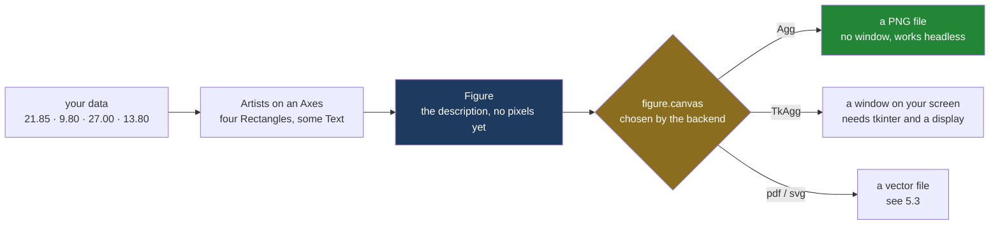

# 5.1 — Backends, and the script with no window

## One-line answer

A **backend** is the piece of matplotlib that turns a finished figure into something you can
actually see — pixels in a window, or bytes in a file — and choosing the file-writing one,
`Agg`, is what lets the same script run on your laptop and on a machine with no screen at all.

---

## The story

The flat's shopping chart is finished. Four bars for the four aisles, a line underneath for the
four weekly totals, all of it on one sheet.

Now somebody wants it on the fridge, so they open the file on the laptop and press Print.

Nothing happens. No error, no paper, just a dialogue box with an empty list where the printers
should be. The laptop has never had a printer set up on it. Somebody else emails the file to
themselves, opens it on their phone in the corner shop, and the shop's copier prints it without
any fuss at all.

Notice what was and was not wrong. The chart was fine the whole time. The numbers were right, the
bars were the right heights, the labels were spelled correctly. What was missing was the machine
that turns the chart into marks on something. The drawing and the printing are two separate
jobs, and only the second one depends on what is plugged into the computer.

That gap — a perfectly good picture and no machine to put it anywhere — is the whole of this
part.

---

## The idea in plain language

A **figure** is the sheet of paper, and it is pure description: this bar is this tall, this label
says "produce", this line goes here. [1.1](../01-the-two-objects/1.1-the-paper-and-the-frame.md)
built that object, and [1.3](../01-the-two-objects/1.3-everything-is-an-artist.md) showed that
everything on it is an **artist** — matplotlib's word for anything drawable. A description of a
picture is not a picture. Something has to read the description and produce output.

That something is the **backend**. It is a module inside matplotlib that knows one way of turning
artists into output. There are two families of them.

The **interactive** backends open a window on your screen and draw into it. They need a window
system, and they need a Python library that talks to that window system: `TkAgg` needs `tkinter`,
`QtAgg` needs one of the Qt bindings, `MacOSX` needs macOS. If any of that is missing, the backend
cannot load.

The **non-interactive** backends write a file and never open anything. `agg` writes pixel images,
`pdf` writes PDF, `svg` writes SVG, `ps` writes PostScript. They need no window system, no display
and no graphical libraries, so they work anywhere Python works.

`Agg` is the one you want by default, and the name is worth knowing rather than memorising: it is
matplotlib's built-in **anti-grain geometry** renderer, the code that decides which pixels a
diagonal line lights up and how dark each one is. `TkAgg` and `QtAgg` are that same renderer with
a window bolted on the front, which is why the pictures look identical whichever one you use.

One more term before the code. A **headless** machine is a computer with no screen attached — a
build server, a container, the machine that runs your tests when you push. Headless is the normal
case for anything automated, and a script that assumes a window is a script that works on your
laptop and fails everywhere else. That is [Day 2's CI
lesson](../../../day-02-quality-gate/parts/05-ci/5.1-what-ci-actually-is.md) — a fresh machine that
does not trust you — arriving in a new shape.

---

## Why Setu needs it

- **[5.2](5.2-savefig-dpi-and-bbox-inches.md)** writes the file. It is the backend that does the
  actual writing, and its `dpi` argument only means anything because a pixel-producing backend
  exists.
- **[5.3](5.3-vector-or-raster.md)** picks between PNG, SVG and PDF. Those are three different
  backends, chosen for you by the file extension you type.
- **[6.2](../06-the-module/6.2-testing-a-chart-without-looking.md)** runs chart tests under pytest.
  Those tests must never try to open a window, because nothing on a build machine can close it.
- **Day 41** is the phase gate: an eight-chart figure pack that has to build from a script, on any
  machine, without anyone sitting there.
- Every day from **Day 37** onwards draws something, and every one of them starts with the same two
  lines you are about to read.

---

## The mechanism

Start by asking what backend you have got, before touching anything.

```python
import matplotlib

print("1 rcParams before anything:", type(matplotlib.rcParams._get("backend")).__name__)
import matplotlib.pyplot as plt

print("2 rcParams after pyplot   :", type(matplotlib.rcParams._get("backend")).__name__)
print("3 get_backend()           :", matplotlib.get_backend())
print("4 rcParams now            :", matplotlib.rcParams._get("backend"))
print("5 fignums                 :", plt.get_fignums())
```

**Line by line:**

- `import matplotlib` loads the package but no drawing code. Nothing has been decided yet.
- `matplotlib.rcParams` is matplotlib's settings dictionary. `_get` reads a setting **without**
  resolving it, which is the only way to see what is stored before it turns into an answer. The
  leading underscore says this is internal; you are using it here to look at machinery, not because
  a program should.
- `type(...).__name__` is printed rather than the value, because the stored value is a private
  sentinel object whose address changes every run. Its *type* is the stable, printable fact.
- `import matplotlib.pyplot as plt` loads the pyplot module — and, as line 2 shows, still does not
  pick a backend.
- `matplotlib.get_backend()` is the question that forces the decision. Whatever it returns is what
  the next figure will be drawn with.
- `plt.get_fignums()` lists the figures pyplot is holding open. It is empty here, and
  [5.4](5.4-the-figures-you-never-closed.md) is about what happens when it is not.

```text
1 rcParams before anything: object
2 rcParams after pyplot   : object
3 get_backend()           : tkagg
4 rcParams now            : tkagg
5 fignums                 : []
```

Three facts fall out of five lines. The stored value starts as a bare `object` — a placeholder
meaning "not decided". Importing pyplot does not decide it. And on this machine the answer, once
forced, is `tkagg`: a backend that opens a window, chosen because `tkinter` ships with this Python
build and matplotlib found it first. Note the lower case. When matplotlib picks a backend for you
it stores the canonical lower-case name; when you name one yourself it keeps your spelling, which
is why `get_backend()` says `Agg` after `use("Agg")` and `tkagg` after guessing.

Now take the decision away from it.

```python
import matplotlib

matplotlib.use("Agg")
import matplotlib.pyplot as plt

AISLES = ["dairy", "bakery", "produce", "household"]
TOTALS = [21.85, 9.80, 27.00, 13.80]

fig, ax = plt.subplots(figsize=(6, 4))
ax.bar(AISLES, TOTALS)
ax.set_title("What each aisle cost")

print("backend      :", matplotlib.get_backend())
print("canvas class :", type(fig.canvas).__name__)
```

**Line by line:**

- `matplotlib.use("Agg")` sets the backend explicitly. `use` is a function on the top-level
  package, not on pyplot, which is exactly why it can run before pyplot is imported.
- `"Agg"` is case-insensitive here — `"agg"` works identically — but the capitalised form is the
  one every codebase writes.
- `import matplotlib.pyplot as plt` comes **after** `use`. That ordering is the habit; the next
  block measures whether it is still strictly required.
- `AISLES` and `TOTALS` are the flat's four aisles and their four-week totals, exactly as in
  [1.1](../01-the-two-objects/1.1-the-paper-and-the-frame.md).
- `plt.subplots(figsize=(6, 4))` makes the sheet and one panel together —
  [3.1](../03-the-object-api/3.1-fig-ax-subplots.md) is that one line in full.
- `fig.canvas` is the object the backend actually installed on the figure. It is the thing standing
  between the description and the output, so printing its class name tells you which backend really
  won, more honestly than `get_backend()` does.

```text
backend      : Agg
canvas class : FigureCanvasAgg
```

Here is the shape of it, from the numbers to the file:



**Everything left of the diamond is the same code on every machine.** Only the branch changes, and
the backend is the switch that picks the branch.

Now the honest part. Does `use` really have to come first?

```python
import sys

import matplotlib
import matplotlib.pyplot as plt

fig_before, _ = plt.subplots()
print("resolved to      :", matplotlib.get_backend())
print("tkinter imported :", "tkinter" in sys.modules)

matplotlib.use("Agg")
print("after use('Agg')  :", matplotlib.get_backend())
print("figures kept      :", plt.get_fignums())
```

**Line by line:**

- `import sys` gives access to `sys.modules`, the dictionary of every module Python has already
  loaded. Asking it whether `tkinter` is in there is a direct measurement of what the backend
  dragged in.
- `plt.subplots()` here is the first thing that *needs* a canvas, so this is the line that forces
  resolution — not either import.
- `matplotlib.use("Agg")` runs after pyplot is imported and after a figure exists. Its docstring
  says it calls `matplotlib.pyplot.switch_backend` in that case, and that "switching to a
  non-interactive backend is always possible".
- `plt.get_fignums()` afterwards checks whether the switch threw the existing figure away.

```text
resolved to      : tkagg
tkinter imported : True
after use('Agg')  : Agg
figures kept      : [1]
```

**The switch worked, and figure 1 survived it.** So the "`use` must come first" rule is not, in
matplotlib 3.11.1, a hard requirement. Keep the ordering anyway, for two reasons that the output
above shows directly. First, `tkinter` is now loaded in a process that never needed it, and on a
machine that has no `tkinter` the import that pulled it in would have raised before your `use` line
was ever reached. Second, once a GUI backend has started an event loop, switching *to another
interactive backend* is genuinely blocked — the docstring says so, and the non-interactive escape
only exists because `Agg` needs nothing. Putting `use` first means you never have to know which of
those cases you are in.

One last piece of the picture: the environment can choose for you.

```bash
MPLBACKEND=Agg uv run python -c "
import matplotlib, matplotlib.pyplot as plt
print('backend:', matplotlib.get_backend())
fig, ax = plt.subplots()
print('canvas :', type(fig.canvas).__name__)
"
```

**Line by line:**

- `MPLBACKEND=Agg` sets an environment variable for this one command. matplotlib reads it when it
  builds `rcParams`, so it changes the default without touching a line of Python.
- `uv run python -c "..."` runs the snippet inside the project's pinned environment, which is how
  every command in this curriculum runs.
- The script itself calls no `use`, which is the point: the machine decided, not the code.
- A `matplotlib.use("Agg")` line inside the script would win over `MPLBACKEND`, because `use` runs
  later than the settings file is read. The order of authority is: `use()` beats `MPLBACKEND`,
  which beats the `matplotlibrc` file, which beats matplotlib's own guess.

```text
backend: Agg
canvas : FigureCanvasAgg
```

---

## When it breaks

**A name matplotlib does not know:**

```text
$ uv run python -c "
import matplotlib
matplotlib.use('Aggg')
"
Traceback (most recent call last):
  File "<string>", line 3, in <module>
  File "...\matplotlib\__init__.py", line 1258, in use
    name = rcsetup.validate_backend(backend)
  File "...\matplotlib\rcsetup.py", line 315, in validate_backend
    raise ValueError(msg)
ValueError: 'Aggg' is not a valid value for backend; supported values are ['gtk3agg',
'gtk3cairo', 'gtk4agg', 'gtk4cairo', 'macosx', 'nbagg', 'notebook', 'qtagg', 'qtcairo',
'qt5agg', 'qt5cairo', 'tkagg', 'tkcairo', 'webagg', 'wx', 'wxagg', 'wxcairo', 'agg',
'cairo', 'pdf', 'pgf', 'ps', 'svg', 'template', 'inline']
```

**What it means.** This is the friendly failure: a typo, caught immediately, with the complete list
of valid answers printed for you. The last nine names in that list are the non-interactive ones.
The fix is the spelling.

**A backend whose libraries are not installed** — the failure a build machine actually gives:

```text
$ MPLBACKEND=QtAgg uv run python -c "
import matplotlib
import matplotlib.pyplot as plt
fig, ax = plt.subplots()
"
Traceback (most recent call last):
  ...
  File "...\matplotlib\backends\backend_qtagg.py", line 9, in <module>
    from .qt_compat import QT_API, QtCore, QtGui
  File "...\matplotlib\backends\qt_compat.py", line 130, in <module>
    raise ImportError(
ImportError: Failed to import any of the following Qt binding modules: PyQt6, PySide6, PyQt5,
PySide2
```

**What it means.** Read the traceback backwards and it tells a clear story: `plt.subplots` needed a
canvas, so matplotlib went to load the backend module, so that module tried to import Qt, and there
is no Qt here. Nothing is wrong with your chart. The line that never ran is the one that would have
saved you: `matplotlib.use("Agg")` at the top overrides `MPLBACKEND` and this traceback disappears.

The same shape appears on a Linux container with `TkAgg` and no `tkinter` package, and on any
machine where the default guess lands on a toolkit that is not installed. The message names a
different library; the cause and the fix are identical.

**Asking a file-writing backend to show you a window:**

```text
$ uv run python -c "
import matplotlib
matplotlib.use('Agg')
import matplotlib.pyplot as plt
fig, ax = plt.subplots()
ax.bar(['dairy'], [21.85])
plt.show()
print('script continued past plt.show()')
"
<string>:7: UserWarning: FigureCanvasAgg is non-interactive, and thus cannot be shown
script continued past plt.show()
```

**What it means.** This one is a warning, not an error, and the script keeps going. That is worse
than it looks, because it is exactly what a `plt.show()` left in a script does in CI: the build
passes, no window is opened, no file is written, and nobody notices that the chart was never
produced. `plt.show()` belongs in an interactive session; a script writes a file instead, which is
[5.2](5.2-savefig-dpi-and-bbox-inches.md).

---

## In production

**What a professional writes instead.** Not `matplotlib.use` scattered through the code. The
backend is decided once, in one place, and the choice is written down:

- In a library module, never call `use` at all. A library that changes a global setting on import
  is a library that fights the application using it.
- In an application entry point or a script, the two lines go at the very top, before pyplot.
- For the test suite, set it in configuration rather than in code — `MPLBACKEND=Agg` in the CI
  workflow's environment, or a `conftest.py` that calls `matplotlib.use("Agg")` before any test
  module imports pyplot. The point is that no individual test has to remember.

The two-line dance looks like it should upset a linter, because `import matplotlib.pyplot as plt`
sits below a statement. It does not: `uv run ruff check` with this project's rule set
(`E`, `F`, `I`, `UP`, `B`, `SIM`) passes the file unchanged, and `ruff format` leaves it alone,
because the import sorter only reorders imports that are already adjacent. You do not need a
`# noqa` comment, and adding one is noise.

**What degrades at scale, and under concurrency.** An interactive backend keeps an event loop and a
window handle per figure, so a server that accidentally resolves to one does not merely slow down —
it holds operating-system resources that no Python garbage collection will release. Worse, the
current-figure pointer that pyplot maintains
([2.2](../02-the-state-machine/2.2-gca-and-the-axes-you-did-not-choose.md)) is one module-level
variable shared by every thread in the process. Two requests drawing at once will interleave on it.
The production answer is both halves of this day: `Agg` for the backend, and the explicit
`fig, ax` objects rather than `plt.` calls, so that nothing depends on a shared pointer.

**The failure that only appears with real data.** A nightly report ran green for weeks on a
developer's machine and produced no charts at all on the server. The script ended with
`plt.show()`, the server had no display, and the only trace was one `UserWarning` in a log nobody
read. The report's other sections were fine, so the missing images were read as a template problem
for a fortnight. The fix was one line — replace `plt.show()` with `fig.savefig(path)` — and the
lesson is that a warning in an automated job is an error that has not been noticed yet.

**The review comment a senior engineer leaves.** *"This module calls `matplotlib.use("TkAgg")` at
import time. That makes importing our own package fail on any machine without tkinter, including
CI. Move the backend choice out of the library: `Agg` in `conftest.py` for tests, `MPLBACKEND` in
the deployment environment, nothing in here."*

**The interview question.** *"Your plotting script works locally and crashes in the Docker build.
What do you check first?"* The backend. Locally matplotlib finds a GUI toolkit and picks an
interactive backend; the container has no display and often no toolkit, so loading that backend
raises an `ImportError` the moment a figure is created. Set `MPLBACKEND=Agg` in the image, or call
`matplotlib.use("Agg")` before importing pyplot, and write files instead of calling `plt.show()`.
The follow-up that separates people is *"why must it come before the pyplot import?"* — and the
honest answer is that in current matplotlib it usually need not, because backend resolution is lazy
and switching to a non-interactive backend is always allowed, but putting it first is the only
version that is safe when the import itself is what fails.

---

## Check yourself

```bash
uv run --with 'matplotlib==3.11.1' python -c "
import sys, matplotlib
print('guessed backend :', matplotlib.get_backend())
print('tkinter loaded  :', 'tkinter' in sys.modules)
matplotlib.use('Agg')
import matplotlib.pyplot as plt
fig, ax = plt.subplots()
print('chosen backend  :', matplotlib.get_backend())
print('canvas class    :', type(fig.canvas).__name__)
print('tkinter loaded  :', 'tkinter' in sys.modules)
"
```

Six lines. Two of them are about `tkinter`, and the pair is the measurement that matters: say what
changed between them and what did not.

**Answer out loud, without scrolling up:**

> A colleague's script has `import matplotlib.pyplot as plt` on line 1 and
> `matplotlib.use("Agg")` on line 12, and it works on their laptop. Name the machine where that
> ordering fails, and say exactly which line raises there.

---

**Next:** [5.2 — savefig, dpi, and bbox_inches](5.2-savefig-dpi-and-bbox-inches.md).
