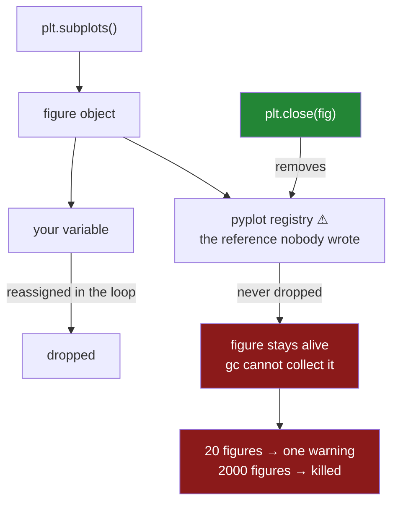

# 5.4 — The figures you never closed

## One-line answer

`pyplot` keeps a reference to every figure it makes so that `savefig` and `show` can find the current
one, which means a figure is **never** garbage collected until you close it — so a loop that draws a
chart per group leaks memory silently until a warning at twenty and an out-of-memory kill at a few
thousand.

---

## The story

The flat's chart script has grown. It started as one bar chart and now it makes one per month, saved
into a folder, so the year can be flicked through.

Twelve charts. It works.

Then somebody points it at the full file and asks for one chart per item per month — a few hundred —
and part-way through the run the terminal prints a warning about too many open figures. The charts are
all correct. The files are all there. The warning does not stop anything, and nobody can see what it
is complaining about, because each chart was saved and the script had visibly moved on from it.

They run it on the real data at work a week later, one chart per customer, and the process is killed.
Not slowly: the machine runs out of memory and something ends it.

Every figure the script ever drew was still in memory. Saving a figure does not dispose of it, and
nothing in the loop ever said to. The variable holding it was reassigned on each pass, which in
ordinary Python would be enough — and here it is not, because `pyplot` is holding a second reference
that nobody wrote.

---

## The idea in plain language

Go back to the state machine in [2.1](../02-the-state-machine/2.1-the-figure-you-never-named.md).
`pyplot` keeps a notion of the **current figure**, so that `plt.title(...)` knows what to put a title
on and `plt.savefig(...)` knows what to save. To do that it has to remember every figure it has made,
in a registry, keyed by number.

That registry is the leak. It is a reference held by the module, so:

- Reassigning your variable does not free the figure. `fig = plt.figure()` inside a loop drops *your*
  reference each pass; `pyplot` still has its own.
- Going out of scope does not free it. A figure made inside a function outlives the function.
- Garbage collection cannot help. The object is still reachable, so it is not garbage.

A figure is not small. It carries its axes, every artist on them, the renderer's cached state and a
buffer sized by `figsize` and `dpi` ([5.2](5.2-savefig-dpi-and-bbox-inches.md)). A modest one runs to a
few hundred kilobytes; a large one at print resolution runs to megabytes.

**Three ways to not leak**, and they are not interchangeable:

- **`plt.close(fig)`** — close one specific figure. This is the one to use in a loop.
- **`plt.close("all")`** — close every open figure. Right at the end of a script, and right in a test
  fixture; wrong inside a loop in a library, because it destroys figures belonging to your caller.
- **Do not use `pyplot` to create the figure at all.** `Figure()` constructed directly is never
  registered, so nothing holds it but you. That is what a library or a web service does, and it is
  what the `ax=None` contract in [3.5](../03-the-object-api/3.5-the-ax-parameter.md) is heading
  towards.

**The warning is a courtesy, not a limit.** At twenty open figures matplotlib prints a
`RuntimeWarning`. It does not stop, it does not close anything, and it prints **once** — so a script
that opens two thousand gets exactly the same single line as one that opens twenty-one. Treat it as a
smoke alarm, not a gauge.

And the rule that follows, which is the one worth taking to every plotting function you ever write:
**whoever creates a figure closes it.** A function that takes an `ax` and draws on it must not close
anything, because it did not make the figure and its caller may not be finished. A function that
creates and saves — like `save(fig, path)` in
[6.1](../06-the-module/6.1-the-figures-module.md) — closes what it made.

---

## Why Setu needs it

- **[2.1](../02-the-state-machine/2.1-the-figure-you-never-named.md)** introduced the current figure.
  This is the bill for it, and it is the strongest argument in the day for the object API.
- **[3.5](../03-the-object-api/3.5-the-ax-parameter.md)**'s `ax=None` contract exists partly for this:
  a function given an axes creates no figure, so it cannot leak one.
- **[5.2](5.2-savefig-dpi-and-bbox-inches.md)** set `dpi` and `figsize`, which together decide how much
  each leaked figure costs.
- **[6.1](../06-the-module/6.1-the-figures-module.md)**'s `save()` closes the figure it saved, and
  `quick_look` is deliberately left leaking so the fix is a rep with a measurable outcome.
- **[6.2](../06-the-module/6.2-testing-a-chart-without-looking.md)**'s fixture closes every figure
  after each test, and has a test proving the fixture works — because a test suite is a loop that makes
  figures, and it leaks exactly like any other.
- **Days 37 to 41** build more charts per run, and **Phase 6**'s reporting jobs draw one chart per
  segment on a schedule, which is precisely the shape that gets killed.

---

## The mechanism

What happens to a figure after you save it.

```python
import matplotlib

matplotlib.use("Agg")

import matplotlib.pyplot as plt

fig, ax = plt.subplots()
ax.plot([1, 2, 3], [1, 4, 9])
fig.savefig("one.png")
print("after savefig, open figures:", plt.get_fignums())
del fig
import gc

gc.collect()
print("after del and gc, open :", plt.get_fignums())
plt.close("all")
print("after close('all')     :", plt.get_fignums())
```

**Line by line:**

- `plt.subplots()` creates a figure **through pyplot**, so it is registered. That is the ordinary way
  everybody makes a figure, and it is where the leak starts.
- `savefig` writes the file and returns. It does not close, dispose of, or otherwise finish with the
  figure — the figure is still fully alive and could be drawn on again, which is exactly why saving is
  not enough.
- `del fig` removes **your** reference. In ordinary Python that would make the object collectable.
- `gc.collect()` runs the collector explicitly, so the result cannot be blamed on timing.
- `plt.get_fignums()` lists the numbers of the figures pyplot is holding — the registry, printed. It is
  the diagnostic for this entire part and it is one call.

```text
after savefig, open figures: [1]
after del and gc, open : [1]
after close('all')     : []
```

**`del` and a full garbage collection did nothing.** The figure is still there, because `pyplot`'s
registry still points at it and an object with a live reference is not garbage.

Only `close` removes it. That is the whole mechanism: the registry is a reference you did not write and
cannot drop by deleting your own.

Now the loop, and what it costs:

```python
import tracemalloc

tracemalloc.start()
before = tracemalloc.take_snapshot()
for _ in range(200):
    figure = plt.figure(figsize=(8, 5), dpi=100)
    figure.add_subplot(111).plot([1, 2, 3], [1, 4, 9])
after = tracemalloc.take_snapshot()
grew = sum(s.size_diff for s in after.compare_to(before, "filename"))
print("open figures:", len(plt.get_fignums()))
print(f"memory grew: {grew / 1e6:.1f} MB")
plt.close("all")
gc.collect()
end = tracemalloc.take_snapshot()
reclaimed = sum(s.size_diff for s in end.compare_to(before, "filename"))
print(f"after close('all'): {reclaimed / 1e6:.1f} MB, figures: {len(plt.get_fignums())}")
```

**Line by line:**

- The loop reassigns `figure` on every pass, so at any moment your code holds exactly one reference —
  which is what makes this look safe on a reading.
- `figsize=(8, 5), dpi=100` is a modest chart, not a print-resolution one. The cost below is the
  **cheap** case.
- `tracemalloc` is Python's own allocation tracker; comparing two snapshots gives the growth
  attributable to the code between them, which is more honest than reading process memory.
- `plt.close("all")` and then `gc.collect()`, so the second measurement is after both the registry has
  released the figures and the collector has run.

```text
<string>:8: RuntimeWarning: More than 20 figures have been opened. Figures created through the
pyplot interface (`matplotlib.pyplot.figure`) are retained until explicitly closed and may consume
too much memory. (To control this warning, see the rcParam `figure.max_open_warning`). Consider
using `matplotlib.pyplot.close()`.
open figures: 200
memory grew: 51.8 MB
after close('all'): 0.5 MB, figures: 0
```

**Two hundred figures, fifty-two megabytes, and one warning.**

Read the warning text — it is unusually explicit about the cause: *retained until explicitly closed*.
That is the registry, described. And it fired **once**, at the twenty-first figure, then stayed quiet
for the remaining hundred and eighty.

Then read the last line: closing them gives back all but half a megabyte. Nothing was corrupted and
nothing needed fixing — the memory was simply held, and the only thing missing was one call.

Scale that to a real job. A chart per customer at `dpi=200` and a larger `figsize` costs several times
this per figure; a few thousand customers is gigabytes, and the process does not warn a second time on
its way there.

The fix, in the loop:

```python
for month in range(1, 13):
    figure, ax = plt.subplots()
    ax.bar(["dairy", "bakery", "dry"], [3, 2, 1])
    figure.savefig(f"month-{month:02d}.png")
    plt.close(figure)
print("open figures after 12 charts:", plt.get_fignums())
```

**Line by line:**

- `plt.close(figure)` takes the **specific figure**, not `"all"`. Inside a loop in library code,
  `close("all")` would destroy figures belonging to whoever called you, which is a rude and very
  confusing bug to be on the receiving end of.
- It comes **after** `savefig`, because closing first would leave nothing to save
  ([§*When it breaks*](#when-it-breaks) shows what that looks like).
- The pairing is the discipline: every `subplots()` in a loop has a `close()` in the same loop body,
  close enough to see both at once.
- The count is printed at the end, which is the assertion form of this whole part and is what
  [6.2](../06-the-module/6.2-testing-a-chart-without-looking.md) tests.

```text
open figures after 12 charts: []
```



---

## When it breaks

**The warning that fires once and then stops:**

```text
$ uv run python -W always -c "
import matplotlib
matplotlib.use('Agg')
import matplotlib.pyplot as plt
import warnings
print('threshold:', plt.rcParams['figure.max_open_warning'])
with warnings.catch_warnings(record=True) as caught:
    warnings.simplefilter('always')
    for _ in range(200):
        plt.figure()
    print('figures open:', len(plt.get_fignums()))
    print('warnings issued:', len(caught))
"
threshold: 20
figures open: 200
warnings issued: 1
```

**Two hundred figures and one warning.** The warning is a threshold crossing, not a running count, so
it tells you a leak has started and nothing at all about how bad it has become.

Worse, it goes to `stderr` as a `RuntimeWarning`. In a notebook it scrolls away; in a scheduled job it
lands in a log nobody reads; and under `pytest`, which captures warnings by default, it is invisible
unless something asks for it. So the single most common outcome is that the warning is emitted
correctly, every run, for months, and nobody ever sees it.

The reliable check is not the warning. It is `len(plt.get_fignums())`, asserted.

**The figure closed before it was saved:**

```text
$ uv run python -c "
import matplotlib
matplotlib.use('Agg')
import matplotlib.pyplot as plt
fig, ax = plt.subplots()
ax.plot([1, 2, 3], [1, 4, 9])
plt.close(fig)
fig.savefig('closed.png')
import os
print('file written:', os.path.getsize('closed.png'), 'bytes')
"
file written: 19000 bytes
```

**It works, which is not what anybody expects.** Closing a figure removes it from pyplot's registry and
detaches it from any window; the `Figure` object itself is still perfectly usable and can still render.

That is worth knowing because it removes a common fear — you cannot break a save by closing too early
if you hold the object. What you *can* break is the pyplot-style call: `plt.savefig()` after
`plt.close()` saves the wrong figure or creates a blank new one, because there is no current figure any
more. Another reason the object API is the safe one
([3.1](../03-the-object-api/3.1-fig-ax-subplots.md)).

**The leak inside a function, which no code review catches:**

```text
$ uv run python -c "
import matplotlib
matplotlib.use('Agg')
import matplotlib.pyplot as plt

def chart(values, path):
    fig, ax = plt.subplots()
    ax.plot(values)
    fig.savefig(path)

for i in range(30):
    chart([1, 2, 3], f'c{i}.png')
print('open after 30 calls:', len(plt.get_fignums()))
" 2>&1 | tail -2
open after 30 calls: 30
```

**The function looks correct in isolation.** It creates a figure, draws, saves, and returns. `fig` goes
out of scope at the `return`, which in every other Python context would be the end of it.

This is the version that reaches production, because the leak is invisible at the call site — the
caller sees a function that makes a file — and invisible in the function, which is four obvious lines.
It only exists in the gap between them. The rule *whoever creates a figure closes it* is what makes
this reviewable: this function creates one, so this function must close it.

**`close("all")` in a library, which breaks the caller:**

```text
$ uv run python -c "
import matplotlib
matplotlib.use('Agg')
import matplotlib.pyplot as plt

mine, ax = plt.subplots()
ax.set_title('half-finished work')

def tidy_library_function():
    fig, ax = plt.subplots()
    fig.savefig('theirs.png')
    plt.close('all')

tidy_library_function()
print('my figure still registered:', plt.fignum_exists(mine.number))
print('my title survives on the object:', mine.axes[0].get_title())
"
my figure still registered: False
my title survives on the object: half-finished work
```

**A well-meaning cleanup destroyed somebody else's work.** The library function closed *every* figure,
including the caller's half-built one, so `plt.savefig()` on it later would save nothing and
`plt.figure(mine.number)` would fail.

Note the second line: the `Figure` object is still intact and its title is still there, so the damage
is not to the data but to the registry — which means the symptom appears far away, as a pyplot call
finding no current figure. `close("all")` belongs at the top level of a script or in a test fixture,
and nowhere else.

---

## In production

**What a professional writes instead of the teaching version.** Creation and closing are paired by the
language rather than by discipline:

```python
from contextlib import contextmanager
from pathlib import Path

import matplotlib.pyplot as plt
from matplotlib.figure import Figure


@contextmanager
def figure(**kwargs):
    """A figure that is always closed, however the block exits."""
    fig = plt.figure(**kwargs)
    try:
        yield fig
    finally:
        plt.close(fig)


def save(fig: Figure, path: Path, *, dpi: int = 150) -> Path:
    """Write a figure to `path` and close it. The caller must not use `fig` afterwards."""
    path.parent.mkdir(parents=True, exist_ok=True)
    fig.savefig(path, dpi=dpi, bbox_inches="tight")
    plt.close(fig)
    return path
```

**Line by line:**

- `@contextmanager` with `try`/`finally` is the important shape: the figure is closed **however the
  block ends**, including when the drawing code raises. A loop that leaks only on the error path is
  the version that survives testing and dies in production, because the error path is the one nobody
  exercises.
- `yield fig` hands the figure to the `with` block, so a caller writes
  `with figure() as fig:` and cannot forget the close — there is no line to omit.
- `save` closes what it was given and **says so in the docstring**. That is a real contract change: the
  caller's figure is dead after this call, and a docstring that does not say it will produce a confused
  bug report about a blank second save.
- `plt.close(fig)` and not `close("all")`, for the reason in §*When it breaks*.
- `save` takes the figure rather than creating one, so it composes with the `ax=None` functions from
  [3.5](../03-the-object-api/3.5-the-ax-parameter.md) — those draw, this disposes, and neither does
  both.
- `path.parent.mkdir(...)` because a `savefig` into a directory that does not exist raises after all
  the drawing work is done, which is the most annoying possible moment for it.

For a library or a long-running service the stronger form is to avoid the registry entirely:

```python
from matplotlib.figure import Figure


def render(values: list[float], path: Path) -> Path:
    """Draw without pyplot: nothing is registered, so nothing can leak."""
    fig = Figure(figsize=(8, 5), dpi=150)
    ax = fig.subplots()
    ax.plot(values)
    fig.savefig(path)
    return path
```

**Line by line:**

- `Figure(...)` constructed **directly** never enters pyplot's registry, so the only reference is `fig`
  and ordinary garbage collection reclaims it at the end of the function. The leak is structurally
  impossible rather than avoided by remembering.
- `fig.subplots()` is the figure's own method, the object-API twin of `plt.subplots()`.
- There is no `plt.close` because there is nothing registered to close, and no `plt` import at all.
- The cost is that `plt.show()` cannot display it — which is correct for a service that has no screen,
  and is why this form is standard in web backends and scheduled jobs rather than in notebooks.

**What degrades at scale.** Linearly, and then suddenly:

```text
figsize=(8,5), dpi=100
  200 figures, never closed          51.8 MB
  after plt.close('all')              0.5 MB
  per figure                        ~0.26 MB
figsize=(12,8), dpi=200
  per figure                        ~1.9 MB
  2 000 figures                      ~3.8 GB   -> killed
warnings issued in all cases              1
```

**Line by line:**

- About a quarter of a megabyte for a small figure, which is why twelve charts never showed a problem
  and a few hundred did.
- Resolution and size multiply it: the same code at print settings costs **seven times** more per
  figure, so the customer-per-chart job that survived at screen resolution dies when somebody raises
  `dpi` for a report ([5.2](5.2-savefig-dpi-and-bbox-inches.md)).
- Growth is linear and entirely predictable, and the process gives no signal as it climbs — one warning
  at twenty and then silence, whether it ends at fifty or fifty thousand.
- Closing reclaims essentially all of it, so this is a pure bookkeeping bug rather than fragmentation
  or a real leak in the C sense. That is good news: the fix is complete and needs no tuning.

The organisational failure is that this cannot be caught by looking at the code. Every individual
function is right; the leak lives in the gap between a creator and a caller. What catches it is an
**assertion on the figure count** in the test suite — `len(plt.get_fignums()) == 0` after a test — and
that is exactly what [6.2](../06-the-module/6.2-testing-a-chart-without-looking.md)'s fixture does.

**The failure that only appears with real data.** A reporting service generated a PNG per dashboard
tile on request. In staging it was fine: a handful of tiles, a process restarted between test runs. In
production it was a long-running worker, and every request leaked one figure. Memory climbed over about
nine hours until the container hit its limit and was restarted by the orchestrator — which looked
exactly like a healthy rolling restart, so for four months the graph was read as normal behaviour.
It was found only when somebody asked why restarts clustered at the end of the working day, when
dashboard traffic peaked. The fix was one `plt.close(fig)`. The lesson is that a leak in a
long-running process presents as *restarts*, not as an error, and nothing in the logs says "figure".

**The review comment a senior engineer leaves.** *"This function creates a figure and saves it but
never closes it, so every call leaks. Whoever creates the figure closes it — either add
`plt.close(fig)` after the save or use the `figure()` context manager. And in the worker, use
`Figure()` directly rather than `plt.figure()`: there is no screen, so there is no reason to be in
pyplot's registry at all."*

**The interview question.** *"You have a loop that saves one chart per group and the process runs out
of memory. What is wrong?"* The figures are never closed. `pyplot` keeps a reference to every figure it
creates so that the "current figure" idea works, so reassigning your variable or letting it go out of
scope frees nothing and garbage collection cannot help — the object is still reachable. `plt.close(fig)`
inside the loop fixes it. Then the follow-up that separates people who have debugged one:
**why did the warning not tell you?** Because matplotlib warns **once**, when the count crosses twenty,
and never again — so two hundred figures and twenty-one produce the identical single line, and it is a
`RuntimeWarning` on stderr that a scheduled job's logs swallow. The check that works is asserting
`len(plt.get_fignums())` in the test suite, and the structural fix for a long-running service is to
build figures with `Figure()` directly, which never registers them at all.

---

## Check yourself

```bash
uv run python -c "
import gc
import matplotlib
matplotlib.use('Agg')
import matplotlib.pyplot as plt

fig, ax = plt.subplots()
ax.plot([1, 2, 3])
fig.savefig('a.png')
print('after savefig     :', plt.get_fignums())
del fig
gc.collect()
print('after del + gc    :', plt.get_fignums())
plt.close('all')

def chart(path):
    f, a = plt.subplots()
    a.plot([1, 2, 3])
    f.savefig(path)

for i in range(25):
    chart(f'c{i}.png')
print('after 25 calls    :', len(plt.get_fignums()))
plt.close('all')
print('after close(all)  :', len(plt.get_fignums()))
"
```

Run it. Deleting your variable and forcing a collection leaves the figure open — say which reference is
keeping it alive. Then say why the function version leaks even though `f` goes out of scope, and how
many warnings twenty-five figures produced.

**Answer out loud, without scrolling up:**

> Why does `savefig` not free a figure, and why does `del` not either? Then say who is responsible for
> closing a figure in a function that takes an `ax` argument, and why `plt.close("all")` is the wrong
> call inside a library.

---

**Next:** [6.1 — `src/setu/figures.py`](../06-the-module/6.1-the-figures-module.md).
