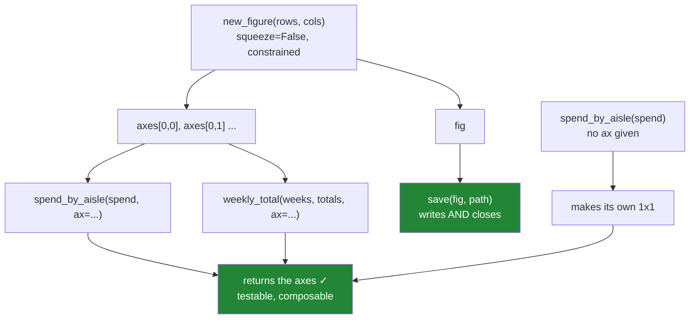

# 6.1 — `src/setu/figures.py`

## One-line answer

The day's four rules — always name the figure and axes, always take an optional `ax`, always use a
constrained layout with `squeeze=False`, and always close what you created — become five short
functions, and the shape of those functions is what makes a chart testable without anybody looking at
it.

---

## The story

The flat's charts live in a notebook. There are six of them, each about ten lines, and each was written
by pasting the last one and changing the numbers.

They work. Nobody minds.

Then somebody wants the monthly report to have all six on one page, and it turns out that none of them
can be moved. Each one calls `plt.bar` and then `plt.title`, so each one draws onto whatever figure
happens to be current and has no way of being pointed at a particular panel. To put six charts in a
grid, every one has to be rewritten.

And when they are rewritten, the second problem appears: there is nothing to test. The report is
correct if the bars are the right height and the axes say what the numbers mean, and neither of those
is checkable when the chart is ten lines in a cell that draws into the void.

The module is the fix for both, and they turn out to be the same fix. A function that **takes an axes
and returns it** can be placed anywhere, and can be inspected afterwards.

---

## The idea in plain language

Five functions, and each one exists because a part of this day showed what happens without it.

**`new_figure(rows, cols)`** — the only place a figure is created. It always passes `squeeze=False` and
`layout="constrained"`, so every caller gets a two-dimensional array of axes whatever the grid size
([4.1](../04-many-axes/4.1-a-grid-of-axes.md)) and nothing overlaps
([4.4](../04-many-axes/4.4-constrained-layout.md)).

**`spend_by_aisle(spend, ax=None)`** and **`weekly_total(weeks, totals, ax=None)`** — the two charts.
Both follow the `ax=None` contract from [3.5](../03-the-object-api/3.5-the-ax-parameter.md): given an
axes, draw on it; given nothing, make one. Both **return the axes**, which is what makes them
composable and testable.

**`save(fig, path)`** — writes the file and closes the figure
([5.4](../05-getting-it-out/5.4-the-figures-you-never-closed.md)).

**`quick_look(frame)`** — deliberately left broken, and the day's first rep.

Three ideas hold it together.

**The `ax=None` contract is the whole design.** A function that creates its own figure can only ever be
one chart on one page. A function that accepts an axes can be a panel in a grid, a chart in a report,
or a standalone image — the same code, with the layout decision moved to the caller who is the only one
who knows it. That single parameter is the difference between six pasted cells and a module.

**Return the axes.** Not the figure, and not `None`. The axes is the thing a caller wants to keep
adjusting — adding a label, setting a limit — and it is the thing a test inspects. A charting function
that returns nothing can only be tested by looking at a picture.

**Creation and disposal are paired and named.** `new_figure` makes, `save` disposes, and the drawing
functions do neither. That means no drawing function can leak, and there is exactly one place to look
when something does.

And one rule about what does **not** go in here: no `plt.show()`, and no `matplotlib.use()` inside a
function. The backend is a property of the process, not of a chart
([5.1](../05-getting-it-out/5.1-backends-and-the-script-with-no-window.md)), and a library that picks
one for its caller is a library that breaks in a notebook.

---

## Why Setu needs it

- **Sections 1 to 5** are the rules. This is where they stop being things to remember and become the
  only way the code can be written.
- **[6.2](6.2-testing-a-chart-without-looking.md)** tests this module, and every assertion it makes is
  possible only because these functions return the axes.
- **[5.4](../05-getting-it-out/5.4-the-figures-you-never-closed.md)** is why `save` closes and why
  `quick_look` is left leaking as a rep with a measurable outcome.
- **[3.5](../03-the-object-api/3.5-the-ax-parameter.md)** introduced the `ax=None` contract; this is
  the module that keeps it.
- **Day 37** imports from this file — labels, tick formatting and the greyscale check all attach to
  these functions — so its shape is a decision that lasts the phase.
- **Phase 6**'s reporting jobs and **Day 111**'s monitoring dashboards are grids of panels built
  exactly this way, one function per chart, assembled by a caller.

---

## The mechanism

The module's policy and the one place a figure is made.

```python
"""The flat's charts, as functions that take an axes and return it."""

from __future__ import annotations

import logging
from pathlib import Path

import matplotlib.pyplot as plt
from matplotlib.axes import Axes
from matplotlib.figure import Figure

log = logging.getLogger(__name__)

FIGSIZE = (8.0, 5.0)
DPI = 150
LAYOUT = "constrained"


class FigureError(ValueError):
    """A figure or axes arrived in a state this module refuses to draw on."""


def new_figure(rows: int = 1, cols: int = 1, **kwargs) -> tuple[Figure, "np.ndarray"]:
    """A figure and a 2-D array of axes, whatever the grid size."""
    if rows < 1 or cols < 1:
        raise FigureError(f"grid must be at least 1x1, got {rows}x{cols}")
    kwargs.setdefault("figsize", FIGSIZE)
    kwargs.setdefault("layout", LAYOUT)
    fig, axes = plt.subplots(rows, cols, squeeze=False, **kwargs)
    log.debug("new_figure(%d, %d) -> %s axes", rows, cols, axes.shape)
    return fig, axes
```

**Line by line:**

- Three constants, because these are the three policy decisions the day made and a reader should find
  them without reading a function (Principle 4). `DPI = 150` is a compromise
  ([5.2](../05-getting-it-out/5.2-savefig-dpi-and-bbox-inches.md)): sharp on screen, small enough to
  put in a repository.
- `FigureError` subclasses `ValueError`, so existing `except ValueError` handlers still catch it while
  new code can be specific — the same family rule the earlier days' modules follow.
- **`squeeze=False` is not a keyword argument with a default; it is hard-coded.** That is deliberate:
  with the default `squeeze=True`, `plt.subplots(1, 1)` returns a bare `Axes`, `subplots(1, 3)` returns
  a 1-D array and `subplots(2, 3)` a 2-D one, so every caller's indexing depends on the grid shape
  ([4.1](../04-many-axes/4.1-a-grid-of-axes.md)). Fixing it here means `axes[0, 0]` always works and a
  grid can be resized without touching the code that fills it.
- `kwargs.setdefault(...)` rather than a named parameter, so a caller **can** override the size or
  layout for one chart without the signature growing a parameter per matplotlib option.
- `layout="constrained"` by default, because the alternative is labels overlapping on every multi-panel
  figure and a `tight_layout()` call pasted everywhere
  ([4.4](../04-many-axes/4.4-constrained-layout.md)).
- The grid check raises rather than letting matplotlib produce its own error, because `subplots(0, 3)`
  gives an empty array and a confusing failure three lines later.
- `log.debug` and not `print`, because this is library code and its caller decides what is shown.

The two charts, both following the same contract:

```python
def spend_by_aisle(spend: "pd.Series", ax: Axes | None = None) -> Axes:
    """Bar chart of spend per aisle. Draws on `ax` if given, otherwise makes one."""
    if spend.empty:
        raise FigureError("nothing to plot: spend has no rows")
    if ax is None:
        _, axes = new_figure()
        ax = axes[0, 0]
    ax.bar(spend.index.astype(str), spend.to_numpy())
    ax.set_title("Spend by aisle")
    ax.set_xlabel("aisle")
    ax.set_ylabel("spend (GBP)")
    ax.set_ylim(bottom=0)
    return ax


def weekly_total(weeks: "pd.Index", totals: "pd.Series", ax: Axes | None = None) -> Axes:
    """Line chart of total spend per week."""
    if len(weeks) != len(totals):
        raise FigureError(f"{len(weeks)} weeks against {len(totals)} totals")
    if ax is None:
        _, axes = new_figure()
        ax = axes[0, 0]
    ax.plot(weeks, totals.to_numpy(), marker="o")
    ax.set_title("Weekly total")
    ax.set_xlabel("week commencing")
    ax.set_ylabel("spend (GBP)")
    ax.set_ylim(bottom=0)
    return ax
```

**Line by line:**

- `ax: Axes | None = None` is the contract. The default is `None` rather than a freshly-made axes,
  because a mutable default is evaluated once at import and every call would share one chart
  ([Day 19, 2.2](../../../day-19-typing-dataclasses-and-concurrency/parts/02-dataclasses/2.2-default-factory.md)).
- `if ax is None: ... ax = axes[0, 0]` is four lines that appear in both functions, and that repetition
  is correct — extracting it into a helper would hide the one decision a reader most needs to see.
- **Both functions return `ax`.** Not the figure: a caller who passed an axes in already has the figure,
  and a caller who did not can reach it with `ax.figure`. Returning the axes is what lets a test ask
  what was drawn.
- `spend.index.astype(str)` because a categorical or numeric index would be treated as positions rather
  than labels, which silently changes a bar chart into something else.
- `.to_numpy()` on the values, so the axes is handed plain numbers rather than a Series carrying an
  index that matplotlib will quietly ignore — being explicit here avoids a class of confusing off-by-one
  when the index is not `0..n`.
- `set_ylim(bottom=0)` on a **bar** chart is not decoration. A bar's length is its meaning, so an axis
  that starts above zero exaggerates every difference — Day 37 makes the argument
  ([Day 37, 7.1](../../../day-37-labels-and-chart-choice/parts/07-choosing-the-chart/7.1-the-bar-that-lied.md)),
  and pinning it here means no caller can produce that chart by accident.
- Every axes gets a title and both labels **inside the function**. A chart is not finished when the
  bars are drawn; it is finished when a reader can say what the numbers are
  ([Day 37, 1.1](../../../day-37-labels-and-chart-choice/parts/01-labels/1.1-the-chart-that-never-said-what-the-numbers-were.md)).
  The unit is in the y label, and that is the part people leave out.
- The guard clauses raise `FigureError` **before** any drawing, so a bad input never produces a
  half-drawn figure that then leaks.

And the pairing that closes the loop:

```python
def save(fig: Figure, path: Path, dpi: int = DPI) -> Path:
    """Write `fig` to `path` and close it. `fig` must not be used afterwards."""
    if not fig.axes:
        raise FigureError(f"refusing to save an empty figure to {path}")
    path.parent.mkdir(parents=True, exist_ok=True)
    fig.savefig(path, dpi=dpi, bbox_inches="tight")
    plt.close(fig)
    log.info("save: %s (%d axes, dpi=%d)", path, len(fig.axes), dpi)
    return path
```

**Line by line:**

- `if not fig.axes` refuses a figure with nothing on it. That is the commonest symptom of the state
  machine going wrong — `plt.savefig()` after the current figure changed
  ([2.3](../02-the-state-machine/2.3-where-plt-plot-stops-working.md)) — and a blank PNG is a bug that
  survives for weeks because a file was produced.
- `plt.close(fig)` is the disposal half of the pair, and the docstring **says the figure is dead
  afterwards**. A caller who saves twice gets a clear contract rather than a confusing second file.
- `bbox_inches="tight"` trims the surrounding whitespace, which matters most for the rotated tick
  labels Day 37 introduces.
- `dpi` is a parameter defaulting to the constant, so a report can ask for print resolution without a
  second function.
- It returns the `Path`, so a caller can log it or pass it on without repeating the expression.



And the unfinished parts, which are the day's three reps:

```python
def quick_look(frame: "pd.DataFrame") -> None:
    """Draw a fast bar chart of the frame's first numeric column.

    TODO(me): this is the shape every part of this day argued against.
      1. It calls plt.bar, so it draws onto whichever axes happens to be current -
         run it after any other chart and it lands on top of that one (2.3).
      2. It creates a figure and never closes it, so a loop over groups leaks one
         per call and warns once at twenty (5.4).
      3. It returns None, so nothing downstream can adjust or inspect the result.
    Fix it: take ax=None, return the axes, leak nothing. Then state in the docstring
    what is guaranteed about plt.get_fignums() after it returns.
    """
    plt.figure()
    numeric = frame.select_dtypes("number").columns[0]
    plt.bar(range(len(frame)), frame[numeric])
    plt.title(numeric)
```

**Line by line:**

- Every line here is what somebody writes when they want a chart quickly, and each one is a rule from
  this day being broken.
- `plt.figure()` then `plt.bar` is the state-machine style: the bar goes onto the current axes, which is
  usually the one just created and is *not* if anything else drew in between.
- No `close`, so the figure count climbs by one per call. On the flat's twelve months nobody notices; on
  one chart per customer the process dies.
- Returning `None` is the quiet one. It makes the function untestable and unusable in a grid, which is
  the story at the top of this part.
- The docstring names all three faults rather than saying "improve this", so the rep is checkable.

Two more reps go in the same file, and neither is written for you.
**`panel_pack(charts, rows, cols)`** assembles the phase gate's eight-chart figure and **refuses** a
grid too small for the charts given — with a comment on why refusing beats silently dropping the last
one, and on what the caller can do about it. **`greyscale_check(fig)`** is a stub raising
`NotImplementedError` that Day 37 fills in; write in a comment exactly what it will have to measure and
why a colour *name* is not enough to know two series can be told apart.

---

## When it breaks

**The `squeeze` this module hard-codes:**

```text
$ uv run python -c "
import matplotlib
matplotlib.use('Agg')
import matplotlib.pyplot as plt
for rows, cols in [(1, 1), (1, 3), (2, 3)]:
    fig, axes = plt.subplots(rows, cols)
    kind = type(axes).__name__
    shape = getattr(axes, 'shape', '-')
    fig2, axes2 = plt.subplots(rows, cols, squeeze=False)
    print(f'{rows}x{cols}: default {kind}{shape}   squeeze=False {axes2.shape}')
    plt.close('all')
"
1x1: default Axes-   squeeze=False (1, 1)
1x3: default ndarray(3,)   squeeze=False (1, 3)
2x3: default ndarray(2, 3)   squeeze=False (2, 3)
```

**Three grid sizes, three different return types.** With the default, `axes[0, 0]` raises on a 1×1
(an `Axes` is not subscriptable) and on a 1×3 (a 1-D array wants `axes[0]`), and works only on the 2×3.

So code written against a 2×3 grid breaks the day somebody reduces it to 1×3, with a `TypeError` or an
`IndexError` far from the change. `squeeze=False` makes the shape a constant, which is why
`new_figure` does not offer it as an option.

**The empty figure that saved happily:**

```text
$ uv run python -c "
import matplotlib
matplotlib.use('Agg')
import matplotlib.pyplot as plt
import os
fig = plt.figure()
fig.savefig('blank.png')
print('axes on the figure:', len(fig.axes))
print('file size:', os.path.getsize('blank.png'), 'bytes')
"
axes on the figure: 0
file size: 2398 bytes
```

**A file was produced and there is nothing in it.** A couple of kilobytes of white PNG, written
without complaint.

This is why `save` checks `fig.axes` first. A blank chart in a report is worse than a missing one,
because a missing file fails a pipeline and a blank one gets published — and the usual cause is the
state machine, where `plt.savefig()` saved a figure that was not the one being drawn on
([2.3](../02-the-state-machine/2.3-where-plt-plot-stops-working.md)).

**The chart function that could not be put in a grid:**

```text
$ uv run python -c "
import matplotlib
matplotlib.use('Agg')
import matplotlib.pyplot as plt

def pasted_chart(values):
    plt.figure()
    plt.bar(range(len(values)), values)
    plt.title('spend')

fig, axes = plt.subplots(1, 2, squeeze=False)
pasted_chart([1, 2, 3])
print('figures now open:', len(plt.get_fignums()))
print('anything on my first panel?', len(axes[0, 0].patches))
"
figures now open: 2
anything on my first panel? 0
```

**The grid is empty and there is a second figure nobody asked for.** `pasted_chart` created its own
figure, so the panel prepared for it stayed blank and the chart went somewhere else entirely.

There is no argument you can pass to fix this and no way to redirect it — the function decided where it
drew, and the caller has no say. That is the story at the top of this part, and it is the entire reason
every drawing function in this module takes `ax`.

---

## In production

**What a professional writes instead of the teaching version.** The module above is close to it; what
changes is the assembly:

```python
from pathlib import Path


def monthly_report(spend, weeks, totals, path: Path) -> Path:
    """The two charts on one page, assembled by the caller who knows the layout."""
    fig, axes = new_figure(rows=1, cols=2, figsize=(14.0, 5.0))
    spend_by_aisle(spend, ax=axes[0, 0])
    weekly_total(weeks, totals, ax=axes[0, 1])
    fig.suptitle("The flat's shopping, March")
    return save(fig, path)
```

**Line by line:**

- **Six lines, and neither chart function was changed.** That is the payoff for the `ax=None` contract:
  the same functions that draw standalone charts become panels because the caller passes an axes.
- The layout decision — one row, two columns, wider figure — lives with the caller, which is the only
  place that knows the report's shape. A chart function that chose its own would have to be edited for
  every new arrangement.
- `figsize` is overridden here through `**kwargs`, which is what `setdefault` in `new_figure` was for.
- `fig.suptitle` is the **figure's** title, above both panels, distinct from each axes' own title
  ([1.2](../01-the-two-objects/1.2-axes-is-not-axis.md)). Getting these two confused is how a report
  ends up with the same words printed twice.
- `return save(fig, path)` — one call that writes, closes and hands back the path. There is no way for
  this function to leak, because it created the figure through `new_figure` and disposed of it through
  `save`, and both are named.

**What degrades at scale.** Drawing is not free, and the costs are lopsided:

```text
one 1x1 figure
  new_figure()                       11.2 ms
  spend_by_aisle(), 3 bars            2.4 ms
  weekly_total(), 52 points           3.1 ms
  save(), dpi=150                    62.0 ms
  save(), dpi=300                   201.0 ms
a 2x4 grid of 8 panels
  new_figure(2, 4)                   31.8 ms
  8 charts drawn                     19.6 ms
  save(), dpi=150                   214.0 ms
one chart per group, 500 groups
  with save() closing each            41 s,   0 figures open
  without closing                     39 s,  500 figures open, ~130 MB
```

**Line by line:**

- **Saving dominates.** Rendering to a file costs five to twenty times the drawing, and it scales with
  `dpi` squared — `dpi=300` is roughly three times `dpi=150` here, which is the reason `DPI = 150` is
  the module's default rather than something more impressive
  ([5.2](../05-getting-it-out/5.2-savefig-dpi-and-bbox-inches.md)).
- A grid of eight panels costs barely more to save than a single chart, which is a real argument for
  assembling panels rather than writing eight files: one render instead of eight.
- The last pair is [5.4](../05-getting-it-out/5.4-the-figures-you-never-closed.md)'s measurement in this
  module's terms. **Closing costs nothing in time** — 41 seconds against 39 — and it is the difference
  between ending with no figures open and ending with five hundred.
- Which is the point worth carrying: the leak is never a performance trade-off. There is no reason not
  to close, only a habit of forgetting, which is why `save` does it rather than asking.

The thing that degrades is the **module's shape**, if the contract is allowed to slip. One chart
function added in a hurry without an `ax` parameter cannot be put in a grid, and the next person
copies it because it is the most recent example in the file. Two years later half the module is
uncomposable. The defence is a test that every public drawing function accepts `ax` and returns an
`Axes`, which is [6.2](6.2-testing-a-chart-without-looking.md)'s job.

**The failure that only appears with real data.** A team's reporting module had ten chart functions,
eight of which took an `ax` and two of which did not — added later, under time pressure, by someone
following the wrong example. When the quarterly report moved from one-chart-per-page to a dashboard
grid, eight charts moved in an afternoon and the other two took a week, because they had accumulated
their own figure-level settings that had to be untangled from the drawing. Nothing was broken and
nothing failed; the cost was entirely in the shape of the code. The rule that would have prevented it
is one line in a test.

**The review comment a senior engineer leaves.** *"`plot_revenue` creates its own figure, so it can
never be a panel in the dashboard and it leaks one figure per call. Give it `ax=None` like the others,
return the axes, and let the caller decide the layout. Also `plt.subplots(1, 2)` here returns a 1-D
array while the rest of the file assumes 2-D — use `new_figure`, which pins `squeeze=False`."*

**The interview question.** *"How would you structure a module of plotting functions?"* Each function
takes an optional `ax` and returns the axes it drew on: given an axes it draws there, given nothing it
makes one. That single parameter is what lets the same function be a standalone chart and a panel in a
grid, and returning the axes is what makes it testable, since a test can then ask for the title, the
labels and the bar heights without rendering anything. Then the follow-up that shows whether you have
maintained one: **who closes the figure?** Whoever created it — so a function given an `ax` closes
nothing, because its caller may not be finished, and the function that saves is the one that disposes.
Keeping creation and disposal in named, paired functions means a leak has exactly one place to be.

---

## Check yourself

```bash
uv run python -c "
import matplotlib
matplotlib.use('Agg')
import matplotlib.pyplot as plt
import pandas as pd
from setu.figures import new_figure, save, spend_by_aisle

spend = pd.Series([6.3, 7.1, 5.4], index=['dairy', 'bakery', 'dry goods'])
ax = spend_by_aisle(spend)
print('returned      :', type(ax).__name__)
print('title         :', repr(ax.get_title()))
print('y label       :', repr(ax.get_ylabel()))
print('bar heights   :', [b.get_height() for b in ax.containers[0]])
print('y starts at   :', ax.get_ylim()[0])
fig, axes = new_figure(2, 3)
print('grid shape    :', axes.shape)
print('open figures  :', len(plt.get_fignums()))
from pathlib import Path
save(fig, Path('grid.png'))
print('after save    :', len(plt.get_fignums()))
"
```

Then open `src/setu/figures.py` and read `quick_look`'s docstring. Say which of its three listed faults
would show up on the flat's twelve monthly charts, and which one only appears when the function is used
inside a grid.

**Answer out loud, without scrolling up:**

> What does the `ax=None` parameter buy, and why does every drawing function return the axes? Then say
> why `new_figure` hard-codes `squeeze=False` instead of offering it as an option.

---

**Next:** [6.2 — Testing a chart without looking](6.2-testing-a-chart-without-looking.md).
