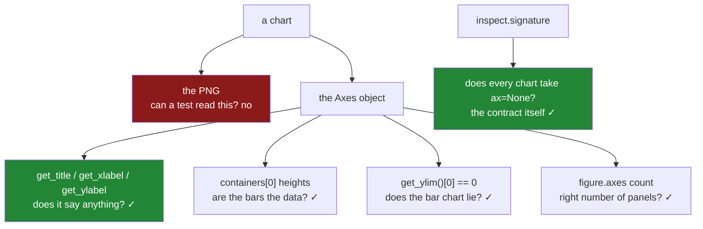

# 6.2 — Testing a chart without looking

## One-line answer

Nobody can look at a picture in CI, so every assertion is on the **objects** a chart is made of — the
title text, the bar heights, the axis limits, the number of panels — which is possible only because
[6.1](6.1-the-figures-module.md)'s functions return the axes rather than drawing into the void.

---

## The story

Somebody adds tests for the charts. They are reasonable tests: call each function, check it did not
raise, check a file was written and is not empty.

Green, and quick.

Then a refactor moves the labelling into a helper, and the helper is called before the bars are drawn
rather than after, so the y label is set and then overwritten with an empty string. Every test passes.
The file is still written. It is still not empty.

The chart in the monthly report now has an unlabelled y axis, and the numbers on it could be pounds,
pence or kilograms. Nobody notices for two months, because the person who reads the report knows what
the chart means and fills the label in from memory.

The tests were never wrong. They asserted that a picture was produced, and a picture was produced. What
they never asserted is that the picture **says anything**.

---

## The idea in plain language

A chart's correctness is not in the image file. It is in a handful of facts that can each be read off
the objects:

- The bars are the **heights of the data that went in**.
- The axis says **what the numbers are** and in what unit.
- A bar chart's y axis **starts at zero**.
- A grid has **as many panels as were asked for**.
- The file was written and is not empty.

Every one of those is a value on an `Axes` or a `Figure`, and every one can be asserted without
rendering anything to look at. That is the whole technique, and it works because
[6.1](6.1-the-figures-module.md)'s functions return the axes.

**The getters worth knowing**, because they are the vocabulary of every test in this file:

| Question | Call |
|---|---|
| What does the title say? | `ax.get_title()` |
| What do the labels say? | `ax.get_xlabel()`, `ax.get_ylabel()` |
| How tall are the bars? | `[b.get_height() for b in ax.containers[0]]` |
| What are the bars called? | `[t.get_text() for t in ax.get_xticklabels()]` |
| Where does the axis start? | `ax.get_ylim()` |
| How many lines were drawn? | `len(ax.get_lines())` |
| How many panels? | `len(fig.axes)` |

**Two things that make these tests different from ordinary ones.**

*The backend must be non-interactive.* CI has no display, so a test that tries to open a window hangs
or crashes. `matplotlib.use("Agg")` at the top of the test file, before `pyplot` is imported
([5.1](../05-getting-it-out/5.1-backends-and-the-script-with-no-window.md)).

*The suite leaks figures like any other loop.* Every test that makes a chart leaves a figure open
([5.4](../05-getting-it-out/5.4-the-figures-you-never-closed.md)), so a hundred tests leave a hundred
figures and a warning nobody reads. A fixture closing them after each test is not tidiness; it is the
same bug the module exists to prevent, in the tests.

And the fixture itself needs a test — the vacuity rule from
[Day 33, 7.2](../../../day-33-text-and-time/parts/07-the-module/7.2-the-test-that-can-go-red.md). A
cleanup fixture that silently stops running leaves no symptom except a warning, so something has to
assert that it works.

**What not to test.** Not colours, not exact pixel positions, not the rendered image compared against a
stored one. Image comparison exists — matplotlib has a whole framework for it — and it is the right
tool for testing matplotlib itself. For testing *your charts* it is a maintenance sink: every font
update, every version bump and every platform difference produces a diff that has to be reviewed by
eye, and after the third false alarm the baselines get regenerated without being looked at. Assert the
facts that carry meaning; leave the pixels alone.

---

## Why Setu needs it

- **[6.1](6.1-the-figures-module.md)** is the module. This file is what stops its contract eroding —
  particularly the rule that every drawing function accepts `ax` and returns an `Axes`.
- **[5.4](../05-getting-it-out/5.4-the-figures-you-never-closed.md)**'s leak is asserted here, and the
  `quick_look` rep is graded by a test that counts open figures.
- **[4.1](../04-many-axes/4.1-a-grid-of-axes.md)**'s `squeeze` trap has a test, because it is the bug
  that appears only when a grid is resized.
- **Day 37** adds labels, tick formatting and a greyscale check, and every one of those is asserted the
  same way — on the objects. This file is the pattern that day extends.
- **Phase 6**'s reporting jobs are tested exactly like this, because a dashboard that renders is not the
  same as a dashboard that is right.
- **Day 35**'s gate runs the whole suite, so a vacuous chart test is a gate that passes a broken report.

---

## The mechanism

The fixture that stops the suite leaking, and the test that proves it works.

```python
"""Tests for setu.figures - every assertion is on an object, because CI cannot see the picture."""

import matplotlib

matplotlib.use("Agg")

import matplotlib.pyplot as plt
import pandas as pd
import pytest

from setu.figures import FigureError, new_figure, save, spend_by_aisle, weekly_total


@pytest.fixture(autouse=True)
def close_figures():
    """Close every figure after each test. Without this the suite leaks one per chart."""
    yield
    plt.close("all")


@pytest.fixture
def spend() -> pd.Series:
    return pd.Series([6.3, 7.1, 5.4], index=["dairy", "bakery", "dry goods"], name="spend")


def test_the_fixture_actually_closes_figures(spend: pd.Series) -> None:
    spend_by_aisle(spend)
    spend_by_aisle(spend)
    assert len(plt.get_fignums()) == 2, "two charts should have made two figures"
```

**Line by line:**

- `matplotlib.use("Agg")` is the **first thing in the file**, before `pyplot` is imported. The backend
  is chosen at that import, so putting it after does nothing and the suite hangs on a machine with no
  display ([5.1](../05-getting-it-out/5.1-backends-and-the-script-with-no-window.md)).
- `autouse=True` means the fixture runs for **every** test without being requested. That matters: a
  fixture you have to remember to ask for is a fixture that will be forgotten in the next test somebody
  adds, and the symptom — a warning at twenty figures — is invisible under pytest's captured output.
- The `yield` with nothing before it and `plt.close("all")` after is a teardown-only fixture. `"all"`
  is correct **here** and wrong in library code
  ([5.4](../05-getting-it-out/5.4-the-figures-you-never-closed.md)): a test owns every figure in the
  process, so closing them all is exactly right.
- `test_the_fixture_actually_closes_figures` is the odd one. It asserts figures are **open at the end
  of a test**, which sounds backwards — but if the fixture ran *during* the test the count would be
  zero, and if the fixture stopped running at all this test would still pass while every other test
  leaked. It pins the timing: cleanup happens after, not during.
- The assertion message says what should have happened, so a failure reads as a diagnosis.

Now the assertions that carry the day:

```python
def test_the_bars_are_the_data(spend: pd.Series) -> None:
    ax = spend_by_aisle(spend)
    heights = [bar.get_height() for bar in ax.containers[0]]
    labels = [tick.get_text() for tick in ax.get_xticklabels()]
    assert heights == pytest.approx(spend.tolist())
    assert labels == list(spend.index)


def test_the_chart_says_what_the_numbers_are(spend: pd.Series) -> None:
    ax = spend_by_aisle(spend)
    assert ax.get_title(), "no title"
    assert ax.get_xlabel(), "no x label"
    assert ax.get_ylabel(), "no y label"
    assert "GBP" in ax.get_ylabel(), f"no unit in {ax.get_ylabel()!r}"


def test_a_bar_chart_starts_at_zero(spend: pd.Series) -> None:
    ax = spend_by_aisle(spend)
    assert ax.get_ylim()[0] == 0


def test_the_grid_has_the_panels_asked_for() -> None:
    for rows, cols in [(1, 1), (1, 3), (2, 4)]:
        fig, axes = new_figure(rows, cols)
        assert axes.shape == (rows, cols)
        assert len(fig.axes) == rows * cols


def test_save_writes_a_file_and_closes_the_figure(spend: pd.Series, tmp_path) -> None:
    ax = spend_by_aisle(spend)
    path = save(ax.figure, tmp_path / "chart.png")
    assert path.exists() and path.stat().st_size > 0
    assert plt.get_fignums() == [], "save must close the figure it wrote"
```

**Line by line:**

- `ax.containers[0]` is the `BarContainer` — the group of bars from one `ax.bar()` call — and iterating
  it gives the individual rectangles. `get_height()` on each is the **value that was plotted**, which is
  the assertion that catches a chart drawing the wrong column.
- `pytest.approx` on the heights, because they come back as floats that have been through a scale
  ([Day 23, 2.6](../../../day-23-ufuncs-and-statistics/parts/02-statistics/2.6-float-summation-and-the-drift.md)).
- The tick labels are checked separately from the heights, because a bar chart with the right values and
  the wrong labels is a chart that says something false about which aisle is dearest.
- `assert ax.get_title()` uses **truthiness**, so it fails on an empty string as well as on a missing
  one. That is the story's bug: the label was set and then overwritten with `""`, which is present and
  says nothing.
- `"GBP" in ax.get_ylabel()` is the assertion most people leave out. A label saying `spend` passes the
  truthiness check and still does not say whether the number is pounds or pence
  ([Day 37, 1.2](../../../day-37-labels-and-chart-choice/parts/01-labels/1.2-the-unit-the-label-owes-you.md)).
- `ax.get_ylim()[0] == 0` pins the zero baseline on a bar chart. Exact equality is right here because
  the module sets it explicitly rather than computing it.
- The grid test loops over **three shapes**, and `(1, 1)` is the one that matters: with matplotlib's
  default `squeeze=True` it would return a bare `Axes` with no `.shape` at all, so this test is what
  catches somebody removing `squeeze=False` from `new_figure`
  ([4.1](../04-many-axes/4.1-a-grid-of-axes.md)).
- `tmp_path` is pytest's per-test temporary directory, so the test writes a real file and leaves nothing
  behind. Asserting `st_size > 0` catches the blank-PNG case from
  [6.1](6.1-the-figures-module.md)'s §*When it breaks*.
- `plt.get_fignums() == []` is the assertion that `save` closed what it wrote, and it is checked
  **inside** the test, before the fixture runs.

And the contract test, which is the one that keeps the module a module:

```python
import inspect

from matplotlib.axes import Axes

from setu import figures

DRAWING_FUNCTIONS = [figures.spend_by_aisle, figures.weekly_total]


@pytest.mark.parametrize("function", DRAWING_FUNCTIONS, ids=lambda f: f.__name__)
def test_every_drawing_function_accepts_an_axes(function) -> None:
    parameters = inspect.signature(function).parameters
    assert "ax" in parameters, f"{function.__name__} cannot be placed in a grid"
    assert parameters["ax"].default is None, f"{function.__name__}'s ax must default to None"


def test_drawing_on_a_given_axes_creates_no_figure(spend: pd.Series) -> None:
    fig, axes = new_figure(1, 2)
    before = len(plt.get_fignums())
    spend_by_aisle(spend, ax=axes[0, 0])
    weekly_total(pd.Index(["w1", "w2"]), pd.Series([3.0, 4.0]), ax=axes[0, 1])
    assert len(plt.get_fignums()) == before, "a function given an ax must not create a figure"
    assert isinstance(axes[0, 0], Axes)
    assert len(axes[0, 0].containers) == 1, "nothing was drawn on the panel"
```

**Line by line:**

- `inspect.signature` reads the **shape of the function** rather than its behaviour, which is the only
  way to assert a convention. This is the test that would have caught the two uncomposable functions in
  [6.1](6.1-the-figures-module.md)'s production story.
- Checking `default is None` as well as presence, because a function with `ax` as a *required*
  parameter cannot be called standalone and breaks the other half of the contract.
- `ids=lambda f: f.__name__` makes the parametrised test report as
  `test_every_drawing_function_accepts_an_axes[spend_by_aisle]` rather than `[function0]`, so a failure
  names the offender.
- `DRAWING_FUNCTIONS` is a list that has to be extended when a chart is added, which is a small
  maintenance cost and a deliberate one — adding a function to it is the moment somebody reads the
  contract.
- `test_drawing_on_a_given_axes_creates_no_figure` asserts the *other* half: given an axes, the function
  must not make a figure. Counting before and after is the whole test, and it is what stops a
  well-meaning `plt.figure()` creeping into a drawing function.
- `len(axes[0, 0].containers) == 1` confirms something was actually drawn on the **panel that was
  passed**, not somewhere else — the failure from [6.1](6.1-the-figures-module.md)'s §*When it breaks*
  where the chart went to its own figure and the grid stayed empty.



---

## When it breaks

**The mutations, watched rather than assumed:**

```text
$ uv run pytest tests/test_figures.py -q
..........                                                               [100%]
10 passed in 1.284s

# remove ax.set_ylabel(...) from spend_by_aisle
$ uv run pytest tests/test_figures.py -q
E       AssertionError: no y label
E       assert ''
..F.......                                                               [100%]
1 failed, 9 passed in 1.301s

# restore; remove squeeze=False from new_figure
$ uv run pytest tests/test_figures.py -q
E       AttributeError: 'Axes' object has no attribute 'shape'
....F.....                                                               [100%]
1 failed, 9 passed in 1.297s

# restore; remove plt.close(fig) from save
$ uv run pytest tests/test_figures.py -q
E       AssertionError: save must close the figure it wrote
E       assert [1] == []
.......F..                                                               [100%]
1 failed, 9 passed in 1.288s
```

**Three mutations, three specific failures, each naming the rule it broke.** That is what these tests
buy: not "something is wrong with the chart" but "the y label is empty", "the grid is not 2-D", "save
did not close".

Note the second one fails with an `AttributeError` rather than an assertion — `axes.shape` does not
exist on a bare `Axes`. That is still a good failure, because the test names the shape it expected in
the line above it, but it is a reminder that a test can go red for the right reason with the wrong
message.

**The test that passes on an empty chart:**

```text
$ uv run python -c "
import matplotlib
matplotlib.use('Agg')
import matplotlib.pyplot as plt
import os
fig, ax = plt.subplots()
fig.savefig('nothing.png')
print('did it raise?      no')
print('file exists?      ', os.path.exists('nothing.png'))
print('file non-empty?   ', os.path.getsize('nothing.png') > 0)
print('bars on the axes? ', len(ax.containers))
print('title says?       ', repr(ax.get_title()))
"
did it raise?      no
file exists?       True
file non-empty?    True
bars on the axes?  0
title says?        ''
```

**The first three checks are the ones from the story, and all three pass on a blank chart.** No
exception, a file on disk, a non-zero size — and nothing drawn and nothing labelled.

That is the whole argument for asserting on objects. "It produced a file" is a test of matplotlib, not
of your chart. The last two lines are the assertions that mean something, and they are no harder to
write.

**The fixture that stopped running:**

```text
$ uv run python -c "
import matplotlib
matplotlib.use('Agg')
import matplotlib.pyplot as plt
import warnings
with warnings.catch_warnings(record=True) as caught:
    warnings.simplefilter('always')
    for _ in range(40):
        plt.subplots()
    print('figures after 40 tests:', len(plt.get_fignums()))
    print('warnings raised       :', len(caught))
print('pytest captures warnings by default, so you see: nothing')
"
figures after 40 tests: 40
warnings raised       : 1
```

**Forty leaked figures and one warning, which pytest captures and does not show.** If `autouse=True`
were dropped from the fixture — or the fixture renamed and not requested — every test would leak and the
only signal is a warning inside captured output.

That is why `test_the_fixture_actually_closes_figures` exists. Without it there is nothing in the
repository that would notice, and the suite would slowly grow a memory problem that appears as CI
timeouts on the largest test run.

**The image comparison that fails for no reason:**

```text
$ uv run python -c "
import matplotlib
matplotlib.use('Agg')
import matplotlib.pyplot as plt
import hashlib
def digest():
    fig, ax = plt.subplots()
    ax.bar(['a', 'b'], [1, 2])
    fig.savefig('h.png')
    plt.close(fig)
    return hashlib.sha256(open('h.png', 'rb').read()).hexdigest()[:16]
print('run 1:', digest())
print('run 2:', digest())
print('matplotlib:', matplotlib.__version__, '- change any of this and the hash moves:')
print('  font version, freetype version, OS, dpi default, backend')
"
run 1: e7c85d7eff67e7ee
run 2: e7c85d7eff67e7ee
matplotlib: 3.11.1 - change any of this and the hash moves:
  font version, freetype version, OS, dpi default, backend
```

**Stable on one machine, and that is exactly the trap.** Two runs give the same bytes, so a
hash-comparison test looks like a robust idea and passes locally all afternoon.

It breaks the first time CI runs on a different OS, or a font package updates, or matplotlib bumps a
version — none of which changes whether the chart is *correct*. The team then either pins the entire
rendering stack, or regenerates the baseline whenever it fails, which means the test now approves
whatever the code currently does. Assert the title, the heights and the limits; those change only when
the meaning changes.

---

## In production

**What a professional writes instead of the teaching version.** The per-chart assertions become one
reusable check, so a new chart cannot be added without meeting the same bar:

```python
from matplotlib.axes import Axes


def assert_readable(ax: Axes, *, unit: str, zero_based: bool = True) -> None:
    """Every assertion a chart owes its reader, in one call."""
    assert ax.get_title().strip(), "chart has no title"
    assert ax.get_xlabel().strip(), "chart has no x label"
    assert ax.get_ylabel().strip(), "chart has no y label"
    assert unit in ax.get_ylabel(), f"unit {unit!r} missing from y label {ax.get_ylabel()!r}"
    assert ax.containers or ax.get_lines(), "nothing was drawn on this axes"
    if zero_based:
        assert ax.get_ylim()[0] == 0, f"y axis starts at {ax.get_ylim()[0]}, not zero"


@pytest.mark.parametrize(
    "draw",
    [
        lambda ax: spend_by_aisle(SPEND, ax=ax),
        lambda ax: weekly_total(WEEKS, TOTALS, ax=ax),
    ],
    ids=["spend_by_aisle", "weekly_total"],
)
def test_every_chart_is_readable(draw) -> None:
    _, axes = new_figure()
    draw(axes[0, 0])
    assert_readable(axes[0, 0], unit="GBP")
```

**Line by line:**

- `assert_readable` gathers the assertions **every** chart owes, so adding a chart means adding one line
  to the parametrise list rather than copying six assertions and quietly dropping one.
- `.strip()` before the truthiness check, so a label of `" "` fails. That is not paranoia — a label
  built by joining an empty unit onto an empty name produces exactly that.
- `ax.containers or ax.get_lines()` covers both bar charts and line charts with one check, which is what
  lets the same function serve every chart in the module. A chart with neither is blank.
- `zero_based` is a **parameter with a default**, because the zero baseline is right for bars and wrong
  for a line chart of a temperature or a percentage change
  ([Day 37, 2.4](../../../day-37-labels-and-chart-choice/parts/02-ticks-and-limits/2.4-the-axis-that-started-above-zero.md)).
  Making it a parameter forces each chart to say which it is rather than inheriting a rule that does not
  apply.
- The assertion messages carry the **actual value**, so a failure says `y axis starts at 4.2, not zero`
  rather than `assert 4.2 == 0`.
- `ids=[...]` on the parametrise, so a failing chart is named in the test output.

**What degrades at scale.** Chart tests are slower than ordinary ones, and the cost is where you would
not guess:

```text
one test
  new_figure() + draw                14 ms
  the object assertions               0.2 ms
  save() to tmp_path, dpi=150        62 ms
  a hash / image comparison         148 ms
a suite of 40 chart tests
  object assertions only              0.6 s
  every test also saving a file       3.1 s
  every test comparing an image       7.4 s
  without the closing fixture         0.6 s and 40 open figures
```

**Line by line:**

- **The assertions are free.** Two tenths of a millisecond, because reading a title off an object is an
  attribute lookup and nothing is rendered.
- **Rendering is the cost.** Saving a file is three hundred times the assertions, so a suite that saves
  in every test is five times slower than one that saves in the one test that is *about* saving. Assert
  on objects everywhere; render once.
- Image comparison is slower again and brings the fragility from §*When it breaks* with it.
- The last line is the leak: closing costs no measurable time and is the difference between ending
  clean and ending with forty figures. As in
  [5.4](../05-getting-it-out/5.4-the-figures-you-never-closed.md), it is never a trade-off.

The thing that degrades is **coverage of the contract**. `DRAWING_FUNCTIONS` and the parametrise list
are enumerations, and enumerations drift — a chart added in a hurry is not added to the list, so the
one test that would have caught its missing `ax` parameter never runs on it. The stronger form walks
the module: `inspect.getmembers(figures, inspect.isfunction)`, filtered to public names, so a new
function is covered the moment it exists. That is worth doing the first time somebody forgets.

**The failure that only appears with real data.** A team tested their dashboard charts by asserting the
PNG was written and non-empty. A currency migration changed an upstream column from pounds to pence,
and the charts kept rendering — same bars, same shape, values a hundred times larger, y label still
reading `spend`. Every test passed because every file was written. The error reached a board pack
before anybody questioned a figure. An assertion that the y label contained the unit, plus one that the
bar heights matched the input, would have failed at the first run after the migration — and the second
of those is three lines. The lesson is that a chart test which never reads a value is testing
matplotlib, not the report.

**The review comment a senior engineer leaves.** *"These tests assert the file exists and is non-empty,
which passes on a completely blank chart — I have attached one. Assert on the axes: title and both
labels non-empty, the unit in the y label, the bar heights equal to the input, and the y limit at zero.
And add the `autouse` closing fixture; this suite is leaking a figure per test and the warning is
inside pytest's captured output where nobody will see it."*

**The interview question.** *"How do you test a chart in CI, where nobody can look at it?"* By asserting
on the objects rather than the image: the title and axis labels are non-empty and carry the unit, the
bar heights equal the data that went in, a bar chart's y axis starts at zero, and the grid has the
number of panels requested. All of those are attribute reads on the `Axes`, which is why the plotting
functions return it. Then the follow-up that separates people who have maintained such a suite:
**why not compare the rendered image against a stored baseline?** Because it fails on font updates,
platform differences and version bumps — none of which change whether the chart is correct — so the
baselines end up being regenerated whenever the test goes red, at which point the test approves
whatever the code currently does. And remember the backend: `matplotlib.use("Agg")` before `pyplot` is
imported, plus a fixture closing every figure, or the suite hangs on a headless runner and leaks a
figure per test.

---

## Check yourself

```bash
uv run pytest tests/test_figures.py -q
```

Then break it on purpose, one change at a time, and record what happened:

```bash
# 1. remove ax.set_ylabel(...) from spend_by_aisle  -> expect 1 failure. Which test?
# 2. restore; remove squeeze=False from new_figure  -> expect 1 failure. What kind of error?
# 3. restore; remove plt.close(fig) from save       -> expect 1 failure
# 4. restore; remove autouse=True from the fixture  -> expect 0 failures. Why is that
#                                                      the most worrying result here?
uv run pytest tests/test_figures.py -q
```

Write the failure count for each into a `# Seen to fail:` comment in the test file. **The fourth one is
the point** — say what symptom it produces instead of a failure, and where that symptom goes.

**Answer out loud, without scrolling up:**

> Name three facts about a chart you can assert without rendering it. Then say why "the file exists and
> is not empty" is not a test of your chart, and why the closing fixture needs a test of its own.

---

**Next:** [`CHECKLIST.md`](../../CHECKLIST.md) — the definition of done for Day 36.
