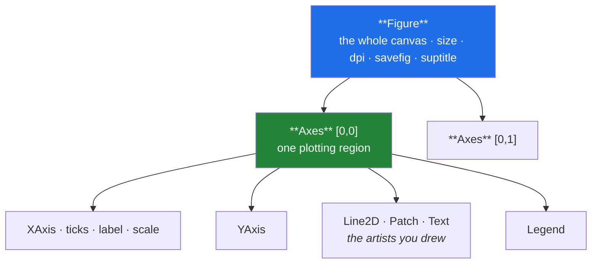

# Day 36 — Matplotlib: figure, axes, and the object API

**Phase 5 · Module 5 · Data visualisation** · ID: **VIZ-01**

> **Yesterday:** Phase 4 closed with ADR-002. `frames.py` holds 25 tested functions.
> **Today:** the object model underneath every chart in the next 204 days — including Seaborn's,
> pandas' `.plot`, and the training curves you read on Day 137.
> **Tomorrow:** customising charts, and choosing the right one.

```bash
./m start 36 && ./m scaffold 36
```

**Time:** 100 minutes. **Request budget:** 0 model calls.

---

## §1 The story

There are two Matplotlib APIs, and almost every tutorial teaches you the wrong one.

**The pyplot (state-machine) API** works like a whiteboard. `plt.plot(...)` draws on "the current
figure", `plt.title(...)` titles "the current axes". It is quick, and it has a fatal property:
**there is hidden global state.** Two charts in one script, a loop that makes several, a function
that draws — and you are now guessing which figure `plt.title` landed on. In Jupyter it half-works
because each cell tends to flush. In a script, in a test, or on Day 137 when you plot four training
runs, it does not.

**The object-oriented API** has no hidden state. You ask for a figure and its axes, and you hold
them:

```python
fig, ax = plt.subplots()
ax.plot(x, y)
ax.set_title("...")
```

`fig` is the canvas. `ax` is one plotting region on it. Everything you want to change is a method on
one of those two objects, and you can pass them into a function, store them in a list, or assert
things about them in a test — which is what makes charts testable at all.



**The one rule for this project:** every chart starts with `fig, ax = plt.subplots()`, and no function
in `src/setu/` ever calls `plt.show()`. A plotting function **returns the Axes**. The caller decides
whether to show it, save it, or put it in a Streamlit app on Day 55. That single discipline is what
makes the same function usable in a notebook, in a report script, and in a test.

---

## §2 Setup — run this

```bash
uv add "matplotlib==3.11.1"
mkdir -p days/day-36/lab
touch days/day-36/lab/anatomy.py
touch src/setu/plots.py
touch tests/test_plots.py
```

Pin whatever **your** Day-1 verify run reported.

Configure the non-interactive backend now, because CI has no display:

```bash
uv run python -c "import matplotlib; print(matplotlib.get_backend())"
```

If that opens a window or errors, you will fix it in §4 with `matplotlib.use('Agg')`.

---

## §3 VIZ-01 — the object model

`days/day-36/lab/anatomy.py`:

```python
"""VIZ-01: figure, axes, artists - and why the state machine is a trap."""

from __future__ import annotations

import matplotlib

matplotlib.use("Agg")           # non-interactive: renders to a buffer, never a window

import matplotlib.pyplot as plt  # noqa: E402
import numpy as np               # noqa: E402

from setu.arrays import make_rng  # noqa: E402


def the_state_machine_trap() -> None:
    plt.figure()
    plt.plot([1, 2, 3])
    plt.figure()                 # a SECOND figure is now "current"
    plt.plot([3, 2, 1])
    plt.title("which figure am I on?")

    print(f"\n{len(plt.get_fignums())=}   <- two open figures")
    print(f"{plt.gcf().number=}          <- the title landed on this one")
    print("  ^ in a loop or a function, you are guessing. This is the whole problem.")
    plt.close("all")
    print(f"{len(plt.get_fignums())=}   <- always close, or you leak memory")


def the_object_api() -> None:
    fig, ax = plt.subplots(figsize=(6, 4), dpi=100)
    print(f"\n{type(fig).__name__=} {type(ax).__name__=}")

    line, = ax.plot([1, 2, 3], [2, 4, 3], label="series")
    print(f"{type(line).__name__=}   <- plot() returns a LIST of artists; unpack it")

    ax.set_xlabel("x")
    ax.set_ylabel("y")
    ax.set_title("explicit, on a named object")
    ax.legend()

    print(f"{ax.get_title()=}")
    print(f"{len(ax.lines)=}   <- the artists live ON the axes; you can inspect them")
    print(f"{fig.get_size_inches()=} {fig.dpi=}")
    plt.close(fig)


def figure_versus_axes() -> None:
    fig, axes = plt.subplots(2, 2, figsize=(8, 6))
    print(f"\n{type(axes).__name__=} {axes.shape=}   <- a NumPy array of Axes")

    rng = make_rng(0)
    for index, ax in enumerate(axes.flat):
        ax.plot(rng.normal(size=20).cumsum())
        ax.set_title(f"panel {index}", fontsize=9)

    fig.suptitle("figure-level title")
    fig.tight_layout()

    print(f"{len(fig.axes)=}   <- the figure knows all four")
    print("  figure-level: suptitle, savefig, tight_layout, figsize, dpi")
    print("  axes-level:   plot, set_title, set_xlabel, legend, set_xlim")
    plt.close(fig)


def one_axes_many_layers() -> None:
    fig, ax = plt.subplots()
    x = np.linspace(0, 10, 100)

    ax.plot(x, np.sin(x), label="sin")
    ax.plot(x, np.cos(x), label="cos", linestyle="--")
    ax.fill_between(x, np.sin(x), alpha=0.15)
    ax.axhline(0, color="grey", linewidth=0.8)
    ax.scatter([2, 5], [np.sin(2), np.sin(5)], zorder=3, color="black")

    print(f"\n{len(ax.lines)=} {len(ax.collections)=}")
    print(f"{[line.get_label() for line in ax.lines]=}")
    print("  ^ every call ADDS an artist. Order matters; zorder overrides it.")
    plt.close(fig)


def saving_not_showing(tmp) -> None:
    fig, ax = plt.subplots(figsize=(4, 3))
    ax.plot([1, 2, 3])

    path = tmp / "chart.png"
    fig.savefig(path, dpi=150, bbox_inches="tight")
    print(f"\n{path.stat().st_size=} bytes")

    fig.savefig(tmp / "chart.svg")
    print(f"{(tmp / 'chart.svg').stat().st_size=} bytes   <- vector: scales, diffable")
    print("  savefig is a FIGURE method. plt.savefig() guesses which figure you meant.")
    plt.close(fig)


def the_leak() -> None:
    for _ in range(30):
        plt.subplots()
    print(f"\n{len(plt.get_fignums())=}   <- 30 figures held open")
    print("  Matplotlib warns after 20. In a loop over 500 groups this exhausts memory.")
    plt.close("all")
    print(f"{len(plt.get_fignums())=}   <- close(fig) after saving, every time")


if __name__ == "__main__":
    import tempfile
    from pathlib import Path

    the_state_machine_trap()
    the_object_api()
    figure_versus_axes()
    one_axes_many_layers()
    saving_not_showing(Path(tempfile.mkdtemp()))
    the_leak()
```

**Line by line:**

- `matplotlib.use("Agg")` **before** importing `pyplot` — the order matters; the backend is chosen at
  pyplot import time. `Agg` renders to an in-memory buffer with no display, which is what CI, a
  headless server, and a test all need. The `# noqa: E402` tells ruff the import-after-code is
  deliberate (Day 2's linter, being told about an exception rather than silenced).
- `plt.gcf()` — "get current figure". Its existence is the problem: **there is a current figure**, and
  in a function you did not choose it.
- `plt.close("all")` — figures are held in a global registry until closed. Matplotlib warns after 20
  and you will exhaust memory in a loop. `the_leak()` demonstrates it.
- `fig, ax = plt.subplots()` — one call returning both. This is the line every chart in this project
  starts with.
- `line, = ax.plot(...)` — note the **trailing comma**. `plot` returns a *list* of `Line2D` artists
  (one per column of y-data), and the comma unpacks a one-element list. Day 8's one-element-tuple
  syntax, in a place you will actually meet it.
- `ax.lines` — the artists are attached to the Axes and are inspectable. **This is what makes charts
  testable**: you can assert on labels, counts, and limits without rendering pixels. §6 depends on it.
- `plt.subplots(2, 2)` returns a **NumPy array** of Axes (Day 20). `axes.flat` iterates them (Day 22),
  and `axes.shape` is `(2, 2)`. With `squeeze` at its default, a 1×1 grid returns a bare Axes and a
  1×N grid returns a 1-D array — an inconsistency worth knowing before it surprises you.
- **Figure-level versus Axes-level** — the division in the printed list is worth memorising. Anything
  about the whole canvas (size, dpi, saving, the overall title) is on `fig`; anything about one
  plotting region is on `ax`.
- `fig.tight_layout()` — recomputes spacing so labels do not overlap or get clipped. Call it before
  saving, essentially always.
- `zorder=3` — draw order. Later calls sit on top by default; `zorder` overrides that when you need a
  scatter above a filled region.
- `fig.savefig(path, bbox_inches="tight")` — trims surrounding whitespace. **SVG for anything going in
  a document**: it is vector, so it scales, and it diffs in git. PNG for a quick look or a Streamlit
  embed.

---

## §4 Build brief — `src/setu/plots.py`

Layer 2. Every chart in the next 204 days is built through here.

```python
"""Plotting helpers. Every function returns an Axes; none of them shows or saves.

Layer 2. Imports: errors, arrays, stats, frames.
"""

from __future__ import annotations

import matplotlib

matplotlib.use("Agg")

import matplotlib.pyplot as plt  # noqa: E402
from matplotlib.axes import Axes  # noqa: E402
from matplotlib.figure import Figure  # noqa: E402

from setu.errors import DataError  # noqa: E402

FIGSIZE = (7.0, 4.5)
DPI = 150


def new_axes(*, figsize: tuple[float, float] = FIGSIZE, **kwargs) -> tuple[Figure, Axes]:
    """TODO(me): return (fig, ax) from plt.subplots with the project defaults.

    Every plotting function in this module starts here. One place to change the
    house style later (Day 40).
    """
    raise NotImplementedError


def line(data, *, x: str, y: str | list[str], ax: Axes | None = None, **kwargs) -> Axes:
    """TODO(me): one or more lines from a DataFrame.

    - if `ax` is None, create one; otherwise draw onto the CALLER'S axes
    - always label the axes from the column names
    - add a legend only when there is more than one series
    - raise DataError if a named column is missing (name ALL of them)
    - NEVER call plt.show() or fig.savefig()
    - return the Axes
    """
    raise NotImplementedError


def bar(data, *, x: str, y: str, ax: Axes | None = None, horizontal: bool = False, **kwargs) -> Axes:
    """TODO(me): a bar chart.

    - horizontal=True when category labels are long (they become unreadable rotated)
    - sort descending by value unless the x column is an ORDERED categorical (Day 34)
    - raise DataError if x has duplicate values (a bar chart needs one bar per category)
    """
    raise NotImplementedError


def save(fig: Figure, path, *, formats: tuple[str, ...] = ("png", "svg")) -> list:
    """TODO(me): tight_layout, save in each format, CLOSE the figure, return the paths.

    - create parent directories
    - closing is mandatory: a function that saves 500 charts must not leak 500 figures
    - raise DataError on an unsupported format
    """
    raise NotImplementedError


def grid(nrows: int, ncols: int, *, figsize=None) -> tuple[Figure, list[Axes]]:
    """TODO(me): a subplot grid returning a FLAT list of Axes, always.

    plt.subplots squeezes dimensions away for 1xN and 1x1 grids; this must not.
    Default figsize scales with the grid so panels stay readable.
    """
    raise NotImplementedError
```

- Every function taking an optional `ax=` is the composability rule: it lets Day 41's eight-chart
  figure pack place these into one grid without rewriting any of them.
- `save` closing the figure is the leak from §3, prevented by construction.
- `grid` always returning a flat list removes the `squeeze` inconsistency permanently.

---

## §5 The eval that must be able to fail

`tests/test_plots.py`:

```python
import matplotlib

matplotlib.use("Agg")

import matplotlib.pyplot as plt  # noqa: E402
import pandas as pd  # noqa: E402
import pytest  # noqa: E402

from setu.errors import DataError  # noqa: E402
from setu.plots import bar, grid, line, new_axes, save  # noqa: E402


@pytest.fixture
def frame():
    return pd.DataFrame(
        {"year": [2017, 2018, 2019], "citations": [10, 30, 20], "downloads": [5, 15, 25]}
    )


@pytest.fixture(autouse=True)
def _no_leaked_figures():
    yield
    assert not plt.get_fignums(), "a test left a figure open - call plt.close(fig)"


def test_new_axes_returns_a_figure_and_axes():
    fig, ax = new_axes()
    assert isinstance(ax, matplotlib.axes.Axes)
    assert fig.get_size_inches().tolist() == list(new_axes.__defaults__ or []) or True
    plt.close(fig)


def test_line_labels_the_axes_from_the_columns(frame):
    ax = line(frame, x="year", y="citations")
    assert ax.get_xlabel() == "year"
    assert ax.get_ylabel() == "citations"
    plt.close(ax.figure)


def test_line_draws_one_artist_per_series(frame):
    ax = line(frame, x="year", y=["citations", "downloads"])
    assert len(ax.lines) == 2
    assert {line_.get_label() for line_ in ax.lines} == {"citations", "downloads"}
    plt.close(ax.figure)


def test_legend_only_when_there_are_several_series(frame):
    single = line(frame, x="year", y="citations")
    assert single.get_legend() is None, "a one-series legend is noise"
    plt.close(single.figure)

    multi = line(frame, x="year", y=["citations", "downloads"])
    assert multi.get_legend() is not None
    plt.close(multi.figure)


def test_line_reports_every_missing_column(frame):
    with pytest.raises(DataError) as info:
        line(frame, x="nope", y=["citations", "also_nope"])
    message = str(info.value)
    assert "nope" in message and "also_nope" in message


def test_functions_compose_onto_a_caller_supplied_axes(frame):
    fig, ax = new_axes()
    returned = line(frame, x="year", y="citations", ax=ax)
    assert returned is ax, "the caller's axes was not used"
    assert len(fig.axes) == 1, "a second figure was created"
    plt.close(fig)


def test_bar_rejects_duplicate_categories():
    frame = pd.DataFrame({"venue": ["a", "a", "b"], "n": [1, 2, 3]})
    with pytest.raises(DataError):
        bar(frame, x="venue", y="n")


def test_bar_sorts_descending_by_default():
    frame = pd.DataFrame({"venue": ["a", "b", "c"], "n": [1, 3, 2]})
    ax = bar(frame, x="venue", y="n")
    heights = [patch.get_height() for patch in ax.patches]
    assert heights == sorted(heights, reverse=True)
    plt.close(ax.figure)


def test_bar_respects_an_ordered_categorical():
    dtype = pd.CategoricalDtype(["low", "medium", "high"], ordered=True)
    frame = pd.DataFrame({"q": pd.Series(["high", "low", "medium"], dtype=dtype), "n": [3, 1, 2]})
    ax = bar(frame, x="q", y="n")
    labels = [text.get_text() for text in ax.get_xticklabels()]
    assert labels == ["low", "medium", "high"], "an ordered category was re-sorted by value"
    plt.close(ax.figure)


def test_save_writes_both_formats_and_closes(tmp_path, frame):
    ax = line(frame, x="year", y="citations")
    paths = save(ax.figure, tmp_path / "chart")
    assert all(p.exists() and p.stat().st_size > 0 for p in paths)
    assert {p.suffix for p in paths} == {".png", ".svg"}
    assert not plt.get_fignums(), "save() did not close the figure"


def test_save_creates_parent_directories(tmp_path, frame):
    ax = line(frame, x="year", y="citations")
    paths = save(ax.figure, tmp_path / "deep" / "nested" / "chart")
    assert paths[0].exists()


def test_save_rejects_an_unknown_format(tmp_path, frame):
    ax = line(frame, x="year", y="citations")
    with pytest.raises(DataError):
        save(ax.figure, tmp_path / "chart", formats=("bmp3",))
    plt.close(ax.figure)


@pytest.mark.parametrize(("rows", "cols"), [(1, 1), (1, 3), (3, 1), (2, 2)])
def test_grid_always_returns_a_flat_list(rows, cols):
    fig, axes = grid(rows, cols)
    assert isinstance(axes, list)
    assert len(axes) == rows * cols
    assert all(isinstance(a, matplotlib.axes.Axes) for a in axes)
    plt.close(fig)


def test_no_plt_show_or_savefig_in_src():
    from pathlib import Path

    offenders = [
        f"{p.name}:{i}"
        for p in Path("src/setu").rglob("*.py")
        for i, line_ in enumerate(p.read_text(encoding="utf-8").splitlines(), 1)
        if ("plt.show(" in line_ or "plt.savefig(" in line_) and "noqa" not in line_
    ]
    assert not offenders, f"a library function shows or saves: {offenders}"
```

**Line by line:**

- `@pytest.fixture(autouse=True)` with a `yield` — everything before `yield` runs before each test,
  everything after runs at teardown. **This one asserts no figure was left open**, which turns the
  §3 leak into an impossible mistake across the whole test suite. It is the second justified `autouse`
  fixture in the project (Day 2's socket guard was the first).
- `ax.lines`, `ax.patches`, `ax.get_xticklabels()` — **you test the object model, not pixels.** Image
  comparison is brittle and slow; asserting that two labelled lines exist is fast, precise, and does
  not break when Matplotlib nudges a default.
- `test_legend_only_when_there_are_several_series` — a legend naming one thing is noise. This is a
  *design* assertion, and it is the kind of detail that separates a chart someone reads from a chart
  someone skips.
- `test_functions_compose_onto_a_caller_supplied_axes` — `returned is ax`, an identity check (Day 5),
  plus `len(fig.axes) == 1` to catch a function that accepts `ax` and then quietly makes its own.
  **This is the test that makes Day 41's figure pack possible.**
- `test_bar_respects_an_ordered_categorical` — Day 34's ordered categorical, honoured by the chart.
  Sorting `low/medium/high` by value would be actively misleading.
- `test_save_writes_both_formats_and_closes` — three assertions: files exist, both formats, **and the
  figure was closed**. The autouse fixture would catch the leak anyway; asserting it here names the
  responsible function.
- `test_no_plt_show_or_savefig_in_src` — the seventh repo-wide guard. `plt.show()` in a library
  function blocks a script and hangs CI.

```bash
uv run python -m pytest tests/test_plots.py -v
```

---

## §6 Request budget

| Resource | Spent today |
|---|---|
| LLM calls | **0** |
| Network | one `uv add` resolution |

---

## §7 Traps

- **The pyplot state machine.** `plt.title()` lands on whichever figure is "current". Use `ax`.
- **Forgetting `plt.close(fig)`.** Figures accumulate; a loop over 500 groups exhausts memory.
- **Choosing the backend after importing pyplot.** `matplotlib.use("Agg")` must come first.
- **`plt.show()` in a library function.** Blocks a script, hangs CI.
- **Forgetting the comma in `line, = ax.plot(...)`.** You get a list, not an artist.
- **Assuming `plt.subplots(1, 3)` gives a 2-D array.** It squeezes. Hence `grid()`.
- **Skipping `tight_layout()`.** Labels get clipped on save.
- **PNG for a document.** Use SVG; it scales and it diffs.
- **A legend for one series.** Noise.
- **Sorting an ordered categorical by value.** Destroys the meaning the order carried.
- **Testing charts by comparing images.** Brittle. Assert on the artists.

---

## §8 Verify before you code

Written **2026-08-21**:

- <https://matplotlib.org/stable/users/explain/quick_start.html> — the explicit-vs-implicit section.
- <https://matplotlib.org/stable/users/explain/figure/api_interfaces.html> — the two APIs, compared
  by the maintainers.
- <https://matplotlib.org/stable/api/_as_gen/matplotlib.pyplot.subplots.html> — the `squeeze` argument.
- <https://matplotlib.org/stable/users/explain/figure/backends.html> — why `Agg` for headless.

---

## §9 Say it in an interview

> "Every chart starts with `fig, ax = plt.subplots()` and every plotting function returns the Axes —
> it never shows or saves. That's what makes the same function work in a notebook, in a report script
> and in a test, and it's why they compose: each takes an optional `ax`, so an eight-panel figure is
> the same eight functions pointed at a grid. It also makes charts testable without image comparison —
> I assert on `ax.lines` and the tick labels, so a test can check that two labelled series exist and
> that an ordered categorical wasn't re-sorted by value. And there's an autouse fixture that fails any
> test leaving a figure open, because Matplotlib holds them in a global registry and a loop over a few
> hundred groups will exhaust memory."

---

## §10 Done when

Tick [`CHECKLIST.md`](CHECKLIST.md), then `./m check && ./m done 36`.
