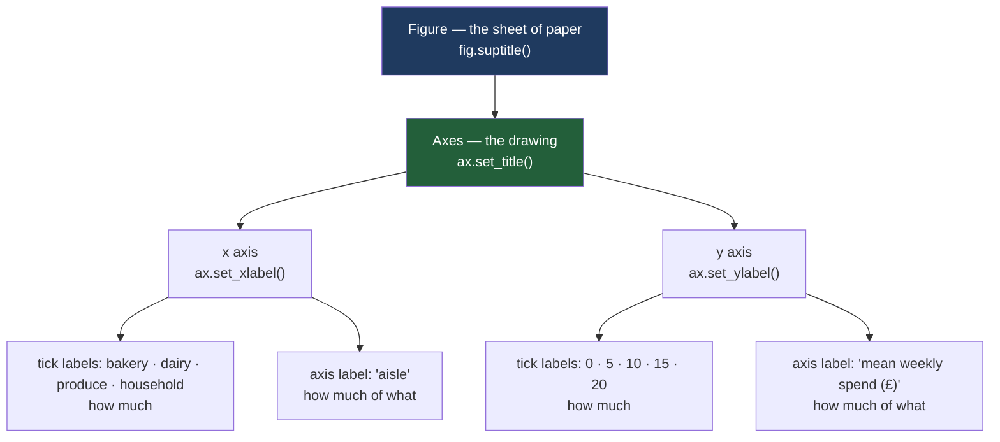

# 1.1 — The chart that never said what the numbers were

## One-line answer

A chart arrives with **three empty strings** where its x label, y label and title should be, and
until you fill them in with `set_xlabel`, `set_ylabel` and `set_title`, the picture is a shape that
nobody but you can read.

---

## The story

Somebody in the flat gets tired of arguing about the shopping and makes a chart.

Twelve weeks of receipts, four columns on the till slip — bakery, dairy, produce and household —
and a bar for each. It takes about six lines of code. The bars come out clean and blue and roughly
the right heights, and it looks like the sort of thing that settles an argument.

They send a screenshot to the group chat.

The first reply is: **"22 what?"**

The second reply is: "is that the whole twelve weeks or one week?"

The third is: "which bar is household, the third or the fourth?"

The chart is not wrong. Every bar is exactly as tall as the arithmetic says it should be. It is
simply that the person who made it already knew what the numbers were, and the picture never says.
The tallest bar is 21.64, and 21.64 could be pounds, could be items, could be a percentage, could be
a twelve-week total, could be a weekly average. The chart has an opinion about none of it.

So the argument about the shopping is now an argument about the chart, which is worse, because at
least the receipts were unambiguous.

---

## The idea in plain language

A **chart** is a picture in which distances stand for numbers. A bar twice as tall means a number
twice as big. That is the whole trick, and it only works if the reader knows two things that the
picture cannot show on its own: what the numbers *are*, and what the positions *mean*.

Those two things are carried by **labels** — short pieces of text that sit beside the drawing and
name what it shows. There are three of them, and they answer three different questions.

The **x label** sits under the horizontal axis and names what changes as you move left to right.
Here that is the aisle: bakery, dairy, produce, household. The **y label** sits beside the vertical
axis, usually turned on its side, and names what the heights measure. The **title** sits above
everything and says what the reader is meant to take away.

An **axis** is one of the two rulers along the edges of the drawing. The horizontal one is the
x axis, the vertical one is the y axis. A **tick** is one of the small marks on a ruler, and a
**tick label** is the number printed next to it. The tick labels tell you *how much*; the axis label
tells you *how much of what*. Both are needed. A ruler with numbers and no unit is exactly as
useless as a ruler with a unit and no numbers.

The important thing about all three labels is that **matplotlib will not invent them.** It starts
every chart with the three of them set to the empty string, `""` — a piece of text with no
characters in it. An empty string draws as nothing at all, so the chart looks finished when it is
not. There is no warning, no placeholder, no faint grey "untitled". The picture simply comes out
mute, and mute is very hard to notice when you are the person who already knows the answer.

That last sentence is the whole part. **You cannot see your own missing label**, because your eye
supplies it from memory. Somebody else's eye does not.

---

## Why Setu needs it

- **[1.2](1.2-the-unit-the-label-owes-you.md)** is the next question a labelled axis raises: the
  label says *spend*, but spend in what, and per what? A label without a unit is only half a label.
- **[1.3](1.3-a-title-that-states-the-finding.md)** is the title done properly — not "spend by
  aisle", which repeats the axes, but the sentence the chart exists to prove.
- **[5.1](../05-saving-for-print/5.1-the-greyscale-test-you-can-run.md)** checks that a saved chart
  survives a black-and-white printer. A chart that never said what its numbers were fails that check
  in colour too.
- **[8.1](../08-the-module/8.1-the-charts-module.md)** turns this into a function that cannot forget:
  `label(ax, x=..., y=..., unit=...)`, where `unit` has no default value, so leaving it out is a
  `TypeError` rather than a silent omission.
- **Day 41** is this phase's gate — an eight-chart pack. Eight charts is exactly the number at which
  "I will label them at the end" stops being true.

---

## The mechanism

Twelve weeks of the flat's shopping, four aisles, built from one seed so that your numbers and this
page's numbers are the same:

```python
import matplotlib
import numpy as np
import pandas as pd

matplotlib.use("Agg")
import matplotlib.pyplot as plt


def weekly_spend() -> pd.DataFrame:
    """Twelve weeks of the flat's shopping, four aisles, in pounds."""
    rng = np.random.default_rng(37)
    columns = {}
    steady = [("bakery", 9.0, 1.5), ("dairy", 18.0, 2.0), ("produce", 22.0, 2.5)]
    for aisle, centre, spread in steady:
        columns[aisle] = np.round(rng.normal(centre, spread, 12), 2)
    household = np.empty(12)
    household[0::2] = rng.normal(5.0, 1.0, 6)
    household[1::2] = rng.normal(37.5, 3.0, 6)
    columns["household"] = np.round(household, 2)
    return pd.DataFrame(columns, index=pd.RangeIndex(1, 13, name="week"))


spend = weekly_spend()
print(spend.mean().round(2).to_dict())
```

**Line by line:**

- `matplotlib.use("Agg")` **before** `import matplotlib.pyplot` chooses the **backend** — the thing
  that turns a figure into pixels. `Agg` writes into a file and never opens a window, which is what
  you want on a server, in a test, and any time you would rather not have a window steal focus. It
  has to come first because importing `pyplot` picks a backend if none has been chosen.
- `np.random.default_rng(37)` is the seeded generator from
  [Day 20, 4.1](../../../day-20-arrays-and-dtypes/parts/04-random/4.1-default-rng-the-generator.md).
  The seed is the day number, so every number on this page is reproducible on your machine.
- `steady` holds three aisles as `(name, centre, spread)`. Each gets twelve weekly figures drawn
  around its centre. Bakery hovers near £9, dairy near £18, produce near £22.
- `household` is built differently **on purpose**. The even-numbered slots get a quiet week near £5;
  the odd-numbered slots get a big restock near £37.50. `[0::2]` is every other element starting at
  the first, `[1::2]` every other starting at the second
  ([Day 21, 1.5](../../../day-21-indexing-and-views/parts/01-one-element/1.5-the-step-and-the-reverse.md)). The
  flat does a big household shop roughly every other week, which is an ordinary thing to do and the
  reason this whole day exists.
- `np.round(..., 2)` because money has two decimal places, and a chart of `18.032184...` is a chart
  of noise.
- `pd.RangeIndex(1, 13, name="week")` labels the rows 1 to 12 and **names the index** `week`. The
  name is not decoration: [1.2](1.2-the-unit-the-label-owes-you.md) uses it, and
  [8.1](../08-the-module/8.1-the-charts-module.md) reads it to fill an axis label automatically.

```text
{'bakery': 8.84, 'dairy': 18.01, 'produce': 21.62, 'household': 21.64}
```

Now the chart that started the argument, and a way of asking it what it says:

```python
means = spend.mean()
fig, ax = plt.subplots(figsize=(6, 3.5))
ax.bar(means.index, means.to_numpy())


def missing_labels(ax: plt.Axes) -> list[str]:
    """The places this chart has left blank."""
    said = {"x axis": ax.get_xlabel(), "y axis": ax.get_ylabel(), "title": ax.get_title()}
    return [where for where, text in said.items() if not text]


print("missing:", missing_labels(ax))
```

**Line by line:**

- `fig, ax = plt.subplots()` is the split you met on **Day 36**: the **figure** is the sheet of
  paper, the **axes** is the one drawing on it. Everything in this part is a method on `ax`, because
  labels belong to the drawing rather than to the paper.
- `figsize=(6, 3.5)` is stated rather than inherited. Every default matplotlib has is a decision
  somebody else made, and figure size is the one that changes how much room the labels get
  ([2.1](../02-ticks-and-limits/2.1-where-the-ticks-go.md)).
- `ax.bar(means.index, means.to_numpy())` draws one bar per aisle. `means.index` is the four aisle
  names; `.to_numpy()` hands over the heights as a plain array so that matplotlib never has to guess
  what a pandas object means.
- `ax.get_xlabel()` and friends **read back** what the chart currently says. They exist, they are
  cheap, and almost nobody calls them — which is why the check below is worth writing down.
- `if not text` is true for the empty string, so the list comprehension collects exactly the places
  that are blank. This is the seed of the test in
  [8.2](../08-the-module/8.2-the-test-that-can-go-red.md).

```text
missing: ['x axis', 'y axis', 'title']
```

**All three.** The chart drew perfectly and said nothing.

Fill them in:

```python
ax.set_xlabel("aisle")
ax.set_ylabel("mean weekly spend (£)")
ax.set_title("Household costs as much as produce on an average week", loc="left")
print("missing:", missing_labels(ax))
print("left title  :", ax.get_title(loc="left"))
print("centre title:", repr(ax.get_title()))
```

**Line by line:**

- `set_xlabel("aisle")` names what moves along the bottom. One word is enough here because the tick
  labels underneath already spell out the four aisles; the axis label says what *kind* of thing they
  are.
- `set_ylabel("mean weekly spend (£)")` does three jobs at once: it says the numbers are a **mean**,
  it says the mean is **per week**, and it says the unit is **pounds**.
  [1.2](1.2-the-unit-the-label-owes-you.md) is entirely about why all three are needed.
- `loc="left"` puts the title against the left edge rather than centred. A left-aligned title starts
  where the reader's eye already is, and it can be a sentence without looking odd.
- `ax.get_title()` with no argument reads the **centre** title, and the centre title is still empty —
  so `missing_labels` still reports it. That is a real trap and it is explained under *When it
  breaks* below.

```text
missing: ['title']
left title  : Household costs as much as produce on an average week
centre title: ''
```

Where the three labels live:



**Two levels, two owners.** The figure owns `suptitle`; the axes owns everything else. Getting that
wrong is the commonest way a title ends up in the wrong place on a multi-panel figure.

---

## When it breaks

**The title that is there and is not there:**

```text
$ uv run python -c "
import matplotlib
matplotlib.use('Agg')
import matplotlib.pyplot as plt
fig, ax = plt.subplots()
ax.set_title('Household costs as much as produce', loc='left')
print('get_title()            :', repr(ax.get_title()))
print(\"get_title(loc='left')  :\", repr(ax.get_title(loc='left')))
print('the three slots        :', [ax.get_title(loc=w) for w in ('left', 'center', 'right')])
"
```

```text
get_title()            : ''
get_title(loc='left')  : 'Household costs as much as produce'
the three slots        : ['Household costs as much as produce', '', '']
```

**What it means.** An axes has **three** title slots, not one: left, centre and right. `set_title`
writes into the slot you name and `get_title` reads from the slot you name, and both default to
`center`. Set a left title and then ask for "the title" and you get back an empty string, which
makes an automated check report a chart as unlabelled when it is labelled fine.

**The smallest fix** is to say which slot you mean on both sides — write `loc="left"` in the setter
and pass the same `loc` to the getter. In
[8.1](../08-the-module/8.1-the-charts-module.md) the module settles this once, so no caller has to
remember.

**The label that vanished off the bottom of the file:**

```text
$ uv run python -c "
import matplotlib
matplotlib.use('Agg')
import matplotlib.pyplot as plt
import tempfile, pathlib
fig, ax = plt.subplots(figsize=(3, 2))
ax.bar(['bakery', 'dairy', 'produce', 'household'], [8.84, 18.01, 21.62, 21.64])
ax.set_xlabel('aisle')
fig.canvas.draw()
box = ax.xaxis.get_label().get_window_extent()
print('figure is', fig.bbox.height, 'px tall')
print('x label sits at y =', round(box.y0, 1), 'to', round(box.y1, 1))
print('inside the figure?', box.y0 >= 0)
"
```

```text
figure is 200.0 px tall
x label sits at y = -22.0 to -7.6
inside the figure? False
```

**What it means.** On a small figure the tick labels and the axis label need more room than
matplotlib left them, so the axis label is positioned **entirely below the bottom edge of the
figure** — both ends of its box are negative. Nothing raises. The file is written, the chart looks
almost right, and the word "aisle" is not in it at all.

**The smallest fix** is `fig.savefig(path, bbox_inches="tight")`, which measures everything that was
drawn and grows the saved image to fit it
([5.3](../05-saving-for-print/5.3-dpi-and-the-label-that-got-cut-off.md)). The next smallest is
`plt.subplots(layout="constrained")`, which does the arithmetic before drawing rather than after
([2.4](../02-ticks-and-limits/2.4-the-axis-that-started-above-zero.md) uses it).

---

## In production

**What a professional writes instead of the teaching version.** Not three loose `set_*` calls at the
bottom of a script, but one call that cannot be half-done:

```python
def label(ax, *, x: str, y: str, unit: str, title: str | None = None):
    """Label both axes. `unit` has no default on purpose."""
    if not unit.strip():
        raise ValueError("unit is empty - an axis of bare numbers does not say what it counts")
    ax.set_xlabel(x)
    ax.set_ylabel(f"{y} ({unit})")
    if title is not None:
        ax.set_title(title, loc="left")
    return ax
```

**Line by line:**

- `*` after `ax` makes every remaining argument **keyword-only**, so a caller writes
  `label(ax, x="aisle", y="mean weekly spend", unit="£")` and cannot silently swap two strings
  ([Day 10, 1.5](../../../day-10-functions/parts/01-the-signature/1.5-keyword-only-and-positional-only.md)).
- `unit: str` with **no default value** is the entire design. Python raises `TypeError` on a missing
  required argument, which turns "I forgot the unit" from a thing a reviewer has to notice into a
  thing the interpreter notices.
- `unit.strip()` catches `unit=" "`, which is the obvious way round the check and therefore the way
  somebody will find.
- `f"{y} ({unit})"` builds the label in one place, so every chart in the project puts its unit in
  brackets in the same position, and a reader who has seen one has seen all of them.
- `return ax` so the call can be chained with the other furniture functions in
  [8.1](../08-the-module/8.1-the-charts-module.md).

**What degrades at scale.** Labels are cheap to add and expensive to keep true. A chart labelled
"mean weekly spend (£)" that later gets its data source swapped for a monthly extract is now
**confidently wrong**, and confidently wrong is worse than blank, because a blank axis makes a reader
ask and a mislabelled one does not. The defence is to derive the label from the same place as the
data — the frame's index name, the column's metadata, the unit column in the source table — rather
than typing it as a literal that only a human can keep in step.

**The failure that only shows with real data.** A dashboard panel was labelled "revenue (£)". The
underlying query changed to return revenue in pence, because pence are integers and integers are
easier to sum exactly. The chart's shape was identical — every bar grew by the same factor of one
hundred, so the *ranking* was unchanged and nobody's intuition tripped. The y tick labels went from
"20" to "2000", and everyone read that as a very good quarter. It was caught six weeks later by
somebody who happened to know one of the numbers by heart.

**The review comment a senior engineer leaves.** *"Three `set_` calls at the end of the function and
none of them is tested. Put the labelling behind a helper that takes the unit as a required
argument, and add an assertion in the figure test that `ax.get_ylabel()` is non-empty. A chart with
no y label should fail CI in the same way an unformatted file does."*

**The interview question.** *"What is the first thing you check on somebody else's chart?"* The
honest answer is the axis labels, and the reason is worth saying out loud: **the person who made the
chart is the one person who cannot tell whether it is readable**, because their eye fills in the
missing label from memory. So the check has to be mechanical — read the three strings back, or hand
the picture to somebody who has not seen the data. The follow-up is usually *"what does matplotlib do
if you don't set them?"*, and the answer is the point of this part: nothing. Not a warning, not a
placeholder. Three empty strings that draw as nothing and look exactly like a finished chart.

---

## Check yourself

```bash
uv run --with 'matplotlib==3.11.1' python -c "
import matplotlib
matplotlib.use('Agg')
import matplotlib.pyplot as plt
fig, ax = plt.subplots()
ax.bar(['bakery', 'dairy', 'produce', 'household'], [8.84, 18.01, 21.62, 21.64])
for name, value in [('x', ax.get_xlabel()), ('y', ax.get_ylabel()), ('title', ax.get_title())]:
    print(f'{name:6s} {value!r}')
ax.set_title('a title', loc='right')
print('after a right title, get_title() is', repr(ax.get_title()))
"
```

Three empty strings, then a fourth. Say which slot the fourth title went into, and why the last line
still prints `''`.

**Answer out loud, without scrolling up:**

> Name the three pieces of text matplotlib leaves blank on a new chart, and say what each one is
> for. Then say why the person who wrote the chart is the worst possible person to check whether it
> is labelled.

---

**Next:** [1.2 — The unit the label owes you](1.2-the-unit-the-label-owes-you.md).
