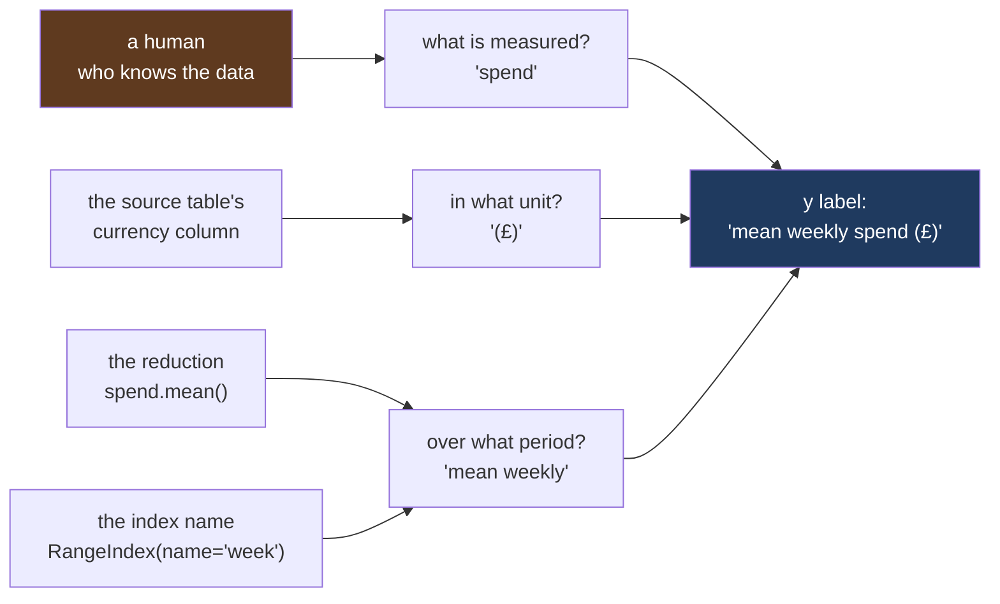

# 1.2 — The unit the label owes you

## One-line answer

A y label has to answer **three** questions — what is measured, in what unit, and over what period —
and `"spend"` answers one of them, which is why the group chat asks the other two back.

---

## The story

The chart from [1.1](1.1-the-chart-that-never-said-what-the-numbers-were.md) goes back into the
group chat with a word written down the side of it: **spend**.

It is better. Nobody asks "22 what?" any more, because the word is right there and everybody knows
the shopping is money. The argument moves on by exactly one step, and then it stops again:

> "Spend over the whole three months, or spend in a week?"

Which is a fair question, because the tallest bar says **21.64**, and the flat spends about £21.64
a week on the household aisle *and* about £259.71 over the twelve weeks. Both are true. Both are
"spend". One of them is twelve times the other, and the picture is identical either way, because the
heights only change together — the shape of the chart does not move when you multiply everything by
twelve.

So somebody guesses. They read it as the twelve-week figure, decide the flat is spending a fortune
on cleaning things, and suggest cutting it. The person who made the chart meant the weekly figure
and does not notice the misunderstanding, because they read their own chart correctly every time.

The word `spend` was not wrong. It was **incomplete**, and an incomplete label is worse than a blank
one, because a blank label makes people ask and an incomplete one makes people guess.

---

## The idea in plain language

A **label** is the short piece of text beside an axis that says what the numbers along that axis
are. An **axis** is one of the two rulers along the edges of a chart: the horizontal one is the
x axis, the vertical one is the y axis. [1.1](1.1-the-chart-that-never-said-what-the-numbers-were.md)
showed that matplotlib leaves both labels as the **empty string**, `""` — a piece of text with no
characters in it, which draws as nothing.

This part is about what goes in that string once you have decided to fill it.

A number on a chart is never just a number. It is a **measurement**, and a measurement has three
parts that a reader needs before the number means anything:

1. **What is measured.** Money? Items? Trips to the shop? The word `spend` answers this one.
2. **In what unit.** Pounds, pence, dollars, kilograms, a count. Twenty-one pounds and twenty-one
   pence are the same digits and a hundred times apart.
3. **Over what period.** Per week, per month, or added up across the whole twelve weeks. This is
   the one people forget, and it is the one that bit the flat.

A **unit** is the thing one of something is. If the unit is pounds, then the number 21.64 means
twenty-one pounds and sixty-four pence. If the unit is pence, the same 21.64 means a bit less than
twenty-two pence. The digits cannot tell you which; only the label can.

The third question needs its own name. Call it the **period**: the slice of time one number covers.
`21.64` as a weekly figure and `259.71` as a twelve-week figure are the same underlying data, and
the reason both exist is that somebody chose a **reduction** — an operation that turns many numbers
into one
([Day 23, 2.1](../../../day-23-ufuncs-and-statistics/parts/02-statistics/2.1-a-reduction-turns-many-into-one.md)).
`mean` gives you the weekly figure. `sum` gives you the twelve-week figure. **The chart cannot show
you which reduction ran.** Only the label can, which is why a good y label usually starts with the
name of the reduction: *mean*, *median*, *total*.

So the label that owes nothing is:

> mean weekly spend (£)

Four words and a symbol. *Mean* is the reduction. *Weekly* is the period. *Spend* is what is
measured. *(£)* is the unit. Read it back and there is no question left to ask.

The last idea in this part is the one that makes labels survive: **do not type the label if the data
already knows it.** The frame from [1.1](1.1-the-chart-that-never-said-what-the-numbers-were.md) was
built with `pd.RangeIndex(1, 13, name="week")`. The **index** is the labels down the side of a table
— the thing that says which row is which, rather than a row number
([Day 26, 1.2](../../../day-26-frames-and-copy-on-write/parts/01-the-two-objects/1.2-the-index-is-not-a-row-number.md))
— and here it carries the name `week`. That name *is* the period. Reading it out of the frame costs
one line and means the label cannot be right today and wrong after somebody swaps the data source
for a monthly extract.

---

## Why Setu needs it

- **[1.3](1.3-a-title-that-states-the-finding.md)** is the third string. Once the y label carries
  the unit, the title is freed up to say the finding instead of repeating the axes.
- **[2.2](../02-ticks-and-limits/2.2-the-formatter-and-the-thousands-separator.md)** puts the unit on
  every tick as well as on the axis, with `StrMethodFormatter("£{x:,.0f}")`. The axis label says
  *pounds*; the ticks then stop making the reader remember it.
- **[2.4](../02-ticks-and-limits/2.4-the-axis-that-started-above-zero.md)** is the same failure one
  level down: a chart that is arithmetically correct and read wrongly. There the missing information
  is where the axis starts; here it is what the numbers count.
- **[8.1](../08-the-module/8.1-the-charts-module.md)** turns this into `label_axes(ax, *, title,
  xlabel, ylabel)` with all three required and no defaults, and
  **[8.2](../08-the-module/8.2-the-test-that-can-go-red.md)** asserts that a money chart's y label
  contains `£`. That assertion is this part, written as a test.
- **Day 41** is the phase gate: an eight-chart figure pack. Eight y labels is where "I will add the
  units at the end" turns into four charts with units and four without.

---

## The mechanism

Start from the chart that only says `spend`, and put the two readings of the same bar side by side.
The `weekly_spend()` function is the one from
[1.1](1.1-the-chart-that-never-said-what-the-numbers-were.md), reproduced so this page runs on its
own:

```python
import matplotlib
import numpy as np
import pandas as pd

matplotlib.use("Agg")
import matplotlib.pyplot as plt


def weekly_spend() -> pd.DataFrame:
    """Twelve weeks of the flat's shopping, four aisles, in pounds."""
    rng = np.random.default_rng(37)
    columns = {}
    steady = [("bakery", 9.0, 1.5), ("dairy", 18.0, 2.0), ("produce", 22.0, 2.5)]
    for aisle, centre, spread in steady:
        columns[aisle] = np.round(rng.normal(centre, spread, 12), 2)
    household = np.empty(12)
    household[0::2] = rng.normal(5.0, 1.0, 6)
    household[1::2] = rng.normal(37.5, 3.0, 6)
    columns["household"] = np.round(household, 2)
    return pd.DataFrame(columns, index=pd.RangeIndex(1, 13, name="week"))


spend = weekly_spend()
means = spend.mean()
totals = spend.sum()

fig, ax = plt.subplots(figsize=(6, 3.5), layout="constrained")
ax.bar(means.index, means.to_numpy())
ax.set_xlabel("aisle")
ax.set_ylabel("spend")

print("y label      :", repr(ax.get_ylabel()))
print("tallest bar  :", round(max(p.get_height() for p in ax.containers[0]), 2))
print("as a mean    :", round(means["household"], 2))
print("as a total   :", round(totals["household"], 2))
print("times bigger :", round(totals["household"] / means["household"], 1))
```

**Line by line:**

- `matplotlib.use("Agg")` **before** importing `pyplot` picks the backend that writes files and never
  opens a window. It has to come first, because importing `pyplot` chooses a backend if nothing has
  chosen one yet.
- `layout="constrained"` asks matplotlib to work out how much room the labels need *before* it
  draws, rather than leaving them a fixed margin. Without it a long y label can end up outside the
  saved image, which is the second failure in
  [1.1](1.1-the-chart-that-never-said-what-the-numbers-were.md).
- `spend.mean()` and `spend.sum()` are both **reductions**: each turns a column of twelve numbers
  into one number. They are the two candidate meanings of the word "spend", and the whole part hangs
  on the fact that the chart looks the same either way.
- `ax.containers[0]` is the group of bars that `ax.bar` created. A **container** is matplotlib's
  handle on a set of artists drawn by one call, and it is how you get the heights back out of the
  chart instead of out of the data — which is the only version a reader can see.
- `p.get_height()` reads one bar's height in **data units**, so `21.64` here is the number, not a
  pixel count. Pixels arrive in
  [2.4](../02-ticks-and-limits/2.4-the-axis-that-started-above-zero.md), where the difference
  matters a great deal.
- `repr(...)` prints the quotes around the string, so `'spend'` and `''` are told apart on sight
  ([Day 07, 3.3](../../../day-07-strings/parts/03-formatting/3.3-repr-and-the-debugging-f-string.md)).

```text
y label      : 'spend'
tallest bar  : 21.64
as a mean    : 21.64
as a total   : 259.71
times bigger : 12.0
```

**The same bar, twelve times apart.** Nothing in the picture chooses between the two readings.

Now build the label out of the frame instead of typing it:

```python
PERIOD_WORD = {"day": "daily", "week": "weekly", "month": "monthly"}


def spend_label(frame: pd.DataFrame, statistic: str, unit: str = "£") -> str:
    """Build a y label from the frame itself, so it cannot drift from the data."""
    period = frame.index.name
    if period not in PERIOD_WORD:
        raise ValueError(f"index name {period!r} does not say what period one row covers")
    return f"{statistic} {PERIOD_WORD[period]} spend ({unit})"


ax.set_ylabel(spend_label(spend, "mean"))
print("y label now  :", repr(ax.get_ylabel()))
print("median label :", repr(spend_label(spend, "median")))

unnamed = spend.reset_index(drop=True)
print("index name   :", repr(unnamed.index.name))
try:
    spend_label(unnamed, "mean")
except ValueError as exc:
    print("ValueError   :", exc)
```

**Line by line:**

- `PERIOD_WORD` maps the index name to the adjective a reader wants. `week` becomes `weekly`. A
  lookup table rather than string surgery, because `"month" + "ly"` is `"monthly"` but `"day" + "ly"`
  is `"dayly"`, and a rule with one exception is a rule that will find the exception in production.
- `frame.index.name` is the name given to the index when the frame was built — `"week"`, from
  `pd.RangeIndex(1, 13, name="week")`. This is the line that makes the label a fact about the data
  rather than a memory of it.
- `if period not in PERIOD_WORD` catches both an index with no name (`None`) and an index named
  something the function has never heard of. Refusing is the point: a chart with no period in its
  label is the failure this part exists to stop, so the function will not build one
  ([Day 18, 3.3](../../../day-18-exceptions/parts/03-your-own/3.3-the-message-is-an-interface.md)).
- The message names the offending value with `{period!r}`, so the traceback says
  `index name None does not say...` rather than something a reader has to go and look up.
- `unit: str = "£"` has a default, unlike the `unit` in
  [1.1](1.1-the-chart-that-never-said-what-the-numbers-were.md)'s production helper. That is a
  deliberate difference: this function already knows it is about spending, so pounds is a sensible
  default; a *general* labelling helper knows nothing and must be told.
- `spend.reset_index(drop=True)` throws the named index away and replaces it with plain row numbers.
  It is exactly what happens when a frame passes through a `groupby`, a `concat` or a CSV round trip
  without anyone thinking about it.

```text
y label now  : 'mean weekly spend (£)'
median label : 'median weekly spend (£)'
index name   : None
ValueError   : index name None does not say what period one row covers
```

Two of the three questions can be checked by a machine. The third cannot:

```python
UNIT_MARKS = ("£", "$", "%", "kg", "per item")


def label_gaps(label: str) -> list[str]:
    """Which of the three questions a y label still leaves open."""
    gaps = []
    if not label.strip():
        gaps.append("what is measured")
    if not any(mark in label for mark in UNIT_MARKS):
        gaps.append("in what unit")
    if not any(word in label for word in PERIOD_WORD.values()):
        gaps.append("over what period")
    return gaps


for label in ["", "spend", "spend (£)", "weekly spend", "mean weekly spend (£)"]:
    print(f"{label!r:26s} -> {label_gaps(label)}")
```

**Line by line:**

- `UNIT_MARKS` is a tuple of the things a unit looks like in this project. It is deliberately short
  and deliberately specific: a general "does this contain a unit?" test is impossible, and a check
  that tries to be general passes everything.
- `label.strip()` catches `" "` — a label of one space, which draws as nothing and passes a naive
  `if label:` test. Somebody will write it.
- `any(mark in label for mark in UNIT_MARKS)` is a **generator expression** inside `any`, which stops
  at the first match rather than building the whole list first
  ([Day 09, 2.3](../../../day-09-comprehensions/parts/02-dict-set-gen/2.3-the-generator-expression.md)).
- The period test looks for the *adjectives*, not the index names, because `weekly` is what ends up
  in the label and `week` would also match `weeks`, `weekend` and `week 3`.
- `{label!r:26s}` right-pads the quoted string to twenty-six columns so the arrows line up
  ([Day 07, 3.2](../../../day-07-strings/parts/03-formatting/3.2-the-format-spec.md)).
- **What this function cannot do** is tell you whether `spend` is the right word for the thing being
  measured. A label reading `mean weekly height (£)` passes every check here. Question one is a
  human's job; questions two and three are a test's job, and that is exactly the split
  [8.2](../08-the-module/8.2-the-test-that-can-go-red.md) makes.

```text
''                         -> ['what is measured', 'in what unit', 'over what period']
'spend'                    -> ['in what unit', 'over what period']
'spend (£)'                -> ['over what period']
'weekly spend'             -> ['in what unit']
'mean weekly spend (£)'    -> []
```

The three questions, and where each answer comes from:



**Only one of the three boxes is a person.** The other two are already in the data, which is why a
typed label goes stale and a derived one does not.

---

## When it breaks

**The currency symbol that ate the sentence.** A flatmate with a US keyboard writes the label with a
dollar sign instead of a pound sign, twice:

```text
$ uv run python -c "
import matplotlib
matplotlib.use('Agg')
import matplotlib.pyplot as plt
pairs = [
    ('as typed   ', 'Household: \$5 one week, \$39 the next'),
    ('escaped    ', r'Household: \\\$5 one week, \\\$39 the next'),
    ('no currency', 'Household: 5 one week, 39 the next'),
]
for name, text in pairs:
    fig, ax = plt.subplots()
    ax.set_title(text)
    fig.canvas.draw()
    print(f'{name} width = {ax.title.get_window_extent().width:6.1f} px')
    plt.close(fig)
"
```

```text
as typed    width =  290.0 px
escaped     width =  326.7 px
no currency width =  304.7 px
```

**What it means.** In matplotlib a `$` opens **mathtext** — a small maths typesetting mode — and the
next `$` closes it. Everything between the two dollars is set as an equation in an italic font, and
the dollars themselves are not drawn at all. The measurements say so without anyone squinting at a
picture: the label as typed is **narrower than the same sentence with no currency symbols in it**,
290 px against 304.7 px. Two characters were added and the text got shorter. The reader sees
*Household: 5 one week, 39 the next* in an odd slanted font, and reads it as a chart about counts.

**The smallest fix** is to escape each one as `\$`, which is what the middle row does, and which is
326.7 px — the widest, because now the dollars are actually there. In a normal Python string that is
written `"\\$"` or, more readably, `r"\$"`. Sterling has no such problem, and that is a real reason
to prefer `£` in this project.

**The same mistake, out loud.** Add a percentage to the money label and the parser gives up:

```text
$ uv run python -c "
import matplotlib
matplotlib.use('Agg')
import matplotlib.pyplot as plt
fig, ax = plt.subplots()
ax.bar(['bakery', 'dairy', 'produce', 'household'], [8.84, 18.01, 21.62, 21.64])
ax.set_ylabel('spend in \$ per week, up 4% on the \$ budget')
fig.savefig('nul')
"
```

```text
  File "...\matplotlib\_mathtext.py", line 2306, in parse
    raise ValueError("\n" + err.explain(0)) from None
ValueError:
spend in $ per week, up 4% on the $ budget
         ^
ParseException: Expected end of text, found '$'  (at char 9), (line:1, col:10)
```

**What it means.** Inside mathtext a `%` starts a comment, so everything after `4` — including the
closing `$` — is thrown away, and the parser reaches the end of the text still looking for the
closing dollar. The caret in the message points at character 9, which is the **opening** dollar, not
the one that is missing, and that is why this error reads as nonsense the first time: it is telling
you where the maths mode began, not where it went wrong.

**Note where it was raised.** Not at `set_ylabel`. At `savefig`, four frames deep in the drawing
code. The label was accepted happily and the failure waited until something tried to turn it into
pixels. Any code that builds labels from data — which is the whole point of `spend_label` above —
can therefore produce a string that only explodes at save time, in a batch job, at the end of a long
run. **The smallest fix** is `\$`; the real fix is to test the *saved* figure rather than the axes
object, which is the shape [8.2](../08-the-module/8.2-the-test-that-can-go-red.md) uses.

---

## In production

**What a professional writes instead of the teaching version.** Not a literal, and not a helper
either — a lookup against the same table the numbers came from:

```python
UNITS = {"spend_gbp": ("spend", "£"), "spend_pence": ("spend", "p"), "items": ("items", "count")}


def axis_label(column: str, *, period: str, statistic: str) -> str:
    """The y label for one column, from the column's own name."""
    try:
        measure, unit = UNITS[column]
    except KeyError:
        raise ValueError(f"{column!r} has no declared unit - add it to UNITS") from None
    return f"{statistic} {period} {measure} ({unit})"
```

**Line by line:**

- `UNITS` keyed by **column name** is the point. The unit is a property of the column, not of the
  chart, so it is written down once and every chart that touches that column gets the same string.
- `spend_gbp` and `spend_pence` are separate keys on purpose. The day the query starts returning
  pence, the column is renamed, the lookup misses, and the chart refuses to be drawn — which is the
  only defence against the failure below.
- `*` makes `period` and `statistic` **keyword-only**, so a caller writes
  `axis_label("spend_gbp", period="weekly", statistic="mean")` and cannot silently swap two strings
  that are both `str`
  ([Day 10, 1.5](../../../day-10-functions/parts/01-the-signature/1.5-keyword-only-and-positional-only.md)).
- `raise ... from None` suppresses the `KeyError` chain, so the traceback ends with the sentence a
  reader can act on instead of an internal lookup failure
  ([Day 18, 2.3](../../../day-18-exceptions/parts/02-the-hierarchy/2.3-raise-from-and-the-chain.md)).
- The message says what to do — *add it to UNITS* — rather than only what went wrong.

**What degrades at scale.** Nothing about a label costs compute; the cost is entirely maintenance,
and it grows with the number of charts, not the number of rows. Twelve panels in a report are twelve
strings that must all stay true when one query changes. Deriving them from the data turns that from
twelve edits into one; typing them turns it into twelve chances to forget.

**The failure that only shows with real data.** A weekly spend panel was labelled
`mean weekly spend (£)` and fed by a query that grouped by week. A later change made the query group
by ISO week *and year* to fix a December wrap-around bug, which quietly split the last week of the
year into two part-weeks. The mean fell, because two short weeks pulled it down. The label still
said `mean weekly spend (£)` and was now false for two rows out of fifty-two. Nobody noticed for a
quarter, because the chart's shape barely moved. The label was fine; the **period** it named had
stopped matching what one row actually covered, and no test looked at that.

**The review comment a senior engineer leaves.** *"`ylabel='spend'` — spend per what? This panel is
next to a cumulative one and they will be read together. Put the reduction and the period in the
label, take the unit from the column registry rather than typing `£`, and add the assertion that
every money axis label contains the currency symbol. If we ever ship pence, I want a red test, not a
meeting."*

**The interview question.** *"You are handed a bar chart with a y axis labelled `revenue`. What do
you ask?"* The answer that shows you have done this is three questions, not one: revenue in what
currency, over what period, and summed or averaged. The follow-up is usually *"how would you stop
that happening in your own charts?"*, and the answer is that the label is derived from the same
place as the data — the column name, the index name, the unit column in the source table — because a
label typed by hand is a copy of a fact, and copies go stale silently while the original changes.

---

## Check yourself

```bash
uv run --with 'matplotlib==3.11.1' python -c "
import matplotlib
matplotlib.use('Agg')
import matplotlib.pyplot as plt
fig, ax = plt.subplots()
ax.bar(['bakery', 'dairy', 'produce', 'household'], [8.84, 18.01, 21.62, 21.64])
for label in ['spend', 'spend (\$)', r'spend (\\\$)']:
    ax.set_ylabel(label)
    fig.canvas.draw()
    print(repr(label), round(ax.yaxis.get_label().get_window_extent().height, 1), 'px')
"
```

Three labels, three heights. Say which one lost a character on the way to the screen, and why the
third one is taller than the second.

**Answer out loud, without scrolling up:**

> Name the three questions a y label has to answer, and say which one of them a test can never check
> for you. Then say where the answer to "over what period" is already written down in the frame, so
> that you never have to type it.

---

**Next:** [1.3 — A title that states the finding](1.3-a-title-that-states-the-finding.md).
