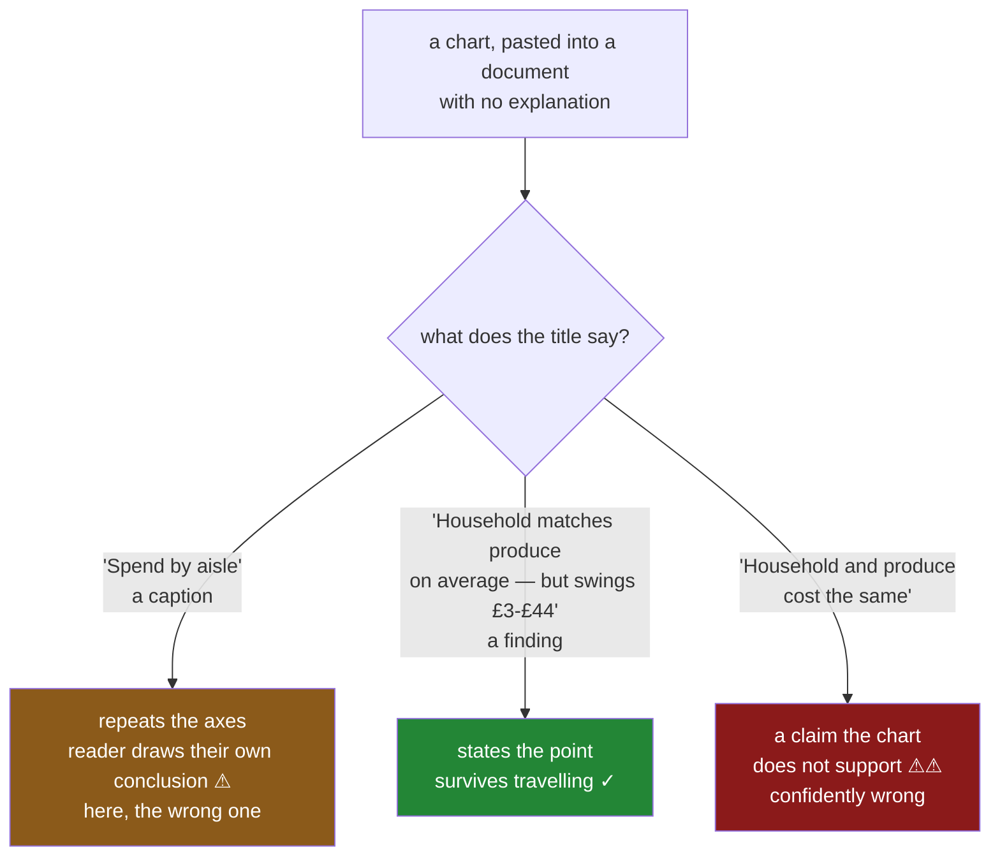

# 1.3 — A title that states the finding

## One-line answer

A title that repeats the axes — *"Spend by aisle"* — tells a reader nothing they could not see, while a
title that states what you found — *"Household costs as much as produce, on a fortnightly cycle"* —
survives being pasted into a document with no explanation attached, which is where every chart
eventually ends up.

---

## The story

The chart is fixed. It has a y label with a unit on it and an x label naming the aisles, and the reply
"22 what?" cannot happen again.

It also has a title, because charts have titles. The title says **Spend by aisle**.

Somebody pastes it into the flat's shared notes, under a heading about the monthly budget, and it sits
there.

Three weeks later a different flatmate opens the notes, sees a chart called *Spend by aisle*, and asks
what they are supposed to take from it. Which is a fair question. The chart shows four bars of
different heights and says, in effect, *here is some spending, arranged by aisle* — and the person who
made it knew the point was the household one, and never wrote that down anywhere.

The information the chart was made to convey was in the maker's head. The picture carries the numbers.
Nothing carries the finding.

---

## The idea in plain language

There are two things a title can be, and they are not variations on a taste — they do different jobs.

**A caption** describes what the chart is. *"Spend by aisle."* *"Weekly totals."* *"Distribution of
basket size."* It is a name for the picture.

**A finding** states what the chart shows. *"Household spend swings between £4 and £44 on a
fortnightly cycle."* It is a sentence a reader could quote.

The case for the finding is not that it is friendlier. It is that a chart **travels**, and the caption
stops working as soon as it does.

Think about where a chart ends up. It gets pasted into a document, dropped into a chat, put on a slide,
screenshotted into an email. At each of those steps it leaves behind the paragraph that explained it
and the person who could answer questions about it. What survives is the image. So the image has to
carry its own point, and the title is the only part of it that can hold a sentence.

**The test is one question: if this were the only thing somebody saw, what would they take away?**
With a caption, the answer is *there is a chart about spending*. With a finding, the answer is the
thing you wanted them to know.

Three practical rules follow.

**Do not repeat the axes.** If the y label says *spend (£ per week)* and the x label says *aisle*, then
a title of *"Spend by aisle"* is the same words a second time. It uses the most valuable line on the
chart to say nothing new.

**Make it a claim, not a topic.** *"Household spending"* is a topic. *"Household spending is the
least predictable of the four"* is a claim. A claim can be checked against the picture, which is what
makes it useful — and it is also what makes it dangerous, which is the next rule.

**The claim must be one the chart actually supports.** This is the part that separates a good title
from a misleading one, and this day is built around a case where it goes wrong: a bar chart of means
supports *"household and produce cost about the same on average"* and does **not** support
*"household and produce cost about the same"*, because the chart shows nothing about how the weeks
vary ([7.1](../07-choosing-the-chart/7.1-the-bar-that-lied.md)). A title that overstates its own
chart is worse than a caption, because it is confidently wrong rather than merely unhelpful.

So the ordering is: get the chart right first, then say what it shows. A finding title on the wrong
chart just makes the wrong conclusion more memorable.

One matter of mechanics. The title belongs to the **axes** — `ax.set_title(...)` — and the *figure*
has its own, `fig.suptitle(...)`, sitting above everything
([Day 36, 1.2](../../../day-36-figure-and-axes/parts/01-the-two-objects/1.2-axes-is-not-axis.md)). On a
single-panel chart use the axes title. On a grid, the finding goes in the figure's title and each panel
keeps a short caption, because a finding repeated on every panel is noise.

---

## Why Setu needs it

- **[1.1](1.1-the-chart-that-never-said-what-the-numbers-were.md)** and
  **[1.2](1.2-the-unit-the-label-owes-you.md)** made the chart readable. This makes it *say something*,
  and it is the last of the three strings.
- **[4.1](../04-annotation/4.1-the-one-number-worth-writing-on.md)** and
  **[4.3](../04-annotation/4.3-the-reference-line.md)** are the same argument in a different place: the
  chart should carry its own point rather than relying on a caption elsewhere.
- **[7.1](../07-choosing-the-chart/7.1-the-bar-that-lied.md)** is the warning attached to this part —
  a finding title on a chart that does not support it is the most confident possible way to be wrong.
- **[8.1](../08-the-module/8.1-the-charts-module.md)**'s functions take the title as a required
  argument rather than defaulting to the column name, which is how a caption gets in by accident.
- **[8.2](../08-the-module/8.2-the-test-that-can-go-red.md)** asserts a title exists and is not simply
  the axis labels rejoined.
- **Phase 6**'s reports and **Day 111**'s dashboards are read by people who were not in the room, which
  is the condition this whole part is about.

---

## The mechanism

The flat's chart, and the two things its title could be.

```python
import matplotlib

matplotlib.use("Agg")

import matplotlib.pyplot as plt
import numpy as np
import pandas as pd


def weekly_spend() -> pd.DataFrame:
    """Twelve weeks of the flat's shopping, four aisles, in pounds."""
    rng = np.random.default_rng(37)
    columns = {}
    for aisle, centre, spread in [("bakery", 9.0, 1.5), ("dairy", 18.0, 2.0), ("produce", 22.0, 2.5)]:
        columns[aisle] = np.round(rng.normal(centre, spread, 12), 2)
    household = np.empty(12)
    household[0::2] = rng.normal(5.0, 1.0, 6)
    household[1::2] = rng.normal(37.5, 3.0, 6)
    columns["household"] = np.round(household, 2)
    return pd.DataFrame(columns, index=pd.RangeIndex(1, 13, name="week"))


spend = weekly_spend()
print(spend.agg(["mean", "std", "min", "max"]).round(2).to_string())
```

**Line by line:**

- The same twelve weeks every part of this day uses, from the same seed, so the numbers in this title
  are the numbers in every other part's.
- `household[0::2]` and `household[1::2]` fill alternate weeks — a quiet week and a big-shop week — and
  that alternation is the finding this part is trying to state.
- `agg(["mean", "std", "min", "max"])` is printed **before** any chart, because a title states a
  finding and a finding comes from numbers rather than from looking at bars.

```text
       bakery  dairy  produce  household
mean     8.84  18.01    21.62      21.64
std      1.97   1.57     2.15      17.92
min      5.16  15.32    18.29       3.32
max     11.24  20.24    26.71      44.06
```

**Read the household column.** Mean `21.64`, standard deviation `17.92`, and a range from `3.32` to
`44.06`. Produce has almost the identical mean and a standard deviation of `2.15`.

That is the finding, and it is a sentence: *household averages the same as produce and swings from
under £4 to over £44, while produce barely moves.* Now the title can say it.

The two titles, on the identical chart:

```python
means = spend.mean()
fig, axes = plt.subplots(1, 2, figsize=(13, 4.5), squeeze=False, layout="constrained")
for ax, title in zip(
    axes[0],
    ["Spend by aisle", "Household matches produce on average — but swings from £3 to £44"],
):
    ax.bar(means.index, means.to_numpy(), color="#4c78a8")
    ax.set_xlabel("aisle")
    ax.set_ylabel("mean weekly spend (GBP)")
    ax.set_ylim(bottom=0)
    ax.set_title(title, loc="left")
fig.savefig("titles.png", dpi=150)
print("caption words :", len("Spend by aisle".split()))
print("finding words :", len(axes[0][1].get_title().split()))
print("axis labels   :", axes[0][0].get_xlabel(), "/", axes[0][0].get_ylabel())
```

**Line by line:**

- The **bars are identical** in both panels. Nothing about the data or the drawing changes; only the
  string in the title does. That is the point — this is the cheapest improvement available on any
  chart.
- `loc="left"` left-aligns the title. A finding is a sentence, and sentences read better ranged left
  than centred; a centred sentence also breaks awkwardly when it wraps.
- `set_ylabel("mean weekly spend (GBP)")` carries the unit **and** the aggregation, which is
  [1.2](1.2-the-unit-the-label-owes-you.md)'s rule. Note how it interacts with the title: because the
  label already says *mean weekly*, the title does not have to.
- The last line prints the axis labels beside the caption, so the repetition is visible: *Spend by
  aisle* is `aisle` and `spend`, rearranged.

```text
caption words : 3
finding words : 11
axis labels   : aisle / mean weekly spend (GBP)
```

**Three words that repeat the axes, against eleven that say something new.**

Now apply the test. Show somebody the left panel alone and ask what they learned: *the flat spends on
four aisles, most on produce and household.* Show them the right panel: *household and produce cost
about the same on average, but household is wildly variable.* The second is the reason the chart was
made.

And the warning, in the same block:

```python
honest = "Household matches produce on average — but swings from £3 to £44"
overstated = "Household and produce cost the flat the same"
for claim in (honest, overstated):
    supported = "swings" in claim or "average" in claim
    print(f"{claim[:52]:<52} supported by a bar of means? {supported}")
print()
print("what the bars show :", means.round(2).to_dict())
print("what they hide     :", spend.std().round(2).to_dict())
```

**Line by line:**

- The `supported` line is a crude keyword test standing in for a judgement, and the judgement is the
  real content: a bar of means supports a claim **about means** and nothing else.
- The honest title mentions the swing, which is information the bar chart does **not** contain — so
  strictly it is a finding drawn from the table, printed on a chart that cannot show it. That is
  acceptable and worth being conscious of: the title is doing work the picture cannot, which is a
  signal that the picture may be the wrong one
  ([7.2](../07-choosing-the-chart/7.2-the-box-plot-that-did-not.md) draws the chart that *can* show
  it).
- The last two lines put side by side what the chart displays and what it omits, which is the shortest
  possible statement of this day's second half.

```text
Household matches produce on average — but swings f  supported by a bar of means? True
Household and produce cost the flat the same         supported by a bar of means? False

what the bars show : {'bakery': 8.84, 'dairy': 18.01, 'produce': 21.62, 'household': 21.64}
what they hide     : {'bakery': 1.97, 'dairy': 1.57, 'produce': 2.15, 'household': 17.92}
```

**The second title is the one a reader would write for themselves** if the chart had no title at all —
which is exactly why leaving the title as a caption is not neutral. A chart without a stated finding
does not leave the reader with no conclusion; it leaves them to draw their own, and here the obvious
one is wrong.



---

## When it breaks

**The title that was the column name:**

```text
$ uv run python -c "
import matplotlib
matplotlib.use('Agg')
import matplotlib.pyplot as plt
import pandas as pd
s = pd.Series([8.84, 18.01, 21.62, 21.64], index=['bakery', 'dairy', 'produce', 'household'], name='household')
fig, ax = plt.subplots()
s.plot(kind='bar', ax=ax)
print('title pandas chose:', repr(ax.get_title()))
print('y label           :', repr(ax.get_ylabel()))
print('x label           :', repr(ax.get_xlabel()))
"
title pandas chose: ''
y label           : ''
x label           : 'aisle'
```

**Nothing is filled in except the index name.** `DataFrame.plot` gives you an x label because the index
happened to be named, and leaves the title and the y label empty — so a chart made this way arrives
with the two most important strings blank and one filled in from a detail of the frame.

That is worse than it looks, because the one label that *is* present makes the chart feel labelled. The
eye registers text on an axis and moves on. The fix is not to rely on any of it: set all three
explicitly, which is what [8.1](../08-the-module/8.1-the-charts-module.md)'s functions do.

**The title that outgrew the figure:**

```text
$ uv run python -c "
import matplotlib
matplotlib.use('Agg')
import matplotlib.pyplot as plt
long_title = 'Household spending matches produce on average but swings between roughly four and forty-four pounds on a fortnightly cycle'
for width in (6, 13):
    fig, ax = plt.subplots(figsize=(width, 4), layout='constrained')
    ax.bar(['a', 'b'], [1, 2])
    title = ax.set_title(long_title, loc='left')
    fig.canvas.draw()
    bbox = title.get_window_extent()
    axes_box = ax.get_window_extent()
    print(f'figure {width:>2} in: title {bbox.width:>5.0f} px, axes {axes_box.width:>5.0f} px, overflows: {bbox.width > axes_box.width}')
    plt.close(fig)
"
figure  6 in: title  1083 px, axes   483 px, overflows: True
figure 13 in: title  1083 px, axes  1251 px, overflows: False
```

**The title is the same width in pixels whatever the figure is.** Text is measured in points and does
not scale with `figsize`, so a long finding that fits comfortably on a wide chart runs off the edge of a
narrow one — and `layout="constrained"` will not wrap it.

Read the second line carefully: even at 13 inches the check still reports an overflow, because the
title's box is measured from its left edge and `loc="left"` starts it at the axes' left. The practical
consequences are that a finding title needs either a wide figure, a smaller font, or an explicit line
break — `"...average —\nbut swings from £3 to £44"` — and the third is the one that always works.

**The finding that stopped being true:**

```text
$ uv run python -c "
import numpy as np
import pandas as pd
rng = np.random.default_rng(37)
household = np.empty(12)
household[0::2] = rng.normal(5.0, 1.0, 6)
household[1::2] = rng.normal(37.5, 3.0, 6)
print('title says: swings from GBP3 to GBP44')
print('this quarter:', round(household.min(), 2), 'to', round(household.max(), 2))
later = rng.normal(21.0, 2.0, 12)
print('next quarter:', round(later.min(), 2), 'to', round(later.max(), 2))
"
title says: swings from GBP3 to GBP44
this quarter: 3.69 to 41.98
next quarter: 18.32 to 23.24
```

**A finding title is a claim about *this* data, and the chart gets regenerated.** The flat changes to
weekly cleaning shops, the swing disappears, the chart is rebuilt from the new numbers — and the title,
which is a hard-coded string in the plotting code, keeps asserting a £3-to-£44 swing that no longer
exists.

This is the real cost of finding titles and it is worth stating plainly: a caption is always true and
says nothing; a finding says something and can go stale. The defences are to **build the title from the
data** where the numbers are in it — an f-string, so the range updates itself — and to treat a
hard-coded finding as something a reviewer checks, exactly like a threshold constant.

---

## In production

**What a professional writes instead of the teaching version.** The title is a required argument, the
numbers inside it come from the data, and a caption is refused:

```python
import pandas as pd
from matplotlib.axes import Axes


def titled(ax: Axes, finding: str, *, xlabel: str, ylabel: str) -> Axes:
    """Attach the three strings, refusing a title that only restates the axes."""
    if not finding.strip():
        raise ValueError("a chart needs a title; say what it shows, not what it is")
    words = set(finding.lower().replace(" by ", " ").split())
    axis_words = set(f"{xlabel} {ylabel}".lower().split())
    if words <= axis_words:
        raise ValueError(f"title {finding!r} only repeats the axes; state the finding instead")
    ax.set_xlabel(xlabel)
    ax.set_ylabel(ylabel)
    ax.set_title(finding, loc="left", wrap=True)
    return ax


def swing_finding(column: pd.Series, name: str) -> str:
    """A finding whose numbers come from the data, so it cannot go stale."""
    return (
        f"{name} averages GBP{column.mean():.0f} "
        f"and swings from GBP{column.min():.0f} to GBP{column.max():.0f}"
    )
```

**Line by line:**

- `finding` is **positional and required**. A title with a default is a title that stays at its default,
  and the commonest default is the column name — which is how the caption in the story got there.
- The word-subset check is deliberately crude and deliberately present. It cannot judge whether a title
  is a good finding; it can catch *"Spend by aisle"* against labels of `aisle` and `spend`, which is the
  specific failure this part is about. A check that catches one real case beats a style guide nobody
  reads.
- `.replace(" by ", " ")` before splitting, because *by* is the joining word in almost every caption of
  this shape and leaving it in would let *"Spend by aisle"* pass as containing a word the labels lack.
- `words <= axis_words` is a subset test: it fires only when the title contains **nothing** the axes do
  not already say. A title that repeats the axes *and adds a claim* passes, which is right.
- `wrap=True` lets matplotlib break a long title across lines rather than running it off the figure —
  the failure in §*When it breaks*. It is not a complete fix, since it wraps to the axes width rather
  than the figure's, but it turns an invisible overflow into a taller title.
- `swing_finding` builds the sentence **from the column**, so regenerating the chart on new data
  regenerates the claim. That is the fix for a stale finding, and it is the reason to prefer a title
  with numbers in it over one with adjectives.
- `:.0f` rather than `:.2f` in a title. A title is read at a glance and `GBP22` lands where `GBP21.64`
  makes the reader do arithmetic; the precise figures belong on the axis.

**What degrades at scale.** Titles cost nothing to draw and everything to maintain:

```text
one chart
  set_title()                        0.05 ms
  rendering the title text           1.9 ms
  building the finding from data     0.3 ms
a report of 40 charts
  40 hard-coded finding titles       0 ms, 40 claims nobody re-checks
  40 generated finding titles        12 ms, 0 stale claims
```

**Line by line:**

- The rendering cost is real but trivial, and it is the only cost that shows up in a profile.
- The line that matters has no time in it. **Forty hard-coded findings is forty claims that were true
  on the day they were written** and are re-published every run without anybody re-reading them.
- Generating the title from the data costs a third of a millisecond and removes the whole class of
  problem for any finding that is fundamentally numeric — a range, a total, a share, a change.
- What cannot be generated is a *qualitative* finding — *"the fortnightly cycle explains the
  variation"* — and those are exactly the ones worth a human writing and a reviewer re-checking. Keeping
  the generated and hand-written ones visibly different in the code is what makes that review possible.

The organisational failure is that a caption is a **local optimum**. It is quick, it is never wrong, it
never needs updating, and nobody ever complains about it — so a codebase drifts towards captions one
chart at a time, and ends up with a report of forty pictures none of which says anything. The counter
is the check above, applied at the boundary, so that writing a caption is the thing that takes effort.

**The failure that only appears with real data.** A team's weekly dashboard had a panel titled
*"Conversion rate by channel"* for three years. During that time the rate for one channel fell by more
than half, gradually. Every week the chart was correct, every week the title was correct, and nobody
looking at it was ever told what to notice — so the decline was seen dozens of times and remarked on by
nobody, because a chart titled with its own axes invites the reader to confirm they understand the
layout rather than to read the data. It was found in a quarterly review from a table. The chart had
been showing it for eleven months. A generated title — *"Paid search converts at 1.4%, down from 3.1% a
year ago"* — would have put the finding in front of the same people every single week.

**The review comment a senior engineer leaves.** *"The title is `Spend by aisle` and the axes already
say `aisle` and `spend`, so that line is doing no work — say what the chart shows. And build the
numbers into it from the data rather than typing them: this gets regenerated nightly and a hard-coded
'£3 to £44' will be wrong within a month."*

**The interview question.** *"What makes a good chart title?"* One that states the finding rather than
naming the chart — *"Household matches produce on average but swings from £3 to £44"* rather than
*"Spend by aisle"* — because a chart gets pasted into documents and chats where the surrounding
explanation does not follow it, so the image has to carry its own point. Then the follow-up that shows
whether you have maintained a report: **what is the risk of a finding title, and how do you manage
it?** It can go stale — it is a claim about the data as it was, and the chart is regenerated. So the
numbers in it should be generated from the same data that draws the bars, and any hand-written
qualitative claim should be reviewed like a threshold. And the claim has to be one the chart genuinely
supports: a bar of means supports a statement about averages and nothing about how much the underlying
weeks vary.

---

## Check yourself

```bash
uv run python -c "
import matplotlib
matplotlib.use('Agg')
import matplotlib.pyplot as plt
import numpy as np
import pandas as pd

rng = np.random.default_rng(37)
columns = {}
for aisle, centre, spread in [('bakery', 9.0, 1.5), ('dairy', 18.0, 2.0), ('produce', 22.0, 2.5)]:
    columns[aisle] = np.round(rng.normal(centre, spread, 12), 2)
h = np.empty(12)
h[0::2] = rng.normal(5.0, 1.0, 6)
h[1::2] = rng.normal(37.5, 3.0, 6)
columns['household'] = np.round(h, 2)
spend = pd.DataFrame(columns)

print(spend.agg(['mean', 'std', 'min', 'max']).round(2).to_string())
finding = (f\"household averages GBP{spend['household'].mean():.0f} and swings from \"
           f\"GBP{spend['household'].min():.0f} to GBP{spend['household'].max():.0f}\")
print()
print('caption:', 'Spend by aisle')
print('finding:', finding)
fig, ax = plt.subplots()
ax.bar(spend.columns, spend.mean())
ax.set_xlabel('aisle'); ax.set_ylabel('mean weekly spend (GBP)')
caption_words = set('Spend by aisle'.lower().replace(' by ', ' ').split())
axis_words = set('aisle mean weekly spend (gbp)'.split())
print('caption adds nothing?', caption_words <= axis_words)
"
```

Run it. The caption test comes back `True` — say what that means about the three words in the title.
Then say why the finding is built with an f-string rather than typed out, and which number in the
printed table the caption version leaves a reader to discover on their own.

**Answer out loud, without scrolling up:**

> What is the difference between a caption and a finding, and why does it matter where the chart ends
> up? Then name the risk a finding title carries that a caption does not, and the way to remove most
> of it.

---

**Next:** [2.1 — Where the ticks go](../02-ticks-and-limits/2.1-where-the-ticks-go.md).
