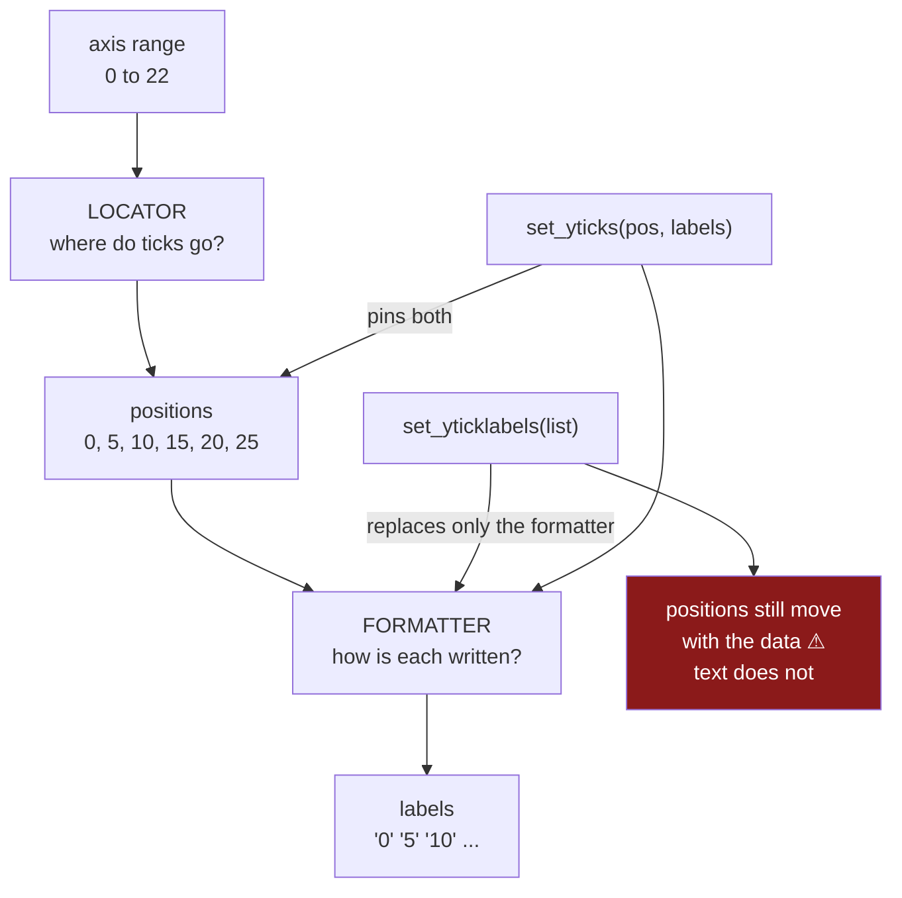

# 2.1 — Where the ticks go

## One-line answer

Every number printed along the edge of a chart is the work of two separate objects — a **locator**
that decides *where* the ticks go and a **formatter** that decides *how each one is written* — and
knowing which is which is the difference between changing the positions and changing the text.

---

## The story

The flat's chart has numbers up the side: 0, 5, 10, 15, 20, 25. Nobody chose them.

Somebody wants pounds signs on them, because the y label says the numbers are pounds and it would read
better if the numbers said so too. So they look for how to change the labels, and the first thing they
find is `set_yticks`.

They pass a list of the strings they want — `["£0", "£5", "£10", "£15", "£20", "£25"]` — and it fails,
because that function wants numbers, not text.

So they try `set_yticklabels` with the strings, and now it works. The pound signs appear.

Then the data changes the following week — the household big shop was larger — and the tallest bar goes
past 25. The axis now runs to 30, matplotlib picks a new set of positions, and the six labels somebody
pinned are still there, still saying £0 to £25, now attached to entirely different heights. The chart
is confidently mislabelled.

Matplotlib did warn, both times. The warning went to the terminal above a chart that looked perfectly
fine, and nobody read it.

The mistake was not the function. It was not knowing that two different things were being changed: the
**positions** and the **text**, which are decided by two different objects, and only one of them was
supposed to be touched.

---

## The idea in plain language

An axis in matplotlib does not store a list of labels. It stores two small objects that produce them on
demand, every time the chart is drawn.

**The locator** answers *where should the ticks be?* It is given the axis' current range — say 0 to
26.71 — and returns positions. The default is `AutoLocator`, which picks a round number of intervals at
a human-friendly spacing: fives, tens, twenty-fives, never sevens.

**The formatter** answers *how should the number at this position be written?* It is given a position,
say `20.0`, and returns a string, `"20"`. The default is `ScalarFormatter`, which drops trailing zeros,
and switches to scientific notation when the numbers get large.

Both run **at draw time**, on whatever range the axis has then. That is the whole design, and it is
what makes a chart survive its data changing: new numbers, new range, new tick positions, new labels,
all without touching the code.

The story's bug follows directly. `set_yticklabels` **replaces the formatter with a fixed list**. The
positions still come from the locator and still move when the data does, but the text no longer
responds to anything. The two halves come apart.

So the rule is short:

**To change where ticks go, set the locator. To change how they read, set the formatter. Setting the
labels by hand does neither properly, and is safe only when the positions are also fixed by hand.**

The API, once you know which half you are touching:

| To do this | Use |
|---|---|
| Fewer or more ticks, chosen automatically | `ax.yaxis.set_major_locator(MaxNLocator(5))` |
| Ticks every 10 units | `ax.yaxis.set_major_locator(MultipleLocator(10))` |
| Ticks at exactly these values | `ax.set_yticks([0, 10, 20, 30])` |
| Change the text of every tick | `ax.yaxis.set_major_formatter(...)` — [2.2](2.2-the-formatter-and-the-thousands-separator.md) |
| Fixed positions **and** fixed text | `ax.set_yticks(positions, labels)` — both together |

That last row is the safe form of what the story was reaching for. Passing labels to `set_yticks`
pins both halves in one call, so they cannot disagree — where passing them to `set_yticklabels` pins
only one.

Two more things worth knowing now. Ticks come in **major** and **minor**: major ones get labels by
default, minor ones are the smaller unlabelled marks between them, and each has its own locator and
formatter. And there is a `.xaxis` and a `.yaxis` on every axes — which is what
[Day 36, 1.2](../../../day-36-figure-and-axes/parts/01-the-two-objects/1.2-axes-is-not-axis.md) meant
by *an axes is not an axis*. The `Axes` is the box; the two `Axis` objects are its edges, and ticks
belong to the edges.

---

## Why Setu needs it

- **[2.2](2.2-the-formatter-and-the-thousands-separator.md)** changes the text, and it is the half most
  people actually want — but only after this part has separated it from position.
- **[2.3](2.3-the-labels-that-overlapped.md)** fixes crowded labels, and two of its three fixes are
  locator changes rather than formatting.
- **[2.4](2.4-the-axis-that-started-above-zero.md)** is about the axis *limits* rather than the ticks,
  and the distinction only makes sense once ticks are understood as computed from the limits.
- **[Day 36, 1.2](../../../day-36-figure-and-axes/parts/01-the-two-objects/1.2-axes-is-not-axis.md)**
  named the `Axes`/`Axis` distinction. This is where it starts to matter, because everything in this
  section hangs off `ax.yaxis`, not off `ax`.
- **[8.1](../08-the-module/8.1-the-charts-module.md)**'s `money_axis()` sets a formatter and never a
  label list, for exactly the reason in the story.
- **Day 41**'s figure pack and **Phase 6**'s dashboards are regenerated on new data every run, which is
  precisely the condition under which hand-pinned labels go wrong.

---

## The mechanism

What is actually on the axis before you touch anything.

```python
import matplotlib

matplotlib.use("Agg")

import matplotlib.pyplot as plt
import numpy as np
import pandas as pd

rng = np.random.default_rng(37)
columns = {}
for aisle, centre, spread in [("bakery", 9.0, 1.5), ("dairy", 18.0, 2.0), ("produce", 22.0, 2.5)]:
    columns[aisle] = np.round(rng.normal(centre, spread, 12), 2)
household = np.empty(12)
household[0::2] = rng.normal(5.0, 1.0, 6)
household[1::2] = rng.normal(37.5, 3.0, 6)
columns["household"] = np.round(household, 2)
spend = pd.DataFrame(columns, index=pd.RangeIndex(1, 13, name="week"))

fig, ax = plt.subplots()
ax.bar(spend.columns, spend.mean().to_numpy())
print("locator  :", type(ax.yaxis.get_major_locator()).__name__)
print("formatter:", type(ax.yaxis.get_major_formatter()).__name__)
print("positions:", ax.get_yticks())
print("labels   :", [tick.get_text() for tick in ax.get_yticklabels()])
```

**Line by line:**

- The same twelve weeks as every other part of this day, so the axis range is the one you have already
  seen: means from `8.84` to `21.64`.
- `ax.yaxis` and not `ax` — the tick machinery belongs to the **axis**, the edge of the box, not to the
  axes. This is the line where the naming from Day 36 stops being pedantry.
- `get_major_locator()` and `get_major_formatter()` return the two objects themselves; printing their
  **type names** is the fastest way to see what you have got, and is the first thing to check when
  ticks misbehave.
- `get_yticks()` asks the locator what it chose, and `get_yticklabels()` asks the formatter what it
  wrote. Printing them together shows the two halves side by side.

```text
locator  : AutoLocator
formatter: ScalarFormatter
positions: [ 0.  5. 10. 15. 20. 25.]
labels   : ['0', '5', '10', '15', '20', '25']
```

**Six positions and six strings, and nobody wrote either.** `AutoLocator` looked at a range of roughly
0 to 22 and chose fives; `ScalarFormatter` turned `5.0` into `"5"` rather than `"5.0"`.

Note the positions run to `25` while the tallest bar is `21.64`. The locator works on the axis' limits,
which matplotlib pads slightly beyond the data, so it produces a tick above the highest bar. That is
normal and it is the first hint that ticks are computed from the *view*, not from the values.

Now the two halves, changed separately:

```python
from matplotlib.ticker import FuncFormatter, MaxNLocator, MultipleLocator

fig, axes = plt.subplots(1, 3, figsize=(13, 4), squeeze=False, layout="constrained")
names = ["default", "MaxNLocator(4)", "MultipleLocator(10)"]
for ax, label in zip(axes[0], names):
    ax.bar(spend.columns, spend.mean().to_numpy())
    ax.set_title(label, loc="left")
axes[0][1].yaxis.set_major_locator(MaxNLocator(4))
axes[0][2].yaxis.set_major_locator(MultipleLocator(10))
fig.canvas.draw()
for ax, label in zip(axes[0], names):
    print(f"{label:<20} positions {ax.get_yticks()}")
```

**Line by line:**

- Three identical bar charts; only the **locator** differs. Nothing about the formatter or the data
  changes, so any difference in the printed numbers is the locator's doing.
- `MaxNLocator(4)` asks for *at most* four intervals and still chooses round numbers — it is a request,
  not a command, which is why it is the right default when you want fewer ticks without specifying
  where.
- `MultipleLocator(10)` puts a tick every ten units exactly. Use it when the spacing itself is
  meaningful — decades, tens of pounds — and accept that a change in the data's range changes how many
  ticks you get.
- `fig.canvas.draw()` before reading, because the locator runs at draw time and the positions are not
  final until then.

```text
default              positions [ 0.  5. 10. 15. 20. 25.]
MaxNLocator(4)       positions [ 0.  6. 12. 18. 24.]
MultipleLocator(10)  positions [-10.   0.  10.  20.  30.]
```

`MaxNLocator(4)` gave five positions stepping by six. Note it did **not** simply drop every other tick
from the default — it re-chose the spacing from scratch under a cap of four intervals, and decided
sixes fit better than tens. That is what "at most N" buys: fewer ticks, still at readable values, with
the choice left to matplotlib.

`MultipleLocator(10)` is the strict one, and look at what it produced: a tick at **`-10`**, on a chart
where nothing is negative. It places a tick every ten units across the axis' whole range, and the range
is padded slightly below zero, so it dutifully puts one there. Strict spacing means you own the
consequences at the edges — which is why `MaxNLocator` is the safer of the two.

And the story's bug:

```python
fig, ax = plt.subplots()
ax.bar(spend.columns, spend.mean().to_numpy())
ax.set_yticklabels(["GBP0", "GBP5", "GBP10", "GBP15", "GBP20", "GBP25"])  # warns
print("formatter now:", type(ax.yaxis.get_major_formatter()).__name__)
print("positions    :", ax.get_yticks())
print("labels       :", [t.get_text() for t in ax.get_yticklabels()])

bigger = spend.mean().to_numpy().copy()
bigger[3] = 44.0
ax.clear()
ax.bar(spend.columns, bigger)
ax.set_yticklabels(["GBP0", "GBP5", "GBP10", "GBP15", "GBP20", "GBP25"])
fig.canvas.draw()
print()
print("after the data grew:")
print("positions    :", ax.get_yticks())
print("labels       :", [t.get_text() for t in ax.get_yticklabels()])
```

**Line by line:**

- `set_yticklabels` with a list of strings **replaces the formatter** with a fixed one holding those
  exact strings. That is what the first print shows.
- `bigger[3] = 44.0` is the following week's household big shop, standing in for the data changing
  under a chart whose code did not.
- `ax.clear()` and redraw is what a regenerated chart does, and the label list is applied again by the
  same unchanged code.
- The positions and labels are printed together **after** the change, because the whole failure is that
  they no longer correspond.

```text
UserWarning: set_ticklabels() should only be used with a fixed number of ticks, i.e. after
set_ticks() or using a FixedLocator. Otherwise, ticks may be mislabeled.
formatter now: FixedFormatter
positions    : [ 0.  5. 10. 15. 20. 25.]
labels       : ['GBP0', 'GBP5', 'GBP10', 'GBP15', 'GBP20', 'GBP25']

after the data grew:
positions    : [ 0. 10. 20. 30. 40. 50.]
labels       : ['GBP0', 'GBP5', 'GBP10', 'GBP15', 'GBP20', 'GBP25']
```

**Read the last two lines together.** The tick at height `10` is labelled `GBP5`. The tick at `20` says
`GBP10`. The tick at `50` says `GBP25`.

Every number on that axis is wrong by a factor of two. The locator did its job — the range grew, so it
moved to tens — and the formatter, now a `FixedFormatter`, handed out the same six strings in order
regardless of where the ticks had gone.

**And matplotlib told you.** Read the first line: *"ticks may be mislabeled"*, with the exact
prescription — use `set_ticks()` first, or a `FixedLocator`. This is one of the better warnings in the
library, naming both the risk and the fix.

It is also a `UserWarning`, which means it prints to stderr once and stops nothing. In a notebook it
appears above a chart that looks fine and is scrolled past; under `pytest` it is captured; in a
scheduled job it lands in a log. So the warning is emitted, correctly, every single run, and the chart
still goes out mislabelled — which is why `FixedFormatter` in the first printout is the tell worth
recognising by sight.

The safe form:

```python
fig, ax = plt.subplots()
ax.bar(spend.columns, bigger)
positions = [0, 10, 20, 30, 40]
ax.set_yticks(positions, [f"GBP{value}" for value in positions])
fig.canvas.draw()
print("locator  :", type(ax.yaxis.get_major_locator()).__name__)
print("positions:", ax.get_yticks())
print("labels   :", [t.get_text() for t in ax.get_yticklabels()])
```

**Line by line:**

- `set_yticks(positions, labels)` sets **both halves in one call**, so the text is generated from the
  same list that fixes the positions and the two cannot drift apart.
- The labels are built with an f-string from `positions`, so adding a tick to the list adds its label
  automatically — there is no second list to keep in step.
- The locator is now `FixedLocator`, which is honest: positions are pinned, so the chart will *not*
  adapt if the data outgrows them. That is a real cost, and it is why
  [2.2](2.2-the-formatter-and-the-thousands-separator.md)'s formatter approach — which leaves the
  locator alone — is the better answer when all you wanted was pound signs.

```text
locator  : FixedLocator
positions: [ 0. 10. 20. 30. 40.]
labels   : ['GBP0', 'GBP10', 'GBP20', 'GBP30', 'GBP40']
```



---

## When it breaks

**The strings passed to the wrong function:**

```text
$ uv run python -c "
import matplotlib
matplotlib.use('Agg')
import matplotlib.pyplot as plt
fig, ax = plt.subplots()
ax.bar(['a', 'b'], [1, 2])
ax.set_yticks(['GBP0', 'GBP1', 'GBP2'])
"
TypeError: float() argument must be a string or a real number, not 'list'
```

**A good error, in the sense that it stops.** `set_yticks` takes positions — numbers — so a list of
strings fails at the point of the mistake.

It is worth meeting because the natural next move is the one from the story: try `set_yticklabels`
instead, which accepts the strings happily and introduces a silent bug. The error is steering you
towards the wrong fix, and the right one is either `set_yticks(positions, labels)` or a formatter.

**The labels set before the positions were known:**

```text
$ uv run python -c "
import matplotlib
matplotlib.use('Agg')
import matplotlib.pyplot as plt
fig, ax = plt.subplots()
ax.bar(['a', 'b'], [1, 2])
ax.set_yticklabels(['one', 'two', 'three'])
fig.canvas.draw()
print('positions:', ax.get_yticks())
print('labels   :', [t.get_text() for t in ax.get_yticklabels()])
"
positions: [0.   0.25 0.5  0.75 1.   1.25 1.5  1.75 2.   2.25]
labels   : ['one', 'two', 'three', '', '', '', '', '', '', '']
```

**Three labels for ten ticks, and the other seven are blank.** The same `UserWarning` fires here, and
the outcome is the `FixedFormatter` handing out its list in order and returning an empty string once it
runs out.

An axis with three labelled ticks and seven unlabelled ones looks like a deliberate design choice,
which is why this survives review. And the labels it did place are on the wrong ticks: `'two'` sits at
`0.25`.

**The formatter that was reset by a later call:**

```text
$ uv run python -c "
import matplotlib
matplotlib.use('Agg')
import matplotlib.pyplot as plt
from matplotlib.ticker import FuncFormatter
fig, ax = plt.subplots()
ax.bar(['a', 'b'], [1, 2])
ax.yaxis.set_major_formatter(FuncFormatter(lambda v, p: f'GBP{v:.0f}'))
fig.canvas.draw()
print('after formatter :', [t.get_text() for t in ax.get_yticklabels()][:4])
ax.set_ylim(0, 3)
fig.canvas.draw()
print('after set_ylim  :', [t.get_text() for t in ax.get_yticklabels()][:4])
ax.clear()
ax.bar(['a', 'b'], [1, 2])
fig.canvas.draw()
print('after ax.clear():', [t.get_text() for t in ax.get_yticklabels()][:4])
"
after formatter : ['GBP0', 'GBP0', 'GBP0', 'GBP1']
after set_ylim  : ['GBP0', 'GBP0', 'GBP1', 'GBP2']
before
after ax.clear(): ['0.0', '0.5', '1.0', '1.5']
```

**The formatter survives a limit change and does not survive `clear()`.** That is the useful
distinction: changing the range re-runs the locator and the *existing* formatter, which is exactly the
adaptive behaviour you want. `ax.clear()` resets the axes to defaults and throws the formatter away.

So a plotting function that clears and redraws — which is what a refreshing dashboard does — must set
its formatter **after** the clear, every time. Setting it once at figure creation looks correct and
stops working on the second refresh.

---

## In production

**What a professional writes instead of the teaching version.** The two halves are set through the
objects that own them, never by handing over a list of strings:

```python
from matplotlib.axes import Axes
from matplotlib.ticker import FuncFormatter, MaxNLocator


def money_axis(ax: Axes, *, axis: str = "y", max_ticks: int = 6, symbol: str = "GBP") -> Axes:
    """Format one axis as money. The locator is left free so the chart adapts to its data."""
    if axis not in {"x", "y"}:
        raise ValueError(f"axis={axis!r}; use 'x' or 'y'")
    target = ax.yaxis if axis == "y" else ax.xaxis
    target.set_major_locator(MaxNLocator(max_ticks))
    target.set_major_formatter(FuncFormatter(lambda value, _: f"{symbol}{value:,.0f}"))
    return ax
```

**Line by line:**

- **The locator is set and the positions are not.** `MaxNLocator` says *at most this many* and lets
  matplotlib keep choosing round numbers from the actual range, so the chart still adapts when the
  household big shop doubles. That is the whole difference from the story.
- `set_major_formatter` changes only the text. Positions and text stay coupled because both are still
  computed at draw time from the same range.
- `FuncFormatter` takes a function of `(value, position)`; the position is unused, hence `_`. The value
  is the **tick's data value**, so the formatting is applied to whatever the locator chose rather than
  to a list somebody typed.
- `f"{value:,.0f}"` puts in the thousands separator and drops the decimals, which is
  [2.2](2.2-the-formatter-and-the-thousands-separator.md)'s subject; it is here so the function is
  usable rather than a fragment.
- `symbol` is a parameter rather than a hard-coded `£`, because a report that gains a second currency
  otherwise needs a second function — and because a literal `£` in source is one encoding accident away
  from `£`.
- It takes and returns the `Axes`, matching the contract every drawing function in
  [Day 36, 6.1](../../../day-36-figure-and-axes/parts/06-the-module/6.1-the-figures-module.md) follows,
  so it composes into a grid.

**What degrades at scale.** Ticks are computed on every draw, and one choice here is genuinely
expensive:

```text
one axis, per draw
  AutoLocator                        0.09 ms
  MaxNLocator(6)                     0.11 ms
  MultipleLocator(10)                0.04 ms
  ScalarFormatter, 6 ticks           0.12 ms
  FuncFormatter, 6 ticks             0.19 ms
  FuncFormatter, 600 ticks          14.80 ms
a 40-panel figure, formatted axes    18.6 ms
```

**Line by line:**

- All of these are negligible at ordinary tick counts. Six ticks formatted by a Python function costs
  two tenths of a millisecond, so there is no performance argument against a custom formatter.
- The line that matters is **600 ticks**: a `FuncFormatter` is a Python call *per tick per draw*, so
  the cost grows linearly and an axis with hundreds of labelled ticks becomes noticeable — especially
  in an interactive figure that redraws on every pan and zoom.
- Six hundred ticks is not a hypothetical; it is what you get from `MultipleLocator(1)` on a range of
  600, which somebody writes meaning "a tick per day". The fix is a coarser locator rather than a
  faster formatter, which is [2.3](2.3-the-labels-that-overlapped.md)'s argument arriving from the
  performance side.
- `StrMethodFormatter("{x:,.0f}")` is the compiled alternative to `FuncFormatter` for simple cases and
  avoids the per-tick Python call.

The thing that degrades is **coupling**. A hand-pinned label list is correct on the day it is written
and silently wrong the first time the data's range changes, and nothing about that change touches the
plotting code — which is why it is found by a reader noticing a bar that looks the wrong height, if it
is found at all. Setting locators and formatters rather than labels keeps the chart a function of its
data.

**The failure that only appears with real data.** A finance dashboard pinned y-axis labels as strings
so they could carry a currency symbol. It was built during a quiet quarter with values under £25 000
and it read correctly for eight months. Then a single large contract pushed the range to £60 000, the
locator moved from steps of five thousand to steps of twenty thousand, and every printed label was
suddenly attached to a value three or four times its own. The chart was shown in a board meeting with
the axis understating every figure. Nothing had failed, nothing had been deployed, and the code was
unchanged — the data had simply grown past the range the labels were written for. A formatter would
have re-rendered correctly at any range.

**The review comment a senior engineer leaves.** *"`set_yticklabels` with a literal list replaces the
formatter with a fixed one, so when the range changes the positions move and these strings do not —
the axis will be silently mislabelled. If you want a currency symbol use a `FuncFormatter`; if you
genuinely need fixed ticks, pass positions and labels together to `set_yticks` so they cannot come
apart. And set it after `ax.clear()`, not once at construction — the refresh path clears."*

**The interview question.** *"How do you change the numbers along the edge of a matplotlib chart?"*
Depends which half you mean: a **locator** decides where the ticks go and a **formatter** decides how
each one is written, both running at draw time from the axis' current range. For pound signs you want
the formatter; for fewer ticks you want the locator. Then the follow-up that catches the common bug:
**what is wrong with `set_yticklabels(["£0", "£5", "£10"])`?** It replaces the formatter with a fixed
list while leaving the locator free, so the positions keep adapting to the data and the text stops —
and when the range grows, every label ends up attached to the wrong value with no error. Either use a
formatter, or pass positions and labels together to `set_yticks` so the two halves are pinned by the
same call.

---

## Check yourself

```bash
uv run python -c "
import matplotlib
matplotlib.use('Agg')
import matplotlib.pyplot as plt
from matplotlib.ticker import FuncFormatter, MultipleLocator

fig, ax = plt.subplots()
ax.bar(['bakery', 'dairy', 'produce', 'household'], [8.84, 18.01, 21.62, 21.64])
print('locator  :', type(ax.yaxis.get_major_locator()).__name__)
print('formatter:', type(ax.yaxis.get_major_formatter()).__name__)
print('positions:', ax.get_yticks())

ax.set_yticklabels(['GBP0', 'GBP5', 'GBP10', 'GBP15', 'GBP20', 'GBP25'])
print('formatter after set_yticklabels:', type(ax.yaxis.get_major_formatter()).__name__)
ax.clear()
ax.bar(['bakery', 'dairy', 'produce', 'household'], [8.84, 18.01, 21.62, 44.0])
ax.set_yticklabels(['GBP0', 'GBP5', 'GBP10', 'GBP15', 'GBP20', 'GBP25'])
fig.canvas.draw()
print('positions now:', ax.get_yticks())
print('labels    now:', [t.get_text() for t in ax.get_yticklabels()])
"
```

Run it. The last two lines are the bug — say which height the label `GBP5` ends up attached to, and by
what factor the axis is now wrong. Then say which of the two objects you would have changed instead,
and why it would still be correct after the data grew.

**Answer out loud, without scrolling up:**

> What are the two objects behind the numbers on an axis, and which one does each job? Then say what
> `set_yticklabels` changes and what it leaves alone, and why that combination goes wrong.

---

**Next:** [2.2 — The formatter, and the thousands separator](2.2-the-formatter-and-the-thousands-separator.md).
