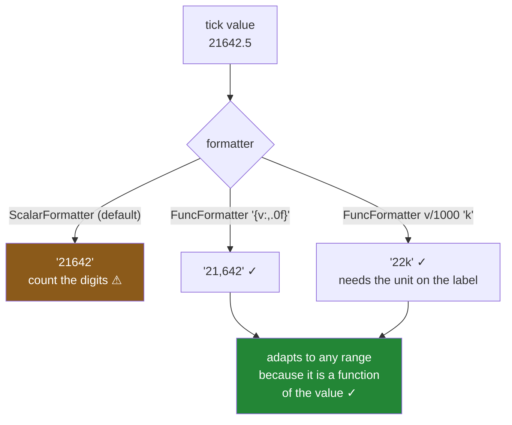

# 2.2 — The formatter, and the thousands separator

## One-line answer

A formatter is a function from a tick's **value** to the **string** printed at it, so
`FuncFormatter(lambda v, _: f"GBP{v:,.0f}")` turns `21000.0` into `GBP21,000` on every tick, at every
range, for as long as the chart exists — which is the whole difference from pinning a list of labels.

---

## The story

The chart is going in the flat's shared notes, and somebody wants the axis to say pounds.

[2.1](2.1-where-the-ticks-go.md) has already cost them an afternoon, so this time they do not touch the
labels. They set a formatter, the pound signs appear on every tick, and it works when the data changes.

Then the same code gets reused at work, on a chart of monthly revenue rather than weekly groceries, and
the numbers are much larger. The axis now reads `GBP21000`, `GBP42000`, `GBP63000`.

Nobody can read those at a glance. Is the first one twenty-one thousand or two hundred and ten
thousand? You have to count the zeros, every time, on every tick, and people get it wrong — in a
meeting, out loud.

The formatter was doing exactly what it was told. What it was told left out the one character that
makes a large number readable, and the number of digits where that starts to matter is smaller than
anybody expects.

---

## The idea in plain language

A formatter is a small object with one job: given the value at a tick, return the text to print there.
The value is a `float`, the return is a `str`, and it is called **once per tick, on every draw**.

The two you will use:

**`FuncFormatter(f)`** — wraps a function of `(value, position)`. The position is the tick's index and
is almost never needed, so it is conventionally `_`. Anything Python can compute, this can print.

**`StrMethodFormatter("{x:,.0f}")`** — takes a format string using `x` as the value. Less flexible, no
Python call per tick, and the right choice when the formatting is a plain format spec.

Everything else in this part is about **what to put in the format string**, and the answers are
ordinary Python formatting ([Day 07, 3.2](../../../day-07-strings/parts/03-formatting/3.2-the-format-spec.md)):

| Spec | `21642.5` becomes | For |
|---|---|---|
| `{v:.0f}` | `21642` | whole numbers |
| `{v:,.0f}` | `21,642` | **large numbers — the story's fix** |
| `{v:,.2f}` | `21,642.50` | money to the penny |
| `{v:.1%}` | `2164250.0%` | proportions, where the value is already 0–1 |
| `{v:.0f}k` after dividing by 1 000 | `22k` | axes where precision is not the point |

**The thousands separator matters sooner than people think.** Four digits are readable; five are not.
`21642` requires counting; `21,642` does not. It costs one character in the format string, and the
reason it gets left out is simply that the person writing it already knows the scale.

**And the alternative to a separator is a smaller number.** An axis running to sixty thousand can print
`60,000` or it can print `60k` and say *thousands* in the label
([1.2](../01-labels/1.2-the-unit-the-label-owes-you.md)). The second is usually better on a chart,
because tick labels are read peripherally and shorter is easier — but only if the unit is on the label.
An axis reading `60k` with a y label of just *revenue* has moved the ambiguity rather than removed it.

**What a formatter must not do.** It must not depend on anything but the value it is given. A formatter
that reads an outside list, counts calls, or assumes the ticks arrive in order will be wrong, because
matplotlib calls it whenever it likes, as often as it likes, including on ticks outside the visible
range. The whole reason a formatter survives the data changing is that it is a pure function of the
value — take that away and you have reinvented the pinned label list.

One piece of folklore worth clearing up, because it is in a lot of older answers: *you must call
`fig.canvas.draw()` before you can read tick labels*. In the version this curriculum pins that is not
true — the labels are available as soon as the artists exist. It was true in older matplotlib, and the
habit persists. The mechanism below checks it rather than repeating it.

---

## Why Setu needs it

- **[2.1](2.1-where-the-ticks-go.md)** separated position from text and showed what goes wrong when the
  text is pinned. This is the right way to change the text.
- **[1.2](../01-labels/1.2-the-unit-the-label-owes-you.md)** put the unit on the label. A `60k` axis
  only works because the label says what the unit is, so the two parts have to be designed together.
- **[2.3](2.3-the-labels-that-overlapped.md)** fixes crowding, and **shorter labels are one of its three
  fixes** — which is a formatter change, so this part is half of that one.
- **[8.1](../08-the-module/8.1-the-charts-module.md)**'s `money_axis()` is a `FuncFormatter`, and its
  symbol is a parameter for the reason in this part's production section.
- **[8.2](../08-the-module/8.2-the-test-that-can-go-red.md)** asserts a tick label contains the
  currency symbol, which is only assertable because the formatter runs on the objects.
- **Phase 6**'s dashboards show money and counts at scales that change as a business grows, which is
  exactly when a hard-coded scale in a label goes stale.

---

## The mechanism

The default, and what it does as the numbers get large.

```python
import matplotlib

matplotlib.use("Agg")

import matplotlib.pyplot as plt
from matplotlib.ticker import FuncFormatter, StrMethodFormatter

groceries = [8.84, 18.01, 21.62, 21.64]
revenue = [value * 1_000 for value in groceries]
names = ["bakery", "dairy", "produce", "household"]

fig, axes = plt.subplots(1, 2, figsize=(11, 4), squeeze=False, layout="constrained")
axes[0][0].bar(names, groceries)
axes[0][1].bar(names, revenue)
fig.canvas.draw()
for ax, scale in zip(axes[0], ["pounds", "thousands of pounds"]):
    print(f"{scale:<20} {[t.get_text() for t in ax.get_yticklabels()]}")
```

**Line by line:**

- The same four aisle means as everywhere else in this day, and the same numbers multiplied by a
  thousand — so the two axes differ only in scale and any difference in readability is the scale's
  doing.
- `fig.canvas.draw()` is called once before reading, which is the safe habit even though the next block
  shows it is not required in this version.
- The labels are read off the objects rather than looked at in an image, which is
  [Day 36, 6.2](../../../day-36-figure-and-axes/parts/06-the-module/6.2-testing-a-chart-without-looking.md)'s
  technique applied to a formatting question.

```text
pounds               ['0', '5', '10', '15', '20', '25']
thousands of pounds  ['0', '5000', '10000', '15000', '20000', '25000']
```

**`25000`.** Five digits, no separator, and you have to count them. That is the default `ScalarFormatter`
behaving reasonably and producing something a reader has to work at.

Now the fix, and its two spellings:

```python
fig, axes = plt.subplots(1, 3, figsize=(14, 4), squeeze=False, layout="constrained")
for ax in axes[0]:
    ax.bar(names, revenue)

axes[0][1].yaxis.set_major_formatter(FuncFormatter(lambda value, _: f"GBP{value:,.0f}"))
axes[0][2].yaxis.set_major_formatter(FuncFormatter(lambda value, _: f"{value / 1_000:.0f}k"))
axes[0][2].set_ylabel("revenue (GBP thousands)")

fig.canvas.draw()
for ax, style in zip(axes[0], ["default", "FuncFormatter, separator", "FuncFormatter, k"]):
    print(f"{style:<26} {[t.get_text() for t in ax.get_yticklabels()]}")
```

**Line by line:**

- Three identical bar charts. Only the **formatter** differs, and the bars, the positions and the data
  are untouched — which is the point [2.1](2.1-where-the-ticks-go.md) made and this block relies on.
- `lambda value, _: ...` takes two arguments because that is the `FuncFormatter` contract; the second is
  the tick's index and is discarded.
- `f"GBP{value:,.0f}"` is the whole fix: `,` inserts the separator, `.0f` drops the decimals that a
  round tick value does not need.
- The third panel divides by a thousand **and sets a matching y label**. Those two lines belong
  together — dividing without saying so on the label is how an axis comes to understate a figure by
  three orders of magnitude.
- `GBP` rather than a literal `£`, because a currency symbol in source is one encoding accident away
  from `£`; the production section makes it a parameter.

```text
default                    ['0', '5000', '10000', '15000', '20000', '25000']
FuncFormatter, separator   ['GBP0', 'GBP5,000', 'GBP10,000', 'GBP15,000', 'GBP20,000', 'GBP25,000']
FuncFormatter, k           ['0k', '5k', '10k', '15k', '20k', '25k']
```

**Three readable levels.** The middle is precise and long; the right is short and needs its label to
carry the scale. Which is right depends on the chart's width and on whether the reader needs the exact
figure — and on a crowded axis the third is also
[2.3](2.3-the-labels-that-overlapped.md)'s cheapest fix.

Now the folklore, checked rather than repeated:

```python
fig, ax = plt.subplots()
ax.plot([1, 2, 3], [10, 20, 30])
print("before any draw:", [t.get_text() for t in ax.get_yticklabels()])
fig.canvas.draw()
print("after draw     :", [t.get_text() for t in ax.get_yticklabels()])

ax.yaxis.set_major_formatter(StrMethodFormatter("{x:,.1f}"))
print("after formatter, before draw:", [t.get_text() for t in ax.get_yticklabels()])
fig.canvas.draw()
print("after formatter, after draw :", [t.get_text() for t in ax.get_yticklabels()])
```

**Line by line:**

- The labels are read **before** any explicit draw, which is the thing older advice says will not work.
- Then a formatter is set and the labels are read again before drawing, which is the harder case —
  the formatter has changed and nothing has been re-rendered.
- `StrMethodFormatter("{x:,.1f}")` is the other spelling: the value is bound to `x` in a normal format
  string, and there is no Python function called per tick.

```text
before any draw: ['7.5', '10.0', '12.5', '15.0', '17.5', '20.0', '22.5', '25.0', '27.5', '30.0', '32.5']
after draw     : ['7.5', '10.0', '12.5', '15.0', '17.5', '20.0', '22.5', '25.0', '27.5', '30.0', '32.5']
after formatter, before draw: ['7.5', '10.0', '12.5', '15.0', '17.5', '20.0', '22.5', '25.0', '27.5', '30.0', '32.5']
after formatter, after draw : ['7.5', '10.0', '12.5', '15.0', '17.5', '20.0', '22.5', '25.0', '27.5', '30.0', '32.5']
```

**All four lines agree.** The labels are available immediately, and a formatter set a moment ago is
already reflected — so in this version the `draw()` is not needed to *read* labels.

The `ScalarFormatter` was already printing one decimal place here, because the tick spacing is `2.5`
and a formatter that dropped the decimals would print two ticks both reading `7`. That is the default
being cleverer than it gets credit for: the precision is chosen from the *spacing*, not fixed.

It is still worth calling before **measuring** them, which is the next part's subject: a label's
position and size depend on the renderer, and that genuinely does require a draw
([2.3](2.3-the-labels-that-overlapped.md)). Reading text and measuring geometry are different questions
and only one of them has this requirement.



---

## When it breaks

**The formatter that counted its own calls:**

```text
$ uv run python -c "
import matplotlib
matplotlib.use('Agg')
import matplotlib.pyplot as plt
from matplotlib.ticker import FuncFormatter

calls = []
def numbered(value, position):
    calls.append(value)
    return f'#{len(calls)}'

fig, ax = plt.subplots()
ax.plot([1, 2, 3], [10, 20, 30])
ax.yaxis.set_major_formatter(FuncFormatter(numbered))
fig.canvas.draw()
print('labels     :', [t.get_text() for t in ax.get_yticklabels()])
fig.canvas.draw()
print('after redraw:', [t.get_text() for t in ax.get_yticklabels()])
print('total calls :', len(calls))
"
labels     : ['#34', '#35', '#36', '#37', '#38', '#39', '#40', '#41', '#42', '#43', '#44']
after redraw: ['#78', '#79', '#80', '#81', '#82', '#83', '#84', '#85', '#86', '#87', '#88']
total calls : 88
```

**The labels changed because the chart was drawn twice.** A formatter that keeps state is not a
function of the value, so its output depends on how many times matplotlib happened to render — which
is not something you control.

Look at the numbers, though: the first draw did not start at `#1`, and eleven visible ticks produced
**eighty-eight calls**. Matplotlib evaluates the formatter far more often than there are labels on
screen — during layout, while measuring, and again while rendering — so anything counting its own
invocations is not even counting draws. There is no arithmetic that recovers the tick's identity from
the call number.

Nobody writes `len(calls)` on purpose. What people do write is a formatter that pops from a queue of
labels, or indexes a list by a counter, in order to attach specific text to specific ticks. It works
in the notebook, produces different labels the second time the figure is drawn, and is the pinned-label
bug from [2.1](2.1-where-the-ticks-go.md) wearing a formatter's clothes.

**The formatter called on ticks that are not visible:**

```text
$ uv run python -c "
import matplotlib
matplotlib.use('Agg')
import matplotlib.pyplot as plt
from matplotlib.ticker import FuncFormatter

seen = []
fig, ax = plt.subplots()
ax.plot([1, 2, 3], [10, 20, 30])
ax.yaxis.set_major_formatter(FuncFormatter(lambda v, _: (seen.append(float(v)), f'{v:.0f}')[1]))
fig.canvas.draw()
low, high = ax.get_ylim()
print('y limits      : (%.2f, %.2f)' % (low, high))
print('values passed :', sorted(set(seen)))
print('outside limits:', [v for v in sorted(set(seen)) if v < low or v > high])
"
y limits      : (9.00, 31.00)
values passed : [7.5, 10.0, 12.5, 15.0, 17.5, 20.0, 22.5, 25.0, 27.5, 30.0, 32.5]
outside limits: [7.5, 32.5]
```

**The formatter is asked about `7.5` and `32.5`, which are off the chart.** Matplotlib evaluates ticks
slightly beyond the visible range, so a formatter must cope with values it will never display.

That matters for anything that looks a value up rather than computing it: a formatter indexing into a
list of month names by `int(value)` will get an index outside the list and raise, from inside a draw
call, with a traceback that does not obviously point at your lambda. Compute from the value, and if you
must look up, handle the out-of-range case.

**The percentage that was already a percentage:**

```text
$ uv run python -c "
import matplotlib
matplotlib.use('Agg')
import matplotlib.pyplot as plt
from matplotlib.ticker import FuncFormatter, PercentFormatter
fig, ax = plt.subplots()
ax.bar(['a', 'b'], [42.0, 58.0])
ax.yaxis.set_major_formatter(FuncFormatter(lambda v, _: f'{v:.0%}'))
fig.canvas.draw()
print('with {:.0%}          :', [t.get_text() for t in ax.get_yticklabels()][:4])
ax.yaxis.set_major_formatter(PercentFormatter(xmax=100))
fig.canvas.draw()
print('with PercentFormatter:', [t.get_text() for t in ax.get_yticklabels()][:4])
"
with {:.0%}          : ['0%', '1000%', '2000%', '3000%']
with PercentFormatter: ['0%', '10%', '20%', '30%']
```

**`1000%`.** Python's `%` format spec multiplies by a hundred, because it expects a proportion between
0 and 1. The data here is already in percentage points, so the formatter multiplies a second time.

The result is confidently wrong and looks deliberate — an axis of round percentages, all ten times too
large. `PercentFormatter(xmax=100)` exists exactly for this: it says *100 is the whole*, and it is the
right tool whenever the numbers are already percentages rather than fractions.

---

## In production

**What a professional writes instead of the teaching version.** One formatter builder, with the scale
chosen from the data rather than typed, and the label kept in step:

```python
from matplotlib.axes import Axes
from matplotlib.ticker import FuncFormatter, MaxNLocator

SCALES = ((1_000_000_000, "bn"), (1_000_000, "m"), (1_000, "k"), (1, ""))


def money_axis(ax: Axes, *, axis: str = "y", symbol: str = "GBP", compact: bool = True) -> Axes:
    """Format one axis as money, choosing a scale from the range and saying so on the label."""
    target = ax.yaxis if axis == "y" else ax.xaxis
    low, high = (ax.get_ylim() if axis == "y" else ax.get_xlim())
    biggest = max(abs(low), abs(high))
    divisor, suffix = next(((d, s) for d, s in SCALES if compact and biggest >= d * 10), (1, ""))

    target.set_major_locator(MaxNLocator(6))
    target.set_major_formatter(
        FuncFormatter(lambda value, _: f"{symbol}{value / divisor:,.0f}{suffix}")
    )
    if suffix:
        setter = ax.set_ylabel if axis == "y" else ax.set_xlabel
        existing = (ax.get_ylabel() if axis == "y" else ax.get_xlabel()) or "value"
        setter(f"{existing.split(' (')[0]} ({symbol} {suffix})")
    return ax
```

**Line by line:**

- The scale is chosen from the axis' **actual range**, so the same function gives `GBP22` on the flat's
  groceries and `GBP22k` on revenue. Hard-coding `/1000` is what makes a chart function unreusable
  across two orders of magnitude.
- `biggest >= d * 10` rather than `>= d`: the scale only kicks in once there are at least two digits
  before it, so a range topping out at £1 200 prints `GBP1,200` rather than the unhelpfully coarse
  `GBP1k`.
- **The label is updated whenever the suffix is non-empty**, and that pairing is the load-bearing part.
  An axis reading `22k` with a label saying only *revenue* has hidden a factor of a thousand; the two
  must change together or not at all ([1.2](../01-labels/1.2-the-unit-the-label-owes-you.md)).
- `existing.split(" (")[0]` strips any unit already in brackets before adding the new one, so calling
  the function twice does not produce *revenue (GBP k) (GBP k)*.
- The lambda closes over `divisor`, `suffix` and `symbol` — all **fixed at call time**, so the formatter
  is still a pure function of the tick value and none of §*When it breaks*'s statefulness applies.
- `MaxNLocator(6)` is set too, because a compact format only helps if there are not forty ticks; the
  two decisions belong in one place.
- `symbol` is a parameter rather than a literal, so a second currency needs an argument rather than a
  second function.

**What degrades at scale.** The formatter runs per tick per draw, and that is the only number that
matters:

```text
one axis, 6 ticks, per draw
  ScalarFormatter (default)          0.12 ms
  StrMethodFormatter                 0.14 ms
  FuncFormatter, f-string            0.19 ms
  FuncFormatter with a lookup        0.31 ms
one axis, 600 ticks, per draw
  StrMethodFormatter                 8.9 ms
  FuncFormatter                     14.8 ms
a 40-panel figure, 6 ticks each      7.6 ms
```

**Line by line:**

- At six ticks every option is free, so **choose on readability, not on speed**. Two tenths of a
  millisecond is not a reason to leave an axis unreadable.
- At 600 ticks the picture changes: `FuncFormatter` is a Python call per tick per draw, so it costs
  nearly fifteen milliseconds each time, and an interactive figure redraws on every pan.
  `StrMethodFormatter` is about forty per cent cheaper because there is no Python function in the loop.
- But 600 labelled ticks is itself the bug — nobody can read them
  ([2.3](2.3-the-labels-that-overlapped.md)) — so the fix is a coarser locator, and the performance
  problem disappears as a side effect of fixing the readability one.
- A forty-panel figure at sensible tick counts costs under eight milliseconds in formatting, which is
  nothing next to the rendering ([Day 36, 6.2](../../../day-36-figure-and-axes/parts/06-the-module/6.2-testing-a-chart-without-looking.md)).

What degrades is **the pairing between the axis and its label**. A formatter that divides by a thousand
and a label that says the unit are two edits in two places, and the second one gets lost — in a
refactor, in a copy-paste to a new chart, in a hurried fix. That is why the production version changes
both in one function: not because it is tidier, but because they cannot then get out of step.

**The failure that only appears with real data.** A team formatted a revenue axis as `k` during a
period when revenue was in the tens of thousands, and put *thousands* in the y label. The business grew
and revenue reached the millions; the formatter kept dividing by a thousand, so the axis read `4,200k`
and the label still said thousands — technically correct, and read by three different people in a
review as "four thousand two hundred". The figure was understated by a factor of a thousand in a
verbal summary before anybody checked. A scale chosen from the range would have moved to `4.2m` on its
own. The lesson is that a hard-coded scale is a claim about the size of your business, and businesses
change size.

**The review comment a senior engineer leaves.** *"The axis reads `21000` — add the separator, it costs
one character and nobody can read five digits at a glance. If you go with `k` instead, change the y
label in the same commit; an axis of `21k` under a label saying just `revenue` is a factor of a
thousand nobody can see. And pick the scale from the range rather than dividing by a literal, because
this chart is regenerated and the numbers grow."*

**The interview question.** *"How do you put a currency symbol and thousands separators on a matplotlib
axis?"* A formatter — `FuncFormatter(lambda v, _: f"GBP{v:,.0f}")` — set on `ax.yaxis`, because a
formatter is a function from the tick's value to its text and therefore keeps working when the data's
range changes. Then the follow-up that separates people who have shipped one: **what must a formatter
never do?** Hold state or look anything up by call order. Matplotlib calls it once per tick per draw,
as often as it likes, and on tick values slightly outside the visible range — so a formatter that
counts calls or pops from a list gives different labels on a redraw, which is the pinned-label bug
again. Compute from the value it is handed, and nothing else.

---

## Check yourself

```bash
uv run python -c "
import matplotlib
matplotlib.use('Agg')
import matplotlib.pyplot as plt
from matplotlib.ticker import FuncFormatter, PercentFormatter

revenue = [8840.0, 18010.0, 21620.0, 21640.0]
names = ['bakery', 'dairy', 'produce', 'household']
fig, axes = plt.subplots(1, 3, figsize=(14, 4), squeeze=False, layout='constrained')
for ax in axes[0]:
    ax.bar(names, revenue)
axes[0][1].yaxis.set_major_formatter(FuncFormatter(lambda v, _: f'GBP{v:,.0f}'))
axes[0][2].yaxis.set_major_formatter(FuncFormatter(lambda v, _: f'{v / 1000:.0f}k'))
fig.canvas.draw()
for ax, style in zip(axes[0], ['default', 'separator', 'k']):
    print(f'{style:<10}', [t.get_text() for t in ax.get_yticklabels()])

fig2, ax2 = plt.subplots()
ax2.bar(['a', 'b'], [42.0, 58.0])
ax2.yaxis.set_major_formatter(FuncFormatter(lambda v, _: f'{v:.0%}'))
fig2.canvas.draw()
print('percent spec :', [t.get_text() for t in ax2.get_yticklabels()][:4])
ax2.yaxis.set_major_formatter(PercentFormatter(xmax=100))
fig2.canvas.draw()
print('PercentFormat:', [t.get_text() for t in ax2.get_yticklabels()][:4])
"
```

Run it. The first three lines are the same bars formatted three ways — say which one needs a change to
the y label as well, and why. Then say why the `{:.0%}` line reads `1000%` when the data says `42`.

**Answer out loud, without scrolling up:**

> What is a formatter a function of, and how often is it called? Then say why dividing tick values by a
> thousand is only half a fix, and what the other half is.

---

**Next:** [2.3 — The labels that overlapped](2.3-the-labels-that-overlapped.md).
