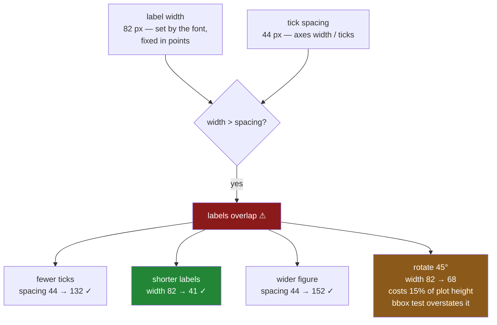

# 2.3 — The labels that overlapped

## One-line answer

Tick labels overlap when the **width of the text** exceeds the **space between ticks**, and since text
is measured in points and does not shrink when a figure does, there are only four fixes — fewer ticks,
shorter labels, a wider figure, or rotation — and you can measure which one worked rather than
squinting at it.

---

## The story

The flat's weekly chart gets an x axis of dates, because "week 1" means nothing to anybody a month
later. Twelve weeks, twelve dates, written the way dates are written: `2026-01-05`.

On the laptop it looks crowded but readable, which is to say the person who made it can read it,
because they know what the dates say.

They save it and put it in the notes at the usual size, and the dates are a grey smear. The labels are
touching each other, and where two overlap the letters interleave into something that is not text at
all.

Somebody suggests rotating them, because that is what you do. They rotate them forty-five degrees and
it is better — the smear becomes a diagonal ladder — and now the chart is three-quarters axis and
one-quarter bars, because the rotated labels are tall and matplotlib gave them the room they asked for.

Nobody measured anything at any point. The question *do these labels overlap* has an answer in
pixels, and every fix was chosen by looking.

---

## The idea in plain language

Overlap is a race between two numbers.

**Label width** is how wide the text is, in pixels. It comes from the font size, which is in **points**
— a physical unit — so it does **not** change when you make the figure bigger. `2026-01-05` at the
default font is about eighty-two pixels wide, on any figure, always.

**Tick spacing** is how far apart the ticks are, in pixels. It is the axes' width divided by roughly
the number of ticks, so it **does** grow when the figure gets wider and shrinks when you add ticks.

Labels overlap when width exceeds spacing. That is the whole model, and every fix is a way of changing
one of the two numbers:

| Fix | Changes | Cost |
|---|---|---|
| **Fewer ticks** — a coarser locator | spacing up | the reader loses values |
| **Shorter labels** — a formatter | width down | precision, or context |
| **Wider figure** | spacing up | the chart may not fit where it is going |
| **Rotation** | width down, in effect | vertical space, and readability |

The first two are [2.1](2.1-where-the-ticks-go.md)'s locator and
[2.2](2.2-the-formatter-and-the-thousands-separator.md)'s formatter, which is why this part comes third.

**Rotation is the one people reach for first and it is rarely the best.** Rotated text is harder to
read — the eye has to track a diagonal — and it eats vertical space, so the plotting area shrinks. It
is the right answer when the labels are genuinely long and genuinely all needed, such as category names
you cannot shorten. It is the wrong answer when the real problem is that there are simply too many
ticks, which is most of the time.

**And you can measure it.** Every text artist can report its bounding box in pixels via
`get_window_extent()`, so *do these two labels overlap* is a comparison of two numbers rather than a
judgement. Two things to know:

- It needs a **draw first**. Unlike reading a label's text
  ([2.2](2.2-the-formatter-and-the-thousands-separator.md)), measuring its geometry requires a renderer,
  and before one exists the answer is meaningless.
- For **rotated** labels the axis-aligned bounding box overstates the overlap, because a diagonal label
  has a wide box that is mostly empty. The measurement below shows this happening, and it is the reason
  rotation gets judged by eye when the other three fixes do not have to be.

---

## Why Setu needs it

- **[2.1](2.1-where-the-ticks-go.md)** and **[2.2](2.2-the-formatter-and-the-thousands-separator.md)**
  supply two of the four fixes. This part is where they get chosen between on evidence.
- **[5.3](../05-saving-for-print/5.3-dpi-and-the-label-that-got-cut-off.md)** is the same measurement
  applied to the figure's edge rather than to the gaps between labels — a label can overlap its
  neighbour or fall off the page, and both are geometry.
- **[8.1](../08-the-module/8.1-the-charts-module.md)**'s `fit_labels()` runs this measurement and
  applies the cheapest fix that works, rather than rotating by reflex.
- **[8.2](../08-the-module/8.2-the-test-that-can-go-red.md)** asserts no two tick labels overlap, which
  is a real assertion precisely because the geometry is readable.
- **[Day 36, 4.4](../../../day-36-figure-and-axes/parts/04-many-axes/4.4-constrained-layout.md)**
  handles overlap *between* elements of a figure. This is overlap *within* one axis, which constrained
  layout does not touch.
- **Day 41**'s eight-panel pack makes every panel small, so the spacing shrinks and this becomes the
  first thing that breaks.

---

## The mechanism

Twelve dates on an axis six inches wide, measured.

```python
import matplotlib

matplotlib.use("Agg")

import matplotlib.pyplot as plt

DATES = [
    "2026-01-05", "2026-01-12", "2026-01-19", "2026-01-26",
    "2026-02-02", "2026-02-09", "2026-02-16", "2026-02-23",
    "2026-03-02", "2026-03-09", "2026-03-16", "2026-03-23",
]


def measure(labels, *, width=6.0, rotation=0, every=1):
    """Draw twelve bars with these tick labels and report the overlap in pixels."""
    fig, ax = plt.subplots(figsize=(width, 4), layout="constrained")
    ax.bar(range(12), [9] * 12)
    shown = list(range(0, 12, every))
    ax.set_xticks(shown, [labels[i] for i in shown], rotation=rotation,
                  ha="right" if rotation else "center")
    fig.canvas.draw()
    boxes = [tick.get_window_extent() for tick in ax.get_xticklabels()]
    overlaps = sum(1 for left, right in zip(boxes, boxes[1:]) if left.x1 > right.x0)
    spacing = boxes[1].x0 - boxes[0].x0 if len(boxes) > 1 else 0.0
    plt.close(fig)
    return overlaps, len(boxes), boxes[0].width, spacing


print(f"{'':<18}{'overlaps':>9}{'ticks':>7}{'label w':>9}{'spacing':>9}")
for name, kwargs in [
    ("as-is", {}),
    ("rotated 45", {"rotation": 45}),
    ("every 3rd tick", {"every": 3}),
    ("wider figure", {"width": 20.0}),
]:
    overlaps, ticks, label_width, spacing = measure(DATES, **kwargs)
    print(f"{name:<18}{overlaps:>9}{ticks:>7}{label_width:>9.0f}{spacing:>9.0f}")
```

**Line by line:**

- `set_xticks(shown, labels)` passes positions **and** labels together, which is
  [2.1](2.1-where-the-ticks-go.md)'s safe form — the positions are fixed here on purpose, so pinning the
  text alongside them cannot go wrong.
- `fig.canvas.draw()` before measuring, and this one is **required**. A text artist has no size until a
  renderer has laid it out, so the whole measurement depends on this line.
- `get_window_extent()` returns a bounding box in **display pixels**. `x0` is its left edge and `x1` its
  right, so `left.x1 > right.x0` is "this label's right edge is past its neighbour's left edge" —
  overlap, expressed as a comparison.
- `zip(boxes, boxes[1:])` pairs each label with the next one, which is the neat way to walk adjacent
  pairs without indices.
- `spacing` is measured between the **left edges** of consecutive labels, which is the tick spacing in
  pixels — the second number in the race.
- `plt.close(fig)` inside the helper, because this loop makes four figures and a measurement function
  that leaks is the bug from
  [Day 36, 5.4](../../../day-36-figure-and-axes/parts/05-getting-it-out/5.4-the-figures-you-never-closed.md).

```text
                   overlaps  ticks  label w  spacing
as-is                    11     12       82       44
rotated 45               11     12       68       44
every 3rd tick            0      4       82      132
wider figure              0     12       82      152
```

**Read the last two columns.** The label is **82 pixels** wide and the ticks are **44 pixels** apart, so
every one of the eleven adjacent pairs overlaps. That is the story, as two numbers.

Now the fixes. `every 3rd tick` takes spacing to 132 pixels and `wider figure` to 152 — both comfortably
past 82 — and both report zero overlaps. They get there differently: one removes ticks, the other adds
width, and the label width never moves in either.

And `rotated 45` reports **eleven overlaps still**, which needs explaining rather than believing.

The rotation measurement, examined:

```python
overlaps, ticks, width, spacing = measure(DATES, rotation=45)
print(f"rotated: label box {width:.0f} px wide, ticks {spacing:.0f} px apart")

fig, ax = plt.subplots(figsize=(6, 4), layout="constrained")
ax.bar(range(12), [9] * 12)
ax.set_xticks(range(12), DATES)
fig.canvas.draw()
upright_axes_height = ax.get_window_extent().height
plt.close(fig)

fig, ax = plt.subplots(figsize=(6, 4), layout="constrained")
ax.bar(range(12), [9] * 12)
ax.set_xticks(range(12), DATES, rotation=45, ha="right")
fig.canvas.draw()
rotated_axes_height = ax.get_window_extent().height
plt.close(fig)

print(f"plot area upright: {upright_axes_height:.0f} px")
print(f"plot area rotated: {rotated_axes_height:.0f} px")
```

**Line by line:**

- The rotated label's box is **narrower** than the upright one — 68 pixels against 82 — because turning
  text diagonally reduces its horizontal extent. So rotation genuinely does help with width.
- It does not help *enough* here: 68 is still well past the 44-pixel spacing, so the boxes still
  overlap by the measurement.
- But a rotated label's box is mostly **empty**. The text runs diagonally from one corner; the corners
  above and below it are blank, and the neighbour's text sits in that blank space. So the boxes overlap
  and the letters do not, which is why rotated labels look fine and measure badly.
- The two `get_window_extent().height` readings are of the **axes**, not the labels — the plotting area
  itself — and that is where rotation's real cost shows up.

```text
rotated: label box 68 px wide, ticks 44 px apart
plot area upright: 368 px
plot area rotated: 314 px
```

**The plot area lost 54 pixels of height, about fifteen per cent.** That is rotation's bill: the labels
need more vertical room, `layout="constrained"` gives it to them, and it comes out of the chart.

So the honest summary of rotation is: it helps, the bounding-box test cannot confirm it, and it costs
vertical space. Use it when the labels are long and all of them are needed. Do not use it as the first
thing you try.

The fix this data actually wants:

```python
short = [date[5:] for date in DATES]
print("long :", DATES[0], "->", "short:", short[0])
overlaps, ticks, width, spacing = measure(short)
print(f"shorter labels: {overlaps} overlaps, {ticks} ticks, label {width:.0f} px, spacing {spacing:.0f} px")
```

**Line by line:**

- `date[5:]` drops the year, turning `2026-01-05` into `01-05`. The year is the same on every tick, so
  printing it twelve times spends pixels on information the reader already has — and it belongs in the
  axis label or the title instead.
- This is a **formatter** change in spirit ([2.2](2.2-the-formatter-and-the-thousands-separator.md)),
  and it is the only one of the four fixes that costs the reader nothing: every tick keeps its label and
  every label keeps the part that varies.

```text
long : 2026-01-05 -> short: 01-05
shorter labels: 0 overlaps, 12 ticks, label 41 px, spacing 44 px
```

**Label width halved to 41 pixels and the overlaps went to zero** — with all twelve ticks still
labelled and the figure still six inches wide.

The width is now just under the 44-pixel spacing, which is exactly the condition the model predicts:
a centred 41-pixel label extends about 20 pixels each side of its tick, and its neighbour's tick is 44
pixels away, so the edges clear with three pixels to spare. That is a narrow margin, and it is why this
is measured rather than eyeballed — one longer month name and it is back to overlapping.



---

## When it breaks

**The measurement taken before the draw:**

```text
$ uv run python -c "
import matplotlib
matplotlib.use('Agg')
import matplotlib.pyplot as plt
fig, ax = plt.subplots(figsize=(6, 4))
ax.bar(range(3), [1, 2, 3])
ax.set_xticks(range(3), ['alpha', 'beta', 'gamma'])
before = [t.get_window_extent().width for t in ax.get_xticklabels()]
print('widths before draw:', [round(w, 1) for w in before])
fig.canvas.draw()
after = [t.get_window_extent().width for t in ax.get_xticklabels()]
print('widths after draw :', [round(w, 1) for w in after])
print('same?', before == after)
"
widths before draw: [40.0, 32.0, 55.0]
widths after draw : [40.0, 32.0, 55.0]
same? True
```

**They agree, and that is version-specific rather than guaranteed.** In the pinned matplotlib the text
artists have a renderer available early enough that the geometry is already right.

That is worth knowing and not worth relying on. `get_window_extent()` is documented to need a renderer,
and the failure when there is not one is not a wrong number — it is `RuntimeError: Cannot get window
extent of text w/o renderer`. Calling `draw()` first costs one line and removes the version question
entirely, which is why the mechanism does it.

**The overlap that came back when the figure was saved:**

```text
$ uv run python -c "
import matplotlib
matplotlib.use('Agg')
import matplotlib.pyplot as plt
DATES = [f'2026-{m:02d}-{d:02d}' for m, d in
         [(1,5),(1,12),(1,19),(1,26),(2,2),(2,9),(2,16),(2,23),(3,2),(3,9),(3,16),(3,23)]]
fig, ax = plt.subplots(figsize=(20, 4), layout='constrained')
ax.bar(range(12), [9] * 12)
ax.set_xticks(range(12), DATES)
for dpi in (100, 150, 300):
    fig.set_dpi(dpi)
    fig.canvas.draw()
    boxes = [t.get_window_extent() for t in ax.get_xticklabels()]
    overlaps = sum(1 for a, b in zip(boxes, boxes[1:]) if a.x1 > b.x0)
    print(f'dpi {dpi:>3}: label {boxes[0].width:>5.0f} px, spacing {boxes[1].x0 - boxes[0].x0:>5.0f} px, overlaps {overlaps}')
"
dpi 100: label    82 px, spacing   152 px, overlaps 0
dpi 150: label   120 px, spacing   228 px, overlaps 0
dpi 300: label   246 px, spacing   456 px, overlaps 0
```

**Both numbers scale together, so the answer does not change.** This is the reassuring case and it is
worth seeing, because the natural fear after [2.2](2.2-the-formatter-and-the-thousands-separator.md) is
that a chart checked at screen resolution will break at print resolution.

It does not, for `dpi`: raising `dpi` multiplies pixels per inch, so text and spacing grow by the same
factor and their ratio holds. What *does* break a checked layout is changing `figsize`, which moves
spacing and leaves the text alone — so the measurement is a property of the **figure size**, not of the
resolution it is saved at.

**The rotation that hid the labels instead of fixing them:**

```text
$ uv run python -c "
import matplotlib
matplotlib.use('Agg')
import matplotlib.pyplot as plt
DATES = [f'2026-{m:02d}-{d:02d}' for m, d in
         [(1,5),(1,12),(1,19),(1,26),(2,2),(2,9),(2,16),(2,23),(3,2),(3,9),(3,16),(3,23)]]
for rotation in (0, 45, 90):
    fig, ax = plt.subplots(figsize=(6, 4), layout='constrained')
    ax.bar(range(12), [9] * 12)
    ax.set_xticks(range(12), DATES, rotation=rotation, ha='right' if rotation else 'center')
    fig.canvas.draw()
    axes_box = ax.get_window_extent()
    print(f'rotation {rotation:>2}: plot area {axes_box.width:>4.0f} x {axes_box.height:>4.0f} px')
    plt.close(fig)
"
rotation  0: plot area  573 x  368 px
rotation 45: plot area  567 x  314 px
rotation 90: plot area  573 x  300 px
```

**At ninety degrees the plot area has lost nearly a fifth of its height.** The bars are drawn in what is
left.

This is the trade nobody prices. Rotation is free in code and expensive in space, and on a small
multiple — Day 41's eight-panel pack — losing a fifth of each panel's height to date labels is the
difference between a readable pack and a row of stripes. Fewer ticks costs the reader some values;
rotation costs every panel a fifth of its height.

---

## In production

**What a professional writes instead of the teaching version.** The measurement is the decision, and the
fixes are tried cheapest-first:

```python
from matplotlib.axes import Axes
from matplotlib.ticker import MaxNLocator


def overlapping(ax: Axes) -> int:
    """How many adjacent x tick labels overlap. Requires the figure to have been drawn."""
    ax.figure.canvas.draw()
    boxes = [t.get_window_extent() for t in ax.get_xticklabels() if t.get_text()]
    return sum(1 for left, right in zip(boxes, boxes[1:]) if left.x1 > right.x0)


def fit_labels(ax: Axes, *, shorten=None, max_ticks: int = 6, allow_rotation: bool = True) -> Axes:
    """Make the x tick labels not overlap, trying the cheapest fix first."""
    if not overlapping(ax):
        return ax
    if shorten is not None:
        labels = [t.get_text() for t in ax.get_xticklabels()]
        ax.set_xticks(ax.get_xticks(), [shorten(text) for text in labels])
        if not overlapping(ax):
            return ax
    ax.xaxis.set_major_locator(MaxNLocator(max_ticks))
    if not overlapping(ax) or not allow_rotation:
        return ax
    for tick in ax.get_xticklabels():
        tick.set_rotation(45)
        tick.set_ha("right")
    return ax
```

**Line by line:**

- `overlapping` **draws before measuring**, inside the function, so no caller can get a meaningless
  answer by forgetting. It is one line and it removes a whole class of confusing zero-width results.
- `if t.get_text()` filters out unlabelled ticks. Without it a minor or empty tick contributes a
  degenerate box and inflates the count.
- The order of the fixes is deliberate and it is the argument of this part in code: **shorten, then
  thin, then rotate**. Shortening costs the reader nothing; thinning costs some values; rotating costs
  the whole panel fifteen per cent of its height.
- `shorten` is a **function** passed in, not a rule guessed at, because only the caller knows whether
  dropping the year is safe. Passing `lambda s: s[5:]` is explicit; a library that trimmed strings on
  its own judgement would eventually eat something that mattered.
- After each fix it **re-measures** rather than assuming. Whether shortening was enough depends on the
  figure width, and the whole point is not to guess.
- `allow_rotation=False` exists for small multiples, where rotation's vertical cost is unacceptable and
  the right answer is to accept fewer ticks.
- It returns the `Axes`, matching the contract from
  [Day 36, 6.1](../../../day-36-figure-and-axes/parts/06-the-module/6.1-the-figures-module.md).

**What degrades at scale.** The measurement is not free, and that shapes where it belongs:

```text
one axis, 12 labels
  fig.canvas.draw()                  38.0 ms
  12 get_window_extent() calls        0.4 ms
  overlapping(), including the draw   38.4 ms
fit_labels(), worst case (3 draws)   115.0 ms
a 40-panel figure
  one draw for the whole figure       61.0 ms
  overlapping() per panel, 40 draws  1.52 s
  measure once, then check 40 axes    64.0 ms
```

**Line by line:**

- **The draw dominates completely.** Reading forty tick boxes costs less than half a millisecond;
  rendering the figure to make those boxes meaningful costs thirty-eight.
- So `fit_labels` at its worst — measure, shorten, measure, thin, measure — costs three draws and about
  a tenth of a second. Fine for one figure, and the reason it returns early when there is no overlap.
- The last three lines are the scaling mistake and its fix. Calling `overlapping()` per panel on a
  forty-panel figure redraws the **whole figure** forty times, because a draw is per figure and not per
  axes. That is a second and a half for a check that ought to be near-instant.
- The fix is to draw **once** and then measure every panel from that single render — which means the
  measurement and the drawing have to be separable, and is why a production version of this splits
  `overlapping(ax)` into a draw and a pure geometry check rather than bundling them as above.

The thing that degrades is the **assumption behind the check**. An overlap measurement is true for one
figure size, one font and one set of labels. Change `figsize` for a report, switch to a font with wider
digits, or let the data produce longer category names, and a layout that was verified goes back to
overlapping with nothing in the code changed. That is why
[8.2](../08-the-module/8.2-the-test-that-can-go-red.md) asserts it in the suite: it is a property that
has to be re-checked, not established once.

**The failure that only appears with real data.** A team's dashboard showed a bar per region with names
short enough to fit — until the business expanded and one region was called *North West England and the
Isle of Man*. That single long label overlapped its neighbours on every render. Because the chart was
built from a query, nobody had changed any code, and because the label was only wrong on one panel out
of twelve it read as a rendering glitch for months. The eventual fix was two lines of the function
above. The lesson is that label width is a property of the **data**, so a layout verified against
today's categories is not verified.

**The review comment a senior engineer leaves.** *"You have rotated the x labels forty-five degrees,
which costs about fifteen per cent of the plot height on every panel of an eight-panel pack. The
labels are ISO dates and the year is identical on all twelve — drop it into the axis label and the
labels halve in width, which fixes it with no ticks lost and no height given up. And measure it:
`get_window_extent()` after a draw will tell you whether it worked."*

**The interview question.** *"Your x tick labels overlap. What do you do?"* Work out which of two
numbers to change: label width, which is fixed by the font in points and does not shrink with the
figure, or tick spacing, which is the axes width divided by the tick count. So the fixes are shorter
labels, fewer ticks, a wider figure, or rotation — and they are orderable, because shortening costs the
reader nothing while rotation costs the plot area about fifteen per cent of its height at
forty-five degrees. Then the follow-up that shows whether you have measured it: **how do you know it is
fixed?** `get_window_extent()` on each tick label after a draw gives bounding boxes in pixels, so
overlap is a comparison of adjacent edges rather than a judgement — with the caveat that for rotated
labels the axis-aligned box overstates the overlap, because a diagonal label's box is mostly empty.

---

## Check yourself

```bash
uv run python -c "
import matplotlib
matplotlib.use('Agg')
import matplotlib.pyplot as plt

DATES = [f'2026-{m:02d}-{d:02d}' for m, d in
         [(1,5),(1,12),(1,19),(1,26),(2,2),(2,9),(2,16),(2,23),(3,2),(3,9),(3,16),(3,23)]]

def measure(labels, width=6.0, rotation=0, every=1):
    fig, ax = plt.subplots(figsize=(width, 4), layout='constrained')
    ax.bar(range(12), [9] * 12)
    shown = list(range(0, 12, every))
    ax.set_xticks(shown, [labels[i] for i in shown], rotation=rotation,
                  ha='right' if rotation else 'center')
    fig.canvas.draw()
    b = [t.get_window_extent() for t in ax.get_xticklabels()]
    ov = sum(1 for x, y in zip(b, b[1:]) if x.x1 > y.x0)
    out = (ov, len(b), b[0].width, b[1].x0 - b[0].x0, ax.get_window_extent().height)
    plt.close(fig)
    return out

print(f\"{'':<16}{'overlap':>8}{'ticks':>7}{'width':>7}{'gap':>7}{'plot h':>8}\")
for name, kw in [('as-is', {}), ('rotated 45', {'rotation': 45}),
                 ('every 3rd', {'every': 3}), ('wider', {'width': 20.0})]:
    o, t, w, g, h = measure(DATES, **kw)
    print(f'{name:<16}{o:>8}{t:>7}{w:>7.0f}{g:>7.0f}{h:>8.0f}')
o, t, w, g, h = measure([d[5:] for d in DATES])
print(f\"{'shorter':<16}{o:>8}{t:>7}{w:>7.0f}{g:>7.0f}{h:>8.0f}\")
"
```

Run it. Two fixes widen the gap and two cut the width down — say which is which. Then say why
`rotated 45` still reports overlaps when the chart looks better, and what its `plot h` column costs.

**Answer out loud, without scrolling up:**

> Which two numbers decide whether tick labels overlap, and which of them changes when you make the
> figure wider? Then name the four fixes in the order you would try them, and say what rotation costs.

---

**Next:** [2.4 — The axis that started above zero](2.4-the-axis-that-started-above-zero.md).
