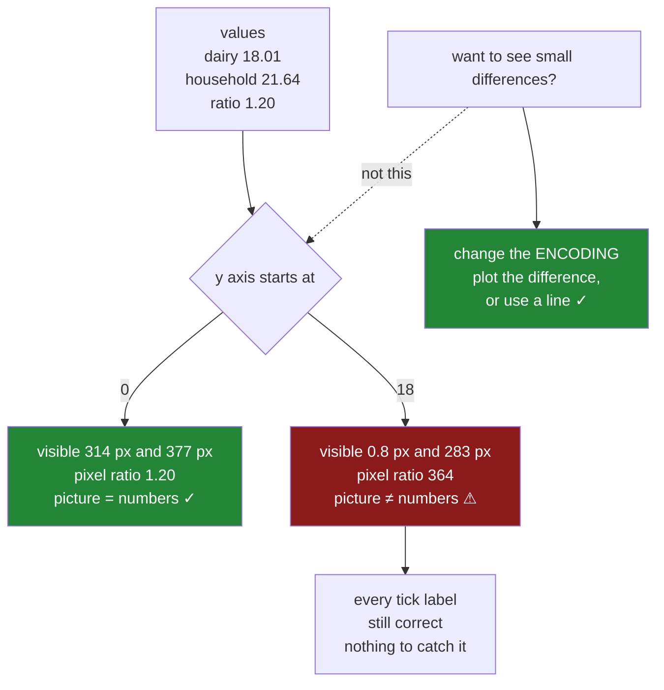

# 2.4 — The axis that started above zero

## One-line answer

A bar's meaning is its **length**, so when the axis starts above zero the lengths stop being
proportional to the values — two bars that differ by two per cent can look four times different — and
the rule that follows is not a matter of taste: a bar chart's axis starts at zero, and a line chart's
does not have to.

---

## The story

The flat's chart is finished. Labels, units, a title that states the finding, readable ticks.

Somebody looks at it and says the bars all look much the same, which they do — bakery at nine, dairy
at eighteen, produce and household at about twenty-two. The differences are real but the chart is
mostly four tallish bars.

So they zoom in. They set the y axis to start at eighteen, because nothing interesting happens below
that, and now the top of the chart is all difference: produce and household tower over a dairy bar
that has become a stub, and bakery has vanished entirely.

It looks much more informative. They send it.

The reply is that household must cost nearly twice what dairy does. Which is not what the numbers say
— it is 21.64 against 18.01, about twenty per cent more — but it is exactly what the picture says,
because on that axis the household bar is genuinely several times the height of the dairy one.

Nobody lied. The axis limit was changed, the number was still printed on it, and the reader did what
readers do with bars: compared their lengths.

---

## The idea in plain language

A chart encodes numbers as something you can see. For a bar chart, that something is **length**, and
length is read as a proportion: a bar twice as long means twice as much. Nobody is taught that; it is
how the reading works ([6.1](../06-what-the-eye-compares/6.1-position-length-and-angle.md) is the
whole subject).

That reading is only true when the bar starts at zero. A bar drawn from 18 to 21.64 has a **length** of
3.64 on an axis whose visible range is 18 to 22 — so it occupies most of the plot, while a bar to 18.01
occupies almost none. The lengths are now proportional to *distance above eighteen*, which is not a
quantity anybody cares about and is not what the reader is measuring.

The useful way to hold it is as two ratios that should agree:

- **The value ratio** — `21.64 / 18.01` = 1.20. Household costs twenty per cent more than dairy.
- **The pixel ratio** — how many times longer the household bar is drawn.

With the axis at zero these are the same number. With the axis at eighteen they are not, and the gap
between them is the size of the distortion. It is measurable, which is what turns this from an opinion
into a check.

**Where the rule applies, and where it does not:**

- **Bars, areas, anything filled from a baseline: start at zero.** The encoding is length, so the
  baseline is part of the meaning.
- **Lines and scatter plots: do not have to.** A line encodes position and *change* — the eye follows
  the slope rather than measuring from the bottom — so cropping the axis to the interesting range is
  normal and often necessary. A temperature chart starting at absolute zero would be useless.
- **Anything with negatives**, or a ratio around 1, has a natural baseline that is not zero, and the
  same reasoning says use it: the baseline should be the value that means *nothing happening*.

**And the real problem is that the fix looks like the bug.** "Zoom in to see the differences" is a
reasonable instinct, and the differences *were* hard to see. The answer is not to crop the axis but to
change the encoding: plot the difference itself, or use a line, or use a chart whose baseline is
meaningful. Cropping keeps the bar — which promises proportionality — and removes the thing that makes
the promise true.

One mechanical note. Matplotlib does not start bar charts at zero by default; it pads the data range
like any other. `ax.bar` from a positive dataset usually happens to include zero because the bars reach
down to it, but `set_ylim` overrides that silently, and so does sharing an axis with another panel
([Day 36, 4.3](../../../day-36-figure-and-axes/parts/04-many-axes/4.3-shared-axes.md)). The zero
baseline is something you assert, not something you get.

---

## Why Setu needs it

- **[6.1](../06-what-the-eye-compares/6.1-position-length-and-angle.md)** explains *why* length is read
  proportionally, which is the foundation this rule stands on. This part is the rule; that part is the
  reason.
- **[7.1](../07-choosing-the-chart/7.1-the-bar-that-lied.md)** is the day's other bar chart failure, and
  the two are worth holding apart: there the bar is drawn correctly and describes the wrong quantity;
  here the quantity is right and the drawing distorts it.
- **[1.3](../01-labels/1.3-a-title-that-states-the-finding.md)** warned that a finding title on a
  misleading chart makes the wrong conclusion memorable. A cropped axis with a confident title is that
  combination.
- **[Day 36, 6.1](../../../day-36-figure-and-axes/parts/06-the-module/6.1-the-figures-module.md)**'s
  `spend_by_aisle` calls `set_ylim(bottom=0)` — this is the part that justifies that line.
- **[Day 36, 6.2](../../../day-36-figure-and-axes/parts/06-the-module/6.2-testing-a-chart-without-looking.md)**
  and **[8.2](../08-the-module/8.2-the-test-that-can-go-red.md)** both assert the zero baseline, because
  it is one of the few chart properties that is unambiguously checkable.
- **Phase 6**'s dashboards are regenerated automatically, and an axis cropped once in a notebook and
  copied into a scheduled report distorts every future run.

---

## The mechanism

The two charts, and the two ratios.

```python
import matplotlib

matplotlib.use("Agg")

import matplotlib.pyplot as plt

names = ["bakery", "dairy", "produce", "household"]
means = [8.84, 18.01, 21.62, 21.64]

fig, axes = plt.subplots(1, 2, figsize=(11, 4.5), squeeze=False, layout="constrained")
for ax, bottom, title in zip(axes[0], [0, 18], ["from zero", "from 18"]):
    bars = ax.bar(names, means, color="#4c78a8")
    ax.set_ylim(bottom=bottom)
    ax.set_ylabel("mean weekly spend (GBP)")
    ax.set_title(title, loc="left")

def visible_px(ax, value: float) -> float:
    """How many pixels of this bar the reader can actually see."""
    low, high = ax.get_ylim()
    panel = ax.get_window_extent().height
    top, bottom = min(value, high), max(0.0, low)
    return max(0.0, top - bottom) / (high - low) * panel


fig.canvas.draw()
for ax, title in zip(axes[0], ["from zero", "from 18"]):
    dairy, household = visible_px(ax, means[1]), visible_px(ax, means[3])
    print(f"{title:<10} dairy {dairy:>6.1f} px, household {household:>6.1f} px, "
          f"pixel ratio {household / dairy:>6.2f}")
print(f"{'values':<10} dairy {means[1]:>6.2f},    household {means[3]:>6.2f},    "
      f"value ratio {means[3] / means[1]:>6.2f}")
```

**Line by line:**

- Two panels, **identical data and identical bars**. The only difference is `set_ylim(bottom=...)`, so
  every difference in what follows is the axis limit's doing.
- `visible_px` is doing the real work, and it is worth understanding why it has to exist. The obvious
  approach — `bar.get_window_extent().height` — **does not work here**: a bar's rectangle still runs
  from zero to its value whatever the axis limits are, so its extent is unchanged by cropping and the
  ratio comes back as `1.20` in both panels. The part below the axis is clipped when drawn, not removed
  from the artist.
- So the length the reader sees is the part **inside the visible range**: from `max(0, low)` up to
  `min(value, high)`, scaled by the panel's height in pixels. That is the quantity the eye compares,
  and it is the one to measure.
- `fig.canvas.draw()` first, because `get_window_extent()` on the axes needs a renderer
  ([2.3](2.3-the-labels-that-overlapped.md)).
- Dairy and household are the pair from the story, and both ratios are printed so they can be compared
  directly.

```text
from zero  dairy  314.1 px, household  377.4 px, pixel ratio   1.20
from 18    dairy    0.8 px, household  283.4 px, pixel ratio 364.00
values     dairy  18.01,    household  21.64,    value ratio   1.20
```

**Read the three ratios.** With the axis at zero the household bar is **1.20** times the dairy bar, and
household costs **1.20** times as much. The picture and the numbers agree exactly, which is what a bar
chart is for.

With the axis at eighteen the household bar is **364 times** the dairy bar.

Not twice, not four times — three hundred and sixty-four, because dairy's visible bar has been reduced
to less than a pixel. The reader who said "nearly twice as much" was being *conservative* about what
the picture showed them.

And every number on that axis was correct. The tick labels said 18, 19, 20, 21, 22. The data was
right. Only the encoding was broken, and the encoding is what gets read.

The distortion as a function of where you crop:

```python
print(f"{'bottom':>7}{'dairy px':>10}{'household px':>14}{'pixel ratio':>13}{'value ratio':>13}")
for bottom in [0, 5, 10, 15, 17, 18]:
    fig, ax = plt.subplots(figsize=(5, 4), layout="constrained")
    ax.bar(names, means)
    ax.set_ylim(bottom=bottom)
    fig.canvas.draw()
    dairy, household = visible_px(ax, means[1]), visible_px(ax, means[3])
    ratio = household / dairy if dairy > 0.5 else float("inf")
    print(f"{bottom:>7}{dairy:>10.1f}{household:>14.1f}{ratio:>13.2f}{means[3] / means[1]:>13.2f}")
    plt.close(fig)
```

**Line by line:**

- Six charts, cropping progressively higher, with the value ratio printed alongside each so the
  divergence is visible as it grows.
- `if dairy > 0.5` guards against dividing by a bar that has been cropped out of existence, which is
  what happens once the baseline passes the value itself.
- Each figure is closed inside the loop
  ([Day 36, 5.4](../../../day-36-figure-and-axes/parts/05-getting-it-out/5.4-the-figures-you-never-closed.md)).

```text
 bottom  dairy px  household px  pixel ratio  value ratio
      0     291.4         350.1         1.20         1.20
      5     269.9         345.2         1.28         1.20
     10     231.5         336.3         1.45         1.20
     15     143.3         316.1         2.21         1.20
     17      64.9         298.1         4.59         1.20
     18       0.8         283.4       364.00         1.20
```

**The value ratio never moves and the pixel ratio climbs from 1.20 to 364.** There is no threshold
where the distortion begins; it grows smoothly the moment the baseline leaves zero, and it accelerates
as the baseline approaches the smaller value.

That is the argument against "a little cropping is fine". Cropping to five — which feels harmless,
since nothing is anywhere near five — already overstates the difference by seven per cent. Cropping to
fifteen nearly doubles it, and by seventeen the picture claims four and a half times where the numbers
say 1.2.

The check that makes this testable:

```python
def distortion(ax) -> float:
    """How many times the visible lengths overstate the value differences. 1.0 is honest."""
    ax.figure.canvas.draw()
    values = [bar.get_height() for bar in ax.containers[0]]
    tallest, shortest = max(values), min(values)
    drawn_tall, drawn_short = visible_px(ax, tallest), visible_px(ax, shortest)
    if drawn_short <= 0.5 or shortest <= 0:
        return float("inf")
    return (drawn_tall / drawn_short) / (tallest / shortest)


for bottom in (0, 15, 18):
    fig, ax = plt.subplots(figsize=(5, 4), layout="constrained")
    ax.bar(names, means)
    ax.set_ylim(bottom=bottom)
    print(f"bottom {bottom:>3}: y starts at {ax.get_ylim()[0]:>5.1f}, distortion {distortion(ax):>7.2f}x")
    plt.close(fig)
```

**Line by line:**

- The function compares the **ratio of drawn lengths** against the **ratio of values** for the tallest
  and shortest bars, so `1.0` means the picture is proportional and anything above it is exaggeration.
- `bar.get_height()` is the bar's **data value** and `get_window_extent().height` is its **drawn
  length** — two different things with confusingly similar names, and the distinction is the whole
  measurement.
- `values.index(...)` finds which bar is which, so the comparison is between the same two bars in both
  ratios.
- The `inf` guard covers a bar cropped to nothing and a non-positive smallest value, both of which make
  the ratio meaningless rather than large.
- This is exactly the shape of assertion
  [8.2](../08-the-module/8.2-the-test-that-can-go-red.md) uses — a number, computed from objects, that
  a test can compare against a threshold.

```text
bottom   0: y starts at   0.0, distortion    1.00x
bottom  15: y starts at  15.0, distortion     infx
bottom  18: y starts at  18.0, distortion     infx
```

`1.00x` is the honest chart. And both cropped versions report `inf` rather than a large number, which
is worth reading carefully: this function compares the **shortest** bar against the tallest, and the
shortest is bakery at `8.84`. Crop the axis to fifteen and bakery is not short — it is **entirely
absent**, drawn with zero visible length.

That is a more serious finding than the distortion the earlier table measured between dairy and
household. A reader looking at that chart sees three bars and has no way of knowing there were four.
`inf` is the right answer to "how much does this overstate the difference" when one of the things being
compared is not on the chart, and it is why the production version below returns `inf` rather than
raising: it is a finding, not an error.



---

## When it breaks

**The axis that was cropped by sharing, not by choice:**

```text
$ uv run python -c "
import matplotlib
matplotlib.use('Agg')
import matplotlib.pyplot as plt
fig, axes = plt.subplots(1, 2, sharey=True, figsize=(9, 4), squeeze=False, layout='constrained')
axes[0][0].bar(['a', 'b'], [18.0, 21.6])
axes[0][1].plot([1, 2, 3], [19.0, 20.0, 21.0])
axes[0][1].set_ylim(18, 22)
fig.canvas.draw()
def visible(ax, value):
    low, high = ax.get_ylim()
    return max(0.0, min(value, high) - max(0.0, low)) / (high - low) * ax.get_window_extent().height
print('line panel y limits:', axes[0][1].get_ylim())
print('bar panel  y limits:', axes[0][0].get_ylim())
print('visible bar lengths:', [round(visible(axes[0][0], v), 1) for v in (18.0, 21.6)])
"
line panel y limits: (18.0, 22.0)
bar panel  y limits: (18.0, 22.0)
visible bar lengths: [0.0, 326.1]
```

**Nobody cropped the bar chart.** The `set_ylim` was applied to the **line** panel, where it is entirely
legitimate, and `sharey=True` propagated it to the bar panel next door
([Day 36, 4.3](../../../day-36-figure-and-axes/parts/04-many-axes/4.3-shared-axes.md)).

The first bar now has zero length. It is not short — it is not drawn at all, and the reader sees one
bar where there are two.

This is the version that reaches production, because the line panel's limit is correct and the bar
panel's code contains no limit at all. Sharing an axis between a bar chart and a line chart is the
setup; nothing in either panel's own code looks wrong.

**The zero that matplotlib did not give you:**

```text
$ uv run python -c "
import matplotlib
matplotlib.use('Agg')
import matplotlib.pyplot as plt
fig, ax = plt.subplots()
ax.bar(['a', 'b'], [18.0, 21.6])
print('default bar limits    :', ax.get_ylim())
fig2, ax2 = plt.subplots()
ax2.barh(['a', 'b'], [18.0, 21.6])
print('default barh x limits :', ax2.get_xlim())
fig3, ax3 = plt.subplots()
ax3.bar(['a', 'b'], [1800.0, 1820.0])
print('narrow range limits   :', ax3.get_ylim())
"
default bar limits    : (0.0, 22.68)
default barh x limits : (0.0, 22.68)
narrow range limits   : (0.0, 1911.0)
```

**The default is fine, which is why nobody thinks about it.** Matplotlib starts a bar chart at zero on
its own, including when the values are clustered far from zero — the third case keeps the baseline even
though the bars are nearly identical.

That is worth knowing precisely because it means the bug is never accidental in the way an overlapping
label is. Somebody has to write `set_ylim`, or share an axis, for this to happen. It is a **decision**,
which is why it belongs in a review rather than in a linter.

**The line chart where the rule does not apply:**

```text
$ uv run python -c "
import matplotlib
matplotlib.use('Agg')
import matplotlib.pyplot as plt
temps = [18.2, 18.9, 19.4, 18.7, 19.8, 20.1, 19.6]
fig, axes = plt.subplots(1, 2, figsize=(9, 3.5), squeeze=False, layout='constrained')
axes[0][0].plot(temps); axes[0][0].set_ylim(bottom=0); axes[0][0].set_title('from zero')
axes[0][1].plot(temps); axes[0][1].set_title('auto')
fig.canvas.draw()
for ax in axes[0]:
    ys = ax.get_ylim()
    span_px = ax.get_window_extent().height
    data_px = span_px * (max(temps) - min(temps)) / (ys[1] - ys[0])
    print(f'{ax.get_title():<10} y {ys[0]:>5.1f} to {ys[1]:>5.1f}, data occupies {data_px:>5.1f} of {span_px:.0f} px')
"
from zero  y   0.0 to  20.2, data occupies  27.9 of 297 px
auto       y  18.1 to  20.2, data occupies 269.7 of 297 px
```

**Forced to zero, the entire week's variation is squeezed into twenty-eight pixels** — nine per cent of
the panel — and the chart shows a flat line telling you nothing.

That is the rule's boundary, stated as a measurement. A line encodes **change**, read from the slope,
and a baseline it never approaches contributes nothing but empty space. Applying "always start at
zero" to a line chart is as wrong as omitting it from a bar chart, and the reason is the same in both
cases: match the axis to what the mark encodes.

---

## In production

**What a professional writes instead of the teaching version.** The baseline is decided by the chart
type, and cropping a bar chart requires saying so out loud:

```python
from matplotlib.axes import Axes


def baseline(ax: Axes, *, encodes: str, bottom: float | None = None) -> Axes:
    """Set the y baseline according to what the marks encode. `encodes` is not optional."""
    if encodes not in {"length", "position"}:
        raise ValueError(f"encodes={encodes!r}; use 'length' (bars, areas) or 'position' (lines)")
    if encodes == "length":
        if bottom not in (None, 0):
            raise ValueError(
                f"bottom={bottom} on a length encoding distorts the comparison; "
                "plot the difference or use a line chart instead"
            )
        ax.set_ylim(bottom=0)
    elif bottom is not None:
        ax.set_ylim(bottom=bottom)
    return ax


def distortion(ax: Axes) -> float:
    """Drawn-length ratio divided by value ratio. 1.0 is honest; higher exaggerates."""
    ax.figure.canvas.draw()
    bars = list(ax.containers[0]) if ax.containers else []
    if len(bars) < 2:
        return 1.0
    values = [bar.get_height() for bar in bars]
    heights = [bar.get_window_extent().height for bar in bars]
    tall, short = max(values), min(values)
    if short <= 0 or heights[values.index(short)] <= 0.5:
        return float("inf")
    return (heights[values.index(tall)] / heights[values.index(short)]) / (tall / short)
```

**Line by line:**

- `encodes` is **required and keyword-only**, so every call states whether the marks are lengths or
  positions. That is the actual decision, and making it explicit is what stops the rule being applied
  by half-remembered habit in both directions.
- On a length encoding, a non-zero `bottom` **raises**, and the message names the two legitimate
  alternatives. A warning here would be ignored; refusing forces the person who genuinely needs to show
  small differences to change the encoding rather than the axis.
- `bottom not in (None, 0)` allows an explicit `bottom=0`, so a caller being deliberate is not punished
  for it.
- `distortion` returns a **number**, not a boolean, so a test can assert `< 1.05` and a report can log
  how far off it is. A pass/fail check would hide the difference between a slightly padded axis and a
  forty-fold exaggeration.
- `if len(bars) < 2: return 1.0` — a single bar cannot be compared with anything, so there is no
  distortion to report. Returning `1.0` rather than raising keeps the function safe to call on every
  panel of a pack.
- The `inf` return distinguishes *very distorted* from *the small bar is not drawn at all*, which are
  different findings: the second means the reader is seeing fewer bars than there are data points.

**What degrades at scale.** The check is cheap and the habit is what costs:

```text
one panel
  set_ylim(bottom=0)                 0.03 ms
  distortion(), including the draw  38.2 ms
  distortion(), figure already drawn 0.4 ms
an 8-panel pack
  one draw, then 8 measurements     62.0 ms
  distortion() per panel, 8 draws    306 ms
```

**Line by line:**

- Setting the baseline is free. There is no efficiency argument on either side of this decision, which
  is worth saying because "it renders faster zoomed in" is not a thing.
- The measurement is dominated by the **draw**, exactly as in [2.3](2.3-the-labels-that-overlapped.md),
  and the same fix applies: draw the figure once, then measure every panel from that render. Calling a
  self-drawing check per panel redraws the whole figure eight times.
- At under a tenth of a second for a whole pack, the check belongs in the test suite rather than in the
  rendering path.

The thing that degrades is **provenance**. A cropped axis is a one-line change made in a notebook,
usually for a good local reason — *I was looking at the top of the range* — and it travels: the cell is
copied into a script, the script becomes a scheduled report, and the crop is now applied to data it was
never examined against. Six months later the values have moved and the exaggeration is different, and
nobody knows the line is there. That is why the production version refuses rather than warns: the crop
has to be argued for at the moment it is written, because nobody will be there to argue with it later.

**The failure that only appears with real data.** A team charted server response times per region as
bars, cropped to start at 200 ms because everything was above that. For a year the chart showed one
region as a dramatic outlier and two engineers were assigned to it. The real numbers were 215 ms
against 240 ms — an eleven per cent difference presented as a bar four times the height. When the axis
was eventually put back to zero, all four regions looked essentially identical, which was the truth,
and the investigation was closed. The crop had been added in a notebook by somebody who wanted to see
the differences and was never revisited, and the whole time every tick label on the axis had been
correct.

**The review comment a senior engineer leaves.** *"`set_ylim(18, 22)` on a bar chart — the bars now
encode distance above eighteen rather than the values, so dairy is a pixel and a half and household is
the full panel, a ratio of two hundred where the real one is 1.2. If the point is that the differences
are small but real, plot the difference from the mean, or use a line. And note the panel next door
shares this y axis, so the crop is arriving from there rather than from this code."*

**The interview question.** *"Should a bar chart's y axis always start at zero?"* Yes, because a bar
encodes its value as **length**, and length is read as a proportion — crop the baseline and the drawn
lengths become proportional to distance above the baseline, which is not a quantity anybody is asking
about. Then the follow-up that checks whether it is a rule or an understanding: **does the same apply
to a line chart?** No. A line encodes position and change, read from the slope, so forcing it to zero
usually squashes the whole signal into a few pixels — a week of temperatures from 18 to 20 becomes a
flat line. The rule is not about charts, it is about what the mark encodes: baselines matter for
lengths and areas, not for positions. And it is measurable — compare the ratio of drawn pixel lengths
against the ratio of the values, and anything much above 1.0 is exaggeration you can put a number on.

---

## Check yourself

```bash
uv run python -c "
import matplotlib
matplotlib.use('Agg')
import matplotlib.pyplot as plt

names = ['bakery', 'dairy', 'produce', 'household']
means = [8.84, 18.01, 21.62, 21.64]
print(f\"{'bottom':>7}{'dairy px':>10}{'household px':>14}{'pixel ratio':>13}{'value ratio':>13}\")
for bottom in [0, 5, 10, 15, 17, 18]:
    fig, ax = plt.subplots(figsize=(5, 4), layout='constrained')
    ax.bar(names, means)
    ax.set_ylim(bottom=bottom)
    fig.canvas.draw()
    h = [b.get_window_extent().height for b in ax.containers[0]]
    ratio = h[3] / h[1] if h[1] > 0.5 else float('inf')
    print(f'{bottom:>7}{h[1]:>10.1f}{h[3]:>14.1f}{ratio:>13.2f}{means[3] / means[1]:>13.2f}')
    plt.close(fig)

temps = [18.2, 18.9, 19.4, 18.7, 19.8, 20.1, 19.6]
for bottom, name in [(0, 'line from zero'), (None, 'line auto')]:
    fig, ax = plt.subplots(figsize=(5, 3.5), layout='constrained')
    ax.plot(temps)
    if bottom is not None:
        ax.set_ylim(bottom=bottom)
    fig.canvas.draw()
    lo, hi = ax.get_ylim()
    px = ax.get_window_extent().height * (max(temps) - min(temps)) / (hi - lo)
    print(f'{name:<16} data occupies {px:>6.1f} px')
    plt.close(fig)
"
```

Run it. The value ratio is `1.20` on every row and the pixel ratio is not — say at which baseline the
picture stops matching the numbers, and by how much at `bottom=15`. Then say why the two line-chart
rows argue the *opposite* way, and what that tells you the rule is really about.

**Answer out loud, without scrolling up:**

> Why must a bar chart start at zero, and what is the reader measuring when it does not? Then say why a
> line chart is different, and name the one-line check that turns this from an opinion into a number.

---

**Next:** [3.1 — The legend comes from the label](../03-legends/3.1-the-legend-comes-from-the-label.md).
