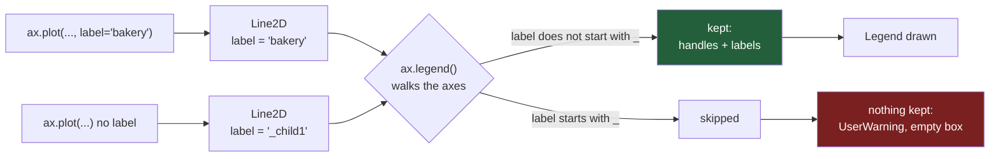

# 3.1 — The legend comes from the label

## One-line answer

A legend is not a thing you add to a chart; it is a list matplotlib **collects** from the `label=`
you passed when you drew each line, and if you never passed one, `ax.legend()` prints a warning and
draws an empty box.

---

## The story

The flat's chart has moved on. Instead of four bars, it now shows twelve weeks — one wiggly line per
aisle, all four on the same picture, so you can see the shape of the shopping over time.

It is a much better chart. The lines have different colours. One of them clearly goes up and down
like a saw, and the other three stay roughly flat. Somebody screenshots it into the group chat, and
the reply comes back in under a minute:

> **"which line is household?"**

And that is a fair question, because there is nothing on the picture that says. There is a blue
line, an orange line, a green line and a red line. The person who made the chart knows perfectly
well that blue is bakery, because they typed `bakery` first. Nobody else has that information. The
colours came out of a list matplotlib keeps, in the order the lines were drawn, and that order is
invisible to anyone looking at the result.

So they add the missing bit. They type `ax.legend()` at the end of the script, run it again, and
the terminal says something they were not expecting:

> `UserWarning: No artists with labels found to put in legend.`

The chart comes back with a small empty rectangle in the corner. Not a legend with four entries.
Not an error. A box with nothing in it, and a sentence in the terminal that scrolls away the next
time they run anything.

---

## The idea in plain language

A **series** is one set of numbers drawn as one shape. Four aisles drawn on one chart is four
series: bakery is a series, dairy is a series, and so on. Each one comes out in a different colour so
that your eye can follow one of them across the picture without losing it among the others.

Colour on its own tells you that two points belong together. It does not tell you *what* they belong
to. Something has to say "the blue one is bakery", and that something is a **legend** — a small block
of text and matching colour swatches, drawn on top of the chart, that maps each colour back to a
name.

The thing beginners expect is that `ax.legend()` looks at the chart, sees four lines, and asks you
what they are called. It does not. matplotlib has no idea what your data is about. It cannot see
your variable names, your column headings or your intentions. **It only knows what you told it at
the moment you drew each line.**

That telling is one keyword argument. On Day 36 you met the word **artist**: every visible thing on
a matplotlib figure — a line, a bar, a piece of text, a tick mark — is an object called an artist
([Day 36, 1.3](../../../day-36-figure-and-axes/parts/01-the-two-objects/1.3-everything-is-an-artist.md)).
Every artist carries a **label**, which is a short string it holds on to. You set it when you draw:

> `ax.plot(week, spend["dairy"], label="dairy")`

The line now carries the string `"dairy"` around with it for the rest of its life.

Later, `ax.legend()` walks the axes, asks every artist for its label, keeps the ones whose labels
look like real names, and builds the legend out of what it found. Two steps, separated in time and
in code: **you label when you draw, and matplotlib collects when you ask.** If the two steps are far
apart in your script — and they usually are, because the labelling is inside a loop and the
`ax.legend()` is at the bottom — it is very easy to do the second without ever having done the
first.

There is one more rule, and it is the reason the warning says what it says. An artist that you never
labelled does not have an empty label. It has a label like `_child0` — the underscore is matplotlib
marking it as **internal, not for display**. Any label starting with an underscore is skipped by
`legend()`. So an unlabelled chart is not a chart with four blank entries; it is a chart with four
entries matplotlib has been told to ignore, which is why the box comes out completely empty rather
than showing four colours with no names.

The **handle** is the last piece of vocabulary. When matplotlib collects the legend, it gathers two
parallel lists: the **labels** (the strings) and the **handles** (the artists those strings came
from). The handle is what the little coloured sample in the legend is drawn from. Keeping those two
lists lined up is the whole correctness question of a legend, and it is what
[3.3](3.3-the-series-nobody-could-name.md) is about.

---

## Why Setu needs it

- **[3.2](3.2-where-the-legend-sits.md)** takes the legend that now exists and puts it somewhere it
  does not sit on top of the data. You cannot place a legend you have not built.
- **[3.3](3.3-the-series-nobody-could-name.md)** is what happens when the label list and the handle
  list drift apart, so the legend confidently names the wrong colour. Everything in that part starts
  from the two lists this part introduces.
- **[5.1](../05-saving-for-print/5.1-the-greyscale-test-you-can-run.md)** prints the chart in black
  and white. The legend swatches are exactly the things that collapse into the same grey, so the
  greyscale test is really a test of whether the legend still works.
- **[8.2](../08-the-module/8.2-the-test-that-can-go-red.md)** turns "every series is named" into an
  assertion, and the thing it asserts on is `ax.get_legend_handles_labels()` — the function this part
  ends on.
- **Day 41** is the phase gate: eight charts in one pack. Eight charts is where "I will name the
  series later" stops being survivable, because by then you no longer remember which script drew
  which picture.

---

## The mechanism

The flat's twelve weeks, built from one seed so your numbers match this page's
([1.1](../01-labels/1.1-the-chart-that-never-said-what-the-numbers-were.md) explains every line of
this function):

```python
import warnings

import matplotlib
import numpy as np
import pandas as pd

matplotlib.use("Agg")
import matplotlib.pyplot as plt


def weekly_spend() -> pd.DataFrame:
    """Twelve weeks of the flat's shopping, four aisles, in pounds."""
    rng = np.random.default_rng(37)
    columns = {}
    steady = [("bakery", 9.0, 1.5), ("dairy", 18.0, 2.0), ("produce", 22.0, 2.5)]
    for aisle, centre, spread in steady:
        columns[aisle] = np.round(rng.normal(centre, spread, 12), 2)
    household = np.empty(12)
    household[0::2] = rng.normal(5.0, 1.0, 6)
    household[1::2] = rng.normal(37.5, 3.0, 6)
    columns["household"] = np.round(household, 2)
    return pd.DataFrame(columns, index=pd.RangeIndex(1, 13, name="week"))


spend = weekly_spend()
print(spend.mean().round(2).to_dict())
```

**Line by line:**

- `import warnings` is here because the failure in this part is a **warning**, not an exception, and
  a warning printed to a terminal is a thing you can miss. Catching it deliberately is how you make
  it visible on the page.
- `matplotlib.use("Agg")` before importing `pyplot` picks the backend that writes files and never
  opens a window. It must come first, because importing `pyplot` chooses a backend if none has been
  chosen yet.
- `np.random.default_rng(37)` is the seeded generator from
  [Day 20, 4.1](../../../day-20-arrays-and-dtypes/parts/04-random/4.1-default-rng-the-generator.md).
  The seed is the day number.
- `household[0::2]` and `household[1::2]` fill the alternate weeks separately — a quiet week near £5,
  then a big restock near £37.50. The flat buys cleaning things fortnightly, which is why household
  is the line that saws up and down while the other three stay flat.
- `pd.RangeIndex(1, 13, name="week")` numbers the rows 1 to 12 and names the index `week`, so the
  x values below are real week numbers rather than positions.

```text
{'bakery': 8.84, 'dairy': 18.01, 'produce': 21.62, 'household': 21.64}
```

### The chart from the story: four lines, no labels

```python
fig, ax = plt.subplots(figsize=(6, 3.5))
for aisle in spend.columns:
    ax.plot(spend.index, spend[aisle])

print("collected:", ax.get_legend_handles_labels())
print("the labels the lines are actually carrying:", [line.get_label() for line in ax.lines])

with warnings.catch_warnings(record=True) as caught:
    warnings.simplefilter("always")
    legend = ax.legend()
    for w in caught:
        print(f"{w.category.__name__}: {w.message}")

print("a legend object was still created:", ax.get_legend() is not None)
print("entries in it:", [t.get_text() for t in legend.get_texts()])
```

**Line by line:**

- `for aisle in spend.columns` draws one line per column, in column order, which is also the order
  matplotlib hands out colours. Bakery gets colour one, dairy colour two, and so on. That order is
  the invisible thing the group chat cannot see.
- `ax.get_legend_handles_labels()` is the read-back call, the same idea as `ax.get_ylabel()` in
  [1.1](../01-labels/1.1-the-chart-that-never-said-what-the-numbers-were.md). It returns a
  **two-tuple**: the handles it would use, and the labels it would print. Calling it *before*
  `ax.legend()` is how you find out what the legend is going to say without drawing anything.
- `line.get_label()` asks each line directly what string it is carrying. This is the layer
  underneath the collection step, and printing it is how the underscore rule stops being folklore.
- `warnings.catch_warnings(record=True)` collects warnings into a list instead of letting them print
  and vanish. `simplefilter("always")` switches off Python's deduplication, which normally shows a
  given warning once per location and then stays quiet — the exact behaviour that lets this one
  disappear on the second run.
- `legend.get_texts()` returns the `Text` artists inside the legend. An empty list means an empty
  legend, and that is a fact you can assert on rather than a thing you have to look at.

```text
collected: ([], [])
the labels the lines are actually carrying: ['_child0', '_child1', '_child2', '_child3']
UserWarning: No artists with labels found to put in legend.  Note that artists whose label start with an underscore are ignored when legend() is called with no argument.
a legend object was still created: True
entries in it: []
```

**Three things in that output are worth stopping on.** The collection came back as two empty lists.
The four lines are each carrying a label already — `_child0` through `_child3` — and every one of
them begins with an underscore, which is matplotlib's way of saying *this is internal plumbing, do
not display it*. And a legend object was created anyway. It is empty, it is drawn, and nothing
raised.

### The same chart with labels

```python
fig, ax = plt.subplots(figsize=(6, 3.5))
for aisle in spend.columns:
    ax.plot(spend.index, spend[aisle], label=aisle)

handles, labels = ax.get_legend_handles_labels()
print("labels:", labels)
print("handles:", [type(h).__name__ for h in handles])
print("colour of the handle for", labels[3], "->", tuple(round(c, 3) for c in handles[3].get_color()))

legend = ax.legend()
print("entries in the legend:", [t.get_text() for t in legend.get_texts()])
```

**Line by line:**

- `label=aisle` is the entire fix. The string comes from `spend.columns`, so it is the column name
  itself rather than a literal somebody typed a second time. That matters more than it looks: a
  literal can drift away from the data, and a column name cannot.
- `handles, labels = ...` unpacks the two-tuple into two names. They are **parallel lists** —
  `handles[3]` is the artist that `labels[3]` names — and every legend bug in
  [3.3](3.3-the-series-nobody-could-name.md) is these two lists getting out of step.
- `handles[3].get_color()` proves the pairing is real: the fourth handle is the actual `Line2D`
  object drawn for household, so its colour is household's colour, not a copy that might disagree.
- `ax.legend()` with no arguments now finds four labelled artists and builds the legend from them.
  No warning, because there is something to put in it.

```text
labels: ['bakery', 'dairy', 'produce', 'household']
handles: ['Line2D', 'Line2D', 'Line2D', 'Line2D']
colour of the handle for household -> (0.839, 0.153, 0.157)
entries in the legend: ['bakery', 'dairy', 'produce', 'household']
```

### The two steps, drawn



**The label travels with the artist; the legend is assembled later from whatever survived the
underscore rule.** Once you can see that as two separate moments, the warning stops being mysterious.

### Turning one series off

The underscore rule is not only a default. It is a switch you can use on purpose:

```python
fig, ax = plt.subplots(figsize=(6, 3.5))
ax.plot(spend.index, spend["dairy"], label="dairy")
ax.plot(spend.index, spend["bakery"], label="_bakery, drawn for context only")
ax.plot(spend.index, spend["produce"], label="")
print("labels collected:", ax.get_legend_handles_labels()[1])
```

**Line by line:**

- `label="_bakery, drawn for context only"` starts with an underscore, so the line is drawn and the
  legend ignores it. This is the honest way to put a faint background series on a chart without
  cluttering the key.
- `label=""` is the empty string, which is **falsy**, so it is dropped too — but for a different
  reason, and with no warning either way. An empty label is almost always a bug: it means a name was
  computed and came out blank.
- The read-back prints only what survived, which is the point of using it as a check rather than
  trusting the code.

```text
labels collected: ['dairy']
```

---

## When it breaks

**The warning that is not an error:**

```text
$ uv run python -c "
import matplotlib
matplotlib.use('Agg')
import matplotlib.pyplot as plt
fig, ax = plt.subplots()
for values in ([9, 10, 8], [18, 17, 19], [22, 21, 23], [5, 38, 4]):
    ax.plot([1, 2, 3], values)
leg = ax.legend()
print('exit code is still 0, and the legend has', len(leg.get_texts()), 'entries')
"
```

```text
<string>:8: UserWarning: No artists with labels found to put in legend.  Note that artists whose label start with an underscore are ignored when legend() is called with no argument.
exit code is still 0, and the legend has 0 entries
```

**What it means.** matplotlib found nothing to name, said so, and carried on. The script succeeds.
The file is written. In a notebook the warning appears once, above the picture, in the same grey as
every other notebook message, and on the second run Python's deduplication hides it entirely. This
is the failure mode of a warning: it is loudest exactly once, at the moment you are least likely to
be reading.

**The smallest fix** is `label=` on every draw call. The check that stops it coming back is
`assert ax.get_legend_handles_labels()[1]`, which is one line and fails loudly.

**The second failure — naming the series after the fact:**

There is an older form, `ax.legend(["bakery", "dairy", "produce", "household"])`, which takes the
names positionally and pairs them with the lines in drawing order. It works. It also fails in a way
that raises nothing at all:

```text
$ uv run python -c "
import matplotlib
matplotlib.use('Agg')
import matplotlib.pyplot as plt
import warnings
fig, ax = plt.subplots()
for values in ([9, 10, 8], [18, 17, 19], [22, 21, 23], [5, 38, 4]):
    ax.plot([1, 2, 3], values)
with warnings.catch_warnings(record=True) as caught:
    warnings.simplefilter('always')
    leg = ax.legend(['bakery', 'dairy'])
    print('warnings:', [str(w.message) for w in caught])
print('lines drawn        :', len(ax.lines))
print('entries in the key :', [t.get_text() for t in leg.get_texts()])
"
```

```text
warnings: []
lines drawn        : 4
entries in the key : ['bakery', 'dairy']
```

**What it means.** Four lines were drawn and two were named. There is no warning, because
`legend(list)` treats a short list as "only name the first two", which is a legitimate thing to
want. The chart that comes out has four coloured lines and a key covering two of them, and a reader
has no way to tell that the other two were left out on purpose or by accident.

**The smallest fix** is never to use the positional form. Put the name on the artist at the moment
you draw it, where the name and the data are in the same line of code and cannot drift apart.

---

## In production

**What a professional writes instead of the teaching version.** Not a loop with a literal, but a
loop where the label *is* the data:

```python
def plot_series(ax, frame, *, columns=None):
    """Draw one labelled line per column. The label is the column name, never a literal."""
    columns = list(frame.columns) if columns is None else list(columns)
    for name in columns:
        if not str(name).strip():
            raise ValueError(f"column {name!r} has no usable name - a legend entry would be blank")
        ax.plot(frame.index, frame[name].to_numpy(), label=str(name))
    handles, labels = ax.get_legend_handles_labels()
    if len(labels) != len(columns):
        raise ValueError(f"{len(columns)} columns drawn but {len(labels)} would appear in the legend")
    return ax
```

**Line by line:**

- `*` makes `columns` keyword-only, so a caller writes `plot_series(ax, spend, columns=[...])` and
  cannot pass a frame and a column list in the wrong order
  ([Day 10, 1.5](../../../day-10-functions/parts/01-the-signature/1.5-keyword-only-and-positional-only.md)).
- `label=str(name)` takes the label from the frame. If the column is renamed upstream the legend
  follows automatically, which is the difference between a label that stays true and one that
  quietly stops being true.
- The `if not str(name).strip()` check catches a column called `""` or `" "`. Real extracts produce
  those — an unnamed spreadsheet column arrives as `Unnamed: 3` or as blank — and a blank legend
  entry is a silent hole in the key.
- The count check at the end is the important line. It compares what was drawn against what would be
  collected, and turns "the legend is missing a series" from something a reader has to notice into
  something the function refuses to do. This is the assertion that
  [8.2](../08-the-module/8.2-the-test-that-can-go-red.md) makes permanent.
- `return ax` so the call chains with the labelling helpers from
  [1.2](../01-labels/1.2-the-unit-the-label-owes-you.md).

**What degrades at scale.** A legend costs one entry per series, and a reader's ability to hold
colour-to-name pairs in their head runs out somewhere around five or six. Draw twenty series and the
legend is technically correct and practically useless: the reader can no longer tell tab:blue from
tab:cyan in a small swatch, and the key is taller than the chart. That is not a matplotlib problem
and no keyword argument fixes it. It is a signal that the chart is asking one picture to answer
twenty questions, and the answer is fewer series — or the direct labelling of
[3.3](3.3-the-series-nobody-could-name.md).

**The failure that only shows with real data.** A team drew one line per region, with the region
names typed as a list and passed positionally to `legend()`. It was right for two years. Then the
source query gained an `ORDER BY` clause, the regions came back alphabetically instead of by ID, and
every line kept its name from the old order. Nothing raised, nothing looked odd, and the chart named
the wrong region for four months. The root cause was not the reordering — data reorders all the
time. It was that the names lived in a different place from the data, so nothing could keep them in
step.

**The review comment a senior engineer leaves.** *"`ax.legend(['a', 'b', 'c'])` — pass `label=` on
each `plot` call instead. The positional list pairs names to lines by drawing order, and the drawing
order is set by whatever the query returned. Add an assertion that the number of labels collected
equals the number of series drawn; right now a dropped column silently disappears from the key."*

**The interview question.** *"Why does `ax.legend()` sometimes produce an empty box?"* The answer
people give is "you forgot to add labels", which is right but shallow. The answer that shows you
have used it is the mechanism: an unlabelled artist is not unlabelled, it carries `_child0`, and
`legend()` skips every label starting with an underscore because that prefix is matplotlib's marker
for artists that are structural rather than meaningful. The follow-up is usually *"so how would you
draw a series and deliberately keep it out of the key?"* — and the answer is to give it a label that
starts with an underscore on purpose, which is the same rule read forwards instead of backwards.

---

## Check yourself

```bash
uv run --with 'matplotlib==3.11.1' python -c "
import matplotlib
matplotlib.use('Agg')
import matplotlib.pyplot as plt
fig, ax = plt.subplots()
ax.plot([1, 2, 3], [9, 10, 8])
ax.plot([1, 2, 3], [18, 17, 19], label='dairy')
ax.plot([1, 2, 3], [22, 21, 23], label='_produce')
print('carried labels :', [ln.get_label() for ln in ax.lines])
print('collected      :', ax.get_legend_handles_labels()[1])
print('legend entries :', [t.get_text() for t in ax.legend().get_texts()])
"
```

Three lines go in and one comes out. Say which two were dropped and, for each one, which of the two
different rules dropped it.

**Answer out loud, without scrolling up:**

> Explain what `ax.legend()` actually does when you call it — not what it draws, but what it goes
> looking for and what it does with what it finds. Then say why a chart with four unlabelled lines
> produces an empty box rather than four blank entries.

---

**Next:** [3.2 — Where the legend sits](3.2-where-the-legend-sits.md).
