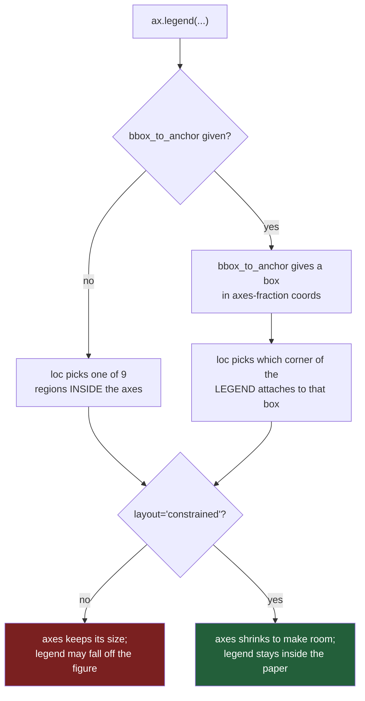

# 3.2 — Where the legend sits

## One-line answer

`loc=` picks one of nine spots inside the drawing, `bbox_to_anchor=` moves the legend anywhere at
all including outside it, and the only way to know whether the box is sitting on your data is to
**measure it in pixels** rather than look at it.

---

## The story

The flat's chart now names its four lines. Somebody replies:

> **"the box is on top of the sawtooth one"**

And it is. The legend went to the top-left corner, which is where the household line has its quiet
weeks, so the little white rectangle with four names in it is covering part of the shape the chart
exists to show. Not all of it — you can still see the line going up and down on the right-hand side.
Just enough that the first week is hidden behind the word "bakery".

The person who made the chart looks at it and honestly cannot tell. On their laptop the box seems to
be sitting in empty space. On the phone screenshot in the group chat it is clearly over the line.
They shrink the figure and it gets worse. They make it wider and the problem moves somewhere else.

So they start guessing. They try the top right, and now the box is over the produce line. They try
the bottom, and now it is over bakery, which lives down there. After four or five rounds of this the
chart is worse than it was, and the argument has moved on without them.

There are four lines, and nine places the box can go, and all nine of them are inside the drawing.

---

## The idea in plain language

A legend has to be somewhere. The drawing is a rectangle full of lines, and the legend is a smaller
rectangle full of text, and the second one has to be put down on the first.

matplotlib's default for that is `loc="best"`, and the word "best" is doing a lot of work. What it
actually does is try a fixed set of candidate positions — the corners, the edge midpoints and the
middle — draw the data into each one in its head, count how much of the data each candidate would
cover, and keep the cheapest. It is a search over nine options, not a solution. If all nine
positions cover some data, "best" returns the one that covers the least, and that is still a legend
sitting on your chart.

**`loc=`** is you making that choice yourself, by name: `"upper left"`, `"lower right"`,
`"center left"`, and so on. Nine strings, nine positions, all of them inside the **axes** — the
rectangle the data is drawn in, as opposed to the **figure**, which is the whole sheet of paper
([Day 36, 1.1](../../../day-36-figure-and-axes/parts/01-the-two-objects/1.1-the-paper-and-the-frame.md)).

**`bbox_to_anchor=`** is the escape hatch. It says: here is a box, in **axes fraction**
coordinates — `(0, 0)` is the bottom-left corner of the drawing and `(1, 1)` is the top-right — and
I want the legend anchored to it. Because a fraction can be bigger than one or less than zero, that
lets you put the legend *outside* the drawing entirely. `bbox_to_anchor=(1.02, 0.5)` with
`loc="center left"` means "put the legend's own centre-left point just past the right-hand edge of
the drawing", which is the classic legend-in-the-margin layout.

Two smaller controls finish the picture. **`ncols=`** lays the entries out in that many columns
instead of one, which turns a tall thin key into a short wide one — the shape you want when the
legend lives above the chart rather than beside it. **`frameon=`** switches off the box and its
background, which is worth doing whenever the legend is outside the data area, because out there the
frame is drawing a border around nothing.

There is one trap in moving a legend outside, and it is the reason this part has a mechanism section
rather than a list of keyword arguments. The legend is not part of the layout arithmetic that
decides how big the drawing is. Push it into the margin and matplotlib will happily place it past
the edge of the paper, where it is simply not in the saved file. The fix is
**`layout="constrained"`**, which does the sizing arithmetic *including* the legend, shrinking the
drawing to make room instead of letting the legend fall off.

And the honest way to answer "is the legend on top of my data" is not to squint at it. It is to ask
each artist where it ended up, in **display coordinates** — pixels, measured from the bottom-left of
the figure — and count how many data points fall inside the legend's rectangle. That is a number,
it is reproducible, and it is a thing a test can assert on.

---

## Why Setu needs it

- **[3.3](3.3-the-series-nobody-could-name.md)** argues that for four lines you should often not
  have a legend at all. That argument only lands once you have felt how much of the chart a legend
  costs, which is what this part measures.
- **[5.3](../05-saving-for-print/5.3-dpi-and-the-label-that-got-cut-off.md)** is the same problem
  one level up: something you drew ends up outside the saved file. A legend in the margin is the
  most common way that happens.
- **[8.1](../08-the-module/8.1-the-charts-module.md)** puts the placement decision in one function,
  so every chart in the pack has its legend in the same place — which is what makes eight charts
  read as one document rather than eight.
- **Day 41's gate** is an eight-chart pack. A key that moves around between panels is the single
  fastest way to make a pack look unfinished.

---

## The mechanism

The same twelve weeks as
[3.1](3.1-the-legend-comes-from-the-label.md), and a way of asking how much damage the legend does:

```python
import matplotlib
import numpy as np
import pandas as pd

matplotlib.use("Agg")
import matplotlib.pyplot as plt


def weekly_spend() -> pd.DataFrame:
    """Twelve weeks of the flat's shopping, four aisles, in pounds."""
    rng = np.random.default_rng(37)
    columns = {}
    steady = [("bakery", 9.0, 1.5), ("dairy", 18.0, 2.0), ("produce", 22.0, 2.5)]
    for aisle, centre, spread in steady:
        columns[aisle] = np.round(rng.normal(centre, spread, 12), 2)
    household = np.empty(12)
    household[0::2] = rng.normal(5.0, 1.0, 6)
    household[1::2] = rng.normal(37.5, 3.0, 6)
    columns["household"] = np.round(household, 2)
    return pd.DataFrame(columns, index=pd.RangeIndex(1, 13, name="week"))


spend = weekly_spend()


def covered_points(ax, legend) -> tuple[int, int]:
    """How many drawn points fall inside the legend's rectangle, in pixels."""
    box = legend.get_window_extent()
    hits = 0
    total = 0
    for line in ax.lines:
        for x, y in ax.transData.transform(line.get_xydata()):
            total += 1
            hits += box.x0 <= x <= box.x1 and box.y0 <= y <= box.y1
    return hits, total
```

**Line by line:**

- `legend.get_window_extent()` returns the legend's rectangle in **display coordinates**: pixels
  measured from the bottom-left corner of the figure, with y increasing upwards. It is only correct
  after the figure has been drawn, because until then nobody has decided how big the text is.
- `ax.transData` is the transform that turns a data point — week 8, £44.06 — into that same pixel
  space. Calling it on `line.get_xydata()` converts all twelve points of a line at once.
- `box.x0 <= x <= box.x1` is Python's chained comparison, which reads as "x is between the two
  edges" and evaluates each operand once. The `and` with the y test makes it "inside the rectangle".
- `hits +=` a boolean works because `True` is `1` in Python arithmetic. It is shorter than an `if`
  and it is the idiom you will see in real code.
- Returning `(hits, total)` rather than a fraction keeps the raw counts visible, so a surprising
  ratio can be traced back to how many points there were.

### What "best" actually gives you

```python
def measure(**legend_kwargs) -> None:
    fig, ax = plt.subplots(figsize=(6, 3.5))
    for aisle in spend.columns:
        ax.plot(spend.index, spend[aisle], label=aisle)
    legend = ax.legend(**legend_kwargs)
    fig.canvas.draw()
    hits, total = covered_points(ax, legend)
    where = legend_kwargs.get("loc", "best (default)")
    print(f"loc={where:14s} covers {hits:2d} of {total} points")
    plt.close(fig)


measure()
for loc in ("upper left", "upper right", "center left", "lower right", "center"):
    measure(loc=loc)
```

**Line by line:**

- `**legend_kwargs` passes whatever the caller gave straight through to `ax.legend`, so one function
  measures every placement. This is the cheapest kind of experiment harness and it is worth the four
  extra lines.
- `fig.canvas.draw()` is **mandatory** before any measurement. Until the figure is drawn, the legend
  has no size: matplotlib does not know how wide the word "household" is until a renderer has been
  asked to lay the text out. Skip this and `get_window_extent()` reports a stale or degenerate box.
- `plt.close(fig)` inside the loop matters more than it looks. Every figure you make is held by
  `pyplot` until closed, and a loop that makes twenty figures without closing them will eventually
  warn about too many open figures and then eat memory.
- `legend_kwargs.get("loc", ...)` reads the placement back out of the arguments rather than being
  told separately, so the printed label cannot disagree with what was actually drawn.

```text
loc=best (default) covers  1 of 48 points
loc=upper left     covers  1 of 48 points
loc=upper right    covers  2 of 48 points
loc=center left    covers  5 of 48 points
loc=lower right    covers  4 of 48 points
loc=center         covers  7 of 48 points
```

**Read that carefully, because it is not what people expect.** `"best"` did its job: it found the
cheapest of the nine candidates. And the cheapest still covers a data point. There is no position
inside this chart where the legend is free, because four lines across twelve weeks fill the
rectangle. "Best" is a minimum, not a zero, and on a busier chart the minimum gets worse.

### How much of the chart the box is worth

```python
fig, ax = plt.subplots(figsize=(6, 3.5))
for aisle in spend.columns:
    ax.plot(spend.index, spend[aisle], label=aisle)
legend = ax.legend(loc="upper left")
fig.canvas.draw()

axes_box = ax.get_window_extent()
legend_box = legend.get_window_extent()
print("axes rectangle  :", [round(float(v), 1) for v in axes_box.extents])
print("legend rectangle:", [round(float(v), 1) for v in legend_box.extents])
share = 100 * (legend_box.width * legend_box.height) / (axes_box.width * axes_box.height)
print(f"the legend occupies {share:.1f}% of the drawing")
print("frame is on:", legend.get_frame_on(), "with alpha", legend.get_frame().get_alpha())
plt.close(fig)
```

**Line by line:**

- `ax.get_window_extent()` is the same call as for the legend, which is the point: every artist
  answers the same question in the same units, so their boxes can be compared directly.
- `.extents` is the `Bbox` as a four-number array, `[x0, y0, x1, y1]`. It saves writing the four
  attributes out and it fixes the order, so two boxes printed side by side are always comparable.
- `float(v)` around each number is not decoration. `Bbox` values are NumPy floats, and NumPy prints
  a float inside a list as `np.float64(75.0)` rather than `75.0`, which turns a readable line of
  output into noise.
- `.width` and `.height` come free with a matplotlib `Bbox`, so the area is one multiplication
  rather than a subtraction you can get the sign of wrong.
- `legend.get_frame()` returns the rounded rectangle behind the entries. `get_alpha()` is its
  opacity, where `1.0` is solid and `0.0` is invisible.

```text
axes rectangle  : [75.0, 38.5, 540.0, 308.0]
legend rectangle: [81.9, 211.8, 205.9, 301.1]
the legend occupies 8.8% of the drawing
frame is on: True with alpha 0.8
```

**Two facts to keep.** The key costs you roughly a twelfth of the picture. And the default frame is
not opaque — its alpha is `0.8` — so a line underneath shows through faintly, which is exactly the
state that makes a covered data point hard to spot and impossible to read.

### Moving it out of the way

```python
fig, ax = plt.subplots(figsize=(6, 3.5), layout="constrained")
for aisle in spend.columns:
    ax.plot(spend.index, spend[aisle], label=aisle)
legend = ax.legend(
    loc="lower left",
    bbox_to_anchor=(0, 1.02, 1, 0.2),
    mode="expand",
    ncols=4,
    frameon=False,
)
fig.canvas.draw()
hits, total = covered_points(ax, legend)
axes_box = ax.get_window_extent()
legend_box = legend.get_window_extent()
print("covers", hits, "of", total, "points")
print("legend bottom:", round(legend_box.y0, 1), "  axes top:", round(axes_box.y1, 1))
print("drawing area now:", round(axes_box.width * axes_box.height, 1), "square pixels")
plt.close(fig)
```

**Line by line:**

- `layout="constrained"` asks matplotlib to size the drawing *after* accounting for everything
  around it, including a legend anchored outside. Without it, the legend is placed and the drawing
  is not moved, which is the failure below.
- `bbox_to_anchor=(0, 1.02, 1, 0.2)` is the four-number form: `x`, `y`, `width`, `height` in axes
  fraction. It describes a strip starting at the left edge, `1.02` of the way up — so just above the
  top — and as wide as the drawing.
- `loc="lower left"` now means "which corner of the *legend* attaches to that strip", not where in
  the axes it goes. That reversal is the part that confuses everyone: with `bbox_to_anchor` present,
  `loc` stops choosing a region and starts choosing an anchor point.
- `mode="expand"` stretches the entries to fill the strip's width instead of leaving them bunched at
  one end.
- `ncols=4` puts the four aisles side by side. One row above a chart reads as a caption; four rows
  above a chart reads as a wall.
- `frameon=False` removes the box. Outside the data area there is nothing to separate the legend
  from, so the frame is decoration.

```text
covers 0 of 48 points
legend bottom: 320.4   axes top: 307.8
drawing area now: 157936.6 square pixels
```

**Zero points covered, and the drawing got *bigger*.** The axes rectangle measured 465 × 269.5
pixels earlier, which is 125 318 square pixels; it is now 157 937. Moving the legend out of the data
area freed the whole rectangle, and constrained layout spent the freed margin on the chart. The
legend was not costing you nothing before — it was costing you an eighth of the picture, in a way
you could not see.



---

## When it breaks

**The legend that left the paper:**

```text
$ uv run python -c "
import matplotlib
matplotlib.use('Agg')
import matplotlib.pyplot as plt
fig, ax = plt.subplots(figsize=(6, 3.5))
for name, values in [('bakery', [9, 10, 8]), ('dairy', [18, 17, 19]),
                     ('produce', [22, 21, 23]), ('household', [5, 38, 4])]:
    ax.plot([1, 2, 3], values, label=name)
leg = ax.legend(loc='center left', bbox_to_anchor=(1.02, 0.5), frameon=False)
fig.canvas.draw()
box = leg.get_window_extent()
print('figure is', fig.bbox.width, 'px wide')
print('legend spans x =', round(box.x0, 1), 'to', round(box.x1, 1))
print('legend fits inside the figure?', box.x1 <= fig.bbox.width)
"
```

```text
figure is 600.0 px wide
legend spans x = 556.2 to 680.2
legend fits inside the figure? False
```

**What it means.** The legend was placed 80 pixels past the right-hand edge of a 600-pixel figure.
Nothing raised. `savefig` will write the file, the file will be 600 pixels wide, and the legend will
be **absent from it** — not clipped at the edge, not squashed, just gone, because the pixels it was
drawn into are not part of the image. This is the same failure as the axis label that fell off the
bottom in
[1.1](../01-labels/1.1-the-chart-that-never-said-what-the-numbers-were.md), one level up.

**The smallest fix** is `layout="constrained"` on the `subplots` call. Adding it and nothing else:

```text
$ uv run python -c "
import matplotlib
matplotlib.use('Agg')
import matplotlib.pyplot as plt
fig, ax = plt.subplots(figsize=(6, 3.5), layout='constrained')
for name, values in [('bakery', [9, 10, 8]), ('dairy', [18, 17, 19]),
                     ('produce', [22, 21, 23]), ('household', [5, 38, 4])]:
    ax.plot([1, 2, 3], values, label=name)
leg = ax.legend(loc='center left', bbox_to_anchor=(1.02, 0.5), frameon=False)
fig.canvas.draw()
box = leg.get_window_extent()
print('legend spans x =', round(box.x0, 1), 'to', round(box.x1, 1))
print('legend fits inside the figure?', box.x1 <= fig.bbox.width)
print('drawing is now', round(ax.get_window_extent().width, 1), 'px wide')
"
```

```text
legend spans x = 471.8 to 595.8
legend fits inside the figure? True
drawing is now 424.5 px wide
```

**One keyword moved the legend 84 pixels back onto the paper.** The third line says how: the drawing
shrank from the 465 pixels it had before to 424.5, and that donation is exactly the room the legend
needed. Constrained layout did not move the legend so much as make space for it, which is the only
way the arithmetic can work — the figure is a fixed size, so something has to give.

**The placement that does raise:**

```text
$ uv run python -c "
import matplotlib
matplotlib.use('Agg')
import matplotlib.pyplot as plt
fig, ax = plt.subplots()
ax.plot([1, 2], [1, 2], label='a')
ax.legend(loc='top left')
"
```

```text
ValueError: 'top left' is not a valid value for loc. Did you mean one of: 'upper left', 'lower left', 'center left'?
```

**What it means.** The vertical words are `upper`, `center` and `lower` — never `top` or `bottom`.
This is one of the few matplotlib mistakes that fails immediately and tells you the answer, which is
worth noticing precisely because the two failures above it do not.

---

## In production

**What a professional writes instead of the teaching version.** One function, called by every chart
in the pack, so that the placement is a project decision rather than a per-chart improvisation:

```python
def key_above(ax, *, ncols: int | None = None):
    """Put the legend in a single strip above the axes. Returns the Legend."""
    handles, labels = ax.get_legend_handles_labels()
    if not labels:
        raise ValueError("nothing labelled - draw with label= before asking for a legend")
    if ncols is None:
        ncols = len(labels) if len(labels) <= 4 else 4
    return ax.legend(
        handles,
        labels,
        loc="lower left",
        bbox_to_anchor=(0, 1.02, 1, 0.2),
        mode="expand",
        ncols=ncols,
        frameon=False,
        borderaxespad=0,
    )
```

**Line by line:**

- The read-back and the `if not labels` guard turn
  [3.1](3.1-the-legend-comes-from-the-label.md)'s warning into an exception. A warning that nobody
  reads is not a safety net; an exception that stops the build is.
- Passing `handles, labels` explicitly rather than calling `ax.legend()` bare means the pairing is
  fixed at this moment and cannot be re-collected differently later — the discipline
  [3.3](3.3-the-series-nobody-could-name.md) depends on.
- `ncols` defaults to one row for up to four series and caps at four columns beyond that. The cap is
  a judgement about reading, not about matplotlib: a legend more than four wide is scanned rather
  than read.
- `borderaxespad=0` removes the extra padding matplotlib inserts between the legend and the axes,
  which is right when the anchor box has already been positioned deliberately and wrong when it has
  not.
- The function returns the `Legend` so that a test can measure it, which is the only reason any of
  this is checkable.

**What degrades at scale.** `loc="best"` is not free. It evaluates every candidate position against
every drawn artist, so its cost grows with the number of points on the chart. On a scatter of a
hundred thousand points, "best" is doing a hundred thousand containment tests per candidate, and a
figure that took a moment to draw now takes noticeably longer for a placement decision you could
have made yourself in one string. In a batch job that renders hundreds of panels, pinning `loc=`
explicitly is both a correctness improvement and a speed one.

**The failure that only shows with real data.** A report was built with the legend outside on the
right and `layout="constrained"`, and it looked perfect. Then one category was renamed from `EU` to
`European Union (incl. accession states)`. Constrained layout did exactly what it was asked: it made
room for the legend by shrinking the drawing, and the drawing ended up narrower than the legend
beside it. Every chart in the report was still correct and none of them were readable. The
lesson is that a legend outside the axes makes the chart's width a function of the longest label,
which is a function of upstream data you do not control. A legend above the chart with `ncols=` does
not have that property, which is why it is the safer default for a pack.

**The review comment a senior engineer leaves.** *"Don't leave this on `loc='best'`. 'Best' is a
search over nine positions, so the key moves between panels as the data changes and the pack stops
looking like one document. Pin the placement in the shared helper, and assert in the figure test
that no data point falls inside `legend.get_window_extent()`."*

**The interview question.** *"Your legend is covering the data. What do you do?"* The weak answer is
"try a different `loc`". The answer that shows experience is: measure it first — get the legend's
window extent and count how many transformed data points fall inside it, because whether it is
covering anything is a fact, not an impression — and then, if there is no free corner, stop looking
for one and move the legend outside with `bbox_to_anchor` plus `layout="constrained"`. The follow-up
is usually *"why constrained layout?"*, and the answer is that the legend is not part of the axes'
size calculation, so without it the legend can be positioned entirely outside the figure and vanish
from the saved file with no warning at all.

---

## Check yourself

```bash
uv run --with 'matplotlib==3.11.1' python -c "
import matplotlib
matplotlib.use('Agg')
import matplotlib.pyplot as plt
fig, ax = plt.subplots(figsize=(6, 3.5))
for name, values in [('bakery', [9, 10, 8]), ('dairy', [18, 17, 19]),
                     ('produce', [22, 21, 23]), ('household', [5, 38, 4])]:
    ax.plot([1, 2, 3], values, label=name)
for loc in ('best', 'upper left', 'center'):
    leg = ax.legend(loc=loc)
    fig.canvas.draw()
    b = leg.get_window_extent()
    hits = sum(b.x0 <= x <= b.x1 and b.y0 <= y <= b.y1
               for ln in ax.lines for x, y in ax.transData.transform(ln.get_xydata()))
    print(f'{loc:11s} covers {hits} of 12 points')
"
```

Three placements, three counts — and on three points per line, `"best"` really does find a free
corner. Say which named placement it matched, then explain why the same call covered a point on the
twelve-week chart measured above and nothing here.

**Answer out loud, without scrolling up:**

> Explain what `bbox_to_anchor` changes about the meaning of `loc`. Then say what happens to a
> legend anchored outside the axes when `layout="constrained"` is not set, and why nothing warns you
> about it.

---

**Next:** [3.3 — The series nobody could name](3.3-the-series-nobody-could-name.md).
