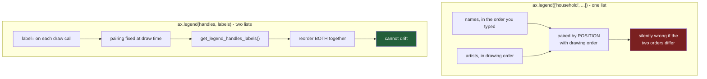

# 3.3 — The series nobody could name

## One-line answer

A legend makes the reader look away from the line to find out what it is called, so put the name at
the end of the line instead — and if you must keep the legend, fix the pairing of handles to labels
explicitly, because the silent version of this bug names every series wrongly and warns nobody.

---

## The story

The flat's chart is fine now. Four lines, four names in a box above the picture, nothing covered.
Somebody sends it to the group chat and there is a pause, and then:

> **"ok so which one is household again"**

They are looking at the chart. The names are right there. And they still have to ask, because the
sawtooth line is in the middle of the picture and the word "household" is at the top of the picture,
and getting from one to the other means finding the colour of the line, holding that colour in your
head, moving your eyes to the box, scanning four swatches until you find a matching one, and reading
across. Then doing it again for the next line, having forgotten the first.

Four lines is four of those trips, every time anybody looks at the chart.

Then it gets worse. Somebody else in the flat has been keeping their own copy of the script, and
they got tired of typing `label=` four times, so their version draws the lines in a loop and names
them afterwards with a list. Their chart looks identical. It says the sawtooth line is **bakery**.

Nobody notices for two weeks, because the chart looks right, and because the only person who could
have told you it was wrong is the person who wrote it, and they already believe it.

---

## The idea in plain language

There are two separate problems in that story, and they have the same root.

The first is about **reading effort**. A legend is a lookup table. It stores the mapping from colour
to name in one place and the thing being named in another, and the reader has to join the two by
moving their eyes back and forth. Every join is a small piece of work, and it is repeated every time
anybody reads the chart, forever. **Direct labelling** removes the join: you write the name at the
end of the line, in the line's own colour, so the name and the thing are in the same place and the
eye never has to travel. Four lines becomes four names, each sitting on the thing it names.

That is not a style preference. It is a measurable difference, and this part measures it: the total
distance your eye has to cover, in pixels, to name all four series.

The second problem is about **correctness**. A legend is two parallel lists — the **handles**, which
are the artists the coloured samples are drawn from, and the **labels**, which are the strings
([3.1](3.1-the-legend-comes-from-the-label.md) built both). The legend is correct only if position
*i* in one list belongs with position *i* in the other. When you write `label=` on each draw call,
that pairing is created by the same line of code that creates the line, so it cannot be wrong. When
you draw first and name afterwards with a list, the pairing is created by **position in the drawing
order**, and drawing order is decided by whatever iterated your columns.

Nothing checks it. matplotlib cannot check it, because it has no idea what the names mean. So a list
in the wrong order produces a chart that is beautifully drawn, fully labelled, and completely false,
with no warning anywhere.

The fix for the second problem is the same tool that lets you reorder a legend on purpose:
`handles, labels = ax.get_legend_handles_labels()` gives you both lists, and
`ax.legend(handles, labels)` takes them back. Once you hold them, you can rearrange them **together**
— never one without the other — and a legend ordered to match the chart is one of the small things
that makes a picture feel obvious rather than merely correct.

---

## Why Setu needs it

- **[4.1](../04-annotation/4.1-the-one-number-worth-writing-on.md)** is the same idea generalised:
  put the text where the thing is. Direct labelling is annotation with a rule about what to write.
- **[5.2](../05-saving-for-print/5.2-hatch-and-marker-instead-of-colour.md)** removes colour from the
  argument entirely. A directly labelled chart survives a black-and-white printer without any of
  that work, because it never asked colour to carry the names.
- **[8.1](../08-the-module/8.1-the-charts-module.md)** has to choose a default for the whole figure
  pack, and this part is the argument it chooses from.
- **[8.2](../08-the-module/8.2-the-test-that-can-go-red.md)** turns the pairing check into a test:
  every legend entry's colour must equal the colour of the artist that entry claims to name.
- **Day 41's gate** is eight charts that have to read as one document. A legend whose order differs
  between panels is the thing that breaks that.

---

## The mechanism

The same twelve weeks, and a way of measuring how far the eye has to travel:

```python
import matplotlib
import numpy as np
import pandas as pd

matplotlib.use("Agg")
import matplotlib.pyplot as plt


def weekly_spend() -> pd.DataFrame:
    """Twelve weeks of the flat's shopping, four aisles, in pounds."""
    rng = np.random.default_rng(37)
    columns = {}
    steady = [("bakery", 9.0, 1.5), ("dairy", 18.0, 2.0), ("produce", 22.0, 2.5)]
    for aisle, centre, spread in steady:
        columns[aisle] = np.round(rng.normal(centre, spread, 12), 2)
    household = np.empty(12)
    household[0::2] = rng.normal(5.0, 1.0, 6)
    household[1::2] = rng.normal(37.5, 3.0, 6)
    columns["household"] = np.round(household, 2)
    return pd.DataFrame(columns, index=pd.RangeIndex(1, 13, name="week"))


spend = weekly_spend()
print("last week's values:", spend.loc[12].to_dict())
print("last week, high to low:", list(spend.loc[12].sort_values(ascending=False).index))
```

**Line by line:**

- `spend.loc[12]` is label-based row selection: row *labelled* 12, which is week 12, rather than the
  row at position 12. The index was named and numbered from 1 in `weekly_spend`, so the label and
  the week are the same number.
- `.sort_values(ascending=False)` puts the biggest first. `.index` then gives the aisle names in
  that order, which is the order the lines appear from top to bottom at the right-hand edge of the
  chart — and therefore the order a legend beside them should be in.

```text
last week's values: {'bakery': 10.46, 'dairy': 19.89, 'produce': 22.28, 'household': 35.73}
last week, high to low: ['household', 'produce', 'dairy', 'bakery']
```

**Note the mismatch already.** The columns are in the order bakery, dairy, produce, household. The
lines at the right edge of the chart, top to bottom, are household, produce, dairy, bakery. A legend
built from the columns is in exactly the reverse of the order the reader sees.

### Measuring the trip

```python
fig, ax = plt.subplots(figsize=(6, 3.5))
for aisle in spend.columns:
    ax.plot(spend.index, spend[aisle], label=aisle)
legend = ax.legend(loc="upper left")
fig.canvas.draw()

travel = 0.0
for line, text in zip(ax.lines, legend.get_texts(), strict=True):
    end = ax.transData.transform(line.get_xydata()[-1])
    box = text.get_window_extent()
    entry = np.array([(box.x0 + box.x1) / 2, (box.y0 + box.y1) / 2])
    distance = float(np.hypot(*(end - entry)))
    travel += distance
    print(f"  {text.get_text():10s} line end -> legend entry: {distance:6.1f} px")
print("total eye travel with a legend:", round(travel, 1), "px")
plt.close(fig)
```

**Line by line:**

- `zip(..., strict=True)` pairs each line with its legend entry and **raises** if the two sequences
  are different lengths. `strict=True` is the whole reason to use `zip` here rather than an index
  loop: a silent length mismatch is the bug this part is about.
- `line.get_xydata()[-1]` is the last point of the line — where the reader's eye is when they want to
  know its name. `transform` turns it into pixels.
- `text.get_window_extent()` is the legend entry's rectangle, and averaging its two x edges and two
  y edges gives its centre. Centres are the fair thing to measure between; corners are not.
- `np.hypot(a, b)` is the straight-line distance, computed without the overflow you get from
  `sqrt(a*a + b*b)` on large numbers. The `*` unpacks the two-element difference into its two
  arguments.
- `float(...)` converts the NumPy scalar so the printed number is `416.5` rather than
  `np.float64(416.5)`.

```text
  bakery     line end -> legend entry:  416.5 px
  dairy      line end -> legend entry:  392.2 px
  produce    line end -> legend entry:  372.1 px
  household  line end -> legend entry:  356.1 px
total eye travel with a legend: 1536.9 px
```

### The same chart, labelled directly

```python
fig, ax = plt.subplots(figsize=(6, 3.5))
for aisle in spend.columns:
    (line,) = ax.plot(spend.index, spend[aisle], label=aisle)
    ax.annotate(
        aisle,
        xy=(spend.index[-1], spend[aisle].iloc[-1]),
        xytext=(4, 0),
        textcoords="offset points",
        va="center",
        color=line.get_color(),
    )
ax.set_xlim(1, 14)
fig.canvas.draw()

travel = 0.0
for line, text in zip(ax.lines, ax.texts, strict=True):
    end = ax.transData.transform(line.get_xydata()[-1])
    box = text.get_window_extent()
    centre = np.array([(box.x0 + box.x1) / 2, (box.y0 + box.y1) / 2])
    distance = float(np.hypot(*(end - centre)))
    travel += distance
    print(f"  {text.get_text():10s} line end -> its own label: {distance:6.1f} px")
print("total eye travel with direct labels:", round(travel, 1), "px")
plt.close(fig)
```

**Line by line:**

- `(line,) = ax.plot(...)` unpacks the one-element list `plot` returns. The trailing comma is what
  makes it an unpacking rather than an assignment, and it fails loudly if `plot` ever returns more
  than one line, which is the behaviour you want.
- `xy=(spend.index[-1], spend[aisle].iloc[-1])` is the last point again, in **data** coordinates —
  week 12 and that aisle's week-12 value. `.iloc[-1]` is position-based, so it is the last value
  whatever the index says.
- `xytext=(4, 0)` with `textcoords="offset points"` nudges the text four typographic points to the
  right of that point. Offsets in points rather than data units mean the gap stays the same visual
  size whatever the axis limits are — the two coordinate systems are
  [4.2](../04-annotation/4.2-annotate-and-the-two-coordinate-systems.md)'s whole subject.
- `va="center"` vertically centres the text on the line's end, so the name sits level with the thing
  it names rather than above it.
- `color=line.get_color()` is the line asked for its own colour rather than a palette looked up
  twice. Two lookups can disagree; one cannot.
- `ax.set_xlim(1, 14)` widens the x axis to make room for the names. Without it the text is drawn
  past the right edge of the drawing and clipped away.

```text
  bakery     line end -> its own label:   29.8 px
  dairy      line end -> its own label:   23.6 px
  produce    line end -> its own label:   34.9 px
  household  line end -> its own label:   42.6 px
total eye travel with direct labels: 130.8 px
```

**1536.9 pixels against 130.8.** The legend version asks the reader's eye to cover nearly twelve
times the distance to learn the same four facts, and to do it again every time they look. That is
the argument, and it is why the direct-labelled version is the one to ship for a chart with a small
number of lines whose ends are separated.

### The chart that named the wrong line

Now the second flatmate's version — draw first, name afterwards:

```python
fig, ax = plt.subplots(figsize=(6, 3.5))
for aisle in spend.columns:
    ax.plot(spend.index, spend[aisle])

legend = ax.legend(["household", "produce", "dairy", "bakery"])
for text, handle in zip(legend.get_texts(), legend.legend_handles, strict=True):
    print(f"  the key says {text.get_text():10s} in {tuple(round(c, 3) for c in handle.get_color())}")
print("but the lines were drawn as:")
for aisle, line in zip(spend.columns, ax.lines, strict=True):
    print(f"  {aisle:10s} in {tuple(round(c, 3) for c in line.get_color())}")
plt.close(fig)
```

**Line by line:**

- The `plot` calls carry no `label=`, so the four lines are `_child0` to `_child3` and the legend has
  nothing of its own to collect.
- `ax.legend([...])` in the positional form pairs the names with the artists **by drawing order**.
  The flatmate wrote them in the order that made sense to them — biggest first — and matplotlib
  paired them with the columns in the order the loop ran.
- `legend.legend_handles` is the list of sample artists inside the legend, in the same order as
  `legend.get_texts()`. Asking each one for its colour is how you check a pairing without looking at
  a picture.
- The second loop asks the actual lines the same question, so the two printouts can be compared
  directly.

```text
  the key says household  in (0.122, 0.467, 0.706)
  the key says produce    in (1.0, 0.498, 0.055)
  the key says dairy      in (0.173, 0.627, 0.173)
  the key says bakery     in (0.839, 0.153, 0.157)
but the lines were drawn as:
  bakery     in (0.122, 0.467, 0.706)
  dairy      in (1.0, 0.498, 0.055)
  produce    in (0.173, 0.627, 0.173)
  household  in (0.839, 0.153, 0.157)
```

**All four are wrong, and two of them are exactly swapped.** The blue line is bakery and the key
calls it household. The red line is household and the key calls it bakery. Not one warning was
raised, because from matplotlib's side nothing unusual happened: it was handed four strings and four
artists and it paired them in order, which is precisely what that call means.

### Reordering on purpose, safely

```python
fig, ax = plt.subplots(figsize=(6, 3.5))
for aisle in spend.columns:
    ax.plot(spend.index, spend[aisle], label=aisle)

handles, labels = ax.get_legend_handles_labels()
by_name = dict(zip(labels, handles, strict=True))
order = list(spend.loc[12].sort_values(ascending=False).index)
legend = ax.legend([by_name[name] for name in order], order)

print("as drawn :", labels)
print("as keyed :", [t.get_text() for t in legend.get_texts()])
for text, handle in zip(legend.get_texts(), legend.legend_handles, strict=True):
    drawn = ax.lines[list(spend.columns).index(text.get_text())]
    print(f"  {text.get_text():10s} key colour matches line colour: {handle.get_color() == drawn.get_color()}")
plt.close(fig)
```

**Line by line:**

- `dict(zip(labels, handles, strict=True))` binds each name to its own artist **once**, so from here
  on the pairing travels together. This dictionary is the whole safety mechanism: after it exists,
  there is no way to reorder one list without the other.
- `order` is computed from the data — the aisles sorted by their week-12 value — not typed out. When
  next week's numbers arrive the order updates itself, which is the difference between a legend that
  matches the chart and one that used to.
- `[by_name[name] for name in order]` looks each handle up by name. A name that is not in the
  dictionary raises `KeyError` immediately, which is the loud failure the positional form never had.
- `ax.legend(handles, labels)` in the **two-list** form is the correct explicit call. It looks
  similar to the broken one-list form above and is a completely different thing: here both sides are
  supplied and their pairing was fixed by you.
- The final loop verifies rather than assumes, comparing each key colour to the colour of the line
  whose name it carries. This is exactly the assertion
  [8.2](../08-the-module/8.2-the-test-that-can-go-red.md) makes permanent.

```text
as drawn : ['bakery', 'dairy', 'produce', 'household']
as keyed : ['household', 'produce', 'dairy', 'bakery']
  household  key colour matches line colour: True
  produce    key colour matches line colour: True
  dairy      key colour matches line colour: True
  bakery     key colour matches line colour: True
```

Same reordering as the broken version, opposite result.



---

## When it breaks

**Direct labelling on lines that end together:**

```text
$ uv run python -c "
import matplotlib
matplotlib.use('Agg')
import matplotlib.pyplot as plt
fig, ax = plt.subplots(figsize=(6, 3.5))
ends = {'produce': 21.9, 'household': 22.1, 'dairy': 18.0}
for name, last in ends.items():
    ax.plot([1, 2, 3], [10, 15, last])
    ax.annotate(name, xy=(3, last), xytext=(4, 0), textcoords='offset points', va='center')
ax.set_xlim(1, 4)
fig.canvas.draw()
boxes = [t.get_window_extent() for t in ax.texts]
for i in range(len(boxes)):
    for j in range(i + 1, len(boxes)):
        if boxes[i].overlaps(boxes[j]):
            print('OVERLAP:', ax.texts[i].get_text(), 'and', ax.texts[j].get_text())
"
```

```text
OVERLAP: produce and household
```

**What it means.** Direct labelling assumes the ends of the lines are far enough apart to hold
separate words. Produce and household finish £0.20 apart, so their labels land on top of each other
and become one grey smudge. Nothing raises; the text is drawn, twice, in the same place.

**The smallest fix** is to detect it rather than hope: after `fig.canvas.draw()`, check every pair
of label boxes with `Bbox.overlaps` — which is the four lines above — and fall back to a legend when
any pair collides. That check is cheap, it is deterministic, and it is the only honest way to make
direct labelling a default rather than a gamble.

**The mismatch that is not a mismatch — `strict=True` earning its place:**

```text
$ uv run python -c "
import matplotlib
matplotlib.use('Agg')
import matplotlib.pyplot as plt
fig, ax = plt.subplots()
for name, values in [('bakery', [9, 10, 8]), ('dairy', [18, 17, 19]),
                     ('produce', [22, 21, 23]), ('household', [5, 38, 4])]:
    ax.plot([1, 2, 3], values, label=name)
ax.axhline(20, color='0.5')
leg = ax.legend()
print('lines on the axes:', len(ax.lines))
print('entries in the key:', len(leg.get_texts()))
list(zip(ax.lines, leg.get_texts(), strict=True))
"
```

```text
lines on the axes: 5
entries in the key: 4
ValueError: zip() argument 2 is shorter than argument 1
```

**What it means.** `ax.axhline` adds a fifth `Line2D` to `ax.lines` — a reference line is a line
([4.3](../04-annotation/4.3-the-reference-line.md)) — but it is unlabelled, so it never reaches the
legend. Any code that assumes `ax.lines[i]` corresponds to `legend.get_texts()[i]` is now off by one
from the reference line onwards, and would happily report the wrong colours.

**The smallest fix** is the `strict=True` that produced this error. Without it, `zip` stops at the
shorter sequence, four pairs come out, and the mismatch never surfaces. With it, the assumption is
checked every time the code runs.

---

## In production

**What a professional writes instead of the teaching version.** One function that chooses between
the two treatments by measuring, rather than by preference:

```python
def name_the_series(ax, *, max_direct: int = 5):
    """Label lines at their right-hand ends; fall back to a legend if the names collide."""
    handles, labels = ax.get_legend_handles_labels()
    if not labels:
        raise ValueError("nothing labelled - pass label= on every draw call")
    if len(labels) > max_direct:
        return ax.legend(handles, labels, loc="center left", bbox_to_anchor=(1.02, 0.5))
    texts = []
    for handle, name in zip(handles, labels, strict=True):
        x, y = handle.get_xydata()[-1]
        texts.append(
            ax.annotate(
                name,
                xy=(x, y),
                xytext=(4, 0),
                textcoords="offset points",
                va="center",
                color=handle.get_color(),
            )
        )
    ax.figure.canvas.draw()
    boxes = [t.get_window_extent() for t in texts]
    collides = any(
        boxes[i].overlaps(boxes[j]) for i in range(len(boxes)) for j in range(i + 1, len(boxes))
    )
    if collides:
        for t in texts:
            t.remove()
        return ax.legend(handles, labels, loc="center left", bbox_to_anchor=(1.02, 0.5))
    return texts
```

**Line by line:**

- `max_direct: int = 5` is a policy, stated once. Above five series the ends are usually too close
  and the chart is usually asking too much anyway, so the function does not even try.
- `zip(handles, labels, strict=True)` uses the pairing that `get_legend_handles_labels` produced,
  which is the pairing `label=` created at draw time. Nothing here re-derives it from an order.
- `handle.get_xydata()[-1]` takes the end point from the handle rather than from the original frame,
  so the label follows the line even if the caller drew a subset or a resampled version.
- `ax.figure.canvas.draw()` is required before measuring, and it is the expensive line: it lays out
  the whole figure. Calling it once, after all the labels are added, rather than once per label, is
  the difference between a fast function and a slow one.
- `t.remove()` takes the annotations back off the axes before falling back. Leaving them would draw
  both treatments at once, which is worse than either.
- Returning either the list of texts or the `Legend` is a little untidy, and it is deliberate: the
  caller can see which treatment was used, and a test can assert on it.

**What degrades at scale.** The collision check is quadratic in the number of series — it compares
every pair — which is invisible at five and irrelevant at fifty, because at fifty you have already
returned a legend. The real cost is `canvas.draw()`. In a batch job rendering hundreds of panels,
that extra layout pass roughly doubles the drawing work, and the answer is not to skip it but to
draw once and measure everything, which is what this function already does.

**The failure that only shows with real data.** A weekly report labelled its lines directly and
looked excellent for months, because the categories always finished far apart. Then two of them
converged — genuinely, in the business — and the labels landed on each other. The convergence was
the most important thing that had happened all quarter, and it was the one thing the chart made
unreadable. Direct labelling fails exactly where the data gets interesting, which is why the
fallback has to be automatic rather than something a human notices.

**The review comment a senior engineer leaves.** *"Four lines and a legend at the top. Label them at
the ends instead — the reader shouldn't have to do a colour lookup to read a four-line chart. And
this `ax.legend([...])` with a bare list of names is a bug waiting to happen: it pairs names to
lines by drawing order, so the day someone adds a `groupby` or an `ORDER BY` upstream, every series
gets the wrong name and nothing warns. Pass `label=` on each plot call and let the legend collect
itself."*

**The interview question.** *"When would you not use a legend?"* The shallow answer is "when there
are only a few lines". The answer that shows you have shipped charts is: a legend is a lookup table,
so it costs the reader a round trip per series per reading, and if the series can be named where
they are, they should be. Then the honest caveat — direct labelling breaks when line ends converge,
so it needs a collision check and a fallback, and the check has to happen after a draw because text
has no size until it has been laid out. The follow-up is usually *"how would you test that a legend
is correct?"*, and the answer is not to look at it: compare each legend handle's colour with the
colour of the artist whose name that entry carries, which is an assertion, and one that catches the
positional-list bug the first time it appears.

---

## Check yourself

```bash
uv run --with 'matplotlib==3.11.1' python -c "
import matplotlib
matplotlib.use('Agg')
import matplotlib.pyplot as plt
fig, ax = plt.subplots()
for values in ([9, 10, 8], [18, 17, 19], [22, 21, 23], [5, 38, 4]):
    ax.plot([1, 2, 3], values)
leg = ax.legend(['household', 'produce', 'dairy', 'bakery'])
pairs = [(t.get_text(), h.get_color()) for t, h in zip(leg.get_texts(), leg.legend_handles)]
for name, colour in pairs:
    print(f'{name:10s} {tuple(round(c, 3) for c in colour)}')
print('drawn order colours:', [tuple(round(c, 3) for c in ln.get_color()) for ln in ax.lines])
"
```

The lines were drawn as bakery, dairy, produce, household. Say which name the key gives to the first
colour, and what single change to the drawing code would have made this impossible.

**Answer out loud, without scrolling up:**

> Explain why `ax.legend(["a", "b", "c"])` and `ax.legend(handles, labels)` are not two spellings of
> the same thing. Then say what a legend costs a reader that a name written at the end of the line
> does not, and name the one condition under which direct labelling is the worse choice.

---

**Next:** [4.1 — The one number worth writing on](../04-annotation/4.1-the-one-number-worth-writing-on.md).
