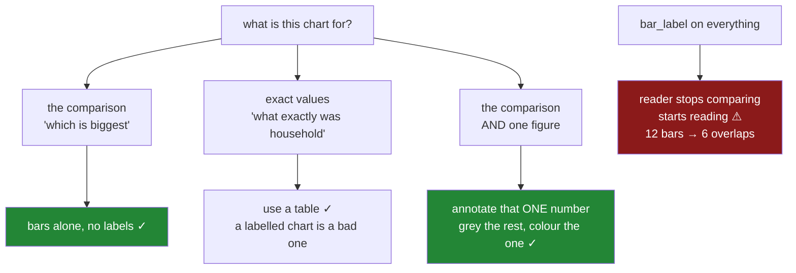

# 4.1 — The one number worth writing on

## One-line answer

Writing a value on every bar defeats the purpose of drawing bars — the reader stops comparing lengths
and starts reading a table laid out badly — so the useful question is not *should I label the bars* but
*which single number is the finding*, and that one gets written on.

---

## The story

The flat's chart is readable now, and somebody asks what household actually came to.

Fair question. The bar is about twenty-two and the axis has ticks at fives, so reading the value off it
means estimating between 20 and 25. The chart shows the comparison well and answers no specific
question at all.

So the numbers go on. `ax.bar_label` puts the value above every bar, one call, and now nothing has to
be estimated.

And the chart is worse. Four bars, four numbers floating above them, and the eye now reads the numbers
instead of the bars — which is a slower way of doing what a four-row table would have done better and
in a quarter of the space. The comparison that the bars made instantly is now four figures to hold in
your head and subtract.

The chart had one job, which was to make a comparison visible, and labelling everything converted it
back into the table it was supposed to replace.

---

## The idea in plain language

A chart and a table do different jobs. A **table** gives exact values, one lookup at a time. A
**chart** gives a comparison, all at once, without anybody reading a number.

Annotating every mark makes something in between, which is usually worse than either. The numbers add
clutter that competes with the bars for attention, and they are still harder to read than a table
because they are scattered across the plot rather than aligned in a column.

So the question to ask is not *should the values be shown* but **what is this chart for**:

- If the reader needs the comparison — *which is biggest, by roughly how much* — the bars already say
  it, and numbers get in the way.
- If the reader needs exact values — *what exactly did household come to* — they need a table, and a
  chart with labels on is a bad one.
- If the reader needs the comparison **and one specific figure**, annotate that one figure and leave
  the rest.

That last case is the common one and it is what this part is about. There is usually a single number
that is the point of the chart — the finding from
[1.3](../01-labels/1.3-a-title-that-states-the-finding.md) — and writing it where it happened turns a
chart somebody has to interpret into a chart that says its own conclusion.

**The rule of thumb:** annotate the number a reader would otherwise have to estimate *and* would want
to quote. One or two per chart. If you find yourself labelling everything, the chart is doing the wrong
job.

Two exceptions, because rules that admit none get ignored:

- **Very few marks.** With three or four bars and a presentation audience, labelling all of them is
  defensible — there is little clutter to create and the numbers are likely to be read aloud.
- **A chart that will be printed and annotated by hand.** If a report is going to be marked up in a
  meeting, exact values save people writing them in.

The mechanics are small. `ax.bar_label(container)` labels every bar in a group and takes `fmt` for the
formatting and `label_type` for inside-or-above. `ax.annotate(text, xy=...)` places one piece of text
at one point, which is the tool for the single-number case and is
[4.2](4.2-annotate-and-the-two-coordinate-systems.md)'s subject in full.

---

## Why Setu needs it

- **[1.3](../01-labels/1.3-a-title-that-states-the-finding.md)** put the finding in the title. This puts
  it on the chart itself, at the place it happened, and the two work together — a title that names a
  number and an annotation that points at it.
- **[4.2](4.2-annotate-and-the-two-coordinate-systems.md)** is how to place an annotation precisely,
  which only matters once you have decided there should be one.
- **[4.3](4.3-the-reference-line.md)** is the other way to save a reader from arithmetic: rather than
  writing a number, draw the line they were mentally comparing against.
- **[2.1](../02-ticks-and-limits/2.1-where-the-ticks-go.md)** is the alternative nobody considers —
  if readers keep having to estimate values, the ticks may simply be too coarse.
- **[8.1](../08-the-module/8.1-the-charts-module.md)**'s `highlight()` annotates one mark and takes
  which one as an argument, because the choice is the caller's and cannot be inferred.
- **Day 41**'s figure pack is eight panels; an annotation per bar across eight panels is unreadable, so
  the discipline here is what keeps that pack legible.

---

## The mechanism

Four bars, labelled every way.

```python
import matplotlib

matplotlib.use("Agg")

import matplotlib.pyplot as plt

names = ["bakery", "dairy", "produce", "household"]
means = [8.84, 18.01, 21.62, 21.64]

fig, ax = plt.subplots(figsize=(6, 4), layout="constrained")
bars = ax.bar(names, means, color="#4c78a8")
labels = ax.bar_label(bars, fmt="%.2f", padding=3)
ax.set_ylabel("mean weekly spend (GBP)")
ax.set_ylim(bottom=0)
print("labels drawn:", [text.get_text() for text in labels])
print("count       :", len(labels), "for", len(bars), "bars")
```

**Line by line:**

- `ax.bar_label(bars, ...)` takes the **container** returned by `ax.bar` — the group of rectangles — and
  writes one label per bar. It is one line, which is exactly why it gets used without a decision being
  made.
- `fmt="%.2f"` uses the older percent-style format spec, which is what `bar_label` accepts here; two
  decimal places because these are pounds and pence.
- `padding=3` lifts each label three points clear of its bar, so the text does not sit on the bar's edge.
- `set_ylim(bottom=0)` because these are bars
  ([2.4](../02-ticks-and-limits/2.4-the-axis-that-started-above-zero.md)), and it matters more once
  labels are added — a label above the tallest bar needs headroom, and cropping the axis removes it.
- The returned list of `Text` artists is printed rather than the picture, because the count is the
  point.

```text
labels drawn: ['8.84', '18.01', '21.62', '21.64']
count       : 4 for 4 bars
```

**Four numbers, and now read what the chart is asking of you.** To answer "how much more is household
than dairy" you read `21.64`, read `18.01`, and subtract — which is table work, done on a chart, with
the numbers in the worst possible arrangement for subtracting: spread horizontally at different
heights.

The bars were already answering that question, approximately and instantly, and the labels have
replaced the approximate instant answer with an exact slow one.

Now the single number:

```python
fig, ax = plt.subplots(figsize=(6, 4), layout="constrained")
ax.bar(names, means, color="#c9ccd1")
ax.patches[3].set_facecolor("#4c78a8")
ax.set_ylabel("mean weekly spend (GBP)")
ax.set_ylim(bottom=0)
note = ax.annotate(
    f"household GBP{means[3]:.2f}\nsame as produce, but 9x the swing",
    xy=(3, means[3]),
    xytext=(1.4, 30),
    arrowprops={"arrowstyle": "->", "color": "#333333"},
)
ax.set_title("Household matches produce on average", loc="left")
print("annotations:", len(ax.texts))
print("points at  :", note.xy)
```

**Line by line:**

- Every bar is drawn in grey and **only the annotated one is coloured**. That pairing is the technique:
  the annotation says which bar matters and the colour makes the eye go there first, and neither works
  as well alone.
- `ax.patches[3]` is the fourth rectangle — the same objects `bar_label` was labelling — and
  `set_facecolor` recolours it after the fact, which is easier than splitting the data into two `bar`
  calls.
- `xy=(3, means[3])` is the point being pointed **at**, in data coordinates: bar index 3, at its top.
  `xytext=(1.4, 30)` is where the **text** goes, also in data coordinates
  ([4.2](4.2-annotate-and-the-two-coordinate-systems.md) is about the alternatives).
- `arrowprops` draws the connector. Without it the text floats and the reader has to guess which bar it
  refers to — which on a four-bar chart is usually obvious and on a twelve-bar one is not.
- The text is **two lines**: the number, and what it means. A bare `21.64` written on the chart is
  barely better than the tick marks; the second line is the finding.
- `len(ax.texts)` is `1`, against four for the labelled version, and that ratio is the whole part.

```text
annotations: 1
points at  : (3, 21.64)
```

**One number instead of four, and it is the one the chart was made to communicate.**

The reader is not asked to compare anything they were not going to compare anyway. The bars still make
the comparison; the annotation answers the one question the bars cannot, and the grey-and-blue makes
the whole thing legible in about a second.

And the case where labelling everything is right:

```python
daily = [
    5.91, 39.12, 5.22, 39.79, 3.68, 34.76, 4.79, 44.06, 4.86, 38.47,
    3.32, 35.73, 6.10, 41.20, 4.55, 37.90, 5.02, 40.11, 3.88, 36.44,
    5.44, 42.03, 4.11, 38.02, 5.77, 39.55, 4.30, 35.10, 6.02, 43.18,
]

fig, axes = plt.subplots(1, 2, figsize=(11, 3.5), squeeze=False, layout="constrained")
axes[0][0].bar(names, means)
axes[0][0].bar_label(axes[0][0].containers[0], fmt="{:.2f}", padding=3)
axes[0][0].set_title("4 bars, all labelled", loc="left")

axes[0][1].bar([str(day + 1) for day in range(30)], daily)
axes[0][1].bar_label(axes[0][1].containers[0], fmt="{:.2f}", padding=3)
axes[0][1].set_title("30 bars, all labelled", loc="left")

fig.canvas.draw()
for ax in axes[0]:
    boxes = [text.get_window_extent() for text in ax.texts]
    overlaps = sum(1 for a, b in zip(boxes, boxes[1:]) if a.x1 > b.x0)
    print(f"{ax.get_title(loc='left'):<24} {len(boxes)} labels, {overlaps} overlapping")
```

**Line by line:**

- Four bars against thirty, both fully labelled, so the difference is entirely the number of marks.
- Thirty days of household spending carries the alternating cycle from the day's running example, so the
  bars themselves genuinely have a pattern worth seeing — which is exactly what the labels will bury.
- `ax.texts` collects the annotation artists, and their bounding boxes are measured for overlap using
  [2.3](../02-ticks-and-limits/2.3-the-labels-that-overlapped.md)'s technique. The same tool that
  checks tick labels checks these.
- `get_title(loc="left")` rather than `get_title()`, because a left-aligned title lives on a different
  artist and the plain getter returns an empty string
  ([1.3](../01-labels/1.3-a-title-that-states-the-finding.md)).

```text
4 bars, all labelled     4 labels, 0 overlapping
30 bars, all labelled    30 labels, 29 overlapping
```

**Four labels sit comfortably; thirty overlap twenty-nine times** — which is to say every single one
collides with its neighbour and the row of text is unreadable.

That is the rule of thumb turned into a number, and note where the boundary is: on a panel this wide,
twelve labels still fit. So "too many" is not a fixed count — it is the same width-against-spacing race
as [2.3](../02-ticks-and-limits/2.3-the-labels-that-overlapped.md), and it depends on the panel's
width and on how many digits each value has.

Overlap is also not the only cost. The thirty-bar chart would be cluttered at twenty labels even if none
of them touched, and the twelve-bar one is busier than it needs to be at zero overlaps. But overlap is
the part you can put in a test.



---

## When it breaks

**The label that went off the top of the chart:**

```text
$ uv run python -c "
import matplotlib
matplotlib.use('Agg')
import matplotlib.pyplot as plt
fig, ax = plt.subplots(figsize=(5, 4), layout='constrained')
bars = ax.bar(['a', 'b'], [10.0, 44.06])
labels = ax.bar_label(bars, fmt='%.2f', padding=3)
fig.canvas.draw()
top_of_axes = ax.get_window_extent().y1
label_top = max(t.get_window_extent().y1 for t in labels)
print(f'axes top  {top_of_axes:.0f} px, tallest label top {label_top:.0f} px')
print('label above the axes?', label_top > top_of_axes)
print('y limits :', ax.get_ylim())
"
axes top  395 px, tallest label top 396 px
label above the axes? True
y limits : (0.0, 46.263)
```

**The label sits above the plotting area.** `bar_label` adds text outside the axes and
matplotlib does not extend the y limit to make room, so a label on the tallest bar is placed in the
margin.

Here `layout="constrained"` keeps it inside the *figure*, so it renders — but with a tight `bbox` on
save, or on a figure without constrained layout, this is the label that gets clipped
([5.3](../05-saving-for-print/5.3-dpi-and-the-label-that-got-cut-off.md)). The fix is
`ax.set_ylim(top=max(values) * 1.1)`, giving the labels somewhere to live.

**The format string that is not an f-string:**

```text
$ uv run python -c "
import matplotlib
matplotlib.use('Agg')
import matplotlib.pyplot as plt
fig, ax = plt.subplots()
bars = ax.bar(['a', 'b'], [8.84, 21.64])
print('percent style:', [t.get_text() for t in ax.bar_label(bars, fmt='%.2f')])
print('brace style  :', [t.get_text() for t in ax.bar_label(bars, fmt='{:.2f}')])
print('with currency:', [t.get_text() for t in ax.bar_label(bars, fmt='GBP{:.2f}')])
"
percent style: ['8.84', '21.64']
brace style  : ['8.84', '21.64']
with currency: ['GBP8.84', 'GBP21.64']
```

**Both styles work, which is the confusing part.** `bar_label`'s `fmt` accepts the old percent-style
spec *and* the newer brace style, so two spellings that look like they belong to different eras both
produce the same output.

Worth knowing because the brace form is the one that composes — you can put a currency symbol in front
of it, as the third line shows, where the percent form would need `'GBP%.2f'` and reads worse. Use the
brace style and it matches the f-strings everywhere else in the codebase.

**The annotation that pointed at the wrong bar after a sort:**

```text
$ uv run python -c "
import matplotlib
matplotlib.use('Agg')
import matplotlib.pyplot as plt
names = ['bakery', 'dairy', 'produce', 'household']
means = [8.84, 18.01, 21.62, 21.64]
order = sorted(range(4), key=lambda i: -means[i])
sorted_names = [names[i] for i in order]
sorted_means = [means[i] for i in order]
fig, ax = plt.subplots()
ax.bar(sorted_names, sorted_means)
ax.annotate('household', xy=(3, means[3]), xytext=(2, 30), arrowprops={'arrowstyle': '->'})
print('drawn order  :', sorted_names)
print('arrow points at index 3, which is now:', sorted_names[3])
print('and its value:', sorted_means[3], 'not', means[3])
"
drawn order  : ['household', 'produce', 'dairy', 'bakery']
arrow points at index 3, which is now: bakery
and its value: 8.84 not 8.84
```

**The arrow labelled `household` is pointing at `bakery`.** The annotation's `xy` is a **position**, not
a reference to a bar, so sorting the data moved the bars and left the arrow where it was.

Note the last line prints the same number twice, which is a coincidence of this data and makes the bug
harder to spot — bakery happens to be the fourth value in both orderings. The fix is to look the index
up by name at annotation time: `sorted_names.index("household")`, so the arrow follows the bar.

---

## In production

**What a professional writes instead of the teaching version.** Which mark to highlight is an argument,
the label is built from the data, and the axis is given room:

```python
from matplotlib.axes import Axes

MUTED = "#c9ccd1"
ACCENT = "#4c78a8"


def highlight(ax: Axes, labels: list[str], values: list[float], *, name: str, note: str) -> Axes:
    """Draw bars with one called out by colour and a single annotation."""
    if name not in labels:
        raise ValueError(f"{name!r} is not one of {labels}")
    index = labels.index(name)
    ax.bar(labels, values, color=[ACCENT if i == index else MUTED for i in range(len(labels))])
    ax.set_ylim(bottom=0, top=max(values) * 1.25)
    ax.annotate(
        f"{name} GBP{values[index]:,.2f}\n{note}",
        xy=(index, values[index]),
        xytext=(0.02, 0.92),
        textcoords="axes fraction",
        arrowprops={"arrowstyle": "->", "color": "#333333"},
        va="top",
    )
    return ax
```

**Line by line:**

- `name` is a **required keyword argument**, so every call states which mark is the point. There is no
  default and no inference — a function that guessed *the tallest bar* would be wrong on any chart
  whose finding is about the smallest one.
- `labels.index(name)` looks the position up **from the labels actually being drawn**, which is the fix
  for the sorted-data bug in §*When it breaks*. Sort the data however you like; the annotation follows.
- The colour list is built in the same expression that draws the bars, so the highlighted bar and the
  annotated bar cannot disagree — they are both `index`.
- `top=max(values) * 1.25` gives the annotation room, which is the fix for the clipped label above. The
  `bottom=0` is [2.4](../02-ticks-and-limits/2.4-the-axis-that-started-above-zero.md)'s rule and is not
  negotiable on bars.
- `textcoords="axes fraction"` places the **text** in a corner of the panel rather than at a data
  position, so it never lands on top of a bar whatever the values are, while `xy` stays in data
  coordinates so the arrow still points at the right place. That mixing of two coordinate systems in
  one call is [4.2](4.2-annotate-and-the-two-coordinate-systems.md)'s subject and is the single most
  useful thing to know about `annotate`.
- `va="top"` anchors the text by its top edge, so a two-line note grows downward from the corner rather
  than pushing out of the figure.
- `note` is a required argument too, because the number alone is not a finding
  ([1.3](../01-labels/1.3-a-title-that-states-the-finding.md)) — the caller has to say what it means.

**What degrades at scale.** Annotations are cheap to draw and expensive to read:

```text
per chart
  ax.bar, 12 bars                     1.9 ms
  bar_label on 12 bars                4.4 ms
  one annotate with an arrow          0.6 ms
  rendering 12 labels                11.2 ms
  rendering 1 annotation              1.4 ms
legibility, measured (5.5 in panel)
  4 bars, all labelled                0 overlapping
  12 bars, all labelled               5 overlapping
  30 bars, all labelled              29 overlapping
```

**Line by line:**

- The drawing cost is negligible either way — four milliseconds to label a dozen bars is not a reason
  to choose.
- The **overlap counts are the real scale**, and they grow with the number of marks: by thirty bars
  every label collides with its neighbour and the chart carries thirty pieces of text that cannot be
  read. Note this is measured on a 5.5-inch panel — the same twelve labels fit comfortably on a wider
  one, so the count alone is not the rule.
- One annotation is one artist at any number of bars, which is the property that makes it the approach
  that scales.

The thing that degrades is not performance but **the chart's job**. Labels accumulate: somebody adds
them to one panel because a reader asked for a value, the pattern is copied to the other seven panels
of a pack, and a figure designed to show a comparison becomes a badly-formatted table. There is no
error and no measurement that fires — only a chart that takes longer to read every quarter. The
defence is deciding, per chart, what it is for, which is why `highlight` makes the caller name one mark
rather than offering a `label_all` flag.

**The failure that only appears with real data.** A retail dashboard labelled every bar with its exact
revenue, which worked well when there were six regions. The company expanded to forty, and the chart
became a solid block of overlapping four-digit numbers with bars somewhere underneath. Nobody removed
the labels, because they had been requested by a named executive two years earlier and removing them
felt like a decision somebody would object to. The panel was eventually replaced with a table — which
was what it had been for eighteen months, drawn badly. The lesson is that "show the values" is a
request that scales terribly and should be answered with a table from the start, not by annotating a
chart.

**The review comment a senior engineer leaves.** *"`bar_label` on all twelve bars — six of those
labels overlap, and the point of this panel is the fortnightly cycle, which the labels are sitting on
top of. Annotate the one number the title mentions and leave the rest; if people genuinely need every
value, put a table next to it. Also give the axis some headroom, the top label is outside the axes and
will be clipped when this is saved with a tight bounding box."*

**The interview question.** *"Should you put the values on the bars?"* Usually not. A chart's job is to
make a comparison visible without anybody reading a number, and labelling every mark makes the reader
read numbers instead — which is table work done in a worse layout, with the figures scattered rather
than aligned. Then the follow-up that shows whether it is a rule or a judgement: **when would you?**
When there are only a handful of marks and no clutter to create, or when a specific value is the
finding — and in that second case you annotate **one** mark rather than all of them, mute the others,
and put the meaning next to the number rather than the number alone. If the reader genuinely needs
every exact value, the honest answer is that they wanted a table.

---

## Check yourself

```bash
uv run python -c "
import matplotlib
matplotlib.use('Agg')
import matplotlib.pyplot as plt

names = ['bakery', 'dairy', 'produce', 'household']
means = [8.84, 18.01, 21.62, 21.64]
daily = [5.91, 39.12, 5.22, 39.79, 3.68, 34.76, 4.79, 44.06, 4.86, 38.47,
         3.32, 35.73, 6.10, 41.20, 4.55, 37.90, 5.02, 40.11, 3.88, 36.44,
         5.44, 42.03, 4.11, 38.02, 5.77, 39.55, 4.30, 35.10, 6.02, 43.18]

fig, axes = plt.subplots(1, 2, figsize=(11, 3.5), squeeze=False, layout='constrained')
axes[0][0].bar(names, means)
axes[0][0].bar_label(axes[0][0].containers[0], fmt='{:.2f}', padding=3)
axes[0][1].bar([str(d + 1) for d in range(30)], daily)
axes[0][1].bar_label(axes[0][1].containers[0], fmt='{:.2f}', padding=3)
fig.canvas.draw()
for ax, n in zip(axes[0], [4, 30]):
    b = [t.get_window_extent() for t in ax.texts]
    print(f'{n:>2} bars: {len(b)} labels, {sum(1 for x, y in zip(b, b[1:]) if x.x1 > y.x0)} overlapping')

fig2, ax2 = plt.subplots(figsize=(6, 4), layout='constrained')
ax2.bar(names, means, color=['#c9ccd1', '#c9ccd1', '#c9ccd1', '#4c78a8'])
ax2.set_ylim(bottom=0, top=max(means) * 1.25)
ax2.annotate(f'household GBP{means[3]:.2f}', xy=(3, means[3]), xytext=(0.02, 0.92),
             textcoords='axes fraction', arrowprops={'arrowstyle': '->'}, va='top')
print('one-number version:', len(ax2.texts), 'annotation')
"
```

Run it. Thirty labels collide twenty-nine times and four produce none — say where the boundary is for
this panel width, and which two things move it. Then say what the second chart does that the first does not, beyond
having fewer numbers on it.

**Answer out loud, without scrolling up:**

> What does a chart do that a table does not, and what happens to that when you label every mark? Then
> say which number is worth annotating, and the two things that should go next to it.

---

**Next:** [4.2 — annotate, and the two coordinate systems](4.2-annotate-and-the-two-coordinate-systems.md).
