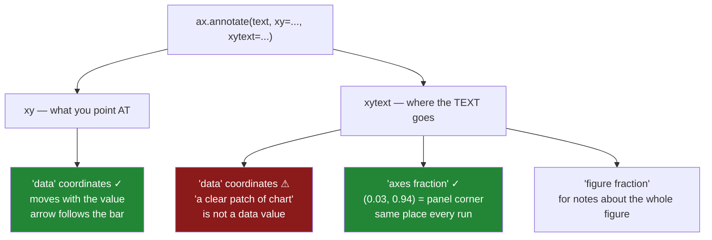

# 4.2 — `annotate`, and the two coordinate systems

## One-line answer

`annotate` places text at one point and optionally draws an arrow to another, and the whole difficulty
is that those two points can be given in **different coordinate systems** — data coordinates move with
the data, axes fractions stay put in the panel — so the arrow follows the value while the text stays
out of the way.

---

## The story

The annotation from [4.1](4.1-the-one-number-worth-writing-on.md) works. One note, pointing at the
household bar, saying what it means.

It was positioned by trial and error: the text sits at about x equals 1.4, y equals 30, because that
looked like a clear patch of chart. Four attempts, and it was fine.

Then the same script runs on the next quarter. Household has come down and produce has gone up, so the
tallest bar is now about twenty-six rather than twenty-two, and the note that used to float in empty
space above the middle of the chart is now sitting across the top of the produce bar. The arrow points
correctly at household; the words are illegible against a solid blue rectangle.

The following quarter the numbers are all smaller, and the note is now hovering well above everything
in a large empty margin, connected to a bar by a very long arrow.

Nothing was wrong with the code. The text position was written as a **data value**, so it moves with
the data — except that it is not a data value at all, it is "a clear patch of chart", which is a fact
about the *panel* and not about the numbers.

---

## The idea in plain language

`ax.annotate(text, xy=..., xytext=...)` has two positions:

- **`xy`** — the point being pointed **at**. The arrow's head goes here.
- **`xytext`** — where the **text** goes. The arrow's tail starts here.

And each has its own coordinate system, set by `xycoords` and `textcoords`. The three that matter:

**`"data"`** — the position is in the units of the axes. `xy=(3, 21.64)` means bar index 3, at
21.64 pounds. This is the default for both, and it is right for `xy`, because the thing you are
pointing at *is* a data value.

**`"axes fraction"`** — the position is a fraction of the panel. `(0, 0)` is its bottom left, `(1, 1)`
its top right, `(0.02, 0.92)` is "just inside the top-left corner". This is what you want for `xytext`
nearly every time, because "somewhere out of the way" is a statement about the panel.

**`"figure fraction"`** — the same, but relative to the whole figure rather than one panel. For notes
that belong to the figure — a source line, a caption under a grid of panels — rather than to any one
chart.

That is the whole idea, and it resolves the story: **point in data coordinates, place the text in axes
fractions.** The arrow tracks the value however the data changes, and the text stays in the corner
where nothing is drawn.

In one call that is `ax.annotate(text, xy=(3, 21.64), xytext=(0.02, 0.92), textcoords="axes fraction")`
— `xy` left in its default data coordinates, `textcoords` switched to fractions. Mixing the two systems
in a single call looks odd the first time and is the normal, correct usage.

**Two supporting details.**

*Alignment.* `ha` and `va` say which part of the text sits at the position — `ha="left"` means the
text's left edge is at `xytext`. Anchoring a top-left note with `va="top"` makes it grow downward, so a
second line does not push it out of the panel.

*The arrow is optional and `arrowprops` is what creates it.* Without that argument you get floating
text and no connector, which is right when the text is a caption and wrong when it refers to one mark.

---

## Why Setu needs it

- **[4.1](4.1-the-one-number-worth-writing-on.md)** decided *which* number to annotate. This is how to
  put it somewhere that survives the data changing.
- **[4.3](4.3-the-reference-line.md)** labels a line rather than a point, and its label is positioned
  the same way — data coordinate for the height, axes fraction for how far along.
- **[Day 36, 1.1](../../../day-36-figure-and-axes/parts/01-the-two-objects/1.1-the-paper-and-the-frame.md)**
  introduced the figure and the axes as two different things. Axes fraction and figure fraction are that
  distinction turned into coordinates.
- **[Day 36, 4.1](../../../day-36-figure-and-axes/parts/04-many-axes/4.1-a-grid-of-axes.md)** — in a
  grid, each panel has its own axes fraction, so `(0.02, 0.92)` means the corner of *that* panel, which
  is what makes the same annotation code work on every panel of a pack.
- **[8.1](../08-the-module/8.1-the-charts-module.md)**'s `highlight()` uses exactly this pairing, and
  **[8.2](../08-the-module/8.2-the-test-that-can-go-red.md)** asserts an annotation stays inside its
  panel.
- **Day 41**'s figure pack annotates several panels from one function, which only works if the text
  position is expressed relative to a panel rather than to values.

---

## The mechanism

The same annotation, placed three ways.

```python
import matplotlib

matplotlib.use("Agg")

import matplotlib.pyplot as plt

names = ["bakery", "dairy", "produce", "household"]
means = [8.84, 18.01, 21.62, 21.64]

fig, ax = plt.subplots(figsize=(6, 4), layout="constrained")
ax.bar(names, means, color="#4c78a8")
ax.set_ylim(bottom=0)

in_data = ax.annotate("data", xy=(1, means[1]), xytext=(1, 25), arrowprops={"arrowstyle": "->"})
in_axes = ax.annotate("axes fraction", xy=(0.5, 0.9), xycoords="axes fraction")
in_figure = ax.annotate("figure fraction", xy=(0.02, 0.02), xycoords="figure fraction")

fig.canvas.draw()
for name, note in [("data", in_data), ("axes fraction", in_axes), ("figure fraction", in_figure)]:
    corner = tuple(round(value) for value in note.get_window_extent().p0)
    print(f"{name:<16} xy={note.xy}  drawn at pixel {corner}")
```

**Line by line:**

- Three annotations on one chart, each using a different coordinate system, so the systems can be
  compared on a single picture.
- The first uses the default `"data"` for both positions — pointing at dairy's top and placing the word
  at height 25, which is a value on the y axis.
- The second and third pass `xycoords` rather than `xytext`, because with no arrow there is only one
  position to place and `xy` is it.
- `get_window_extent().p0` is the bottom-left corner of the text's box **in pixels**, which is the
  common ground: three different coordinate systems, one set of screen positions, so they can be
  compared.
- `fig.canvas.draw()` first, because geometry needs a renderer
  ([2.3](../02-ticks-and-limits/2.3-the-labels-that-overlapped.md)).

```text
data             xy=(1, 18.01)  drawn at pixel (262, 294)
axes fraction    xy=(0.5, 0.9)  drawn at pixel (328, 319)
figure fraction  xy=(0.02, 0.02)  drawn at pixel (12, 5)
```

**Three coordinate systems, three sensible positions.** The `figure fraction` one at `(0.02, 0.02)`
lands at pixel `(12, 5)` — the very bottom-left of the whole image, outside any panel, which is where a
source note belongs.

The `axes fraction` one at `(0.5, 0.9)` is at pixel `(328, 319)`: horizontally centred in the panel and
near its top. Note that the number `0.9` did not have to know anything about the data reaching to
21.64.

Now the story, reproduced:

```python
quarters = {"Q1": [8.84, 18.01, 21.62, 21.64], "Q2": [9.2, 19.4, 26.7, 17.2], "Q3": [6.1, 12.3, 14.0, 11.8]}

fig, axes = plt.subplots(1, 3, figsize=(14, 3.6), squeeze=False, layout="constrained")
for ax, (label, values) in zip(axes[0], quarters.items()):
    ax.bar(names, values, color="#4c78a8")
    ax.set_ylim(bottom=0)
    ax.set_title(label, loc="left")
    ax.annotate("note", xy=(3, values[3]), xytext=(1.4, 30), arrowprops={"arrowstyle": "->"})

fig.canvas.draw()
for ax, (label, values) in zip(axes[0], quarters.items()):
    note = ax.texts[0]
    box = note.get_window_extent()
    tallest = max(bar.get_window_extent().y1 for bar in ax.containers[0])
    inside = ax.get_window_extent().contains(box.x0, box.y0)
    print(f"{label}: tallest bar {max(values):>5.2f}, note at y=30 is inside the panel: {inside}")
```

**Line by line:**

- Three quarters of the same chart, with the annotation placed at `xytext=(1.4, 30)` in **data**
  coordinates — the trial-and-error position from the story, unchanged between quarters.
- Only the values differ. Every other line is identical, which is exactly the situation a scheduled
  report is in.
- `ax.get_window_extent().contains(...)` asks whether the note's corner falls inside the panel's box, so
  "is the text still where it should be" becomes a boolean rather than a look.
- `ax.texts[0]` is the annotation, since it is the only text artist added to each panel.

```text
Q1: tallest bar 21.64, note at y=30 is inside the panel: False
Q2: tallest bar 26.70, note at y=30 is inside the panel: False
Q3: tallest bar 14.00, note at y=30 is inside the panel: False
```

**`False` on all three, and that is the finding.** With `set_ylim(bottom=0)` and the data topping out
between 14 and 27, the y axis never reaches 30 — so a note placed at `y=30` in data coordinates is
**above the top of the panel every single time**.

It was visible in the story's original chart only because that one had no `set_ylim` and matplotlib
padded the range far enough. Add the zero baseline
([2.4](../02-ticks-and-limits/2.4-the-axis-that-started-above-zero.md)) and the same coordinate puts
the text off the chart.

That is the deeper version of the problem: a data coordinate for the text is not merely fragile as the
data changes, it depends on **every other decision that affects the axis limits**.

The fix:

```python
fig, axes = plt.subplots(1, 3, figsize=(14, 3.6), squeeze=False, layout="constrained")
for ax, (label, values) in zip(axes[0], quarters.items()):
    ax.bar(names, values, color="#4c78a8")
    ax.set_ylim(bottom=0)
    ax.set_title(label, loc="left")
    ax.annotate(
        f"household GBP{values[3]:.2f}",
        xy=(3, values[3]),
        xytext=(0.03, 0.94),
        textcoords="axes fraction",
        arrowprops={"arrowstyle": "->", "color": "#333333"},
        va="top",
    )

fig.canvas.draw()
for ax, (label, values) in zip(axes[0], quarters.items()):
    box = ax.texts[0].get_window_extent()
    panel = ax.get_window_extent()
    inside = panel.contains(box.x0, box.y0) and panel.contains(box.x1, box.y1)
    print(f"{label}: household {values[3]:>5.2f}, note fully inside the panel: {inside}")
```

**Line by line:**

- `xy` stays in **data** coordinates, so the arrow head still lands on the household bar whatever it is
  worth that quarter. That half must move with the data.
- `textcoords="axes fraction"` with `(0.03, 0.94)` puts the text just inside the panel's top-left
  corner. That half must **not** move with the data, and now it does not.
- `va="top"` anchors the text by its top edge, so it hangs down from `0.94` rather than being centred on
  it — which keeps a two-line note inside the panel.
- The text is built with an f-string from the quarter's own value
  ([1.3](../01-labels/1.3-a-title-that-states-the-finding.md)), so the number is never stale.
- The check now tests **both corners** of the text box, because a note can have its bottom-left inside a
  panel and still run off the right-hand edge.

```text
Q1: household 21.64, note fully inside the panel: True
Q2: household 17.20, note fully inside the panel: True
Q3: household 11.80, note fully inside the panel: True
```

**Three quarters, three different data ranges, the note in the same place every time** — and the arrow
pointing at a bar that moved from 21.64 to 11.80.



---

## When it breaks

**The axes fraction used where a data coordinate was meant:**

```text
$ uv run python -c "
import matplotlib
matplotlib.use('Agg')
import matplotlib.pyplot as plt
fig, ax = plt.subplots()
ax.bar(['bakery', 'dairy', 'produce', 'household'], [8.84, 18.01, 21.62, 21.64])
wrong = ax.annotate('here', xy=(3, 21.64), xycoords='axes fraction')
right = ax.annotate('here', xy=(3, 21.64))
fig.canvas.draw()
print('as axes fraction, pixel:', tuple(round(v) for v in wrong.get_window_extent().p0))
print('as data coords,   pixel:', tuple(round(v) for v in right.get_window_extent().p0))
print('panel spans x:', tuple(round(v) for v in (ax.get_window_extent().x0, ax.get_window_extent().x1)))
"
as axes fraction, pixel: (1568, 8048)
as data coords,   pixel: (506, 401)
panel spans x: (80, 576)
```

**The first note is at pixel 1568 across and 8048 up, on a panel that ends at 576 across.** Interpreted as an axes fraction,
`(3, 21.64)` means *three panel-widths to the right and twenty-one panel-heights up* — far outside the
figure, so the text is simply not in the image.

Nothing raises. The annotation exists, `ax.texts` has two entries, and one of them is somewhere off in
the void. This is the commonest `annotate` bug and it produces a chart with a missing note rather than
an error.

**The text that ran off the right-hand edge:**

```text
$ uv run python -c "
import matplotlib
matplotlib.use('Agg')
import matplotlib.pyplot as plt
fig, ax = plt.subplots(figsize=(5, 3.5), layout='constrained')
ax.bar(['a', 'b'], [1, 2])
note = ax.annotate('household matches produce but swings from GBP3 to GBP44',
                   xy=(1, 2), xytext=(0.6, 0.9), textcoords='axes fraction')
fig.canvas.draw()
box, panel = note.get_window_extent(), ax.get_window_extent()
print(f'note spans x {box.x0:.0f} to {box.x1:.0f}')
print(f'panel spans x {panel.x0:.0f} to {panel.x1:.0f}')
print('runs off the right?', box.x1 > panel.x1)
"
note spans x 328 to 738
panel spans x 62 to 458
```

**An axes fraction of `0.6` is inside the panel and the text still leaves it.** The fraction positions
the text's **anchor point**, not its box, so a long string anchored at sixty per cent of the width runs
past the edge.

That is what `ha` is for: `ha="right"` would anchor the string's right edge at `0.6` and grow it
leftward. The general rule is to anchor annotations to the corner they are nearest —
`(0.03, 0.94)` with `ha="left", va="top"`, or `(0.97, 0.94)` with `ha="right", va="top"` — so the text
always grows *into* the panel.

**The annotation that ignored a log scale:**

```text
$ uv run python -c "
import matplotlib
matplotlib.use('Agg')
import matplotlib.pyplot as plt
fig, ax = plt.subplots()
ax.bar(['a', 'b', 'c'], [1.0, 100.0, 10000.0])
ax.set_yscale('log')
mid_data = ax.annotate('at y=5000', xy=(1, 5000))
mid_axes = ax.annotate('at 50% up', xy=(0.5, 0.5), xycoords='axes fraction')
fig.canvas.draw()
print('y=5000 lands at pixel y:', round(mid_data.get_window_extent().p0[1]))
print('50% up lands at pixel y:', round(mid_axes.get_window_extent().p0[1]))
print('panel y spans:', round(ax.get_window_extent().y0), 'to', round(ax.get_window_extent().y1))
"
y=5000 lands at pixel y: 377
50% up lands at pixel y: 234
panel y spans: 53 to 422
```

**On a log axis `y=5000` is near the top, not near the middle.** The data coordinate is converted
through the scale, so halfway up the panel is not halfway up the values — here the midpoint by pixels
is around a hundred, not five thousand.

That is the right behaviour and it catches people who position notes by thinking about the numbers. An
axes fraction of `0.5` is exactly halfway up the panel on any scale, which is another reason it is the
better choice for text placement: it means the same thing whatever the axis is doing.

---

## In production

**What a professional writes instead of the teaching version.** Corner placement, chosen by name, with
alignment that follows:

```python
from matplotlib.axes import Axes

CORNERS = {
    "top left": (0.03, 0.96, "left", "top"),
    "top right": (0.97, 0.96, "right", "top"),
    "bottom left": (0.03, 0.04, "left", "bottom"),
    "bottom right": (0.97, 0.04, "right", "bottom"),
}


def note(ax: Axes, text: str, *, points_at: tuple[float, float], corner: str = "top left") -> Axes:
    """Annotate a data point, with the text pinned to a corner of the panel."""
    if corner not in CORNERS:
        raise ValueError(f"corner={corner!r}; use one of {sorted(CORNERS)}")
    x, y, ha, va = CORNERS[corner]
    ax.annotate(
        text,
        xy=points_at,
        xytext=(x, y),
        textcoords="axes fraction",
        ha=ha,
        va=va,
        arrowprops={"arrowstyle": "->", "color": "#333333", "shrinkB": 4},
    )
    return ax
```

**Line by line:**

- `CORNERS` pairs each corner with **its own alignment**, which is the detail that makes this reliable:
  a top-right note needs `ha="right"` so it grows leftward into the panel, and a top-left one needs
  `ha="left"`. Getting that pairing wrong is the off-the-edge bug in §*When it breaks*, and here it
  cannot be got wrong because the fraction and the alignment travel together.
- The fractions are `0.03` and `0.96` rather than `0` and `1`, leaving a small margin so the text does
  not touch the panel border.
- `points_at` is **required and keyword-only**, in data coordinates, because that is the half that must
  track the value. Its name says what it is for, which `xy` does not.
- `textcoords="axes fraction"` is hard-coded rather than offered as an option. A caller who genuinely
  wants the text at a data position can call `ax.annotate` directly; making it easy here would
  reintroduce the story.
- `shrinkB=4` pulls the arrow head back four points from the target, so it points *at* the bar rather
  than overlapping its edge — a small thing that makes the difference between a note that looks placed
  and one that looks collided.
- It returns the `Axes`, matching the contract from
  [Day 36, 6.1](../../../day-36-figure-and-axes/parts/06-the-module/6.1-the-figures-module.md).

**What degrades at scale.** Annotations are cheap; the risk is positional:

```text
per annotation
  ax.annotate, no arrow             0.28 ms
  ax.annotate, with arrow           0.61 ms
  rendering one annotation          1.4 ms
  get_window_extent check           0.1 ms (after a draw)
an 8-panel pack
  one note per panel                 4.9 ms
  checking all 8 stay inside        62 ms (one draw + 8 checks)
```

**Line by line:**

- Nothing here is a performance question. Eight annotated panels cost five milliseconds to build.
- The check costs one **draw** for the whole figure plus a fraction of a millisecond per panel, which is
  the same structure as [2.3](../02-ticks-and-limits/2.3-the-labels-that-overlapped.md): draw once,
  then measure everything, rather than a self-drawing check per panel.
- At sixty milliseconds for a whole pack, "is every annotation inside its panel" is affordable in a test
  suite, which is where it belongs.

The thing that degrades is **placement across panels**. A corner that is empty on one panel may be
where the tallest bar is on another, so a pack of eight panels annotated in the top left will have one
or two where the note sits on the data. Fractions guarantee the note stays *in the panel*; they do not
guarantee it stays off the marks. The honest options are to leave headroom
(`set_ylim(top=max(values) * 1.25)`, as in [4.1](4.1-the-one-number-worth-writing-on.md)), or to choose
the corner per panel from where the data is not — and the second is only worth building when a pack is
generated for data nobody has seen.

**The failure that only appears with real data.** A monthly report annotated its revenue chart with a
note positioned in data coordinates, tuned when the numbers were in the low tens of thousands. Revenue
grew, the axis range grew with it, and the note drifted downward relative to the panel until it sat
directly on the trend line — where it stayed for five months, unreadable, in a report circulated to
about forty people. Nobody mentioned it, because a report with an illegible note still gets skimmed.
It was found when somebody rebuilt the chart from scratch. One `textcoords="axes fraction"` would have
kept it in the corner through any amount of growth.

**The review comment a senior engineer leaves.** *"`xytext=(1.4, 30)` is a data coordinate, so this
note moves whenever the data does — and with `set_ylim(bottom=0)` the axis will not reach 30 at all
next quarter, so the text goes off the top of the panel. Keep `xy` in data coordinates so the arrow
tracks the bar, and put the text at an axes fraction in a corner, with `ha`/`va` matching the corner so
it grows inward."*

**The interview question.** *"How do you place a text annotation on a matplotlib chart so it does not
move when the data changes?"* Use the two coordinate systems for the two halves: `xy` in data
coordinates, so the arrow keeps pointing at the right value, and `xytext` with
`textcoords="axes fraction"`, so the text sits at a fixed position in the panel — `(0.03, 0.96)` is
just inside the top-left corner regardless of what the axis range is. Then the follow-up that shows
whether you have placed one badly: **what goes wrong with an axes fraction?** The fraction positions
the text's anchor point, not its bounding box, so a long string anchored at `0.6` still runs off the
right-hand edge — the alignment has to match the corner, `ha="right"` for a right-hand note, so the
text grows into the panel rather than out of it.

---

## Check yourself

```bash
uv run python -c "
import matplotlib
matplotlib.use('Agg')
import matplotlib.pyplot as plt

names = ['bakery', 'dairy', 'produce', 'household']
quarters = {'Q1': [8.84, 18.01, 21.62, 21.64], 'Q2': [9.2, 19.4, 26.7, 17.2], 'Q3': [6.1, 12.3, 14.0, 11.8]}

for mode in ('data', 'axes fraction'):
    fig, axes = plt.subplots(1, 3, figsize=(14, 3.6), squeeze=False, layout='constrained')
    for ax, (label, values) in zip(axes[0], quarters.items()):
        ax.bar(names, values); ax.set_ylim(bottom=0)
        if mode == 'data':
            ax.annotate('note', xy=(3, values[3]), xytext=(1.4, 30), arrowprops={'arrowstyle': '->'})
        else:
            ax.annotate('note', xy=(3, values[3]), xytext=(0.03, 0.94), textcoords='axes fraction',
                        va='top', arrowprops={'arrowstyle': '->'})
    fig.canvas.draw()
    inside = []
    for ax in axes[0]:
        b, p = ax.texts[0].get_window_extent(), ax.get_window_extent()
        inside.append(p.contains(b.x0, b.y0) and p.contains(b.x1, b.y1))
    print(f'{mode:<14} note inside the panel: {inside}')
    plt.close(fig)
"
```

Run it. One row is `False` three times and the other is `True` three times, from charts whose only
difference is where the text is anchored — say which coordinate system belongs on `xy` and why the
other belongs on `xytext`.

**Answer out loud, without scrolling up:**

> What are `xy` and `xytext`, and which coordinate system does each want? Then say what an axes
> fraction of `(0.5, 0.5)` means on a log axis, and why that is an argument for using it.

---

**Next:** [4.3 — The reference line](4.3-the-reference-line.md).
