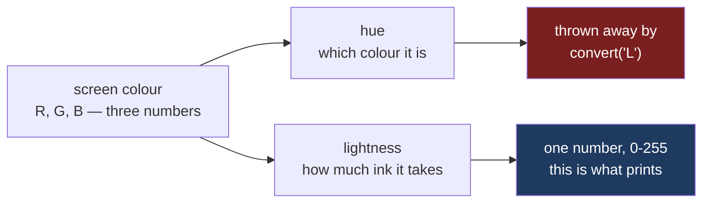

# 5.1 — The greyscale test you can run

## One-line answer

Save the chart, open it again with Pillow, convert it to grey, and read the four numbers back: on
matplotlib's default colours the flat's four aisles land on greys **91, 100, 112 and 152**, so the
two closest series are **nine levels apart out of two hundred and fifty-six**, and that is a
measurement rather than an opinion.

---

## The story

The chart from [1.1](../01-labels/1.1-the-chart-that-never-said-what-the-numbers-were.md) finally has
its labels, and somebody decides it should go on the fridge. Twelve weeks, four lines, one for each
aisle. They print it on the printer in the hallway, which has been out of colour ink since roughly
February and nobody has replaced it.

The sheet comes out and there are four grey lines on it.

One of them is noticeably paler than the rest. The other three are the same shade of medium grey.
You can see that lines cross and that one of them zig-zags, but you cannot say which zig-zag belongs
to which word in the little box in the corner, because the little box in the corner also has four
squares in it and three of them are the same grey too.

So the chart goes back to the group chat, and the reply is the same reply as before, in a new
costume: **"which line is household?"**

The interesting part is that nobody did anything wrong. The chart was fine on the screen. Blue,
orange, green and red are four colours that no one confuses. It is only that the hallway printer
throws away the part of a colour that made them different, and keeps the part that did not.

---

## The idea in plain language

A colour on a screen is three numbers: how much red, how much green, how much blue. Written the way
matplotlib writes them, matplotlib's first default colour is `(0.12, 0.47, 0.71)` — a bit of red, a
fair amount of green, a lot of blue. That is the blue you have been looking at all day.

A black-and-white printer cannot print "a lot of blue". It has one ink. So somewhere between your
file and the paper, those three numbers get squashed into **one** number: how *light* the colour is.
That one number is called the **grey level**, and the picture made out of grey levels is called a
**greyscale** image. In the library we are about to use, Pillow, greyscale is called **mode `"L"`**,
and the grey level runs from `0`, which is black, to `255`, which is white.

Two colours that look nothing alike can have almost the same grey level. That is the whole problem.
Blue and green are as far apart as two colours get on a screen, and they are practically the same
weight of ink. Hue — which is the word for *which* colour something is, the thing that makes blue
blue — is thrown away completely. Lightness is all that survives.

So a chart that tells its four series apart **only by hue** is a chart that stops working the moment
anybody prints it, photocopies it, projects it through a tired projector, or reads it with a kind of
colour vision that does not separate red from green. And you will not notice, because your copy is
on a screen.

The fix for this comes in [5.2](5.2-hatch-and-marker-instead-of-colour.md). What this part gives you
is the **test**: a short piece of code that answers the question "would this survive the hallway
printer?" with a number instead of a shrug.

---

## Why Setu needs it

- **[5.2](5.2-hatch-and-marker-instead-of-colour.md)** is the repair. It only makes sense once you
  can measure the damage, and this part is the measurement.
- **[5.3](5.3-dpi-and-the-label-that-got-cut-off.md)** is the other half of getting a file out
  intact: the right number of pixels, with nothing clipped off the edge.
- **[8.1](../08-the-module/8.1-the-charts-module.md)** turns the loose script below into
  `greyscale_separation(fig) -> float`, a function the rest of the project calls.
- **[8.2](../08-the-module/8.2-the-test-that-can-go-red.md)** asserts on it:
  `greyscale_separation(fig) >= MIN_GREY_SEPARATION`. A chart that fails the fridge is a failing
  test, not a taste argument.
- **Day 41** is the phase gate: an eight-chart pack that must be greyscale-legible. Eight charts is
  well past the number you can eyeball, so the gate is passed or failed by this measurement.

---

## The mechanism

The flat's twelve weeks, four aisles, from one seed, so that your numbers match this page's:

```python
import matplotlib
import numpy as np
import pandas as pd

matplotlib.use("Agg")
import matplotlib.pyplot as plt


def weekly_spend() -> pd.DataFrame:
    """Twelve weeks of the flat's shopping, four aisles, in pounds."""
    rng = np.random.default_rng(37)
    columns = {}
    steady = [("bakery", 9.0, 1.5), ("dairy", 18.0, 2.0), ("produce", 22.0, 2.5)]
    for aisle, centre, spread in steady:
        columns[aisle] = np.round(rng.normal(centre, spread, 12), 2)
    household = np.empty(12)
    household[0::2] = rng.normal(5.0, 1.0, 6)
    household[1::2] = rng.normal(37.5, 3.0, 6)
    columns["household"] = np.round(household, 2)
    return pd.DataFrame(columns, index=pd.RangeIndex(1, 13, name="week"))


spend = weekly_spend()
fig, ax = plt.subplots(figsize=(6, 3.5), layout="constrained")
for aisle in spend.columns:
    ax.plot(spend.index, spend[aisle], label=aisle, linewidth=2.5)
ax.set_xlabel("week")
ax.set_ylabel("weekly spend (£)")
ax.legend()
fig.savefig("colour.png", dpi=100)

for line in ax.get_lines():
    print(f"{line.get_label():10s} {line.get_color()}")
```

**Line by line:**

- `matplotlib.use("Agg")` before `import matplotlib.pyplot` picks the **backend**, the part of
  matplotlib that turns a figure into pixels. `Agg` writes files and never opens a window, which is
  what you want in a script and in a test.
- `np.random.default_rng(37)` is the seeded generator from
  [Day 20, 4.1](../../../day-20-arrays-and-dtypes/parts/04-random/4.1-default-rng-the-generator.md).
  Seeded, so the greys further down are reproducible on your machine.
- `layout="constrained"` asks matplotlib to work out the spacing before drawing rather than after.
  It matters here because a clipped label would change the pixels we are about to read; that is the
  subject of [5.3](5.3-dpi-and-the-label-that-got-cut-off.md).
- `linewidth=2.5` is thicker than the default of `1.5`. This is not decoration. We are going to read
  the colour of a single pixel on each line, and a thin line is mostly the soft blurred edge that
  matplotlib draws to stop it looking jagged. A fat line has a solid middle.
- `label=aisle` inside `ax.plot` is what makes `ax.legend()` able to name the series later, and it
  is also what `line.get_label()` reads back on the last line.
- `fig.savefig("colour.png", dpi=100)` writes the file. `dpi` — dots per inch — decides how many
  pixels the figure's inches turn into. It is stated rather than inherited, for the reason every
  default gets stated in this project, and it gets its own treatment in
  [5.3](5.3-dpi-and-the-label-that-got-cut-off.md).

```text
bakery     #1f77b4
dairy      #ff7f0e
produce    #2ca02c
household  #d62728
```

Four colours from matplotlib's default cycle. On a screen they are blue, orange, green and red, and
nobody would mix them up. Now ask the paper.

```python
from PIL import Image

grey = Image.open("colour.png").convert("L")
width, height = grey.size
pixels = grey.load()
print("mode:", grey.mode, " size:", grey.size)


def grey_at(ax, x, y):
    """The grey level of the saved image at one point in data coordinates."""
    display_x, display_y = ax.transData.transform((x, y))
    return pixels[round(display_x), round(height - display_y)]


levels = {aisle: grey_at(ax, 6, spend.loc[6, aisle]) for aisle in spend.columns}
print("greys:", levels)
```

**Line by line:**

- `Image.open(...)` reads the PNG back off disk. Reading it back is the point: we are testing the
  *file*, the thing that gets printed, not the figure object still sitting in memory.
- `.convert("L")` is the hallway printer, in one method call. `"L"` is Pillow's name for greyscale,
  and the conversion is exactly the squashing described above: three numbers in, one out.
- `grey.load()` returns an object you can index with `pixels[column, row]` to get one pixel. It is
  indexed **column first**, which is the opposite order to a NumPy array, and getting that backwards
  is the commonest mistake in this whole part.
- `ax.transData.transform((x, y))` converts a point in **data coordinates** — week 6, £19.38 — into
  **display coordinates**, which are pixels measured from the *bottom* left of the figure. Every
  matplotlib artist carries a transform like this; that is the machinery behind
  [Day 36, 1.3](../../../day-36-figure-and-axes/parts/01-the-two-objects/1.3-everything-is-an-artist.md).
- `height - display_y` flips the vertical axis. Matplotlib counts pixels upwards from the bottom;
  image files count rows downwards from the top. Forgetting this flip does not raise, it just reads
  the wrong pixel, which is worse.
- `spend.loc[6, aisle]` is the actual value at week 6 for that aisle, so the point we sample is
  guaranteed to be *on* the line rather than near it.

```text
mode: L  size: (600, 350)
greys: {'bakery': 100, 'dairy': 152, 'produce': 112, 'household': 91}
```

Four colours. Four greys. Now the number that matters:

```python
order = sorted(levels.values())
gaps = [later - earlier for earlier, later in zip(order, order[1:])]
print("sorted greys:", order)
print("gaps        :", gaps)
print("separation  :", min(gaps), "levels out of 256")
```

**Line by line:**

- `sorted(levels.values())` puts the four greys in order of lightness. Which aisle is which stops
  mattering here: what we want to know is how crowded the four of them are on one axis from 0 to
  255.
- `zip(order, order[1:])` pairs each grey with the next one along, which is the standard way of
  walking consecutive pairs of a list. It is left without `strict=True` on purpose, because the two
  arguments have deliberately different lengths — that is what makes the pairing work.
- `min(gaps)` is the whole test. The chart is only as legible as its **closest pair**, so the
  smallest gap is the score, not the average and not the largest.

```text
sorted greys: [91, 100, 112, 152]
gaps        : [9, 12, 40]
separation  : 9 levels out of 256
```

**Nine.** Household prints at 91 and bakery prints at 100. Out of 256 possible shades, they are nine
apart, which is about three and a half per cent of the scale — on paper, and through a printer that
was never going to be exact, they are the same line.

Why those four numbers and not others? Pillow's `"L"` conversion is a fixed weighted sum of the
three channels: `L = R × 299/1000 + G × 587/1000 + B × 114/1000`. Green counts for well over half,
blue for barely a tenth. Those weights come from the *Studio encoding parameters of digital
television for standard 4:3 and wide screen 16:9 aspect ratios* (ITU-R BT.601-7, 2011,
https://www.itu.int/rec/R-REC-BT.601), which fixed them so that a colour broadcast would still look
right on a black-and-white set — the same problem as the hallway printer, forty years earlier. Check
the arithmetic on household, `#d62728`, which is `(214, 39, 40)`:

```text
214 × 0.299 = 63.99
 39 × 0.587 = 22.89
 40 × 0.114 =  4.56
                -----
                91.44  ->  91
```

Where the information goes:



The default colour cycle varies the top branch and barely touches the bottom one. That is a
reasonable choice for a screen and a bad one for anything else.

---

## When it breaks

**You saved it as a vector file, so there are no pixels to read:**

```text
$ uv run python -c "
import matplotlib
matplotlib.use('Agg')
import matplotlib.pyplot as plt
from PIL import Image
fig, ax = plt.subplots()
ax.plot([1, 2, 3], [1, 4, 9])
fig.savefig('colour.svg')
Image.open('colour.svg').convert('L')
"
```

```text
Traceback (most recent call last):
  File "<string>", line 9, in <module>
    Image.open(svg).convert("L")
    ^^^^^^^^^^^^^^
  File ".../site-packages/PIL/Image.py", line 3715, in open
    raise UnidentifiedImageError(msg)
PIL.UnidentifiedImageError: cannot identify image file 'colour.svg'
```

**What it means.** An SVG is not an image in Pillow's sense. It is a text file full of instructions —
"draw a line from here to here in `#1f77b4`" — and nothing has performed those instructions yet, so
there is no grid of pixels to convert. Pillow opens files that contain pixels and refuses everything
else, and `UnidentifiedImageError` is that refusal.

**The smallest fix** is to run the greyscale test on a PNG even when the chart you ship is an SVG.
Save both from the same figure: the SVG for the document, the PNG for the test. They come from one
`Figure` object, so testing one tests the other.

**You sampled a point that is not in the picture:**

```text
$ uv run python -c "
import matplotlib
matplotlib.use('Agg')
import matplotlib.pyplot as plt
from PIL import Image
fig, ax = plt.subplots(figsize=(6, 3.5), layout='constrained')
ax.plot([1, 2, 3], [1, 4, 9])
fig.savefig('colour.png', dpi=100)
grey = Image.open('colour.png').convert('L')
pixels = grey.load()
height = grey.size[1]
x, y = ax.transData.transform((20, 60.0))
print('display coords:', round(x, 1), round(y, 1))
print(pixels[round(x), round(height - y)])
"
```

```text
display coords: 4997.1 2174.6
Traceback (most recent call last):
  File "<string>", line 13, in <module>
IndexError: image index out of range
```

**What it means.** The figure is 600 pixels wide and 350 tall, and the point you asked for sits at
column 4997 of row -1825. Week 20 and £60 are outside the axis limits, so `transData` cheerfully
returns a display coordinate far off the edge of the figure, and Pillow refuses to index there. The
transform does not clip; it is arithmetic, and arithmetic does not know where the paper ends.

**The smallest fix** is to sample a point you got from the data rather than one you typed. Every
sample in the mechanism above came from `spend.loc[6, aisle]`, which cannot be outside the drawing,
because it is the reason the drawing has the extent it has.

---

## In production

**What a professional writes instead of the teaching version.** Not a file on disk and not a sampled
pixel. A file on disk means the test leaves rubbish behind and fails differently on a machine with a
full temp directory, and a sampled pixel means the answer depends on where two lines happen to
cross. Both go:

```python
import io

import matplotlib.colors as mcolors
from PIL import Image

BT601 = (0.299, 0.587, 0.114)


def declared_greys(ax) -> dict[str, int]:
    """The grey each series will print as, from the colour it was drawn with."""
    out = {}
    for line in ax.get_lines():
        red, green, blue = mcolors.to_rgb(line.get_color())
        weighted = sum(c * w for c, w in zip((red, green, blue), BT601))
        out[str(line.get_label())] = round(weighted * 255)
    return out


def greyscale_separation(fig) -> int:
    """Smallest gap between the greys this figure's series collapse to."""
    buffer = io.BytesIO()
    fig.savefig(buffer, format="png", dpi=100)
    buffer.seek(0)
    Image.open(buffer).convert("L")  # proves the file really is renderable
    greys = sorted(declared_greys(fig.axes[0]).values())
    return min(later - earlier for earlier, later in zip(greys, greys[1:]))
```

**Line by line:**

- `io.BytesIO()` is a file that lives in memory. `savefig` accepts it anywhere it accepts a path, so
  the test writes nothing to disk, cleans up when the function returns, and runs the same on every
  machine.
- `mcolors.to_rgb` turns any spelling of a colour — `"#d62728"`, `"C3"`, `"red"`, an RGB tuple —
  into three floats between 0 and 1. Reading the *declared* colour rather than a rendered pixel is
  the important change: it cannot be confused by two lines overlapping, by antialiasing, or by a
  marker sitting on top of the sample point.
- `BT601` is a named module constant rather than three magic numbers inside the loop, so that a
  reader can search for it and find out where it came from.
- `round(weighted * 255)` puts the answer on the same 0-255 scale as the image, so that the number
  in the test and the number you would read off the picture are directly comparable.
- `Image.open(buffer).convert("L")` is kept even though its result is unused. It is a cheap proof
  that the figure actually renders to a real image; a figure that raises during `savefig` is a
  failure this function should surface, not swallow.
- `min(later - earlier ...)` again scores the **closest pair**. A figure with one beautifully
  distinct series and three identical ones is a failing figure, and the average would hide that.

**What degrades at scale.** The default colour cycle has ten entries, and the greys they collapse to
are crowded. Four series already put two of them nine levels apart; six or eight series cannot be
separated by lightness at all, because there are only so many distinguishable shades of grey and a
printer's are fewer than a screen's. Past about four series the honest move is to stop adding
colours and change the *encoding* — direct labels, small multiples, or the hatches and line styles
of [5.2](5.2-hatch-and-marker-instead-of-colour.md).

**The failure that only shows with real data.** A weekly report had five regions on one line chart
and passed every review for a year, because every reviewer read it on a laptop. It was printed once,
for a board pack, and two of the five lines merged. The lines that merged were the two that had
never crossed on screen, so nobody had ever needed to tell them apart before — the failure was
invisible precisely because the data had been well behaved. The month the data misbehaved was the
month the chart was needed and unreadable.

**The proper measure is not this one.** BT.601's weights are applied to the stored numbers as they
sit in the file, and screens do not emit light in proportion to those numbers. A perceptually honest
contrast figure first undoes that, and the definition to use is the one in *Web Content Accessibility
Guidelines (WCAG) 2.2* (2024, W3C Recommendation, https://www.w3.org/TR/WCAG22/), which specifies
relative luminance and a contrast ratio built from it. The nine-levels test in this part is the cheap
version: good enough to catch the disaster, not good enough to certify a document.

**The review comment a senior engineer leaves.** *"This passes on my screen and I have no idea
whether it passes on paper. Add `greyscale_separation` to the figure test and give it a threshold
constant, so the next person who adds a fifth series finds out from CI instead of from the printer."*

**The interview question.** *"Your chart is going in a printed report. What do you check?"* The
answer that shows you have done it is: convert to greyscale and measure the gap between the closest
two series, because hue is the part of a colour that does not survive and it is the part the default
palette varies. The follow-up is usually *"why can't you just look at it?"*, and the answer is that
you already know which line is which, so you are the one person who cannot tell.

---

## Check yourself

```bash
uv run --with 'matplotlib==3.11.1' python -c "
import matplotlib
matplotlib.use('Agg')
import matplotlib.colors as mcolors
greys = {}
for i in range(6):
    name = f'C{i}'
    r, g, b = mcolors.to_rgb(name)
    greys[name] = round((0.299 * r + 0.587 * g + 0.114 * b) * 255)
print(greys)
order = sorted(greys.values())
print('closest pair:', min(y - x for x, y in zip(order, order[1:])))
"
```

You extended the test from four series to six. Say what the closest pair became, and whether adding
a fifth and sixth colour made the chart more readable or less.

**Answer out loud, without scrolling up:**

> Explain, without using the word "greyscale", what a black-and-white printer does to a colour and
> which part of it is lost. Then say why the smallest gap between two series is the right score for
> a chart, rather than the average gap.

---

**Next:** [5.2 — Hatch and marker instead of colour](5.2-hatch-and-marker-instead-of-colour.md).
