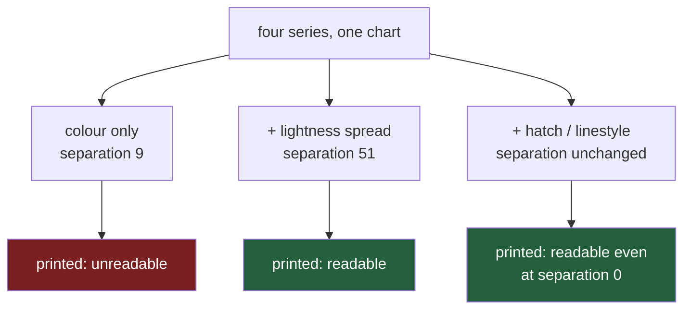

# 5.2 — Hatch and marker instead of colour

## One-line answer

Give every series a **second mark that is not a colour** — a hatch on a bar, a dash pattern and a
marker shape on a line — and pick fills that differ in lightness as well as hue: on the flat's four
aisles that moves the greyscale separation from **9 levels to 51**, and it keeps working even when
two series print as exactly the same grey.

---

## The story

The printout from [5.1](5.1-the-greyscale-test-you-can-run.md) is still on the fridge, and it is
still four grey lines that nobody can name.

Somebody gets a biro. They find household by counting along the legend, then draw little crosses
along it, all the way across the sheet. Then they do produce with dashes. Bakery gets left alone
because it was already the pale one. Then they go to the box in the corner and put a cross and a
dash next to the right words.

It takes a couple of minutes and it works completely. The sheet has not gained any colour. What it
has gained is that each line now carries **two** things that say which line it is: a shade of grey,
and a shape. Anybody who cannot tell the greys apart can count the crosses instead, and anybody who
can tell the greys apart is not slowed down by the crosses being there.

That is not a workaround. That is the correct way to draw the chart in the first place, and every
one of those biro marks has a keyword argument behind it.

---

## The idea in plain language

A **channel** is one physical property of a mark that stands for something: its colour, its
lightness, its position, its shape, the pattern printed inside it. When a chart has four series and
tells them apart by colour alone, it is using one channel, and if anything happens to that channel —
a printer, a photocopier, a projector, a reader whose eyes do not separate red from green — the chart
carries no information about which series is which at all.

**Redundant encoding** means saying the same thing twice, in two channels. Household is red *and*
crossed. Produce is green *and* dashed. Neither mark is needed when the other one works, which is
exactly why the chart survives losing one.

For bars, the second channel is a **hatch**: a repeating pattern drawn inside the shape. You ask for
it with `hatch="/"`, and the string is a picture — `/` is diagonal lines leaning right, `\` leans
left, `x` is both crossing, `.` is dots, `o` is small circles. For lines, there are two second
channels available at once: the **line style**, which is the dash pattern (`"-"` solid, `"--"`
dashed, `"-."` dash-dot, `":"` dotted), and the **marker**, the little shape drawn at each data
point (`"o"` circle, `"s"` square, `"^"` triangle, `"D"` diamond).

There is a third thing to fix, and it is the one people skip. Adding a hatch does not change what
colour anything is, so it does not change the greyscale measurement from
[5.1](5.1-the-greyscale-test-you-can-run.md) by a single level. If you want that number to improve,
you have to also choose fills that differ in **lightness**, not only in hue. Both fixes are needed
and they fix different halves of the problem: lightness makes the greys distinguishable, hatching
makes the series distinguishable even when the greys are not.

---

## Why Setu needs it

- **[5.1](5.1-the-greyscale-test-you-can-run.md)** measured the damage. This part repairs it, and
  the repair is judged by re-running that same measurement.
- **[5.3](5.3-dpi-and-the-label-that-got-cut-off.md)** is next, and hatching interacts with it
  directly: a hatch pattern is spaced in inches, so a small chart gets fewer strokes per bar, which
  is measured below.
- **[8.1](../08-the-module/8.1-the-charts-module.md)** puts the hatch cycle in the module, so that
  `bars(...)` applies it without the caller having to remember.
- **[8.2](../08-the-module/8.2-the-test-that-can-go-red.md)** has a mutation for exactly this:
  delete the hatch cycle and watch the greyscale assertion go red.
- **Day 41** is the phase gate — an eight-chart pack that must be both greyscale-legible and
  colour-blind-safe. Eight charts is more than one palette can carry on hue alone.

---

## The mechanism

Four aisle means, drawn four ways, measured the same way each time. First the setup and the
measuring function:

```python
import matplotlib
import numpy as np
import pandas as pd
from PIL import Image

matplotlib.use("Agg")
import matplotlib.pyplot as plt


def weekly_spend() -> pd.DataFrame:
    """Twelve weeks of the flat's shopping, four aisles, in pounds."""
    rng = np.random.default_rng(37)
    columns = {}
    steady = [("bakery", 9.0, 1.5), ("dairy", 18.0, 2.0), ("produce", 22.0, 2.5)]
    for aisle, centre, spread in steady:
        columns[aisle] = np.round(rng.normal(centre, spread, 12), 2)
    household = np.empty(12)
    household[0::2] = rng.normal(5.0, 1.0, 6)
    household[1::2] = rng.normal(37.5, 3.0, 6)
    columns["household"] = np.round(household, 2)
    return pd.DataFrame(columns, index=pd.RangeIndex(1, 13, name="week"))


means = weekly_spend().mean().round(2)
HATCHES = ["/", "\\", "x", "."]
GREYS = ["#f0f0f0", "#bdbdbd", "#737373", "#252525"]


def inspect(title, colors, hatches, path):
    """Draw the four bars, save, and report the grey and the texture inside each one."""
    fig, ax = plt.subplots(figsize=(5, 3.2), layout="constrained")
    extra = {"hatch": hatches} if hatches else {}
    bars = ax.bar(means.index, means.to_numpy(), color=colors, edgecolor="black", **extra)
    ax.set_ylabel("mean weekly spend (£)")
    fig.savefig(path, dpi=100)
    image = np.asarray(Image.open(path).convert("L"))
    height = image.shape[0]
    print(title)
    fills = {}
    for aisle, patch in zip(means.index, bars):
        x0, y0, x1, y1 = patch.get_window_extent().extents
        block = image[int(height - y1) + 4 : int(height - y0) - 4, int(x0) + 4 : int(x1) - 4]
        values, counts = np.unique(block, return_counts=True)
        fill = int(values[counts.argmax()])
        fills[aisle] = fill
        other = float((block != fill).mean())
        print(f"  {aisle:10s} fill grey={fill:3d}  texture(std)={block.std():6.2f}  ink={other:.3f}")
    order = sorted(fills.values())
    gaps = [later - earlier for earlier, later in zip(order, order[1:])]
    print(f"  greys {order} -> gaps {gaps} -> separation {min(gaps)}\n")
    plt.close(fig)
```

**Line by line:**

- `HATCHES` and `GREYS` are module-level constants because they are a **policy**, not a decoration.
  Every chart in the project uses the same four hatches in the same order, so that a reader who has
  learnt "crossed means household" on one chart is not re-learning it on the next.
- `GREYS` runs from very pale to very dark on purpose: `#f0f0f0` is near white, `#252525` is near
  black. That spread is what fixes the number from [5.1](5.1-the-greyscale-test-you-can-run.md); the
  hatches on their own would not.
- `edgecolor="black"` draws the outline of each bar. It also gives the hatch somewhere to be seen
  against, and it makes the pale `#f0f0f0` bar visible at all — a near-white bar with no outline is
  a bar-shaped hole in the page.
- `**extra` unpacks either `{"hatch": [...]}` or nothing, so the same function draws the hatched and
  unhatched versions without a second `ax.bar` call that could drift out of step with the first.
- `patch.get_window_extent()` gives the bar's rectangle in display pixels, so we can slice exactly
  the part of the image that is bar rather than guessing coordinates.
- `int(height - y1) + 4` and `int(height - y0) - 4` convert matplotlib's upward-counting pixels into
  the image's downward-counting rows, and step 4 pixels inside so the black outline is not counted
  as texture. The flip is the same one as in [5.1](5.1-the-greyscale-test-you-can-run.md).
- `values[counts.argmax()]` is the **most common** grey inside the bar, which is the fill. Taking a
  mean instead would be wrong: on a hatched bar the mean sits between the fill and the strokes, and
  is a grey that appears nowhere in the picture.
- `(block != fill).mean()` is the fraction of pixels inside the bar that are *not* the fill colour.
  On a plain bar that is zero. On a hatched bar it is however much of the bar the strokes cover, and
  it is the only number here that notices the hatch at all.

Now run it four times.

```python
inspect("A. default colours, no hatch", ["C0", "C1", "C2", "C3"], None, "a.png")
inspect("B. default colours, hatch added", ["C0", "C1", "C2", "C3"], HATCHES, "b.png")
inspect("C. lightness-spread greys + hatch", GREYS, HATCHES, "c.png")
inspect("D. one colour, four hatches", ["#bdbdbd"] * 4, HATCHES, "d.png")
```

**Line by line:**

- **A** is the chart as matplotlib hands it to you: four hues from the default cycle and nothing
  else. This is the baseline the other three are measured against.
- **B** changes exactly one thing — the hatch — so that whatever the numbers do can only be the
  hatch's doing.
- **C** changes the colours as well, which is the version you would actually ship.
- **D** is the deliberately extreme case: every bar the same colour, told apart only by pattern. It
  exists to answer "does the hatch really carry the information, or is it just texture?"

```text
A. default colours, no hatch
  bakery     fill grey=100  texture(std)=  0.00  ink=0.000
  dairy      fill grey=152  texture(std)=  0.00  ink=0.000
  produce    fill grey=112  texture(std)=  0.00  ink=0.000
  household  fill grey= 91  texture(std)=  0.00  ink=0.000
  greys [91, 100, 112, 152] -> gaps [9, 12, 40] -> separation 9

B. default colours, hatch added
  bakery     fill grey=100  texture(std)= 20.64  ink=0.111
  dairy      fill grey=152  texture(std)= 31.12  ink=0.110
  produce    fill grey=112  texture(std)= 31.10  ink=0.210
  household  fill grey= 91  texture(std)= 20.33  ink=0.099
  greys [91, 100, 112, 152] -> gaps [9, 12, 40] -> separation 9

C. lightness-spread greys + hatch
  bakery     fill grey=240  texture(std)= 49.33  ink=0.111
  dairy      fill grey=189  texture(std)= 38.64  ink=0.110
  produce    fill grey=115  texture(std)= 31.91  ink=0.210
  household  fill grey= 37  texture(std)=  8.30  ink=0.099
  greys [37, 115, 189, 240] -> gaps [78, 74, 51] -> separation 51

D. one colour, four hatches
  bakery     fill grey=189  texture(std)= 38.87  ink=0.111
  dairy      fill grey=189  texture(std)= 38.64  ink=0.110
  produce    fill grey=189  texture(std)= 52.27  ink=0.210
  household  fill grey=189  texture(std)= 42.19  ink=0.099
  greys [189, 189, 189, 189] -> gaps [0, 0, 0] -> separation 0
```

Four things to take from that, in order.

**A to B: the hatch does not move the colour score by one level.** Separation is 9 before and 9
after. If you add hatching and then congratulate yourself on a greyscale-safe chart without
re-measuring, you have changed nothing that the measurement can see.

**A to C: the lightness spread is what moves it, 9 to 51.** Fifty-one levels out of 256 is a fifth
of the scale between the closest two bars. That is the number to aim at, and it came from the
colours, not the patterns.

**D: separation 0, and the chart is still readable.** All four bars are the same grey, the score is
zero, and yet you can point at each bar and name it, because the patterns differ. Which means the
score from [5.1](5.1-the-greyscale-test-you-can-run.md) is a **lower bound on legibility, not a
definition of it**. A chart can fail it and still be fine. What a chart must not do is fail it while
having no other channel, which is exactly case A.

**And the honest failure of the measurement.** Look at the `ink` column in D: `/` gives 0.111, `\`
gives 0.110, `.` gives 0.099. Three patterns that are trivially different to the eye produce three
numbers that are the same to two decimal places, because they cover the same amount of the bar in
different directions. **A single number cannot verify a pattern channel.** The ink fraction proves a
hatch is *present*; it cannot prove two hatches are *distinguishable*. That is a real limit of
automated chart checks and it is worth knowing before you write one.

For lines, the two extra channels are the dash pattern and the marker:

```python
STYLES = ["-", "--", "-.", ":"]
MARKERS = ["o", "s", "^", "D"]
spend = weekly_spend()

for name, styles, markers in [
    ("solid, colour only", ["-"] * 4, [None] * 4),
    ("linestyle + marker", STYLES, MARKERS),
]:
    fig, ax = plt.subplots(figsize=(6, 3.5), layout="constrained")
    for aisle, style, marker in zip(spend.columns, styles, markers):
        ax.plot(spend.index, spend[aisle], label=aisle, linestyle=style, marker=marker)
    ax.set_ylabel("weekly spend (£)")
    ax.legend()
    path = f"{name.split(',')[0].replace(' ', '_')}.png"
    fig.savefig(path, dpi=100)
    image = np.asarray(Image.open(path).convert("L"))
    height = image.shape[0]
    print(f"{name}: how much of each line is actually drawn")
    for aisle in spend.columns:
        xs = np.linspace(1.05, 11.95, 400)
        ys = np.interp(xs, spend.index.to_numpy(), spend[aisle].to_numpy())
        points = ax.transData.transform(np.column_stack([xs, ys]))
        drawn = [image[round(height - y), round(x)] < 200 for x, y in points]
        print(f"  {aisle:10s} coverage = {np.mean(drawn):.3f}")
    plt.close(fig)
```

**Line by line:**

- `STYLES` and `MARKERS` are again fixed cycles, in a fixed order, for the same reason as `HATCHES`.
- `marker=None` is not the same as `marker="None"`. `None` means "use the default", and the default
  for `plot` is no marker, which is what the first pass wants.
- `np.linspace(1.05, 11.95, 400)` walks 400 evenly spaced positions along the x axis, staying just
  inside the first and last week so that no sample falls on the axis edge.
- `np.interp(xs, weeks, values)` gives the y value the line has at each of those x positions, by
  straight-line interpolation between the twelve real points — which is precisely what the line
  itself is drawing.
- `np.column_stack([xs, ys])` pairs them into 400 rows of `(x, y)`, because `transData.transform`
  accepts a whole array of points and is far quicker than 400 separate calls.
- `< 200` counts a pixel as drawn if it is darker than a light grey. The threshold is loose on
  purpose: some of these colours are pale, and we are asking "is there anything here", not "what
  colour is it".
- `np.mean(drawn)` turns 400 true-or-false answers into one fraction. A solid line is 1.0; a dashed
  line is however much of it is dash rather than gap.

```text
solid, colour only: how much of each line is actually drawn
  bakery     coverage = 0.993
  dairy      coverage = 0.965
  produce    coverage = 0.990
  household  coverage = 0.978
linestyle + marker: how much of each line is actually drawn
  bakery     coverage = 0.993
  dairy      coverage = 0.738
  produce    coverage = 0.762
  household  coverage = 0.472
```

Solid lines all sit within a few thousandths of 1.000 — the small shortfall is the soft edge
matplotlib draws on a steep segment, which is paler than the threshold. Four numbers that are
effectively the same is four series with nothing to tell them apart but colour. With styles applied,
bakery stays solid at 0.993, household's dotted line covers 0.472 of its own path, and the dashed and
dash-dot lines land at 0.738 and 0.762 — two patterns that the eye separates instantly, two and a
half points apart on a number that ranges over the whole scale. That near-collision is the same
lesson as the hatch ink, in a second place.

What each fix buys you:



---

## When it breaks

**A hatch character that is not a hatch character:**

```text
$ uv run python -c "
import matplotlib
matplotlib.use('Agg')
import matplotlib.pyplot as plt
fig, ax = plt.subplots()
ax.bar(['a', 'b'], [1, 2], hatch='@')
fig.savefig('junk.png')
"
```

```text
MatplotlibDeprecationWarning: hatch must consist of a string of "*+-./OX\ox|" or None,
but found the following invalid values "@". Passing invalid values is deprecated since
3.4 and will become an error in 3.13.
```

**What it means.** The file is still written. Nothing raises, the exit code is zero, and the bar
simply comes out with no pattern in it. The warning names the entire legal alphabet, which is the
useful part of it: `* + - . / O X \ o x |` and nothing else. Repeating a character makes the pattern
denser, so `"//"` is tighter diagonals than `"/"`.

**The smallest fix** is to keep the legal characters in a named constant like `HATCHES` above and
never type one inline. It also means the day you run under a matplotlib that has made this an error
— the warning says 3.13 — you have one line to change.

**A hatch list that is not as long as the bars:**

```text
$ uv run python -c "
import matplotlib
matplotlib.use('Agg')
import matplotlib.pyplot as plt
fig, ax = plt.subplots()
ax.bar(['a', 'b', 'c', 'd', 'e', 'f'], [1, 2, 3, 4, 5, 6], hatch=['/', 'x'])
"
```

```text
ValueError: shape mismatch: objects cannot be broadcast to a single shape.  Mismatch is
between 'x' with shape (6,) and 'hatch' with shape (2,).
```

**What it means.** `ax.bar` broadcasts its arguments together, exactly the way NumPy does
([Day 22, 1.2](../../../day-22-broadcasting-and-shape/parts/01-broadcasting/1.2-the-rule-in-three-lines.md)),
so a list of two hatches against six bars is a shape error rather than a quiet repeat. It does
**not** cycle. This is good news: a six-series chart with a four-hatch cycle fails loudly instead of
drawing two pairs of identical bars, and that is the check
[8.1](../08-the-module/8.1-the-charts-module.md) makes deliberate with `guard_series_count`.

**The smallest fix** in a one-off script is `hatch=[HATCHES[i % len(HATCHES)] for i in range(n)]`.
The correct fix is to stop at four series, because the reason the cycle is four long is that the eye
cannot hold more than about that many patterns at once.

**A line style spelled the way you say it out loud:**

```text
$ uv run python -c "
import matplotlib
matplotlib.use('Agg')
import matplotlib.pyplot as plt
fig, ax = plt.subplots()
ax.plot([1, 2], [1, 2], linestyle='dotty')
"
```

```text
ValueError: 'dotty' is not a valid value for ls. Did you mean one of: 'dotted', 'dashdot'?
```

**What it means.** Line styles have two spellings each — `":"` and `"dotted"`, `"-."` and
`"dashdot"` — and matplotlib checks against the list, then guesses what you meant. The same guard on
a marker is blunter, because markers can also be arbitrary shapes:

```text
ValueError: Unrecognized marker style 'triangle'
```

The marker you wanted is `"^"`. Both of these fail at the `ax.plot` call rather than at save time,
which is the good kind of failure: it happens on the line you typed.

---

## In production

**What a professional writes instead of the teaching version.** Not four keyword arguments repeated
at every call site, but one style table that every chart draws from:

```python
from dataclasses import dataclass

MAX_SERIES = 4


@dataclass(frozen=True)
class SeriesStyle:
    """Everything that distinguishes one series from the next, in one object."""

    color: str
    hatch: str
    linestyle: str
    marker: str


SERIES_STYLES = (
    SeriesStyle("#f0f0f0", "/", "-", "o"),
    SeriesStyle("#bdbdbd", "\\", "--", "s"),
    SeriesStyle("#737373", "x", "-.", "^"),
    SeriesStyle("#252525", ".", ":", "D"),
)


def style_for(index: int) -> SeriesStyle:
    if index >= MAX_SERIES:
        raise ValueError(
            f"series {index} has no distinguishable style; "
            f"{MAX_SERIES} is the limit of the encoding, not of matplotlib"
        )
    return SERIES_STYLES[index]
```

**Line by line:**

- `@dataclass(frozen=True)` makes each style a small immutable object. Frozen matters: a shared
  style table that one chart can quietly edit is a bug that shows up three charts later.
- Keeping colour, hatch, line style and marker in **one** object is the whole point. Four parallel
  lists drift — somebody reorders the colours and forgets the hatches, and now two charts in the same
  document disagree about which pattern means household.
- `SERIES_STYLES` is a tuple rather than a list, so the table itself cannot be appended to by
  accident.
- `style_for` raising rather than cycling is a deliberate choice against convenience. Cycling would
  silently hand series 5 the same look as series 1, which is the exact failure this whole part
  exists to prevent.
- The error message says *the limit is the encoding, not matplotlib*. That sentence is the review
  comment written into the code, so that the next person does not "fix" it by lengthening the tuple.

```text
SeriesStyle(color='#f0f0f0', hatch='/', linestyle='-', marker='o')
ValueError: series 4 has no distinguishable style; 4 is the limit of the encoding,
not of matplotlib
```

**What hatching costs, measured.** Hatching is not free, and the price is paid twice.

```text
plain    svg = 21547 B   png = 10628 B
hatched  svg = 42955 B   png = 21738 B
```

The same figure, saved both ways: the SVG doubles and the PNG doubles. An SVG stores instructions,
and a hatch pattern is stored as the actual strokes, so a bar that was one rectangle becomes a
rectangle plus every diagonal inside it. Multiply that by the eight charts of the Day 41 pack, or by
a dashboard that redraws on every filter change, and it stops being a rounding error.

The second price is legibility at small sizes. A hatch is spaced in inches, not in bar-widths, so it
does not shrink with the chart:

```text
figsize width 6.0: bar 107.9 px = 1.079 in -> 3 strokes across one scanline
figsize width 3.0: bar  50.5 px = 0.505 in -> 1 strokes across one scanline
figsize width 1.6: bar  23.7 px = 0.237 in -> 1 strokes across one scanline
```

Three strokes is a pattern. One stroke is a scratch, and two bars each carrying one diagonal scratch
are not distinguishable in either direction. So hatching is for charts that are printed at a real
size, and it is actively misleading on a thumbnail or a sparkline. On small charts the second channel
has to be something that scales, which is position or shape rather than texture.

**The failure that only shows with real data.** A team applied a fixed hatch cycle to a bar chart
whose categories came from a `groupby`. In development the group order was stable, so bakery was
always the first bar and always got `/`. In production the frame arrived from a different query with
a different sort, so the hatches shuffled between runs. Nobody noticed for weeks, because each
individual chart was internally consistent and perfectly legible — the damage only appeared when two
months' charts were laid side by side in a review and the same pattern meant two different aisles.
The fix is to key the style off the **series name**, never off its position.

**The review comment a senior engineer leaves.** *"Two channels or it does not ship. The hatch cycle
is applied by position, so it is not stable across runs — key it off the column name. And the
greyscale assertion is still passing on hue alone; spread the palette by lightness so the number
means something."*

**The interview question.** *"How do you make a chart readable to somebody who cannot distinguish
red from green?"* The answer that shows you have done it names two things, not one: pick colours that
differ in lightness as well as in hue, and add a channel that is not colour at all — hatch, dash
pattern, marker shape, or a direct label at the end of each line. The follow-up is usually *"how do
you know it worked?"*, and the honest answer is the one this part ends on: measure the lightness gap,
because that part is checkable, and review the pattern channel by eye, because that part is not.

---

## Check yourself

```bash
uv run --with 'matplotlib==3.11.1' python -c "
import matplotlib
matplotlib.use('Agg')
import matplotlib.pyplot as plt
fig, ax = plt.subplots(figsize=(5, 3))
bars = ax.bar(['bakery', 'dairy', 'produce', 'household'], [8.84, 18.01, 21.62, 21.64],
              color=['#f0f0f0', '#bdbdbd', '#737373', '#252525'],
              hatch=['/', 'x', '.', 'o'], edgecolor='black')
for b in bars:
    print(repr(b.get_hatch()), b.get_facecolor())
"
```

Four hatch strings and four fill colours read back off the drawn bars. Say which of the two lists
would have to change to make the greyscale separation improve, and which would not change it at all.

**Answer out loud, without scrolling up:**

> Explain what redundant encoding is, using the biro on the fridge and not using the word "channel".
> Then say why adding hatches to the four default colours left the greyscale score at exactly 9.

---

**Next:** [5.3 — dpi, and the label that got cut off](5.3-dpi-and-the-label-that-got-cut-off.md).
