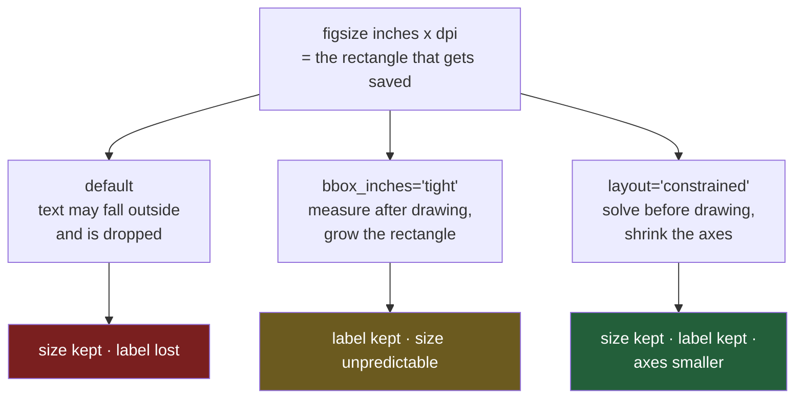

# 5.3 — dpi, and the label that got cut off

## One-line answer

A saved figure is **inches × dpi pixels**, and anything matplotlib drew outside those inches is
simply not in the file: on a 2.6-inch-wide chart the flat's y label sits at x = **−15.1 to −0.8**,
entirely off the left edge, and `savefig` writes the file without a word of complaint.

---

## The story

The flat's chart is finished. Labelled, hatched, printable. Somebody needs to put it in a document —
a form the letting agent has asked for, with a box on page two that says "attach any supporting
evidence".

The box on the form is small, so they make the chart small: two and a bit inches across, which is
about the width of a bank card. They save it, drag it into the document, and send it off.

The chart in the document has bars, numbers up the side, and the four aisle names along the bottom.
What it does not have is the sideways bit of text that says the numbers are pounds per week. It was
there on the screen. It is not there in the file. Nothing went wrong, no error appeared, and the
saved image is exactly two and a bit inches wide as requested — the words were just standing in a
part of the page that got cropped off, and cropping does not announce itself.

Which puts the flat back where [1.1](../01-labels/1.1-the-chart-that-never-said-what-the-numbers-were.md)
started, except worse: the chart now looks like somebody labelled it properly, and it still does not
say what the numbers are.

---

## The idea in plain language

A matplotlib figure has a size in **inches**. You choose it with `figsize=(width, height)`, and it is
a physical size, not a number of pixels: `figsize=(2.6, 1.8)` means a rectangle 2.6 inches wide and
1.8 inches tall.

Pixels come from **dpi**, which stands for dots per inch and is the number of pixels the figure gets
for each of its inches. The arithmetic is exactly what it sounds like: 2.6 inches at 100 dpi is 260
pixels, and the same figure at 300 dpi is 780. Same drawing, same physical size, three times as many
dots describing it. That is what makes a chart look crisp on paper and blurry when it does not.

The thing that catches people is that **inches are the boundary, not a suggestion**. The axes — the
box the bars are drawn in, from
[Day 36, 1.1](../../../day-36-figure-and-axes/parts/01-the-two-objects/1.1-the-paper-and-the-frame.md)
— sits inside those inches, and so do the tick labels, the axis labels and the title, if there is
room. If there is not room, matplotlib still draws them. It just draws them at negative coordinates,
outside the rectangle it is going to save, and then saves the rectangle.

There are two ways out and they are genuinely different. `bbox_inches="tight"` measures everything
that got drawn *after* drawing it, then grows the saved area until it all fits. `layout="constrained"`
works out how much room the text needs *before* drawing, then shrinks the axes so that everything
fits inside the size you asked for. The first keeps your text and changes your size. The second keeps
your size and changes where the axes sits. For one chart it rarely matters. For a pack of eight
charts that have to look like a set, it decides the whole thing.

---

## Why Setu needs it

- **[5.1](5.1-the-greyscale-test-you-can-run.md)** reads pixels out of a saved file to measure
  greyscale separation. Every one of those measurements assumes the file contains what you think it
  contains, and this part is why that assumption needs checking.
- **[5.2](5.2-hatch-and-marker-instead-of-colour.md)** measured hatch strokes per bar and found three
  at one inch and one at a quarter of an inch. That was a size effect, and size is this part.
- **[8.1](../08-the-module/8.1-the-charts-module.md)** carries `PRINT_DPI` as a module constant, so
  that no chart in the project picks its own resolution.
- **[8.2](../08-the-module/8.2-the-test-that-can-go-red.md)** asserts on a saved figure, which means
  the test itself depends on the save being complete.
- **Day 41** is the gate: eight charts as one pack. Eight charts saved with `bbox_inches="tight"`
  come out eight different sizes, which is measured below and is the reason the gate pins the size
  instead.

---

## The mechanism

The same four bars as always, on a chart small enough to fit the letting agent's box:

```python
import os

import matplotlib
import numpy as np
import pandas as pd
from PIL import Image

matplotlib.use("Agg")
import matplotlib.pyplot as plt


def weekly_spend() -> pd.DataFrame:
    """Twelve weeks of the flat's shopping, four aisles, in pounds."""
    rng = np.random.default_rng(37)
    columns = {}
    steady = [("bakery", 9.0, 1.5), ("dairy", 18.0, 2.0), ("produce", 22.0, 2.5)]
    for aisle, centre, spread in steady:
        columns[aisle] = np.round(rng.normal(centre, spread, 12), 2)
    household = np.empty(12)
    household[0::2] = rng.normal(5.0, 1.0, 6)
    household[1::2] = rng.normal(37.5, 3.0, 6)
    columns["household"] = np.round(household, 2)
    return pd.DataFrame(columns, index=pd.RangeIndex(1, 13, name="week"))


means = weekly_spend().mean().round(2)


def build(ylabel="mean weekly spend (£)"):
    fig, ax = plt.subplots(figsize=(2.6, 1.8))
    ax.bar(means.index, means.to_numpy())
    ax.set_xlabel("aisle")
    ax.set_ylabel(ylabel)
    return fig, ax


fig, ax = build()
fig.canvas.draw()
label_box = ax.yaxis.get_label().get_window_extent()
print(f"figure is {fig.bbox.width} px wide at dpi={fig.dpi}")
print(f"y label sits at x = {label_box.x0:.1f} to {label_box.x1:.1f}")
print(f"inside the figure? {label_box.x0 >= 0}")
```

**Line by line:**

- `figsize=(2.6, 1.8)` is the letting agent's box, in inches. Note that there is no `layout=` here,
  on purpose: this is the default arrangement, which places the axes at a fixed fraction of the
  figure and lets the text land wherever it lands.
- `def build(ylabel=...)` exists because we are about to draw this chart six or seven times with one
  thing changed each time. Building it in one place is the only way to be sure the comparisons are
  comparisons.
- `fig.canvas.draw()` forces a render. Until something is actually drawn, matplotlib does not know
  how wide a piece of text is — text width depends on the font, and the font is the renderer's
  business. Ask for a position before drawing and you get a stale or empty answer.
- `ax.yaxis.get_label()` is the sideways `Text` object, distinct from the tick labels, which belong
  to the ticks. `get_window_extent()` returns its rectangle in **display pixels**, measured from the
  bottom left of the figure.
- `label_box.x0 >= 0` is the whole check. `x0` is the left edge of the text. If it is negative, part
  or all of the label is to the left of the figure, and a saved file will not contain it.

```text
figure is 260.0 px wide at dpi=100.0
y label sits at x = -15.1 to -0.8
inside the figure? False
```

The label is **entirely** outside: both edges are negative, so not one pixel of it is in the figure.
Now save the same figure four ways and look at what came out.

```python
for name, options in [
    ("default", {}),
    ("tight", {"bbox_inches": "tight"}),
    ("dpi=300", {"dpi": 300}),
    ("dpi=300, tight", {"dpi": 300, "bbox_inches": "tight"}),
]:
    fig, ax = build()
    path = "out_" + name.replace("=", "").replace(", ", "_") + ".png"
    fig.savefig(path, **options)
    image = Image.open(path)
    dark = int((np.asarray(image.convert("L")) < 128).sum())
    print(f"{name:16s} {str(image.size):12s} {os.path.getsize(path):8d} bytes  {dark:7d} dark px")
    plt.close(fig)
```

**Line by line:**

- `{}` for the default case is the version everybody writes first: `fig.savefig(path)`, no keywords,
  every decision left to whatever the library happens to prefer.
- `bbox_inches="tight"` is the string `"tight"` and nothing else. It is not a number and not a
  boolean, and it is one of the easiest keywords in matplotlib to misspell, which is the second
  failure under *When it breaks*.
- `dpi=300` overrides the figure's own dpi for this save only. The figure object still thinks it is
  100 dpi; only the file changes.
- `image.size` is Pillow's `(width, height)` in pixels — the actual dimensions of the actual file,
  read back off disk rather than predicted.
- `(np.asarray(image.convert("L")) < 128).sum()` counts every pixel darker than mid-grey. It is a
  crude measure of "how much text and drawing is in this file", and it is the one number that can
  tell you a missing label came back, because letters are made of dark pixels and nothing else in
  this chart moved.

```text
default          (260, 180)         4949 bytes    17897 dark px
tight            (277, 215)         8605 bytes    18620 dark px
dpi=300          (780, 540)        16895 bytes   160763 dark px
dpi=300, tight   (831, 644)        32103 bytes   165916 dark px
```

Read that table one column at a time.

**The pixel dimensions.** `default` is 260 × 180, which is exactly 2.6 × 100 and 1.8 × 100. `dpi=300`
is 780 × 540, exactly 2.6 × 300 and 1.8 × 300. The arithmetic is `inches × dpi`, with nothing else in
it, whenever `bbox_inches` is left alone.

**The `tight` rows are bigger than the arithmetic says.** 277 × 215 instead of 260 × 180. That extra
17 pixels of width and 35 of height is the room matplotlib had to add to fit the text that was
hanging outside, plus a small default padding. The size you asked for was not the size you got.

**The dark pixel count is the label coming back.** `default` has 17,897 dark pixels; `tight` has
18,620. Those 723 extra dark pixels are the strokes of the words "mean weekly spend (£)", which were
drawn both times and saved only once. At 300 dpi the same difference is 5,153 pixels, because the
letters are three times as big in each direction.

**File size is not free.** Tripling dpi took the file from 4,949 bytes to 16,895, and adding `tight`
on top took it to 32,103 — six and a half times the default. One chart, so who cares; the Day 41
pack is eight charts, and a dashboard regenerating them on every page load cares a great deal.

Now the reason a figure pack does not use `tight`. Same figure size, same everything, three different
y labels:

```python
for ylabel in ["spend", "mean weekly spend (£)", "mean weekly spend per aisle, pounds"]:
    fig, ax = build(ylabel)
    fig.savefig("t.png", bbox_inches="tight")
    print(f"  {ylabel!r:40s} -> {Image.open('t.png').size}")
    plt.close(fig)
```

**Line by line:**

- The three labels are short, medium and long, and **nothing else changes** — same `figsize`, same
  data, same bars, same x label.
- `{ylabel!r}` prints the string with its quotes, so that a trailing space or an odd character would
  be visible rather than silently trimmed by the terminal.
- The y label is drawn rotated, so its text runs **vertically**. That is the detail that makes the
  next result surprising, and it is worth predicting before you read it.

```text
  'spend'                                  -> (277, 202)
  'mean weekly spend (£)'                  -> (277, 215)
  'mean weekly spend per aisle, pounds'    -> (277, 286)
```

The **height** changed, from 202 to 286 pixels, because the label is sideways: a longer label is a
taller label, and `tight` grew the canvas upwards and downwards to hold it. Three charts that were
all asked to be 1.8 inches tall came out three different heights. Put them side by side in a document
and they do not line up, and the reason is a word.

The other way round:

```python
for ylabel in ["spend", "mean weekly spend (£)", "mean weekly spend per aisle, pounds"]:
    fig, ax = plt.subplots(figsize=(2.6, 1.8), layout="constrained")
    ax.bar(means.index, means.to_numpy())
    ax.set_xlabel("aisle")
    ax.set_ylabel(ylabel)
    fig.savefig("c.png", dpi=100)
    fig.canvas.draw()
    box = ax.yaxis.get_label().get_window_extent()
    print(f"  {ylabel!r:40s} -> {Image.open('c.png').size}  y label x0={box.x0:.1f}")
    plt.close(fig)
```

**Line by line:**

- `layout="constrained"` is the only change from `build()`. It asks matplotlib to solve for the axes
  position given how much room the decorations need, before anything is drawn.
- `figsize` and `dpi` are both stated, so the output size is fully determined by things you typed.
- `box.x0` is printed as well as the size, because "the file is the right size" and "the label is
  inside it" are two separate claims and both have to hold.

```text
  'spend'                                  -> (260, 180)  y label x0=4.2
  'mean weekly spend (£)'                  -> (260, 180)  y label x0=4.2
  'mean weekly spend per aisle, pounds'    -> (260, 180)  y label x0=4.2
```

Three identical sizes, and `x0 = 4.2` every time — the label is 4.2 pixels in from the left edge,
inside the file, in all three cases. Constrained layout kept the promise the `figsize` made and paid
for it by making the bars slightly narrower. That is the right trade for a pack.

Where each option acts:



---

## When it breaks

**A file extension matplotlib does not write:**

```text
$ uv run python -c "
import matplotlib
matplotlib.use('Agg')
import matplotlib.pyplot as plt
fig, ax = plt.subplots()
ax.bar(['a'], [1])
fig.savefig('chart.wmf')
"
```

```text
ValueError: Format 'wmf' is not supported (supported formats: avif, eps, gif, jpeg, jpg,
pdf, pgf, png, ps, raw, rgba, svg, svgz, tif, tiff, webp)
```

**What it means.** The format comes from the filename's extension unless you pass `format=`
yourself. The error is a good one because it lists every format the current backend can produce, so
it doubles as documentation. Note what is on that list: `pdf` and `svg`, which have no dpi at all
because they store instructions rather than dots, and `png`, which is the one to test with for the
reason in [5.1](5.1-the-greyscale-test-you-can-run.md).

**The smallest fix** is to pick from the list. For a document, `pdf` or `svg`; for anything you are
going to measure, `png`.

**A keyword spelled almost right:**

```text
$ uv run python -c "
import matplotlib
matplotlib.use('Agg')
import matplotlib.pyplot as plt
fig, ax = plt.subplots()
ax.bar(['a'], [1])
fig.savefig('chart.png', bbox_inches='tigth')
"
```

```text
Traceback (most recent call last):
  File ".../matplotlib/backend_bases.py", line 2276, in print_figure
    restore_bbox = _tight_bbox.adjust_bbox(
  File ".../matplotlib/_tight_bbox.py", line 59, in adjust_bbox
    fig.bbox_inches = Bbox.from_bounds(0, 0, *bbox_inches.size)
                                              ^^^^^^^^^^^^^^^^
AttributeError: 'str' object has no attribute 'size'
```

**What it means.** This is the nastiest error in the part, because nothing in it mentions your typo.
`bbox_inches` accepts either the string `"tight"` or a `Bbox` object, so matplotlib checks whether
your value is the string `"tight"`, decides it is not, and treats it as a `Bbox` — at which point it
asks a `str` for its `.size` and gets an `AttributeError` four frames deep in a file you have never
opened. The word `'tigth'` appears nowhere in the traceback.

**The smallest fix** is to never type the string at a call site. Put it in the one function that
saves figures — `PRINT_DPI` and `BBOX` live together in
[8.1](../08-the-module/8.1-the-charts-module.md) — and the typo can only be made once.

**A dpi that is not a resolution:**

```text
$ uv run python -c "
import matplotlib
matplotlib.use('Agg')
import matplotlib.pyplot as plt
fig, ax = plt.subplots()
ax.bar(['a'], [1])
fig.savefig('chart.png', dpi=0)
"
```

```text
ValueError: dpi must be positive
```

**What it means.** Zero dots per inch is zero pixels, and the renderer refuses to allocate an image
with no area. This one usually arrives as `dpi=some_variable` where the variable came from a config
file, an environment variable or a division, and the real bug is upstream. The error is short and
correct and tells you nothing about where the zero came from, which is the argument for validating
configuration where it is read rather than where it is used.

---

## In production

**What a professional writes instead of the teaching version.** Never a bare `fig.savefig(path)`
scattered through a script. One function, with the policy in it:

```python
from pathlib import Path

PRINT_DPI = 300
SCREEN_DPI = 100
FIGSIZE = (6.0, 3.5)


def save_figure(fig, path: Path, *, dpi: int = PRINT_DPI) -> Path:
    """Save a figure at a pinned size, refusing to write one that is clipped."""
    fig.set_size_inches(*FIGSIZE)
    fig.canvas.draw()
    width, height = fig.bbox.width, fig.bbox.height
    for axes in fig.axes:
        for text in (axes.title, axes.xaxis.get_label(), axes.yaxis.get_label()):
            box = text.get_window_extent()
            if box.x0 < 0 or box.y0 < 0 or box.x1 > width or box.y1 > height:
                raise ValueError(
                    f"{text.get_text()!r} is outside the figure "
                    f"(x {box.x0:.1f}..{box.x1:.1f}, figure is {width:.0f} wide) - "
                    f"use layout='constrained' rather than bbox_inches='tight'"
                )
    fig.savefig(path, dpi=dpi)
    return path


on_screen = FIGSIZE[0] * SCREEN_DPI
in_print = FIGSIZE[0] * PRINT_DPI
print(f"a {FIGSIZE[0]} inch figure is {on_screen:.0f} px on screen, {in_print:.0f} px in print")
```

**Line by line:**

- `PRINT_DPI` and `SCREEN_DPI` are named constants because a bare `300` in a call is a number nobody
  can question. Named, it is a decision, and a reviewer can ask whether it is the right one.
- `fig.set_size_inches(*FIGSIZE)` pins the size at save time rather than trusting whoever built the
  figure. Every chart in a pack ends up the same shape whatever the caller did.
- `fig.canvas.draw()` before measuring, for the reason established above: text has no width until it
  has been rendered.
- The loop walks `title`, the x label and the y label of every axes on the figure. Tick labels are
  deliberately left out, because they move with the axes and constrained layout already handles
  them; the three that get clipped in practice are these.
- The four comparisons check all four edges, not just the left one. A title clips off the **top** by
  the same mechanism, and a long x tick label clips off the bottom, so checking only `x0` catches a
  third of the problem.
- The error message **names the offending text and suggests the fix**, because the person who hits
  this is usually not the person who wrote the check. An exception that says "clipped" and stops is
  half a tool.
- `fig.savefig(path, dpi=dpi)` with no `bbox_inches`. That is the point of the whole function: the
  size is a promise, so nothing is allowed to change it silently.

**Choosing a dpi is arithmetic, not taste.** Decide the physical width first, then multiply. A chart
that will be printed 6 inches wide at 300 dpi needs 1,800 pixels. The same chart shown 6 inches wide
on a laptop needs about 600. A slide is somewhere between. What you must not do is pick a dpi because
it "looks sharper" — that just makes a bigger file at the same physical size, and on a printed page
past the printer's own resolution it makes no difference at all except to the file size, which the
table above measured going from 4,942 bytes to 32,140.

**What degrades at scale.** `bbox_inches="tight"` is a second render: matplotlib draws the figure,
measures everything, resizes and draws again. That roughly doubles the cost of a save, which is
invisible for one chart and very visible for a service generating charts per request. It also makes
the output size depend on the *data*, because a longer category name is a wider tick label — so a
chart that has been 277 pixels wide for six months becomes 340 the week a new category appears with a
long name, and whatever consumes those images has to cope.

**The failure that only shows with real data.** A reporting job saved every chart with
`bbox_inches="tight"` and pasted them into a fixed-width template. It was fine for a year, because
the category names were short codes. Then the source system started returning full descriptive names,
the charts got wider, the template scaled them down to fit, and every axis label in the report became
too small to read — at every size, on every chart, silently, with no error anywhere. Nothing had
changed in the reporting code.

**The review comment a senior engineer leaves.** *"`bbox_inches='tight'` means this chart's size
depends on its longest label, so the eight charts in the pack will not line up. Pin `figsize`, use
constrained layout, and assert that the axis labels are inside the figure before saving — that is a
one-line check and it is the exact bug we shipped last quarter."*

**The interview question.** *"You saved a chart and a label is missing. Walk me through it."* The
answer that shows you have done this names the mechanism rather than the remedy: the figure's size in
inches is the boundary of the saved file, matplotlib draws text outside that boundary without
complaining, and `savefig` writes the boundary. The follow-up is *"so use `bbox_inches='tight'`?"*,
and the answer worth having is that it fixes this file and breaks the set, because it makes the
output size a function of the label text — which is why a figure pack pins the size and shrinks the
axes instead.

---

## Check yourself

```bash
uv run --with 'matplotlib==3.11.1' python -c "
import matplotlib
matplotlib.use('Agg')
import matplotlib.pyplot as plt
for layout in (None, 'constrained'):
    fig, ax = plt.subplots(figsize=(2.6, 1.8), layout=layout)
    ax.bar(['bakery', 'dairy', 'produce', 'household'], [8.84, 18.01, 21.62, 21.64])
    ax.set_ylabel('mean weekly spend (GBP)')
    fig.canvas.draw()
    box = ax.yaxis.get_label().get_window_extent()
    print(f'layout={layout!s:12s} y label x0={box.x0:6.1f}  inside={box.x0 >= 0}')
"
```

Two lines, one `False` and one `True`. Say what constrained layout gave up in order to turn the first
into the second, and where on the chart you would see it.

**Answer out loud, without scrolling up:**

> Give the arithmetic that turns a `figsize` and a `dpi` into the pixel size of a PNG. Then say why a
> pack of eight charts should not be saved with `bbox_inches="tight"`, in one sentence, without using
> the word "unpredictable".

---

**Next:** [6.1 — Position, length, and angle](../06-what-the-eye-compares/6.1-position-length-and-angle.md).
