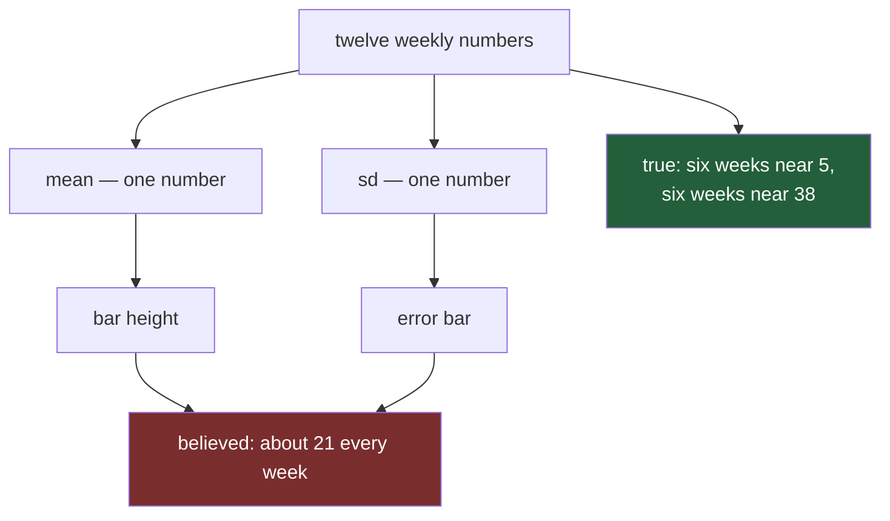

# 7.1 — The bar that lied

## One-line answer

A bar chart of an average draws one number per column and therefore **claims that one number
describes the column** — and when the column is £5 one week and £39 the next, the bar is
arithmetically perfect and factually false.

---

## The story

The chart from [1.1](../01-labels/1.1-the-chart-that-never-said-what-the-numbers-were.md) is fixed
now. It has an x label, a y label with the unit in it, money on the ticks and a title that says
something. Sections 1 to 5 of this day were all spent on that. Somebody posts the finished version to
the flat's group chat, and this time nobody asks "22 what?".

Instead somebody reads it and says: **"so household and produce cost us about the same."**

The bars agree. Produce is £21.62 tall and household is £21.64 tall, and side by side they are the
same bar twice.

Then the flatmate who actually does the big shop says: "that's not right. Most weeks I spend about a
fiver on household. The other weeks I spend forty."

Both of them are looking at the same picture, and neither has made a mistake. The number 21.64 really
is the average of the twelve household weeks. It is also a number that has never once appeared on a
receipt — no week's household shop came anywhere near £21. The bar is standing exactly where nothing
happened.

That is the failure this section is named after. Nobody typed a wrong number and nobody chose a
misleading scale. The chart is honest about the arithmetic it was given, and it still leaves the
reader with a false belief, because of what a bar chart *is*.

---

## The idea in plain language

Every chart makes a **claim** — a statement about the world that a reader will walk away believing.
The claim is not written anywhere. It comes from the shape you chose.

A **bar chart** is a row of rectangles, one per category, each as tall as its number. Its claim is
short: *this category has this value.* One category, one value, one height. That is what the eye
takes from it, and [6.1](../06-what-the-eye-compares/6.1-position-length-and-angle.md) is the reason
the eye takes it so confidently — length on a common baseline is the second-most accurately read
encoding there is, so a reader trusts a bar chart more than almost anything else you could draw.

Now look at what you fed it. A **mean**, or average, is what you get by adding up a column of numbers
and dividing by how many there are — the reduction from
[Day 23, 2.1](../../../day-23-ufuncs-and-statistics/parts/02-statistics/2.1-a-reduction-turns-many-into-one.md).
Twelve numbers went in and one came out. Eleven were destroyed to make it, and a bar chart has no way
of saying so.

So the honest way to read the household bar is: *the twelve household weeks, added up and divided by
twelve, come to 21.64.* The way a reader actually reads it is: *household costs about £21 a week.*
The first is true. The second is false. The gap between them is the whole part.

How far apart a column's values are is its **spread**. The measure used here is the **standard
deviation**, written `sd` — roughly, the typical distance between a value and the mean of its column,
defined in
[Day 23, 2.3](../../../day-23-ufuncs-and-statistics/parts/02-statistics/2.3-std-var-and-ddof.md).
Produce's sd is about £2 and household's is about £18. Two columns with the same mean and a ninefold
difference in spread draw the same bar, because a bar has room for exactly one number.

Here is the rule that comes out of it, and it is worth saying in one sentence:

> **A bar chart of a summary is only as true as the claim that the summary describes the column.**

Sometimes it does. Bakery, dairy and produce are steady, and a bar of their means is a perfectly good
chart. Household is not steady, and for household the same chart is a lie told by accident.

---

## Why Setu needs it

- **[7.2](7.2-the-box-plot-that-did-not.md)** is the chart that survives this. Same four columns,
  same data, and household comes out looking like what it is.
- **[7.3](7.3-line-scatter-and-what-each-claims.md)** asks the same question of a line and a scatter:
  what does the shape claim, over and above the numbers in it?
- **[7.4](7.4-the-chart-decision-table.md)** turns "what does this shape claim" into a table you read
  before you draw, rather than a regret you have after.
- **[8.1](../08-the-module/8.1-the-charts-module.md)** puts the check in code, so a bar of a mean is
  something the module can refuse rather than something a reviewer has to spot.
- **Day 41** is this phase's gate: an eight-chart pack, which is enough charts that at least one will
  be a bar of a mean over a column nobody looked at first.

---

## The mechanism

The flat's twelve weeks, built from one seed so that your numbers and this page's numbers are the
same. This is the `weekly_spend()` from
[1.1](../01-labels/1.1-the-chart-that-never-said-what-the-numbers-were.md), unchanged:

```python
import matplotlib
import numpy as np
import pandas as pd

matplotlib.use("Agg")
import matplotlib.pyplot as plt


def weekly_spend() -> pd.DataFrame:
    """Twelve weeks of the flat's shopping, four aisles, in pounds."""
    rng = np.random.default_rng(37)
    columns = {}
    steady = [("bakery", 9.0, 1.5), ("dairy", 18.0, 2.0), ("produce", 22.0, 2.5)]
    for aisle, centre, spread in steady:
        columns[aisle] = np.round(rng.normal(centre, spread, 12), 2)
    household = np.empty(12)
    household[0::2] = rng.normal(5.0, 1.0, 6)
    household[1::2] = rng.normal(37.5, 3.0, 6)
    columns["household"] = np.round(household, 2)
    return pd.DataFrame(columns, index=pd.RangeIndex(1, 13, name="week"))


spend = weekly_spend()
summary = pd.DataFrame(
    {
        "mean": spend.mean(),
        "sd": spend.std(),
        "min": spend.min(),
        "max": spend.max(),
    }
).round(2)
print(summary.to_string())
```

**Line by line:**

- `matplotlib.use("Agg")` before `import matplotlib.pyplot` picks the backend that writes files and
  never opens a window, exactly as in
  [1.1](../01-labels/1.1-the-chart-that-never-said-what-the-numbers-were.md). It has to come first,
  because importing `pyplot` chooses a backend if none has been chosen yet.
- `np.random.default_rng(37)` is the seeded generator from
  [Day 20, 4.1](../../../day-20-arrays-and-dtypes/parts/04-random/4.1-default-rng-the-generator.md).
  Same seed, same twelve weeks, on every machine.
- `household[0::2]` and `household[1::2]` fill alternate slots — every other week is a quiet £5 and
  the weeks between are a £37.50 restock. That is the shape the whole day turns on.
- `pd.DataFrame({...})` here builds a **summary table**, one row per aisle and one column per
  statistic. Putting `mean` and `sd` side by side is the entire diagnosis, and it costs one line.
- `spend.std()` divides by `n - 1` rather than `n` by default — the `ddof=1` convention explained in
  [Day 23, 2.3](../../../day-23-ufuncs-and-statistics/parts/02-statistics/2.3-std-var-and-ddof.md).
  It does not change the story here, but you should know which one you printed.
- `.to_string()` prints the whole frame rather than the truncated repr pandas uses on a wide frame.

```text
            mean     sd    min    max
bakery      8.84   1.97   5.16  11.24
dairy      18.01   1.57  15.32  20.24
produce    21.62   2.15  18.29  26.71
household  21.64  17.92   3.32  44.06
```

Read the last two rows against each other. **The means differ by two pence; the standard deviations
differ by a factor of eight.** Produce lives between £18.29 and £26.71, household between £3.32 and
£44.06.

Now the chart, and a measurement of what it drew:

```python
means = spend.mean()
fig, ax = plt.subplots(figsize=(6, 3.5), layout="constrained")
bars = ax.bar(means.index, means.to_numpy())
ax.set_ylim(bottom=0)
ax.set_xlabel("aisle")
ax.set_ylabel("mean weekly spend (£)")
fig.canvas.draw()

pixels = {
    name: patch.get_window_extent().height
    for name, patch in zip(means.index, bars.patches, strict=True)
}
for name in means.index:
    print(f"{name:10s} value {means[name]:6.2f}   bar {pixels[name]:6.1f} px")
print("produce / household, in values:", round(means["produce"] / means["household"], 4))
print("produce / household, in pixels:", round(pixels["produce"] / pixels["household"], 4))
print("the two bars differ by", round(abs(pixels["produce"] - pixels["household"]), 2), "px")
```

**Line by line:**

- `ax.bar(means.index, means.to_numpy())` draws one rectangle per aisle, with `.to_numpy()` handing
  the heights over as a plain array so matplotlib never has to guess what a pandas object means.
- `ax.set_ylim(bottom=0)` is stated on purpose, not left to the default. A bar encodes **length**, so
  its baseline has to be zero or the lengths stop being proportional to the values — that is
  [2.4](../02-ticks-and-limits/2.4-the-axis-that-started-above-zero.md), and this part inherits it.
- `fig.canvas.draw()` forces the figure to be laid out. Until something draws, the rectangles have no
  position on any page, so asking for their size in pixels has no answer yet.
- `patch.get_window_extent()` returns the rectangle's box in **display coordinates** — pixels on the
  rendered figure. `bars.patches` lists the rectangles in drawing order, which is `means.index`.
- `strict=True` on `zip` makes Python raise if the two sequences are different lengths instead of
  silently stopping at the shorter one. Four names and four rectangles is an assumption, and this is
  the cheapest way to assert it.
- The two ratios sit next to each other deliberately. A chart is only honest if the pixel ratio
  matches the value ratio, and here it does — which is the uncomfortable part.

```text
bakery     value   8.84   bar  115.9 px
dairy      value  18.01   bar  235.9 px
produce    value  21.62   bar  283.3 px
household  value  21.64   bar  283.5 px
produce / household, in values: 0.9992
produce / household, in pixels: 0.9992
the two bars differ by 0.23 px
```

**A quarter of a pixel.** No screen or printer can show that, and no eye could read it if they could.
The chart says "equal", the arithmetic says "equal", and the flat's experience of the two aisles
could hardly be more different.

Here is the number that makes the lie concrete:

```python
for name in means.index:
    col = spend[name]
    gap = (col - col.mean()).abs()
    print(
        f"{name:10s} mean {col.mean():6.2f}"
        f"   nearest real week {gap.min():6.2f} away"
        f"   weeks within 2.00 of the mean: {int((gap <= 2.0).sum()):2d}/12"
    )
```

**Line by line:**

- `(col - col.mean()).abs()` is the distance from every week to that column's own mean. Subtracting a
  single number from a column is broadcasting
  ([Day 22, 1.1](../../../day-22-broadcasting-and-shape/parts/01-broadcasting/1.1-adding-one-number-to-every-day.md)),
  and `.abs()` drops the sign because "£13 below" and "£13 above" are equally far away.
- `gap.min()` answers the question a bar chart never asks: **how close does the real data ever get to
  the height I drew?**
- `(gap <= 2.0).sum()` counts the weeks within two pounds of the mean. `2.0` is a judgement, not a
  law — roughly "close enough that a person would call it the same shop". State such a number out
  loud, because a reader has to be able to disagree with it.
- `int(...)` because `.sum()` on a boolean column returns a numpy integer, and `:2d` on that is
  tidier than printing `np.int64(0)`.

```text
bakery     mean   8.84   nearest real week   0.53 away   weeks within 2.00 of the mean:  8/12
dairy      mean  18.01   nearest real week   0.02 away   weeks within 2.00 of the mean: 10/12
produce    mean  21.62   nearest real week   0.20 away   weeks within 2.00 of the mean:  9/12
household  mean  21.64   nearest real week  13.12 away   weeks within 2.00 of the mean:  0/12
```

**Zero weeks out of twelve.** The nearest household ever came to its own mean was £13.12 away.
Dairy's mean is two pence from a real week; household's is a place the data has never been.

The obvious repair is error bars. They help; they do not fix it:

```python
sds = spend.std()
fig2, ax2 = plt.subplots(figsize=(6, 3.5), layout="constrained")
ax2.bar(means.index, means.to_numpy(), yerr=sds.to_numpy(), capsize=4)
ax2.set_ylim(bottom=0)
for name in ("produce", "household"):
    lo = means[name] - sds[name]
    hi = means[name] + sds[name]
    inside = int(spend[name].between(lo, hi).sum())
    print(f"{name:10s} bar +/- 1 sd covers {lo:6.2f} to {hi:6.2f}   weeks inside: {inside:2d}/12")
print("household min and max were", spend["household"].min(), "and", spend["household"].max())
print("weeks anywhere between 6.00 and 34.00:", int(spend["household"].between(6, 34).sum()))
```

**Line by line:**

- `yerr=sds.to_numpy()` adds a vertical whisker to each bar, running one standard deviation above and
  below the top. The order of `sds` must match the order of the bars, and *When it breaks* below is
  entirely about what happens when it does not.
- `capsize=4` puts a short horizontal cap on each end of the whisker, in points. Without it the ends
  of the whisker are hard to locate against the bar's edge.
- `spend[name].between(lo, hi)` gives a boolean column, `True` where the week falls inside the
  whisker. Counting it turns "the error bar looks about right" into a number.
- The last line asks whether any week landed in the middle of household's range at all. `6.00` to
  `34.00` is the empty middle between the quiet weeks and the restock weeks, read off the sorted
  values rather than guessed.

```text
produce    bar +/- 1 sd covers  19.48 to  23.77   weeks inside:  9/12
household  bar +/- 1 sd covers   3.72 to  39.56   weeks inside:  8/12
household min and max were 3.32 and 44.06
weeks anywhere between 6.00 and 34.00: 0
```

The error bar on household is enormous, and that is the good news — a reader who notices it knows
something is wrong with the bar beneath it. But look at what it claims. It draws a band from £3.72 to
£39.56 and says nothing about the shape inside that band, so a reader assumes the values are
scattered through it. **Not one week fell between £6 and £34.** Household is two clumps with a hole
in the middle, and an error bar cannot draw a hole.



Eleven of the twelve numbers were thrown away before the drawing started, and no amount of care in
the drawing can put them back.

---

## When it breaks

**The error bars that did not match the bars:**

```text
$ uv run python -c "
import matplotlib
matplotlib.use('Agg')
import matplotlib.pyplot as plt
means = [8.84, 18.01, 21.62, 21.64]
sds = [1.97, 1.57, 2.15]
fig, ax = plt.subplots()
ax.bar(['bakery', 'dairy', 'produce', 'household'], means, yerr=sds)
"
Traceback (most recent call last):
  File "<string>", line 8, in <module>
  File "C:\Users\...\.venv\Lib\site-packages\matplotlib\__init__.py", line 1528, in inner
    return func(
           ^^^^^
  File "C:\Users\...\.venv\Lib\site-packages\matplotlib\axes\_axes.py", line 2633, in bar
    errorbar = self.errorbar(ex, ey, yerr=yerr, xerr=xerr, fmt='none',
               ^^^^^^^^^^^^^^^^^^^^^^^^^^^^^^^^^^^^^^^^^^^^^^^^^^^^^^^
  File "C:\Users\...\.venv\Lib\site-packages\matplotlib\axes\_axes.py", line 4217, in errorbar
    raise ValueError(
ValueError: 'yerr' (shape: (3,)) must be a scalar or a 1D or (2, n) array-like whose shape matches 'y' (shape: (4,))
```

**What it means.** Four bars, three error values. `ax.bar` hands `yerr` straight to `ax.errorbar`,
which compares shapes and refuses. This is the friendly version of the mistake, because it stops.

**The smallest fix** is to build both from the same frame — `spend.mean()` and `spend.std()` — so the
lengths cannot drift apart.

**The same mistake, silent.** Now the version that does not stop:

```text
$ uv run python -c "
... spend = weekly_spend() ...
means = spend.mean()
sds = spend.std().sort_values()
fig, ax = plt.subplots()
ax.bar(means.index, means.to_numpy(), yerr=sds.to_numpy(), capsize=4)
print('bar order :', list(means.index))
print('yerr order:', list(sds.index))
for name, err in zip(means.index, sds.to_numpy(), strict=True):
    print(f'  bar {name:10s} drew an error bar of {err:5.2f}; its own sd is {spend[name].std():5.2f}')
"
bar order : ['bakery', 'dairy', 'produce', 'household']
yerr order: ['dairy', 'bakery', 'produce', 'household']
  bar bakery     drew an error bar of  1.57; its own sd is  1.97
  bar dairy      drew an error bar of  1.97; its own sd is  1.57
  bar produce    drew an error bar of  2.15; its own sd is  2.15
  bar household  drew an error bar of 17.92; its own sd is 17.92
```

**What it means.** `sort_values()` reordered the standard deviations and `.to_numpy()` threw the
aisle names away, so matplotlib received four numbers in an order nobody checked. Bakery and dairy
swapped error bars. There is no exception and no warning, and the two swapped values are close enough
that no reader would suspect. This is the alignment trap of
[Day 28, 4.1](../../../day-28-selection-and-alignment/parts/04-alignment/4.1-two-lists-different-items.md),
arriving through a chart instead of an arithmetic operator.

**The smallest fix** is to reorder both series with the same index before either becomes an array:
`sds = spend.std()[means.index]`. Better still, do not sort the spreads at all — the bars are in
aisle order, so anything drawn on them must be too.

---

## In production

**What a professional writes instead of the teaching version.** Not "remember to check the spread",
which nobody remembers for long. A function that refuses:

```python
MEAN_GAP_LIMIT = 0.10


class ChartError(ValueError):
    """The chart would have claimed something the numbers do not support."""


def mean_gap(column: pd.Series) -> float:
    """How far the mean sits from the nearest real observation, as a share of the range."""
    span = column.max() - column.min()
    if span == 0:
        return 0.0
    return float((column - column.mean()).abs().min() / span)


def check_mean_is_describable(frame: pd.DataFrame) -> None:
    """Raise if any column's mean lands in a place the column never visits."""
    hollow = {
        name: round(mean_gap(frame[name]), 3)
        for name in frame.columns
        if mean_gap(frame[name]) > MEAN_GAP_LIMIT
    }
    if hollow:
        raise ChartError(
            f"a bar of the mean would misdescribe {sorted(hollow)}; "
            f"mean gap {hollow} exceeds {MEAN_GAP_LIMIT}"
        )
```

**Line by line:**

- `MEAN_GAP_LIMIT = 0.10` is a **policy constant**, not a discovered truth: "if the mean sits further
  than a tenth of the column's range from any real value, stop". Naming it at module level lets a
  reviewer argue with the number instead of with the code.
- `ChartError(ValueError)` subclasses `ValueError` so existing `except ValueError` handlers keep
  working — the one-base-class-per-project rule from
  [Day 18, 3.1](../../../day-18-exceptions/parts/03-your-own/3.1-one-base-class-per-project.md).
  [8.1](../08-the-module/8.1-the-charts-module.md) imports this rather than defining another.
- `span == 0` returns `0.0` early, because a column where every week is identical has a mean that
  describes it perfectly, and dividing by zero would say the opposite.
- Dividing by the **range** rather than by the standard deviation is deliberate. Household's gap is
  13.12 against an sd of 17.92, which is only 0.73 of an sd and would slip past an sd-based
  threshold; against the range of 40.74 it is 0.32, which is unmissable. A two-clump column inflates
  its own sd, so the sd is the wrong yardstick for catching two-clump columns.
- The dictionary comprehension calls `mean_gap` twice per column, once in the filter and once for the
  value. On four columns that is free; on a wide frame you would compute it once into a variable
  first ([Day 29, 3.2](../../../day-29-iteration-and-order/parts/03-the-measurement/3.2-the-four-ways-timed.md)).
- The message names the columns **and** prints the numbers that failed
  ([Day 18, 3.3](../../../day-18-exceptions/parts/03-your-own/3.3-the-message-is-an-interface.md)).

Run against the flat's frame:

```text
bakery     mean gap 0.088
dairy      mean gap 0.005
produce    mean gap 0.023
household  mean gap 0.322

ChartError: a bar of the mean would misdescribe ['household']; mean gap {'household': 0.322} exceeds 0.1

the three steady aisles pass
```

**What degrades at scale.** At twelve rows you can print the column and see the problem. At ten
million rows nobody prints anything, and the mean is the only thing anyone looks at — which is
exactly when a two-clump column is most likely and least visible. Aggregation hides it on purpose: a
dashboard that groups by month and plots the monthly mean has averaged away every daily pattern
before the chart is even chosen. The defence is to carry a spread statistic alongside every mean from
the moment it is computed, so the chart layer has something to check.

**The failure that only shows with real data.** A team plotted mean response time per service as
bars. One service's bar was mid-height and unremarkable for months. Its traffic was really two
populations: cached requests answering almost instantly, and cache misses slow enough to time out.
The mean sat in the empty gap between them, describing a request that never happened, and every
capacity decision was made against that number. What finally raised it was a customer complaint,
not a chart.

**The review comment a senior engineer leaves.** *"This is a bar chart of a mean. Show me the spread
before I believe the comparison — a box plot beside it, or the mean gap in the caption. Two columns
with the same mean and a ninefold difference in sd must not draw the same bar without a word of
warning."*

**The interview question.** *"When is a bar chart the wrong chart?"* The answer that shows you have
used one: whenever the number on top of the bar is a summary that does not describe what it
summarises. Then give the test rather than the opinion — *how far is that summary from the nearest
value that actually occurred?* If the answer is "a third of the range", the bar is standing in empty
space. The follow-up is usually *"would error bars fix it?"*, and the honest answer is no: error bars
widen the claim, they do not correct it, and they cannot show a hole in the middle of a range. That
is what [7.2](7.2-the-box-plot-that-did-not.md) is for.

---

## Check yourself

```bash
uv run --with 'numpy==2.5.2' python -c "
import numpy as np
rng = np.random.default_rng(37)
h = np.empty(12)
h[0::2] = rng.normal(5.0, 1.0, 6)
h[1::2] = rng.normal(37.5, 3.0, 6)
h = np.round(h, 2)
print('sorted household:', sorted(h))
print('mean            :', round(h.mean(), 2))
print('nearest week    :', round(min(abs(h - h.mean())), 2), 'away')
"
```

The numbers differ from the page on purpose: here the generator draws household **first**, so the
three steady aisles are not consuming their draws. Run it, then say which of the two printed lists is
the one a bar chart would show you.

**Answer out loud, without scrolling up:**

> A bar chart of the mean draws one rectangle per column. State the claim that rectangle makes, and
> name the single measurement that tells you whether the claim is true. Then say why adding error
> bars to the household bar makes the chart more honest without making it correct.

---

**Next:** [7.2 — The box plot that did not](7.2-the-box-plot-that-did-not.md).
