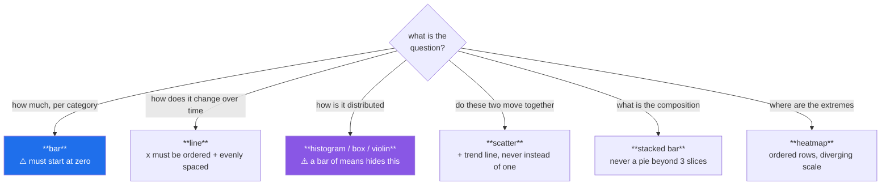

# Day 37 — Customising charts, and choosing the right one

**Phase 5 · Module 5** · IDs: **VIZ-02** (labels, ticks, legends, annotation, saving), **VIZ-03** (chart-type selection)

> **Yesterday:** the object model. Every chart is `fig, ax` and every function returns an Axes.
> **Today:** making a chart *readable* — and the more important half, choosing a chart that does not
> lie. There is a specific bar chart in §4 that misleads while being technically accurate.
> **Tomorrow:** Seaborn and faceting.

```bash
./m start 37 && ./m scaffold 37
```

**Time:** 110 minutes. **Request budget:** 0 model calls.

---

## §1 The story

Two skills today, and the second one matters more.

**Customising** is mechanical: labels, ticks, limits, annotations. Worth learning once, then it is
muscle memory. The bar you should hold yourself to: *a stranger can read the chart with no caption
and no explanation from you.* That means axis labels with units, a title stating the finding rather
than the variables, and the annotation pointing at the thing you want them to see.

**Choosing** is judgement, and it is where charts go wrong. A chart type encodes an assumption about
your data, and picking the wrong one produces something accurate and misleading at once:



The single most common mistake in data science reporting is the one in the purple box: **a bar chart
of group means.** Four groups, four bars, one obviously tallest — and the four distributions might
overlap almost entirely. The bar shows one number and hides the four hundred that produced it. This
is the chart that gets a wrong conclusion into a slide deck, and Day 39 is about the alternatives.

The second most common is a **truncated y-axis on a bar chart**. Bars encode magnitude by *length*,
so starting the axis at 95 makes a 1% difference look like a 10× one. On a line chart, truncating is
often correct, because a line encodes *change*, not magnitude. Same operation; right on one chart type,
dishonest on the other.

---

## §2 Setup — run this

```bash
mkdir -p days/day-37/lab
touch days/day-37/lab/customising.py
```

`src/setu/plots.py` and `tests/test_plots.py` grow today. No new packages.

---

## §3 VIZ-02 — making it readable

`days/day-37/lab/customising.py`:

```python
"""VIZ-02 / VIZ-03: customisation, and the charts that mislead."""

from __future__ import annotations

import matplotlib

matplotlib.use("Agg")

import matplotlib.pyplot as plt  # noqa: E402
import matplotlib.ticker as mticker  # noqa: E402
import numpy as np  # noqa: E402

from setu.arrays import make_rng  # noqa: E402


def labels_and_titles() -> None:
    fig, ax = plt.subplots()
    years = np.arange(2015, 2025)
    citations = np.array([12, 19, 31, 58, 91, 140, 205, 260, 310, 355]) * 1000

    ax.plot(years, citations, marker="o")
    ax.set_xlabel("Year of publication")
    ax.set_ylabel("Cumulative citations")
    ax.set_title("Citations grew 30x in a decade")

    print(f"\n{ax.get_title()=}")
    print("  ^ the title states the FINDING. 'Citations vs year' states the axes,")
    print("    which the axis labels already did.")
    plt.close(fig)


def ticks_and_formatters() -> None:
    fig, ax = plt.subplots()
    values = np.array([1_200_000, 3_400_000, 900_000])
    ax.bar(["NeurIPS", "ICML", "ACL"], values)

    ax.yaxis.set_major_formatter(mticker.FuncFormatter(lambda v, _: f"{v / 1e6:.1f}M"))
    ax.set_ylabel("Citations (millions)")

    print(f"\n{[t.get_text() for t in ax.get_yticklabels()]=}")
    print("  ^ a formatter beats writing '1200000' and hoping. Units go in the LABEL.")

    ax.set_yticks([0, 1e6, 2e6, 3e6, 4e6])
    print(f"{ax.get_yticks().tolist()=}   <- set_yticks fixes them explicitly")
    plt.close(fig)


def long_category_labels() -> None:
    names = ["Conference on Neural Information Processing Systems", "ICML", "ACL"]
    values = [3.4, 2.1, 0.9]

    fig, axes = plt.subplots(1, 2, figsize=(11, 4))
    axes[0].bar(names, values)
    axes[0].set_title("rotated: unreadable")
    axes[0].tick_params(axis="x", rotation=45)

    axes[1].barh(names, values)
    axes[1].set_title("horizontal: readable")

    print("\n  Long category names -> barh. Rotating them is a workaround, not a fix.")
    plt.close(fig)


def limits_scales_and_grid() -> None:
    fig, axes = plt.subplots(1, 2, figsize=(10, 4))
    x = np.arange(1, 100)

    axes[0].plot(x, x**3)
    axes[0].set_title("linear: everything hugs zero")

    axes[1].plot(x, x**3)
    axes[1].set_yscale("log")
    axes[1].set_title("log: the growth is visible")

    for ax in axes:
        ax.grid(True, alpha=0.3, linewidth=0.5)
        ax.set_axisbelow(True)

    print(f"\n{axes[1].get_yscale()=}")
    print("  set_axisbelow(True): grid lines go BEHIND the data. Always.")
    plt.close(fig)


def annotation_is_the_point() -> None:
    rng = make_rng(0)
    days = np.arange(60)
    latency = rng.normal(120, 8, 60)
    latency[41:] += 45

    fig, ax = plt.subplots()
    ax.plot(days, latency, linewidth=1)
    ax.axvline(41, color="firebrick", linestyle="--", linewidth=1)
    ax.annotate(
        "deploy: +45ms",
        xy=(41, latency[41]),
        xytext=(20, 195),
        arrowprops={"arrowstyle": "->", "color": "firebrick"},
    )
    ax.set_xlabel("Days since launch")
    ax.set_ylabel("p50 latency (ms)")
    ax.set_title("Latency regressed after the day-41 deploy")

    print(f"\n{len(ax.texts)=} annotation")
    print("  ^ if the reader has to find the finding themselves, you did half the job.")
    plt.close(fig)


def legends() -> None:
    fig, ax = plt.subplots()
    x = np.linspace(0, 10, 50)
    ax.plot(x, np.sin(x), label="sin")
    ax.plot(x, np.cos(x), label="cos")

    ax.legend(loc="upper right", frameon=False, ncols=2)
    print(f"\n{[t.get_text() for t in ax.get_legend().get_texts()]=}")

    ax.annotate("sin", xy=(7.9, np.sin(7.9)), color="C0")
    print("  Direct labelling beats a legend when there are few series:")
    print("  the reader's eye never has to leave the data.")
    plt.close(fig)
```

**Line by line:**

- `ax.set_title("Citations grew 30x in a decade")` — **the title states the finding.** "Citations vs
  year" repeats the axis labels and adds nothing. This one habit improves a report more than any
  styling choice.
- `mticker.FuncFormatter(lambda v, _: f"{v / 1e6:.1f}M")` — a formatter receives the tick value and
  its position and returns a string. Formatting large numbers this way keeps the underlying data
  untouched, and the **units belong in the axis label**, not repeated on every tick.
- `ax.set_yticks([...])` — fixes the ticks explicitly. Matplotlib's automatic choice is usually good;
  override it when you want a specific reference point visible, like zero.
- `tick_params(axis="x", rotation=45)` versus `barh` — rotating long labels is a workaround.
  **Horizontal bars are the fix**, and the comparison in §3 makes that obvious at a glance.
- `set_yscale("log")` — for anything spanning orders of magnitude. Day 106's learning-rate search and
  Day 137's loss curves both need it. **Always say so in the axis label**; a log scale that is not
  announced is a misleading chart.
- `ax.grid(alpha=0.3)` and `set_axisbelow(True)` — a faint grid aids reading; grid lines drawn *over*
  the data do not. `set_axisbelow` is one line and is almost always right.
- `ax.annotate(...)` with `arrowprops` — `xy` is the point being labelled, `xytext` is where the text
  sits. **The annotation is often the most valuable object on the chart.** If a reader has to find the
  finding themselves, the chart is doing half its job.
- `ax.legend(frameon=False, ncols=2)` — a box around a legend is usually visual noise; `ncols` keeps a
  legend from becoming a tall column that squeezes the plotting area.
- **Direct labelling** — placing the series name next to the line — beats a legend when there are two
  or three series, because the reader's eye never leaves the data to consult a key.

---

## §4 VIZ-03 — the charts that lie

Add to the same file:

```python
def the_truncated_axis() -> None:
    groups, values = ["A", "B", "C"], [98.1, 99.3, 98.6]

    fig, axes = plt.subplots(1, 2, figsize=(10, 4))
    axes[0].bar(groups, values)
    axes[0].set_ylim(97.5, 100)
    axes[0].set_title("truncated: B looks 3x better")

    axes[1].bar(groups, values)
    axes[1].set_ylim(0, 100)
    axes[1].set_title("honest: they are the same")

    print(f"\n  the actual spread is {max(values) - min(values):.1f} points on a 0-100 scale")
    print("  A BAR encodes magnitude by LENGTH, so its axis must start at zero.")
    print("  A LINE encodes CHANGE, so truncating a line axis is often correct.")
    print("  Same operation. Dishonest on one chart type, right on the other.")
    plt.close(fig)


def the_bar_of_means() -> None:
    rng = make_rng(1)
    a = rng.normal(50, 3, 200)
    b = np.concatenate([rng.normal(35, 4, 100), rng.normal(69, 4, 100)])

    fig, axes = plt.subplots(1, 3, figsize=(13, 4))

    axes[0].bar(["A", "B"], [a.mean(), b.mean()])
    axes[0].set_ylim(0, 60)
    axes[0].set_title("bar of means: 'identical'")

    axes[1].boxplot([a, b], tick_labels=["A", "B"])
    axes[1].set_title("box: B has a wider spread")

    axes[2].hist(a, bins=30, alpha=0.6, label="A")
    axes[2].hist(b, bins=30, alpha=0.6, label="B")
    axes[2].legend()
    axes[2].set_title("histogram: B is BIMODAL")

    print(f"\n  mean A = {a.mean():.1f}, mean B = {b.mean():.1f}   <- nearly identical")
    print(f"  std  A = {a.std(ddof=1):.1f}, std  B = {b.std(ddof=1):.1f}")
    print("\n  The bar chart says 'no difference'. B is two populations.")
    print("  THIS is the chart that puts a wrong conclusion in a slide deck.")
    plt.close(fig)


def dual_axes_are_almost_always_wrong() -> None:
    x = np.arange(20)
    fig, ax = plt.subplots()
    ax.plot(x, x * 3, color="C0")
    twin = ax.twinx()
    twin.plot(x, 100 - x * 2, color="C1")

    print("\n  Two y-scales let you manufacture any apparent correlation you like:")
    print("  slide either axis and the lines cross wherever you want.")
    print("  Use two panels sharing an x-axis, or index both to a common baseline.")
    plt.close(fig)


def pie_charts() -> None:
    print("\n  Humans compare ANGLES badly and LENGTHS well.")
    print("  A pie with 8 slices is unreadable; sorted horizontal bars are not.")
    print("  Acceptable: 2-3 slices, parts of an obvious whole. Otherwise: barh.")


def the_chart_chooser() -> None:
    rules = [
        ("how much, per category", "bar (y starts at 0); barh if names are long"),
        ("change over time", "line; x ordered and evenly spaced"),
        ("how values are distributed", "histogram, box or violin - NOT a bar of means"),
        ("relationship between two numbers", "scatter, plus a trend line"),
        ("composition of a whole", "stacked bar; pie only for 2-3 slices"),
        ("many pairwise values", "heatmap with a diverging scale"),
        ("same chart across groups", "small multiples (Day 38's faceting)"),
    ]
    print("\n  question -> chart")
    for question, chart in rules:
        print(f"    {question:<38} {chart}")


if __name__ == "__main__":
    labels_and_titles()
    ticks_and_formatters()
    long_category_labels()
    limits_scales_and_grid()
    annotation_is_the_point()
    legends()
    the_truncated_axis()
    the_bar_of_means()
    dual_axes_are_almost_always_wrong()
    pie_charts()
    the_chart_chooser()
```

**Line by line:**

- `the_truncated_axis` — **run it and look at the two panels.** A 1.2-point spread on a 0–100 scale
  becomes a dramatic difference. The rule is about the *encoding*: a bar's length is the quantity, so
  cutting the axis cuts the quantity. A line's slope is the change, so the baseline is arbitrary and
  truncation is often the honest choice.
- `the_bar_of_means` — **the most important demonstration in Phase 5.** Group A is a tight normal
  around 50; group B is two populations at 35 and 69 whose mean is also ~52. The bar chart shows two
  nearly identical bars. The box plot hints at the spread. **Only the histogram reveals that B is
  bimodal** — which usually means B is secretly two groups you have not separated.
- `tick_labels=` in `boxplot` — the modern spelling; older tutorials use `labels=`, which is
  deprecated. Check the docs for your pinned version.
- `ax.twinx()` — a second y-axis sharing the x. It is popular and almost always wrong: **the relative
  position of the two lines is entirely a function of two arbitrary scale choices**, so any apparent
  correlation can be manufactured. Two stacked panels sharing an x-axis show the same data honestly.
- `pie_charts` — angle comparison is a known human weakness; length comparison is a strength. Sorted
  horizontal bars beat a pie for almost every use.
- `the_chart_chooser` — read the seven rules aloud. They are the day's actual content; everything else
  is mechanics.

---

## §5 Build brief

Extend `src/setu/plots.py`:

```python
def annotate_point(ax, *, x, y, text: str, offset=(20, 20), color: str = "firebrick"):
    """TODO(me): an arrow-annotated point. Returns the Annotation.

    Offset is in POINTS, not data units, so it works at any scale.
    Raise DataError if the point falls outside the current axes limits (a silently
    off-screen annotation is worse than none).
    """
    raise NotImplementedError


def apply_units(ax, *, axis: str = "y", unit: str = "", scale: float = 1.0, decimals: int = 1):
    """TODO(me): format tick labels with a scale factor and suffix, e.g. 1_200_000 -> '1.2M'.

    - axis must be 'x' or 'y'; anything else raises DataError
    - use a FuncFormatter; do not modify the underlying data
    """
    raise NotImplementedError


def assert_honest_bar(ax) -> None:
    """TODO(me): raise DataError if a bar chart's value axis does not include zero.

    - detect the value axis: vertical bars -> y, horizontal bars -> x
      (a Rectangle patch's width vs height tells you which)
    - raise DataError if there are no bar patches at all
    - the message must state the current limit and why zero matters
    This is §4's rule, enforced. Day 41's figure pack calls it on every bar panel.
    """
    raise NotImplementedError


def distribution_panel(values_by_group: dict, *, ax=None, kind: str = "hist"):
    """TODO(me): the ANTIDOTE to the bar-of-means. kind is 'hist', 'box' or 'violin'.

    - one histogram per group, overlaid with alpha, or one box/violin per group
    - always annotate n per group in the legend or tick labels: 'A (n=200)'
    - raise DataError on an unknown kind, or if any group has fewer than 2 values
    - return the Axes
    """
    raise NotImplementedError


def dumbbell(data, *, category: str, before: str, after: str, ax=None):
    """TODO(me): a before/after dot plot - the honest alternative to dual axes.

    One row per category, a dot for each of two values, a line joining them.
    Sorted by the size of the change. Raise DataError on duplicate categories.
    """
    raise NotImplementedError
```

- `assert_honest_bar` is the day's real artifact: **a lint rule for charts.** Day 41's figure pack
  runs it over every bar panel, so a truncated-axis bar cannot reach a report.
- `distribution_panel` exists so that when you are tempted by a bar of means, the alternative is one
  function call away. Making the right thing easy is more effective than a warning in a docstring.

---

## §6 The eval that must be able to fail

Add to `tests/test_plots.py`:

```python
def test_apply_units_formats_the_ticks():
    fig, ax = new_axes()
    ax.bar(["a", "b"], [1_200_000, 3_400_000])
    apply_units(ax, axis="y", unit="M", scale=1e-6)
    fig.canvas.draw()
    labels = [t.get_text() for t in ax.get_yticklabels()]
    assert any("M" in label for label in labels), "the formatter was not applied"
    plt.close(fig)


def test_apply_units_does_not_change_the_data():
    fig, ax = new_axes()
    ax.bar(["a"], [1_200_000])
    apply_units(ax, axis="y", scale=1e-6, unit="M")
    assert ax.patches[0].get_height() == 1_200_000, "the underlying value was rescaled"
    plt.close(fig)


def test_apply_units_rejects_a_bad_axis():
    fig, ax = new_axes()
    with pytest.raises(DataError):
        apply_units(ax, axis="z")
    plt.close(fig)


def test_annotate_point_adds_text():
    fig, ax = new_axes()
    ax.plot([0, 1, 2], [0, 5, 3])
    annotate_point(ax, x=1, y=5, text="peak")
    assert any(t.get_text() == "peak" for t in ax.texts)
    plt.close(fig)


def test_annotate_point_refuses_an_offscreen_point():
    fig, ax = new_axes()
    ax.plot([0, 1], [0, 1])
    ax.set_xlim(0, 1)
    with pytest.raises(DataError):
        annotate_point(ax, x=99, y=0.5, text="nowhere")
    plt.close(fig)


def test_honest_bar_passes_when_zero_is_included():
    fig, ax = new_axes()
    ax.bar(["a", "b"], [98.1, 99.3])
    ax.set_ylim(0, 100)
    assert_honest_bar(ax)
    plt.close(fig)


def test_honest_bar_rejects_a_truncated_axis():
    fig, ax = new_axes()
    ax.bar(["a", "b"], [98.1, 99.3])
    ax.set_ylim(97.5, 100)
    with pytest.raises(DataError) as info:
        assert_honest_bar(ax)
    assert "0" in str(info.value)
    plt.close(fig)


def test_honest_bar_checks_the_x_axis_for_horizontal_bars():
    fig, ax = new_axes()
    ax.barh(["a", "b"], [98.1, 99.3])
    ax.set_xlim(97.5, 100)
    with pytest.raises(DataError):
        assert_honest_bar(ax)
    plt.close(fig)


def test_honest_bar_ignores_the_wrong_axis_for_horizontal_bars():
    fig, ax = new_axes()
    ax.barh(["a", "b"], [10, 20])
    ax.set_ylim(-0.5, 1.5)
    ax.set_xlim(0, 25)
    assert_honest_bar(ax)
    plt.close(fig)


def test_honest_bar_raises_when_there_are_no_bars():
    fig, ax = new_axes()
    ax.plot([1, 2, 3])
    with pytest.raises(DataError):
        assert_honest_bar(ax)
    plt.close(fig)


def test_distribution_panel_draws_one_series_per_group():
    rng = make_rng(0)
    ax = distribution_panel({"a": rng.normal(size=100), "b": rng.normal(size=100)}, kind="hist")
    labels = [t.get_text() for t in ax.get_legend().get_texts()]
    assert len(labels) == 2
    plt.close(ax.figure)


def test_distribution_panel_reports_n_per_group():
    rng = make_rng(0)
    ax = distribution_panel({"a": rng.normal(size=100)}, kind="hist")
    text = " ".join(t.get_text() for t in ax.get_legend().get_texts())
    assert "100" in text, "the group size was not shown - n is part of the finding"
    plt.close(ax.figure)


def test_distribution_panel_rejects_a_tiny_group():
    with pytest.raises(DataError):
        distribution_panel({"a": [1.0]}, kind="box")


def test_distribution_panel_rejects_an_unknown_kind():
    with pytest.raises(DataError):
        distribution_panel({"a": [1.0, 2.0]}, kind="pie")


def test_dumbbell_sorts_by_change_size():
    frame = pd.DataFrame({"g": ["a", "b", "c"], "before": [1, 1, 1], "after": [2, 9, 4]})
    ax = dumbbell(frame, category="g", before="before", after="after")
    labels = [t.get_text() for t in ax.get_yticklabels()]
    assert labels[-1] == "b" or labels[0] == "b", "not sorted by the size of the change"
    plt.close(ax.figure)


def test_dumbbell_rejects_duplicate_categories():
    frame = pd.DataFrame({"g": ["a", "a"], "before": [1, 2], "after": [2, 3]})
    with pytest.raises(DataError):
        dumbbell(frame, category="g", before="before", after="after")
```

**Line by line:**

- `fig.canvas.draw()` before reading tick labels — **tick labels are computed lazily.** Before a draw
  they are empty strings, and the test fails for the wrong reason. This catches people out constantly.
- `test_apply_units_does_not_change_the_data` — the patch height is still `1_200_000`. A formatter
  changes the *display*; rescaling the data would break every subsequent calculation and any shared
  axis.
- `test_honest_bar_rejects_a_truncated_axis` — **the day's real assessment.** It is §4's rule as
  executable policy, and Day 41 runs it over every panel in the figure pack.
- `test_honest_bar_checks_the_x_axis_for_horizontal_bars` and its twin — together they force the
  implementation to work out **which axis carries the value**, from the patch geometry. Checking `y`
  unconditionally passes the first three tests and fails the horizontal one; checking both axes passes
  everything except the "ignores the wrong axis" test, because a `barh`'s y-limits legitimately start
  at −0.5. Two tests, one correct implementation.
- `test_distribution_panel_reports_n_per_group` — `n` is part of the finding. A distribution over 8
  points and one over 8000 look similar and mean very different things.
- `test_dumbbell_sorts_by_change_size` — sorted output is what makes a dumbbell readable; unsorted it
  is a scatter with extra lines.

```bash
uv run python -m pytest tests/test_plots.py -v
```

---

## §7 Request budget

| Resource | Spent today |
|---|---|
| LLM calls | **0** |

---

## §8 Traps

- **A truncated y-axis on a bar chart.** Bars encode length. Start at zero.
- **A bar chart of group means.** Hides spread, skew and bimodality. Show the distribution.
- **A title that restates the axis labels.** State the finding.
- **Dual y-axes.** Any correlation can be manufactured by sliding a scale.
- **A pie chart with more than three slices.** Angles compare badly.
- **A log scale not stated in the label.** Misleading by omission.
- **Rotated long category labels.** Use `barh`.
- **Grid lines over the data.** `set_axisbelow(True)`.
- **Reading tick labels before `canvas.draw()`.** They are empty.
- **Rescaling data to format it.** Use a formatter; leave the values alone.
- **A chart with no annotation of the finding.** The reader should not have to hunt.
- **A distribution chart with no `n`.** Eight points and eight thousand look alike.

---

## §9 Verify before you code

Written **2026-08-21**:

- <https://matplotlib.org/stable/api/ticker_api.html> — `FuncFormatter` and friends.
- <https://matplotlib.org/stable/api/_as_gen/matplotlib.axes.Axes.annotate.html> — `xy`, `xytext`,
  `textcoords`, `arrowprops`.
- <https://matplotlib.org/stable/api/_as_gen/matplotlib.axes.Axes.boxplot.html> — confirm
  `tick_labels` vs the deprecated `labels`.
- <https://matplotlib.org/stable/gallery/index.html> — browse it before inventing a chart type.

---

## §10 Say it in an interview

> "The customisation is mechanics; the choice is the judgement. The two I'd call out are a truncated
> axis on a bar chart — bars encode magnitude by length, so cutting the axis cuts the quantity, and a
> one-point difference on a hundred-point scale becomes dramatic — and a bar chart of group means,
> which is the one that gets wrong conclusions into slide decks. Two groups can have the same mean
> where one is a tight normal and the other is bimodal, i.e. secretly two populations. So I have an
> `assert_honest_bar` that raises if a bar chart's value axis excludes zero, and the report builder
> runs it over every bar panel — a chart lint rule. And a `distribution_panel` helper, so when I'm
> tempted by a bar of means the honest alternative is one call away."

---

## §11 Done when

Tick [`CHECKLIST.md`](CHECKLIST.md), then `./m check && ./m done 37`.
