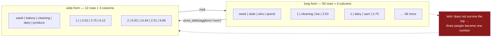

# 1.1 — One row per observation

## One-line answer

Seaborn is told **which column** to put on each part of the chart, so the frame you hand it must have
**one row for each thing that happened and one column for each fact about it** — a shape the chart
can address by name rather than by position.

---

## The story

The flat keeps a sheet of paper on the fridge door for the shopping.

It is drawn as a grid, because that is what anyone would draw. Twelve rows down the side, one for each
week. Four columns across the top, one for each aisle: bakery, cleaning, dairy, produce. When somebody
comes back from the shop they find the right box and add their number to whatever is already in it.

It works. Anybody can read it from across the kitchen, and the boxes add up to the month's total.

Then a question comes up at the end of the year. One person thinks they have been doing more than
their share of the cleaning-aisle trips, and wants to see it written down.

The sheet cannot answer. Not because the information was never there — different people really did buy
the washing-up liquid on different weeks — but because the moment somebody added their number to a
box, their trip and everyone else's trip became one number. The box for week three says `24.33`. It
does not say who, and there is nowhere on the sheet it could have said who, because the sheet has one
slot per week and aisle and that is all the slots there are.

So somebody digs out the receipts and types them up again, this time one line per trip: the week, the
aisle, who went, what it came to. Fifty lines. Uglier, longer, much harder to read across the kitchen
— and it can answer the question, and about forty others nobody has asked yet.

---

## The idea in plain language

An **observation** is one thing that happened, once. In this flat, one observation is *one shopping
trip*: a week, an aisle, a person, and an amount.

A **variable** is one fact you know about every observation. Here there are four: `week`, `aisle`,
`who`, `spend`.

Those two words give you a shape:

> **Long form** — sometimes called **tidy** form — is a table with **one row per observation and one
> column per variable**.

The fridge sheet is the other shape:

> **Wide form** is a table where the values of one variable have become **column headings**, and the
> cells hold a second variable's numbers.

On the fridge sheet, the aisle names stopped being data and became headings. `bakery` is not a value
in any column of that sheet; it *is* a column. That is the whole difference, and everything that
follows comes from it.

Two consequences matter today.

**In long form every fact has a name you can say.** "Colour the bars by `who`" is a sentence about the
table. On the fridge sheet there is no `who` to name, and there is no `aisle` either — there are four
columns whose *headings* happen to be aisles, which is not the same thing at all and cannot be
referred to in one word.

**Wide form makes you choose a question in advance.** The grid on the fridge answers "how much per
week per aisle" beautifully, and nothing else. Long form answers that one too, and per person, and per
person per aisle, and the same again for a variable nobody has thought of yet — because it never
collapsed anything to make the layout work.

A frame is a table of columns, each with one type — that is the object introduced in
[Day 26, 1.3](../../../day-26-frames-and-copy-on-write/parts/01-the-two-objects/1.3-a-table-of-columns.md),
and [Day 26, 1.4](../../../day-26-frames-and-copy-on-write/parts/01-the-two-objects/1.4-one-dtype-per-column.md)
is why each column holds one type and not one per cell. Long form is simply the arrangement of that
object in which every column is *one variable*.

The seaborn documentation calls these two shapes long-form and wide-form data, and its data-structures
page — *Data structures accepted by seaborn* (2024, <https://seaborn.pydata.org/tutorial/data_structure.html>)
— is worth reading beside this part; it is the page that decides what every function on this day is
allowed to do.

---

## Why Setu needs it

- **[1.2](1.2-the-chart-you-did-not-ask-for.md)** hands the fridge sheet to seaborn and watches what it
  can and cannot do with it.
- **[1.3](1.3-melt-and-what-it-cannot-bring-back.md)** turns the grid back into rows, and shows the
  part of it that cannot be turned back.
- **Every remaining part of this day** names columns: `x="aisle"`, `hue="who"`, `col="aisle"`. None of
  those sentences can be written about a wide frame.
- **Day 39** builds a correlation heatmap, which is the one chart on this phase that genuinely wants a
  wide table — so knowing which shape you are in stops being academic there.
- **Day 41** is the phase gate: eight charts in one figure pack. A pack built from eight differently
  shaped frames is eight separate debugging problems.
- **Day 162**'s retrieval evaluation table is long form for exactly this reason: one row per question
  per retriever per run, so a new retriever is new rows rather than a schema change.

---

## The mechanism

Here is the day's frame. Fifty shopping trips, built from a seed so that every number in every part of
this day is the same on your machine as on this page.

```python
import numpy as np
import pandas as pd

AISLES = ["bakery", "cleaning", "dairy", "produce"]
FLATMATES = ["kim", "lee", "sam"]
TYPICAL = {"bakery": 3.0, "cleaning": 7.0, "dairy": 5.0, "produce": 9.0}


def spending(seed: int = 38) -> pd.DataFrame:
    """Fifty shopping trips: one row per week, aisle and flatmate."""
    rng = np.random.default_rng(seed)
    every = pd.MultiIndex.from_product(
        [range(1, 13), AISLES, FLATMATES], names=["week", "aisle", "who"]
    ).to_frame(index=False)
    trips = every.iloc[np.sort(rng.choice(len(every), 50, replace=False))].reset_index(drop=True)
    trips["spend"] = np.round(trips["aisle"].map(TYPICAL).to_numpy() * rng.uniform(0.4, 1.9, 50), 2)
    return trips


print(spending().head())
print(spending().dtypes)
```

**Line by line:**

- `np.random.default_rng(seed)` — the generator object, not the old global `np.random.seed`
  ([Day 20, 4.1](../../../day-20-arrays-and-dtypes/parts/04-random/4.1-default-rng-the-generator.md)).
  A generator that is created inside the function and never shared is the only way two people get the
  same fifty trips.
- `seed: int = 38` — the day number, as a **named argument with a default** rather than a constant
  buried in the body, so a test can ask for a different flat's data without editing the module
  ([Day 20, 4.2](../../../day-20-arrays-and-dtypes/parts/04-random/4.2-the-seed-is-part-of-the-result.md)).
- `MultiIndex.from_product([...])` — every combination of twelve weeks, four aisles and three people:
  144 possible trips. `.to_frame(index=False)` turns that into an ordinary four-column frame rather
  than an index.
- `rng.choice(len(every), 50, replace=False)` — pick fifty of the 144 without repeats, because nobody
  buys from every aisle every week. This is what makes the data **unbalanced**, and section 5 needs
  that: a group with four rows and a group with fourteen do not deserve the same confidence.
- `np.sort(...)` around the choice — `choice` returns its picks in random order, and sorting the
  positions puts the trips back in week order. **The sort is for the reader, not for the maths**; a
  printed frame in week order is one you can check by eye.
- `.reset_index(drop=True)` — after `iloc` the index still carries the old positions, so the printed
  frame would start at row 3. `drop=True` throws the old numbers away instead of keeping them as a
  column.
- `trips["aisle"].map(TYPICAL)` — a bakery trip is smaller than a produce trip. Without this every
  aisle has the same average and every chart on the day is four bars of the same height.
- `rng.uniform(0.4, 1.9, 50)` — the spread around that typical amount. It is wide on purpose: section
  5 is about uncertainty, and data with no spread has none to show.
- `np.round(..., 2)` — money has two decimal places. Rounding here rather than at print time means the
  numbers in the frame and the numbers on the chart are the same numbers.

```text
   week     aisle  who  spend
0     1  cleaning  lee   3.53
1     1     dairy  sam   3.75
2     1   produce  lee   6.12
3     2    bakery  kim   2.17
4     2    bakery  lee   4.75

week       int64
aisle        str
who          str
spend    float64
dtype: object
```

Four columns, four variables, and every row is one trip. `aisle` and `who` come out as `str` — the
PyArrow-backed string dtype pandas 3.0 infers for text, described in
[Day 26, 2.3](../../../day-26-frames-and-copy-on-write/parts/02-the-str-dtype/2.3-the-storage-behind-it.md).
Nothing was cast by hand.

Now the fridge sheet, built from the same trips:

```python
trips = spending()
grid = trips.pivot_table(index="week", columns="aisle", values="spend", aggfunc="sum").round(2)
print(grid.head(4))
print("is there a 'who' column?", "who" in grid.columns)
```

**Line by line:**

- `pivot_table(index="week", columns="aisle", ...)` — this is the sheet being drawn. The **values of
  `aisle` become the column headings**, which is the definition of going wide.
- `values="spend"` — what goes in the boxes.
- `aggfunc="sum"` — and here is where the information leaves. Two people shopped the cleaning aisle in
  week three, for `11.38` and `12.95`; there is one box for week three and cleaning, so the two
  numbers are added into `24.33`. **Nothing warns you.** The function did exactly what it was told.
- `.round(2)` — sums of two-decimal numbers can pick up a third decimal from binary floating point, so
  the sheet is rounded once, at the point it is made.
- The last line is the whole story of this part in one boolean.

```text
aisle  bakery  cleaning  dairy  produce
week
1         NaN      3.53   3.75     6.12
2        6.92     14.94   2.51     9.86
3        1.33     24.33   4.69      NaN
4        6.29       NaN   9.76    22.20

is there a 'who' column? False
```

**Twelve rows became four columns of numbers and one lost variable.** The `NaN` boxes are weeks when
nobody bought from that aisle — real absences, which the long frame recorded by simply not having a
row.

The two shapes, side by side:



**The arrow back is not the reverse of the arrow out.** [1.3](1.3-melt-and-what-it-cannot-bring-back.md)
is about that gap.

---

## When it breaks

**Asking the grid for a column it no longer has:**

```text
$ uv run python -c "
import matplotlib
matplotlib.use('Agg')
import seaborn as sns
from spending import spending
grid = spending().pivot_table(index='week', columns='aisle', values='spend', aggfunc='sum')
sns.barplot(data=grid, x='week', y='dairy', hue='who')
"
```

```text
ValueError: Could not interpret value `who` for `hue`. An entry with this name does not appear in `data`.
```

**What it means.** Seaborn looked for a column called `who` in the frame you passed and there is not
one. The message is accurate and the cause is two steps upstream: `who` stopped existing when
`aggfunc="sum"` added three people together.

**The smallest fix is not to add the column back** — it is to plot from the long frame, which never
lost it. `sns.barplot(data=trips, x="week", y="spend", hue="who")` works because `trips` has all four
variables as columns.

**The same message for a subtler reason — an index level that lost its name:**

Seaborn will find a variable in the **index** as well as in the columns, as long as the index level is
named. `sns.barplot(data=grid, x="week", y="dairy")` works on the sheet above, even though `week` is
the index rather than a column, and draws eleven bars for twelve weeks — week nine has no dairy trip,
so there is nothing to draw. Take the name away and the same call stops working:

```text
$ uv run python -c "
import matplotlib
matplotlib.use('Agg')
import seaborn as sns
from spending import spending
grid = spending().pivot_table(index='week', columns='aisle', values='spend', aggfunc='sum')
grid.index = grid.index.rename(None)
sns.barplot(data=grid, x='week', y='dairy')
"
```

```text
ValueError: Could not interpret value `week` for `x`. An entry with this name does not appear in `data`.
```

**What it means.** The values are all still there. The *label* seaborn was looking them up by is gone,
so a lookup that has nothing to do with the numbers failed.

**The smallest fix is `grid.reset_index(names="week")`**, which moves the level into a real column
under a name you chose. The habit worth building is to stop relying on the index for plotting
variables at all: an index name is easy to lose — `reset_index()`, a `concat`, a round trip through
CSV — and a column name is not.

---

## In production

**What a professional writes instead of the teaching version.** They do not build long form by hand at
plot time. Long form is the shape the data is *stored* in, and the wide table is generated at the very
end, for a human to read:

```python
def trips_long(path: str) -> pd.DataFrame:
    """The receipts, one row per trip. The shape everything downstream reads."""
    trips = pd.read_csv(path, dtype={"aisle": "str", "who": "str"})
    required = ["week", "aisle", "who", "spend"]
    missing = [name for name in required if name not in trips.columns]
    if missing:
        raise KeyError(f"not long form: missing {missing}; have {list(trips.columns)}")
    return trips


def trips_for_the_fridge(trips: pd.DataFrame) -> pd.DataFrame:
    """The wide sheet a person reads. Built last, from the long frame, never stored."""
    return trips.pivot_table(index="week", columns="aisle", values="spend", aggfunc="sum").round(2)
```

**Line by line:**

- `dtype={"aisle": "str", "who": "str"}` stated rather than inferred — a CSV has no types in it
  ([Day 27, 1.1](../../../day-27-reading-and-writing/parts/01-the-csv/1.1-a-csv-has-no-types-in-it.md)),
  and a column of aisle codes like `07` becomes the integer 7 if you let it guess.
- The `required` check is four lines and it turns a `ValueError` from deep inside seaborn into a
  message naming the file you loaded. **The error you can act on is the one raised closest to the
  mistake.**
- `trips_for_the_fridge` returns the wide frame and **nobody saves it**. The moment a wide table is
  written to disk it becomes an input, and then a new aisle means a schema change.
- The docstrings say which shape each function is in. That sounds like a small thing until a codebase
  has thirty frames in it and half the arguments are called `df`.

**What changes at scale.** Long form is bigger, and how much bigger is worth knowing before it
surprises you. The fifty trips here are 2 219 bytes; the twelve-row grid is 480. A ratio near five, on
data this small, and the ratio grows with the number of variables, because every extra variable repeats
its label on every row.

Two things keep that affordable. The first is the **category** dtype: converting `aisle` and `who` to
categories takes the long frame from 2 219 bytes to 1 125, because each repeated label becomes a small
integer pointing into a list of four. The second is that you rarely need the whole long frame in
memory at once — the aggregation that a chart wants is a `groupby`, and a database or a columnar file
format does that without ever building the full table. **Day 31** is where `groupby` arrives, and
**Day 42** is where the same aggregation runs inside the database instead.

**The failure that only appears with real data.** A team stored a weekly metrics table wide — one
column per metric. Adding a metric meant an `ALTER TABLE`, so people stopped adding metrics and started
overloading existing ones, and eventually one column held two different things depending on the date.
Nothing broke loudly; the dashboard simply became untrustworthy over about a year. Long form has no
such pressure: a new metric is new rows, and the schema never moves.

**The review comment a senior engineer leaves.** *"This function takes `df` and pivots it before
plotting. Which shape does it expect on the way in? Name the frame `trips_long`, say so in the
docstring, and assert the four columns you need — a `KeyError` naming the missing column is worth more
than a `ValueError` from inside seaborn's parser."*

**The interview question.** *"What shape does your plotting library want its data in, and why?"* Long
form: one row per observation, one column per variable. The reason is that every plotting argument is
the **name of a column** — `x`, `y`, `hue`, `col` — so a variable that has become a set of column
headings cannot be named at all. Then the point that shows you have done it: going wide is
**lossy whenever it aggregates**. A pivot with `aggfunc="sum"` silently merges every observation
sharing a cell, and no melt brings those back. So the rule is to store long, keep every variable
addressable, and generate the wide table at the very end for a person to read.

---

## Check yourself

```bash
uv run python -c "
import pandas as pd
from spending import spending
trips = spending()
grid = trips.pivot_table(index='week', columns='aisle', values='spend', aggfunc='sum')
print('long  :', trips.shape, list(trips.columns))
print('wide  :', grid.shape, list(grid.columns))
print('rows behind week 3, cleaning:')
print(trips[(trips['week'] == 3) & (trips['aisle'] == 'cleaning')])
print('the one box that replaced them:', grid.loc[3, 'cleaning'].round(2))
"
```

Count the rows the last two lines print. Say how many numbers went into that box, and name the column
that stopped existing when they did.

**Answer out loud, without scrolling up:**

> Define an observation and a variable in terms of this flat's shopping. Then say what makes a table
> long form, and give the one-sentence reason a chart needs it — the reason that has nothing to do
> with tidiness and everything to do with what you are allowed to name.

---

**Next:** [1.2 — The chart you did not ask for](1.2-the-chart-you-did-not-ask-for.md).
